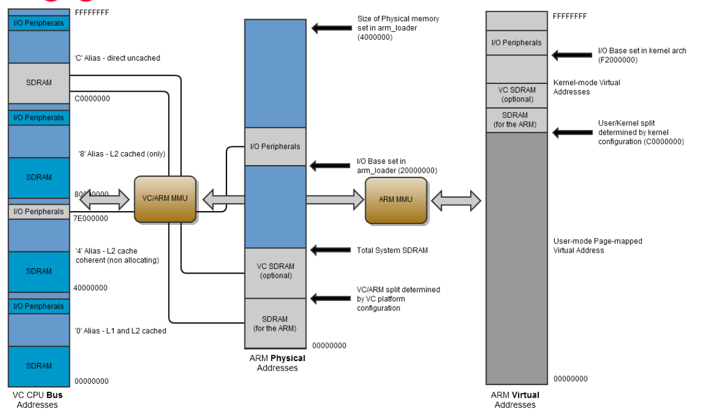

# 第1章 はじめに

## 1.1 概要

BCM2835にはARMから安全にアクセスできる次のペリフェラルが含まれています。

- タイマー
- 割り込みコントローラ
- GPIO
- USB
- PCM / 12S
- DMAコントローラ
- I2Cマスター
- I2C, SPI1, SPI2
- PWM
- UART0, UART1

このデータシートの目的は開発者がBCM2835にOSを移植できるようにこれらの
ペリフェラルに関する詳細なドキュメントを提供することです。

BCM2835にはGPUにより制御されることを意図しているペリフェラルが多数
ありますが、これらはこのデータシートから省かれています。これらの
ペリフェラルにARMからアクセスすることは推奨されません。

## 1.2 アドレスマップ

### 1.2.1 図解による概要

BCM2835にはARMのMMUの他に、ARMの物理アドレスをシステムバスのアドレスに
マッピングするための第2の粗視化MMUを搭載しています。この図は、関心のある
主要なアドレス空間を示したものです。



ARM Linuxのアドレスは

- まず、ARMコアで仮想アドレスとして発行され、
- 次に、ARM MMUで物理アドレスにマッピングされ、
- さらに、ARMマッピングMMUでバスアドレスにマッピングされ、
- 最後に、適切なペリフェラルやRAM上の位置を選択するために使用されます。

### 1.2.2 ARM仮想アドレス（標準的なLinuxカーネルのみ）

標準的な慣習として、標準的なBCM2835 Linuxカーネルはメモリの先頭から
利用可能なRAM全体にわたる連続的なマッピングを提供します。カーネルは
カーネル空間メモリとユーザ空間メモリを1GBと3GBに分割にするよう設定
されます。

ARMとGPUのメモリ分割は付属のstart*.elfファイルのいずれかをstart.elfとして
SDカードのFAT32ブートパーティションにインストールすることで選択します。
GPUに与えることができる最小のメモリ量は32MBですが、これはマルチメディアの
性能に制限を与えます。たとえば、32MBではGPUが1080p30のビデオデコードを
行うために必要なだけのバッファリングを提供することができません。

カーネルモードの仮想アドレスは0xC0000000から0xEFFFFFFFの範囲になります。

ユーザモードの（すなわち、ARM Linuxで実行中のプロセスから見える）仮想
アドレスは0x00000000から0xBFFFFFFFの範囲になります。

ペリフェラル（物理アドレス0x3F000000以降）はアドレス0xF2000000から始まる
カーネル仮想アドレス空間にマッピングされます。したがって、バスアドレス
0x7EnnnnnnでアドバタイズされるペリフェラルはARMカーネルでは仮想アドレス
0xF2nnnnnで利用できます。

### 1.2.3 ARM物理アドレス

RAMの物理アドレスは0x00000000から始まります。

- RAMのARMセクションは0x00000000から始まります。
- RAMのVideoCoreセクションは、システムがメモリマップドディスプレイを
  サポートするように構成されている場合のみマッピングされます（これは
  一般的なケースです）。

VideoCore MMUはARMの物理アドレス空間をVideoCore（とVideoCoreペリフェラル）が
参照するバスアドレス空間にマッピングします。RAMのバスアドレスは0xC0000000
から始まるVideoCoreのキャッシュされない[^1]バスアドレス範囲にマッピングされる
よう設定されています。

ペリフェラルの物理アドレスは0x3F000000から0x3FFFFFFの範囲です。ペリフェラルの
バスアドレスは0x7E000000から始まるペリフェラルバスアドレス範囲にマッピング
されるように設定されています。したがって、バスアドレス0x7Ennnnnnで
アドバタイズされるペリフェラルは物理アドレス0x3Fnnnnnnで利用できます。

### 1.2.4 バスアドレス

**この文書で指定されているペリフェラルのアドレスはバスアドレスです。**
周辺機器に直接アクセスするソフトウェアは上記のようにこれらのアドレスを
物理アドレスや仮想アドレスに変換する必要があります。DMAエンジンを使用して
ペリフェラルにアクセスするソフトウェアはバスアドレスを使用しなければ
なりません。

RAMに直接アクセスするソフトウェアは(0x00000000から始まる)物理アドレスを
使用しなければなりません。DMAエンジンを使用してRAMにアクセスするソフト
ウェアは(0xC0000000ベースから始まる)バスアドレスを使用しなければなりません。

## 1.3 正しいメモリ順序のための周辺アクセスに関する注意事項

BCM2835システムはAMBA AXI互換のインタフェース構造を使用しています。
システムの複雑性を低く、データスループットを高く保持するため、BCM2835 AXI
システムは必ずしも常にリードデータをインオーダーで返すわけではありません[^2]。
GPUはアウトオブオーダーで到着するデータに対処するための特別なロジックを
備えていますが、ARMコアはそのようなロジックを備えていません。そのため、
ARMを使用してペリフェラルにアクセスする場合にはいくつかの注意が必要です。

同じペリフェラルへのアクセスは常にインオーダーで到着し、インオーダーで
戻ります。データがアウトオブオブオーダーで到着する可能性のあるのは、
あるペリフェラルから別のペリフェラルに切り替わる時だけです。データがイン
オーダーに処理されることを保証する最も簡単な方法は、コードのクリティカルな
位置にメモリバリア命令を置くことです。以下のようにバリア命令を置く必要が
あります。

- あるペリフェラルへの最初の書き込みの前にメモリ書き込みバリアを置く。
- あるペリフェラルの最後の読み出しの後にメモリ読み出しバリアを置く。

**各**読み書きアクセスの後にメモリバリア命令を配置する必要は
**ありません**。置く必要のあるのはであるペリフェラルの読み書きの後に
別のペリフェラルの読み書きが続く可能性がある場所だけです。これは通常、
ペリフェラルサービスコードの入口と出口の地点です。

割り込みはコードのどこにでも発生する可能性があるのでそれらを保護する
必要があります。割り込みルーチンがペリフェラルを読み込む場合はメモリ
読み出しバリアから開始するべきです。また、割り込みルーチンがペリフェラルに
書き込む場合はメモリ書き込みバリアで終了するべきです。

## 脚注

[^1]: BCM2835は、128KBのシステムL2キャッシュを提供しており、これは主に
GPUにより使用されます。メモリアクセスは、バスアドレスの上位2ビットにより
L2キャッシュを経由するか、迂回するかが決まります。

[^2]: 通常、読み出し操作を2回実行した場合、プロセッサはデータが順番に
到着すると仮定します。つまり、ロケーションXから読み込んだ後にロケーションY
から読み込むと、まずロケーションXのデータが返され、その後にロケーションYの
データが返されるはずです。データが順番通りに到着しないと悲惨な結果になる
ことがあります。たとえば次の場合です。

```c
a_status = *pointer_to_peripheral_a;
b_status = *pointer_to_peripheral_b;
```

注意しないと、変数 a_statusとb_statusの値が入れ替わってしまう可能性が
あります。

書き込みが「間違って」行われることが理論的に可能性がありますが、それを
実現することは遥かに難しいことです。AXIシステムはデータが常に意図した
宛先にインオーダーで到着することを保証します。そのため

```c
*pointer_to_peripheral_a = value_a;
*Pointer_to_peripheral_b = value_b;
```

は常に期待通りの結果をもたらします。書き込みデータがアウトオブオーダーで
到着する可能性があるのは2つの異なるペリフェラルが同じ外部機器に接続されて
いる場合だけです。
