# 第7章 割込み

## 7.1 はじめに

ARMには2種類の割り込みソースがあります。

1. GPUペリフェラルから来る割り込み
2. ARMのローカル制御ペリフェラルから来る割り込み

ARMプロセッサは3種類の割り込みを取得します。

1. ARM固有のペリフェラルからの割り込み
2. GPUペリフェラルからの割り込み
3. 特別なイベント割り込み

ARM固有の割り込みは以下の通りです。

- タイマー
- 1つのメールボックス
- 2つのドアベル
- 2つのGPU停止割り込み
- 2つのアドレス/アクセス・エラー割り込み

MailboxとDoorbellレジスタは一般用途でははありません。

各割り込み要因（ARMまたはGPU）について、割り込みイネーブルビット
（リード/ライト）と割り込み保留ビット（リードオンリー）があります。
ARM制御ブロックが生成するすべての割り込みはレベル割り込みです。そのため、
すべての割り込みは割り込みが禁止されるか、割り込みソースがクリアされるまで
アサート状態が続きます。

ドアベル0, 1とメールボックス0からの割り込みはデフォルトではARMに送られます。
これはこれらのリソースはGPUが書き込み、ARMが読み出すことを意味します。
ドアベル2、3とメールボックス1については、その逆となります。

## 7.2 割込みの保留

割り込みベクタモジュールは実装されていません。割り込み処理を適切に行う
ために割り込み保留ビットが以下のように構成されています。

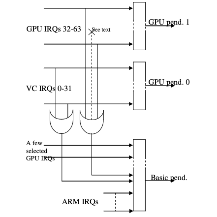

3つの割り込み保留レジスタがあります。基本保留レジスタが1つとGPU保留
レジスタが2つです。

### 基本保留レジスタ。

基本保留レジスタはARM固有の割り込みのための保留ビットを持ちます。

また、割り込み処理を高速化するために、ARMドライバで特に必要と思われる
GPU割り込みもいくつか選択して持っています。

さらに、他の2つのGPU保留レジスタにビットが設定されているかどうかを示す
2つの特別なGPU保留ビットがあります。そのうち、1番目のビットはGPU割り込み
0-31が保留されていることを示し、2番目のビットはGPU割り込み32-63が保留
されていることを示します。基本保留レジスタにある「選択されたGPU割り込み」
についてはこれら2つのステータスビットでは考慮されません。したがって、2つの
保留0, 1は「まだ他にもGPUに割り込みがある」ことを教えてくれます。

### GPU保留レジスタ。

2つのGPU保留レジスタがあり、各GPU割り込みソースごとに1ビットが対応します。

## 7.3 FIQ (高速割込み)

ARMは高速割り込み（FIQ）もサポートしています。ARM FIQ入力に接続する割り込み
ソースを1つ選択することができます。また、FIQイネーブルビットが1つあります。
FIQとして選択した割り込みについては通常の割り込みイネーブルビットをクリア
しておく必要があります。そうしないと通常割り込みとFIQ割り込みが同時に発生
します。これは良いアイデアではありません。

## 7.4 割り込み優先順位

すべての割り込みに優先順位はありません。ある割り込みが他よりもはるかに重要で
あるなるならFIQにルーティングすることができます。残りの割り込みは保留レジスタ
をポーリングして処理しなければなりません。たとえば、最初に特定のビットを探す
か、1ビットずつずらしながら処理するかなどはARMソフトの戦略次第です。

割込み処理中に割り込みが入る可能性があるので「レースコンディション
クリティカルな」コードには通常の注意を払う必要があります。以下のARMアセンブリ
コードは動作確認済みです。

```
    .macro get_irqnr_preamble, base, tmp
    ldr     \base, =IO_ADDRESS(ARMCTRL_IC_BASE)
    .endm

    .macro get_irqnr_and_base, irqnr, irqstat, base, tmp
    ldr     \irqstat, [\base, #(ARM_IRQ_PEND0 - ARMCTRL_IC_BASE)]   @ get marsked status
    mov     \irqnr, #(ARM_IRQ0_BASE + 31)
    and     \tmp, \irqstat, #0x300          @ save bits 8 and 9
    bics    \irqstat, \irqstat, #0x300      @ clear bits 8 and 9, and test
    bne     1010f

    tst     \tmp, #0x100
    ldrne   \irqstat, [\base, #(ARM_IRQ_PEND1 - ARMCTRL_IC_BASE)]
    movne   \irqnr, #(ARM_IRQ1_BASE + 31)
    @ Mask out the interrupts also present in PEND0 - see SW-5800
    bicne   \irqstat, #((1<<7) | (1<<9) | (1<<10))
    bicne   \irqstat, #((i<<18) | (1<<19))
    bne     1010f

    tst     \tmp, #0x200
    ldrne   \irqstat, [\base, #(ARM_IRQ_PEND2 - ARMCTRL_IC_BASE)]
    movne   \irqnr, #(ARM_IRQ2_BASE + 31)
    @ Mask out the interrupts also present in PEND0 - see SW-5800
    bicne   \irqstat, #((1<<21) | (1<<22) | (1<<23) | (1<<24) | (1<<25))
    bicne   \irqstat, #((i<<30))
    bne     1020f

1010:
    @ For non-zero M, LSB(x) = 31 - CLE(x^(x-1))
    @ N.B. CLZ is an ARM5 instruction.
    sub     \tmp, \irqstat, #1
    eor     \irqstat, \irqstat, \tmp
    clz     \temp, \irqstat
    sub     \irqnr, \tmp

1020:   @ EQ will be set if no irqs pending
```

## 7.5 レジスタ

ARM割込みレジスタのベースアドレスは0x7E00B000（これはバスアドレス。
物理アドレスは0x3F00B000）です。

<center><strong>レジスタ一覧</strong></center><br/>

| アドレスオフセット | レジスタ名 | 説明 |
|:-----------|:-----------|:-----|
| 0x200 | 基本保留 | |
| 0x204 | GPU1保留 | GPU IRQs  0 - 31 |
| 0x208 | GPU2保留 | GPU IRQs 32 - 63 |
| 0x20C | FIQ制御 | |
| 0x210 | イネーブルIRQ1 | GPU IRQs  0 - 31 |
| 0x214 | イネーブルIRQ2 | GPU IRQs 32 - 63 |
| 0x218 | イネーブル基本IRQ | |
| 0x21C | ディスエーブルIRQ1 | GPU IRQs  0 - 31 |
| 0x220 | ディスエーブルIRQ2 | GPU IRQs 32 - 63 |
| 0x224 | ディスエーブル基本IRQ | |

以下はARMが処理可能なペリフェラルを発生減とするすべての割り込みの一覧です。

<center><strong>ARMペリフェラル割込み表</strong></center><br/>

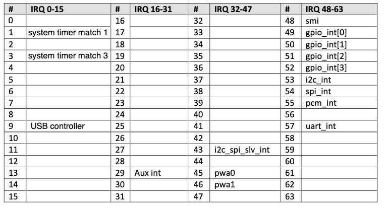

#### Circle (bcn2835ubt,g)から

| #  | IRQ 0-15    | #  | IRQ 16-31   | #  | IRQ 32-47   | #  | IRQ 48-63   |
|---:|:------------|---:|:------------|---:|:------------|---:|:------------|
|  0 | Timer0      | 16 | DMA0        | 32 | HostPort    | 48 | SMI |
|  1 | Timer1      | 17 | DMA1        | 33 | VideoScaler | 49 | GPIO0 |
|  2 | Timer2      | 18 | DMA2        | 34 | CCP2Tx      | 50 | DPIO1 |
|  3 | Timer3      | 19 | DMA3        | 35 | SDC         | 51 | GPIO2 |
|  4 | Codec0      | 20 | DMA4        | 36 | DSI0        | 52 | GPIO3 |
|  5 | Codec1      | 21 | DMA5        | 37 | AVE         | 53 | I2C |
|  6 | Codec2      | 22 | DMA6        | 38 | CAM0        | 54 | SPI |
|  7 | JPEG        | 23 | DMA7        | 39 | CAM1        | 55 | I2S PCM |
|  8 | ISP         | 24 | DMA8        | 40 | HDMI0       | 56 | SDIO |
|  9 | USB         | 25 | DMA9        | 41 | HDMI1       | 57 | UART |
| 10 | 3D          | 26 | DMA10       | 42 | Pixelvalve1 | 58 | SLIMBUS |
| 11 | Transposer  | 27 | DMA11       | 43 | I2C SPI SLV | 59 | VEC |
| 12 | Multicoresync0 | 28 | DMA_SHARED | 44 | DST1      | 60 | CPG |
| 13 | Multicoresync1 | 29 | AUX      | 45 | PWA0        | 61 | RNG |
| 14 | Multicoresync2 | 30 | ARM      | 46 | PWA1        | 62 | ARASAN SDIO |
| 15 | Multicoresync3 | 31 | VPUDMA   | 47 | CPR         | 63 | AVSPMON |

上の表には多くの空欄がありますが、これらはGPUの動作に支障をきたすため
有効化するべきはありません。

#### ARM固有の割込み表

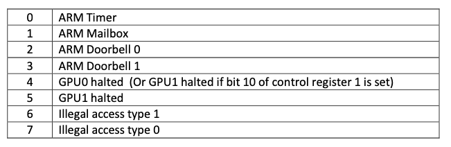


### 基本保留レジスタ

基本保留レジスタはどの割り込みが保留されているかを示します。割り込み処理を
高速化するために、このレジスタにいくつか「通常の」割り込みビット（選択GPU
保留ビットとGPUに保留有りビット）が追加されています。これが「IRQ基本保留」
レジスタと他の割り込みレジスタとの違いとなっています。

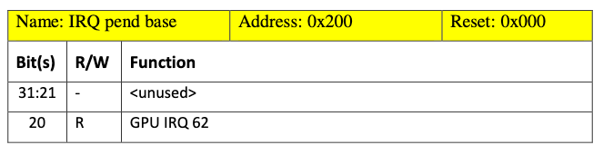
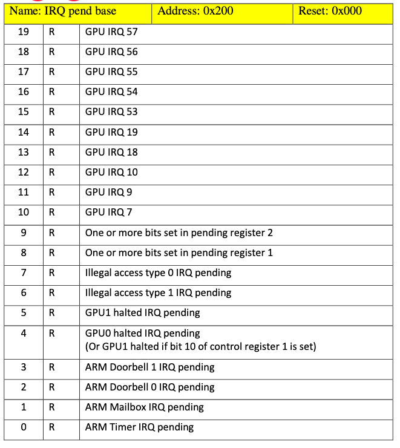

#### GPU IRQ x (ビット 10 - 20)

これらのビットはGPUから直接くる割り込みです。これらのビットはARMにとって
特に有用な割り込みとして選択されています。選択されたGPU割り込みは7, 9,
10, 18, 19, 53, 54, 55, 56, 57, 62 です。詳しくはGPU割り込み表を参照して
ください。

#### 保留レジスタ設定ビット (ビット 8, 9)

これらのビットはGPU保留レジスタ1/2のビットが設定されているか否かを示します。
GPU保留レジスタ1/2はGPU側からくるすべての割り込み0～63を保持します。これらの
64の割り込みの中には同時に基本保留レジスタに接続されているものもあります。
基本保留レジスタに接続されていない割込みがGPU保留レジスタ1/2で設定されると
このビット8または9が設定されます。これらステータスビット8と9は「あなたの
知らない割り込みがいくつか保留されていますよ。それらはGPU保留レジスタ1/2に
あります」と教えてくれます。

#### 不正アクセス type-0 IRQ (ビット 7)

このビットはARMプロセッサからのアドレス/アクセスエラーラインが割り込みを
発生させたことを示します。この信号はアドレスビット31または30が1 (high) に
なった場合、またはARMペリフェラルバスにアクセスがあった場合のいずれかで
アサートされます。この信号の状態は`Error/HALT`ステータスレジスタのビット2
から知ることができます。

#### 不正アクセス type-1 IRQ (ビット 6)

このビットはARM制御でアドレス/アクセスエラーが発生し、割り込みが発生した
ことを示します。これはアドレスビット29～26が1 (high) になった場合、または
GPUペリフェラルバスでバーストアクセスが見られた場合のいずれかでアサート
されます。この信号の状態は`Error/HALT`ステータスレジスタのビット0と1から
知ることができます。

#### GPU-1停止IRQ （ビット 5)

このビットはGPU-1の停止状態ビットにより割り込みが発生したことを示します。
この信号の状態は`Error/HALT`ステータスレジスタのビット4から知ることが
できます。

#### GPU-0 (あるいは任意のGPU)停止IRQ （ビット 4)

このビットはGPU-0の停止状態ビットにより割り込みが発生したことを示します。
この信号の状態は`Error/HALT`ステータスレジスタのビット3から知ることが
できます。

GPU 0またはGPU-1に対応する高速割込み（FIQ）ルーチンを可能にするために
GPU-1の停止状態もこのビットにルーティングさせるための設定ビットが
コントロールレジスタ1にあります。

#### 一般的なペリフェラルIRQ （ビット 0, 1, 2, 3）

これらのビットはARM固有のペリフェラルのいずれかの割込みが保留になっている
かを示します。

### GPU1保留レジスタ

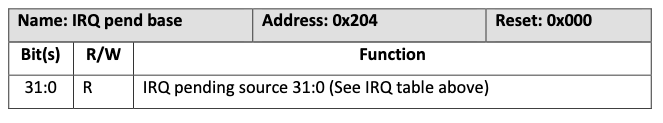

このレジスタはGPU側からくる割り込み0～31を保持します。これらの割り込みの
中には同時に基本保留レジスタに接続されているものもあります。基本保留
レジスタに接続されていない割り込みの状態は基本保留レジスタのビット8の
設定に影響を与えます。すわなち、7, 9, 10, 18, 19を除くすべてのビットの
いずれかが保留されると基本保留レジスタのビット8がセットされます。

### GPU2保留レジスタ

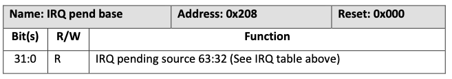

このレジスタはGPU側からくる割り込み32～63を保持します。これらの割り込みの
中には同時に基本保留レジスタに接続されているものもあります。基本保留
レジスタに接続されていない割り込みの状態は基本保留レジスタのビット9の
設定に影響を与えます。すわなち、53-57, 62を除くすべてのビットの
いずれかが保留されると基本保留レジスタのビット8がセットされます。

### FIQレジスタ

FIQレジスタはどの割込みソースがFIQを生成するのかを制御します。選択できる
割込みは1つだけです。

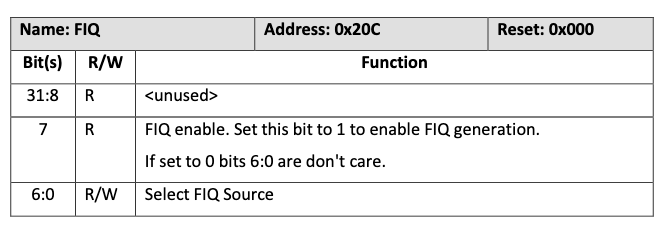

#### FIQソース

FIQソース値0-61はGPU割込み表に対応します。ARM固有の割込みをFIQベクタ/
ルーチンにルーティングするには次の値を使用します。

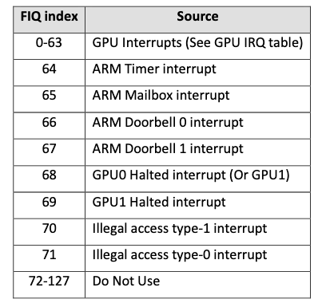

### イネーブルIRQ1レジスタ

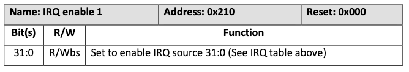

ビットに1を書き込むと対応するIRQイネーブルビットが設定されます。他の
すべてのIRQイネーブルビットは影響を受けません。有効になっているビットだけが
割り込み保留レジスタで見ることができます。保留中だがイネーブルでない
割り込みがあるか否かを確認する方法はありません。

### イネーブルIRQ2レジスタ


ビットに1を書き込むと対応するIRQイネーブルビットが設定されます。他の
すべてのIRQイネーブルビットは影響を受けません。有効になっているビットだけが
割り込み保留レジスタで見ることができます。保留中だがイネーブルでない
割り込みがあるか否かを確認する方法はありません。

### イネーブル基本IRQレジスタ

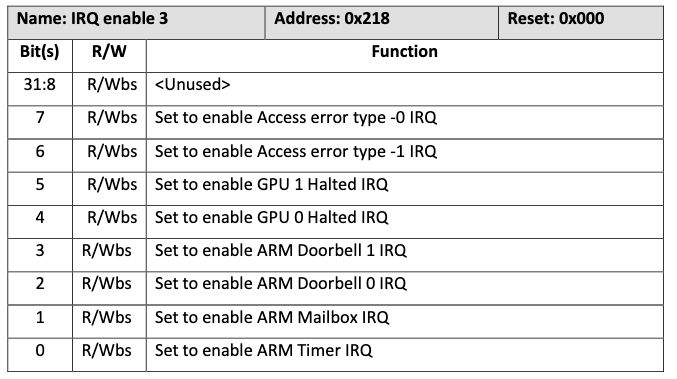

ビットに1を書き込むと対応するIRQイネーブルビットが設定されます。他の
すべてのIRQイネーブルビットは影響を受けません。有効になっているビットだけが
割り込み保留レジスタで見ることができます。保留中だがイネーブルでない
割り込みがあるか否かを確認する方法はありません。

### ディスエーブルIRQ1レジスタ

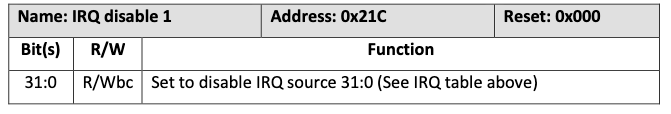

ビットに1を書き込むと対応するIRQイネーブルビットがクリアされます。他の
すべてのIRQイネーブルビットは影響を受けません。

### ディスエーブルIRQ2レジスタ


ビットに1を書き込むと対応するIRQイネーブルビットがクリアされます。他の
すべてのIRQイネーブルビットは影響を受けません。

### ディスエーブル基本IRQレジスタ

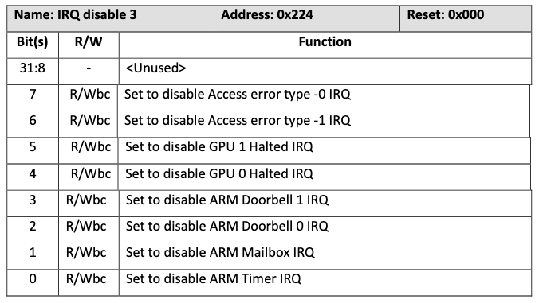

ビットに1を書き込むと対応するIRQイネーブルビットがクリアされます。他の
すべてのIRQイネーブルビットは影響を受けません。
