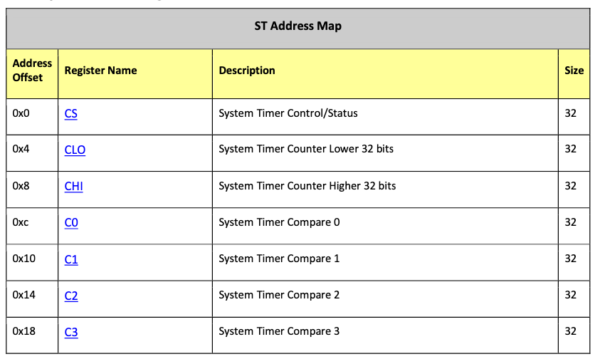
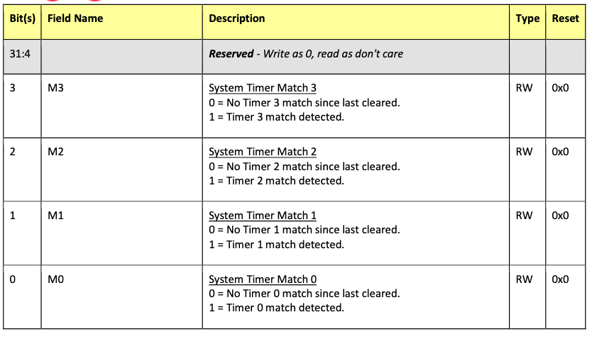
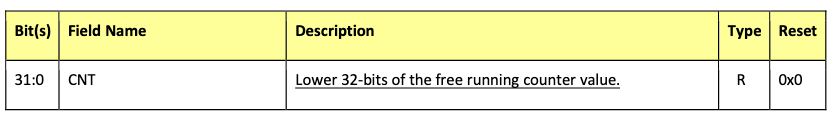
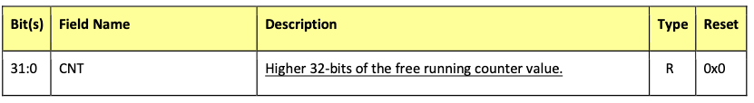
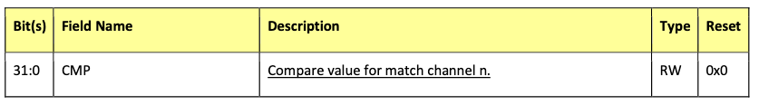

# 第12章 システムタイマー

システムタイマーは4つの32ビットタイマーチャネルと1つの64ビットフリー
ランニングカウンタを提供します。各チャンネルは出力比較レジスタを持ち、
この値とフリーランニングカウンタ値の最下位32ビットが比較されます。
2つの値が一致すると、システムタイマーは該当するチャンネルがマッチした
ことを示す信号を生成します。このマッチ信号は割り込みコントローラに
供給されます。割り込みサービスルーチンは出力比較レジスタを読み出し、
次のタイマティックに適切なオフセットを追加します。フリーランニング
カウンタは、タイマクロックにより駆動され、プロセッサがデバッグモードで
停止するたびに停止します。

システムタイマーの物理（ハードウェア）ベースアドレスは0x7E003000
（物理アドレスは0x3F003000）です。

## 12.1 システムタイマーレジスタ

### CS レジスタ

#### 概要

システムタイマー制御/状態レジスタです。

このレジスタはタイマーチャンネルコンパレータマッチの記録とクリアに
使用されます。システムタイマーのマッチビットは割り込みコントローラへ
送られ、そこで割り込みが発生されます。

`M0-3`フィールドはフリーランニングカウンタのマッチングステータスを
含んでいます。関連するビットに1を書き込むとマッチ検出ステータスビットと
対応する割り込みリクエストラインがクリアされます。

### CLO レジスタ

#### 概要

システムタイマーカウンタ下位ビットです。

システムタイマーフリーランニングカウンタ下位レジスタはリードオンリー
レジスタで、フリーランニングカウンターの下位32ビットの現在値を返します。

### CHI レジスタ

#### 概要

システムタイマーカウンタ上位ビットです。

システムタイマーフリーランニングカウンタ上位レジスタはリードオンリー
レジスタで、フリーランニングカウンターの上位32ビットの現在値を返します。

### C0 C1 C2 C3 レジスタ

#### 概要

システムタイマーコンパレータレジスタです。

システムタイマーコンペアレジスタは4つのタイマーチャンネルそれぞれの
コンペア値を保持します。フリーランニングカウンタの下位32ビットが
コンペア値の1つとマッチするたびに、システムタイマ制御/状態レジスタの
対応するビットが設定されます。各タイマーペリフェラル（minirunとrun）には
4つのコンペアレジスタがあります。

