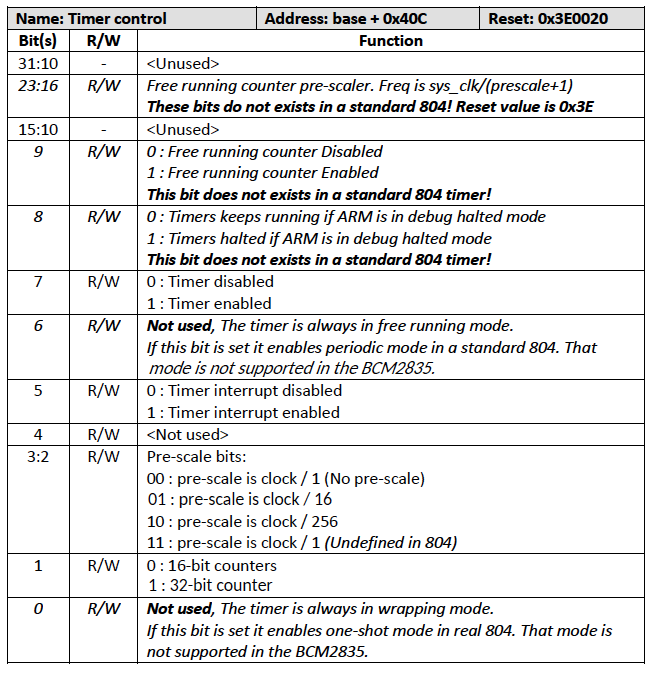
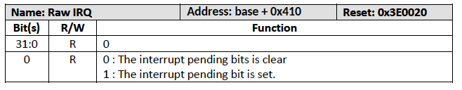
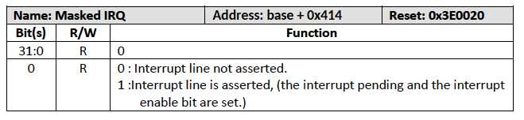
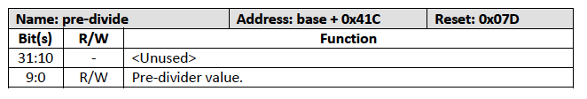
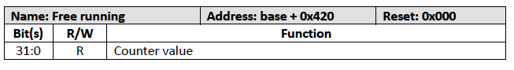

# 14. タイマー（ARM側）

## 14.2 はじめに

ARMタイマーはSP804をベースにしていますが、標準的なSP804とは異なる点が
数多く存在します。

- タイマは1つだけです。
- 連続モードでのみ動作します。
- クロックプリデバイダレジスタが追加されています。
- デバッグモードでの停止制御ビットが追加されています。
- 32ビットのフリーランニングカウンタを備えています。

ARMタイマーのクロックはシステムクロックに由来します。このクロックは
システムが低消費電力モードに移行した場合などに動的に変化します。
そのためクロック速度はシステムの全体的な性能に順応します。正確な
タイミングを得るには、システムタイマーを使用することをお勧めします。

## 14.2 タイマーレジスタ

ARMタイマーレジスタのベースアドレスは 0x7E00_B000 です。

| アドレスオフセット | 説明 |
| 0x400  | ロード           |
| 0x404  | 値（Read Only）  |
| 0x408  | コントロール     |
| 0x40C  | INQ クリア/Ack（Write Only）   |
| 0x410  | RAW IRQ（Read Only）           |
| 0x414  | マスクドIRQ（Read Only）       |
| 0x418  | リロード         |
| 0x41C  | 事前分周器（本来の804ではない）|
| 0x420  | フリーランニングカウンタ（本来の804ではない）|

### タイマーロードレジスタ

タイマーロードレジスタはタイマがカウントダウンする時間を設定します。この値は
ロードレジスタに書き込まれた後、またはタイマー値レジスタがカウントダウンされ
0になった場合にタイマ値レジスタにロードされます。

### タイマー値レジスタ

このレジスタは現在のタイマー値を保持し、カウンタの動作中はカウントダウン
されます。値が0になるまでタイマークロックごとにカウントダウンされます。
0になると、値レジスタはタイマーロードレジスタから再ロードされ、割り込み
保留ビットがセットされます。タイマーのカウントダウン速度はタイマー
事前分周器レジスタで設定されます。

### タイマーコントロールレジスタ

標準的なSP804タイマーコントロールレジスタは8ビットで構成されていますが、
BCMの実装では追加機能のためにコントロールビットが追加されています。
コントロールビット0-7はSP804と同じですが、SP804の一部の機能は実装されて
いません。新しいコントロールビットはすべて8ビット目以降から始まります。
本来の804とBCM実装の違いは、イタリック体で示されています。

### タイマーIRQクリアレジスタ

タイマーIRQクリアレジスタは書き込み専用レジスタです。このレジスタに書き込むと
割り込み保留ビットがクリアされます。

このレジスタを読み出すと0x544D5241が返されます。これはASCIIで"ARMT"を反転
した値であす。

### タイマーRawIRQレジスタ

イマーRawIRQレジスタは読み込み専用レジスタです。割り込み保留ビットの状態を
示します。

割り込み保留ビットは値レジスタが0になるたびにセットされます。このビットは
それ自体では割り込みを発生させることができません。割り込みイネーブルビットが
設定されている場合のみ割り込みを発生させることができます。

### タイマーマスクドIRQレジスタ

マスクドIRQレジスタは読み込専用レジスタです。割り込み信号の状態を示します。
これは単なる割り込み保留ビットと割り込みイネーブルビットの論理ANDです。

### タイマーリロードレジスタ

このレジスタはタイマーロードレジスタのコピーです。違いは、このレジスタへの
書き込みはタイマー値レジスタへの即時リロードをトリガしないことです。
タイマーロードレジスタの値は、値レジスタがゼロへのカウントダウンを終了した
場合にのみアクセスされます。

### タイマー事前事前分周器レジスタ

SP804には事前分周器レジスタはありません。

事前分周器レジスタは10ビット幅で、書き込みと読み込みが可能です。
このレジスタが追加された理由は、SP804が想定している1MHzのクロックを
BCMは持たないからです。事前分周器はAPBクロックを取り込み、以下のように
分周します。

    タイマークロック = APBクロック / (前置事前分周器 + 1)

このレジスタのリセット値は 0x7D で、126 分周となります。

### フリーランニングカウンタレジスタ

SP804にはフリーランニングカウンタはありません。

フリーランニングカウンタは32ビット幅の読み込み専用レジスタです。
このレジスタはタイマーコントロールレジスタのビット9をセットすることで
有効になります。フリーランニングカウンタは有効化されると直ちに増分が
開始されます。タイマーをリセットすることはできませんが、有効にすると
常に増分され、ロールオーバーされます。フリーランニングカウンタもAPB
クロックで動作しており、タイマーコントロールレジスタの16-23ビットで
制御される独自のクロック事前分周器を持っています。

コントロールレジスタのビット8がセットされ、ARMがデバッグ停止モードに
なると、このレジスタも停止します。

