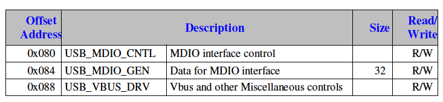
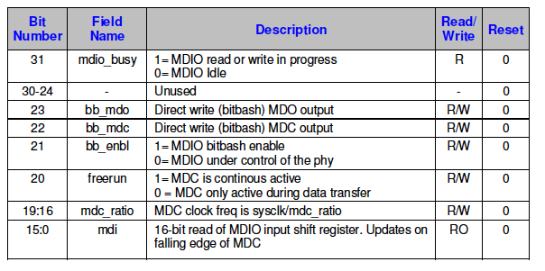
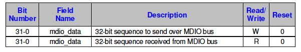
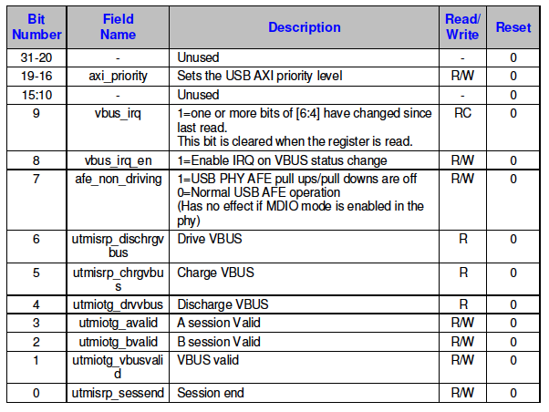

# 第15章 USB

Videocoreで使用されているUSBコアはSynopsys社のIPを使って構築されています。
これについての詳細はDWC_otg_databook.pdf（https://www.synopsys.com/dw/ipdir.php?ds=dwc_usb_2_0_hs_otg からダウンロードできます）に記載されています。

## 15.1 構成

USBの多くの機能はビルド前に指定されるため、ソフトウェアで変更することはできません。
上記ドキュメントの「構成パラメーター」の章にこれらのリストが
掲載されています。次の表はその章で言及されているすべての設定パラメータと選択
された値のリストです。

| 機能/パラメタ                                                                   | 選択値                                          |
| :------------------------------------------------------------------------------ | :---------------------------------------------- |
| 操作モード                                                                      | 0: HNP及びSRPの可能なOTG（デバイス&amp;ホスト） |
| 操作LPMモード                                                                   | 0: Non-LPM-capable core                         |
| HSIC操作モード                                                                  | 0: Non-HSIC-capable core                        |
| アーキテクチャ                                                                  | 2: Internal DMA                                 |
| P2Pアプリオンリー                                                               | 0: No                                           |
| High-Speed PHYインタフェース                                                    | 1: UTMI+                                        |
| USB 1.1 Full-Speedシリアル送受信インタフェース                                  | 1: Dedicated FS                                 |
| USB IC_USB送受信インタフェース                                                  | 0: Non-IC_USB-capable                           |
| デフォルト（パワーオン）インタフェース選択: FS_USB/IC_USB                       | 0: FS_USB Interface                             |
| UTMI+インタフェースのデータ幅                                                   | 0: 8 bits                                       |
| I2Cインタフェースの有効化                                                       | 0: None                                         |
| ULPI Carkitの有効化                                                             | 0: No                                           |
| PHYベンダ制御インタフェースの有効化                                             | 0: No                                           |
| コントロールEP0以外のデバイスモードEPの数                                       | 7                                               |
| デバイスIN EP専用送信FIFOの有効化                                               | 1: Yes                                          |
| デスクリプタベースのscatter/gather DMAの有効化                                  | 0: No                                           |
| EP固有の割り込みオプションの有効化                                              | 0: No                                           |
| デバイスモード周期IN EPの数                                                     | 0                                               |
| コントロールEP0を含むデバイスモードIN EPの数                                    | 8                                               |
| EP0を除くデバイスモードコントロールEPの数                                       | 0                                               |
| ホストモードチャネルの数                                                        | 8                                               |
| ホストモードで周期OUTチャネルのサポートが必要か                                 | 1: Yes                                          |
| 総データFIFO RAM Depth                                                          | 4096                                            |
| 動的FIFOサイジングの有効化                                                      | 1: Yes                                          |
| 最大RxデータFIFO Depth                                                          | 4096                                            |
| 最大非周期ホストTxデータFIFO Depth                                              | 1024                                            |
| 最大非周期TxデータFIFO Depth                                                    | 4096                                            |
| 最大ホストモードTx周期データFIFO Depth                                          | 4096                                            |
| 非周期リクエストキューDepth                                                     | 8                                               |
| ホストモード周期リクエストキューDepth                                           | 8                                               |
| デバイスモードINトークンシーケンス学習キューDepth                               | 8                                               |
| 転送サイズカウンター幅                                                          | 19                                              |
| パケットカウンター幅                                                            | 10                                              |
| オプション機能の削除                                                            | 0: No                                           |
| ユーザIDレジスタのパワーオン値                                                  | 0x2708A000                                      |
| パワー最適化の有効化                                                            | 0: No                                           |
| 最小AHB走査周波数は60MHz未満か                                                  | 1: Yes                                          |
| RTLにおける常時クロックブロックのリセットスタイル                               | 0: Asynchronous                                 |
| 二重動機フロップのインスタンス化                                                | 1: Yes                                          |
| PHYからの"iddig"シグナルのフィルタリングの有効化                                | 1: Yes                                          |
| PHYからの"vbus_valid"シグナルのフィルタリングの有効化                           | 1: Yes                                          |
| PHYからの"a_valid"シグナルのフィルタリングの有効化                              | 1: Yes                                          |
| PHYからの"b_valid"シグナルのフィルタリングの有効化                              | 1: Yes                                          |
| PHYからの"session_end"シグナルのフィルタリングの有効化                          | 1: Yes                                          |
| EPの方向                                                                        | すべてのEPでモードは（INとOUT）                 |
| 最大デバイスモード周期TxデータFIFO n Depth                                      | (EP0を除く)すべてのEPで768                      |
| 動的FIFOサイジング使用時の最大デバイスモードIN EP Tx FIFO n Depth (n = 0 to 15) | 0 = 32 <br/>1-5 = 512<br/>6,7 = 768             |

## 15.2 Extra / Adaptedレジスタ

Synopsysのドキュメントに記載されているレジスタの他にいくつかのレジスタが
追加されています。これらのレジスタはアナログUSB Phyと、VideoCoreバス構造体への
USBブロックの接続を制御します。また、USB_GAHBCFGレジスタは[4:1]ビットに別の機能を
持たせています。

USBブロックのベースアドレスは 0x7E98_0000 です。



### USB MDIO Control (USB_MDIO_CNTL)

アドレス: `0x7E98 0080`



### USB MDIO Data (USB_MDIO_DATA)

アドレス: `0x7E98 0084`



プリアンブルは自動生成されないので、MDIOアクセスをする際には常にこのレジスタに
`0xFFFFFFFF`を書き込んでからアクセスしなければなりません。さらに、USB PHYのバグの
ため余分なクロックエッジが必要なので実際のアクセスの後に`0x00000000`を書き込む
必要があります。

### USB VBUS (USB_VBUS)

アドレス: `0x7E98 0088`



このレジスタのRWビットはUSB2.0コントローラに入力され、ROビットはコントローラから
出力されます。実機では、この情報をUSB2.0コントローラと外部VBUSデバイス（I2C制御の
ものもあれば、GPIOでインタフェースするものもあります）の間で通信するのはソフト
ウェアに任されることになります。

### USB AHB構成 (USB_GAHBCFG)

アドレス: `0x7E98 0008`

USB_GAHBCFGレジスタは変更されています。Synopsysのドキュメントで"Burst Length/
Type (HBstLen)"と説明されている [4:1] ビットは、異なる方法で使用されています。

```
[4] 1 = 未処理のAXI書き込みがすべて完了するのを待ってからDMAの完了を
        （内部で）シグナリングする。
    0 = 待たない
[3] 未使用
[2:1] 最大AXIバースト長を設定するが、ビット指定は逆です。
    00 = 最大AXIバースト長 4
    01 = 最大AXIバースト長 3
    10 = 最大AXIバースト長 2
    11 = 最大AXIバースト長 1
```


## circle/include/dwhci.hより

### USB ホストコントローラレジスタ

#### 基底アドレス
| 種別 | 基底アドレス |
|:-----|-------------:|
| コア   | 0x3F980000 |
| ホスト | 0x3F980400 |
| 電源   | 0x3F980E00 |

#### コアレジスタ: `0x3F980000`相対

| アドレス     | レジスタ名        | 説明                                      |
|:-------------|:------------------|:------------------------------------------|
| 0x000 | CORE_OTG_CTRL | OTG制御 |
| 0x004 | CORE_OTG_INT | OTG割り込み |
| 0x008 | CORE_AHB_CFG | AHB制御 |
| 0x00C | CORE_USB_CFG | USB制御 |
| 0x010 | CORE_RESET | リセット |
| 0x014 | CORE_INT_STAT | 割り込みステート |
| 0x018 | CORE_INT_MASK | 割り込みマスク |
| 0x01C | CORE_RX_STAT_RD | 受信ステートREAD |
| 0x020 | CORE_RX_STAT_POP | 受信ステートPOP |
| 0x024 | CORE_RX_FIFO_SIZ | 受信FIFOサイズ |
| 0x028 | CORE_NPER_TX_FIFO_SIZ | 非周期送信FIFOサイズ |
| 0x02C | CORE_NPER_TX_STAT | 非周期送信ステート |
| 0x030 | CORE_I2C_CTRL | I2C制御 |
| 0x034 | CORE_PHY_VENDOR_CTRL | PHYベンダー制御 |
| 0x038 | CORE_GPIO | GPIO |
| 0x03C | CORE_USER_ID | ユーザID |
| 0x040 | CORE_VENDOR_ID | ベンダーID |
| 0x044 | CORE_HW_CFG1 | ハードウェア制御1 |
| 0x048 | CORE_HW_CFG2 | ハードウェア制御2 |
| 0x04C | CORE_HW_CFG3 | ハードウェア制御3 |
| 0x050 | CORE_HW_CFG4 | ハードウェア制御4 |
| 0x054 | CORE_LPM_CFG | LPM(Link Power Management)制御 |
| 0x058 | CORE_POWER_DOWN | パワーダウン |
| 0x05C | CORE_DFIFO_CFG | DFIFO制御 |
| 0x060 | CORE_ADP_CTRL | アタッチ検出プロトコル(ADP)制御 |
| 0x080 | VENDOR_MDIO_CTRL | ベンダーMDIO制御 |
| 0x084 | VENDOR_MDIO_DATA | ベンダーMDIOデータ |
| 0x088 | VENDOR_VBUS_DRV | ベンダーVBUSドライブ |
| 0x100 | CORE_HOST_PER_TX_FIFO_SIZ | ホスト周期送信FIFOサイズ |
| 0x104 + 4 * i | CORE_DEV_(PER_)TX_FIFO(i) | デバイス(周期)送信FIFO |

#### ホストレジスタ: `0x3F980400`相対

| アドレス     | レジスタ名        | 説明                                      |
|:-------------|:------------------|:------------------------------------------|
| 0x000 | HOST_CFG | ホスト制御 |
| 0x004 | HOST_FRM_INTERVAL | フレームインターバル |
| 0x008 | HOST_FRM_NUM | フレーム番号 |
| 0x010 | HOST_PER_TX_FIFO_STAT | 周期送信FIFOステータス |
| 0x014 | HOST_ALLCHAN_INT | 全チャネル割り込み |
| 0x018 | HOST_ALLCHAN_INT_MASK | 全チャネル割り込みマスク |
| 0x01C | HOST_FRMLST_BASE | フレームリスト基底 |
| 0x040 | HOST_PORT | ホストポート |
| 0x100 + 0x20 * i | HOST_CHAN_CHARACTER(i) | チャネル特性 |
| 0x104 + 0x20 * i | HOST_CHAN_SPLIT_CTRL(i) | チャネル分割制御 |
| 0x108 + 0x20 * i | HOST_CHAN_INT(i) | チャネル割り込み |
| 0x10C + 0x20 * i | HOST_CHAN_INT_MASK(i) | チャネル割り込みマスク |
| 0x110 + 0x20 * i | HOST_CHAN_XFER_SIZ(i) | チャネル転送サイズ |
| 0x114 + 0x20 * i | HOST_CHAN_DMA_ADDR(i) | チャネルDMAアドレス |
| 0x11C + 0x20 * i | HOST_CHAN_DMA_BUF(i) | チャネルDMAバッファ |
| 0x1000 + 0x1000 * i | DATA_FIFO(i) | データFIFO（非DMAモードのみ） |
