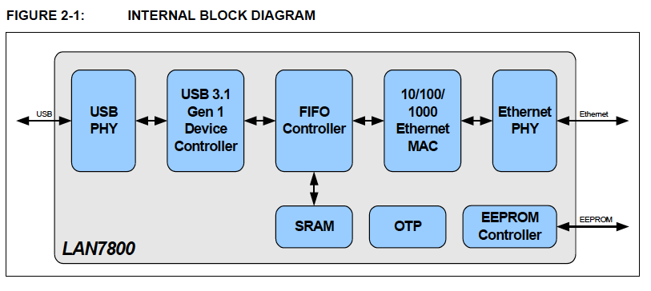

# 第2章 はじめに

## 2.1 概要

LAN7800は、高性能なSuperSpeed USB 3.1 Gen1 - 10/100/1000 Ethernetコントローラで
あり、10/100/1000 Ethernet PHYを内蔵しています。ノートPCやタブレットドッキング
ステーション、セットトップボックス、PVR、USBポートリプリケータ、USBイーサネット
ドングル、組み込みシステム、テスト機器など幅広いアプリケーションに対応し、高性能で
コスト効率の高いUSBイーサネット接続ソリューションです。

LAN7800は、統合化された10/100/1000イーサネットMACとPHY、フィルタリングエンジン、
USB PHY、SuperSpeed USB 3.1 Gen1デバイスコントローラ、EEPROMコントローラ、内部
パケットバッファリング付きFIFOコントローラを有しています。

内臓のUSB 3.1 Gen 1デバイスコントローラとUSB PHYは、USB 3.1 Gen 1 SuperSpeed規格に
準拠しています。LAN7800は、コントロール、インタラプト、バルクイン、バルクアウトの
USBエンドポイントを実装しています。

イーサネットコントローラは、オートネゴシエーション、自動極性補正、HP Auto-MDIXを
サポートし、IEEE 802.3, IEEE 802.3u, IEEE 802.3ab, 802.3az (Energy Efficient
Ethernet) 規格に準拠しています。ARPとNSオフロードもサポートされています。

Energy Efficient Etherne (IEEE 802.3az) やMicrosoftのAlways On Always Connected
(AOAC) のサポート、"Magic Packet"、"Wake On LAN"、"Link Status Change"ウェイク
イベントなど、複数の電源管理機能が提供されています。ウェイクイベントはUSBリモート
ウェイクアップを開始するようにプログラムすることができます。最大32種類のAOAC
ウェイクアップフレームパターンとMicrosoft社のWPD (Whole Packet Detection) を
サポートしています。

内蔵EEPROMコントローラは、USBとイーサネットの様々な設定パラメータをロードするために
存在します。EEPROMを使用しないアプリケーション向けにLAN7800は1KバイトのOTPメモリを
提供しており、エヌメレーション前に同じ設定データをプリロードすることができます。

LAN7800は、商用および産業用温度範囲に対応したバージョンがあります。LAN7800の
内部ブロック図を図2-1に示しました。

