# 第５章 USBデバイスコントローラ

## 5.1 概要

USBの機能は大きく5つの部分: USB PHY、UDC（USBデバイスコントローラ）、URX
（USBバルクアウトレシーバ）、UTX（USBバルクイントランスミッタ）、CTL
（USBコントロールブロック）で構成されています。

UDCは、1つのコンフィギュレーション、1つのインタフェース、1つの代替設定、
4つのエンドポイントをサポートするように構成されています。このデバイスでは
ストリームはサポートされていません。URXとUTXは、それぞれバルクアウトエンド
ポイントとバルクインのエンドポイントを実装しています。CTLは、コントロール
エンドポイントとインターラプトエンドポイントを管理します。

USBコントローラの各エンドポイントは単方向であり、偶数番号のエンドポイントは
OUT（ホストから、実際にはデバイスへのRX）方向を処理し、奇数番号のエンド
ポイントはIN（ホストへ、実際にはデバイスからのTX）方向を処理します。

UDCのエンドポイント番号は0から始まり、増分されます。エンドポイント番号に
飛び番はなく、USBエンドポイント番号に固定的にマッピングされます。対応する
USBエンドポイントは、UDCエンドポイント番号を2で割る（切り捨て）ことで
得られます。たとえば、単一方向エンドポイント0はUSB OUTエンドポイント0を示し、
単一方向エンドポイント1はUSB INエンドポイント0に対応します。

デバイスのUSBエンドポイントとUDCエンドポイントのマッピングを表5-1に示します。
このように、UDC上のINエンドポイントの1つとOUTエンドポイントの2つは利用され
ません。

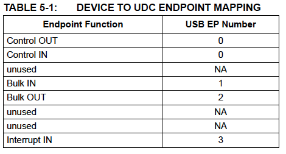

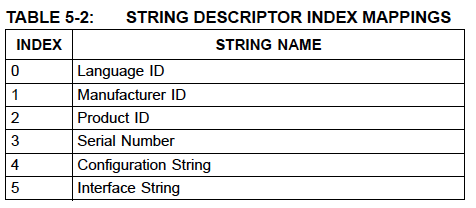

## 5.2 コントロールエンドポイント

コントロールエンドポイントはCTL（USB Control）モジュールにより処理されます。
CTLモジュールは標準的なUSBリクエストとUSBベンダーコマンドの処理を担当します。
UDCはUSBコマンドを処理しません。これらのコマンドはCTLに渡され処理されます。

### 5.2.1 USB標準コマンドの処理

この節ではサポートされているUSB標準デバイスリクエストをリストアップします。
デバイスリクエストの基本フォーマットはUSB 2.0および3.1 Gen 1仕様書の9.3節に
示されており、標準デバイスリクエストは9.4節に記載されています。パラメータの
有効な値を以下に示します。

USB仕様によれば、USBデバイスに対して未サポートまたは無効なリクエストを行った
場合、デバイスはリクエストのDataステージまたはStatusステージでSTALLを返すことで
応答します。未サポートまたは無効なリクエストを受信してもコントロールパイプの
オプション機能であるHaltは設定されません。

サポートされている各リクエストについて、様々な構成状態におけるデバイスの動作と
リクエストエラーを返す条件についての詳細をUSB仕様は提供しています。いくつかの
リクエストがハードウェアの状態に影響します。USB 3.1 Gen 1仕様書の表9-9は様々な
パラメータに影響を与えるイベントをリストアップしています。

`Get Descriptor`コマンドを実装するために、CTLは128x32のDescriptor RAMを
管理します。システムリセットが発生するとこれらのRAMの内容はEEPROMまたは
OTPから初期化されます。Descriptor RAMはEEPROM-Lessモードをサポートするために
デバイスドライバでプログラムすることもできます

UDCはGet DescriptorコマンドをデコードしてCTLにポインタを渡します。CTLは
このポインタを用いて、コマンドが何であるか、どのようにそれを処理するかを
決定します。

#### 5.2.1.1 Clear Feature

このリクエストはUSB 2.0(HS, FS)モードとUSB3.1 Gen1 (SS)モードで異なります。

##### 5.2.1.1.1 USB2.0

- `bmRequestType` - デバイスの場合は00h、インタフェースの場合は01h、エンド
  ポイントの場合は02hです。
- `wValue` - 機能を指定します。1=Device_Remote_Wakeup、0=Endpoint_Halt
- `wIndex` - デバイスが選択された場合は常に0、インタフェースが選択された場合は
  インタフェース番号 (常に0)、エンドポイントが選択された場合は方向/エンドポイント番号 (0, 80h, 81h, 2, 83hのいずれか)

`ClearFeature(Endpoint_Halt)`リクエストは指定されたエンドポイントのUSB2.0データ
トグルをクリアします。

##### 5.2.1.1.2 USB 3.1 Gen 1

- `bmRequestType` - デバイスの場合は00h、インタフェースの場合は01h、エンド
  ポイントの場合は02hです。
- `wValue` - 機能を指定します。0=Endpoint_Halt (エンドポイントの場合)、
  0=Function_Suspend (インタフェースの場合)、48=U1_Enable、49=U2_Enable、
  50=LTM_Enable
- `wIndex` - デバイスが選択された場合は常に0、インタフェースが選択された場合は
  インタフェース番号(常に0)、エンドポイントが選択された場合は方向/エンド
  ポイント番号 (0, 80h, 81h, 2, 83hのいずれか)。

`ClearFeature(Endpoint_Halt)`リクエストは指定されたエンドポイントのUSB 3.1 Gen1シーケンス番号をリセットします。

#### 5.2.1.2 Get Configuration

すべてのパラメータはUSB仕様書通りに固定されています。

#### 5.2.1.3 Get Descriptor

- `wValue `- 上位バイトはディスクリプタタイプを選択します。このコマンドで
  サポートされているディスクリプタは、1=Device、2=Configuration (Interface,
  Endpoint descriptors, Endpoint Companion descriptors (USB 2.1 LPM/USB 3.1
  Gen 1)), 3=String, 6=Device Qualifier (HS/FS), 7=Other Speed Configuration
  (USB2.0), 15=BOS (USB3.1 Gen 1 only)。

  下位バイトはディスクリプタインデックスを選択し、0でなければなりません。

> 注: このコマンドではインタフェース、エンドポイント、エンドポイント
> コンパニオン（USB2.1 LPM/USB3.1 Gen 1）の各ディスクリプタへの直接アクセスは
> サポートされておらず、USBストールの原因となります。また、このコマンドでは
> USB 2.0モードからのUSB 3.1 Gen 1固有のディスクリプタへのアクセスとUSB 3.1
> Gen 1モードからのHS/FSディスクリプタへのアクセスはサポートされておらず、
> USBストールを引き起こします。

- `wIndex `- ストリングディスクリプタの場合は言語IDを指定し、それ以外の
  ディスクリプタの場合は0
- `wLength` - 返すバイト数を指定します。ディスクリプタがwLengthフィールドより
  長い場合はディスクリプタの先頭バイトだけが返されます。ディスクリプタが
  wLengthフィールドより短い場合は、デバイスは、さらなるデータが要求されたときに
  ショートパケットを送信することによりコントロール転送の終了を示します。
  ショートパケットとは、最大ペイロードサイズより短いパケット、または長さが0の
  データパケットであると定義されています。

#### 5.2.1.4 Get Interface

- `wIndex` - インタフェースを指定します。このデバイスでは常に0です。

#### 5.2.1.5 Get Status

- `bmRequestType` - デバイスの場合は00h、インタフェースの場合は01h、
  エンドポイントの場合は02hを指定。
- `wIndex` - デバイスを選択した場合は常に0、インタフェースの場合は
  インタフェース番号（常に0）、エンドポイントの場合は方向/エンドポイント
  番号（0、80h、81h、2、83hのいずれか）。

> 注: USB3.1 Gen1（SS）モードでは、wIndexの下位バイトのみがエンドポイント
> 番号として使用されます。
>
> デバイスに対して返されるデータはUSB 2.0 (FS, HS) モードと USB 3.1 Gen 1 (SS)
> モードで異なり、USB 3.1 Gen 1 モードでは、LTM Enable、U2 Enabled、U1 Enabled
> も返されます。また、USB3.1 Gen1(SS)モードではRemote Wakeupフィールドは予約
> されており、0を返す必要があります。
>
> 最初のインタフェースに対して返されるデータはUSB 2.0 (FS, HS) モードと
> USB 3.1 Gen 1 (SS)モードで異なり、USB3.1 Gen1(SS)モードでは、Function
> Remote WakeupとFunction Remote Wakeup Capableが返されます。

> 注: Haradware ConfigurationレジスタのPower Method (PWR_SEL)がSelf-Power
> ビット（D0）のソースとして使用されます。

#### 5.2.1.6 Set Address

- `wValue` - 新しいデバイス・アドレスを指定します。

USBの仕様では、このリクエストのStatusステージが正常に完了するまで、USB
デバイスはそのデバイスアドレスを変更しません。これはこのリクエストと他の
すべてのリクエストとの違いです。他のすべてのリクエストではStatusステージの
前に指定された動作は完了しなければなりません。

#### 5.2.1.7 Set Configuration

- `wValue` - 下位バイトはConfiguration値を指定します。

このデバイスはコンフィグレーションを1つしかサポートしていません。値`1`は
デバイスをコンフィギュレーション状態にし、値`0`はデバイスをアドレス状態に
します。

有効なコンフィギュレーション値を持つこのリクエストを受信すると*すべての*
エンドポイントについて停止機能がリセットされます。

有効なコンフィギュレーション値を持つこのリクエストを受信すると*すべての*
エンドポイントについてUSB 2.0データトグルとUSB 3.1 Gen 1のシーケンス番号が
初期化されます。

#### 5.2.1.8 Set Descriptor

このオプションのリクエストはサポートされておらず、デバイスはSTALLを返すことで
応答します。

#### 5.2.1.9 Set Feature

このリクエストはUSB 2.0 (HS, FS)と USB 3.1 Gen1 (SS)モードで異なります。

##### 5.2.1.9.1 USB 2.0

- `bmRequestType` - デバイスの場合は00h、インタフェースの場合は01h、
  エンドポイントの場合は02h
- `wValue` - 機能を指定します。1 = Device_Remote_Wakeup、2 = Device Test_Mode、
  0 = Endpoint_Halt

  > 注: エンドポイント0にはエンドポイント停止は実装されていません。

- `windex` - インタフェースを選択した場合はインタフェース番号(常に0)、
  エンドポイントを選択した場合は方向/エンドポイント番号(81h、2、83h)を
  指定します。デバイスを選択した場合は、wValueでデバイスのTest_Modeを選択
  した場合以外はこのフィールドは常に0です。Test_Modeを選択した場合は
  上位バイトはテストセレクタ、下位バイトは0にします。

##### 5.2.1.9.2 USB 3.1 Gen1

- `bmRequestType` - デバイスの場合は00h、インタフェースの場合は01h、
  エンドポイントの場合は02h
- `wValue` - 機能を指定します。0 = Endpoint_Halt (エンドポイント用)、
  0 = Function_Suspend (インタフェース用)、48 = U1_Enabe、49 = U2_Enable、
  50 = LTM_Enable

 > 注: エンドポイント0にはエンドポイント停止は実装されていません。

- `wIndex` - エンドポイントを選択した場合、下位バイトには方向/エンドポイント
  番号（81h、2または83h）を指定し、デバイスが選択された場合、このフィールドは
  常に0であり、インタフェースの場合、下位バイトはインタフェースを指定します
  （常に0）。Function_Suspend機能では、上位バイトにサスペンドオプションを
  指定します。ビット0 = 低電力サスペンド状態、ビット1 = ファンクション
  リモートウェイクイネーブル

#### 5.2.1.10 Set Interface

- `wValue` - 代替設定を指定します (必ず0)。
- `wIndex` - インタフェースを指定します (常に0)。

このデバイスがサポートしているのは設定を1つ持つインタフェースを1つだけです。
00h以外のインターフェースを持つコマンドが発行された場合、デバイスはリクエスト
エラーで応答します。インタフェースは00hだが代替設定に00h以外が設定された
コマンドが発行された場合、デバイスはSTALLで応答します。

有効なインタフェースと代替設定値を持つこのリクエストを受信すると*すべての*
エンドポイントについて停止機能がリセットされます。

有効なインタフェースと代替設定値を持つこのリクエストを受信すると*すべての*
エンドポイントについてUSB 2.0データトグルとUSB 3.1 Gen 1のシーケンス番号が
初期化されます。

#### 5.2.1.11 Set Isochronous Delay

すべてのパラメータは、USB 3.1 Gen 1の仕様書通りです。

アイソクロナスエンドポイントは存在しませんが、このデバイスはこのリクエストを
受け入れ、静かに破棄しなければなりません。

> 注: このコマンドはUSB 3.1 Gen1でのみサポートされます。スーパースピード
> モードで動作していない場合、デバイスはこのリクエストをStallさせます。

#### 5.2.1.12 Set SEL

すべてのパラメータは、USB 3.1 Gen 1の仕様書通りです。

このコマンドはこのデバイスで受理されます。U1 Exit Latencyレジスタ
 (U1_LATENCY)とU2 Exit Latencyレジスタ (U2_LATENCY)がそれに応じて更新されます。
USB Statusレジスタ（USB_STATUS）のSET Selct（SET_SEL）とInterrupt status
レジスタ（INT_STS）のUSB Status Interrupt（USB_STS_INT）もアサートされます。設定されている場合、インターラプトエンドポイントでUSB_STS_INTでアサートされます。

> 注: このコマンドはUSB 3.1 Gen1でのみサポートされます。スーパースピード
> モードで動作していない場合、デバイスはこのリクエストをStallさせます。

#### 5.2.1.13 Sync Frame

このデバイスにはアイソクロナスエンドポイントは存在しません。このデバイスは
このリクエストに対してStallで応答します。

### 5.2.2 USBベンダーコマンド

このデバイスは、CSRに直接アクセスしたり、統計を効率的に収集するために
ベンダ固有のコマンドを実装しています。アドレスフィールドにより利用される
メモリマップは145ページの「表 15-1 メモリマップ」に定義されています。

#### 5.2.2.1 Writeコマンド

このコマンドを使ってホストはメモリロケーションに書き込むことができます。
バーストWriteはサポートされていません。すべての書き込みは32ビットです。

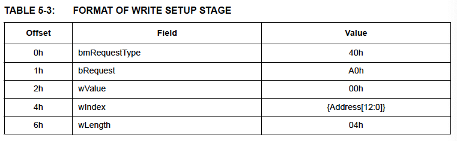

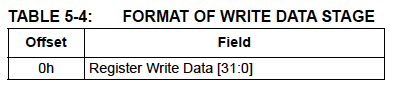

#### 5.2.2.2 Readコマンド

このコマンドを使ってホストはメモリロケーションを読むことができます。
バーストReadはサポートされていません。すべての読み取りは32ビットです。

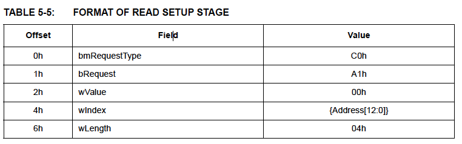

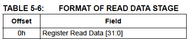

#### 5.2.2.3 Get Statisticsコマンド

Get StatisticsコマンドはRXとTXの統計カウンタのすべての内容を返します。
統計カウンタはコマンドリクエストを満たす際のスナップショットです。
統計カウンタはロールオーバされます。

> 注: TX統計カウンタはデバイスがサスペンドされている際にNS/ARPリクエストに
> 応答して送信されたフレームの影響は受けません。
>
> Good byteと受信フレームカウンタはHostに配信されたすべてのフレームを
> カウントします。FIFO Controller RX FIFO Controlレジスタ（FCT_RX_CTL）で
> Store Bad Framesが設定されている場合、受信したすべての不良フレームも
> 同様にカウントされます。
>
> 統計カウンタはLRSTを含むすべてのリセットイベントによりクリアされます。

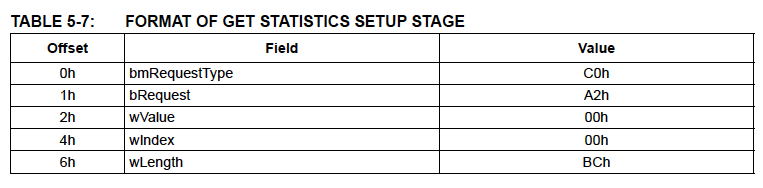

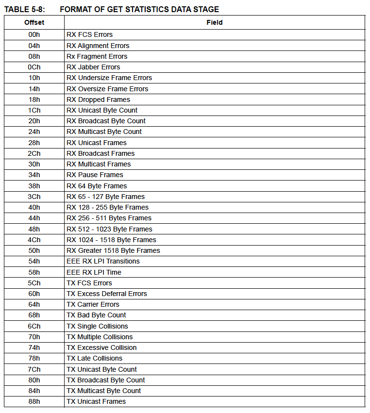
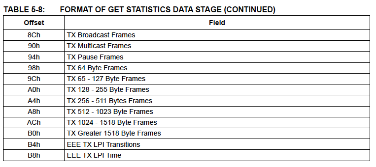

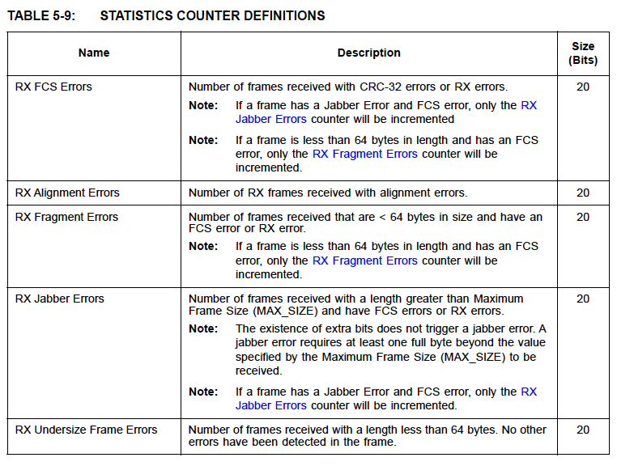
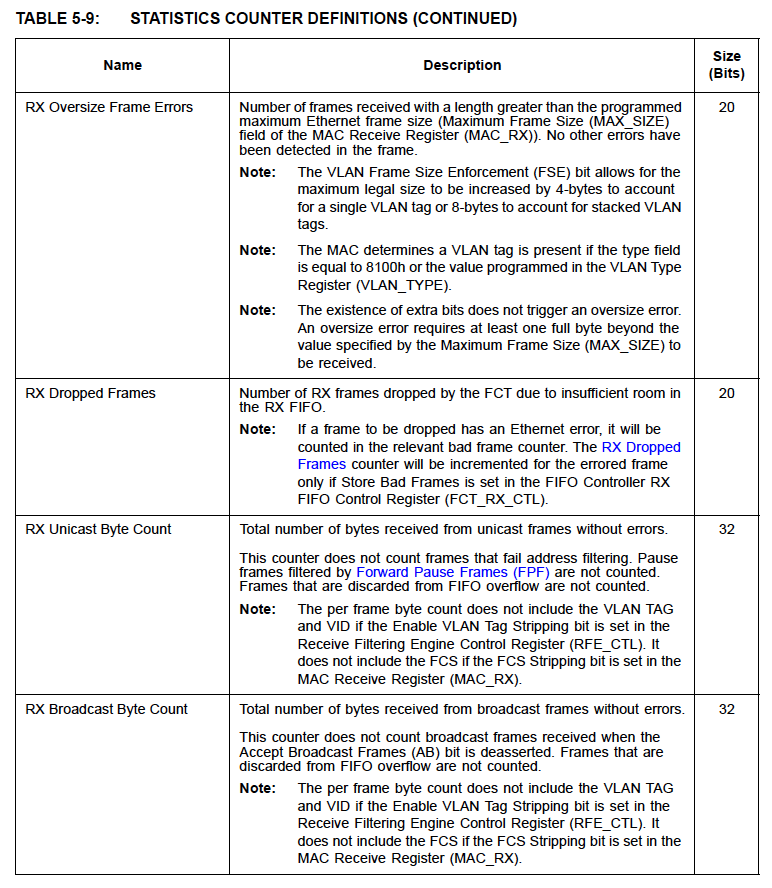
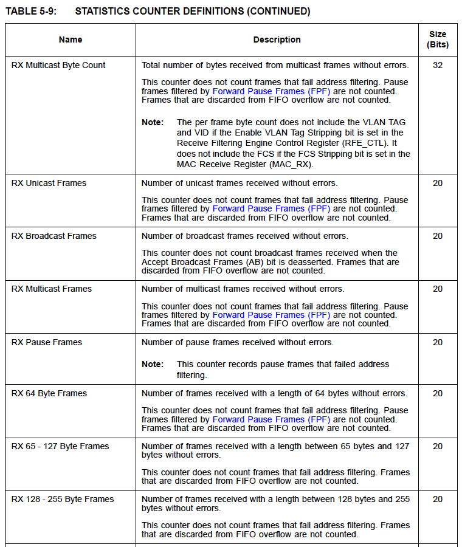
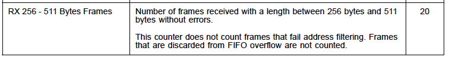
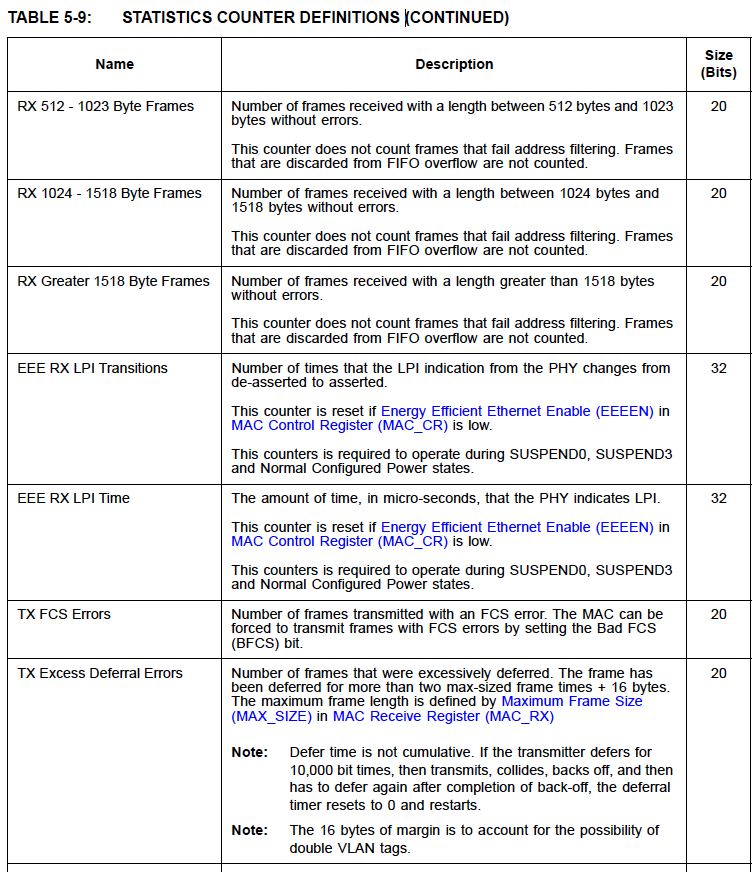
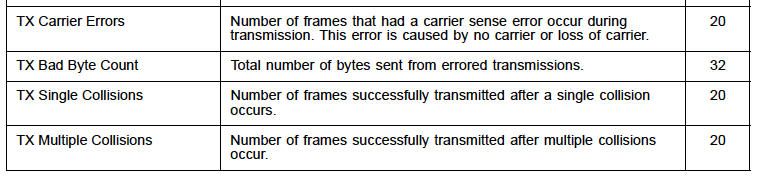
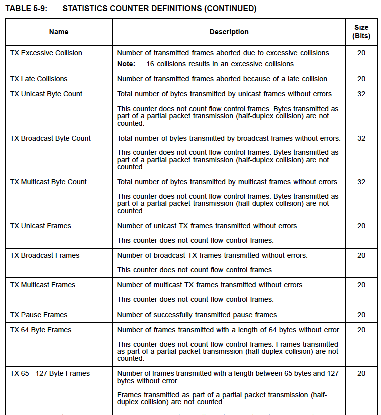
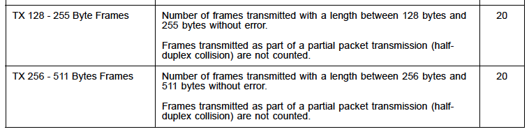
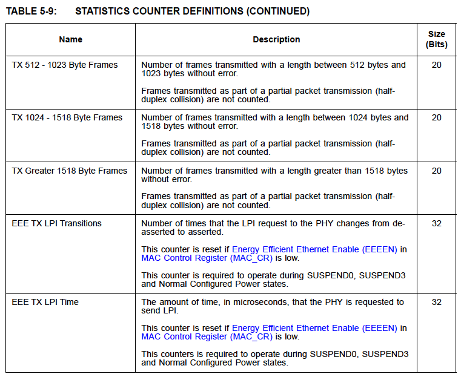

### 5.2.3 ディスクリプタRAM

コントロールエンドポイントは、USBディスクリプタを含むデバイスの様々な
コンフィギュレーションを保存する内部ディスクリプタRAMを操作します。通常、
ディスクリプタRAMは外部EEPROMか内蔵のOTPからロードされます。しかし、ホスト
ソフトウェアがディスクリプタRAMを直接構成できるEEPROMレスモードという
メカニズムも存在します。これについては「10.6 EEPROMによらｒないカスタマイズ
操作」で説明します。ディスクリプタRAMのフォーマットについては「10.6.3
ディスクリプタRAMの初期化」で説明されています。

コントロールエンドポイントは、まず、EEPROMシグネチャの認識に成功するかを
調べて外部EEPROMが存在するか否かを評価します。EEPROMが存在する場合は、
その内容をディスクリプタRAMにロードします。

EEPROMが存在しない場合、コントロールエンドポイントはOTPが設定されているか
検査します。OTPが設定されている場合はOTPをディスクリプタRAMのロードに使用
します。

EEPROMが存在せず、OTPが設定されていない場合、コントロールエンドポイントは
「10.5 EEPROMデフォルト」に定義されているとおりにCSRとEEPROMデフォルトを
利用してデバイスを設定します。

EEPROMレス操作はホストソフトウェアによって呼び出すことができます。この
モードは、外部EEPROMやOTPの設定よりも優先されます。このモードについては
「10.6 EEPROMによらないカスタマイズ操作」で説明されています。

## 5.3 Bulk In エンドポイント

Bulk In エンドポイントはUTX（USB Bulk In Transmitter）により制御されます。
UTXはイーサネットデータをUSBバルクインパケットにカプセル化する役割を担って
います。イーサネットフレームはFCTのRX FIFOから取り出され、UDCに渡されます。
UTXは8KBのUTX FIFO Bufferを管理します。FCTからのUSBパケットはここに一時的に
格納され、効率的なバーストとSuperSpeed動作のための4Gbpsのラインレートを
容易にします。バースト動作をサポートするためにUTXはUSB Command FIFOを管理し
パケット長を追跡します。

### 5.3.1 USB TXデータFIFO

UTXデータFIFO RAM は2K×32（8KB）のデュアルポートタイプです。すべてのUSB
パケットはUSB TXデータFIFOにDWORDでアライメントされます。すべてのイーサ
ネットフレームはUSBパケットにDWORDでアラインされます。（MEFモードが有効だと
仮定すると）USB転送では連続したイーサネットフレームは同じDWORDに連結され
ません。イーサネットフレーム（最後のフレームではないと仮定する）の最後のDWORD
の未使用バイト（最大3バイト）はUSBパケットとその長さに含まれ、ホストドライバ
ソフトウェアによって破棄されます。USB転送の終了時には未使用バイト（最大
3バイト）はUSBパケットとその長さに含まれません。USBデバイスコントローラは
DWORD内の未使用バイトを破棄します。

### 5.3.2 USB TXコマンドFIFO

イーサネットフレームがUSB TXデータFIFOに転送されると、その結果得られたUSB
パケット長（長さ0のパケットを含む）がUSB TXコマンドFIFOに書き込まれます。
USBデバイスコントローラはUSBの転送を開始するにあたってパケット長とパケット
数を必要とします。

USBコマンドFIFOのサイズは最大32パケットまでキューに入れることができます。
この数はUSB TXデータFIFOの8Kバイトサイズを平均的なUSBパケットサイズ256バイト
で割ったものです（たとえば、＠512バイトパケット16個、ゼロ長パケット16個など）。
USB TXデータFIFOより先にUSB TXコマンドFIFOがフルになることもあり得るので
USB TXコマンドFIFOはフル信号を提供します。

USB TX Command FIFOの先頭エントリ（USBパケット長）と深さ（エントリ数）は
各々USBパケット長と使用可能パケット数としてUSBデバイスコントローラに渡され
ます。

### 5.3.3 MEF/SEF動作

UTXは次の2つの動作モードをサポートしています。2つの動作モードMEFとSEFは
Hardware COnfigurationレジスタ (HW_CFG)のMultiple Ethernet Frames per USB
Packet (MEF)ビットで選択します。

- MEF: Bulk Inパケットに複数のイーサネットフレーム。このモードではUSB
  パケットに複数のイーサネットフレームをパックすることでUSBバスの使用率を
  最大化します。最大USBパケットサイズより大きなフレームは複数のBulk In
  パケットに分割されます。
- SEF: Bulk Inパケットに1つのイーサネットフレーム。このモードはUSBバスの
  使用率を最大化しませんが、ホストソフトウェアの実装を簡素化し、ローエンドの
  ホストプロセッサの負担を軽減できる可能性があります。最大USBパケットサイズ
  より大きいフレームは複数のバルクインパケットに分割されます。

各イーサネットフレームの先頭にはFCTにより3つのRXコマンドワード（RXコマンドA、
RXコマンドB、RXコマンドC）が追加されます。RXコマンドAは，UTXがカプセル化
機能を実行するために使用したフレーム長を含んでいます、コマンドワードの内容は
MAC、RFE、FCTによって生成されます。

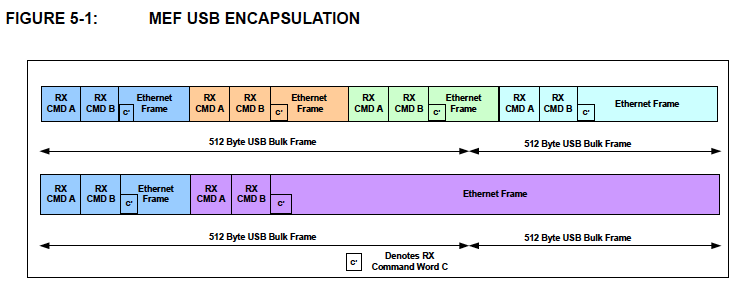

イーサネットフレーム（RXコマンドAで始まる）はFCTでは常にDWORD境界で始まります。
MEFモードでは、UTXは現在のフレームの最後と次のフレームの先頭を同じDWORDに
連結しません。そのため、次のフレームのRXコマンドAをDWORDアライメントするために
イーサネットフレームの最後のDWORDには未使用バイトが追加される場合があります。
フレーム末尾に詰め物バイトを追加するか否かは現在のフレームの後に送信可能な
別のフレームがあるかによります。現在のフレームが最後のフレームである場合は
USBプロトコルはバイト境界でパケットを終了させることができるため詰め物バイトは
追加されません。しかし、別のフレームが送信可能な場合、現在のフレームはDWORD
境界で終了するようにパディングされます。これにより、RXコマンドAから始まる次の
送信フレームが確実にDWORD境界で開始されることになります。

フレーム末尾のDWORDに追加された未使用のバイトはRXコマンドAの長さフィールド
にはカウントされません。

5.3.1節で述べたように、UTXはUSBパケットをUTXデータFIFOに格納する役割を担って
います。USBパケットの長さを計算する際、イーサネットフレーム間のDWORD
パディングは含まれます。

USBプロトコルに従い、UTXはZLPまたはBulk In最大パケットサイズ（SSは1024、
HSは512、FSは64）より小さいサイズのBulk Inパケットでバーストを終了させます。
ZLPは送信データの合計がBulk In最大パケットサイズの倍数である場合に必要と
されます。UTXはUTXデータFIFOサイズを監視してバーストの終了を判断します。

UTXはFCTからのRX FIFOサイズ信号を監視し、FCTによるイーサネットフレームの受信
が完了しスペースに余裕があるときにデータをUTXデータFIFOに移動させます。
フレームが移動されるとその長さが作成中のUSBパケットのパケット長に組み込まれ
ます。USBパケットの作成が完了するとUTXコマンドFIFOにエントリーが書き込まれ
ます。イーサネットフレームがUSBパケットに収まらない場合、残りは後続のUSB
パケットに移動されます。

SSバーストのサイズはUSB Configurationレジスタ (USB_CFG0)のBuild-In Super-
speed Maximum Burst Size (MAX_BURST_BULKIN)フィールドにより制限されます。

> 注: SEFモードでは、イーサネットフレームのサイズがBuld-In最大パケット
> サイズと同じ、またはBuld-In最大パケットの倍数の場合にZLPが送信されます。
>
> ホストは、イーサネットフレーム末尾のDWORDに存在する未使用バイトを無視します。
>
> SEFモードを使用する場合、末尾アライメントパディング用に未使用バイトが
> 追加されることはありません。USB転送は常にイーサネットフレームの最後の
> バイトで終了します。
>
> RX FIFOが空のときにUTXがBulk Inトークンを受信した場合、Bulk In Empty
> Response (BIR) が設定されている場合はZLPを送信し、設定されていなければ
> NAK (FS/HS) またはNRDY (SS) を送信します。

UTXは、Burst Cap Usageで説明したようにバーストキャップ機能によるUSBバーストの
サイズを制限する機構を提供しています。これは、ZLPで終了する前にUSB転送で移動
可能なデータ量の上限を設定するものです。バーストキャップ機能はすべての動作
速度に適用されます。

MEFモードでUSBの帯域をより効率的に利用するために、UTXはショートパケット
（すなわち、ZLP）の送信を遅延させるメカニズムを備えています。このモードでは、
UTXはBulk-In Delayレジスタ (BULK_IN_DLY) で定義された時間だけ待ってから
バーストを終了させます。このレジスタの値が0の場合、この機能は無効になります。
デフォルトでは34 usの遅延が使用されます。

バースト内の最後のUSB bMaxPacketSizeパケットを送信した後、UTXは内部タイマーを
有効にします。このタイマーがBulk In Delayと等しくなると、UTXデータFIFO内の
Bulk Inデータがホストへの次の機会に送信されます。

HS/FSモードでは、タイマーが切れる前に少なくとも1つの最大サイズのパケットを
構築するのに足るデータが到着した場合、UTXは次のBulk In Tokenを受信した際に
このパケットを送信します。パケット送信後、UTXは内部タイマーをリセットし、
上記のBulk In Delay時間が経過するか、新しいデータを受信するまでショート
パケット（ZLP）の送信を遅らせます。

SSモードの動作も上記と同様ですが、UTXはバースト送信するのに十分なデータが
蓄積されているか確認してからUSB送信を行います。バースト送信後、UTXは内部
タイマーをリセットし、上記のBulk In Delay時間が経過するか、新しいデータを
受信するまでショートパケット（ZLP）の送信を遅らせます。

UTXデータFIFOが空で、USB bMaxPacketSize未満のイーサネットパケットを一つ
受信した場合、UTXは内部タイマーを有効にします。タイマーが切れる前に最大
サイズのパケットが少なくとも1つ、またはSSのバーストを構築するのに足る
データが到着した場合、UTXはこのパケットを送信してタイマーをリセットします。
そうでない場合、FIFOデータはタイマーが切れた後に送信されます。

HS/FSモードでは、UTXは新しいデータとBulk In Delayの経過を待つ間、あらゆる
Bulk InトークンをNAKします。SSモードでは、NRDYで応答します。

Bulk In DelayはMEF動作のみを意図しており、SEFモードには適していません。

### 5.3.4 USBのAckとリトライ

エラーが発生した場合、UTXはFCTに巻き戻しを発行します。これはUTXがBulk-In
パケットの送信を完了ししたが、ホストからACKを受信しない場合に発生します。
この場合、UTXが受信する次のフレームは別のInトークンとなり、Bulk Inパケットが
再送信されます。最終的にACKが受信されると、UTXはFCTに通知します。これにより
FCTはリードヘッドポインタを次のパケットに進めます。

USBのTXデータFIFOとコマンドFIFOの両者がUSBのリトライを処理します。USB 3.1
Gen 1のバーストではその性質により、送信されたがまだ確認されていない複数の
パケットが存在する場合があります。また、あるパケットとそれに続くすべての
パケットをリトライする必要がある場合があります。そのため、パケットのコマンド
情報とペイロードは確認応答があるまで解放することができません。USBパケットが
確認されたら、そのコマンド情報をUSB TXコマンドFIFOから削除し、そのストレージを
USB TXデータFIFOから解放することができます（長さが0のパケットはUSB TXデータ
FIFOスペースを解放しないことに注意してください）。

#### バーストキャップの使用

UTXはBurst Capレジスタ (BURST_CAP) を使うことでバーストを早期に終了させる
ことができます。Burst Capレジスタ (BURST_CAP) はUSBパケットサイズ(64/512/
1024byte)単位で使用されます。Burst Capレジスタの使用を有効にするには
USB Conigurationレジスタ0 (USB_CFG0)のBurst Cap Enable (BCE) ビットを設定
する必要があります。

適切な動作のために、BURST_CAPフィールドは以下の関係が成立するように
ソフトウェアによって設定されるべきです。

SS動作の場合、BURST_CAP * 1024 >= 最大フレームサイズ(MAX_SIZE)

HS動作の場合、BURST_CAP * 512 >= 最大フレームサイズ(MAX_SIZE)

FS動作の場合、BURST_CAP * 64 >= 最大フレームサイズ(MAX_SIZE)

BURST_CAPの値を上記の規則に従って設定しないと、動作に支障をきたし、
予期せぬ結果をもたらす可能性があります。

> 注: バーストの最初のイーサネットフレームは常にBURST_CAPを超えているか
> 否かを確認せずに送信されます。

Burst Cap Enforcementが無効でRX FIFOとUTX FIFOが空の場合、UTXは
Bulk-In Empty Response (BIR) = "0 "であればZLPで、BIR="1"であれば
NAK (FS/HS)またはNRDY (SS)で応答します。

Burst Cap Enforcementが有効の場合は常に以下のようになります。

- SS 動作の場合:
  BURSTMax = BURST_CAP * 1024
- HS動作の場合:
  BURSTMax = BURST_CAP * 512
- FS動作の場合:
  BURSTMax = BURST_CAP * 64

ここで、

BURSTCur = 現在のバーストの長さ = 現在のバースト内のフレーム長の合計

LENGTHNext = RX FIFOで利用可能な次のフレームの長さ

である。

RX FIFOがデータ不足になるか、フレームが利用可能で (BURSTCur + LENGTHNext >
BURSTMax) の場合、バーストはUSBショートパケットかZLPで終了されます。

そうでなければ、次のフレームはBURST_CAPを超えることなく現在のバーストに
収まることができます。バーストは継続され、BURSTCurはLENGTHNextだけ足されます。

> 注: FIFO Controller RX FIFO Controlレジスタ (FCT_RX_CTL)のStore Bad Frames
> が設定されている場合、送信バーストのサイズはBURST_CAPで指定された値を超える
> ことができます。これは，BURST_CAPよりも大きな特大フレームを受信した場合に
> 発生する可能性があります。
>
> Burst Cap Enforcementを使用する場合，イーサネットフレームはバースト間で
> 断片化されることはありません。

> 注: SSモードで動作する場合、Bulk-InバーストサイズはUSB Configuration
> 0レジスタ (USB_CFG0)のBulk-In Super-speed Maximum Burst Size (MAX_bURST_
> BULKIN)で設定できます。設定される値は、Burst Size+1です。この値はBurst
> Capの機能には影響を与えません。

## 5.4 Bulk Outエンドポイント

Bulk OutエンドポイントはURX (USB Bulk Out Receiver) により制御されます。
URXはUSB Bulk Outパケットにカプセル化されたEthernetデータの受信を担当します。
UTXとは異なり、URXはEthernetフレームを明示的に追跡することはありません。
URXは受信したすべてのパケットを純粋にUSBデータとして捉えます。イーサネット
フレームの抽出はFCTによって処理されます。URXは常にMEFとSEFモードを同時に
サポートします。

### 5.4.1 USB RXデータFIFO

ラインレート(4Gbps)のUSB3.1 Gen 1バーストを効率的にサポートするために、
URXは8KBのデータFIFOを管理します。すべてのUSBパケットはDWORD境界で始まります。
USBパケット内とびUSBトランザクションをまたぐデータの形式はイーサネット
フレーム（コマンドヘッダを含む）がDWORDアライメントであることを保証します。
イーサネットフレーム間のパディングはホストドライバによって追加され、TX FIFOに
より削除されます。

### 5.4.2 リトライとエラー

USBデバイスコントローラからのパケットにはエラーとそれに続くリトライの可能性が
あります。パケットの状態によりパケットは拒否または受理されます。パケットが
拒否された場合、書き込みポインタと空き領域がデータFIFOから復元されます。
パケットが受理された場合、FCTが利用できるようになります。パケットの拒否と受理は
次のパケットの開始前に行われるため、複数の未処理パケットを追跡する必要は
ありません。

FCTは同期が失われたことを検出するとURXに通知します。これが発生したら
URXはUDCを介してBulk-Outを停止します。同期の喪失は致命的なエラーなのでこれは
適切な応答です（これが発生する可能性のあるのはホストソフトウェアのエラーだけ
です。「6.2.4 TXエラーの検出」を参照）。この動作はUSB Configuration 0レジスタ
(USB_CFG0) のStall Bulk-Out Pipe Disable (SBP) ビットで設定できます。

## 5.5 インターラプトエンドポイント

インターラプトエンドポイントはポーリング間隔ごとにデバイスのステータスを
示す役割を担っています。インターラプトエンドポイントはCTLモジュールで
実装されています。エンドポイントがアクセスされると、以下のフィールドが
ホストに提示されます。

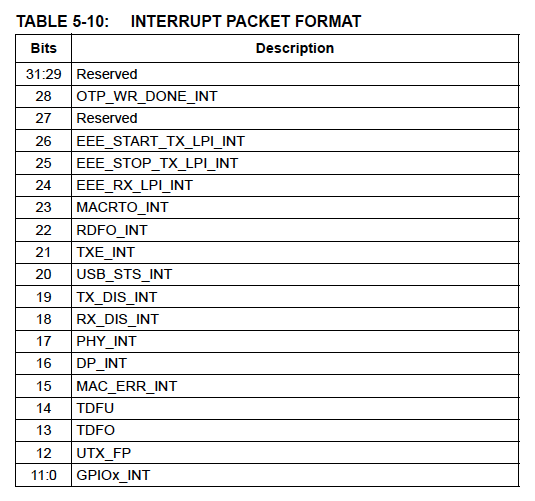

### 5.5.1 インターラプトパケットフォーマット

報告する割り込みステータスが存在しない場合、このデバイスはInterrupt Endpoint
ControlレジスタのInterrupt Endpoint Always On (INTEP_ON)がセットされていない
限り、NAKを返します。セットされている場合は、0x0の割り込みパケットが
返されます。

> 注: ポーリング間隔は静的であり、OTPまたはEEPROMを通して設定されます。
> ポーリング間隔は、ホストがEEPROMの内容を更新して部品をリセットすることで
> 変更することができます。

割り込みエンドポイントで割り込みイベントを報告するには、Interrupt Endpoint
Controlレジスタ (INT_EP_CTL)の対応するビットを有効にする必要があります。
割り込みステータスはInterrupt Statusスレジスタ (INT_STS)に書き込むことに
よりクリアすることができます。

### 5.5.2 USBステータス

USB_STS_INTビットを使うことでホストソフトウェはこのデバイスのOS
プログラミングについてのコミュニケートが容易になります。

このメカニズムによりいかが追跡されます。

- SETセレクト（SET_SEL）コマンドの発行
- ファンクションリモートウェイクアップのステータス
- デバイスリモートウェイクアップのステータス
- LTMイネーブルステータス
- U1イネーブルステータス
- U2イネーブルステータス

> 注: SET_SELコマンドの発行はU1 Exit Latencyレジスタ (U1_LATENCY) と
> U2 Exit Latencyレジスタ (U2_LATENCY) の内容が更新されたことを示します。

USB Statusレジスタ (USB_STATUS)にはステータス変更ビットと必要に応じて
それぞれの現在値が含まれます。

**アプリケーションノート**: 上記のステータス情報の大部分はGET_STATUS USB
リクエストを使用しても取得することができます。

## 5.6 U1とU2のサポート

[USB 3.0関連なので省略]

## 5.7 U3サポート

このデバイスはホストからのU3への移行リクエストを常に受け付けます。U3への
遷移を開始することはできません。U3での省電力はPower Management Control
レジスタ (PMT_CTL)のSuspend Mode (SUSPEND_MODE)フィールドにより決定されます。

U3からのリモートウェイクアップはFunction Suspend and Remote Wakeupにより
設定されている場合はサポートされます。

## 5.8 Function Suspend and Remote Wakeup

[省略]

## 5.9 LTMのサポート

[省略]

## 5.10 LPMのサポート

[省略]

## 5.11 USBディスクリプタ

OTPが設定されていない、または外部EEPROMが利用できない場合は、EEPROM-less
モードが有効にされている場合を除き、以下のディスクリプタテーブルで定義
されているデフォルト値が使用されます。EEPROM-lessモードが有効の場合は
「10.6 EEPROMを使用しないカスタマイズ動作」の定義によりディスクリプタを
プログラムすることができます。

### 5.11.1 デバイスディスクリプタ

デバイスディスクリプタはOTPまたはEEPROMに格納された値に基づいて初期化
されます。表5-11にデバイスディスクリプタのデフォルト値を示します。
これらの値はFS/HS/SSの各動作で使用されます。

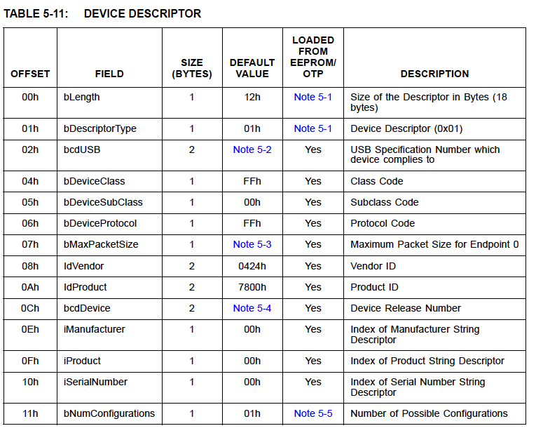

> 訳注: 実機の値（リトルエンディアン）: 1201 1002 ff00 ff40 2404 0078 0003 0000 0001

**Note 5-1** OTPまたはEEPROMで指定されているデバイスディスクリプタの
             ディスクリプタ長とディスクリプタタイプは"don't cares"ですが
             ハードウェアにより常に各々0x12と0x01で上書きされます。

**Note 5-2** USB2.0モードで動作する場合、デフォルト値は0210h（USB2.10）です。
             USB3.1 Gen1モードで動作する場合、デフォルト値は0300h(USB 3.1
             Gen1) です。

**Note 5-3** SSモードで動作する場合、bMaxPacketSizeは09hに設定する
             必要があります。HS/HSモードで動作する場合は、40hに設定する必要が
             あります。OTPが設定されていない場合、またはEEPROMが存在しない場合
             前述の値が返されます。

**Note 5-4** デフォルト値はデバイスのリリースに依存します。MSBはデバイスの
             リリースと一致し、LSBは00hにハードコードされます。最初のリリース
             値は01hです。それ以降のバージョンでは値がインクリメントされます。

**Note 5-5** 値はOTPまたはEEPROMからロードされますが、USB仕様に準拠し、
             デバイスを正常に動作させるためには、デフォルト値と等しくなければ
             なりません。それ以外の値を指定すると、予期しない動作や不正な動作を
             引き起こす可能性があります。

### 5.11.2 コンフィグレーションディスクリプタ

コンフィグレーションディスクリプタはOTPまたはEEPROMに格納された値に基づいて
初期化されます。表5-12にコンフィグレーションディスクリプタのデフォルト値を
示します。これらの値はFS/HS/SSの各動作で使用されます。

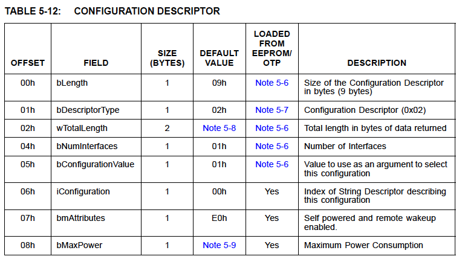

> 訳注: 実機の値（リトルエンディアン）: 0902 2700 0101 00e0 01

**Note 5-6** 値はOTPまたはEEPROMからロードされますが、USB仕様に準拠し、
             デバイスを正常に動作させるためには、デフォルト値と等しくなければ
             なりません。それ以外の値を指定すると、予期しない動作や不正な動作を
             引き起こす可能性があります。
**Note 5-7** OTPまたはEEPROMで指定されているコンフィグレーション
             ディスクリプタのディスクリプタタイプは"don't cares"ですが
             ハードウェアにより常に0x02で上書きされます。
**Note 5-8** USB2.0モードで動作する場合、デフォルト値は0027h (39バイト)です。
             USB3.1 Gen1モードで動作する場合、デフォルト値は0039h (57バイト)
             です。
**Note 5-9** セルフパワードモードではデフォルト値は01hです。バスパワーモード
             ではデフォルト値はUSB2.0モード動作時はFAh (500mA), USB3.1 Gen 1
             モード動作時は70h (900mA)です。

> 注: OTPまたはEEPROMのコンフィギュレーションフラグはbmAttributesの
> デフォルト値に影響を与える場合があります。

### 5.11.3 インタフェースディスクリプタ

表5-13にインタフェース0ディスクリプタのデフォルト値を示します。この
ディスクリプタはOTPまたはEEPROMに格納されている値に基づいて初期化されます。

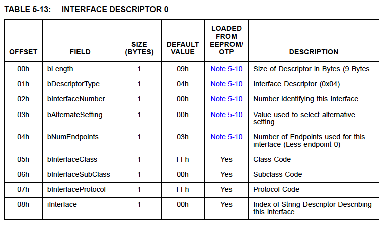

> 訳注: 実機の値（リトルエンディアン）: 0904 0000 03ff 00ff 00

*Note 5-10** 値はOTPまたはEEPROMからロードされますが、USB仕様に準拠し、
             デバイスを正常に動作させるためには、デフォルト値と等しくなければ
             なりません。それ以外の値を指定すると、予期しない動作や不正な動作を
             引き起こす可能性があります。

### 5.11.4 エンドポイント1ディスクリプタ （BULK-IN)

表5-14にエンドポイント1ディスクリプタのデフォルト値を示します。この
ディスクリプタはOTPまたはEEPROMからは初期化されません。

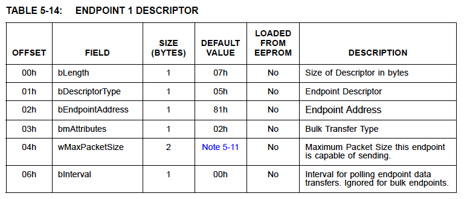

> 訳注: 実機の値（リトルエンディアン）: 0705 8102 0002 00

**Note 5-11** FSモードでは64 (0x40)バイト、HSモードでは512 (0x200)バイト、
              SSモードでは1024 (0x1000)バイト

### 5.11.5 エンドポイント2ディスクリプタ （BULK-OUT)

表5-15にエンドポイント2ディスクリプタのデフォルト値を示します。この
ディスクリプタはOTPまたはEEPROMからは初期化されません。

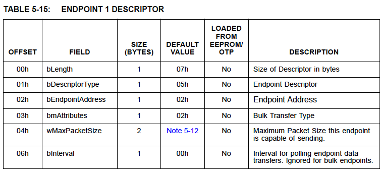

> 訳注: 実機の値（リトルエンディアン）: 0705 0202 0002 00

**Note 5-12** FSモードでは64 (0x40)バイト、HSモードでは512 (0x200)バイト、
              SSモードでは1024 (0x1000)バイト

### 5.11.6 エンドポイント3ディスクリプタ （INTERRUPT)

表5-16にエンドポイント3ディスクリプタのデフォルト値を示します。この
ディスクリプのbIntervalフィールドのみOTPまたはEEPROMから初期化されます。

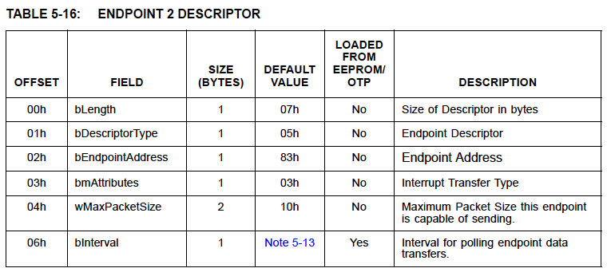

> 訳注: 実機の値（リトルエンディアン）: 0705 8303 1000 04

**Note 5-13** この値はOTPまたはEEPROMからロードされます。HSとSSはポーリング
              インターバルが存在します。OTPが設定されておらず、EEPROMも存在
              しない場合、この値はHSでは04h、FSでは01h、SSでは06hがデフォルト
              です。

### 5.11.7 OTHER SPEED CONFIGURATIONディスクリプタ
### 5.11.8 DEBICE QUALIFIERディスクリプタ
### 5.11.9 ストリングディスクリプタ
### 5.11.11 BULK-OUT SUPERSPEED ENDPOINT COMPANIONディスクリプタ
### 5.11.12 INTERRUPT ENDPOINT SUPERSPEED ENDPOINT COMPANIONディスクリプタ
### 5.11.13 BINARY DEVICE OBJECT STOREディスクリプタ
### 5.11.14 USB 2.0 EXTEnsiONディスクリプタ
### 5.11.15 SUPERSPEED USB DEVICE CAPABILITIESディスクリプタ

[以上、省略]
