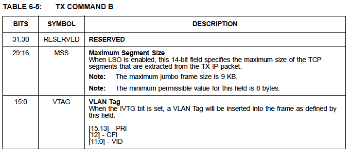

# 第6章 FIFOコントローラ (FCT)

FIFOコントローラは内部RAMを使用してRXおよびTXトラフィックをバッファリング
します。URXから来るバルクアウトパケットは直接FCTのTX FIFOに格納されます。
FCTはUSBパケットデータからEthernetフレームを抽出し、MACに渡す役割を
担っています。

受信したEthernetフレームはFCTのRX FIFOに格納され、バルクインパケットの
ベースとなります。FCTは通常、格納されたデータを、現在のUSBの動作速度に応じて、
1024、512、64バイトのブロックサイズでUTXに渡します。

## 6.1 RXパス (EthernetからUSB)

12KBのRX FIFOはRFEから受信したEthernetフレームをバッファリングします。
UTXはこれらのフレームをFCTから抽出し、USBバルクインパケットを形成します。
ホストソフトウェアは最終的にはUSBパケットからEthernetフレームを
再アセンブルします。

FCTは2つのポインタ（rx_wr_ptrとrx_wr_hd_ptr）を使って、RX FIFOへのデータ
書き込みを管理します。rx_wr_ptrはEthernetフレームデータをFIFOに書き込む
ために使用されます。rx_wr_hd_ptrは、フレームデータを保持する最初のFIFO
ロケーションの2つ前のロケーションを指します。この2つのDWORD空間はフレーム
受信完了時にRXコマンドAとRXコマンドBの書き込みに使用されます。さらに、各
Ethernetフレームは、フレームデータの最初の2バイトを含む同じDWORDに
あるRXコマンドCも含んでいます。コマンドワードは、フレームに関する情報と
MAC、RFE、FCTから提供されるステータスを含んでいます。

rx_rd_ptrはFIFOからデータを読み出し、UTXに渡すために使用されます。巻き戻しを
サポートするためにrx_rd_hd_ptrが存在します。これについては「6.1.1 RXエラー
検出」で説明します。EthernetフレームがFIFOから正常に読み出されると
rx_rd_hd_ptrは次のフレームの先頭を指すように進められます。図6-1に
フレームがFIFOにどのように格納されるかをポインタの使用法と共に示します。

RFEがデータレディの信号を送ると、RFEコントローラはRXパケットデータの
FCTへの受け渡しを開始します。FCTはデータがFIFOに書き込まれるとRX FIFOの
ポインタを更新します。FIFOに書き込まれる最後の情報はコマンドワードです。

> 注意: RxコマンドCにはEthernetフレームのTCP、IPなどのプロトコル
>       ヘッダをDWORDアラインにする目的もあります。

RX FCTはストア＆フォワードモードで動作します。受信したEthernetフレームは
コマンドワードを含む完全なフレームがRX FIFOに書き込まれるまでUTXからは
見えません。これは、エラーが発生した場合、巻き戻し（ポインタ調整）により
フレームを削除しなければならない場合があるためです。たとえば，フレームを
受信中にFIFOのオーバーフローが検出された場合などです。FCTは巻き戻し操作の
使用によって、エラーになったフレームやフィルタリングされたフレームを廃棄
するように構成することもできます。エラーフレームとフィルタリングフレームの
自動廃棄機能は、FIFOコントローラRX FIFOコントロールレジスタ（FCT_RX_CTL）の
"Store Bad Frames"ビットで有効／無効を設定できます。FCTが巻き戻し動作を行う
原因となり得るエラーに関する詳細については、50ページの6.1.1節「RXエラー検出」
を参照してください。

FCTはUTXにRX FIFOにある利用可能なデータ量の目安を提供します。この情報は
FIFOコントローラRX FIFOコントロールレジスタ(FCT_RX_CTL)に反映されます。
さらに、フレーム全体が少なくとも1つ受信されたことをUTXに通知するために
内部信号が使用されます。

RX FIFOのオーバーフロー状態は、RXデータFIFOオーバーフロー割り込み
（RDFO_INT）を介してシグナルされる場合があります。オーバーフローが発生すると、
FIFOコントローラRX FIFOコントロールレジスタ（FCT_RX_CTL）の"FCT RX Overflow"
ビットもアサートされます。

### 6.1.1 RXエラー検出

DETECTION FCTは何らかのエラーが発生した際にEthernetフレームを削除する
ように構成することができます。FIFOコントローラRX FIFOコントロールレジスタ
（FCT_RX_CTL）の"Store Bad Frames"ビットはフレームを保持するか削除するかを
決定します。エラー状態はRXコマンドAで示されます。デバイスによって追跡される
エラー状態の詳細については、22ページの表5-9「統計カウンタ定義」を参照して
ください。

> 注意: チェックサムエラーを持つフレーム（IP/TCP/UDP）の処理は"Store Bad
>       Frames"ビットの影響を受けません。これらのフレームは常にホスト
>       コントローラに渡されます。

FCTはFIFOのオーバーフローを検出した場合にもフレームを削除します。これは
フレームの受信中にFIFOフル状態が発生した場合に起こります。FCTはFIFOオーバー
フロー状態が発生した回数も保持します。

Ethernetフレームの削除は受信フレームの巻き戻しで実装されています。
書き込み側の巻き戻しはrx_wr_ptrをrx_wr_hd_ptrと同じ値に設定することで
実装されています。同様に、読み出し側の巻き戻しは、rx_rd_ptrをrx_rd_hd_ptrと
同じ値に設定することで実装されています。

オーバーフローによりフレームが削除された場合、FCTはフレームの残りを無視
します。次のフレームを受信するまで，RX FIFOへの書き込みは再開されません。

読み出しについては、FCTはUTXの巻き戻しもサポートしています。これは、USB
バルクアウトパケットがホストで正常に受信されず、再送信が必要な場合に必要
だからです。

### 6.1.2 RXコマンドフォーマット

受信した全てのEthernetフレームにはフレームに関する情報を提供する
コマンドワードが追加されています。表6-1「RXコマンドA」、表6-2「RXコマンドB」、
表6-3「RXコマンドC」がコマンドワードの内容を定義しています。

RXコマンドAはフレーム長を含み、フレームに関する様々なステータスビットを
持ちます。RXコマンドBは、有効であれば生のレイヤ3チェックサムと該当する場合は
VLANタグを提供します。生のチェックサムは、サポートされていないレイヤ3
プロトコルのチェックサムの検証を支援するために使用することができます。
RXコマンドCは、ウェイクアップサポートに必要な追加情報を提供します。

> アプリケーションノート: 受信したウェイクアップフレームでUSBのリモート
>     ウェイクアップを引き起こすことは可能ですが、 RFEでプログラムされた
>     フィルタリングルールが渡されない場合があります。受信したウェイク
>     アップフレームにRFEフィルタリングルールをシステムソフトウェアが
>     実装しなくても済むように"RFE Filter Fail"ビットが提供されています。
>     これは、RXコマンドAにICEやTCEなどでフレームを削除するための追加条件
>     を提供します。

> アプリケーションノート: 受信データフレームの受信に関連してデバイスが
>     いつサスペンドするかに関する競合条件により、ウェイクアップフレームが
>     FIFO内でそれに先行するフレームを持つ可能性があります。RX FIFOが
>     データフレームで完全に満たされ、FIFOオーバーフローエラーによって
>     ウェイクアップフレームが削除されるような病的に最悪のケースが存在
>     する可能性があります。

### 6.1.3 RX FIFOののフラッシュ

このデバイスはホストがFCT RX FIFOの全コンテンツをフラッシュすることを
許します。フラッシュがアクティベートされるとRX FIFOのRead/Writeポインタは
リセット状態に戻されます。

RX FIFOをフラッシュする前には、セクション6.1.3.1の規定に従って、デバイスの
レシーバを停止する必要があります。レシーバの停止が確認されると、FIFO
コントローラRX FIFOコントロールレジスタ（FCT_RX_CTL）の"FCT RX Enable"が
クリアされ、RX FIFOの動作が停止されます。RX FIFOハードウェアの無効化処理が
完了すると"FCT RX Disabled"ビットと"RX Disabled Interrupt（RX_DIS_INT）"
（有効な場合）がアサートされます。その後、FIFOコントローラRX FIFO
コントロールレジスタ（FCT_RX_CTL）の"FCT RX RESET"ビットをに設定すると
フラッシュ動作を開始させることができます。このビットはフラッシュ動作が
完了するとハードウェアによってクリアされます。

> 注意: RX Disabled Interrupt（RX_DIS_INT）は"FCT RX Disabled"ステータス
> ビットがクリアされるまで継続されます。RX_DIS_INTをデアサートするために
> MAC受信レジスタ（MAC_RX）の"Receiver Disabled（RXD）ステータス"ビットも
> クリアする必要があります。割り込みステータスレジスタ（INT_STS）の"RX
> Disalbed Interrupt (RX_DIS_INT)"が設定され、割り込みエンドポイントを
> 介してホストからも見えるようになります。

RX FIFOをフラッシュした後はセクション6.1.3.1に指定された方法でレシーバを
再起動することができます。RX FIFOの動作は"FCT RX Enable"ビットをアサート
することで再開することができます。

#### 6.1.3.1 レシーバの停止と起動

レシーバを停止するにはホストはMAC受信レジスタ (MAC_RX) の"Receiver Enable
(RXEN)"ビットをクリアする必要があります。レシーバが停止すると、"Receiver Disabled (RXD) "ビットと（有効な場合は）"RX Disabled Interrupt (RX_DIS_INT)"
がアサートされます。停止したらホストソフトウェアはRX FIFOをフラッシュする
必要があります。ホストは"Receiver Enable (RXEN)"ビットを設定してレシーバを
再度イネーブルにする必要があります。

> 注意: RX Disabled Interrupt（RX_DIS_INT）は"Receiver Disabled (RXD)
> status"ビットがクリアされるまで継続されます。RX_DIS_INTをデアサートする
> ためにFIFOコントローラRX FIFO制御レジスタの"FCT RX Disabled status"ビットを
> クリアする必要があります。割り込みステータスレジスタ（INT_STS）の"RX
> Disalbed Interrupt (RX_DIS_INT)"が設定され、割り込みエンドポイントを
> 介して見えるようになります。

#### 6.1.3.2 フロー制御

FCTは802.3フロー制御をサポートしています。FCTはプログラム可能なFIFO閾値に
基づいてMACに一時停止フレームを送信するようトリガすることができます。

FCTはフローコントロールオン信号とフローコントロールオフ信号をMACに提供
します。これらの信号はRX FIFOに格納されているデータ量とFCTフロー制御閾値
レジスタ (FCT_FLOW) の内容に基づいてアサートされます。

FIFOのデータ量がFCTフロー制御閾値レジスタ (FCT_FLOW) の"Flow Control On
Threshold"フィールドに指定された値を超えると、内部フロー制御オン信号が
アサートされます。そして、MACは（フロー制御レジスタ (FLOW) の"TX Flow Control
Enable (TX_FCEN)の設定に基づいて）一時停止フレームを送信して、リンク
パートナーに送信の停止を指示することができます。

その後ある時点でFIFOのデータ量がFCTフロー制御閾値レジスタ (FCT_FLOW) の
"Flow Control Off Threshold"フィールドで指定された値を下回ることになります。
これにより内部フロー制御オフ信号がMACにアサートされます。そして、MACは
（TX_FCENの設定によりますが）値0の一時停止フレームを送信します。一時停止
フレームを受信したリンクパートナーは送信を再開することになります。

> アプリケーションノート: ジャンボフレームを使用してフロー制御をする際には
> RX FIFOでのフレームドロップを避けるため、最大フレームサイズを4KB以下に
> 制限するべきです。フロー制御の閾値を4KBに設定した場合のシナリオを考えて
> みましょう。最初の4KBのフレームを受信すると一時停止フレームの送信が
> トリガーされます。しかし、その瞬間、TXパスが4KBのパケットを送信中であれば
> 一時停止フレームがブロックされる可能性があります。トランスミッタが
> ジャンボフレームを送信している間に、パートナは一時停止フレームを処理
> する前に、2番目のジャンボフレームと3番目のフレームを受信する可能性が
> あります。このようなめったにないケースでは結果として対象となるジャンボ
> フレームがドロップし、上位レイヤプロトコルで再送信が必要となることに
> なります。

## 6.2 TXパス（USBからEthernet）

12KBのTX FIFOはURXが受信したUSBバルクアウトパケットをバッファリングします。
FCTは、USBバルクアウトパケットに埋め込まれたEthernetフレームを抽出し、
MACに渡す役割を担っています。EthernetフレームはホストソフトウェアによりUSBパケット間でセグメント化されます。

FCTはURXから有効なUSBバルクアウトパケットを受け取り、それをTX FIFOに
書き込みます。FCTの書き込み側ではUSBパケットデータに対して何の処理も
行いません。書き込み側でこれらのパケットの巻き戻しに関する規定は必要
ありません。URXが自身のバッファRAMであるURX FIFOを管理し、バルクアウト
パケットにエラーがあり、ホストによる再転送が必要になった場合は巻き戻しを
行うからです。FCTはEthernetフレームをFCT TX FIFO RAMに書き込む際、内部
処理に使用するTXコマンドワードの直前にEthernetふれーむの長さを含むDWORDを
付加します。

FCT TX FIFOの読み込み側は、Ethernetフレームを抽出する役割を担っています。

Ethernetフレームは、URX FIFOにフレームがどのように格納されているかを
示している図6-2に見られるように複数のUSBバッファに分割されている場合が
あります。図6-3はURX FIFOから読み出され組み立てられたEthernetフレームが
FCT TX FIFOにどのように格納されるかを示しています。

> アプリケーションノート: ソフトウェアは、保留中のINトランザクションがある場合はFCT TX FIFOをフラッシュしていはいけません。

### 6.2.1 TXコマンドフォーマット

各バッファは2つのTXコマンドDWORD（TXコマンドAとTXコマンドB）で始まります。
これらは送信されるデータの前に置かれます。TXコマンドはFCTに関連する
バッファの取り扱い方法を指示します。

TXコマンドAとTXコマンドBのフォーマットをそれぞれ表6-4と表6-5に示します。

TXコマンドAにはフレーム長とフレームの処理方法を指示する情報を含んでいます。
TXコマンドBはVLAN Tagと最大セグメントサイズを提供します。前者はフレームに
VLAN IDを挿入したい場合に必要となります。後者は"Large Send Offload"が指定
された場合に使用されます。これらの機能の詳細については「6.2.5: VLAN
サポート」(59ページ)と「6.2.8: Large Send Offload（LSO）」(61ページ)を
参照してください。

### 6.2.2 TXデータフォーマット

TXのデータクションはTXコマンドBの直後から始まります。TXデータはバッファの
終わりまで連続しています。バッファはバイトバウンダリで終了することがあります。
パケット末尾の未使用バイトは送信用としてはMACに送られません。

### 6.2.3 TX FIFOリード時のFCTアクション

FCTは、「6.2.4: TXエラー検出」(59ページ)で説明するように、バッファ構成の
正しさについての基本的なサニティチェックを実行します。この時点でのエラーは
TXパスが同期していないことを示しており、これは致命的なのでTXパスの再初期化が
必要になります。TXエラーはホストソフトウェアのエラーでしか置きません。

FCTは，TX FIFOからEthernetフレームを取り出す際に次のステップを実行します。

- フレーム長DWORDの除去
- TXコマンドAの除去
- TXコマンドBの除去
- TXコマンドAのバッファサイズフィールドに基づいて、FCTはバッファの最後の
  ワードにある未使用バイトを数値的に決定することができます。これらの
  DWORDをMACに転送する際にFCTはこの数値に従ってバイトイネーブルを調整します。
- TXコマンドAにあるMACが必要とするコンフィギュレーション情報はサイド
  バンドチャンネルを通じてFCTからMACに送られます。

書き込み側とは異なり、TX FIFOの読み込み側は巻き戻しをサポートしています。
MACからのrewind_fr信号とrelease_fr信号は、FCTにTX FIFOバッファに対する
行うべき操作を指示します。rewind_fr信号は衝突のためにフレームを再送信
しなければならない場合にMACによりアサートされます。この信号がアサート
されると、FCTは内部Readポインタをバッファの先頭に調整し、MACへのフレームの
再送信を容易にします。release_fr信号は、フレームが正常に送信された場合、
または衝突が最大数発生した場合にMACによりアサートされます。release_frが
アサートされると、FCTは内部ポインタを調整することでTX FIFOからバッファを
パージします。

エラーは"Transmitter Error (TXE)"フラグにより報告されます。これはホスト
からは割り込みエンドポイントを介して見ることができ、また割り込みステータ
スレジスタ（INT_STS）にも設定されます。

### 6.2.4 TXエラー検出

以下のエラー状態は、TXパスが同期していないことを示し、"Transmitter Error
(TXE)"フラグがアサートされます。

- MSSが8未満でLSOがアサートされている、または、MSSが0でなくLSOがアサートされていない
- LSOがアサートされ、検出されたテンプレートヘッダーサイズが256バイト以上
- TX Command A[19:16]が0でなく、LSOがアサートされていない
- TX Command A[15:0]が2FF7h以上でLSOがアサートされていない（追加のコマンドワードが2つ、TX FIFOにも書き込まれているため)
- TX Command A[19:0]のフレーム長フィールドが32バイト未満でInsert FCSとPadがアサートされていない
- TX Command A[23] (Replace VLAN Tag (RVTG)) = 1 で、TX Command A[24] (Insert VLAN Tag (IVTG)) = 0
- TX Command A[31:30]が0ではない（予約ビット）
- TX Command A[21:20]が0ではない（予約ビット）
- TX Command B[31:30]が0ではない（予約ビット）

> 注意: FCTは送信エラーが検出された際にバルクアウトパイプをストールするように設定することができます。これはハードウェア構成レジスタ(HW_CFG)の"Stall Bulk-Out Pipe Disable (SBP)" ビットを使って実現できます。

> 注意: TXエラーはホストソフトウェアのエラーによってのみ発生しうる壊滅的な状態です。この状態から回復するためにはデバイスをリセットする必要があります。

### 6.2.6 VLANサポート

[省略]

### 6.2.6 FCS生成

TX FCTはTXコマンドAで"Insert FCS and Pad"ビットが設定された場合、すべての
送信フレームについてFCSを生成する。

### 6.2.7 転送チェックサムオフロード

FCTは送信フレームに対するIP、ICMP/ICMPV6、IGMP、TCP、UDPのチェックサムの
生成をオフロードすることが可能です。オフロードは、TXコマンドAの"IP Checksum
Offload Enable"ビットと"TCP/UDP Checksum Offload Enable"ビットにより有効
化にすることができます。

**Note 6-2** フラグメンテーションはサポートされていません。Hop-by-Hop、Destination、Routingオプションはサポートされています。

> 注意: IPv6はヘッダーチェックサムを持っていません。

チェックサムオフロードの実装については「7.2 チェックサムオフロード」
(73ページ)を参照してください。セクション7.2は、特に受信チェックサム
オフロードのケースを扱っています。しかし、疑似ヘッダーフォーマットと
チェックサムの目的は受信と送信のオフロード操作の双方で同じです。

#### 6.2.7.1 構成

[省略]

### 6.2.8 Large Send Offload (LSO)

[省略]

#### 6.2.8.1 構成

[省略]

#### 6.2.8.2 処理

[省略]

### 6.2.9 TX FIFOのフラッシュ

このデバイスではホストによるFCT TX FIFOの全コンテンツのフラッシュが可能
です。フラッシュがアクティブになると、TX FIFOの内部リードポイントと内部
ライトポインタがリセット状態に戻されます。

TX FIFOをフラッシュする前には6.2.10で指定されているようにデバイスの
トランスミッタを停止する必要があります。トランスミッタの停止完了が確認
されるとFIFO Controller RX FIFO Controlレジスタ（FCT_RX_CTL）の
FCT TX Enableビットがクリアされ、TX FIFOの動作が停止されます。TX FIFO
ハードウェアがディセーブル処理を完了するとFCT TX DisabledビットとTX
Disabled Interrupt（TX_DIS_INT）（有効な場合）がアサートされます。その後、
FIFO Controller RX FIFO Controlレジスタ（FCT_RX_CTL）のFCT TX Reset
ビットをセットし、フラッシュ動作を開始させます。このビットはフラッシュ
動作が完了するとハードウェアによってクリアされます。

> 注意: TX Disabled Interrupt（TX_DIS_INT）は、MAC Transmit Register
> （MAC_TX）のFCT TX DisabledステータスビットとTransmitter Disabled（TXD）
> ステータスビットが両方ともクリアされるまでアサートされ続きます。

TX FIFOがフラッシュされた後は6.2.10節に規定されているようにトランス
ミッタを再スタートすることができます。TX FIFOの動作はFCT TX Enable
ビットをアサートすることにより再開することができます。

**アプリケーションノート**: バルクアウトEPに保留中のURBがある場合、ソフトウェアはTX FIFOのフラッシュを試みてはいけません。

### 6.2.10 トランスミッタの停止と開始

トランスミッタを停止するには、Hostは以下の手順を実行する必要があります。

1. ソフトウェアはFIFO Controller TX FIFO Contorolレジスタ
   （FCT_TX_CTL）のFCT TXイネーブルビットをクリアする。
2. ソフトウェアはFIFO Controller TX FIFO Contorolレジスタ（FCT_TX_CTL）の
   FCT TX Disabledビットをポーリングし、FCT TXが無効になることを確認する。

   > 注意: MACは現在FCTから送信されているフレームをフレームが送信される
   > まで読み続けます。フレームが送信されるとFCT TX Disabledビットが
   > アサートされます。

3. FIFO Controller TX FIFO Contorol（FCT_TX_CTL）のFCT TX Disabled
   ビットがセットされます。
4. ソフトウェアはMAC Transmitレジスタ（MAC_TX）のTransmitter Enable
   （TXEN）ビットをクリアしてMACの送信を停止させます。
5. ソフトウェアはMAC Transmitレジスタ（MAC_TX）のTransmitter Disabled
   （TXD）ビットをポーリングしてMACの転送が無効になるこことを確認します。
6. Transmitter Disabled（TXD）ステータスビットがセットされ、MAC TXが
   停止したことを示します。

**アプリケーションノート**: FCT TX DisabledビットとTransmitter Disabled（TXD）をポーリングする代わりに、Interrupt Status ジスタ（INT_STS）のTX Disabled Interrupt（TX_DIS_INT）ビットを使用することもできます。

**アプリケーションノート**: デバイスが半二重動作に設定されている場合、FCT TX Enableがクリアされた後、フレームが送信完了する前に衝突が発生する可能性があります。この場合、MACはFCTにアボート信号をアサートし、フレームはFCTにより破棄されます。

TXパスの停止後には、ホストはオプションとして、6.2.9節で示したように
TX FIFOをフラッシュすることができます。ホストは、MAC Transmitレジスタ
（MAC_TX）のTransmitter Enable（TXEN）ビットをセットし、続いてFIFO Controller TX FIFO Contorol（FCT_TX_CTL）のFCT TXイネーブルビットを
セットすることによってトランスミッタを再度有効ににすることができます。

TX FIFOに保留中のフレームがある場合（すなわち、TX FIFOがパージされて
いない場合）、送信はこのデータで再開されます。
