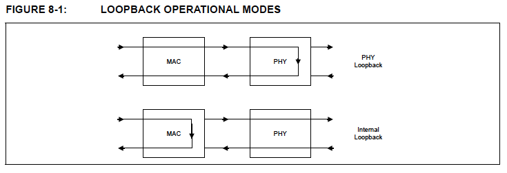

# 第8章 10/100/1000 Ethernet MAC

イーサネットメディアアクセスコントローラ (MAC) は、イーサネット/ IEEE 802.3
準拠のノードを操作するために必要な基本的なプロトコルを内蔵し、イーサネットPHYへの
インターフェイスを提供します。MACは全二重1000Mbpsまたは半二重/全二重10/100Mbps
モードで動作させることができます。

半二重モードで動作する場合、MACはISO/IEC 8802-3 (ANSI/IEEE規格) のセクション4
およびANSI/IEEE 802.3規格に完全に準拠しています。全二重モードで動作する場合、
MACはIEEE 802.3x全二重操作規格に準拠します。

MACは、ホスト監視、バス使用率、メッセージの前後処理を最小化するように設計された
プログロム可能な拡張機能を提供します。これらの機能には、衝突後の再試行を無効に
する機能、フレーム単位での動的FCS（Frame Check Sequence）生成機能、最小フレーム
サイズ属性を強制する自動パッドフィールド挿入・削除機能、衝突フレームの自動再送信
・検出機能が含まれます。

MAC機能の主要な属性は以下の通りです。

- イーサネットPHYとのインタフェース
- 送受信メッセージデータのカプセル化
- フレーミング（フレーム境界の区切り，フレーム同期）
- エラー検出（物理媒体伝送エラー）
- FCSのチェック／除去／生成
- プリアンブルの除去／生成
- メディアアクセス管理
- メディア割り当て（衝突検知，全二重操作を除く）
- 競合解消（衝突処理，全二重操作を除く）
- 全二重モードにおけるフロー制御
- コントロールフレームのデコード（PAUSEコマンド）と送信器の無効化
- コントロールフレームの生成（PAUSEコマンド）
- 最小パケット間ギャップ（IPG）の維持
- マジックパケット/WOL (Wake-On-LAN) の検出
- リモートウェイクアップフレームの検出
- Neighbor Solicitationオフロード
- ARPオフロード
- Simple Network Management Protocol (SNMP) と Remote Monitoring (RMON) 管理カウンターセットの実装

送受信のデータパスは、デバイス内でMACとUSBインターフェースで分離されており、特に
全二重モードでは最高のパフォーマンスを実現します。

バックエンドにおいて、MACは内部GMIIポートとMIIポートを介してPHYとインターフェースします。
GMIIポートは1000Mbps動作に、MIIポートは10/100Mbps動作に使用されます。デバイスの
レジスタも内部SMI (Serial Management Interface) バスを介してPHYのレジスタにアクセス
するメカニズムも提供します。

FCT RXとTX FIFO、URX FIFOとUTX FIFOは、MACへのパケットバッファストレージの増加を
可能にします。FIFOは、USBインターフェースとMACをつなぐパイプであり、すべての送受信
データと様々なコマンド/ステータス情報がやり取りされます。Deep FIFOは様々なトランス
ポートやOSソフトウェアスタックに対して高度なレイテンシ許容度を実現し、オーバーラン
状態を低減・最小化します。

## 8.1 衝突処理

衝突が検出されるとデータの送信は停止されJamパターンが送信されます。衝突の後、
MACはフレームの再送を試みます。フレームが再送される時間は"truncated binary
exponential back-off"アルゴリズムによって決定されます。バックオフの限界は
Hardware Configurationレジスタ (HW_CFG) のBack Of Limit (BOLMT) フィールドで
選択されます。遅延の単位はスロットタイムです。ここで、スロットタイムは512ビット
タイムに相当します。また，MACはFCTへのrewind_fr信号とrelease_fr信号を制御します。rewind_fr信号は衝突発生後のフレーム再送信をサポートするために使用されます。
フレームが正常に送信された、または過剰な衝突や遅延衝突のために中止されるとrelease_fr信号がアサートされ、MACが現在のフレームの処理を終了し、次のフレームの
準備ができたことを示します。

## 8.2 フロー制御

このデバイスのイーサネットMACは、一時停止動作と制御フレームを使用した全二重
フロー制御をサポートしています。全二重フロー制御は、フロー制御フレームの手動
送信、またはRX FIFOの高低ウォーターマーク閾値により決定されるフロー制御
フレームの自動送信によってもサポートされています。

### 8.2.1 全二重フロー制御

## 8.3 WOL (Wake On LAN)イベントの検知
## 8.4 AOAC (Always on Always Connected)
## 8.5 NS (Neighbor Sollictation)オフロード
## 8.6 ARPオフロード

[以上、省略]

## 8.7 速度とデュプレックスの自動検知

このデバイスでは速度とデュプレックスを手動または自動で制御できます。

MAC Controlレジスタ (MAC_CR) のAutomatic Speed Detection (ASD) ビットはMACが
動作速度を自動的に決定するか、手動で設定するかを制御します。ASDがセットされると、
MACはMAC Controlレジスタ (MAC_CR) のMAC Configuration (CFG)フィールドの設定を
無視し、動作速度を自動的に決定します。MACは内部受信クロック信号をサンプリングして
速度検出を決定し、最後に決定された速度をMAC Configuration (CFG) フィールドで報告
します。ASDが0の時はMAC Configuration (CFG) フィールドの設定が動作速度を決定
します。

MAC Controlレジスタ (MAC_CR) のAutomtic Duplex Detection (ADD) ビットはMACが
デュプレックスを自動的に決定するか、手動で設定するかを制御します。ADDが
セットされると、MACはMAC Controlレジスタ (MAC_CR) のDuplex Mode (DPX) ビットの
設定を無視し、自動的にデュプレックス動作モードを決定します。MACはPHYステータス
信号を使用してモードの検出を行い 、最後に決定された状態をDuplex Mode (DPX)
ビットで報告します。ADDが0の時はDuplex Mode (DPX) ビットの設定がデュプレックス
動作を決定します。

詳細は「9-1 カテゴリ 5 ツイストペアメディアインタフェース」を参照してください。

SYNCが失われるとMACはASD/ADDの設定に基づいて自動的に速度とデュプレックスの検出を
開始します。

## 8.8 ループバック動作

次のループバックモードが用意されています。

- PHYループバックモード（デフォルト）
- MAC内部ループバックモード

MAC内部ループバックモードはMAC Controlレジスタ (MAC_CR) のInternal Loopback
Operation Mode (INT_LOOP) ビットで設定されます。これは全二重動作モードでのみ
有効です。このループバックモードでは、TXフレームは内部GMIIインターフェースで
受信され、PHYに送信されずにMACに返送されます。

## 8.9 802.3az EEEのサポート
## MACリセットウォッチドッグタイマー

[以上、省略]
