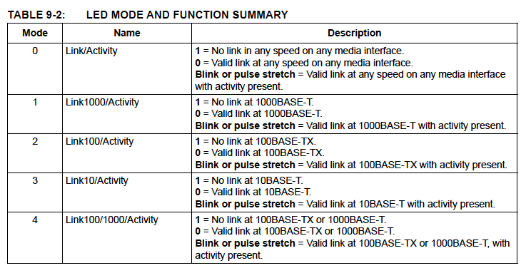
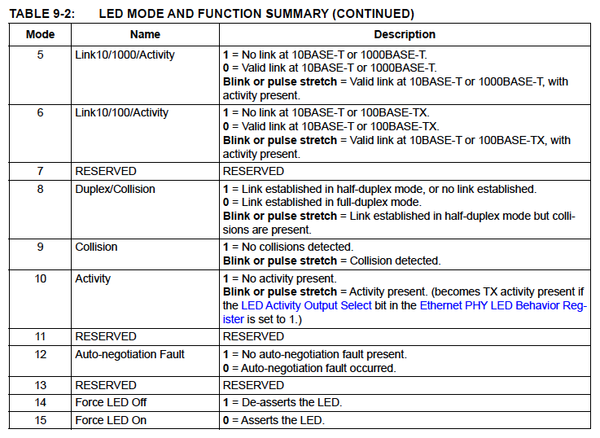

# 第9章 ギガビットEthernet PHY (GPHY)

このデバイスは、IEEE 802.3, 802.3u, 802.3ab, 802.3az (Energy Efficient
Ethernet) 規格に完全準拠した低消費電力のギガビットEthernet PHY (GPHY)
トランシーバを内蔵しています。また、低電磁波干渉（EMI）ラインドライバと
電力とプリント基板（PCB）のスペースを節約する内蔵式のライン側終端抵抗を
提供します。

Ethernet PHYのミックスシグナルとデジタル信号処理（DSP）アーキテクチャは
好ましくない環境条件下でも安定した性能を保証します。カテゴリ5（Cat5）の
非シールドツイストペア（UTP）ケーブルで100m以上の距離の半二重と全二重の
10BASE-T、100BASE-TX、1000BASE-Tの通信速度をサポートし、NEXT、FEXT、
エコー、その他の種類の環境ノイズとシステム電子ノイズに優れた耐性を発揮
します。Ethernet PHYは最適な速度とデュプレックスモードを自動的に決定する
オートネゴシエーションを実装しています。HP Auto-MDIXのサポートにより、
直接接続またはクロスオーバーLANケーブルを使用することができます。

Ethernet PHY は Wake on LAN (WoL) をサポートし、パーフェクトDA、ブロード
キャスト、マジックパケット、ウェイクアップフレームの受信時に割り込みを
トリガーするメカニズムを提供します。この機能によりMACの介入を必要とする
ことなくPHY層でパケットのフィルタリングが可能です。

IEEE 802.3-2005標準に基づき、すべてのデジタルインターフェースピンは
3.6Vトレラントです。統合エネルギー効率化イーサネット（EEE）機能と
強化されたActiPHY節電モードを利用することでさらなる節電が可能となり、
低リンク使用時に大幅な電力削減を実現します。

Ethernet PHYは[Ethernet PHY Control and Statusレジスタ](15_register.md#153-ethernet-phy制御およびステータスレジスタ)により
設定可能です。これらのレジスタは、MII Accessレジスタ（MII_ACCESS）と
MII Dataレジスタ（MII_DATA）を介してEthernet MACから間接的にアクセス
されます。

## 9.1 カテゴリ 5 ツイステッドペアメディアインタフェース

[省略]

## 9.2 Ethernet PHY電力管理

### 9.2.1 PHY電力ダウン

イーサネットPHYは[Ethernet PHY Mode Controlレジスタ](15_register.md#15311-ethernet-phy-mode-controlレジスタ)のIEEEで規定された
Power Downビッ ト(index 0[11])をセットすることによりパワーダウンする
ことができます。

### 9.2.2 拡張PHY電力管理

IEEEで規定されたパワーダウン制御ビットに加え、このデバイスには拡張PHY
電力管理モードもあります。このモードは電力に敏感なアプリケーションの
サポートを可能にします。PHYを自動的にパワーダウンさせるタイミングを
決定するためにメディアインタフェースにリンクがあるか否かを監視する
信号検出機能を利用します。PHYはプログラム可能な間隔で「起床」し、
銅線上にFLPバーストを送信してリンクパートナーPHYを「起床」させようと
試みます。

拡張PHY電力管理モードは[Ethernet PHY Auxillary Control and Statusレジスタ](15_register.md#153126-ethernet-phy-auxiliary-control-and-statusレジスタ)
のEnhanced PHY Enalbeビットを1bにセットすることにより通常操作中のいつでも
有効にすることができます。

拡張PHY電力管理モードは以下の場合に電力を節約するのに役立ちます。

- 接続されていないPHYポート
- PHYポートがもう一方の端にリンクパートナがいないケーブルに接続されている場合
- リンクパートナPHYがいるケーブルに接続されたPHY ポートが、電源が入っていない、リセットされている、リンクできない他の理由でリンクパルスを送信していない場合

拡張PHY電力管理モードはSUSPEND2を除く全てのサスペンドステートと組み
合わせて使用することができます。PHYが無効になっているからです、さらに、
拡張PHY電力管理モードは、Ethernet PHY Auxiliary Control and Status
レジスタのEnhanced PHY Enableビットを1bに設定することにより、通常の構成でデタッチされていないPMEモード中にも有効にすることができます。これらの
場合ではいつでもそうすることが望ましいです。

PMEモードでは、EEPROM/OTPの設定により拡張PHY電力管理モードをデフォルトで
有効にすることが可能です。

## 9.3 LEDインタフェース

Ethernet PHYは4つのLED ピン LED[0:3] を提供しています。各LEDはEthernet PHY
LED Mode Selectレジスタの対応するLED Configurationフィールドを設定することで
異なるステータス情報を表示するように構成することができます。表 9-2のモードは
各LEDピンの構成に使用したEthernet PHY LED Mode Selectレジスタの設定です。
デフォルトのLEDの状態はアクティブローですがEthernet PHY Page 2 EEE Contorl
レジスタのInvert LED Polarityフィールドを変更することで変更できます。
点滅やパルスの間隔など、他のLEDの設定もEthernet PHY LED Behaviorレジスタで
設定できます。LED ピンはEEPROMやOTPでも設定することもできます (LED
Configuration 0, LED Configuration 1, LED Configuration 2, LED Configuration 3,
LED Configuration 4)。

[以下、省略]

## テスト機能

[省略]
