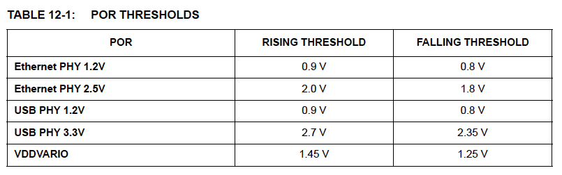

# 題12章 リセット

このデバイスは次のチップレベルのリセットソースを提供します。

- パワーオンリセット (POR)
- 外部チップリセット (RESET_N)
- ライトリセット (LRST)
- ソフトリセット (SRST)
- USBリセット
- VBUS_DET

さらに、デバイスは非チップレベルのEthernet PHYソフトウェアリセットも
提供します。

## 12.1 パワーオンリセット (POR)

パワーオンリセット (POR) はデバイスに電源が投入される度に、または
デバイスの電源が解除された後に再印加されたときに発生します。デバイス内の
タイマーが約20ms間内部リセットをアサートします。このリセットによりEEPROM/
OTPの内容がロードされます。

PORは以下のドメインの電圧を測定する5つの独立したPOR回路の組み合わせです。

- Ethernet PHY 1.2 V
- Ethernet PHY 2.5 V
- USB PHY 1.2 V
- USB PHY 3.3 V
- VDDVARIO

電源投入後、PORは最初に立ち上がり閾値を超えるとデアサートされます。
その後、電源が立ち下がり閾値を下回るとPORがアサートされます。PORは
再び立ち上がり閾値を越えるまでアサートされ続けます。立ち上がり閾値と
立ち下がり閾値は表 12-1に示すとおりです。

**アプリケーションノート**: VDDVARIOに対するPORは1.8VのI/O動作を対象と
します。より高い電圧を使用する場合は、I/Oドメインの完全なブラウンアウト
検出を提供するために、外部PORが必要な場合があります。

## 12.2 外部チップリセット (RESET_N)

**RESET_N**ピンをLowにするとハードウェアリセットがかかります。電源
投入時には**RESET_N**のアサートは必要ありません。ただし、使用する場合は
274ページの「16.6.2 RESET_Nタイミング」に定義されている最小時間の間
**RESET_N**をLowにする必要があります。**RESET_N**ピンは内部でプルハイ
されていますが、未使用の場合は外部でVDDVARIOに接続する必要があります。

> 注意: 構成されている場合、このリセットによりEEPROM/OTPの内容が再ロード
> されます。

## 12.3 ライトリセット (LRST)

このリセットは[Hardware Configurationレジスタ (HW_CFG)](15_register.md#1513-hardware-configurationレジスタ-hw_cfg) のSolt Lite Reset
(LRST) ビット(HW_CFG[1])をセットすることにより開始されます。これは
USBデバイスコントローラとUSB PHYを除くデバイス全体をリセットします。
ライトリセットの間、PLLはオフになりません。

> 注意: このリセットはEEPROM/OTPからのUSBコンテンツのリロードを引き
>       起こしません。
>       このリセットは、デバイスを未構成状態にしません。
>       Soft Lite Reser (LRST) ビットはNALRとしてマークされている
>       制御レジスタビットをクリアしません。

**アプリケーションノート**: LRSTを発行する前に、システムソフトウェアは
デバイスのUSBパイプを停止させなければなりません。LRSTの発行後、システム
ソフトウェアはパイプを再起動させなければなりません。このプロセスには
デバイスパイプにCLEAR_FEATURE(ENDPOINT_HALT)を送信し、デバイス側のデータ
トグルをリセットさせる処理を含みます。また、ホスト側の各パイプもデータ
トグルをリセットする必要があります。

## 12.4 ソフトリセット (SRST)

ソフトウェアによるリセットは[Hardware Configurationレジスタ (HW_CFG)](15_register.md#1513-hardware-configurationレジスタ-hw_cfg)の
Soft Reset (SRST) ビット(HW_CFG[0])をセットすることで開始されます。このビットが
セットされるとデバイスはUSBバスからソフト的に切り離されます。デバイスが
切り離されている時間は通常、SuperSpeedで30ms、HS/FSで10msです。この時間が
経過すると、デバイスは完全にリセットされ、USBバスに再接続されます。

> 注意: 構成されている場合、このリセットによりEEPROM/OTPの内容が再ロード
> されます。

**アプリケーションノート**: 切り離されている時間はUSB Configuration 2レジスタ (USB_CFG2) のSS Detach TIme (SS_DETACH)フィールドとHS etach Time
(HS_DETACH)フィールドによりプログラムできます。

## 12.5 USBリセット

USBリセットは、USBデバイスコントローラとUSB PHYを除くデバイス全体の
リセットを引き起こします。USB PLLはオフになりません。USBリセットの後、
ホストはPower Management Controlレジスタ (PMT_CTL) のDevice Ready (READY)
ビットを読むことができ、（もし存在すれば）EEPROM/OTPの内容がロードされる
まで'0'が返されます。その後、デバイスは制御レジスタを介して構成することが
できるようになります。

> 注意: このリセットはEEPROMまたはOTPの全コンテンツを再ロードさせる
> ものではありません。MACアドレスだけが再ロードされます。

## 12.6 VBUS_DET

USB電源が切れるとデバイスはUNPOWERED状態に移行します。UNPOWERED状態の間、
チップはリセットに保持されます。

> 注意: VBUS_DETがアサートされた後、（構成されていれば）EEPROM/OTPの
> 内容が再ロードされます。

> 注意: UNPOWERED状態から移行した後も内部Ethernet PHYは電力を最小にする
> ためにリセット状態のままです。

## 12.7 Ethernet PHYソフトウェアリセット

Ethernet PHYのソフトウェアリセットはPower Management Controlレジスタ
(PMT_CTL) のPHY Rest (PHY_RST) ビットにより提供されます。このリセットは
チップレベルリセットではなく、Ethernet PHYのみをリセットします。アサート
されるとギガビットEthernet PHY は最低2msの間リセットされます。

Ethernet PHYが機能するようになるとPower Management Controlレジスタ
(PMT_CTL) のDevice Ready (READY) ビットがアサートされます。このリセット
後にデバイスが動作可能になるまでに、Power Management Controlレジスタの
Disable Wait Analog Voltage Reference Stable (DIS_WAIT_ANA_REF) ビットの
状態により、100ms以上かかる場合があります。
