# 第15章 レジスタ記述

本節ではデバイスのレジスタ記述とメモリマップについて詳述します。直接
アドレス指定可能なメモリマップを表15-1に示しました。その他の間接的に
アドレス指定可能なレジスタは以下のサブセクションで詳述します。

> 注意: デバイスのOTPメモリに関する追加情報は127ページの「11.0:
>       ワンタイムプログラム可能（OTP）メモリ」を参照してください。

**直接アドレス可能なレジスタ**

- 15.1: システム制御およびステータスレジスタ (146ページ)
- 15.2: USB PHY制御およびステータスレジスタ (237ページ)

**間接的にアドレス可能なレジスタ**

- 15.3: Ethernet PHY制御およびステータスレジスタ (233ページ)
- 15.4: MDIO管理デバイス(MMD)制御およびステータスレジスタ (267ページ)

## 15.1 システム制御及びステータスレジスタ

> 注意: レジスタオフセット0B0h以上へのいかなるアクセスも無構成状態ではストールするので利用できません。そのため、すべてのMAC、FIFOコントローラ（FCT）、受信フィルタリングエンジン（RFE）レジスタは無構成状態では利用できません。

> 注意: システム制御およびステータスレジスタマップのRESERVEDアドレス空間はいかなる状況でも書き込んではいけません。この警告に従わない場合、不適切な動作や予期せぬ結果を招く恐れがあります。

### 15.1.2 Interrupt Statusレジスタ (INT_STS)

- アドレス: 00Ch
- サイズ: 32 bits

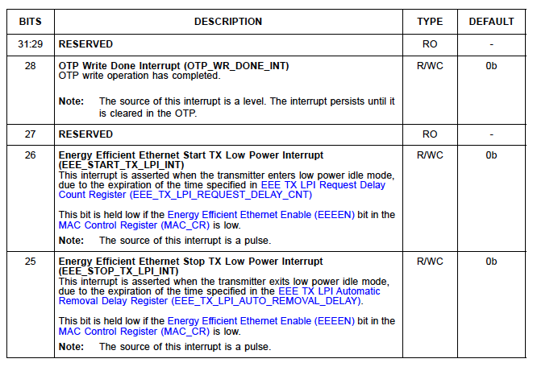
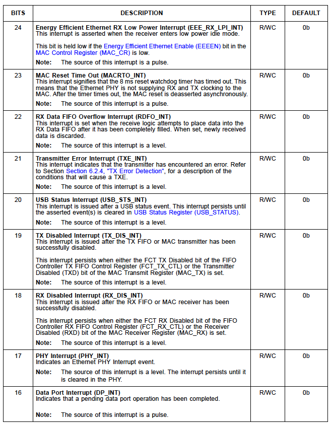
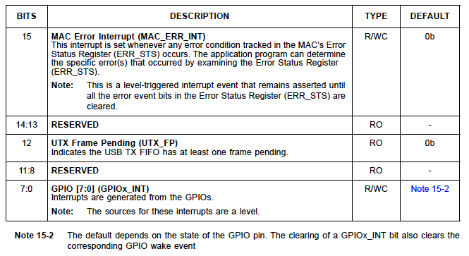

### 15.1.3 Hardware Configurationレジスタ (HW_CFG)

- アドレス: 010h
- サイズ: 32 bits

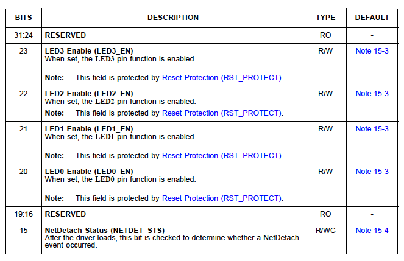
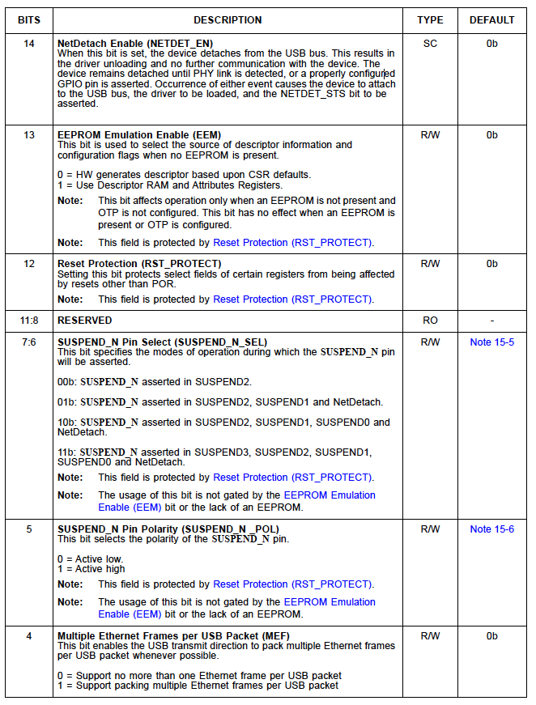
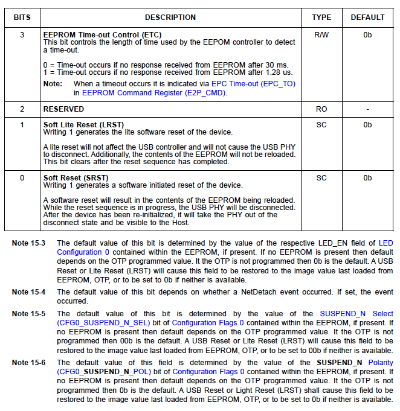

### 15.1.27 Interrupt Endpoint Controlレジスタ (INT_EP_CTL)

- アドレス: 098h
- サイズ: 32 bits

このレジスタは、どのイベントのステータスが割り込みエンドポイントによって
報告させるかを決定します。詳細については31ページの「5.5 割り込みエンド
ポイント」を参照してください。

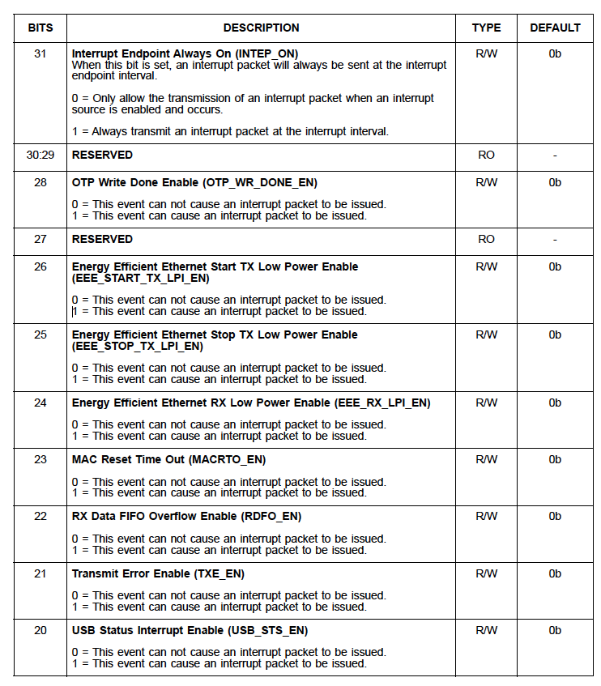
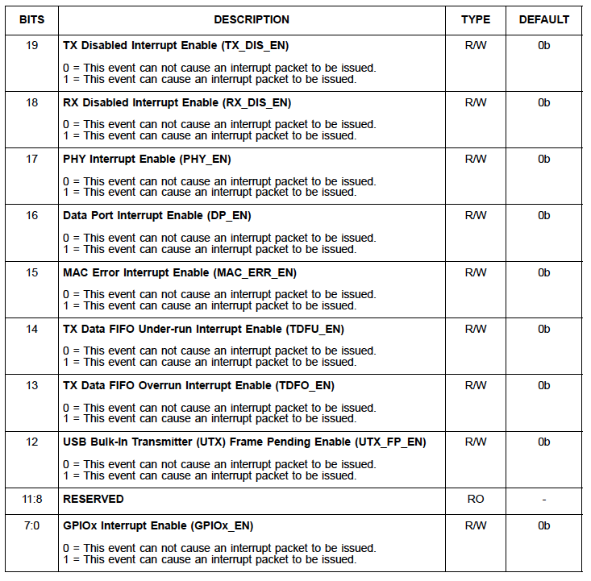

## 15.1.34 FIFO Controller Rx FIFO Controlレジスタ (FCT_RX_CTL)

- アドレス: 0C0h
- サイズ: 32 bits

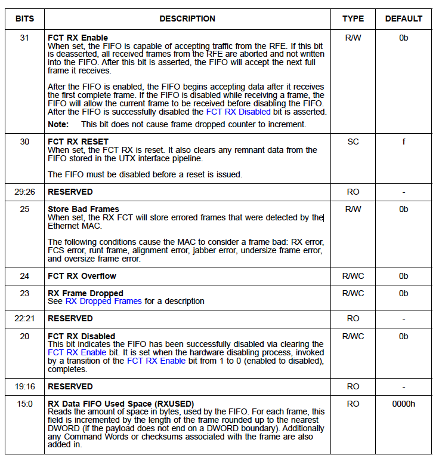

## 15.1.35 FIFO Controller Tx FIFO Controlレジスタ (FCT_TX_CTL)

- アドレス: 0C4h
- サイズ: 32 bits

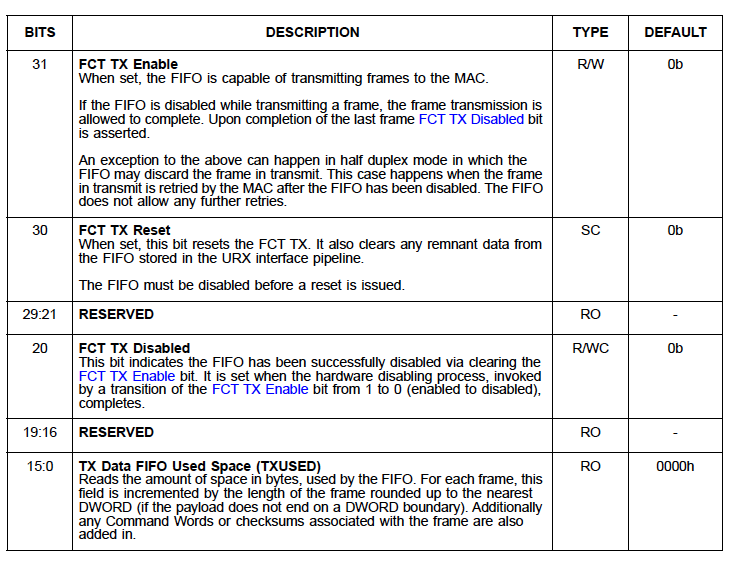

## 15.1.48 MAC Receiveレジスタ (MAC_RX)

- アドレス: 104h
- サイズ: 32 bits

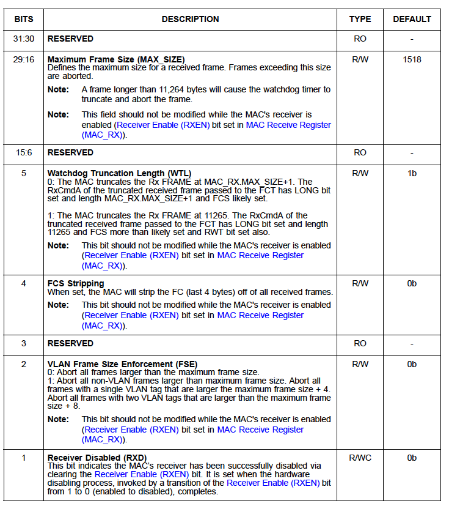

## 15.1.49 MAC Transmitレジスタ (MAC_TX)

- アドレス: 108h
- サイズ: 32 bits

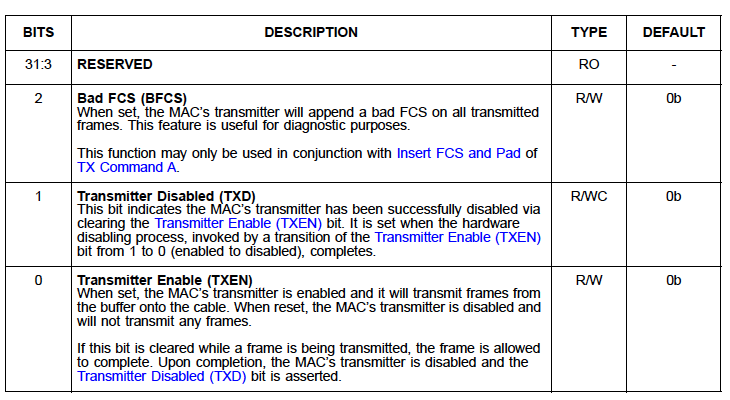

## 15.2 USB PHY制御およびステータスレジスタ

> 注意: USB PHY制御およびステータスレジスタマップのRESERVEDアドレス空間はいかなる状況でも書き込んではいけません。この警告に従わない場合、不適切な動作や予期せぬ結果を招く恐れがあります。

## 15.3 Ethernet PHY制御およびステータスレジスタ

Ethernet PHYレジスタはメモリマップドではありません。これらのレジスタにはMII
アクセスレジスタ(MII_ACCESS)とMIIデータレジスタ(MII_DATA)を介してイーサネット
MACから間接的にアクセスします。Ethernet PHYは次の主要なカテゴリのレジスタへの
アクセスを提供します。

- Ethernet PHYメインページレジスタ
- Ethernet PHY拡張ページ1レジスタ
- Ethernet PHY拡張ページ2レジスタ

> 注意: PHYレジスタページへのアクセスはEthernet PHY拡張ページアクセスレジスタに
> より制御されます。拡張ページ1/2レジスタのアクセスがイネーブルな場合、
> レジスタ16から30へのリードとライトは、IEEEが指定したレジスタ空間のメイン
> ページレジスタではなく、対応するページの拡張レジスタに影響を与えます。
> レジスタ0から15は拡張ページレジスタアクセスの状態により影響は受けません。
> Ethernet PHY 拡張ページアクセスレジスタに 0000h を書き込むと、メインページ
> レジスタアクセスが回復します。

> 注意: リストにないレジスタのインデックス値はすべてサポートされていません。アドレス指定してはいけません。

### 15.3.1 Ethernet PHYメインページレジスタ

この節ではイーサネットPHYメインページレジスタを詳述します。

> 注: イーサネットPHYメインページレジスタの0から15はページ0, 1, 2から
> アクセスできます。
> 特定のページでしかアクセスできないレジスタについては個々のレジスタの
> 説明で示されています。
> PHYレジスタページへのアクセスはEthernet PHY Extended Page Access
> レジスタにより制御されます。

#### 15.3.1.1 Ethernet PHY Mode Controlレジスタ

- インデックス: 0
- 利用可能ページ: 0, 1, 2
- サイズ: 16 ビット

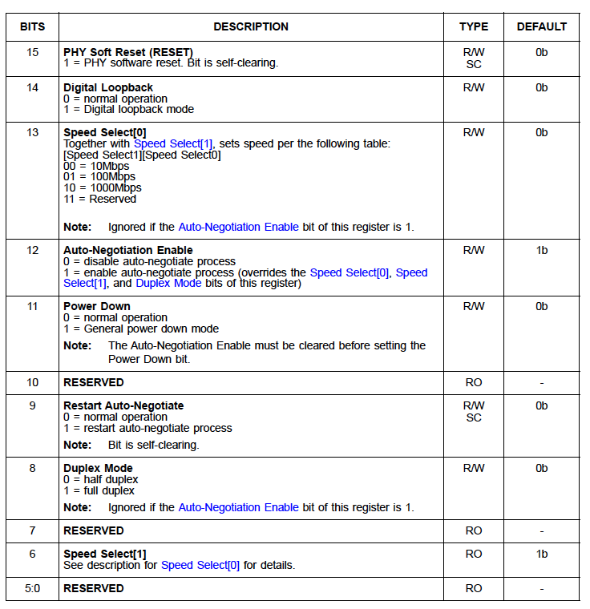

### 15.3.1.26 Ethernet PHY Auxiliary Control and Statusレジスタ

- インデックス: 28
- 利用可能ページ: 0
- サイズ: 16 ビット

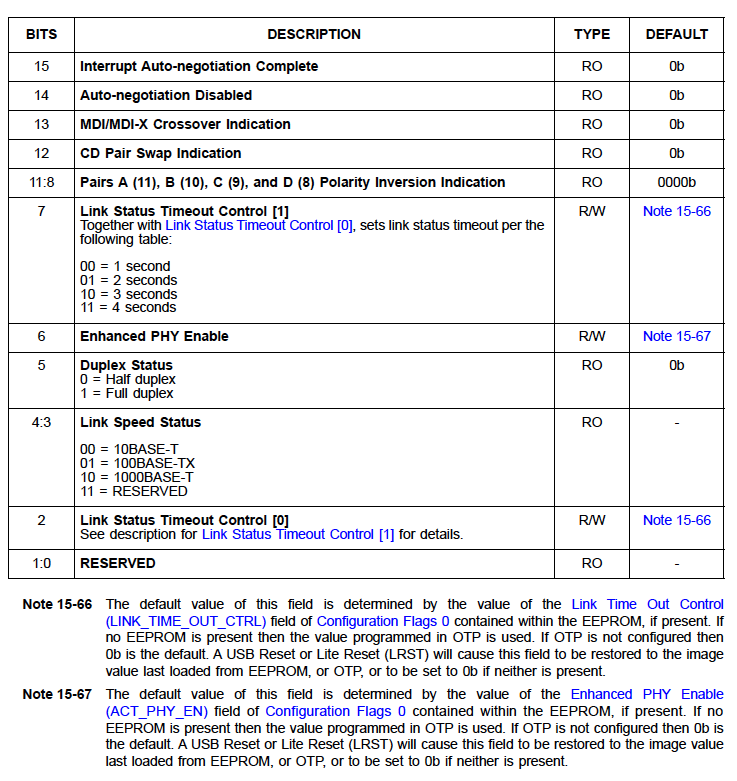

## 15.4: MDIO管理デバイス(MMD)制御およびステータスレジスタ

デバイスMMDレジスタはIEEE 802.3-2008 45.2 MDIOインタフェースレジスタ仕様に
準拠しています。MMDレジスタはメモリマップドではありません。これらのレジスタには
Ethernet PHY MMDアクセス制御レジスタとEthernet PHY MMDアクセスアドレス/データ
レジスタを介して間接的にアクセスします。表 15-12に利用可能なMMD制御および
ステータスレジスタを示しました。

