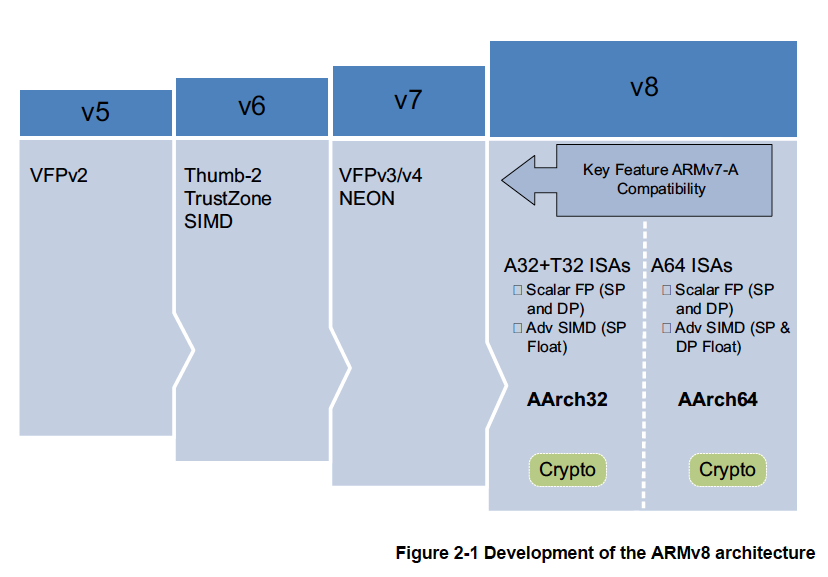
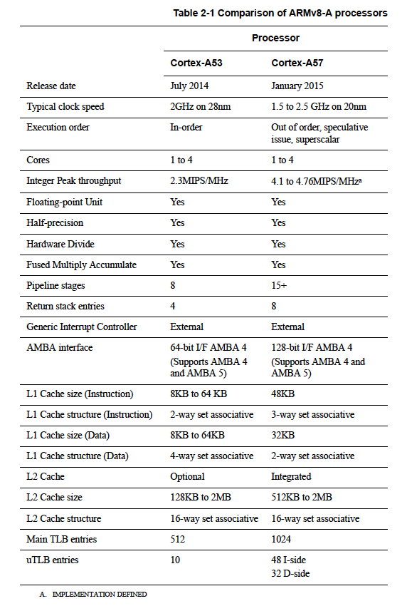
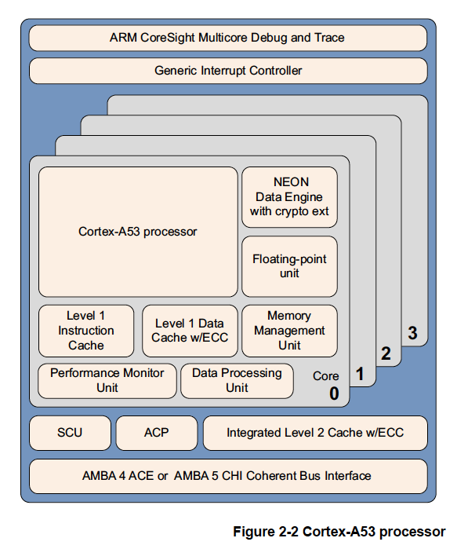
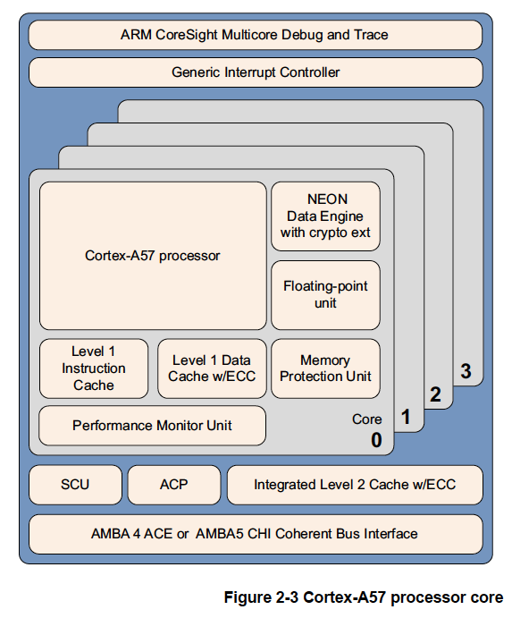

# 2章 ARMv8アーキテクチャとポロセッサ

ARMアーキテクチャの歴史は1985年までさかのぼりますが、決して静止していたわけでは
ありません。それどころか、初期のARMコアから大規模な発展を遂げ、各アーキテクチャ
ごとに機能や性能が追加されてきました。

<dl>
<dt>ARMv4以前</dt>
<dd>これらの初期のプロセッサはARM 32ビット命令セットだけを使用していました。</dd>
<dt>ARMv4T</dt>
<dd>ARMv4TアーキテクチャはARM 32ビット命令セットにThumb 16ビット命令セットを
    追加しました。これは広くライセンスされた最初のアーキテクチャです。ARM7TDMIと
    ARM9TDMIプロセッサに実装されました。</dd>
<dt>ARMv5TE</dt>
<dd>ARMv5TEアーキテクチャはDSPタイプの演算、飽和演算、ARMとThumbの相互運用の
    ための改良が加割りました。ARM926EJ-Sはこのアーキテクチャを実装しています。</dd>
<dt>ARMv6</dt>
<dd>ARMv6では非整列メモリアクセスのサポート、メモリアーキテクチャの大幅な変更、
    マルチプロセッサのサポートなどの機能強化が行われました。さらに、32ビット
    レジスタ内のバイトまたはハーフワードに作用するSIMD演算が一部サポートされました。
    ARM1136JF-Sはこのアーキテクチャを実装しています。ARMv6アーキテクチャは
    オプションの拡張機能も提供されました。中でもThumb-2とセキュリティ拡張
    （TrustZone）が重要です。Thumb-2はThumbを16ビットと32ビットが混在する命令
    セットとして拡張するものです。</dd>
<dt>ARMv7-A</dt>
<dd>ARMv7-AアーキテクチャではThumb-2拡張が必須となり、Advanced SIMD拡張（NEON）が
    追加されました。ARMv7以前ではすべてのコアが基本的に同じアーキテクチャまたは
    機能セットである必要がありました。ますます多様化するアプリケーションに対応
    するため、ARMは一連のアーキテクチャプロファイルを導入しました。
    <ul>
    <li>ARMv7-AはLinuxなどのプラットフォームOSをサポートするために必要なすべての
        機能を提供します。</li>
    <li>ARMv7-Rは予測可能なリアルタイムハイパフォーマンスを提供します。</li>
    <li>ARMv7-Mは深く組み込まれるマイクロコントローラを対象としています。 
    Mプロファイルは旧アーキテクチャ向けの機能が利用できるようにARMv6アーキテ
    クチャにも追加されました。ARMv6Mプロファイルは低消費電力で低価格のマイクロ
    プロセッサで使用されています。</li></ul></dd>
</dl>

## 2.1 ARMv8-A

ARMv8-AアーキテクチャはA（アプリケーション）プロファイルを対象とする最新世代の
ARMアーキテクチャです。ARMv8という名称はアーキテクチャ全体を表すものであり、
このアーキテクチャでは32ビット実行と64ビット実行の両方が含まれるようになりました。
64ビット幅のレジスタで実行する機能を導入していますが、既存のARMv7ソフトウェアとの
後方互換性も持っています。

ARMv8-Aアーキテクチャでは多くの変更点が導入され、より高性能なプロセッサの実装設計が
可能になりました。

<dl>
<dt>大規模な物理アドレス</dt>
<dd>プロセッサは4GBを超える物理メモリのアクセスが可能になります。</dd>
<dt>64ビット仮想アドレッシング</dt>
<dd>4GBの制限を超える仮想メモリが使用可能になります。これはメモリマップドファイル
    I/Oやスパースアドレッシングを使用する現代のデスクトップやサーバソフトウェアで
    重要です。</dd>
<dt>自動イベント通知機能</dt>
<dd>電力効率に優れ、高性能なスピンロックが可能になります。</dd>
<dt>レジスタファイルの拡大</dt>
<dd>31個の64ビット汎用レジスタによりパフォーマンスが向上し、スタックの使用が
    削減されます。</dd>
<dt>効率的な64ビット即値の生成</dt>
<dd>リテラルプールの必要性が減少します。</dd>
<dt>大きなPC相対アドレス範囲</dt>
</dd>+/-4GBのアドレス範囲により共有ライブラリや位置非依存型実行ファイル内の
    データアドレスを効率的に使用できます。</dd>
<dt>16KBと64KBの変換粒度の追加</dt>
<dd>TLB（Translation Lookaside Buffer）のミス率とページウォーク深度が軽減されます。</dd>
<dt>新しい例外モデル</dt>
<dd>OSとハイパバイザソフトウェアの複雑さが軽減されます。</dd>
<dt>効率的なキャッシュ管理</dt>
<dd>ユーザ空間キャッシュ操作により動的コードの生成効率が向上します。データキャッシュ
    ゼロ命令の使用によりデータキャッシュのクリアが高速化されます。</dd>
<dt>ハードウェアアクセラレーションによる暗号化</dt>
<dd>ソフトウェアによる暗号化性能が3倍から10倍向上します。これはハードウェア
    アクセラレータに効率的にオフロードするには小さすぎる領土の小さい復号化と
    暗号化（httpsなど）に有効です。</dd>
<dt>ロード取得・ストア解放命令</dt>
<dd>C++11、C11、Javaのメモリモデル用に設計されています。明示的なメモリバリア命令が
    排除されることによりスレッドセーフなコードの性能が向上します。</dd>
<dt>NEON倍精度浮動小数点先進SIMD</dt>
<dd>SIMDベクトル化を科学計算やハイパフォーマンスコンピューティング（HPC）、
    スーパーコンピュータなどより多くのアルゴリズムに適用できるようにします。</dd>
</dl>

## 2.2 ARMv8-Aプロセッサプロパティ

表2-1はARMv8-AアーキテクチャをサポートするARMプロセッサ実装のプロパティを比較した
ものです。

### 2.2.1 ARMv8プロセッサ

ARMv8-Aアーキテクチャを実装した各プロセッサーについて説明します。どちらのケースも
一般的な説明だけです。各プロセッサのより具体的な情報については表 2-1を参照して
ください。

#### Cortex-A53プロセッサ

Cortex-A53プロセッサはミッドレンジの低消費電力プロセッサです。1つのクラスタに
1つから4つのコアを持ち、各コアにはL1キャッシュサブシステムがあり、オプションの
統合GICv3/4インターフェースとオプションのL2キャッシュコントローラが備わっています。

Cortex-A53プロセッサは32ビットと64ビットのコードをサポートする非常に電力効率の
高いプロセッサです。高い評価を得ているCortex-A7プロセッサよりも大幅に高い性能を
実現します。スタンドアロンのアプリケーションプロセッサとしても、Cortex-A57
プロセッサと組み合わせたbig.LITTLE構成としても、最適なパフォーマンスと拡張性、
エネルギー効率を実現できます。

Cortex-A53プロセッサは次のような特徴を備えています。

- インオーダーの8段パイプライン。
- 階層型クロックゲーティング、パワードメイン、先進リテンションモードの使用による
  低消費電力化。
- 実行リソースの二重化とデュアル命令デコーダによるデュアルイシュー機能の向上。
- 消費電力に最適化されたL2キャッシュ設計により、低レイテンシとバランスのとれた
  性能と効率を実現。

#### Cortex-A57プロセッサ

Cortex-A57プロセッサはハイエンドコンピュータ、タブレット、サーバ製品などの演算量の
多い64ビットアプリケーションを含むモバイルおよびエンタープライズコンピューティング
アプリケーションを対象としています。Cortex-A53プロセッサと組み合わせたARM
big.LITTLE構成として使用することでスケーラブルな性能とより効率的なエネルギー利用を
実現することができます。

Cortex-A57プロセッサは、GPUコンピューティング用のARM Mali™グラフィックス処理
ユニット（GPU）ファミリなどの他のプロセッサとのキャッシュコヒーレント相互運用性を
備え、高性能エンタープライズアプリケーション向けの信頼性とスケーラビリティ機能を
オプションで提供します。ARMv7 Cortex-A15プロセッサに比べて大幅に高い性能をより
高い電力効率で提供します。暗号拡張機能の搭載により暗号アルゴリズムに関する性能が
前世代のプロセッサと比較して10倍向上しています。

Cortex-A57プロセッサはARMv8-Aアーキテクチャを完全に実装しています。1つのクラスタ
内で1～4コアのマルチプロセッシングが可能なマルチコア動作を実現しています。
AMBA5 CHIまたはAMBA 4 ACEテクノロジにより、複数のコヒーレントSMPクラスタが
可能です。CoreSightテクノロジに通じてデバッグとトレースが可能です。

Cortex-A57プロセッサは、次のような特徴を備えています。

- アウトオブオーダ、15段以上のパイプライン。
- ウェイ予測、タグ削減、キャッシュルックアップの抑制などの省電力機能。
- 実行リソースの二重化によるピーク時命令スループットの向上。
  ローカライズされたデコードと3ワイドデコードバンド幅を持つ電力に最適化された
  命令デコード。
- 性能に最適化されたL2キャッシュ設計により、クラスタ内の複数のコアが同時にL2に
  アクセス可能。
