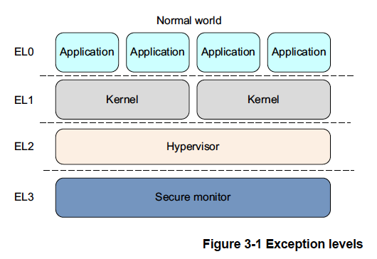
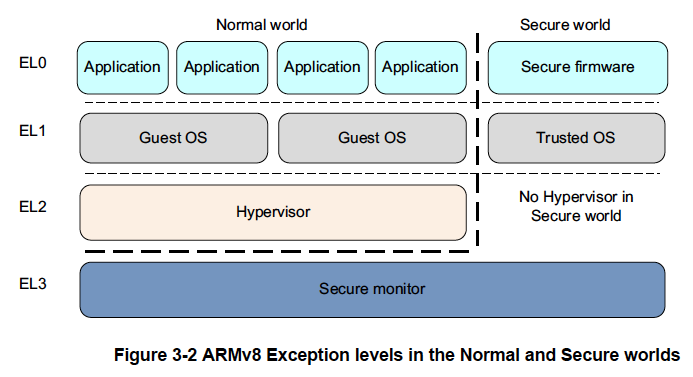
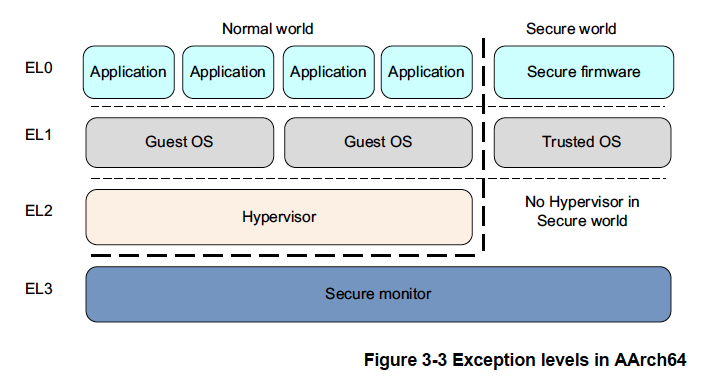
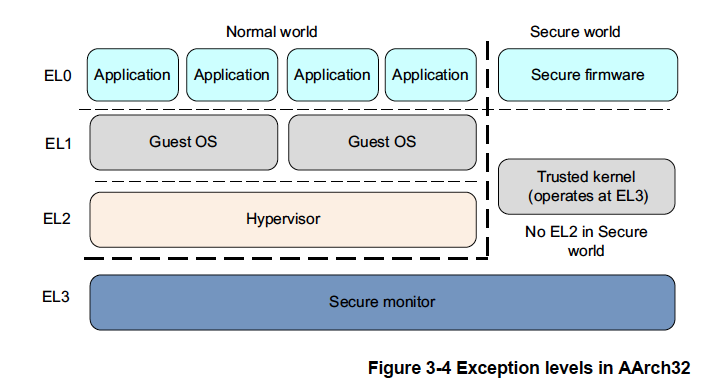
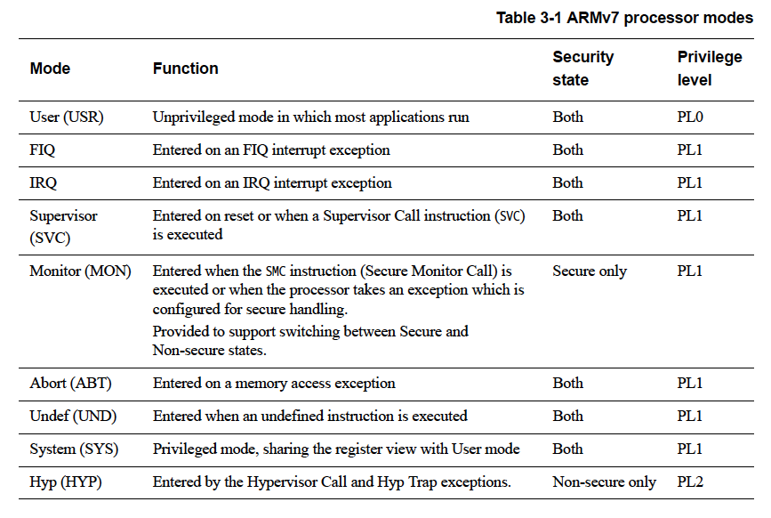
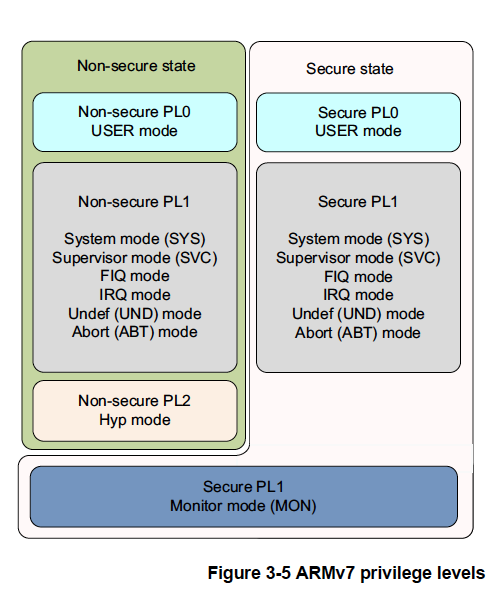
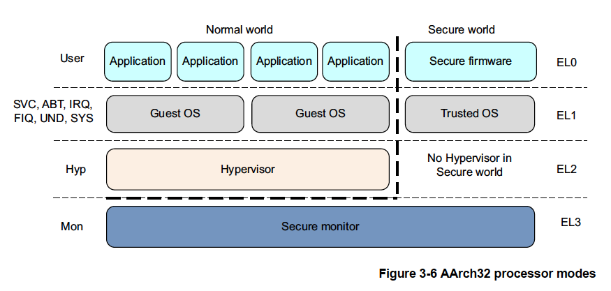
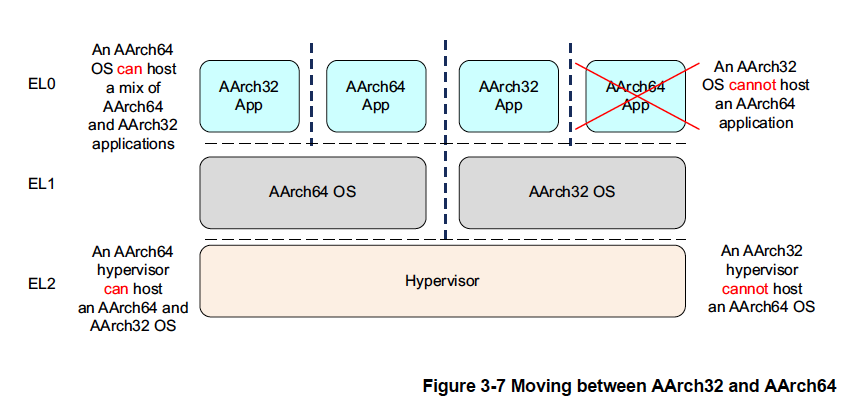

# 3章 ARMv8の基礎

ARMv8では実行は4つのExceptionレベルのいずれかで行われます。AArch64では例外
レベルが特権レベルを決定します。これはARMv7において定義されている特権レベルと
同様な方法です。例外レベルが特権レベルを決定するため、ELnでの実行は特権PLnに
対応します。同様に、nの値が他のものよりも大きい例外レベルは、より高い例外
レベルになります。他のものよりも数値が小さい例外レベルはより低い例外レベルに
あると表現されます。

例外レベルによりARMv8アーキテクチャのすべての動作状態に適用されるソフトウェアの
実行権限は論理的に分離されます。これは、コンピュータサイエンスで一般的な階層的
保護領域の概念に類似しており、これをサポートしています。

以下は、各例外レベルで実行されるソフトウェアの典型例です。

<dl class="dl-inline">
<dt>EL0</dt><dd>通常のユーザーアプリケーション</dd>
<dt>EL1</dt><dd>一般に特権的と言われるオペレーティングシステムカーネル</dd>
<dt>EL2</dt><dd>ハイパバイザ</dd>
<dt>EL3</dt><dd>セキュアモニタなどの低レベルのファームウェア</dd>
</dl>

一般に、アプリケーション、オペレーティングシステムのカーネル、ハイパーバイザー
などの1つのソフトウェアは1つの例外レベルを占めます。この規則の例外はKVMなどの
カーネル内ハイパバイザであり、これはEL2とEL1にわたって動作します。

ARMv8-Aはセキュアと非セキュアという2つのセキュリティ状態を提供します。非セキュア
状態は通常世界とも呼ばれます。これは同一ハードウェア上でトラステッドOSと並行
してオペレーティングシステム（OS）を動作させることを可能にし、特定のソフトウェア
攻撃やハードウェア攻撃に対する防御も提供します。ARM TrustZone技術により通常世界と
セキュアな世界の間でシステムを分割することが可能です。ARMv7-Aアーキテクチャと
同様に、セキュアなモニタは通常世界とセキュアな世界の間を移動するためのゲート
ウェイとして機能します。

ARMv8-Aは通常世界だけですが仮想化もサポートしています。これはハイパバイザやVMM
（Virtual Machine Manager）コードがシステム上で実行でき、複数のゲストOSをホスト
することができることを意味します。各ゲストOSは基本的に仮想マシン上で動作している
ことになります。各OSは他のゲストOSとシステム上で時間を共有していることを意識する
ことはありません。

（非セキュアな状態に対応する）通常世界には以下のような特権的なコンポーネントが
あります。

<dl>
<dt>ゲストOSカーネル</dt>
<dd>非セキュアなEL1で動作するLinuxやWindowsなどのカーネルです。ハイパバイザ配下で
    実行する場合、リッチOSカーネルはハイパバイザーモデルに応じてゲストまたは
    ホストとして実行するすることができます。</dd>
<dt>ハイパバイザ</dt>
<dd>ハイパバイザはEL2で実行され、常に非セキュアです。ハイパバイザは存在し有効な
    る場合、リッチOSカーネルに仮想化サービスを提供します。</dd>
</dl>

セキュアな世界には以下の特権的なコンポーネントがあります。

<dl>
<dt>セキュアなファームウェア</dt>
<dd>アプリケーションプロセッサにおいて、このファームウェアはブート時に最初に
    実行されるものでなければなりません。このファームウェアはプラットフォームの
    初期化やトラステッドOSのインストール、セキュアなモニタコールのルーティング
    などのサービスを提供します。</dd>
<dt>トラステッドOS</dt>
<dd>トラステッドOSは通常の世界に対してセキュアなサービスを提供し、セキュアな
    アプリケーションやトラステッドアプリケーションを実行するためのランタイム
    環境を提供します。</dd>
</dl>

ARMv8アーキテクチャのセキュアモニタは他のすべてのレベルより高い例外レベルにあり、
より大きな特権があります。これはソフトウェア特権の論理モデルを提供します。

図3-2はEL2のセキュアバージョンは利用できないことを示しています。

## 3.1 実行状態

ARMv8アーキテクチャはAArch64とAArch32という2つの実行状態が定義しています。
それぞれの状態は64ビット幅の汎用レジスタと32ビット幅の汎用レジスタを使用
した実行を記述するために使用されます。ARMv8のAArch32ではARMv7の権限定義を継承
していますが、AArch64では例外レベルによって権限レベルが決定されます。そのため
ELnでの実行が権限PLnに対応します。

AArch64状態にある場合、プロセッサはA64命令セットを実行します。AArch32
状態にある場合、プロセッサはA32（以前のバージョンのアーキテクチャでは
ARMと呼ばれていたた）またはT32（Thumb）命令セットのいずれかを実行できます。

次の図はAArch64とAArch32における例外レベルの構成を示したものです。

AArch64の場合

AArch32の場合

AArch32状態の場合、トラステッドOSソフトウェアはセキュアEL3で実行されますが、
AArch64状態の場合は主にセキュアEL1で実行されます。

## 3.2 例外レベルの変更

ARMv7アーキテクチャではプロセッサのモードは特権的なソフトウェアが制御することで、
または例外発生時に自動的に変更することができます。例外が発生するとコアは現在の
実行状態とリターンアドレスを保存し、必要なモードに入り、場合によってはハード
ウェア割り込みも無効にします。

これは次の表にようにまとめられます。アプリケーションは最も低い権限レベルである
PL0（以前の非権限モード）で動作します。オペレーティングシステムはPL1で、仮想化
拡張機能を搭載したシステムのハイパバイザはPL2で動作します。セキュア世界と非セキュア
（通常）世界を行き来するためのゲートウェイとして機能するセキュアモニタもPL1で
動作します。

AArch64ではプロセッサのモードは図3-6のように例外レベルにマッピングされます。
ARMv7（AArch32）と同様に例外が発生するとプロセッサはその例外の処理をサポート
する例外レベル（モード）に変更されます。

例外レベル間の移動は次のルールに従います。

- EL0からEL1のように、より高い例外レベルへの移動はソフトウェアの実行権限が
  増加したことを示します。
- 例外を下位の例外レベルに移行させることはできません。
- EL0レベルの例外処理はありません。例外はより高い例外レベルで処理される必要が
  あります。
- 例外はプログラムフローを変更させる要因になります。例外ハンドラの実行はEL0より
  高い例外レベルにおいて取得した例外に関連する定義済みのベクトルから開始されます。
  例外には以下のようなものがあります。

  - IRQやFIQなどの割り込み。
  - メモリシステムのアボート
  - 未定義の命令。
  - システムコール。非特権ソフトウェアがオペレーティングシステムにシステムコールを
    行うことを可能にします。
  - セキュアモニタやハイパバイザのトラップ

- 例外処理の終了と以前の例外レベルへの復帰はERET命令の実行により行われます。
- 例外からの復帰により、同じ例外レベルに留まることも、より低い例外レベルに入る
  こともできます。上位の例外レベルに移行することはできません。
- 例外レベルの変更に伴いセキュリティ状態は変化します。ただし、EL3から非セキュア
  状態への復帰は除きます。「17.4 セキュアな状態と非セキュアな状態の切り替え」を
  参照してください。

## 3.3 実行状態の変更

システムの実行状態を変更する必要がある場合があります。たとえば、64ビットの
オペレーティングシステムの使用中に32ビットのアプリケーションをEL0で実行したい
場合などです。これを行うには、システムをAArch32に変更する必要があります。

アプリケーションの完了時や実行がOSに戻る際に、システムはAArch64に戻ることが
できます。図3-7はその逆はできないことを示しています。AArch32オペレーティング
システムは64ビットアプリケーションをホストすることはできません。

同一の例外レベルで実行状態を変更するには、より高い例外レベルに切り替えた後、
元の例外レベルに戻る必要があります。たとえば、64ビットOSで稼働する32ビット
アプリケーションと64ビットアプリケーションがあるとします。この場合、32ビット
アプリケーションがスーパバイザコール（SVC）命令を実行・生成したり、割り込みを
受けたりするとEL1のAArch64に切り替わります（「6.5.1 例外処理命令」を参照）。
その後OSはタスクスイッチを実行してAArch64のEL0に戻ることができます。事実上、
これは32ビットと64ビットのアプリケーションを混在させることはでき無いことを
今します。お互いを呼び出す直接的な方法が存在しないからです。

実行状態を変更するには例外レベルを変更するしかありません。例外を受け取ることで
AArch32からAArch64に変更し、例外から復帰することでAArch64からAArch32に変更する
ことができます。

EL3のコードはより高い例外レベルに移行する例外を受け取ることができないので、
リセットを経由する以外、実行状態を変更することができません。

以下に、AArch64とAArch32の実行状態を変更する際のポイントをまとめます。

- AArch64実行状態もAArch32実行状態も共に例外レベルは概ね同じですが、セキュアな
  操作と非セキュアな操作で若干の違いがあります。例外が発生したときのプロセッサの
  実行状態により他方の実行状態で利用できる例外レベルが制限されることがあります。
- AArch32への変更には、上位の例外レベルから下位の例外レベルへ移行が必要です。
  これはERET命令の実行により例外ハンドラを終了する結果です。「6.5.1 例外処理命令」
  を参照してください。
- AArch64への変更すには、下位の例外レベルから上位の例外レベルへの移行が必要です。
  例外は命令実行や外部信号の結果で発生します。
- 例外を受信したり例外から復帰する際に例外レベルが変わらなければ実行状態を変更
  することはできません。
- ARMv8プロセッサが特定の例外レベルでAArch32実行状態で動作する場合、その例外
  レベルで受け取る例外に対してはARMv7と同じ例外モデルを使用します。AArch64実行
  状態では「10章 AArch64例外処理」に記載されている例外処理モデルを使用します。

したがって、この2つの状態間のインターワーキングは、セキュアモニタ、ハイパバイザ
またはオペレーティングシステムのレベルで実行されます。AArch64状態で実行される
ハイパバイザとオペレーティングシステムはより低い権限レベルでAArch32操作をサポート
できます。これはAArch64で実行するOSはAArch32とAArch64のアプリケーションをホスト
することができることを意味します。同様に、AArch64ハイパバイザはAArch32とAArch64の
ゲストOSをホストすることができます。ただし、32ビットのオペレーティングシステムは
64ビットのアプリケーションをホストできず、32ビットのハイパバイザは64ビットの
ゲストOSをホストできません。

実装されている最高レベルの例外レベル（Cortex-A53とCortex-A57プロセッサではEL3）
では、例外を受け取る際に各例外レベルでどの実行状態を使用するかは決まっています。
例外レベルはプロセッサをリセットすることによってのみ変更できます。EL2およびEL1に
ついては、「4.3 システムレジスタ」で制御されます。
