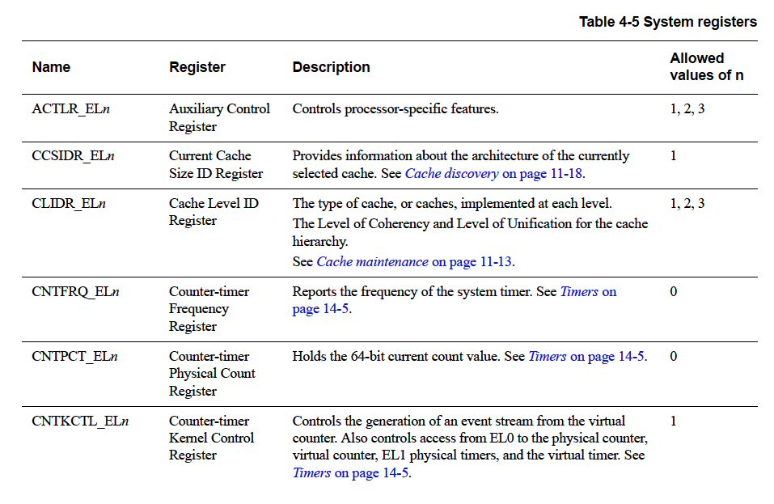
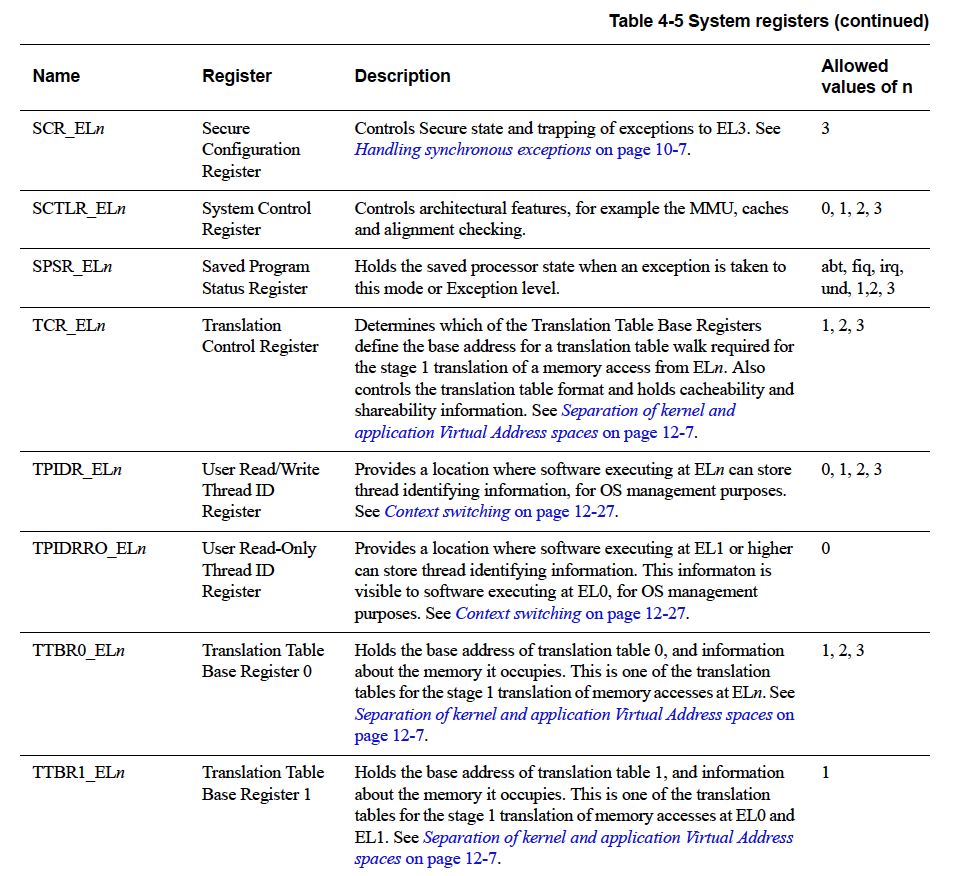

# 4章 ARMv8レジスタ

AArch64実行状態には31個の64ビット汎用レジスタがあり、いつでもすべてのレベルで
アクセス可能です。

各レジスタは64ビット幅であり一般にレジスタX0-X30と呼ばれています。


各AArch6464ビット汎用レジスタは32ビットの形（W0-W30）も持ちます。


32ビットのWレジスタは対応する64ビットのXレジスタの下半分を形成します。つまり、
W0はX0の下位ワードに、W1はX1の下位ワードに各々マッピングされます。

Wレジスタからの読み出しの際には対応するXレジスタの上位32ビットは無視され
変更されません。Wレジスタへの書き込みの際にはXレジスタの上位32ビットは0に
設定されます。つまり、W0に0xFFFFFFFFを書き込むとX0は0x00000000FFFFFFFFにセット
されます。

## 4.1 AArch64特殊レジスタ

31個のコアレジスタ以外に複数の特殊レジスタもあります。


<hr class="note"/>
X31やW31というレジスタはありません。多くの命令では31番がゼロレジスタであるZRを
表すように符号化されています（WZR/XZR）。また、1つ以上の引数が番号31がスタック
ポインタ（SP）を表すように符号化されてい命令群も少しあります。
<hr/>

ゼロレジスタにアクセスする場合、すべての書き込みは無視され、すべての読み込みは
0を返します。64ビットのSPレジスタはX接頭辞を使用しないことに注意してください。


ARMv8アーキテクチャではAArch64で実行する場合、例外の復帰状態は例外レベルごとに
以下の専用レジスタに保持されます。

- ELF（例外リンクレジスタ: Exception Link Register）
- SPSR（プロセッサ状態保存レジスタ: Saved Processor State Register）

例外レベルごとに専用のSPがありますが、復帰状態の保持には使用されません。


### 4.1.1 ゼロレジスタ

ゼロレジスタはソースレジスタとして使用された場合はゼロとして読み取られ、
デスティネーションレジスタとして使用された場合は結果を破棄します。ゼロ
レジスタはほとんどの命令で使用できますがすべての命令で使用できるわけでは
ありません。

### 4.1.2 スタックポインタ

ARMv8アーキテクチャでは使用するスタックポインタの選択は例外レベルからある程度
分離されています。デフォルトでは例外が発生すると対象となる例外レベルのスタック
ポインタSP_ELnが選択されます。たとえば、EL1で例外を発生した場合はSP_EL1が選択
されます。各例外レベルはSP_EL0、SP_EL1、SP_EL2、SP_EL3という独自のスタック
ポインタを持っています。

AArch64でEL0以外の例外レベルの場合、プロセッサは以下のいずれかを使用することが
できます。

- その例外レベルに関連付けられた専用の64ビットスタックポインタ(SP_ELn)
- EL0に関連付けられたスタックポインタ（SP_EL0）

EL0はSP_EL0にしかアクセスできません。


接尾時tはSP_EL0スタックポインタが選択されていることを示します。接尾時hは
SP_ELnスタックポインタが選択されていることを示します。

SPはほとんどの命令で参照できません。しかし、たとえばADD命令のようないくつかの
形式の演算命令は現在のスタックポインタの読み書きができ、関数内のスタック
ポインタの調整を行うために使用できます。たとえば次のように。

```
ADD SP, SP, #0x10       // SPを現在の値より0x10バイト前に調整する
```

### 4.1.3 プログラムカウンタ

オリジナルのARMv7命令セットの特徴の1つはプログラムカウンタ（PC）のR15を汎用
レジスタとして使用することでした。PCを利用することで巧妙なプログラミングが可能
でしたがコンパイラや複雑なパイプラインの設計が複雑になっていました。ARMv8では
PCに直接アクセスできなくようにしたので戻り値の予測が容易になり、ABI仕様も簡素化
されました。

PCを名前付きレジスタとしてアクセスすることはけっしできません。PCはPC相対ロード
命令やアドレス生成命令などの特定の命令で暗黙的に使用されます。PCはデータ処理
命令やロード命令のディスティネーションとして指定することはできません。

### 4.1.4 例外リンクレジスタ（ELR)

例外リンクレジスタは例外復帰アドレスを保持します。

### 4.1.5 プロセス状態保存レジスタ（SPSR）

例外を発生した場合、ARMv7のCPSRと同じようにプロセッサの状態が関連するプロセウ
状態保存レジスタ（SPSR）に保存されます。SPSRは例外発生前のPSTATEの値を保持し、
例外復帰を実行する際にPSTATEの値を復元するために使用されます。


個々のビットはAArch64では以下の値を表します。

<dl class="dl-inline">
<dt>N</dt><dd>負の結果 (Nフラグ)</dd>
<dt>Z</dt><dd>ゼロ結果 (Zフラグ)</dd>
<dt>C</dt><dd>キャリーアウト (Cフラグ)</dd>
<dt>V</dt><dd>オーバーフロー (Vフラグ)</dd>
<dt>SS</dt><dd>ソフトウェアステップ。例外発生時にソフトウェアステップが有効で
               あったか否かを示します</dd>
<dt>IL</dt><dd>不正な実行状態ビット。例外が発生する直前のPSTATE.ILの値を示します</dd>
<dt>D</dt><dd>プロセス状態デバッグマスク。例外が発生した例外レベルを対象とするウォッチポイント、ブレークポイント、ソフトウェアステップデバッグイベントによるデバッグ例外がマスクされていたか否かを示します</dd>
<dt>A</dt><dd>SError (System Error)マスクビット</dd>
<dt>I</dt><dd>IRQマスクビット</dd>
<dt>F</dt><dd>FIQマスクビット</dd>
<dt>M[4]</dt><dd>例外を発生させた実行状態。値0はAArch64を示します</dd>
<dt>M[3:0]</dt><dd>例外を発生させたモードまたは例外レベルを示します</dd>
</dl>

ARMv8では書き込まれるSPSRは例外レベルに依存します。例外がEL1で発生した場合は
SPSR_EL1が使用されます。例外がEL2で発生した場合はSPSR_EL2が、EL3で発生した
場合はSPSR_EL3が使用されます。例外が発生するとコアがSPSRを設定します。

<hr class="note"/>
例外レベルに関連するELR_ELnとSPSR_ELnのレジスタペアは下位の例外レベルでの
実行中もその状態を保持します。
<hr/>

## 4.2 プロセッサの状態

AArch64にはARMv7のCPSR（Current Program Status Register）に直接相当するものは
ありません。AArch64では従来のCPSRの構成要素は個別にアクセス可能なフィールドとして
提供されています。これらはまとめてプロセッサステート(PSTATE)と呼ばれます。

AArch64のPSTATE（Processor State）フィールドは次のように定義にされています。


AArch64ではERET命令を実行することで例外から復帰しますが、これによりSPSR_ELnが
PSTATEにコピーされます。さらに、ALUフラグ、実行状態、例外レベル、プロセッサ
ブランチが復元されます。そしてELR_ELnのアドレスから実行が継続されます。

PSTATE.{N、Z、C、V}フィールドは、EL0からアクセスすることができます。その他の
PSTATEフィールドはEL1以上でしか実行できずEL0では未定義です。

## システムレジスタ

AArch64ではシステム構成はシステムレジスタにより制御されます。これらのシステム
レジスタにはMSR命令とMRS命令を使ってアクセスします。これは、通常そのような
レジスタはコプロセッサ15（CP15）操作を通じてアクセスするARMv7-Aとは対照的です。
レジスタの名前はそのレジスタにアクセスできる最下位の例外レベルを示しています。

たとえば

- TTBR0_EL1は、EL1、EL2、EL3からアクセスできます。
- TTBR0_EL2は、EL2とEL3からアクセスできます。

ELnという接尾辞を持つレジスタはいくつかのレベル、またはすべてのレベルに個別の
バンクされたコピーがあります。ただし、通常EL0にはありません。EL0からアクセス
できるシステムレジスタはほとんどありませんが、キャッシュタイプレジスタ (CTR_EL0) は
アクセス可能なレジスタの一例です。

システムレジスタにアクセスするコードは次のような形式をとります。

```
MRS x0, TTBR0_EL1       // TTBR0_EL1をx0に移動
MSR TTBR0_EL1, x0       // x0をTTBR0_EL1に移動
```

ARMアーキテクチャの以前のバージョンではシステムの構成にはコプロセッサを使用
していました。しかし、AArch64はコプロセッサをサポートしていません。表4-5は
本書で言及されているシステムレジスタのみをリストアップしたものです。

完全なリストは「Armアーキテクチャレファレンスマニュアル- Armv8, Armv8-A
アーキテクチャプロファイルの付録J」を参照してください。

この表は各レジスタについて個別のコピーを持つ例外レベルを示しています。たとえば、
ACTLR（補助制御レジスタ）には個別にACTLR_EL1、ACTLR_EL2、ACTLR_EL3が存在します。







### 4.3.1 システム制御レジスタ

システム制御レジスタ（SCTLR）は標準メモリやシステム機器を制御し，コアに
実装されている機能のステータス情報を提供するレジスタです．


EL1以上ではすべてのビットが使用できるわけではありません。個々のビットは
以下を表します。

<dl class="dl-inline">
<dt>UCI</dt><dd>セットすると、AArch64においてDC CVAU、DC CIVAC、DC CVAC、
    IC IVAU命令がEL0からアクセスできるようになります。「11.5 キャッシュ
    保守」を参照してください。</dd>
<dt>EE</dt><dd>例外エンディアン。「4.4 エンディアン」を参照してください。
    <dl class="dl-inline-2">
    <dt>0</dt><dd>リトルエンディアン</dd>
    <dt>1</dt><dd>ビッグエンディアン</dd></dl></dd>
<dt>EOE</dt><dd>EL0での明示的なデータアクセスのエンディアン。このビットの
    取り得る値は次のとおりです。
    <dl class="dl-inline-2">
    <dt>0</dt><dd>EL0での明示的なデータアクセスはリトルエンディアン</dd>
    <dt>1</dt><dd>EL0での明示的なデータアクセスはビッグエンディアン</dd></dl></dd>
<dt>WXN</dt><dd>書き込み許可がXN (eXecute Never)を意味します。「12.7 アクセス
    権限」を参照してください。
    <dl class="dl-inline-2">
    <dt>0</dt><dd>書き込み許可のあるリージョンにXNは強制されません</dd>
    <dt>1</dt><dd>書き込み許可のあるリージョンにXNが強制されます</dd></dl></dd>
<dt>nTWE</dt><dd>WFEをトラップしません。値1はWFE命令が通常通り実行されることを
    意味します。</dd>
<dt>nTWI</dt><dd>WFIをトラップしません。値1はWFI命令が通常通り実行されることを
    意味します。</dd>
<dt>UCT</dt><dd>セットするとAArch64においてCTR_EL0レジスタにEL0からアクセス
    できるようになります。</dd>
<dt>DZE</dt><dd>DC ZVA命令にEL0からアクセスできるか否か。「11.5 キャッシュ
    保守」を参照してください。
    <dl class="dl-inline-2">
    <dt>0</dt><dd>実行禁止</dd>
    <dt>1</dt><dd>実行許可</dd></dl></dd>
<dt>I</dt><dd>命令キャッシュの有効化。EL0とEL1における命令キャッシュの有効化
    ビット。キャッシュ可能なノーマルメモリへの命令アクセスがキャッシュされます。</dd>
<dt>UMA</dt><dd>ユーザマスクアクセスビット。EL0がAArch64を使用している場合、
    EL0からの割り込みマスクへのアクセスを制御します。</dd>
<dt>SED</dt><dd>SETENDの無効化。AArch32を使用しているEL0においてSETEND命令を
    無効にします。
    <dl class="dl-inline-2">
    <dt>0</dt><dd>SETEND命令を有効にします</dd>
    <dt>1</dt><dd>SETEND命令を無効にします</dd></dl></dd>
<dt>ITD</dt><dd>ITの無効化。このビットの取り得る値は次のとおりです。
    <dl class="dl-inline-2">
    <dt>0</dt><dd>IT命令を有効にします。</dd>
    <dt>1</dt><dd>IT命令は16ビット命令として扱われます。後続には他の16ビット
    命令または32ビット命令の前半分しかおくことができません。これは実装に
    依存します。</dd></dl></dd>
<dt>CP15BEN</dt><dd>CP15バリアの有効化。実装されている場合、これはAArch32
    CP15のDMB、DSB、ISBバリアオペレーションのイネーブルビットです。</dd>
<dt>SA0</dt><dd>EL0でスタックアライメントのチェックを有効にします。</dd>
<dt>SA</dt><dd>スタックアライメントチェックの有効化。</dd>
<dt>C</dt><dd>データキャッシュの有効化。EL0とEL1におけるデータキャッシュの
    イネーブルビットです。キャッシュ可能なノーマルメモリへのデータアクセスが
    キャッシュされます。</dd>
<dt>A</dt><dd>アライメントチェックの有効化</dd>
<dt>M</dt><dd>MMUの有効化</dd>
</dl>

#### SCTLRへのアクセス

SCTLRにアクセスするには次のようにします。

```
MRS <Xt>, SCTLR_ELn         // SCTLR_ELnをXtに読み込む
MSR SCTLR_ELn, <Xt>         // XtをSCTLR_ELnに書き込む
```

たとえば

#### 例4-1: SCTLRのビットをセット

```
MRS X0, SCTLR_EL1           // SCTLR制御データを読み込む
ORR X0, X0, #(1 << 2)       // [C]ビットをセットしてデータキャッシュを有効化
ORR X0, X0, #(1 << 12)      // [I]ビットをセットして命令キャッシュを有効化
MSR SCTLR_EL1, X0           // SCTLR制御データを書き込む
```

<hr class="note"/>
すべての例外レベルに置いてもデータキャッシュと命令キャッシュを有効にする前に
プロセッサのキャッシュを無効にしておく必要があります。
<hr/>

## 4.4 エンディアン

メモリ上のバイトの基本的な見方には、リトルエンディアン（LE）とビッグ
エンディアン（BE）の2つがあります。ビッグエンディアンマシンではオブジェクトの
最上位バイトがメモリでは最下位アドレス、すなわちゼロに最も近いアドレスに
格納されます。リトルエンディアンマシンでは最下位バイトが最下位アドレスに
格納されます。エンディアンではなく、バイトオーダという言葉を使うこともあります。


データのエンディアンは実行レベルごとに個別に制御されます。EL3，EL2，EL1では
関連するSCTLR_ELn.EEレジスタでエンディアンを設定します。EL1には追加ビット
 SCTLR_EL1.E0Eがあり、EL0のデータエンディアンの設定を制御します。AArch64
 実行状態ではデータアクセスはLEとBEのいずれでも可能ですが、命令フェッチは
 常にLEです。

プロセッサがLEとBEの双方をサポートするか否かはそのプロセッサの実装に依存します。
リトルエンディアンしかサポートされていない場合はEEビットとE0Eビットは常に0
です。同様に、ビッグエンディアンしかサポートされていない場合はEEとE0Eビットは
常に値1です。

AArch32を使用する場合、EL1、EL2、EL3の場合にCPSR.Eビットが同等のシステム
制御レジスタのEEビットと異なる値を持つことは現在では非推奨です。また、
ARMv7 SETEND命令の使用も非推奨です。SCTLR.SEDビットを設定することでSETEND
命令実行時にUndef例外を発生させることが可能です。

## 実行状態の変更（再び）

「3.3 実行状態の変更」において例外レベルという観点でのAArch64とAArch32の
間の変更を説明しました。ここではレジスタの観点からこれを考えてみます。

AArch32を使用する例外レベルからAArch64を使用する例外レベルに入る場合、

- AArch32実行ですべての下位例外レベルからアクセス可能であったレジスタの上位
  32ビットの値は不定(UNKNOWN)となります。
- AArch32実行中にアクセスできなったレジスタはAArch32実行前の状態を保持
  します。
- 例外によりEL3に移行する際にEL2がAArch32を使用していた場合、ELR_EL2の上位
  32ビットの値は不定(UNKNOWN)となります。
- AArch32実行中にはその命令レ別ではアクセスできなかった例外レベルに関連する
  AArch64のスタックポインタ（SP）と例外リンクレジスタ（ELR）はAArch32実行
  前の状態を保持します。これは以下のレジスタに適用されます。
  - SP_EL0
  - SP_EL1
  - SP_EL2
  - ELR_EL1

一般にアプリケーションプログラマはAArch32とAArch64のいずれかに対応する
アプリケーションを作成します。この2つの実行状態とその切り替えを考慮しなければ
ならないのはOSだけです。

### 4.5.1 AArch32でのレジスタ

ARMv7とほぼ同じということはAArch32はARMv7の権限レベルに合わせなければならない
ことを意味します。また、AArch32はARMv7の32ビット汎用レジスタしか扱えないことも
意味します。したがって、ARMv8アーキテクチャとAArch32の実行状態によって提供
されるアーキテクチャのビューの間に何らかの対応関係がなければなりません。

ARMv7アーキテクチャにはソフトウェアが使用できる16本の32ビット汎用レジスタ
（R0-R15）があることを思い出してください。そのうち15本（R0-R14）は汎用の
データストレージとして使用できます。残りのレジスタR15はその値がコアの命令
実行に伴って変更されるプログラムカウンタ（PC）です。ソフトウェアはCPSRにも
アクセスすることができ、先に実行したモードでのCPSRのコピーを保存したものが
SPSRです。例外が発生すると例外を発生させたモードのSPSRにCPSRがコピーされます。

これらのレジスタのどれがどこでアクセスされるのかはソフトウェアが実行されて
いるプロセッサのモードとレジスタ自体に依存します。これをバンキングと呼び、
図4-7では青色のレジスタがバンキングされています。これらのレジスタは物理的に
異なるストレージを使用し、通常、プロセスが特定のモードで実行されている時に
しかアクセスできません。


ARMv7でバンキングが使用されるのは例外のレイテンシを短縮するためです。
しかしながら、これは同時にどの時点においても相当数のレジスタのうち半数
以下のレジスタしか使用できないことを意味します。

一方、AArch64の実行状態では31本の64ビット汎用レジスタがすべての例外
レベルで常時アクセス可能です。AArch64とAArch32の間の実行状態を変更する
ということはAArch64レジスタをAArch32（ARMv7）レジスタセットにマッピング
する必要があることを意味します。このマッピングを図4-8に示しました。

AArch32で実行する場合、AArch64レジスタの上位32ビットはアクセスできません。
プロセッサがAArch32状態で動作している場合、プロセッサは32ビットARMv7
レジスタに相当する32ビットWレジスタを使用します。

AArch32はバンキングレジスタを本来アクセスできないAArch64レジスタに
マッピングします。


AArch32のSPSRレジスタとELR_Hypレジスタは、システム命令でしかアクセス
できない追加レジスタです。これらはAArch64アーキテクチャの汎用レジスタ
空間にはマッピングされません。これらのレジスタの一部はAArch32とAArch64の
間で次のようにマッピングされます。

- SPSR_svcはSPSR_EL1にマッピングされます。
- SPSR_hypはSPSR_EL2にマッピングされます。
- ELR_hypはELR_EL2にマッピングされます。

次のレジスタはAArch32実行時のみ使用されます。ただし、EL1ではAArch64で
実行されるため、その例外レベルではAArch64実行時にアクセスできなくても
状態は保持されます。

- SPSR_abt
- SPSR_und
- SPSR_irq
- SPSR_fiq

SPSRレジスタはコンテキストスイッチのためにより高い例外レベルでAArch64
実行中に限りアクセスできます。

繰り返しますが、例外によりAArch32の例外レベルからAArch64の例外レベルに
移行する場合、AArch64のELR_ELnの上位32ビットは全て0となります。

### AArch32におけるPSTATE

AArch64では従来のCPSRとは異なるコンポーネントがプロセッサステート（PSTATE）
フィールドとして提供され個別にアクセスできるようになりました。AArch32では
ARMv7 CPSRのビットに対応する追加フィールドがあります。


AArch32でしかアクセスできない追加のPSTATEビットが提供されています。


## NEONと浮動小数点レジスタ

ARMv8では汎用レジスタのほかにV0-V31と名付けられた32個の128ビット浮動
小数点レジスタが用意されています。この32個のレジスタは浮動小数点の
スカラ演算命令における浮動小数点オペランドとNEON演算におけるスカラ
オペランドとベクタオペランドを保持するために使用されます。NEONと浮動
小数点レジスタについては「第7章 AArch64浮動小数点とNEON」でも取り上げて
います。

### 4.6.1 AArch64における浮動小数点レジスタの編成

スカラデータによる演算を行うNEON命令と浮動小数点命令では浮動小数点
レジスタとNEONレジスタは主たる汎用整数レジスタと同様な動作をします。
したがって、下位ビットしかアクセスされず、未使用の上位ビットは読み出し
時には無視され、書き込み時にはゼロがセットされます。浮動小数点とNEONの
スカラオペランドの修飾名は、次のように有効ビット数を示します。ここで、
nはレジスタ番号0-31を表します。


<hr class="note"/>
16ビット浮動小数点はサポートされていますが、変換元または変換先の
フォーマットとしてのみ使用できます。データ処理操作としてはサポート
されていません。
<hr/>

浮動小数点ADD命令ではF接頭辞と浮動小数点サイズが指定されます。

```
FADD Sd, Sn, Sm         // 単精度
FADD Dd, Dn, Dm         // 倍精度
```

半倍精度浮動小数点命令は異なるサイズ間の変更用です。

```
FCVT Sd, Hn             // 半倍精度から単精度へ
FCVT Dd, Hn             // 半倍精度から単精度へ
FCVT Hd, Sn             // 単精度から半倍精度へ
FCVT Hd, Dn             // 倍精度から半倍精度へ
```

### 4.6.2 スカラレジスタサイズ

AArch64では整数スカラのマッピングがARMv7-Aで使用されているものから図4-11に
変更されました。


図4-11において、S0はD0の下半分であり、D0はQ0の下半分であす。また、S1はD1の
下半分であり、D1はQ1の下半分です。以下同じです。これはコンパイラが自動
ベクトル化のハイレベルなコードを処理する際に遭遇する問題の多くを解消します。

- Qレジスタの各々の下位64ビットを、浮動小数点とNEONで使用する32個の64ビット
  幅のレジスタ、D0-D31と見なすこともできます。
- Dレジスタの各々の下位32ビットを、浮動小数点とNEONで使用する32個の32ビット
  幅のレジスタ、S0-S31と見なすこともできます。
- Sレジスタの各々の下位16ビットを、浮動小数点とNEONで使用する32個の16ビット
  幅のレジスタ、H0-H31と見なすこともできます。
- Hレジスタの各々の下位8ビットを、浮動小数点とNEONで使用する32個の8ビット
  幅のレジスタ、B0-B31と見なすこともできます。

<hr class="note"/>
各レジスタセットの最下位ビットだけが使用されます。レジスタの残りの空間は
読み出し時には無視され、書き込み時にはゼロで埋められます。
<hr/>

このマッピングの結果、AArch64で実行するプログラムはAArch32で実行する
DレジスタまたはSレジスタであるかのように解釈します。そのため、
DレジスタまたはSレジスタを使用する前にVレジスタからそれらをアンパック
しなければなりません。

スカラーADD命令の場合

```
ADD Vd, Vn, Vm
```

サイズがたとえば32ビットの場合、この命令は次のようになります。

```
ADD Sd, Sn, Sm
```


### 4.6.3 ベクトルレジスタサイズ

ベクトルは図4-12に示すように1つ以上の要素を持つ64ビット幅か2つ以上の
要素を持つ128ビット幅のいずれかが可能です。


ベクトルADD命令はつぎのようになります。

```
ADD Vd.T, Vn.T, Vm.T
```

4レーンを持つ32ビットベクトルでは命令は次のようになります。

```
ADD Vd.4S, Vn.4S, Vm.4S
```


これらのレジスタを特定の命令形式で使用する場合はデータ形状を示す
ためにさらに名称を修飾する必要があります。具体的には、データ
エレメントのサイズと保持するエレメントまたはレーンの数を指定する
必要があります。

### 4.6.4 AArch32実行状態におけるNEON

AArch32では小さなレジスタが大きなレジスタにまとめられます（たとえば、
D0とD1が組み合わされてQ1となります）。これはループ構造をベクトル化
するコンパイラの能力を低下させる面倒なLoop Carried依存性をもたらす
ことになります。


AArch32の浮動小数点および高度SIMDレジスタはAArch64のFPおよびSIMD
レジスタにマッピングされます。これはアプリケーションや仮想マシンの
浮動小数点およびNEONレジスタをOSやハイパバイザなどの上位システム
ソフトウェアで解釈（および必要に応じて変更）できるようにするためです。

AArch64 V16-V31 FPとNEONレジスタはAArch32からはアクセスできません。
汎用レジスタと同様にAArch32を使用する例外レベルを実行中はこれらの
レジスタはAArch64を使用した前回の実行時の状態を保持します。
