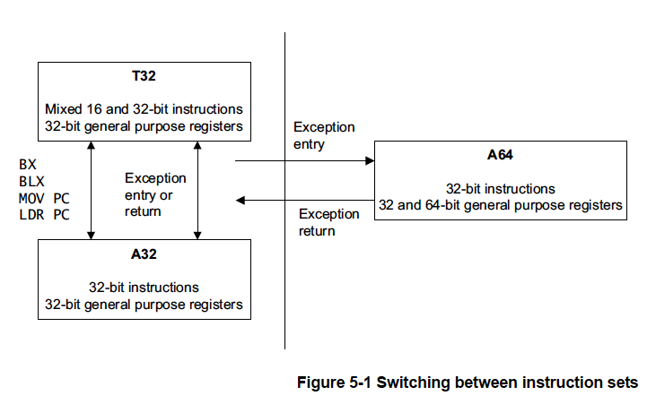

# 5章 ARMv8命令セット入門

ARMv8アーキテクチャで導入された最も大きな変更点の1つは64ビット命令セットの
追加です。このセットは既存の32ビット命令セットアーキテクチャを補完するもの
です。この追加により、64ビット幅の整数レジスタとデータ操作のアクセスが可能に
なり、メモリへの64ビットサイズのポインタを使用できるようになりました。新しい
命令はA64と呼ばれ、AArch64実行ステートで実行されます。ARMv8にはA32と呼ばれる
ようになったオリジナルのARM命令セットとThumb（T32）命令セットも含まれています。
A32とT32はいずれもAArch32ステートで実行され、ARMv7との後方互換性を提供します。

ARMv8-Aは32ビットARMアーキテクチャへの後方互換性を提供しますが、A64命令セットは
古いISAとは別個のものであり異なる方法でエンコードされています。A64はいくつかの
機能を追加する一方で、高性能実装の速度やエネルギー効率を制限する可能性のある
機能を削除しています。ARMv8アーキテクチャは32ビット命令セット（A32およびT32）
にもいくつかの機能拡張を行っています。ただし、そのような機能を利用するコードは
古いARMv7実装とは互換性がありません。なお、A64命令セットの命令オペコードは
64ビットではなく依然として32ビット長です。

A64アセンブリ言語の詳細については「ARMコンパイラarmasmレファレンスガイド
v6.01」を参照してください。

## 5.1 ARMv8命令セット

新しいA64命令セットは既存のA32命令セットと似ています。命令は32ビット幅であり
同じような構文を持っています。

命令セットはARMv8アーキテクチャで一般的な命名規則を使用しているため、元の
32ビット命令セットステートは次のように呼ばれます。

<dl>
<dt>A32</dt>
<dd>
    AArch32ステートにある場合、命令セットはARMv7とほぼ互換性がありますが相違
    点もあります。「ARMv8-Aアーキテクチャリファレンスマニュアル」を参照して
    ください。また、A64命令セットで導入された機能に合わせるためにいくつかの
    新しい命令が提供されています。
</dd>

<dt>T32</dt>
<dd>
    Thumb命令セットは、ARM7TDMIプロセッサで初めて搭載され当初は16ビット命令
    だけを含んでいました。16ビット命令では性能を犠牲にしながらもより小さな
    プログラムを作成することができました。ARMv7プロセッサ（Cortex-Aシリーズの
    ものも含む）はThumb命令セットを拡張して16ビット命令と32ビット命令を混在
    させることができるThumb-2テクノロジをサポートしています。これによりコード
    サイズの削減を維持したままARMと同等の性能を得ることができます。そのサイズ
    と性能の利点からすべての32ビットコードでコンパイルやアセンブルにおいて
    Thumb-2テクノロジを利用することがますます一般的になっています。
</dd>
</dl>

AArch64状態でコアが使用できる新しい命令セットが導入されました。命名規則を
維持した上で64ビット操作を反映してこの命令セットはA64と呼ばれています。

<dl>
<dt>A64</dt>
<dd>
    A64はAArch32またはARMv7のA32命令セットとT32命令セットと同様の機能を提供
    します。新しいA64命令セットの設計によりいくつかの改良がなされました。
    <br/><br/>
    <dl>
    <dt>一貫したエンコード方式</dt>
    <dd>A32ではいくつかの命令が後で追加されたため、エンコード方式に矛盾が
    生じています。たとえば、ハーフワードに対するLDRとSTRのサポートは主流の
    バイトやワードの転送命令とは若干異なるエンコード方式になっています。
    その結果、アドレッシングモードが微妙に異なっています。
    </dd>
    <dt>幅広い定数</dt>
    <dd>A
    64命令では定数に対して非常に幅広いオプションが用意されており、それぞれが
    特定の命令タイプの要件に合わせて調整されています。
    <ul>
    <li>算術命令では一般に12ビットの即値定数を使用できます。</li>
    <li>論理命令では一般に32ビットまたは64ビットの定数を使用することができ、
        そのエンコーディングにはいくつかの制約があります。</li>
    <li>MOV命令では16ビットの即値が使用でき、任意の16ビット境界にシフトさせる
        ことができます。</li>
    <li>アドレス生成命令は4KBのページサイズにアラインされたアドレスに対応
        します。</li>
    </ul>
    ビット操作命令で使用される定数にはもう少し複雑なルールがあります。しかし、
    ビットフィールド操作命令は、ソースにおいてもデスティネーションオペランド
    においても任意の連続したビット列をアドレス指定することができます。<br/>
    A64は柔軟な定数を提供しますが、それをエンコードすることは、ある定数を
    特定のコンテキストで合法的にエンコードできるか否かを判断することでさえ
    簡単ではない場合があります。
    </dd>
    <dt>データ型がより簡単</dt>
    <dd>A64は64ビット符号付き・符号なしデータ型を自然に扱うことができ、
    64ビット整数をより簡潔かつ効率的に操作する方法を提供します。ます。これは
    CやJavaなど64ビット整数を提供するすべての言語にとって利点になるでしょう。
    </dd>
    <dt>長いオフセット</dt>
    <dd>A64命令はPC相対分岐においても、オフセットアドレッシングにおいても、
    一般により長いオフセットを提供します。<br/>
    分岐範囲が大きくなることでセクション間ジャンプの管理が容易になります。
    動的に生成されるコードは一般にヒープ上に置かれるため、実際上どこにでも
    置くことができます。ランタイムシステムでは分岐範囲を大きくなることで
    その管理がはるかに容易になり、修正も少なくて済みます。<br/>
    リテラルプール（コードストリームに埋め込まれたリテラルデータのブロック）
    が必要なことはARMの命令セットの以前からの特徴です。これはA64でも以前と
    して存在しています。しかし、大きなPC相対ロードオフセットはこのリテラル
    プールの管理に非常に役立ち、コンパイルユニットごとに使用することが可能に
    なります。これにより長いコード列の中に複数のプールを置く場所を作成する
    必要がなくなります。
    </dd>
    <dt>ポインタ</dt>
    <dd>ポインタはAArch64では64ビットです。これによりより大きな仮想メモリの
    アドレス指定が可能になり、アドレスマッピングの自由度が増大します。ただし、
    64ビットポインタの使用はコストもかかります。通常、同じコードを実行する
    場合、64ビットポインタは32ビットポインタよりも多くのメモリを使用します。
    各ポインタはメモリに格納されるので4バイトではなく8バイトのメモリが必要に
    なります。これは些細なことに聞こえるかもしれませんが、積み重なると大きな
    ペナルティになる可能性があります。さらに、64ビットへの移行に伴うメモリ
    空間の使用量の増加はキャッシュヒットするアクセス数の減少を引き起こす
    可能性があります。このキャッシュヒットの減少は性能を低下させる可能性が
    あります。<br/>
    Javaなど一部の言語では圧縮ポインタを実装することで性能の問題を回避する
    ことが可能です。</dd>
    <dt>ITブロックの代わる条件構文の使用</dt>
    <dd>ITブロックはT32の便利な機能であり、未実行命令周りの短い前方分岐の
    必要性を回避する効率的なシーケンスを可能にします。しかし、これをハード
    ウェアで効率的に処理することが難しい場合があります。A64はこれらの
    ブロックを削除し、CSEL（Conditional Select）やCINC（Conditional Increment）
    などの条件付き命令で置き換えました。これらの条件構成はより直感的であり
    特殊なケースを除いて扱いやすくなっています。</dd>
    <dt>シフトとローテートのより直感的な動作</dt>
    <dd>A32やT32のシフトとローテートの動作は必ずしも高級言語が期待する動作に
    容易にマッピングできるわけではありません。<br/>
    ARMv7ではデータ処理命令して使用できるバレルシフタが用意されています。
    しかし、シフトの種類と量の指定には他の用途に使用できるかもしれあに
    一定数のオペコードビットを必要とします。<br/>
    A64命令ではこれまであまり使われなかったオプションを削除し、代わりに
    より複雑なシフト操作を実行する明示的な命令を新たに追加しました。</dd>
    <dt>コード生成</dt>
    <dd>一般的な算術関数のコードを静的・動的に生成する場合、A32とT32では
    異なる命令や命令列が必要になることが多いです。これは様々なデータ型に
    対応するためです。<br/>
    A64ではこれらの演算がより一貫しているので様々なサイズのデータ型に対する
    単純な演算のための共通シーケンスを生成するのが非常に簡単です。<br/>
    たとえば、T32では同じ命令でも使用するレジスタ（ローレジスタかハイ
    レジスタか）によってエンコーディングが異なることがあります。<br/>
    A64の命令セットのエンコーディングはより規則的かつ合理的です。そのため。
    通常、A64用のアセンブラはT32用のアセンブラよりもコード行数が少なく
    なります。</dd>
    <dt>固定長命令</dt>
    <dd>A64の命令は可変長命令セットであるT32とは異なりすべて同じ長さです。
    このため、生成されたコード列の管理と追跡が容易であり、特に動的コード
    ジェネレータに有効です。</dd>
    <dt>3オペランドのマッピングが容易</dt>
    <dd>一般に、A32はデータ処理演算において真の3オペランド構造を保持して
    います。一方、T32には2オペランド命令形式が非常に多くコード生成時の
    柔軟性をやや減らしています。コンパイラにとって命令セットの規則性と
    均質性にさらに寄与するためにA64は一貫して3オペランド構文に採用して
    います。</dd>
    </dl>
</dd>
</dl>

### 5.1.1 32ビットA64命令と64ビットA64命令の区別

A64命令セットのほとんどの整数命令は64ビット汎用レジスタファイルの32ビット
値と64ビット値のいずれかを操作する2つの形式を持っています。

命令が使用するレジスタ名を見る場合、

- レジスタ名がXで始まる場合は64ビット値です。
- レジスタ名がWで始まる場合は32ビット値です。

32ビット命令形式を選択した場合、次のようになります。

- 右シフトと回転の挿入位置はビット63ではなくビット31です。
- 命令により設定される条件フラグは下位32ビットから計算されます。
- Wレジスタに書き込むとXレジスタのビット[63:32]はゼロに設定されます。

この区別は32ビット命令の結果が同等の64ビット命令で計算される下位32ビットと
区別がつかない場合にも適用されます。たとえば、32ビットのビットORRは
64ビットのORRで実行して結果の上位32ビットを単に無視することでも実行
できます。A64命令セットには32ビット形式と64 ビット形式の両方のORR命令が
あります。

AArch64ではCとC++のLP64またはLLP64データモデルが最も一般的に使用される
ことが予想されます。どちらもよく使われるint型、short型、char型は32ビット
以下と定義されています。このセマンティック情報を命令セットに保持することで
実装者はこの情報を利用することができます。たとえば、そのようなデータ型の
使用しない上位32ビットを計算、転送、保存するためにエネルギーやサイクルの
消費を避けることができます。実装者はエネルギーを節約するためにいかなる
方法でこの自由を利用することができます。

そのため、新しいA64命令セットでは、符号拡張命令とゼロ拡張命令を分けて
提供しています。これは、A64命令セットではADD、SUB、CMN、CMP命令の最後の
ソースレジスタ、ロード命令とストア命令のインデックスレジスタを拡張・
シフトすることが可能であることを意味します。これにより、64ビット配列
ポインタと32ビット配列インデックスを含む配列インデックス計算を効率的に
実装することができます。

### 5.1.2 アドレッシング

プロセッサが64ビットの値を1つのレジスタに格納できるようになるとプログラムで
大容量のメモリにアクセスことが非常に簡単になります。32ビットコアで実行される
シングルスレッドは4GBのアドレス空間へのアクセスに制限されます。そのアドレス
空間の大部分はOSカーネルやライブラリコード、ペリフェラルなどの使用のために
予約されています。そのため、アドレス空間が不足するとプログラムの実行中に
データをメモリにマッピングしたり、メモリから押し出したりする必要が生じる
可能性があります。64ビットポインタを用いてより大きなアドレス空間を持つことで
この問題を回避することができます。また、メモリマップドファイルのような手法も
より魅力的で便利に使えるものになります。物理的なRAMがファイル全体を格納できる
ほど大きくない場合であってもファイルの内容をスレッドのメモリマップにマップ
することができます。

アドレッシングのその他の改良点は以下の通りです。

<dl>
<dt>排他的アクセス</dt>
<dd>バイト、ハーフワード、ワード、ダブルワードの排他的ロード・ストア。
    ダブルワードペアの排他的アクセスにより、循環リストの挿入などのポインタ
    ペアのアトミックな更新が可能になります。排他的アクセスはすべて自然な
    アライメントがされていなければなりません。排他的ペアアクセスはデータ
    サイズの2倍、64ビット値のペアの場合は128ビットにアライメントされている
    必要があります。</dd>
<dt>PC相対オフセットアドレッシングの増加</dt>
<dd>PC相対リテラルロードは±1MBのオフセット範囲を持ちます。A32のPC相対ロードと
    比較するとリテラルプールの数が減り、関数間でのリテラルデータの共有が
    増加します。その結果、I-cacheやTLBの汚染が軽減されます。<br/>
    ほとんどの条件分岐は±1MBの範囲に可能であり、一つの関数内で行われる条件
    分岐の大部分には十分であると予想されます。<br/>
    無条件分岐（分岐とリンクを含む）は±128MBの範囲に可能であり、リンカが挿入
    するベニアを必要とせず、ほとんどの実行可能なロードモジュールと共有
    オブジェクトの静的コードセグメントをカバーするのに十分であると
    予想されます。<br/><hr/>
    <strong>注意:</strong> ベニアとはリンカにより自動的に挿入される小さな
    コード片のことです。たとえば、分岐ターゲットが範囲外であることを検出した
    場合などに挿入されます。ベニアは元となる分岐の中間ターゲットとなり、
    ベニア自体がターゲットアドレスへの分岐になります。<br/>
    リンカは、同じ関数への他の呼び出しがその関数を呼び出した以前の関数と同じ
    範囲にある場合、以前の呼び出しで生成されたベニアを再利用することができ
    ます。このようなベニアが性能の要因になることもあります。<br/>
    ベニアを経由する複数の関数を呼び出すループがあるとパイプラインの
    フラッシュが多発するため最適とは言えない性能になります。関連するコードを
    メモリ上にまとめて配置することでこれを回避することができます。<hr/>
    ±4GBの範囲を持つPC相対のロード・ストアとアドレス生成は、わずか2命令の
    インラインで実行できます。つまり、リテラルプールからオフセットをロード
    する必要がありません。</dd>
<dt>非アラインアドレスのサポート</dt>
<dd>排他的アクセスと順序付きアクセスを除き、ノーマルメモリにアクセスする
    すべてのロードとストアには非アラインアドレスを使用することができます。
    これによりA64へのコードの移植が容易になります。</dd>
<dt>バルク転送</dt>
<dd>LDM、STM、PUSH、POPの各命令はA64には存在しません。バルク転送はLDP命令と
    STP命令を使って構築することができます。これらの命令は連続したメモリ位置
    から独立したレジスタのペアをロード・ストアします。<br/>
    LDNP命令とSTNP命令はデータをキャッシュに保持する必要がないことを示す
    ストリーミングまたは非一時的なヒントを提供します。<br/>
    PRFM（プリフェッチメモリ）命令は特定のキャッシュレベルへのプリフェッチの
    ターゲティングを可能にします。</dd>
<dt>ロード/ストア</dt>
<dd>すべてのロード/ストア命令は一貫したアドレッシングモードをサポートする
    ようになりました。これにより、たとえば、char、short、int、long longを
    ロード/ストアする際に同じ方法で扱うことがはるかに簡単になりました。<br/>
    浮動小数点レジストとNEONレジスタもコアレジスタと同じアドレッシングモードを
    サポートするようになり、2つのレジスタバンクを互換的に使用することが
    より簡単になりました。</dd>
<dt>アライメントチェック</dt>
<dd>AArch64で実行する場合、命令のフェッチ時やスタックポインタを使ったロード/
    ストア時にアライメントチェックが追加され、PCやカレントSPのミスアライメント
    をチェックできるようになりました。<br/>
    この方法はPCやSPのアライメントを強制的に正すよりも好ましい方法です。
    なぜなら、PCやSPのミスアライメントは一般にソフトウェア内でのアドレス
    破壊などのソフトウェアエラーを示しているからです。<br/>
    アライメントチェックにはいくつかの種類があります。
    <ul>
    <li>プログラムカウンタアライメントチェックは、AArch64でミスアライメント
    されたPCでフェッチされた命令を実行しようとすると常に命令フェッチに
    関連する例外を発生させます。<br/>
    ミスアラインメントPCは、PCのビット[1:0]が00でないものであると定義されて
    います。<br/>
    PCのミスアラインメントは対象となる例外レベルの例外シンドロームレジスタで
    識別することができます。<br/>
    例外がAArch64で処理されている場合、関連する例外リンクレジスタは、例外が
    発生した例外レベルのフォールトアドレスレジスタFAR_ELnと同様に、ミス
    アライメントされた形のPC全体を保持します。<br/>
    PCアライメントチェックはAArch64で実行され、AArch32ではデータアボート例外
    処理の一部として実行されます。</li>
    <li>スタックポインタ（SP）アライメントチェックはAArch64でスタックポインタを
    ベースアドレスとしてロード/ストアしようとした場合に常にデータメモリ
    アクセスに関連する例外を発生させます。<br/>
    ミスアライメントのスタックポインタとは、計算のベースアドレスとして使用
    されるスタックポインタのビット[3:0]が0000でないものです。スタック
    ポインタをベースアドレスとして使用する場合は常に16バイトアライメント
    である必要があるからです。<br/>
    スタックポインタのアライメントチェックはAArch64でのみ行われ、例外レベル
    ごとに独立して有効にすることができます。
    <ul>
    <li>EL0とEL1はSCTLR_EL1の2つの独立したビットで制御されます。</li>
    <li>EL2はSCTLR_EL2内の1つのビットで制御されます。</li>
    <li>EL3はSCTLR_EL3内の1つのビットで制御されます。</li>
    </ul>
</dd>
</dl>

### 5.1.3 レジスタ

A64の64ビットレジスタバンクはほとんどのアプリケーションでレジスタの圧迫を
軽減するのに役立ちます。

A64プロシージャコール規格（PCS）では最大8つのパラメータをレジスタ (X0-X7) で
渡します。一方、A32とT32ではレジスタで渡するのは4つの引数のであり、残りは
スタックで渡します。

PCSでは専用のフレームポインタ（FP）も定義されており、スタックを確実に巻き戻す
ことができるようになったためデバッグやコールグラフプロファイリングをが容易に
なります。詳細は「9章 ARM64ビットアーキテクチャのABI」を参照してください。

64ビット幅の整数レジスタを採用したことでプログラミング言語で使用される変数が
様々なビット幅を持つことになりました。現在、主にintegerとlong, ポインタの
定義サイズが異なるいくつかの標準的なモデルが使用されています。

![表5-1: 変数の幅]

64ビット版のLinux実装はLP64を使用しており、これはA64 Procedure Call Standardで
サポートされています。その他のOSで使用可能なPCSのバリエーションも定義されて
います。

<dl>
<dt>ゼロレジスタ</dt>
<dd>ゼロレジスタ（WZR/XZR）は、いくつかの符号化トリックで使用されます。
    たとえば、プレーンな乗算エンコーディングはなく繰り返し加算だけです。
    <code>MUL W0、W1、W2</code>という命令は、ゼロレジスタを使用する
    <code>MADD W0、W1、W2、WZR</code>と同じです。すべての命令がXZR/WZRを
    使用できるわけではありません。第4章で述べたように、ゼロレジスタは
    スタックポインタと同じエンコーディングを共有しています。これはごく
    限られた数の命令ではWZR/XZRを引数として使用できず、代わりにWSP/SPを
    使用することを意味します。<br/><br/>
    <strong>例5-1: メモリに0を書くためにゼロレジスタを使用する</strong>
<hr/>

    A32:
        mov ro, #0
        str ro, [...]
    A64でゼロレジスタを使用する。
        str wzr, [...]
    スペアレジスタが不要。16バイトのゼロを書き込む。
        stp xzr, xzr, [...]

<hr/>
    ゼロレジスタの便利な副作用は大きな即値フィールドを持つNOP命令が多くある
    ことです。たとえば、<code>ADR XZR, #&lt;imm&gt;</code> だけで他の副作用のない
    命令で21ビットのデータが得られます。これはコードが実行時にパッチされる
    ようなJITコンパイラでは非常に有効です。</dd>
<dt>スタックポインタ</dt>
<dd>スタックポインタ（SP）はほとんどの命令で参照することができません。一部の
    演算命令で現在のスタックポインタの読み書きが可能なだけです。これは関数の
    プロローグやエピローグでスタックポインタを調整するために使われるでしょう。
    たとえば<br/><br/>
    ADD SP, SP, #256 // SP = SP + 256<br/><br/></dd>
<dt>プログラムカウンタ</dt>
<dd>現在のプログラムカウンタ（PC）は一般レジスタファイルとして番号で参照する
    ことはできないので、演算命令のソースや宛先として、あるいは、ロード・ストア
    命令のベースやインデックス、転送レジスタとして使用することができません。<br/>
    PCを読み出す命令は、PC相対アドレスを計算する機能を持つ命令（ADR、ADRP、
    リテラルロード、直接分岐）とリンクレジスタに戻りアドレスを格納する分岐
    リンク命令（BL、BLR）だけです。プログラムカウンタを変更する唯一の方法は
    分岐命令、例外発生命令、例外復帰命令の使用だけです。<br/>
    PCがPC相対アドレスを計算する命令によって読まれる場合、その値はその命令の
    アドレスです。A32、T32とは異なり4バイトや8バイトの暗黙のオフセットは
    ありません。</dd>
<dt>FPレジスタとNEONレジスタ</dt>
<dd>NEONレジスタの最も重要な更新点はNEONレジスタが以前の16個から32個の
    16バイトのレジスタを持つようになったことです。浮動小数点レジスタと
    NEONレジスタバンクの様々なレジスタサイズ間のマッピングがよりシンプルに
    なり、これらのレジスタがより使いやすくなりました。このマッピングにより
    コンパイラやオプティマイザはモデル化や解析がより簡単になります。</dd>
<dt>レジスタインデックスドアドレッシング</dt>
<dd>A64命令セットにはA32 に比べてアドレッシングモードが追加され、64 ビットの
    ベースレジスタに64ビットのインデックスレジスタを追加できるようになり、
    オプションでアクセスサイズによるインデックスのスケーリングが可能に
    なりました。さらに、インデックスレジスタの32ビット値の符号拡張とゼロ
    拡張が可能になり、これもオプションでスケーリングができます。</dd>
</dl>

## 5.2 C/C++インラインアセンブリ

この節ではCまたはC++言語のモジュールにアセンブリコードを含める方法について
簡単に説明します。

`asm`キーワードによりインラインGCC構文アセンブリコードを関数に取り込むことが
できます。たとえば

```c
#include <stdio.h>

int add(int i, int j)
{
    int res = 0;
    asm (
        "ADD %w[result], %w[input_i], %w[input_j]"  // Wレジスタに作用させる
                                                    // には（このばあいのように）
                                                    // '%w[name]'を使用する。
                                                    // xレジスタには'%x[name]'を
                                                    // 使用できるがこれはデフォルトである。
        : [result] "=r" (res)
        : [input_i] "r" (i), [input_j] "r" (j)
        );
}

int main(void)
{
    int a = 1;
    int b = 2;
    int c = 0;

    c = add(a, b);

    printf("Result of %d + %d = %d\n", a, b, c);
}
```

`asm`インラインアセンブリ文の一般的な形式は次のとおりです。

```
asm(code [: output_operand_list [: input_operand_list [: clobber_list]]);
```

ここで、

`code`はアセンブリコードです。上の例では`ADD %[result], %[input_i], %[input_j]`です。

`output_operand_list`はカンマ区切りのオプションの出力オペランドリストです。各
オペランドは角括弧でくくられたシンボル名と二重引用符でくくられた制約文字、丸括弧で
くくられたC式で構成されます。上の例では出力オペランドは1つで`[result] "=r" (res)`
です。

`input_operand_list`はカンマ区切りのオプションの入力オペランドリストです。入力
オペランドは出力オペランドと同じ構文を使用します。上の例では2つの入力オペランドが
あり、`[input_i] "r" (i)`と`[input_j] "r" (j)`です。

`clobber_list`はオプションの上書きされるレジスタリスト、またはその他の値です。上の
例では省略されています。

C/C++とアセンブリコード間で関数を呼び出す場合、AAPCS64規格に従わなければなりません。

詳細については、https://gcc.gnu.org/onlinedocs/gcc/Using-Assembly-Language-with-C.html#Using-Assembly-Language-with-Cを参照してください。

## 5.3 命令セットの切り替え

1つのアプリケーションで2つの実行ステートのコードを使用することはできません。
A32命令セットとT32命令セットの間にあるようなインターワーキングはARMv8のA64命令
セットとA32またはT32命令セットとの間には存在しません。ARMv8プロセッサ用にA64で
書かれたコードはARMv7 Cortex-Aシリーズのプロセッサでは実行できません。しかし、
ARMv7-Aプロセッサ用に書かれたコードはAArch32実行ステートのARMv8プロセッサで実行
することができます。これをまとめたのが図5-1です。


