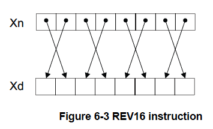
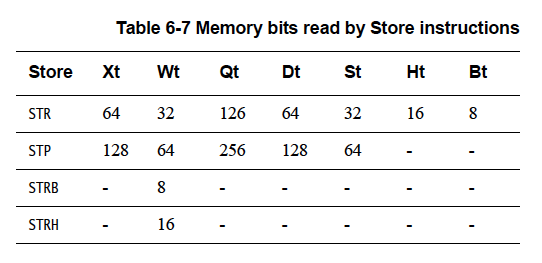

# 6章 A64命令セット

アプリケーションレベルのコードを書くプログラマの多くはアセンブリ言語でコードを
書く必要はありません。しかし、高度に最適化されたコードが必要な場合にはアセンブリ
コードが有効な場合があります。これはコンパイラを書く場合やC言語では直接利用
できない低レベルの機能を利用する必要がある場合などです。ブートコードやデバイス
ドライバの一部、オペレーティングシステムの開発時にも必要になるかもしれません。
最後に、C言語のデバッグを行う場合や、特に、アセンブリ命令とC言語の文の対応関係を
理解するためにはアセンブリコードを読むことができると役に立ちます。

## 6.1 命令ニーモニック

A64アセンブリ言語は命令ニーモニックをオーバーロードしており、オペランド
レジスタ名に基づいて様々な形の命令を区別します。たとえば、以下の`ADD`命令は
すべて異なるエンコーディングを持ちますが覚えるべきニモニックは1つだけであり、
アセンブラがオペランドに基づいて正しいエンコーディングを自動的に選択します。

```
ADD W0, W1, W2              // 32ビットレジスタを加算
ADD X0, X1, X2              // 64ビットレジスタを加算
ADD X0, X1, W2, SXTW        // 符号拡張した32ビットレジスタを64ビットレジスタに加算
ADD X0, X1, #42             // 即値を64ビットレジスタに加算
ADD VO.8H, V1.8H, V2.8H     // 各8レーンのNEONを16ビット加算
```

## データ処理命令

これらはプロセッサの基本的な算術・論理演算であり、2つの汎用レジスタの値または
レジスタ値と即値の演算を行います。「6.2.2 乗算・除算命令」は、これらの命令の
特殊ケースと考えることができます。

ほとんどのデータ処理命令は1つのディスティネーションレジスタと2つのソース
オペランドを使用します。一般的な書式は次のように命令とそれに続くオペランドで
あると考えてよいでしょう。

```
Instruction Rd, Rn, Operand2
```

2番目のオペランドは、レジスタか変更されたレジスタ、即値のいずれかです。Rは
XまたはWのレジスタであることを示しています。

データ処理演算には次のようなものがあります。

- 算術演算と論理演算
- 移動演算とシフト演算
- 符号拡張命令とゼロ拡張命令
- ビット操作とビットフィールド操作
- 条件付き比較とデータ処理

### 6.2.1 算術演算と論理演算

表6-1に利用可能な算術演算と論理演算の一部を示します。

![表6-1: 算術演算と論理演算]

また、一部の命令にはS接尾辞を持つものがあり、これはフラグを設定することを
示します。表6-1の命令のうち、ADDS、SUBS、ADCS、SBCS、ANDS、BICSがこれに該当します。
このほかにもCMP、CMN、TSTなどのフラグを設定する命令もありますがこれらはS接尾辞が
付きません。

ADCとSBCはキャリーコンディションフラグも入力として使用した加算と減算を行います。

```
ADC[S]: Rd = Rn + Rm + C
SBC[S]: RD = Rn - Rm - 1 + C
```

#### 例8-1 算術命令

<hr/>

    ADD W0, W1, W2, LSL #3          // V0 = W1 + (W2 << 3>>)
    SUBS X0, X4, X3, ASR #2         // W0 = X4 - (X3 >> 2), フラグをセット
    MOV X0, X1                      // X1をX0にコピー
    CMP W3, W4                      // W3 - W4の結果でフラグをセット
    ADD W0, W5, #27                 // W0 = W5 + 27

<hr/>

論理演算は基本的にレジスタの個々のビットを操作する対応するブール演算子と同じ
です。

BIC（Bitwise bit clear）命令は、デスティネーションレジスタの後の最初のレジスタと
2番目のオペランドの反転値とのANDを実行します。たとえば、レジスタX0のビット[11]を
クリアするには、次のようにします。

```
MOV X1, #0800
BIC X9, X0, X1
```

ORNとEONはそれぞれ第2オペランドのビットごとのNOTとのORまたはEORを実行します。

比較命令はフラグを変更するだけでその他の効果はありません。これらの命令の即値の
範囲は12ビットで、この値はオプションで12ビット左にシフトすることができます。

### 6.2.2 乗算命令と除算命令

提供されている乗算命令はARMv7-Aとほぼ同じですが1つの命令で64ビットの乗算を行う
ことができます。


乗算命令には32ビットまたは64ビットの値に対して演算を行い、オペランドと同じ
サイズの結果を返すものがあります。たとえば、MUL命令は2つの64ビットレジスタを
乗算して64ビットの結果を与えます。

```
MUL X0, X1, X2          // X0 = X1 * X2
```

また、MADD命令やMSUB命令を使用して第3ソースレジスタの積算値を加算または減算する
機能もあります。

MNEG命令は次の例のように結果を否定するために使用することができます。

```
MNEG X0, X1, X2         // X0 = -(X1 * X2)
```

さらに、2つの32ビット数を乗算して64ビットの結果を生成する長い結果を生成する
さまざまな乗算命令があります。これらのロング乗算には符号付きと符号なしの命令が
あります（UMULL、SMULL）。また、他のレジスタの値を積算する命令UMADDL、SMADDL）や
否定する命令（UMNEGL、SMNEGL）もあります。

オプションの積算を持つ32ビットと64ビットの乗算でオペランドと同じサイズの
結果を得るものには以下があります。

- 32 ± (32 x 32) は32ビットの結果を返します。
- 64 ± (64 x 64) は64ビットの結果を返します。
- ± (32 x 32) は32ビットの結果を返します。
- ± (64 x 64) は64ビットの結果を返します。

積算付きの符号付きと符号なしの乗算は64ビットの結果を返します。

- 64 ± (32 x 32) は64ビットの結果を返します。
- ± (32 x 32) は64ビットの結果を返します。

64 x 64から128ビットを返す乗算は2つの命令を続けて行い、64ビットの結果レジスタの
組を生成する必要があります。

- ± (64 x 64) は結果の下位64ビット[63:0]を返します。
- (64 x 64) は結果の上位64ビット[127:64]を返します。

**注意**
<hr/>
このリストには32 x 64のオプションはありません。32ビットのWレジスタと64ビットの
Xレジスタを直接乗算することはできません。
<hr/>

ARMv8-Aアーキテクチャは32ビットと64ビットのサイズの値の符号付きと符号なしの除算を
サポートしています。たとえば

```
UDIV W0, W1, W2             // W0 = W1 / W2 （符号なし、32ビット除算）
SDIV X0, X1, X2             // X0 = X1 / X2 （符号あり、64ビット除算）
```

オーバーフローとゼロ除算はトラップされません。

- ゼロによる整数の除算はすべてゼロを返します。
- オーバーフローはSDIVでのみ発生する可能性があります。
    - `INT_MIN / -1`はINT_MINを返します。ここでINT_MINは演算に使用したレジスタで
      エンコードできる最小の負数です。結果は、ほとんどのC/C++方言と同様に常に0に
      向かって丸められます。

### 6.2.3 シフト演算

以下はシフト演算に関する説明です。

- LSL（論理左シフト）。LSL命令は2のべき乗による蒸散を行います。
- LSR（論理右シフト）。LSR命令は2のべき乗による除算を行います。
- ASR（算術右シフト）。ASR命令は符号ビットを保持した2のべき乗による除算を行います。
- ROR（右回転)。ROR命令はビット単位で回転し、LSBからMSBに回転したビットを包み込みます。


シフトに指定するレジスタは32ビットまたは64ビットです。シフトする量は、レジスタ
サイズから1を引いた即値か、下位5ビット（モジュロ32）または6ビット（モジュロ64）
の値だけを使用するレジスタのいずれかで指定できます。

### 6.2.4 ビットフィールド操作命令とバイト操作命令

バイト、ハーフワード、ワードをXレジスタまたはWレジスタのサイズに拡張する命令が
あります。これらの命令には符号付き（SXTB、SXTH、SXTW）と符号なし（UXTB、UXTH）の
両バリアントがあり、適切なビットフィールド操作命令のエイリアスになっています。

これらの命令の符号付き・符号なしの両バリアントはバイト、ハーフワード、ワード
（ただし、SXTWのみワードで動作）をレジスタサイズに拡張します。ソースは常にW
レジスタです。デスティネーションレジスタはXレジスタかWレジスタですが、SXTWは
例外でXレジスタでなければなりません。

たとえば、次のようになります。

```
SXTB X0, W1         // レジスタW1の最下位バイトをバイトの左端のビットを
                    // 繰り返して8ビットから64 ビットに拡張します。
```

ビットフィールド命令はARMv7に存在するものと同じであり、BFI（Bit Field Insert）
や(S/U)BFX（符号付きと符号なしのBit Field Extract）などがあります。また、BFXIL
（Bit Field Extract and Insert Low）、UBFIZ（Unsigned Bit Field Insert in
Zero）、SBFIZ（Signed Bit Field Insert in Zero）など追加されたビットフィールド
命令もあります。


**注意**
<hr/>
BFM命令、UBFM命令、SBFM命令もあります。これらはBit Field Move命令であり、
ARMv8で新たに追加された命令です。ただし、これらの命令を明示的に使用する必要は
ありません。あらゆるケースに対応するエイリアスが用意されているからです。
これらのエイリアスはすでに説明したビットフィールド演算: [SU]XT[BHWX]、
ASR/LSL/LSR immediate、BFI、BFXIL、SBFIZ、SBFX、UBFIZ、UBFXです。
<hr/>

ARMv7アーキテクチャに詳しい方は他のビット操作命令も見覚えがあるかもしれません。

- CLZ: レジスタ値の先頭のゼロビットをカウントします。

同様にバイト操作命令もあります。

- RBIT: すべてのビットを逆順にします。
- REV: レジスタのバイトを逆順にします。
- REV16: レジスタの各ハーフワードのバイトを逆順にします。



- REV32: レジスタの各ワードのバイトを逆順にします。


これらの演算はワード（32ビット）サイズとダブルワード（64ビット）サイズの
レジスタのいずれでも実行可能ですが、REV32は例外で64ビットレジスタにのみ
適用されます。

### 6.2.5 条件月命令

A64命令セットではすべての命令で条件付き実行をサポートしているわけでは
ありません。命令の条件付き実行はオペコードスペースの大幅な使用を正当化する
ほどの利点はありません。

「4.2 プロセッサの状態」では、4つのステータスフラグ: ゼロ（Z）、マイナス（N）、
キャリー（C）、オーバーフロー（V）について説明しています。表6-4はフラグ設定
操作におけるこれらのビット値を示しています。


Cフラグは符号なし演算の結果が結果レジスタをオーバーフローした場合に設定
されます。

Vフラグは符号付き演算の場合に、Cフラグと同じように動作します。

**注意**
<hr/>
条件フラグ（NZCV）と条件コードはA32、T32と同じです。ただし、A64では
NV（0b1111）が追加おり、その補数であるAL（0b1110）と同じ動作をします。
これは0b1111に意味を持たせていなかったA32とは異なります。
<hr/>


条件付きのデータ処理命令が少しだけあります。これらの命令は無条件に実行
されますが、命令への追加入力として条件フラグを使用します。こレラの命令は
ARMコードにおける条件付き実行の一般的な使用法を置き換える目的で提供され
ました。

条件フラグを読み出す命令の種類は以下の通りです。

<dl>
<dt>キャリー付き加算/減算</dt>
<dd>多倍長演算やチェックサムなどの従来のARM命令。</dd>
<dt>オプションの増分、否定、反転を持つ条件付き選択</td>
<dd>1つのソースレジスタと増分、否定、反転による変更または変更なしの第2
    ソースレジスタを条件付きで選択します。<br/>
    これらはA32とT32における単一条件付き命令の最も一般的な使用方法です。
    典型的な用途には条件付きカウントや符号付き数量の絶対値計算などが
    あります。</dd>
</dl>

#### 条件付き演算

A64命令セットではプログラムフロー制御の分岐命令だけが条件付きで実行することが
できます。これはほとんどの命令に条件コードを付けることができるA32とT32とは
対照的です。これらは次のようにまとめることができます。

<dl>
<dt>条件付き選択（move）</dt>
<dd><ul>
<li>CSEL: 条件に基づいて2つのレジスタを選択します。条件付き選択の後に続けて
    無条件命令を実行することで短い条件シーケンスを置き換えることができます。</li>
<li>CSINC: 条件に基づいて2つのレジスタを選択し、第1ソースレジスタまたは
    1を足した第2ソースレジスタを返します。</li>
<li>CSINV: 条件に基づいて2つのレジスタの間を選択し、第1ソースレジスタまたは
    反転した第2ソースレジスタを返します。</li>
<li>CSNEG: 条件に基づいて2つのレジスタ間を選択し、第1ソースレジスタまたは
    否定した第2ソースレジスタを返します。</li></dd>
<dt>条件付きセット</dt>
<dd>条件に応じて0と1（CSET）または0と-1（CSETM）を選択します。たとえば、
    条件フラグにブール値をセットしたり、汎用レジスタをマスクする際に
    使用します。</dd>
<dt>条件付き比較</dt>
<dd>（CMPとCMN） 元の条件が真の場合、条件フラグを比較結果に設定します。
    真でない場合は、指定された条件フラグ状態を条件フラグに設定します。
    条件付き比較命令はネストされた比較や合成比較を表現するのに非常に有効です。</dd>
</dl>

**注意**
<hr/>
条件付き選択と条件付き比較は、FCSEL命令とFCCMP命令を使用して浮動小数点
レジスタでも使用できます。
<hr/>

たとえば

```
CSINC X0, X1, X0, NE        // ゼロフラグがクリアされていたら、リターン
                            // レジスタX0にX1をセット。そうでなければ
                            // X0に1を足してX0にセットします。
```

例に示した命令のいくつかにはエイリアスが提供されており、ゼロレジスタを
使用するものと、同じレジスタを命令のデスティネーションと両ソースレジスタに
使用することがあります。

たとえば

```
CINC X0, X0, LS             // 小さいか等しければ（LS）、X0 = X0 + 1
CSET W0, EQ                 // 前の比較が等しければ（Z=1）、W0 = 1
                            // 等しくなければ、W0 = 0
CSETM X0, NE                // 等しくなければ、X0 = -1、等しければ、X0 = 0
```

このクラスの命令は分岐や条件付き実行命令の使用を回避するための強力な方法を
提供します。コンパイラやアセンブリプログラマはif-then-else文の両方の分岐に
対して演算を実行する手法を採用し、最後に正しい結果を選択することができます。

たとえば、次の簡単なC言語のコードを考えます。

```c
if (i == 0) r = r + 2; else r = r - 1;
```

これは次のようなコードを生成することができます。

```
CMP w0, #0              // if (i == 0)
SUB w2, w1, #1          // r = r - 1
ADD w1, w1, #2          // r = r + 2
CSEL w1, w1, w2, EQ     // 2つの結果から選択
```

## 6.3 メモリアクセス命令

先行するすべてのARMプロセッサと同様、ARMv8はLoad/Storeアーキテクチャです。
これはメモリ上のデータを直接操作するデータ処理命令は無いことを意味します。
データはまずレジスタにロードされ、修正された後、メモリにストアされる必要が
あります。プログラムはアドレスと転送するデータのサイズ、転送元または転送先の
レジスタを指定する必要があります。ロード命令とストア命令には非一時的なロード/
ストアや排他的ロード/ストア、受け入れ/解放などのさらなるオプションを提供
しているものもあります。

メモリ命令はアラインメントしていない方式でノーマルメモリにアクセスすることが
できます（「13章メモリオーダリング」を参照）。これは排他的アクセスとロード
受け入れ、ストア解放の各バリアントではサポートされていません。非アライメントな
アクセスを望まない場合はフォルトになるように設定することができます。

### ロード命令形式

ロード命令の一般的な形は次の通りです。

```
LDR Rt, <addr>
```

整数レジスタにロードする場合、ロードするサイズを選択することができます。
たとえば、指定したレジスタ値より小さいサイズをロードするには`LDR`命令に
次のいずれかのサフィックスを付加します。

- LDRB （8ビット、ゼロ拡張）。
- LDRSB（8ビット、符号拡張）。
- LDRH （16ビット、ゼロ拡張）。
- LDRSH（16ビット、符号拡張）。
- LDRSW (32ビット，符号拡張).

`LDUR<type>`などの非スケールオフセット形式もあります（「6.3.4 ロード・ストア
命令のためのアドレス指定」を参照）。プログラマは通常、LDUR形式を明示的に使用
する必要はありません。ほとんどのアセンブラは使用するオフセットに基づいて
適切なバージョンを選択できるからです。

Xレジスタへのゼロ拡張ロードを指定する必要はありません。Wレジスタへのゼロの
書き込みは事実上、レジスタ幅全体に及ぶからです。


### 6.3.2 ストア命令形式

同様に、ストア命令の一般的な形式は次のとおりです。

```
STR Rn, <addr>
```

ここでも`STUR<type>`などの非スケールオフセット形式があります（「6.3.4 ロード・
ストア命令のためのアドレス指定」を参照）。プログラマは通常、STUR形式を明示的に
使用する必要はありません。ほとんどのアセンブラは使用するオフセットに基づいて
適切なバージョンを選択できるからです。

格納されるサイズがレジスタより小さいことがあるかもしれません。この場合はSTRに
BまたはHを接尾辞として指定します。このような場合は常にレジスタの最下位位置に
格納されます。

### 6.3.3 浮動小数点とNEONスカラのロードとストア

ロード命令とストア命令は浮動小数点/NEONレジスタにもアクセスすることが
できます。この場合、サイズはロードまたはストアするレジスタ（B、H、S、D、Qの
いずれかのレジスタ）によってのみ決定されます。この情報を表6-6と表6-7に
まとめました。

ロード命令について


ストア命令について



FP/SIMDレジスタへのロード命令では符号拡張オプションは使用できません。その
ようなロードのためのアドレスは汎用レジスタを使用して指定します。

たとえば、以下のようにします。

```
LDR D0, [X0, X1]
```

このコードはレジスタD0にX0+X1が指すメモリアドレスにあるダブルワードを
ロードします。

**注意**
<hr/>
浮動小数点とスカラーNEONのロードとストアは整数のロードとストアと同じ
アドレッシングモードを使用します。
<hr/>

### 6.3.4 ロード・ストア命令のためのアドレス指定

A64で利用可能なアドレッシングモードはA32やT32のアドレッシングモードと
同じです。追加の制限や新機能も若干ありますが、A64で利用可能なアドレッシング
モードはA32やT32に慣れている人にとっては驚くようなものではありません。

A64ではアドレスオペランドのベースレジスタは常にXレジスタでなければなりません。
ただし、いくつかの命令はゼロ拡張や符号拡張をサポートしているので32ビット
オフセットをWレジスタで提供することができます。

#### オフセットモード

オフセットアドレッシングモードでは64ビットのベースレジスタに即値または
任意に変更したレジスタ値を追加してアドレスを生成します。


通常、シフトまたは拡張オプションを指定する場合、シフト量は0（デフォルト）
またはバイト単位のアクセスサイズのlog2（Rn << <shift> はRnにアクセスサイズを
乗じる）のいずれかを指定できます。これにより一般的な配列のインデック操作が
可能になります。

```c
// コンパイラが生成すると思われるアクセスを示すCの例
void example_dup(int32_t a[], int32_t length) {
    int32_t first = a[0];                       // LDR W3, [x0]
    for (int32_t i = 1; i < length; i++) {
        a[i] = first;                           // STR W3, [X0, W2, SXTW, #2]
    }
}
```

#### インデックスモード

インデックスモードはオフセットモードと似ていますがベースレジスタの更新も
行います。構文はA32やT32と同じですが操作がより限定されます。通常、
インデックスモードでは即時オフセットしか提供できません。

2つのバリエーションがあります。メモリにアクセスする前にオフセットを適用する
プレインデックスモードとメモリにアクセスした後にオフセットを適用するポスト
インデックスモードです。


これらのオプションはいくつかの一般的なCの操作にうまく対応しています。

```c
// コンパイラが生成すると思われるアクセスを示すCの例
void example_strcpy(char *dest, const char *src) {
    char c;
    do {
        c = *(src++);           // LDRB W2, [X1], #1
        *(dst++) = c;           // STRB W2, [X0], #1
    } while (c != '\0);
}
```

#### PC-相対モード（リテラルのロード）

A64ではさらにリテラルプールにアクセスするためのアドレッシングモードが追加
されています。リテラルプールは命令ストリームにエンコードされているデータ
ブロックです。リテラルプールは実行はされませんがそのデータはPC相対メモリ
アドレスを使って周囲のコードからアクセスできます。通常、リテラルプールは
単純な即値移動命令には収まらない定数値をエンコードするためによく使用されます。

A32とT32ではPCを汎用レジスタのように読むことができるため、PCをベース
レジスタとして指定するだけでリテラルプールにアクセスすることができます。

A64ではPCは一般にアクセスできませんが、代わりにPC相対アドレスでアクセスする
特別なアドレッシングモード（ロード命令のみ）が用意されています。この専用の
アドレッシングモードの指定範囲はA32やT32のPC相対ロードが実現できる範囲よりも
はるかに広いのでリテラルプールをよりまばらに配置することができます。


**注意**
<hr/>
&lt;lable&gt;はすべてのバリアントにおいて4バイト境界にある必要があります。
<hr/>

### 6.3.5 複数のメモリ位置へのアクセス

A64にはA32やT32のコードで利用可能なLDM（Load Multiple）やSTM（Store Multiple）
命令がありません。

A64のコードではLDP（Load Pair）命令とSTP（Store Pair）命令が使用できます。
A32のLDRD命令とSTRD命令とは異なり、任意の2つの整数レジスタを読み書きする
ことができる。データは隣接するメモリ位置との間から読み込まれ、隣接するメモリ
位置に書き込まれます。これらの命令に提供されているアドレッシングモードの
オプションは他のメモリアクセス命令よりも制限されています。LDP命令とSTP命令
ではスケーリングされた7ビット符号付き即値を持つベースレジスタだけが使用でき、
オプションでプリインクリメントまたはポストインクリメントを使用できます。
32ビットのLDRDとSTRDとは異なり、LDPとSTPでは非アラインのアクセスが可能です。


![図6-6: LDP W3, W7, [X0]](screens/fig_6_6.png)

![図6-7: LDP X8, X2, [X0 + #0x10]!](screens/fig_6_7.png)

### 6.3.6 非特権アクセス

A64のLDTR命令とSTTR命令は非特権のロードとストアを実行します（ARMv8-Aアーキ
テクチャリファレンスマニュアルのLDTRとSTTRの項を参照）。

- EL0、EL2、またはEL3では通常のロードまたはストアとして動作します。
- EL1では、EL0で実行されたかのように動作します。<br/>
  これらの命令はA32のLDRT命令とSTRT命令に相当します。

### 6.3.7 メモリのプリフェッチ

PRFM（Prefetch from Memory）命令は特定のアドレスからのデータがプログラムに
よってまもなく使用されるというヒントをコードからメモリシステムに提供する
ことを可能にします。このヒントの効果は実装定義ですが、通常、データまたは
命令がいずれかのキャッシュにロードされることになります。

命令の構文は次のとおりです。

```
PRFM <prfop>, <addr> | label
```

ここで`prfop`は次のオプションを連結したものです。

```
種別        PLD、PSTのいずれか（ロードまたはストアのためのプリフェッチ）
対象        L1、L2、L3のいずれか (どのキャッシュを対象にするか)
ポリシー    KEEP, STRMのいずれか (キャッシュに保持、またはデータをストリーミング)
```

たとえば、`PLDL1KEEP`。

これらの命令はA32のPLD命令とPLI命令に相当します。

### 6.3.8 非一時的なロードとストアペア

ARMv8の新しい概念の一つが非一時的なロードとストアです。それはレジスタペアの
値の読み書きを実行するLDNP命令とSTNP命令です。これらの命令はメモリシステムに
対してこのデータにはキャッシュが有効でないことを示すヒントを与えます。この
ヒントはアドレスのキャッシュやプリロード、ギャザリングなどのメモリシステムの
動作を禁止するものではありません。しかし、キャッシュによる性能向上は期待でき
ないことを示します。典型的な使用例はストリーミングデータですが、これらの命令を
効果的に使用するにはマイクロアーキテクチャに固有のアプローチが必要であることに
注意してください。

非一時的なロードとストアはメモリオーダリングの要件を緩和します。上記の場合、
LDNP命令は先行するLDR命令の前に観測される可能性があり、X0の不確実なアドレス
からの読み出しになる可能性があります。

たとえば、

```
LDR X0, [X1]
LDNP X2, X1, [X0]           // X0は命令が実行される時にはまだロードされていない可能性があります
```

上を修正するには次のように明示的なロードバリアが必要です。

```
LDR X0, [X3]
DMB nshld
LDNP X2, X1, [X0]
```

6.3.9 アトミックなメモリアクセス

汎用レジスタを1つ使用したアライメントされたメモリアクセスはアトミックで
あることが保証されます。アライメントされたメモリアドレスを使用した2つの
汎用レジスタへのロードペア命令とストアペア命令は2つの個別のアトミック
アクセスとしてみなされることが保証されます。アライメントされていない
アクセスはアトミックではありません。通常、2つの個別のアクセスを必要とする
からです。また、浮動小数点およびSIMDメモリアクセスはアトミックであることが
保証されません。

### 6.3.10 メモリバリア命令とフェンス命令

ARMv7とARMv8は共に様々なバリア操作をサポートしています。これらの詳細に
ついては「第13章 メモリオーダリング」で説明します。

- DMB（Deta Memory Barrier）: プログラム順でこれより以前にあるすべての
  メモリアクセスを強制的に以後のアクセスより先にグローバルに見えるように
  するものです。
- DSB（Data Synchronization Barrier）: 保留中のすべてのロードとストア、
  キャッシュ保守命令、すべてのTLB保守命令を後続のプログラム実行より前に
  完了させます。DSBはDMBと同じように動作しますが、追加属性があります。
- ISB（Instruction Synchronization Barrier）: この命令はCPUパイプラインと
  プリフェッチバッファをフラッシュし、ISB以降の命令をキャッシュやメモリから
  フェッチ（または再フェッチ）されるようにします。

ARMv8ではリリースコンシステンシモデルに関連する片側フェンスが導入されて
います。これらはロード取得（LDAR）とストア解放（STLR）と呼ばれており、
アドレスベースの同期化プリミティブです(13.2.1 一方向バリアを参照)。2つの
操作は一組で完全なフェンスを形成することができます。これらの命令ではベース
レジスタアドレッシングのみがサポートされており、オフセットやその他の種類の
インデックスドアドレッシングは提供されていません。

### 6.3.11 同期プリミティブ

ARMv7-AとARMv8-Aアーキテクチャは共に排他的メモリアクセスをサポートしています。
A64では、Load/Store exclusive（LDXR/STXR）のペアがこれにあたります。

LDXR命令はメモリアドレスから値をロードし、暗黙のうちにそのアドレスに対する
排他的ロックの取得を試みます。そしてStore-Exclusive命令はロックが取得・保持
された場合にのみその場所に新しい値を書き込みます。LDXR/STXRの組み合わせは
スピンロックなどの標準的な同期プリミティブの構築に使用されます。LDXRPと
STXRPのペアはコードが2つのレジスタにまたがる場所をアトミックに更新できる
ようにするために提供されています。バイト、ハーフワード、ワード、ダブルワード
のオプションが利用できます。Load Acquire/Store Releaseペアと同様にオフセットの
ないベースレジスタアドレッシングのみがサポートされています。

CLREX命令はモニタをクリアしますが、ARMv7とは異なり、例外の入り口や出口でも
モニタはクリアされます。また、キャッシュの退避やアプリケーションとは直接関係の
ないその他の理由でモニタがスプリアスにクリアされることもあります。ソフト
ウェアはLDXR命令とSTXR命令のペアの間に明示的なメモリアクセスやシステム制御
レジスタの更新、キャッシュメンテナンス命令などを入れないようにする必要が
あります。

また、LDAXRとSTLXRと呼ばれる排他的なLoad Acquire/Store Release命令のペアも
存在します。「14.1.3 同期」を参照してください。

## 6.4 フロー制御

A64命令セットには数多くのさまざまな種類の分岐命令が用意されています（表6-12
参照）。現在のアドレスからのオフセットへ分岐する単純相対分岐にはB命令が
使用されます。無条件単純相対分岐は現在のプログラムカウンタの位置から最大
128MBまで後方または前方に分岐することができます。条件付き単純相対分岐では
条件コードがB命令に付加され、その分岐範囲は±1MBと小さくなります。

リターンアドレスをリンクレジスタ（X30）に格納する必要があるサブルーチンの
呼び出しにはBL命令を使用します。この命令には条件付きバージョンはありません。
BLはリターンアドレスを格納するという追加の操作を持つB命令として動作します。
リターンアドレスはBLの完了後の命令のアドレスであり、レジスタX30に格納され
ます。


これらのPC相対命令に加えて、A64命令セットには2つの絶対分岐命令があります。
`BR Xn`命令はXnのアドレスに絶対分岐し、`BLR Xn`は同じ効果を持ち、リターン
アドレスをX30（リンクレジスタ）に格納します。`RET`命令は`BR Xn`同様の動作を
しますが、分岐予測ロジックに関数リターンであることを示唆します。`RET`は
デフォルトでX30のアドレスに分岐しますが、他のレジスタを指定することもできます。

A64命令セットには特別な条件分岐があります。これらは明示的な比較が不要なため、
コード密度を向上させることができる場合があります。

```
CBZ Rt, label         // 比較を行いゼロなら分岐
CBNZ Rt, label        // 比較を行いゼロでなければ分岐
```

これらの命令はソースレジスタ（32ビットまたは64ビット）の値をゼロと比較し
条件付きで分岐を実行する命令です。分岐オフセットは±1MBの範囲です。これらの
命令は条件コードフラグ（NZCV）の読み書きを行いません。

2つの同様なテストして分岐する命令があります。

```
TBZ Rt, bit, label    // Rt<bit>をテストしてゼロなら分岐
TBNZ Rt, bit, label   // Rt<bit>をテストしてゼロでなければら分岐
```

これらの命令は即値で指定したビット位置でソースレジスタのビットをテストし
ビットがセットかクリアかに応じて条件分岐を行います。分岐オフセットの範囲は
±32kBです。CBZ/CBNZと同様にこれらの命令も条件コードフラグ（NZCV）の読み書きを
行いません。

## 6.5 システム制御命令とその他の命令

A64命令セットには以下に関連する命令があります。

- 例外処理
- システムレジスタアクセス
- デバッグ
- ヒント命令（多くのシステムで電源管理に応用されています）

### 6.5.1 例外処理命令

例外を発生させることを目的とした例外処理命令が3つあります。これらはOS（EL1）、
ハイパバイザ（EL2）、セキュアモニタ（EL3）にあるより高い例外レベルで動作する
コードを呼び出すために使用されます。

```
SVC #imm16      // スーパバイザコール。アプリケーションプログラムが
                // カーネル(EL1)を呼び出すことを可能にします
HVC #imm16      // ハイパバイザコール。OSコードがハイパバイザ（EL2）を
                // 呼び出すことを可能にします
SMC #imm16      // セキュアモニタコール。OSまたはハイパバイザがセキュア
                // モニタ(EL3)を呼び出すことを可能にします
```

即値は例外症候群レジスタのハンドラを使用可能にします。これはARMv7から変更
されています。ARMv7ではこの即値を呼び出し命令のオペコードを読み取ることに
より決定する必要がありました。詳細は第10章 AArch64例外処理を参照してください。

例外から復帰するには`ERET`命令を使用します。この命令はSPSR_ELnをPSTATEに
コピーしてプロセッサの状態を復元し、ELR_ELnに保存されていた戻り先アドレスに
分岐します。

### 6.5.2 システムレジスタのアクセス

システムレジスタのアクセスには2つの命令が提供されています。

```
MRS Xt, <system register>     // システムレジスタを汎用レジスタにコピーします

たとえば:

MRS X4, ELR_EL1               // ELR_EL1をX4にコピーします

MSR <system register>, Xt     // 汎用レジスタをシステムレジスタにコピーします

たとえば:

MSR SPSR_EL1, X0              // X0をSPSR_EL1にこぴーします
```

PSTATEの個々のフィールドにもMSRやMRSでアクセスすることができます。たとえば、
EL0あるいは現在の例外レベルのスタックポインタを選択する場合は

```
MSR SPSel, #imm             // このレジスタの0または1の値を使用してEL0スタック
                            // ポインタを使用するか、現在の例外レベルのスタック
                            // ポインタを使用するかを選択する
```

これらの命令には個々の例外マスクビットのクリアまたは設定に使用できる特別な
形式があります（「4.1.5 保存済みプロセス状態レジスタ」を参照）。

```
MSR DAIFClr、#imm4
MSR DAIFSet、#imm4
```

「4.3 システムレジスタ」を参照してください。

### 6.5.3 デバッグ命令

デバッグ関連の命令は2つあります。

```
BRK #imm16        // オンチップデバッグモニタコードがあるモニタモードデバッグに入ります
HLT #imm16        // 外部デバッグハードウェアが接続されているホルトモードデバッグに入ります
```

デバッグに関する情報は「第18章 デバッグ」を参照してください。

### 6.5.4 ヒント命令

HINT命令は`NOP`として扱われますが、実装固有の効果を持つことがあります。

```
NOP       // 動作無し - 実行に時間がかかることは保証されません
YIELD     // 現在のスレッドがスワップアウト可能なタスクを実行しることを示唆します
WFE       // イベント待ち
WFI       // 割り込み待ち
SEV       // イベント送信
SEVL      // ローカルイベント送信
```

これらの概念は「第14章 マルチコアプロセッサ」と「第15章 電源管理」でも説明されています。

### 6.5.5 NEON命令

NEON命令セットにも機能強化があり、その中には非常に重要なものもあります。
これらについては「題7章 AArch64の浮動小数点とNEON」でより詳しく説明しています。

A64におけるNEONの変更には次のようなものがあります。

- 倍精度浮動小数点のサポート。これにより、倍精度浮動小数点を使用するCコードは
  ベクトル化が可能になりました
- NEONレジスタに格納されているスカラデータを操作するための新しい命令
- ベクトル要素の挿入と抽出を行う新しい命令
- 型変換と飽和整数演算を行う新命令。
- 浮動小数点値の正規化に関する新しい命令
- ベクトルの縮小、積算、最小値、最大値取得を行う新しいクロスレーン命令
- 比較、加算、絶対値探索、否定などを行う命令が64ビット整数要素に対応するように
  拡張されました。

### 6.5.6 浮動小数点命令

A64はARMv7-A VFPv4拡張と同様の浮動小数点命令セットにより、スカラ浮動小数点値に
対する単精度と倍精度の数学演算を提供しています。多くの変更と新機能があります。

- 浮動小数点比較により条件フラグ（NZCV）を直接設定します。A64では比較結果を
  浮動小数点から整数フラグに明示的に転送する必要はありません。
- IEEE754-2008規格に関連する命令が追加されました。たとえば、数値の組の最小値と
  最大値を計算する命令などです。
- 整数形式から浮動小数点形式への変換する際の丸めモードを明示的に指定することが
  できるようになりました。特定の丸めモードで単純な変換が必要な場合にグローバルな
  FPCRフラグを設定する必要がなくなりました。これらのオプションの一部はARMv8の
  A32とT32でも利用可能です。
- 64ビット整数と浮動小数点形式との間の変換をサポートする命令が追加されました。
- A64では整数型を含む浮動小数点演算は整数レジスタで直接動作します。変換演算の
  ために浮動小数点レジスタと整数レジスタの間で整数値を手動で転送する必要は
  ありません。

### 6.5.7 暗号命令

ARMv8用のオプションの拡張により、AES暗号化やSHA1およびSHA256ハッシュなどの
タスクの性能を大幅に向上させる暗号化命令が追加されました。
