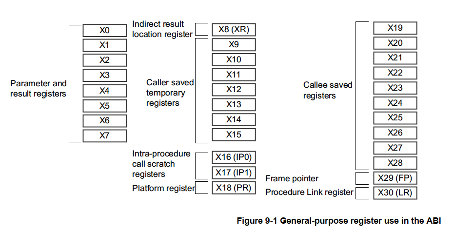
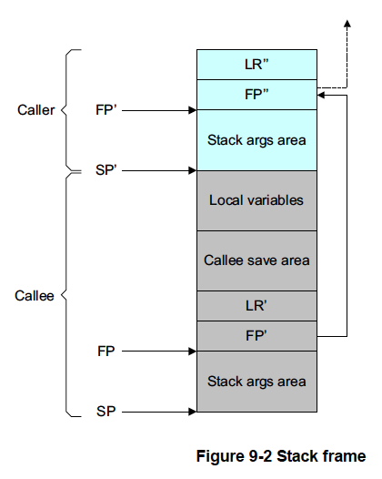
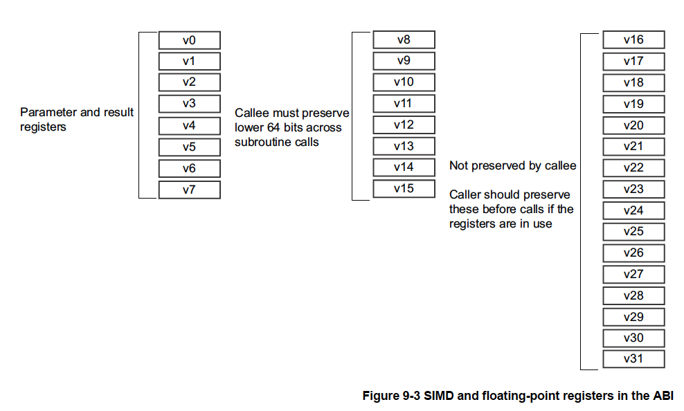

# 9章 ARM64ビットアーキテクチャのABI

ARMアーキテクチャのABI（Application Binary Interface）はすべての実行可能な
ネイティブコードモジュールが正しく連携して動作するために遵守すべき基本的な
ルールを規定しています。これらの基本ルールは特定のプログラミング言語（C++など）
用の追加ルールで補完されます。個々のオペレーティング システムや実行環境
（Linuxなど）ではARM ABIで指定されたルール以外に独自の要件を満たすために
追加のルールを指定することがあります。

AArch64アーキテクチャのABIには次のような構成要素があります。

<dl>
<dt>ELF (Executable and Linkable Format)</dt>
<dd>「ARM 64ビットアーキテクチャ (AArch64) ELF」 ("ELF for the ARM 64-bit
    Architecture (AArch64)")は、オブジェクトと実行可能ファイルの形式を規定
    しています。</dd>
<dt>PCS（Procedure Call Standard）</dt>
<dd>「ARM 64ビットアーキテクチャ（AArch64）ABIリリースのためのプロシジャコール
    標準」 ("Procedure Call Standard for the ARM 64-bit Architecure (AArch64)
    ABI release") は、サブルーチンを個別に記述し、コンパイル、アセンブルして
    一緒に動作させる方法を規定します。呼び出し側のルーチンと呼び出し側の
    ルーチン、またはルーチンとその実行環境との間の取り決め、たとえばルーチン
    呼び出し時の義務やスタックレイアウトなどを規定しています。</dd>
<dt>DWARF</dt>
<dd>これは広く利用されている標準化されたデバッグ用データフォーマットです。
    AArch64 DWARFはDWARF3.0に基づいていますがいくつかのルールが追加されています。
    詳細については「ARM 64ビットアーキテクチャDWARF（AArch64）」("DWARF for the
    ARM 64-bit Architecture (AArch64)")を参照してください。</dd>
<dt>C/C++ライブラリ</dt>
<dd>「ARM Compiler ARM C/C++ライブラリと浮動小数点サポートユーザガイド」("ARM
    Compiler ARM C and C++ Libraries and Floating Point Support User Guide")は、
    ARM C/C++ライブラリについて説明しています。</dd>
<dt>C++ ABI</dt>
<dd>「ARM64ビットアーキテクチャにおけるC++アプリケーションバイナリインタフェース
    標準」("C++ Application Binary Interface Standard for the ARM 64-bit architecture") は、汎用のC++ ABIについて説明しています。</dd>
</dt>

## 9.1 AArch64プロシジャコール標準におけるレジスタの使用

レジスタの使用に関する標準の知識があると便利です。パラメータの受け渡し法を
理解することで以下のことに役立ちます。

- より効率的なC言語のコードを書くこと
- ディスアセンブルされたコードを理解すること
- アセンブリコードを書くこと
- 異なる言語で書かれた関数を呼び出すこと

### 9.1.1 汎用レジスタによるパラメタ

関数呼び出しの目的に応じて汎用レジスタは4つのグループに分けられます。

<dl>
<dt>引数レジスタ (X0-X7)</dt>
<dd>これらのレジスタは関数にパラメータを渡したり、結果を返したりするのに使用
    されます。スクラッチレジスタまたは呼び出し側が保存するレジスタ変数と
    して使用され、一つの関数内の、または他の関数の呼び出しの間の中間値を保持する
    ことができます。パラメータの受け渡しに8本のレジスタを使用できることにより
    AArch32と比較してパラメータをスタックに積む必要性が低くなっています。</dd>
<dt>呼び出し元が保存する一時レジスタ (X9-X15)</dd>
<dd>呼び出し元がこれらのレジスタの値を他の関数を呼び出している間に保持する必要が
    ある場合、呼び出し元は該当するレジスタを自身のスタックフレームに保存しなければ
    なりません。これらの値を呼び出し元に戻る前に保存・復元する必要なしに、呼び
    出された側のサブルーチンは変更することができます。</dd>
<dt>呼び出された側で保存するレジスタ (X19-X29)</dt>
<dd>これらのレジスタは呼び出された側のフレームに保存されます。呼び出された側の
    サブルーチンはこれらのレジスタを戻る前に保存・復元するのであれば変更する
    ことができます。</dd>
<dt>特殊用途のレジスタ（X8、X16-X18、X29、X30）</dt>
<dt><ul>
<li>X8は間接結果レジスタです。これはたとえば関数が大きな構造体を返すような場合に
    間接的な結果のアドレス位置を渡すために使用します。</li>
<li>X16とX17はプロシジャコール内一時レジスタIP0とIP1です。これらはコールベニヤ
    などのコード、またはサブルーチンコール間の中間値のための一時的なレジスタと
    して使用することができます。これらは関数によって破壊される可能性があります。
    ベニアはリンカが自動的に挿入する小さなコード片のことで、たとえば分岐先が
    分岐命令の範囲外である場合などに使用されます。</li>
<li>X18はプラットフォームレジスタで、プラットフォームABI用に予約されています。
    特別な意味を割り当てないプラットフォームではこれはもう一つの一時レジスタです。</li>
<li>X29はフレームポインタレジスタ(FP)です。</li>
<li>X30はリンクレジスタ(LR)です。</li></ul></dd>
<dl>

図9-1は64ビットXレジスタを示しています。レジスタの詳細については、第4章を参照
してください。浮動小数点パラメータについては「7.2.3 浮動小数点パラメータ」を
参照してください。



### 9.1.2 間接結果ロケーション

再イテレーションをするためにX8(XR)レジスタが間接結果ロケーションを渡すのに
使用されます。以下にコードを示します。

```c
// test.c

struct struct_A
{
    int i0;
    int i1;
    double d0;
    double d1;
} AA;

struct struct_A foo(int i0, int i1, double d0, double d1)
[
    struct struct_A A1;

    A1.i0 = i0;
    A1.i1 = i1;
    A1.d0 = d0;
    A1.d1 = d1;

    return A1;
]

void bar()
{
    AA = foo(0, 1, 1.0, 2.0);
}
```

次のコマンドでコンパイルします。

```
armclang -target aarch64-arm-none-eabi -c test.c
fromelf-c test.o
```

**注意**
<hr/>
以下のコードは機構と原則を示すために最適化をせずにコンパイルしています。最適化を
行うとこのすべてが削除されるかもしれません。
<hr/>

```
foo//
    SUB SP, SP, #0x30                   //
    STR W0, [SP, #0x2C]                 //          |
    STR W1, [SP, #0x28]                 //          |
    STR D0, [SP, #0x20]                 //          |
    STR D1, [SP, #0x18]                 //          |  D1
    LDR W0, [SP, #0x2C]                 //          |  D0
    STR W0, [SP, #0]                    //  SP ->   ┤  W0, W1   ├ <- X8
    LDR W0, [SP, #0x28]                 //          |
    STR W0, [SP, #4]                    //          |
    LDR W0, [SP, #0x20]                 //          |  D1
    STR W0, [SP, 8]                     //          |  DD
    LDR W0, [SP, #0x18]                 //          |  W0, W1
    STR W0, [SP, #10]                   //   OSP -> ┤
    LDR X9, [SP, #0x0]
    STR X9, [X8, #0]
    LDR X0, [SP, #8]
    STR X9, [X8, #8]
    LDR X9, [SP, #0x10]
    STR X0, [X8, #0x10]
    ADD SP, SP, #0x30
    RET
bar//
    STP X29, X30, [SP, #0x10]!          //          |
    MOV X29, SP                         //          |
    SUB SP, SP, #0x20                   //   SP ->  ┤
    ADD X8, SP, #8                      //   X8 ->  ┤
    MOV W0, WZR                         //          |
    ORR W1, WZR, #1                     //          |
    FMOV D0, #1.00000000                //   X29 -> ┤ X29
    FMOV D1, #2.00000000                //          | X30
    BL foo:
    ADRP X8, [PC], 0x78
    ADD X8, X8, #0
    LDR X0, [SP, #8]
    STR X9, [X8, #0]
    LDR X9, [SP, #0x10]
    STR X9, [X8, #8]
    LDR X9, [SP, #0x18]
    STR X9, [X8, 0x10]
    MOV SP, X29
    LDP X29, X30, [SP], #0x10
    RET
```

この例では構造体は16バイト以上です。AArch64のAAPCSに従うと、返される
オブジェクトはXRにより指し示されるメモリに書き込まれます。

生成されたコードは以下を示しています。

- W0, W1, D0, D1 はintegerとdoubleのパラメータを渡すのに使用されています。
- bar() は、foo()の戻り値である構造体を格納するための空間をスタックに確保し、
  spをX8においています。
- bar()はW0, W1, D0, D1のパラメータとともにX8をfoo()に渡し、foo()は演算を
  行う前にそのアドレスを取り込んでいます。
- foo()がX8を破壊するかもしれないので、bar()はSPを使って戻り値の構造体に
  アクセスします。

X8(XR)を使用する利点は関数パラメータを渡すレジスタの可用性を減らさないこと
です。

AAPC64のスタックフレームを図9-2に示しました。フレームポインタ（X29）は
スタック上に保存された以前のフレームポインタを指し、LR（X30）はその後に
保存されるているはずです。コールチェインの最終的なフレームポインタは
0にセットされるはずです。スタックポインタは常に16バイト境界にアライン
されていなければなりません。スタックフレームの正確なレイアウトは若干異なる
場合もあります。特に可変長関数やフレームレス関数の場合です。詳細はAAPCS64
ドキュメントを参照してください。



**注意**
<hr/>
AAPCSでは、FP、LRのブロックレイアウトとこれらのブロックがどのように連結
されるかが規定されているだけです。図9-2に示されている他のすべて（2つの関数の
フレーム間の境界の正確な位置を含む）は指定されておらず、コンパイラが自由に
選択することができます。
<hr/>

図9-2は2つのcallee-savedレジスタ（X19とX20）と1つの一時変数を使用するフレーム
であり次のようなレイアウトになっています（左の数字はFPからのバイト単位の
オフセットです）。

```
40: <padding>
32: temp
24: X20
16: X19
 8: LR'
 0: FP'
```

スタックポインタの16バイトアライメントを維持するためにパディングが必要です。

```
function:
    STP X29, X30, [SP, #-48]        // スタックポインタを減じてFPとLRを格納
    MOV X29, SP                     // 新しいフレームの底をフレームポインタに設定
    STP X19, X20, [X29, #16]        // X19とX20を保存
    ...
    コード本体
    ...
    LDP X19, X20, [X19, #16]        // X19とX29を復元
    LDP X29, X30, [SP], #48         // スタックポインタを元の位置に戻す前にFP'とLR'を復元
    RET                             // 呼び出し元に戻る
```

### 9.1.3 NEONと浮動小数点レジスタによるパラメタ

ARMの64ビットアーキテクチャにはv0-v31という32本のレジスタもあり、NEONや浮動小数点
演算で利用することができます。レジスタを参照する名前はアクセスの大きさに応じて
変化します。

**注意**
<hr/>
AArch32と異なり、AArch64ではNEONと浮動小数点レジスタの128ビットと64ビットのビューは
狭いビューの複数のレジスタと重複しないので、q1、d1、s1はすべてレジスタバンクの同じ
エントリを参照します。
<hr/>



- V0-V7は、サブルーチンへの引数値の受け渡しと関数からの戻り値の返送に使用されます。
  また、ルーチン内の中間値の保持にも使用することもできます（ただし、一般的には
  サブルーチンコール間でのみ使用されます）。
- V8-V15はサブルーチンコールにおいて呼び出された側で保存されなければなりません。
  V8-V15に格納される値の下位64ビットだけが保存される必要があります。
- V16-V31は保存する必要はありません（または呼び出し元で保存する必要があります）。
