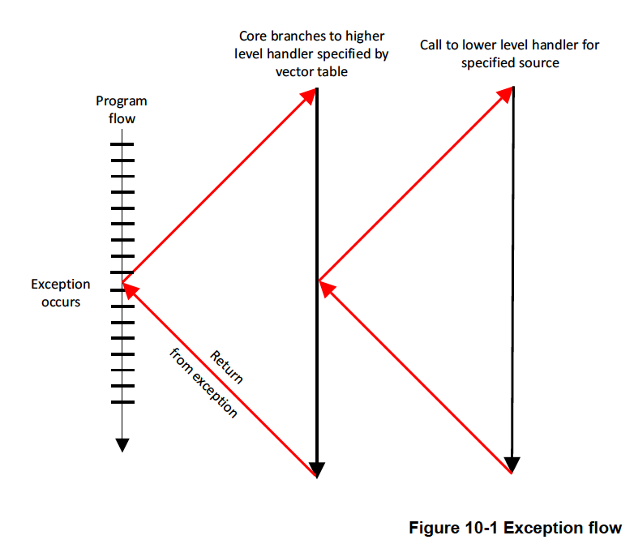
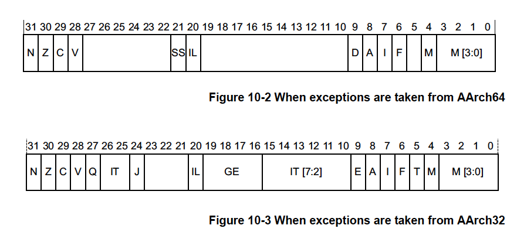
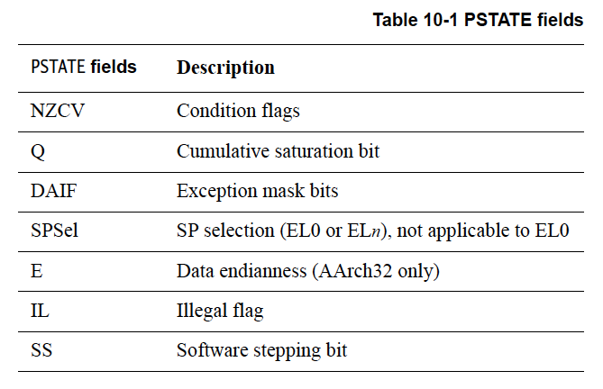
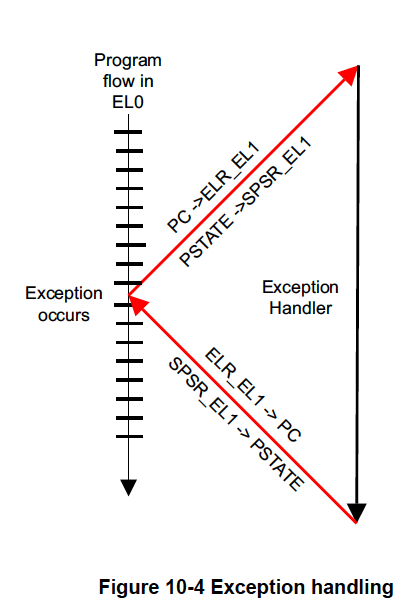
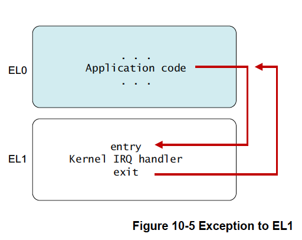
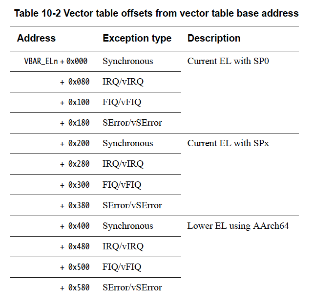
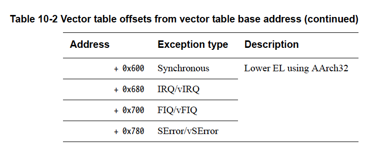
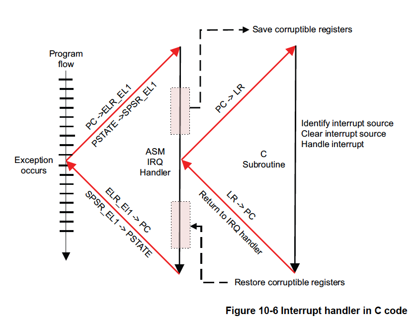
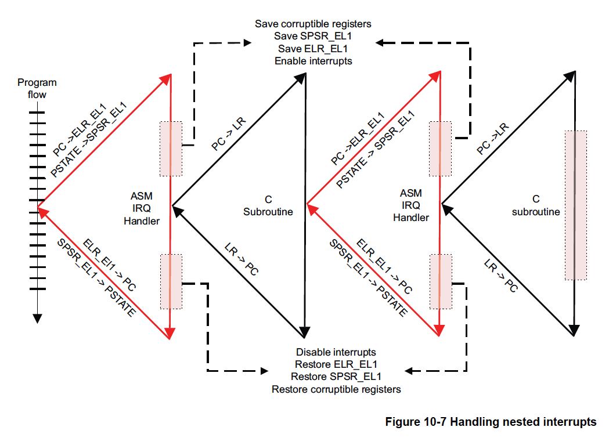

# 10章 AArch64例外処理

厳密には、割り込みとはソフトウェアの実行の流れを中断させるものです。しかし、
実際には、ARMの用語でいうとそれは例外である。例外とは、システムが円滑に動作
するために特権ソフトウェア（例外ハンドラ）による何らかのアクションを必要と
する状態やシステムイベントです。例外の種類ごとに例外ハンドラが存在します。
例外を処理し終えると特権ソフトウェアは例外が発生する前に行っていたことを
再開する準備を行います。

例外の種類には次のようなものがあります。

**割り込み**

    割り込みにはIRQとFIQと呼ばれる2種類があります。

    FIQはIRQより優先順位が高い割り込みです。この2種類の例外は、通常、コアの入力ピンに関連づけられています。
    外部ハードウェアが割り込み要求ラインをアサートすると現在の命令の実行の終了後に割り込みが無効になって
    いなければ（ただし、複数の値をロードできる一部の命令では割り込み可能）対応する例外が発生します。

    FIQとIRQはどちらもコアに対する物理信号であり、アサートされるとコアは対応する例外が現在有効であれば
    その例外を発生させます。ほとんど全てのシステムで、様々な割り込みソースが割り込みコントローラ経由で
    接続されています。割り込みコントローラは割り込みの調停と優先順位付けを行い、直列化された単一信号を
    提供し、これがコアのFIQまたはIRQ信号に接続されます。

    詳細については、10-17ページの「汎用割り込みコントローラ」を参照してください。

    IRQとFIQ割り込みの発生は、その時々にコアで実行されているソフトウェアとは直接関係がないため、非同期
    例外に分類されます。

**アボート**

    アボートは、命令フェッチに失敗した場合（命令アボート）やデータアクセスに失敗した場合（データアボート）に
    発生する場合があります。また、外部メモリシステムがメモリアクセスにエラー応答を与えた場合にも発生します
    （これは指定されたアドレスがシステムにある実メモリに対応しないことを示しています）。さらに、コアの
    メモリ管理ユニット（MMU）がアボートを発生させることもあります。OSはMMUのアボートを利用してアプリ
    ケーションに動的にメモリを割り当てることができます。

    命令がフェッチされたときパイプライン内でアボートされたとマークすることができますが、命令アボート例外は
    コアがその命令を実行しようとしたときにのみ発生します。例外は命令が実行される前に発生します。アボート
    命令がパイプラインの実行段階に達する前にパイプラインがフラッシュされた場合はアボート例外は発生しません。
    データアボート例外はロードまたはストア命令の結果として発生するので、データの読み取りまたは書き込みが
    試行された後に発生するとみなされます。

    アボートは、命令ストリームの実行または実行の試みの結果として発生し、リターンアドレスがその原因となった
    命令の詳細を提供する場合は同期型と説明されます。非同期アボートは命令の実行で生成されるものではなく、
    リターンアドレスが常にアボートの原因に関する詳細を提供するとは限りません。ARMv8-Aにおける命令アボート
    データアボートは同期型です。非同期の例外はIRQ/FIQとシステムエラー（SError）です。10-7ページの同期例外
    および非同期例外を参照してください。

**リセット**

    リセットは、実装されている例外レベルで最高レベルの特別なベクタとして扱われます。ここには例外が発生した
    地点にARMプロセッサがジャンプする命令が置かれます。このベクタは実装定義の（IMPLEMENTATION DEFINED）
    アドレスを使用します。RVBAR_ELnは、このリセットベクタアドレスを保持します。ここで、nは実装済みの最高
    例外レベルの番号です。

    全てのコアはリセット入力を持ち、リセットされるとすぐにリセット例外を受け取ります。これは最も優先度の
    高い例外であり、マスクすることはできません。この例外は、電源投入後にコアを初期化するためのコードを
    実行するために使用されます。

**例外発生命令**

    特定の命令を実行すると例外が発生することがあります。このような命令は、通常、より高い特権レベルで動作
    するソフトウェアにサービスを要求するために実行されます。

    - スーパバイザコール（SVC）命令は、ユーザモードプログラムがOSのサービスを要求することを可能にします。
    - ハイパバイザコール（HVC）命令は、ゲストOSがハイパバイザーのサービスを要求することを可能にします。
    - セキュアモニタコール（SMC）命令は、非セキュアな環境がセキュア環境のサービスを要求することを可能に
      します。

    例外がEL0での命令フェッチの結果として生成された場合、HCR_EL2.TGEビットが非セキュア状態に設定されて
    いなければEL1への例外として処理されます（そうでなければEL2への例外として処理されます）。

    例外がその他の例外レベルでの命令フェッチの結果として生成された場合は例外レベルは変更されません。

本書の冒頭で、ARMv8-Aアーキテクチャには4つの例外レベルがあることを確認しました。
プロセッサの実行は、例外を発生させるか、または例外から復帰することによってのみ、
例外レベル間を移行することができます。プロセッサが高い例外レベルから低い例外レベルに
移行する場合、実行状態を変えない、またはAArch64からAArch32に切り替えることができます。
逆に、低い礼儀レベルから高い例外レベルに移行する場合は、実行状態を変えない、または
AArch32からAArch64に切り替えることができます。



図10-1はアプリケーション実行時に例外が発生した際のプログラムフローを模式的に示した
ものです。プロセッサは、例外の種類ごとにエントリを持つベクタテーブルに分岐します。
ベクタテーブルには通常、例外の原因を特定するディスパッチコードが含まれており、例外を
処理するための適切な関数を選択し呼び出します。このコードは実行を完了した後、高レベルの
ハンドラに復帰し、このハンドラがERET命令を実行してアプリケーションに復帰します。

## 10.1 例外処理レジスタ

第4章ではプロセッサの現在の状態がPSTATEの各フィールドにどのように格納されるかを説明
しました。例外が発生した場合、PSTATE情報はSPSR_ELn（Saved Program Status Register)に
保存されます。このレジスタは例外レベルごとにSPSR_EL3、SPSR_EL2、SPSR_EL1として存在します。



SPRSR.Mフィールド（ビット4）は、実行状態（0はAArch64、1はAArch32を示す）を記録するために
使用されます。



例外ビットマスクビット(DAIF)を使って例外事象をマスクすることができます。このビットが
セットされていると例外は発生しません。

    D   デバッグ例外マスク。
    A   SError 割り込み処理状態マスク。たとえば，非同期外部アボートなど。
    I   IRQ 割り込み処理状態マスク。
    F   FIQ 割り込み処理状態マスク。

SPSelフィールドはスタックポイントとして現在のExceptionレベルのスタックポインタを使用するか、
SP_EL0を使用するかを選択します。これはEL0を除く例外レベルで設定できます。これについては後述
します。

ILフィールドは設定すると次の命令の実行が例外をトリガするようになります。例えば、AArch32と
設定されている時にAArch64としてEL2に戻るための不正な実行復帰に使用されます。

ソフトウェアステッピング（SS）ビットについては第18章デバッグで説明します。これは、デバッガが
1つの命令を実行し、次の命令でデバッグ例外を発生させるために使用されます。

これらのフィールドの一部（CurrentEL、DAIF、NZCVなど）は、例外が発生した際にSPSR_ELnに
コンパクトな形でコピーされます（戻るときはその逆にコピーされます）。

例外を引き起こすイベントが発生すると、プロセッサハードウェアは自動的にある動作を行います。
SPSR_ELnは（nは例外が発生した際の例外レベル）更新され、例外処理終了時に正しく復元するために
必要なPSTATE情報を格納します。PSTATEは新しいプロセッサの状態を反映するように更新されます
（例外レベルを引き上げる場合もあれば、変更しない場合もあります）。例外処理終了時に使用される
復帰アドレスは、ELR_ELnに格納されます。



レジスタ名のサフィックス_ELnは、これらのレジスタのコピーが例外レベルごとに複数存在することを
意味することを思い出してください。たとえば、SPSR_EL1はSPSR_EL2とは異なる物理レジスタです。
さらに、同期例外とSError例外の場合、ESR_ELnは例外の原因を示す値で更新されます。

プロセッサが例外から復帰するタイミングはソフトウェアが指示する必要があります。これは
ERET命令の実行で行われます。この命令はSPSR_ELnから例外発生前のPSTATEを復元し、ELR_ELnから
PCを復元することでプログラムの実行を元の場所に戻します。

ここまで、SPSRが例外復帰に必要な状態情報を記録していることを見てきました。次は、プログラムの
アドレス情報を格納するためのリンクレジスタについて説明します。このアーキテクチャでは
関数呼び出し用と例外復帰用に異なるリンクレジスタが用意されています。

第6章 A64命令セットで見たように、レジスタX30は（RET命令と共に）サブルーチンからの復帰に
使用されます。このレジスタの値は、リンク付き分岐命令（BLまたはBLR）を実行するたびに、
戻るべき命令のアドレスで更新されます。

ELR_ELnレジスタは、例外発生時の戻り先アドレスを格納するために使用されます。このレジスタ
（実際にはこれまで見てきたように複数のレジスタ）の値は、例外発生時に自動的に書き込まれ、
例外からの復帰に使用されるERET命令の実行効果の1つとしてPCに書き込まれます。

**注意**

    例外から復帰する際、SPSRの値がシステムレジスタの設定と矛盾する場合、エラーが表示されます.

ELR_ELnには、特定の例外タイプに優先する戻りアドレスがセットされます。ある種の例外ではこれは
例外を発生させた命令の次の命令のアドレスです。たとえば、SVC（システムコール）命令を実行した
時は単にアプリケーションの次の命令に戻りたいだけです。それ以外の場合は、例外を発生させた命令を
再度実行したいでしょう。

非同期例外の場合、ELR_ELnは割り込みを受けた結果、まだ実行されていない、または完全に実行されて
いない最初の命令のアドレスを指します。ハンドラコードは、たとえば、同期例外を中断した後に
その命令に戻る必要があった場合などで、ELR_ELnを変更することができます。ARMv8-Aのモデルは
ARMv7-Aで使用されていたモデルよりもかなり単純です。後方互換性の理由からある種の例外から
復帰する際にはリンクレジスタの値から4または8を減算する必要があります。

SPSRとELRレジスタに加え、各例外レベルには専用のスタックポインタレジスタがあります。これらは
SP_EL0、SP_EL1、SP_EL2、SP_EL3という名前になっています。これらのレジスタは専用スタックを
指し示すことに使用でき、たとえば、例外ハンドラによって破壊されるレジスタを格納し、元の
コードに戻る前に元の値に復元できるようにすることができます。

ハンドラコードは、SP_ELnではなくSP_EL0を使用するよう切り替えを行うことができます。たとえば、
SP_EL1はカーネルが常に有効であると保証できる小さなスタックを保持するメモリの一部を指すようにし、
SP_EL0は大きいがオーバフローの安全性が保証されていないカーネルタスクスタックを指すことが
できます。この切り替えは、次のコードが示すように、[SPSel]ビットへの書き込みによって制御されます。

```assemby
MSR SPSel, #0   // SP_EL0へ切り替える
MSR SPSel, #1   /. SP_ELnへ切り替える
```

## 10.2 同期例外と非同期例外

AArch64では、例外には同期例外と非同期例外があります。例外のうち、命令ストリームの実行または
実行の試行の結果として発生し、リターンアドレスからその原因となった命令の詳細がわかるものを
同期例外と呼びます。非同期例外は、命令の実行によって発生するものではなく、リターンアドレス
から例外の原因に関する詳細が常に得られるわけではありません。

非同期例外の発生源はIRQ（通常優先度の割り込み）、FIQ（高速割り込み）、SError（システム
エラー）です。システムエラーには多くの原因が考えられますが、最も一般的なものは非同期データ
アボートです（たとえば、キャッシュラインから外部メモリへのダーティデータのライトバックに
よって引き起こされるアボートなど）。

同期例外の原因も次のように数多くあります。

- MMUからの命令アボート。たとえば、実行不可とマークされたメモリ位置から命令の読み出みなど。
- MMUからのデータアボート。たとえば、パーミッションエラーやアライメントチェックなど。
- SPとPCのアライメントチェック。
- 同期外部アボート。たとえば、翻訳テーブル読み出し時のアボートなど。
- 未割り当ての命令。
- デバッグ例外。

### 10.2.1 同期アボート

同期例外の発生理由としては以下のようなものが考えられます。

- MMUからのアボート。たとえば、パーミッションエラーやアクセスフラグフォルトとマークされたメモリ領域など。
- SPとPCのアライメントチェック。
- 未割り当ての命令
- サービスコール（SVC、SMC、HVC）。

このような例外はOSの通常動作である場合があります。たとえば、Linuxでは、タスクが新しいメモリ
ページの割り当てを要求する場合、MMUアボート機構により処理されます。

ARMv7-Aアーキテクチャでは、プリフェッチアボートとデータアボート、未定義例外は区別されます。
AArch64では、これらのイベントはすべて同期アボートを生成します。例外ハンドラはシンドローム
レジスタとFARレジスタを読み込んで、これらを区別するために必要な情報を得ることができます
（詳細は後述します）。

### 10.2.2 同期例外の処理

同期例外の原因についての情報を例外ハンドラに提供するためのレジスタが用意されています。
Execption Syndromeレジスタ(ESR_ELn)は例外の原因に関する情報を提供します。Fault Address
レジスタ（FAR_ELn）は、すべての同期命令アボートとデータアボート、およびアライメントエラーを
発生させたフォールト仮想アドレスを保持します。

Execption Linkレジスタ（ELR_ELn）は、データアクセスをアボートさせた命令のアドレスを
保持します（データアボートの場合）。これは通常、メモリフォルト後に更新されますが、その他の
状況、たとえば、ミスアラインメントアドレスへの分岐によっても設定されます。

AArch32を使用する例外レベルからAArch64を使用する例外レベルに例外が取り込まれ、その例外が
対象となる例外レベルに関連するフォルトアドレスレジスタに書き込む場合、FAR_ELnの上位32ビットは
すべてゼロに設定されます。

EL2 (ハイパバイザ) または EL3 (セキュアカーネル) を実装したシステムでは、通常、同期例外は
現在の例外レベルか、それ高い例外レベルで発生します。非同期例外は（必要であれば）ハイパ
バイザやセキュアカーネルで処理するために、より高い例外レベルにルーティングすることができます。
SCR_EL3レジスタはどの例外をEL3にルーティングするかを指定します。同様に、HCR_EL2はどの例外を
EL2にルーティングするかを指定します。IRQ、FIQ、SErrorのルーティングを個別に制御するための
ビットがあります。

### 10.2.3 システムコール

命令やシステム機能の中には、特定の例外レベルでしか実行できないものがあります。下位の例外
レベルで動作するコードが特権的な操作を実行する必要がある場合があります。たとえば、
アプリケーションコードがカーネルの機能を要求する場合などです。そのための1つの方法がSVC命令の
使用です。この命令はアプリケーションが例外を発生させることを可能にします。パラメータは
レジスタで渡すことも、システムコール内にコード化することもできます。

### 10.2.4 EL2/EL3へのシステムコール

EL0にあるユーザアプリケーションからEL1にあるカーネルへの呼び出しにSVCを使えることを見て
きました。HVCとSMCのシステムコール命令は同様な方法でEL2とEL3へプロセッサを移行させます。
プロセッサがEL0（アプリケーション）で実行している場合はハイパバイザー（EL2）やセキュア
モニタ（EL3）を直接呼び出すことはできません。これは、EL1以上からしかできません。したがって、
アプリケーションはSVCを使用してカーネルを呼び出し、カーネルがアプリケーションに代わって
より高い例外レベルを呼び出だせるようにする必要があります。

OSカーネル（EL1）からソフトウェアはHVC命令でハイパーバイザ（EL2）を呼び出したり、SMC命令で
セキュアモニタ（EL3）を呼び出したりすることができます。プロセッサにEL3が実装されている場合、
EL1からEL2トラップさせるSMC命令が提供されます。EL3がない場合、SMCは未割り当てであり、
現在の例外レベルでトリガーされます。

同様に、ハイパバイザのコード（EL2）からプログラムはSMC命令でセキュアモニタ（EL3）を呼び
出すことができます。EL2またはEL3にいるときにSVCコールを行うと同じ例外レベルの同期例外が
発生し、その例外レベルのハンドラが対応方法を決定することができます。

### 10.2.5 未定義命令

AArch64では未定義命令は同期アボートを発生させます。この例外タイプは、プロセッサが次の
いずれかを実行したときに発生します。

- 割り当てられていない命令のオペコード。
- 現在の例外レベルより高い権限レベルを必要とする命令。
- 無効化された命令
- PSTATE.ILフィールドがセットされている場合、任意の命令。

### 10.2.6 例外シンドロームレジスタ（ESR_ELn）

例外シンドロームレジスタ（ESR_ELn）は、例外ハンドラが例外の理由を判断するための情報を
保持しています。このレジスタは同期例外とSErrorの場合のみ更新されます。IRQやFIQの場合は
更新されません。これらの割り込みハンドラは通常、汎用割り込みコントローラ（GIC）の
レジスタからステータス情報を取得するからです（10-17ページの汎用割り込みコントローラを
参照）。このレジスタのビットコーディングは次のとおりです。

- ESR_ELnのビット[31:26]は、様々な例外原因（未定義命令、MCR/MRCからCP15への
  例外、FP操作による例外、SVC、HVCまたはSMCの実行、データアボート、アライメント例外
  など）をビット区別するために使用できる例外クラスを表します。
- ビット[25]は捕捉された命令の長さを示します（16ビット命令の場合は0、32ビット命令の
  場合は1）。また特定の例外クラスに対しても設定されます。
- ビット[24:0]は、その例外タイプに固有の情報を含む命令固有シンドローム（ISS）
  フィールドを形成します。たとえば、システムコール命令（SVC、HVC、SMC）が実行されると、
  このフィールドにはオペコードに関連する即値が含まれます（たとえば、SVC 0x123456の
  の場合は、0x123456のように）。

## 例外に起因する実行状態と例外レベルの変化

例外発生時にプロセッサは実行状態を変更する（AArch64からAArch32へ）ことも、同じ
実行状態にとどまることもできます。たとえば、AArch32モードで動作しているアプリケーションの
実行中に外部からIRQ（割り込み）例外が発生し、AArch64モードで動作するOSカーネル内で
IRQハンドラを実行することができます。

SPSRには戻るべき実行状態と例外レベルが含まれています。これは例外が発生した際に
プロセッサが自動的に設定します。ただし、各例外レベルの例外に対する実行状態は、以下の
ように制御されます。

- 最も高い例外レベル（必ずしもEL3ではない）のリセット実行状態は、通常、ハードウェア
  構成入力により決定されます。ただし、これは確定ではありません。実行時に最高レベルの
  例外レベルの実行状態（レジスタ幅）を変更する（ソフトリセットを引き起こす）RMR_ELn
  レジスタがあるからです。
  EL3はセキュアモニタコードに関連していることを忘れないでください。モニタは常に特定の
  状態で実行される信頼できる小さなコードです。
- EL2とEL1の場合、実行状態はSCR_EL3.RWビットとHCR_EL2.RWビットにより制御されます。
  SCR_EL3.RWビットはEL3（セキュアモニタ）でプログラムされ、次の下位レベル（EL2）の状態を
  設定します。HCR_EL2.RWビットはEL2またはEL3でプログラムされ、EL1/0の状態を設定できます。
- EL0では決して例外は捕捉されません（EL0はアプリケーションコードに使用される最も低い
  優先順位レベルであることを思い出してください）。

EL0で動作しているアプリケーションが図10-5のようにIRQによって割り込まれた場合を考えます。
カーネルのIRQハンドラはEL1で動作します。プロセッサはIRQ例外を捕捉した際にどの実行状態を
設定するかを決定します。これは、例外が処理されているレベルの一つ上の例外レベルの制御
レジスタのRWビットを見ることで行われます。したがって、この例では、EL1で例外が捕捉された
のでハンドラの実行状態を制御するのはHCR_EL2.RWです。



次に、どの例外レベルで例外を捕捉するかを検討する必要があります。ここでも、例外を捕捉する
際に例外レベルを留めることも、高くすることもできます。すでに見てきたように、EL0で例外を
捕捉することはありません。

同期例外は通常、現在の例外レベルか、より高い例外レベルで捕捉さらます。しかし、非同期例外は
より高い例外レベルへのルーティングができます。セキュアコードの場合、SCR_EL3はどの例外を
EL3にルーティングするかを指定します。ハイパバイザのコードでは、HCR_EL2がEL2にルーティング
する例外を指定します。

どちらの場合も、IRQとFIQ、SErrorのルーティングを制御する個別のビットがあります。
プロセッサはルーティングされた例外レベルの例外のみ捕捉します。例外レベルは例外の捕捉に
より下位になることはありません。割り込みは常に割り込みが捕捉された例外レベルでマスクされます。

AArch32からAArch64に例外を取り込む場合、特別に考えるべき点がいくつかあります。AArch64の
ハンドラコードはAArch32レジスタにアクセスする必要とする場合があり、そのため、
アーキテクチャはAArch32レジスタへのアクセスを可能にするためのマッピングを定義しています。

AArch32レジスタR0からR12はX0からX12としてアクセスされます。各種AArch32モードのSPとLRの
バンク版はX13からX23として、バンク版のR8からR12のFIQレジスタはX24からX29としてアクセス
されます。これらのレジスタのビット[63:32]はAArch32状態では使用できず、0またはAArch64で
最後に書き込まれた値のいずれかが格納されています。どちらの値であるかはアーキテクチャは
保証していません。したがって、通常はWレジスタとしてアクセスします。

## 10.4 AArch64例外テーブル

例外が発生した場合、プロセッサは例外に対応するハンドラコードを実行する必要があります。
そのハンドラが格納されているメモリ上の位置は例外ベクタと呼ばれています。ARMアーキ
テクチャでは、例外ベクタは例外ベクタテーブルと呼ばれるテーブルに格納されます。各例外
レベルは独自のベクタテーブルを持ちます。すなわち、EL3、EL2、EL1の各々に1つベクタテーブルが
あります。このテーブルには一連のアドレスではなく、実行される命令が格納されています。
個々の例外のためのベクタはテーブルの先頭から固定されたオフセットに配置されています。
各テーブルのベース仮想アドレスはVector Based Addressレジスタ（VBAR_EL3、VBAR_EL2、
VBAR_EL1）で設定されます。

ベクタテーブルの各エントリは16命令長です。これだけでも、各エントリが4バイトだった
ARMv7と比べると大きな変化と言えます。ARMv7ベクタテーブルのこの間隔は、各エントリが
ほとんどの場合、メモリ内の他の場所にある実際の例外ハンドラへの何らかの形の分岐である
ことを意味します。AArch64ではベクタの間隔が広くなり、トップレベルのハンドラをベクタ
テーブルに直接書き込むことができます。

表10-2にベクタテーブルの1つを示します。ベースアドレスはVBAR_ELnで与えられ、このベース
アドレスからの各エントリのオフセットが定義されています。各テーブルは16エントリを持ち、
各エントリは128バイト（32命令）のサイズです。テーブルは事実上、4エントリからなる4組で
構成されています。どのエントリが使用されるかは、いくつかの要因に依存します。

- 例外の種類（SError、FIQ、IRQ、同期）
- 同じ例外レベルの例外を捕捉する場合、使用するスタックポインタ（SP0またはSPx)
- 下位の例外レベルの例外を捕捉する場合、その次の下位レベルの実行状態（AArch64かAArch32）




例をあげて説明すると分かりやすいかもしれません。

カーネルコードがEL1で実行中ににIRQ割り込みがシグナルされた場合、IRQ例外が発生します。
この割り込みはハイパバイザやセキュア環境とは関係なく、また、カーネル内で処理され、
SPSelビットが設定されているので、SP_EL1を使っていることになります。したがって、実行は
アドレスVBAR_EL1 + 0x280からとなります。

ARMv8-AアーキテクチャではLDR PC, [PC, #offset]がないため、レジスタ表から読み出む先を
決めるためにより多くの命令を使用する必要があります。ベクタの間隔の選択には、未使用の
ベクタから一般的なサイズの命令キャッシュラインのキャッシュ汚染を回避するように設計
されています。リセットアドレスは完全に独立した実装定義のアドレスであり、通常はコア内に
ハードワイヤード構成によって設定されています。このアドレスはRVBAR_EL1/2/3レジスタで
見ることができます。

現在の例外レベルまたは下位の例外レベルからの各例外用に個別の例外ベクトルを持つことにより
OSやハイパバイザは下位の例外レベルをAArch64またはAArch32の状態にすることを柔軟に決定
することができるようになります。SP_ELnは下位レベルで発生した例外用に使用されます。
しかし、ソフトウェアはハンドラ内でSP_EL0を使用するように切り替えることができます。
この機構を使用すると、ハンドラ内でスレッドからの値へのアクセスが容易になります。

## 10.5 割り込み処理

ARMでは通常、割り込みを割り込み信号という意味で使用しています。ARM A-profileと
R-profileのプロセッサでは外部IRQまたはFIQ割り込み信号という意味です。
アーキテクチャではこれらの信号がどのように使用されるかは指定していません。
多くの場合、FIQはセキュアな割り込みソースとして予約されています。初期の
アーキテクチャバージョンでは、FIQとIRQは優先順位の高い割り込みと標準的な
割り込みを示すために使用されていましたが、ARMv8-Aではそうではありません。

プロセッサがAArch64実行状態の例外を捕捉すると自動的にPSTATE割り込みマスクが
すべて設定されます。これは、それ以降の例外が無効になることを意味します。
ソフトウェアがネストされた例外をサポートする場合、たとえば、より高い優先順位の
割り込みがより低い優先順位のソースの割り込み処理を中断できるようにする場合、
ソフトウェアは割り込みを明示的に再有効化する必要があります。

以下の命令において

```
MSR DAIFClr, #imm
```

この即値は、実際には次のマスクもあるため、4ビットフィールドです。

- PSTATE.A（SError用）
- PSTATE.D（Debug用）



アセンブリ言語によるIRQハンドラの例は次のようになります。

```
IRQ_Handler:
                              // 変更される可能性のあるレジスタを全てスタック
  STP X0, X1, [SP, #-16]!     // SP = SP - 16
  ...
  STP X2, X3, [SP, #-16]!     // SP = SP - 16
                              // ARMv7とは違いSTM命令がないのでSTP命令を複数
                              // 使う必要がある
  BL read_irq_source          // 割り込みが生じた理由を判断し、要求をクリアする関数
  BL C_irq_handler            // Cによる割り込みハンドラ
                              // スタックからレジスタを復元する
  LDP X2, X3, [SP], #16       // SP = SP + 16
  LDP X0, X1. [SP], #16       // SP = SP + 16
  ...
  ERET
```

ただし、パフォーマンスの観点から、次のコードのほうが好ましい。

```
IRQ_Handler:
  SUB SP, SP, #<frame_size>   // SP = SP - <frame_seize>
  STP X0, X1, [SP]            // X0とX1をフレームベースに格納
  STP X2, X3, [SP]            // X2とX3をフレームベース + 16バイトに格納
  ...                         // さらにレジスタを格納

  ...                         // 割り込み処理

  BL read_irq_source          // 割り込みが生じた理由を判断し、要求をクリアする関数
  BL C_irq_handler            // Cによる割り込みハンドラ
                              // スタックからレジスタを復元する
  LDP X0, X1, [SP]            // X0とX1をフレームベースから復元
  LDP X2, X3, [SP]            // X2とX3をフレームベースから復元
                              // さらにレジスタを復元
  ADD SP, SP, #<frame_size>   // SPをオリジナルの値に復元
  ...
  ERET
```



ネストされたハンドラにはさらに少しコードが必要です。SPSR_EL1とELR_EL1の内容を
スタックに保存しなければなりません。また、割り込みソースを決定（およびクリア）した
後、IRQを再度有効にしなければなりません。しかし、（ARMv7-Aとは異なり）サブルーチン
コール用のリンクレジスタと例外用のリンクレジスタは異なるので、LRやモードについて
特別なことをする必要はありません。

## 10.6 汎用割り込みコントローラ

ARMは、ARMv8-Aシステムで使用できる標準的な割り込みコントローラを提供しています。
この割込みコントローラのプログラミングインタフェースは、GICアーキテクチャで定義
されています。GICアーキテクチャ仕様には複数のバージョンがあります。この文書では
バージョン2（GICv2）を中心に説明します。ARMv8-Aプロセッサは、通常、GIC-400や
GIC-500などのGICに接続されています。GIC（Generic Interrupt Controller）は、
マルチコアシステムにおいて、ソフトウェアで生成された私用/共有ペリフェラル割り込みの
コア間のルーティングをサポートします。

GICアーキテクチャは、割り込みのソースと動作を管理し、（マルチコアシステムにおいて）
個々のコアに割り込みをルーティングするために使用できるレジスタを提供しています。
これにより、個々のソースからの割り込みのマスク、有効化、無効化、個々のソースの
（ハードウェアにおける）優先順位付け、ソフトウェア割り込みの発生をソフトウェアで
行うことができます。GICはシステムレベルでアサートされた割り込みを受け付け、
接続されている各コアに信号を送り、IRQまたはFIQの例外を発生させることができます。

ソフトウェアの観点からは、GICには2つの主要な機能ブロックがあります。

**ディストリビュータ**

    システムのすべての割り込みソースが接続されています。ディストリビュータは優先度、状態、セキュリティ、
    ルーティング情報、イネーブル状態などの個々の割り込みのプロパティを制御するレジスタを備えています。
    ディストリビュータは、接続されたCPUインタフェースを介して、どの割り込みをコアに転送するかを決定
    します。

**CPUインタフェース**

    コアが割り込みを受信するためのインタフェースです。CPUインタフェースは、そのコアに転送される割り
    込みのマスク、識別、状態を制御するためのレジスタを管理します。CPUインタフェースはシステム内の各
    コアに対して個別に存在します。

割り込みはソフトウェア上では割り込みIDと呼ばれる番号で識別されます。割込みIDは
割込みソースに一意に対応します。ソフトウェアは割り込みIDから割り込みの発生源を
特定し、対応するハンドラを呼び出して割り込みを処理することができます。ソフトウェアに
提示される正確な割り込みIDはシステム設計によって決定されます。

割り込みには様々な種類があります。

**ソフトウェア生成割り込み（SGI）**

    専用のディストリビュータレジスタであるソフトウェア生成割り込みレジスタ（GICD_SGIR）に書き込む
    ことでソフトウェアにより明示的に生成される割り込みです。コア間の通信に最もよく使用される割り込み
    です。SGIはシステム内のすべてのコア、または選択したコアグループを対象とすることができます。
    割り込みIDの0-15はこのために予約されています。割り込みに使用される割り込みIDはその割り込みを
    発生させるソフトウェアにより設定されます。

**私用ペリフェラル割り込み（PPI）**

    ディストリビュータが指定された単一のコアまたは複数のコアにルーティングできるグローバルなペリ
    フェラル割り込みです。割り込みIDの16～31はこのために予約されています。これらはコアにプライベートな
    割り込みソースを識別し、他のコア上の同一のソース（たとえば、コアごとのタイマなど）とは独立しています。

**共有ペリフェラル割り込み（SPI）**

    GICが2つ以上のコアにルーティングできるペリフェラルによろ生成される割り込みです。割り込み番号32-
    1020がこれに使用されます。SPIは、システム全体でアクセス可能な様々なペリフェラルからの割り込みを
    信号化するために使用されます。

**ローカル固有ペリフェラル割り込み（LPI）**

    特定のコアにルーティングされるメッセージベースの割り込みです。LPIはGICv2やGICv1ではサポートされて
    いません。

割り込みにはエッジトリガ（GICが関連入力の立ち上がりエッジを検出するとアサートされ、
クリアされるまでアサートされ続けます）とレベルセンシティブ（GICへの関連入力がHIGHに
なった時のみアサートされると考える）があります。

割り込みには、いくつかの状態があります。

- 非アクティブ: 割り込みが現在アサートされていないことを意味します。

- ペンディング: 割り込み信号がアサートされたがコアによる処理待ちの状態です。ペンディング中の割り込みは、CPUインターフェースに転送され、その後コアに転送される候補となります。

- アクティブ: 割り込み信号がコアに認識され、現在処理中であることを意味します。

- アクティブかつペンディング - コアは割り込みを処理中であり、GICが同一ソースからのペンディング割り込みを持っている状況を表します。

割り込みの優先順位と割り込みの配送先コアのリストは、すべてディストリビュータで
設定されます。周辺機器からディストリビュータにアサートされた割り込みはペンディング
状態になります（すでにアクティブ状態であった場合はアクティブかつペンディング）。
ディストリビュータはコアに配送可能な最も優先度の高いペンディング割り込みを決定し、
そのコアのCPUインタフェースに転送します。CPUインタフェースにおいて割り込みは順番に
信号化されてコアに伝達され、その時点でコアはFIQまたはIRQの例外を捕捉します。

コアはこれに応答して例外ハンドラを実行します。ハンドラはCPUインタフェースレジスタ
から割込みIDを取得し、割込みソースの処理を開始しなければなりません。処理が終了したら、
ハンドラはCPUインタフェースレジスタに書き込みを行い、処理の終了を報告しなければ
なりません。

割り込みに対する典型的なシーケンスは次の通りです。

- 非アクティブ -> ペンディング: 割り込みが周辺機器からアサートされた時

- ペンディング -> アクティブ: ハンドラが割り込みを認識した時

- アクティブ -> 非アクティブ: ハンドルが割り込みの処理を終了したとき。

ディストリビュータは割込みIDの現在の状態を報告するレジスタを提供します。

マルチコア/マルチプロセッサシステムでは、1つのGICを複数のコア（GICv2では最大8個）で
共有することが可能です。GICは、SPIがどのコアをターゲットにするかを制御するレジスタを
提供します。このメカニズムによりオペレーティングシステムはコア間で割り込みを共有・分散し、
アクティビティを調整することができます。

GICの動作に関するより詳細な情報は、各プロセッサのTRMとARM汎用割り込みコントローラ
アーキテクチャ仕様に記載されています。

### 10.6.1 構成

GICはメモリマップドペリフェラルとしてアクセスされます。すべてのコアは共通
ディストリビュータにアクセスできますが、CPUインタフェースはバンク化されており、
各コアは同一のアドレスで自分専用のCPUインタフェースにアクセスします。あるコアが
他のコアのCPUインタフェースにアクセスすることはできません。

ディストリビュータは、個々の割り込みプロパティの構成に使用できるレジスタを
ホストしています。構成可能なプロパティは以下の通りです。

- 割り込みの優先順位（GICD_IPRIORITY<n>）。ディストリビュータはこのレジスタを
  使用して、次にどの割り込みをCPUインタフェースに転送するかを決定します。

- 割り込み構成（GICD_ICFGR<n>）。割り込みがレベルセンシティブかエッジセンシティブかを
  決定します。SGIには適用されません。

- 割り込みターゲット (GICD_ITARGETSR<n>)。割り込みを配送するコアのリストを指定します。
  SPIにのみ適用可能です。

- 割り込みの有効/無効の状態（GICD_ISENABLER<n> と GICD_ICENABLER<n>）。ディストリ
  ビュータでイネーブルになっている割り込みだけが、ペンディングになったときに転送の
  対象となります。

- 割り込みセキュリティ（GICD_IGROUPR<n>）は、割り込みがセキュアワールドソフトウェアと
  ノーマルワールドソフトウェアのどちらに割り当てられるかを決定します。

- 割り込み状態。

ディストリビュータは、ある優先度以下の割り込みがコアに到達しないようにする優先度
マスキング機能も提供しています。ディストリビュータはペンディング中の割り込みが特定の
コアに配送可能か否かを判断する際にこの機能を利用します。

各コアのCPUインタフェースはそのコアでの割り込み制御や処理を細かく調整するのに役立ち
ます。

### 10.6.2 初期化

ディストリビュータもCPUインターフェースもリセット時に無効になります。コアに割り込みを
配送するためには、GICはリセット後に初期化する必要があります。

ディストリビュータにおいて、ソフトウェアは優先度、ターゲット、セキュリティを設定し、
個々の割り込みを有効にする必要があります。ついで、コントロールレジスタ（GICD_CTLR）を
通じてディストリビュータを有効にする必要があります。各CPUインターフェイスについて
ソフトウェアは優先度マスクとプリエンプション設定をプログラムする必要があります。

各CPUインターフェースブロックはコントロールレジスタ(GICD_CTLR)を通して有効化されなければ
なりません。これによりGICはコアに割り込みを配送するための準備を行います。

割り込みがコアに捕捉されるようになるには、ソフトウェアはベクタテーブルに正しい
割り込みベクタを設定し、PSTATEの割り込みマスクビットをクリアし、ルーティング制御を
設定することにより、コアが割り込みを受けられるように準備します。

ディストリビュータを無効にすることによりシステム全体の割り込み機構を無効にすることが
できます。個々のコアへの割り込みの配送はそのコアのCPUインタフェースを無効にすることで
無効にすることができます。また、個々の割り込みはディストリビュータで無効（または有効）に
することができる。

割り込みがコアに到達するためには、個々の割り込み、ディストリビュータ、CPUインタフェースの
すべてが有効である必要があります。また、割り込みは十分な優先度、すなわち、コアの優先度
マスクよりも高い優先度を持つ必要があります。

### 10.6.3 割り込みの処理

コアは割り込みを受け取ると、ベクタテーブルから取得したトップレベルの割り込みベクタに
ジャンプし、実行を開始します。

トップレベルの割込みハンドラはCPUインタフェースブロックから割込み確認レジスタを
読み出し、割込みIDを取得します。

この読み出しにより、割り込みIDが返されると同時に、割り込みがアクティブであることが
ディストリビュータに記録されます。（割り込みソースを識別する）割り込みIDが分かれば
トップレベルのハンドラはデバイス固有のハンドラをディスパッチして割り込みを処理する
ことができます。

デバイス固有ハンドラの実行が終了すると、トップレベルハンドラはCPUインタフェース
ブロックのEoI（割り込み終了）レジスタに同じ割込みIDを書き込み、割込み処理の終了を
知らせます。

これにより、アクティブ状態が解除され、最終的な割り込みステータスが非アクティブまたは
ペンディング（アクティブかつペンディングだった場合）になるほか、CPUインタフェースが
ペンディング中の割り込みをさらにコアに配送できるようになります。これで1つの割り込みの
処理は終了です。

同一のコアで複数の割り込みが処理待ちになっていることもありますが、CPUインタフェースは
一度に1つの割り込みシグナルしか送ることができません。トップレベルの割込みハンドラは
特別な割込みID値1023を読み取るまで上記のシーケンスを繰り返すことになります。この特別な
割り込みIDはスプリアス割り込みIDと呼ばれます。

スプリアス割り込みIDは予約値であり、システム内のどのデバイスにも割り当てることは
できません。トップレベルのハンドラはスプリアス割り込みIDを読み込むと、その実行を
完了し、割り込みを受ける前に行っていたタスクを再開する準備をします。

汎用割込みコントローラ（GIC）は通常、複数の割込みソースからの入力を管理し、IRQまたは
FIQリクエストに分配します。
