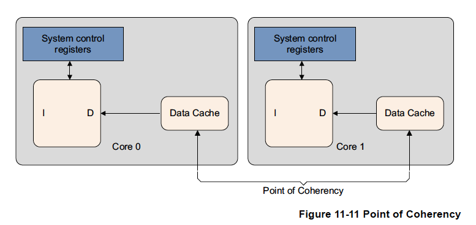

# 11章 キャッシュ

ARMアーキテクチャが開発された当初、プロセッサのクロックスピードとメモリのアクセス
スピードはほぼ同じでした。現在、プロセッサコアははるかに複雑になり、クロック速度も
桁違いに速くなりました。しかし、外部バスやメモリデバイスの周波数は同程度には
スケールアップしていません。コアと同じ速度で動作する小さなオンチップSRAMブロックを
実装することは可能ですが、数千倍の容量を持つ標準的なDRAMブロックと比較すると、
このようなRAMは非常に高価なものです。ARMプロセッサベースの多くのシステムでは
外部メモリへのアクセスに数十から数百のコアサイクルが必要です。

キャッシュはコアとメインメモリの間に位置する小さくて高速なメモリブロックで、
メインメモリ内のアイテムのコピーを保持します。キャッシュメモリへのアクセスは
メインメモリへのアクセスよりかなり高速に行われます。特定のアドレスを読み書き
する際、コアは常にまずキャッシュを探します。そのアドレスがキャッシュにあれば
メインメモリにはアクセスせずキャッシュのデータを使用します。これにより外部
メモリへのアクセス時間の遅れの影響が軽減され、システムの潜在的な性能を大幅に
向上させることができます。さらに、外部信号の駆動が不要になるため、システムの
消費電力も削減することができます。


ARMv8-Aアーキテクチャを実装したプロセッサは、通常、2レベル以上のキャッシュを
実装しています。これは通常、プロセッサが各コアに専用の小さなL1命令/データ
キャッシュキャッシュを持つことを意味します。Cortex-A53とCortex-A57プロセッサは、
通常、2レベル以上のキャッシュ、小さなL1命令/データキャッシュとクラスタの複数の
コア間で共有されるより大きな統合L2キャッシュが実装されています。さらに、
クラスタ間で共有される外部ハードウェアブロックである外部L3キャッシュが存在する
場合もあります。

キャッシュにデータを提供する最初のアクセスは通常より速いわけではない。キャッシュ
された値へのその後のアクセスが高速化され、その結果、性能向上が実現されます。
コアハードウェアはすべての命令フェッチとデータの読み書きについてキャッシュを
チェックしますが、たとえば周辺デバイスを示すメモリなど、一部の部分を非キャッシュと
してマークする必要があります。キャッシュはメインメモリの一部しか保持しないため、
探しているアドレスがキャッシュにあるか否かを迅速に判断する方法が必要です。

キャッシュ上のデータや命令が外部メモリのデータと同じでない場合があります。
これはプロセッサはメインメモリに書き戻すことなしにキャッ シュの内容を更新
することができるからです。また、コアがそのコピーを取った後にエージェントが
メインメモリを更新する場合もあります。これはコヒーレンシの問題で、14章で説明
されています。これは、複数のコアや外部DMAコントローラなどのメモリエージェントが
ある場合に特に問題となることがあります。

## 11.1 キャッシュ技術

フォン・ノイマンアーキテクチャでは、命令用とデータ用で1つのキャッシュが
使用されます（統合キャッシュ）。修正ハーバードアーキテクチャでは命令バスと
データバスが分かれているため、命令キャッシュ（I-cache）とデータキャッシュ
（D-cache）の2つのキャッシュが存在します。ARMv8プロセッサでは命令L1キャッシュと
データL1キャッシュは区別されており、その背後に統合L2キャッシュが存在します。

キャッシュはアドレスとデータ、ステータス情報を保持する必要があります。

以下は使用する用語の簡単な要約とキャッシュの基本構造を示す図です。


- タグ（Tag）は、キャッシュに格納されるメモリーアドレスの一部を構成するもので、
  ラインデータに関係するメインメモリアドレスを特定します。

  64ビットアドレスの上位ビットはその情報がメインメモリのどこから来たかを
  キャッシュ伝えるものであり、タグと呼ばれています。総キャッシュサイズは
  キャッシュが保持するデータ量の指標ですが、タグ値を保持するために使用される
  RAMは計算に含まれません。しかし、タグはキャッシュ内の物理的スペースは使用します。

- 各タグアドレスに対して1ワードのデータを保持するのは非効率的であるため、通常、
  いくつかのロケーションが同一タグの下にまとめられます。この論理ブロックは
  一般にキャッシュライン（Line）と呼ばれており、キャッシュのロード可能な
  最小単位であり、  メインメモリの連続したワードブロックです。キャッシュ
  ラインはキャッシュデータ/命令を含む場合に有効、含まない場合に無効と言います。

  各ラインデータは1つ以上のステータスビットが関連付けられています。通常、
  ラインデータが使用可能なデータを含んでいることを示す有効ビットがあります。
  これはアドレスタグが何らかの実際の値を表していることを意味します。データ
  キャッシュでは、キャッシュライン（またはその一部）がメインメモリの内容と
  同じではない（より新しい）データを保持しているか否かを示す1つ以上のダーティ
  ビットを持つ場合もあります。

- インデックス（Index）はメモリアドレスの一部であり、そのアドレスがキャッシュの
  どのラインにあるかを決定するものです。

  アドレスの中間ビットであるインデックスが行を特定します。インデックスは
  キャッシュRAMのアドレスとして使用されますがタグの一部として保存する必要は
  ありません。これについては本章の後半で詳しく説明します。

- ウェイ（Way）とはキャッシュを細分化したものです。各ウェイは同じ大きさであり、
  同じ方法でインデックス化されています。セット（Set）は、特定のインデックスを
  共有するすべてのウェイからのキャッシュラインで構成されます。

- これは、オフセットと呼ばれるアドレスの下位数ビットはタグに格納する必要がない
  が不要であることを意味します。ライン内の各バイトではなく、ライン全体の
  アドレスが必要なので、最下位の5または6ビットは常に0です。

### 11.1.1 セットアソシアティブキャッシュとウェイ

ARMコアのメインキャッシュは、常にセットアソシアティブキャッシュを使用して
実装されています。これによりダイレクトマップキャッシュで見られるキャッシュ
スラッシングの可能性が大幅に減少し、プログラムの実行速度が向上し、より
決定論的な実行が可能になります。ただし、各サイクルにおいて複数のタグを
比較するため、ハードウェアが複雑になり、消費電力が若干増加します。

この種のキャッシュ構成では、キャッシュはウェイと呼ばれる等しいサイズの断片に
分割されます。そして、メモリロケーションをラインではなくウェイにマッピングする
ことができます。アドレスのインデックスフィールドは引き続き特定のラインを選択する
ために使用されますが、この場合、各ウェイ内の個々のラインを指すことになります。
一般に、L1データキャッシュには2つまたは4つのウェイがあります。Cortex-A57は
3ウェイのL1命令キャッシュを備えています。L2キャッシュは16ウェイが一般的です。

ARM CCN-504 Cache Coherent Network（"Compute subsystems and mobile applications
on page 14-18"を参照）などの外部L3キャッシュの実装はサイズが非常に大きいため、
より多くのウェイ、すなわち高い連想性を持つことができます。同一のインデックス値を
持つキャッシュラインは1つのセットに属すると言われます。ヒットするか確認するには
セット内の各タグを見る必要があります。

図11-3に2ウェイキャッシュを示します。アドレス0x00、0x40、0x80のデータは2つの
キャッシュウェイの両方にあるのはなく、どちらかのウェイのライン0にあります。


キャッシュの連想性を高めることでスラッシングの発生確率を下げることができます。
理想はフルアソシアティブキャッシュであり、そこではメインメモリのすべての位置を
キャッシュ内の任意の場所にマッピングできます。しかし、このようなキャッシュの構築は、
たとえば、MMU TLBに関連するような非常に小さなキャッシュ以外では現実的では
ありません。実際には、8ウェイ以上では性能向上はわずかであり、より大きなL2
キャッシュでは16ウェイ連想がもっとも有用です。

### 11.1.2 キャッシュタグと物理アドレス

各ラインはそのラインに関連する外部メモリの物理アドレスが記録されたタグを持ちます。
キャッシュラインのサイズは実装で定義されます。ただし、インターコネクトの関係で
すべてのコアが同じキャッシュラインサイズを持つ必要があります。

アクセスの物理アドレスはキャッシュ内のデータの位置を決定するために使用されます。
最下位ビットはキャッシュライン内の関連するアイテムの選択に使用されます。中間
ビットはキャッシュセット内の特定のラインを選択するインデックスとして使用されます。
最上位ビットはアドレスの残りを識別し、そのラインに格納されているタグとの比較
に使用されます。ARMv8ではデータキャッシュは通常PIPT（Physically Indexed,
Physically Tagged）ですが、ノンエイリアスのVIPT（Virtually Indexed, Physically Tagged）であることも可能です。

各キャッシュラインには以下が含まれます。

- 関連する物理アドレスのタグ値。
- キャッシュ内にそのラインが存在するか否か、つまりタグが有効であるか否かを示す
  Validビット。キャッシュが複数のコアにわたってコヒーレントである場合、Valid
  ビットは、MESIステートの状態ビットにもなります。
- Dirtyデータビットキャッシュラインのデータが外部メモリとコヒーレントでないか
  否かを示します。

ARMのキャッシュはセットアソシエイティブです。これは、任意のアドレスに対して
複数のキャッシュロケーション（またはウェイ）がある可能性があることを意味します。
セットアソシエイティブキャッシュは、キャッシュスラッシングの可能性を大幅に減少
させるのでプログラムの実行速度を向上させますが、その代償としてハードウェアが
複雑になり、消費電力が若干増加します。

図11-4は、キャッシュライン長が16ワード（64バイト）の単純化された4ウェイセット
アソシエイティブ32KB L1キャッシュ（Cortex-A57プロセッサのデータキャッシュなど）を
示しています。


### 11.1.3 包括的キャッシュと排他的キャッシュ

シングルコアプロセッサにおいて単純なメモリ読み出し、たとえば、`LDR X0, [X1]`を
考えてみます。

- X1がキャッシュ可能なメモリ上の場所を指している場合、L1データキャッシュの
  キャッシュ検索が行われます。
- アドレスがL1キャッシュで見つかった場合、L1キャッシュからデータが読み込まれ
  コアに返されます。

  

- アドレスがL1キャッシュでは見つからず、L2キャッシュで見つかった場合、キャッシュ
  ラインがL2キャッシュからL1キャッシュにロードされ、データがコアに返されます。
  これにより空きをあけるためにあるラインがL1から追い出される可能性があります。
  ただし、そのラインはより大きなL2キャッシュにはまだ存在すると思われます。

  

- アドレスがL1にもL2キャッシュにもない場合、データは外部メモリからL1キャッシュと
  L2キャッシュの両方にロードされ、コアにも供給されます。この際、複数のラインが
  追い出されることがあります。

  

これはかなり単純化した見方です。マルチコアやマルチクラスタの場合、外部メモリから
ロードを実行する前に、クラスタ内のコアや他のクラスタのL2キャッシュやL1キャッシュの
キャッシュもチェックすることがあります。さらに、ここではL3キャッシュもシステム
キャッシュも考慮されていません。

これは包括的（inclusive）キャッシュモデルです。このモデルではL1キャッシュとL2
キャッシュの両方に同じデータが存在する可能性があります。排他的（exclusive）
キャッシュでは、データは一つのキャッシュにしか存在せず、あるアドレスがL1
キャッシュとL2キャッシュの両方で同時に見つかることはありません。

## 11.2 キャッシュコントローラ

キャッシュコントローラは、プログラムからはほとんど見えないような方法でキャッシュ
メモリを管理するハードウェアブロックです。メインメモリからキャッシュにコードや
データを自動的に書き込みます。コアからメモリの読み書きのリクエストを受け取り
キャッシュメモリや外部メモリに対し必要な処理を行います。

コアからの要求を受け取ると、コントローラはリクエストされたアドレスがキャッシュに
あるか確認する必要があります。これはキャッシュルックアップと呼ばれます。
コントローラはリクエストされたアドレスビットの一部をキャッシュ内のラインに
関連するタグの値と比較することでこれを行います。一致した場合（ヒットと呼ばれる）、
そのラインは有効であるとマークされ、そのキャッシュメモリを使用して読み書きが
行われます。

コアが特定のアドレスの命令やデータを要求した際に、キャッシュタグと一致しない、
または、タグが有効でない場合、キャッシュミスとなり、リクエストはメモリ階層の
次のレベル、L2キャッシュ、または外部メモリに渡さなければなりませｎ。また、
キャッシュラインフィルが発生することがあります。キャッシュラインフィルにより
メインメモリの一部の内容がキャッシュにコピーされる場合があります。同時に、
リクエストされたデータまたは命令がコアに流し込まれます。このプロセスは透過的に
行われるためソフトウェア開発者が直接目にすることはありません。コアはデータの
使用にあたってラインフィルが完了するのを待つ必要はありません。キャッシュ
コントローラは、通常、最初のキャッシュライン内のクリティカルワードにアクセス
します。たとえば、キャッシュミスしキャッシュラインフィルを引き起こすような
ロード命令を実行した場合、コアはまずリクエストされたデータを含むキャッシュ
ラインを取り込みます。このクリティカルなデータはコアのパイプラインに供給され、
その間にキャッシュハードウェアと外部バスインターフェースはバックグラウンドで
残りのキャッシュラインを読み出します。

## 11.3 キャッシュポリシー

キャッシュポリシーにより、データキャッシュにラインをいつ割り当てるべきか、データ
キャッシュにヒットするストア命令が実行された時に何をするべきかを記述することが
できます。

キャッシュ割り当てポリシーは次のいずれかです。

**ライトアロケーション（WA）**

    キャッシュラインはライトミス時に割り当てられます。これは、プロセッサでストア命令を実行すると、バーストリードが発生する可能性がある
    ことを意味します。書き込みが実行される前にキャッシュラインのデータを取得するためにラインフィルが行われます。キャッシュには
    ライン内に1バイトしか書き込みを行わない場合でもロード可能な最小単位であるライン全体が含まれます。

**リードアロケーション（RA）**

    キャッシュラインはリードミス時に割り当てられます。

キャッシュの更新ポリシーは次のいずれかです。

**ライトバック（WB）**

    ライトはキャッシュだけを更新し、キャッシュラインをダーティとしてマークします。外部メモリはそのラインが追い出されるか、明示的に
    クリーンアップされた時にはじめて更新されます。

  

**ライトスルー（WT）**

    ライトはキャッシュと外部メモリシステムの両方を更新します。キャッシュラインはダーティとしてマークされません。

  

キャッシュにヒットしたデータの読み出しは、WTキャッシュモードでもWBキャッシュ
モードでも同じ動作をします。

通常のメモリのキャッシュ可能属性は、inner属性とouter属性として別々に指定
されます。innerとouterの区別は実装定義であり、第13章で詳しく説明します。
通常、inner属性は統合キャッシュで使用され、outer属性は外部キャッシュで
使用するためにプロセッサのメモリバスで利用できるようにされます。


通常のメモリはプロセッサによって投機的にアクセスされる場合があります。
これはプログラマが特定のアドレスを明示的に要求しなくてもプロセッサが自動的に
データをキャッシュにロードする可能性があることを意味します。これについては
「第13章 メモリの順序付け」で詳しく説明します。しかし、プログラマがコアに
対して、将来どのデータが使われるかを指示することも可能です。ARMv8-Aは
プリロードヒント命令を提供しています。キャッシュが投機的ロードとプリロードを
サポートするか否かは実装定義です。以下の命令が利用できます。

- AArch64: PRFM PLDL1KEEP, [Xm, #imm]   ; これは、Xm + offset からL1キャッシュに
  ロードするプリフェッチを、データが複数回使用されるかもしれないという
  意味のテンポラルプリフェッチとして行うことを示しています。

- AArch32: PLD Rm   // Rmのアドレスからキャッシュにデータをプリロードする。

より一般的には、メモリをプリフェッチするA64命令は以下のような形をとります。

```
PRFM >prfop>, addr
```

ここで

```
<prfop>     <type><target><policy> | #uimm5
<type>      PLD : ロードのためのプリフェッチ
            PST : ストアのためのプリフェッチ
<target>    L1  : L1キャッシュ
            L2  : L2キャッシュ
            L3  : L3キャッシュ
<policy>    KEEP : 保持または一時的プリフェッチ。通常キャッシュへの割当を意味する
            STRM : 流し込みまたは非一時的プリフェッチ。メモリは1度だけ使用されることを意味する
uimm5       5ビット即値としてエンコードしたヒントを表す。これはオプション項目
```

## 11.4 一貫性のシポイントとユニフィケーションのポイント

セットベースおよびウェイベースのクリーンアップと無効化では、操作は特定レベルの
キャッシュで実行されます。仮想アドレスを使用する操作について、アーキテクチャは
2つのポイントを定義しています。

- **一貫性のポイント (Point of Coherency: PoC)**: PoCとは、特定の
  アドレスに対してメモリにアクセスできるすべてのオブザーバ（コア、DSP、
  DMAエンジンなど）があるメモリ位置の同じコピーを参照することが保証される
  ポイントです。通常、これはメイン外部システムメモリです。

  

- **ユニフィケーションのポイント（Point of Unification: PoU）**: PoUとは、
  1つのコアの命令キャッシュとデータキャッシュ、変換テーブルウォークが
  あるメモリ位置の同じコピーを参照することが保証されるポイントです。
  たとえば、ハーバードレベル1キャッシュと翻訳テーブルのエントリをキャッシュ
  しているTLBを持つシステムでは統合レベル2キャッシュがユニフィケーションの
  ポイントになります。外部キャッシュが存在しない場合、メインメモリが
  ユニフィケーションのポイントとなります。

  

PoUを知ることで、自己修正コードは修正バージョンのコードから将来の命令
フェッチが正しく行われることを保証することができます。これは2段階の
プロセスを使用することによって行うことができます。

- アドレスにより関連するデータキャッシュエントリを削除（clean）する。
- アドレスにより命令キャッシュエントリを無効に（invalidate）する。

ARMアーキテクチャでは、たとえ共有メモリの場所であっても、命令キャッシュと
メモリ間の一貫性を確保するためのハードウェアを必要としません。

## 11.5 キャッシュ保守

ソフトウェアではキャッシュの消去や無効化が必要な場合があります。
外部メモリの内容が変更され、キャッシュから古いデータを削除する必要がある
場合はそうする必要があるでしょう。また、アクセス権やキャッシュポリシー、
仮想アドレスと物理アドレスのマッピングの変更など、MMU関連の操作の後にも
必要になることがあります。また、JITコンパイラやダイナミックライブラリ
ローダなど、動的に生成されるコードでIキャッシュやDキャッシュを同期させ
なければならない場合にも必要になるでしょう。

- キャッシュやキャッシュラインの無効化とは、1つ以上のキャッシュラインの
  有効ビットをクリアして、データを消去することです。リセット後キャッシュの
  内容が未定義になるため必ず無効化する必要があります。これはキャッシュの
  外側にあるメモリ領域の変更をキャッシュのユーザから見えるようにする方法と
  見なすこともできます。

- キャッシュやキャッシュラインの消去とは、ダーティとマークされた
  キャッシュラインの内容を次のレベルのキャッシュ、またはメインメモリに
  書き出し、キャッシュラインのダーティビットをクリアすることです。これに
  より、キャッシュラインの内容と次のレベルのキャッシュまたはメモリシステムが
  コヒーレントなものになります。これはライトバックポリシーが使用されている
  データキャッシュにのみ適用されます。これは、キャッシュの変更を外側の
  メモリドメインのユーザから見えるようにする方法でもありますが、データ
  キャッシュでのみ使用できます。

- ゼロ。これは外側のドメインからその内容を読み込むことなく、キャッシュ内の
  メモリブロックをゼロにするものでず。これはデータキャッシュでのみ使用
  できます。

これらの操作のそれぞれについて、どのエントリに操作を適用するかを選択する
ことができます。

- All。これはキャッシュ全体を意味し、データキャッシュやユニファイド
  キャッシュには使用できません。
- Modified Virtual Address (MVA) 。これはVAの別名であり、特定の仮想アドレス
  を含むキャッシュラインです。
- Set または Way。これはキャッシュ構造内の位置により選択された特定の
  キャッシュラインです。

AArch64キャッシュ保守操作は、次の一般形式を持つ命令を使用して
実行されます。

```
<cache> <operation>{, <Xt>}
```

多くのオペレーションが利用可能です。


アドレス引数を受け付ける命令は保守する仮想アドレスを保持する
64ビットレジスタを引数に取ります。このアドレスにはアライメント制約は
ありません。Set/Way/Level引数を取る命令は、ARMv7アーキテクチャで記述
されている形式に従う下位32ビットを持つ64ビットレジスタを取ります。
アドレス指定によるAArch64データキャッシュ別無効化命令 `DC IVAC` は書き込み
権限が必要です。権限がない場合はパーミッションフォールトが発生します。

すべての命令キャッシュ保守命令は、命令間にDSBが実行されない限り、
他の命令キャッシュ保守命令、データキャッシュ保守命令、
ロードとストアに対して任意の順序で実行することができます。

`DC ZVA` 以外のデータキャッシュ操作でアドレスを指定するものは、それらが
同じアドレスを指定した場合のみ、互いにプログラム順に実行することが保証
されます。アドレスを指定する操作はアドレスを指定しないすべての保守操作に
対してプログラム順に実行されます。

次のようなコード列を考えます。

**例11-1: PoUへのキャッシュ無効化と消去**

```
IC IVAU, X0         // アドレス指定によるPoUへの命令キャッシュの無効化
DC CVAC, X0         // アドレス指定によるPoCへのデータキャッシュの消去
IC IVAU, X1         // X0とX1が異なると前の操作と順番が変えられる可能性がある
```

最初の2つの命令は同じアドレスを参照しているので順番に実行されます。
しかし、最後の命令は異なるアドレスを参照しているため、前の操作と実行順が
替えられる可能性があります。

**例11-2: PoUへのキャッシュ無効化**

```
IC IVAU, X0         // アドレス指定によるPoUへの命令キャッシュの無効化
IC IVALLU           // PoUへのすべての命令キャッシュの無効化
                    // 操作はこの順に実行される
```

これは命令を発行する場合にのみ適用されます。DSB命令の後でしか完了は保証
されません。

`DC ZVA`命令を使用したゼロ値を持つデータキャッシュのプリロード機能は
ARMv8-Aの新機能です。プロセッサは外部メモリシステムよりはるかに速く
動作することができますが、メモリからキャッシュラインをロードするのに
長い時間がかかることもあります。

キャッシュラインのゼロ化は特定のアドレスが将来使用される可能性が高い
ことをプロセッサに示唆するといいう意味で、プリフェッチと同様な動作を
します。しかし、外部メモリアクセスの完了を待つ必要がないため、ゼロ化
操作はより高速に行うことができます。

メモリから実際のデータをキャッシュに読み込む代わりに、ゼロで埋め尽く
されたキャッシュラインを得ることができます。これは、コードがキャッシュ
ラインの内容を完全に上書きすることをプロセッサに示唆することを示唆する
ので、予め読み取っておくことが不要になります。

大きな一時記憶バッファが必要な場合や新しい構造体を初期化する場合を
考えてみてください。単純にメモリを使って開始するコードを書くこともできますし、
それを使用する前にプリフェッチするコードを書くこともできます。どちらも
キャッシュに初期コンテンツを読み込む際に多くのサイクルとメモリ帯域幅を
使用することになります。キャッシュゼロオプションを使用することでこの
無駄な帯域幅を節約し、コードをより高速に実行できる可能性があります。

キャッシュ保守命令を使用するポイントは、その命令がVAで動作するか、
Set/Wayで動作するかによって決めることができます。

PoCかPoUのいずれかであるスコープは選択することができ、ブロードキャスト
可能な操作については、「第14章マルチコアプロセッサ」で説明するように、
共有可能性を選択することができます。

次のコード例はデータキャッシュ全体またはユニファイドキャッシュ全体を
PoCにまで消去する一般的な機構を説明しています。

**例11-3: PoCへのクリンーニング**

```
        MRS X0, CLIDR_EL1
        AND W3, W0, #0x07000000       // 2 x レベルのコヒーレンスを取得
        LSR W3, W3, #23
        CBZ W3, Finished
        MOV W10, #0                   // W10 = 2 x キャッシュレベル
        MOV W8, #1                    // W8 = 定数 0b1
Loop1:  ADD W2, W10, W10, LSR #1      // 3 x キャッシュレベルの計算
        LSR W1, Wo, W2                // このレベルの3ビットのキャッシュタイプを抽出
        AND W1, W1, #0x7
        CMP W1, W2
        B.LT Skip                     // このレベルにデータまたはユニファイドキャッシュなし
        MSR CSSELR_EL1, X10           // このキャッスレベルを選択
        ISB                           // CSSELRの変更を同期
        MRS X1, CCSIDR__EL1           // CCSIDRの読み込み
        AND W2, W1, #7                // W2 = log2(linelen) - 4
        AND W2, W2, #4                // W2 = log2(linelen)
        UBFX W4, W1. #3, #10          // W4 = 最大way数。右アライン
        CLZ W5, W4                    // W5 = 32 - log2(ways)。DCオペランドのwayのビット位置
        LSL W9, W4, W5                // W9 = 最大way数。DCオペランドの位置にアライン
        LSL W16, W8, W5               // W16 = iterationあたりのway数の減分量
Loop2:  UBFX W7, W1, #13, #15         // W7 = 最大set数。右アライン
        LSL W7, W7, W2                // W7 = 最大set数。DCオペランドの位置にアライン
        LSL W17, W8, W2               // W17 = iterationあたりのset数の減分量
Loop3:  ORR W11, W10, w9              // W11 = way数とキャッシュ数の結合
        ORR W11, W11, 7               // W11 = さらにset数との結合（DCオペラント用）
        DC CSW, X11                   // setとwayによるDCの消去を実行
        SUBS W7, W7, W17              // set数の減分
        B.GE Loop3
        SUBS X9, X9, X16              // way数の減分
        B.GE Loop2
Skip:   ADD W10, W10. #2              // 2 x キャシュレベルを増分
        CMP W3, W10
        DSB                           // 先のキャッシュ保守操作の完了を保証
        B.GT Loop1
Finished:
```

注意すべき点が何点かあります。

- 通常、キャッシュ全体の消去や無効化はファームウェアのみが
  コアの電源オン・オフ時の操作の一貫として行うべきものです。また、L2
  キャッシュのライン数は非常に多く、1つずつループさせる必要があるため
  時間が非常にかかります。
  したがって、この種のクリーンアップは間違いなく特別な場合にのみ行う
  ものです。
- `DC CSW`のようなキャッシュ保守操作については、11-13ページの
  キャッシュ保守で説明しています。
- キャッシュは、シーケンスの途中で新しいラインが割り当てられないように
  シーケンスの開始時に無効にする必要があります。キャッシュが排他的の
  場合、ラインがレベル間で移行する可能性があります。
- SMPシステムでは、別のコアがシーケンスの途中でキャッシュからダーティな
  キャッシュラインを取得してPoCに到達するのを防ぐ可能性があります。
  Cortex-A53プロセッサもCortex-A7プロセッサもその可能性があります。
- EL3がある場合、キャッシュはセキュアな世界で無効化する必要があります。
  キャッシュエントリの一部が通常の世界では無効化できない「セキュアダーティ」
  データである可能性があるためです。「セキュア・ダーティ」データは
  そのままにしておくとキャッシュから追い出された時にメモリシステムが
  破壊されるかのうせいがあります。通常のキャッシュはセキュアな世界でも
  通常の世界でも使用されるからです。

ソフトウェアが命令実行とメモリ間の一貫性を必要とする場合、ISBとDSBの
両メモリバリアとキャッシュ保守命令を用いてこの一貫性を管理する
必要があります。例11-4に示すコードはこの目的に使用することができます。

**例11-4: 自己修正コードのラインの消去**

```
// 同一のInner Shareableドメイン内のデータと命令にアクセスする場合の
// 一貫性の例。このコードにXnにより指し示される場所にあるキャッシュ
// 可能な空間に保持されるべき新しい32ビット命令を含む<Wt>を入力してください。
STR Wt, [Xn]
DC CVAU, Xn         // VAによりデータキャッシュをPoUへと消去する
DSB ISH             // キャッシュからデータがクリーンされたことを見えるようにする
IC IVAU. Xn         // VAにより命令キャッシュをPoUへと無効化する
DSB ISH             // 無効化の完了を保証する
ISB                 // フェッチ済み命令列を同期する
```

このコード列は1つのIキャッシュラインまたはDキャッシュラインに収まる命令列に
対してのみ有効です。

このコードは、x0で与えられたベースアドレスで始まり、x1で与えられた長さの
領域に対して仮想アドレスによってデータキャッシュと命令キャッシュを消去し、
無効化します。

**例11-5: 仮想アドレスによる消去**

```
  //
  // X0 = ベースアドレス
  // X1 = 長さ（長さは0でないと仮定）
  //

  // 領域の終わりを計算する
  ADD X1, X1, X0          // ベースアドレス + 長さ

  //
  // MVAによりデータキャッシュを消去
  //
  MRS X2, CTR_EL0         // Cache Typeレジスタを読み込む

  // 最小データキャッシュラインを取得
  //

  UBFX X4, X2, #16, #4    // DmminLine (キャッシュラインのlog2)を取得
  MOV X3, #4              // Dminlineはワード長（4バイト）
  LSL X3, X3, X4          // X3はキャッシュラインを含んでいるはず
  SUB X4, X3, #1          // キャッシュラインのマスクを取得

  BIC X4, X0, X4          // 領域のベースアドレスをアライン
clean data cache:
  DC CVAU, X4             // VAによりデータキャッシュラインをPoUに消去
  ADD X4, X4, X3          // 次のキャッシュライン
  CMP X4, X1              // X4（現在のキャッシュライン）は領域の最後より小さいか
  B.LT clean_data_cache   // while (address < end_addrss)
  DSB ISH                 // キャッシュからデータが消去されたことを見えるようにする

  //
  // VAにより命令キャッシュを消去
  //
  // 最小命令キャッシュラインを取得（X2はctr_el0を保持している）
  AND X2, X2, #0xF        // ImminLine (キャッシュラインのlog2)を取得
  MOV X3, #4              // Iminlineはワード長（4バイト）
  LSL X3, X3, X2          // X3はキャッシュラインを含んでいるはず
  SUB X4, X3, #1          // キャッシュラインのマスクを取得

  BIC X4, X0, X4          // 領域のベースアドレスをアライン
clean_instruction_cache:
  IC IVAU, X4             // VAにより命令キャッシュラインをPoUに消去
  ADD X4, X4, X3          // 次のキャッシュライン
  CMP X4, X1              // X4（現在のキャッシュライン）は領域の最後より小さいか
  B.LT clean_instruction_cache   // while (address < end_addrss)
  DSB ISH                 // 無効化の完了を保証する
  ISB                     // フェッチ済み命令列を同期する
```

## 11.6 キャッシュ発見

キャッシュ保守操作は、キャッシュセット、ウェイ、仮想アドレスのいずれかで
実行できます。プラットフォームに依存しないコードはキャッシュのサイズ、
キャッシュラインのサイズ、セットとウェイの数、システムにあるキャッシュの
レベルの数を知る必要があるかもしれません。この要件はリセット後のキャッシュの
無効化とゼロ操作で最も発生しやすいものと思われます。その他のアーキテクチャ
キャッシュ上の操作はすべて、PoCまたはPoUベースで行われることになるでしょう。

この情報を含むシステム制御レジスタは数多くあります。

- 存在するキャッシュレベルの数はソフトウェアはキャッシュレベルIDレジスタ
  （CLIDR_EL1）を読み取れば知ることができます。
- キャッシュラインサイズはキャッシュタイプレジスタ（CTR_EL0）で与えられます。
- 実行レベルEL0で動作するユーザコードからアクセスする必要がある場合は
  システム制御レジスタ（SCTLR/SCTLR_EL1）のUCTビットを設定することで行う
  ことができます。

キャッシュ内のセットとウェイの数を決定するには2つの異なるレジスタへの例外
レベルのアクセスが必要です。

1. コードは最初にキャッシュサイズ選択レジスタ（CSSELR_EL1）に書き込んで
   どのキャッシュの情報が欲しいかを選択する必要があります。
2. 次にコードはキャッシュサイズIDレジスタ（CCSIDR/CCSIDR_EL1）を読み取ります。
3. データキャッシュゼロIDレジスタ（DCZID_EL0）はゼロ操作でゼロクリアされる
   ブロックサイズを保持しています。
4. SCTLR/SCTLR_EL1の［DZE］ビットとハイパバイザ構成レジスタ（HCR/HCR_EL2）の
   ［TDZ］ビットは、どの実行レベルとどのワールドがDCZID_EL0にアクセスできる
   かを制御します。CLIDR_EL1、CSSELR_EL1、CCSIDR_EL1はAArch32ではPL1以上、
   AArch64ではEL1以上の特権コードからしかアクセスできません。
5. 仮想アドレスによるデータキャッシュゼロ操作命令（`DC ZVA`）の実行が
   EL0の制御を行うSCTLR_EL1.DZEビットで、EL1とEL0の非セキュアな実行を
   制御するHCR_EL2.TDZビットで例外レベルで禁止されている場合、このレジスタを
   読み込むと命令がサポートされていないことを示す数値が返されます。
6. CLIDRレジスタはプロセッサ自体に組むこまれているキャッシュのレベル数
   しか認識しません。外部メモリシステムにあるキャッシュに関する情報は提供
   できません。たとえば、L1とL2だけが統合されている場合、CLIDR/CLIDR_EL1は
   2レベルのキャッシュを識別し、プロセッサは外部L3キャッシュを認識しません。
   キャッシュ保守を行う場合や統合キャッシュとの一貫性を維持しているコードの
   場合は、統合されていないキャッシュを考慮する必要があるでしょう。


また、big.LITTLE システムでは、記述されたキャッシュ階層がコアごとに異なる
場合があります。たとえば、Cortex-A53 プロセッサとCortex-A57 プロセッサでは
CTR.L1IPフィールドが異なります。
