# 12章 メモリ管理ユニット

メモリ管理ユニット（MMU）の重要な機能は、システムが複数のタスクをそれぞれの
プライベートな仮想メモリ空間で動作する独立したプログラムとして実行できる
ようにすることです。この際、システムの物理メモリマップ、すなわち、ハード
ウェアが実際に使用しているアドレスや同時に実行されている他のプログラムに
ついての知識は一切必要ありません

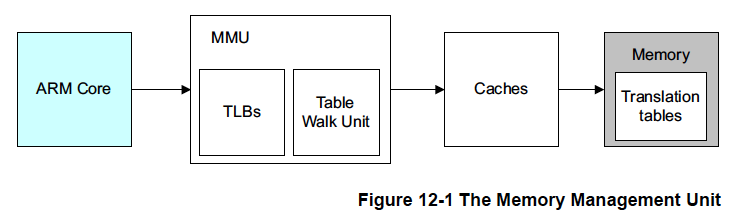

各プログラムで同じ仮想メモリアドレス空間を使用することができます。また、
たとえ物理メモリが断片化されていたとしても連続した仮想メモリマップで
動作することができます。この仮想アドレス空間はシステムの実際の物理的な
メモリマップとは独立しています。仮想メモリ空間で実行するアプリケーションを
書いてコンパイルしてリンクすることができます。

図12-2に、仮想メモリと物理メモリのマッピングを示すシステム例を示しました。
1つのシステムにある様々なプロセッサやデバイスは異なる仮想アドレスマップと
物理アドレスマップを持つ可能性があります。OSはMMUをプログラムしてこれら
2つのメモリ空間の間の変換を行います。

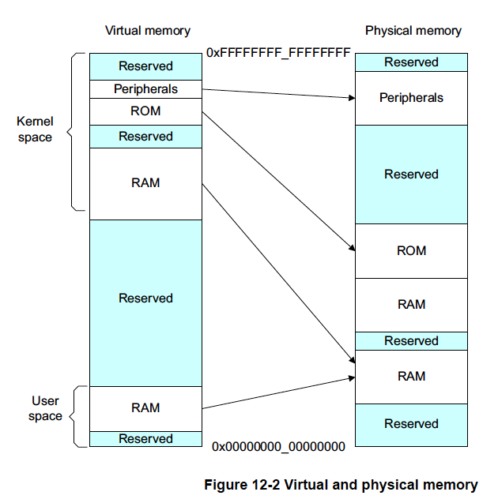

これを行うために仮想記憶システムのハードウェアはプロセッサが発行する
仮想アドレスをメインメモリ上の物理アドレスに変換するアドレス変換を行う
必要があります。

仮想アドレスはユーザやコンパイラ、リンカがコードをメモリ上に配置する
際に使用するアドレスです。物理アドレスは実際にハードウェアシステムが
使用するアドレスです。

MMUは仮想アドレスの最上位ビットを変換テーブルのインデックスエントリとして
使用し、どのブロックがアクセスされているかを確認します。MMUはコードと
データの仮想アドレスを実際のシステムにある物理アドレスに変換します。
この変換はハードウェアで自動的に行われ、アプリケーションからは見えない
ようになっています。アドレス変換以外に、MMUはメモリの各領域のアクセス権限、
メモリオーダー、キャッシュポリシーなども制御します。

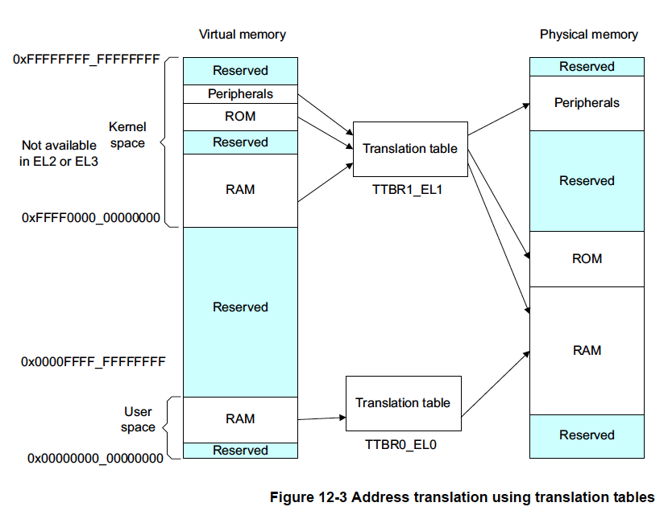

MMUにより、タスクやアプリケーションはシステムの物理メモリマップや同時に
実行されるかもしれない他のプログラムについて知ることなしに記述することが
できます。また、各プログラムは同じ仮想メモリアドレス空間を使用することが
可能になります。

さらに、たとえ物理メモリが断片化されていたとして連続した仮想メモリマップを
使用することができます。この仮想アドレス空間はシステムの実際の物理的なメモリ
マップとは別のものです。アプリケーションは仮想メモリ空間で実行されるように
記述、コンパイル、リンクされます。

## 12.1 TLB (Translation Lookaside Buffer)

TLB（Translation Lookaside Buffer）は、MMUで最近アクセスされたページ変換の
キャッシュです。プロセッサがメモリアクセスをするたびにMMUは変換がTLBに
キャッシュされていないかチェックします。要求されたアドレスの変換がTLBに
ヒットした場合、そのアドレスの変換は直ちに利用できます。

通常、TLBエントリには物理アドレスと仮想アドレスだけでなく、メモリタイプや
キャッシュポリシ、アクセス権限、アドレス空間ID（ASID）、仮想マシンID（VMID）
などの属性も含まれています。プロセッサが発行した仮想アドレスに対して、
TLBに有効な変換がない場合はTLBミスと呼ばれ、外部の変換テーブルのウォーク
またはルックアップが実行されます。MMU内の専用ハードウェアによりメモリ内の
変換テーブルを読み出すことができます。新たに読み込まれた変換は変換テーブル
ウォークがページフォルトにならなかった場合に再利用できるようにはTLBに
キャッシュされます。TLBの正確な構造はARMプロセッサの実装により異なります。

OSがTLBにキャッシュされた変換エントリを更新した場合、これらの古いTLB
エントリを無効にするのはOSの責務です。

A64コードを実行する場合、`TLBI`というTLB無効化命令が存在します。

```
    TLBI <type><level>{IS} {, <Xt>}
```

以下のリストはtypeフィールドに一般的に選択されるものを示しています。
完全なリストは表12-1に示しました。


**ALL**         すべてのTLBエントリ

**VMALL**       すべてのTLBエントリ。これは現在のゲストOSのステージ1

**VMALLS12**    すべてのTLBエントリ。現在のゲストOSのステージ1とステージ2

**ASID**        XtのASIDに一致するエントリ

**VA**          Xtで指定された仮想アドレスとASIDのエントリ

**VAA**         任意のASIDを持つXtで指定された仮想アドレスのエントリ

各例外レベル（EL3、EL2、EL1）はその操作が適用される独自の仮想アドレス空間を
持ちます。ISフィールドはこれがInner Shareableエントリにのみ適用されることを
指定します。

<hr class="note"/>
ASIDについては「12.10 コンテキストの切り替え」を、共有性の概念の詳細については
「12.5 変換テーブルの構成」を参照してください。
<hr/>

<level>フィールドには操作を適用すべき仮想アドレス空間の例外レベル（3、2、
1のいずれか）を指定します。

ISフィールドはこれがInner Shareableエントリにのみ適用されることを
指定します。

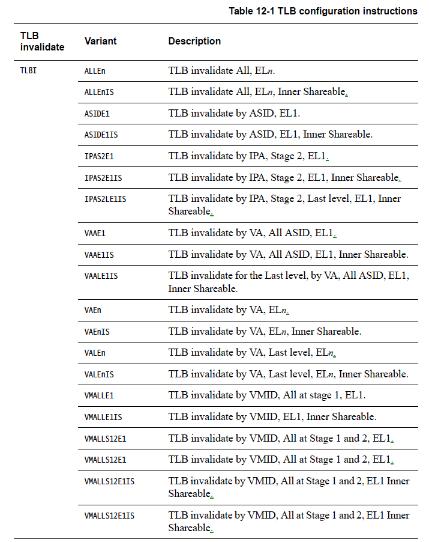

次のコード例はInner Shareableメモリにバックアップされた変換テーブルへの
書き込みシーケンスを示しています。

```
// 変換テーブルへの書き込み
DSB ISHST           // 書き込みが完了したことを保証
TLBI ALLE1          // すべてのTLBエントリを無効化
DSH ISH             // TLB無効化が完了したことを保証
ISB                 // コンテキストを同期し、古い変換を使っている命令がフェッチされていないことを保証
```

例にある`DSB`と`ISB`のバリア命令の詳細については「13.2 バリア」を参照
してください。

1つのエントリに対する変更には、たとえば、次の命令を使用します。

```
TLBI VAE1, X0
```

これはレジスタX0で指定したアドレスに関連するエントリを無効にします。

TLBは固定数のエントリを保持することができます。変換テーブル走査による
外部メモリのアクセス数を最小限に抑え、TLBのヒット率を高くすることで、
最高の性能を得ることができます。ARMv8-AアーキテクチャはTLB空間を効率的に
使用するための連続ブロックエントリという機能を提供しています。変換
テーブルのブロックエントリは各自連続ビットを含んでいます。このビットを
設定すると、複数のブロックの変換をカバーする1つのエントリをキャッシュ
できることをTLBに通知します。ルックアップは連続ブロックがカバーする
アドレス範囲の任意の場所をインデックスすることができます。したがって、
TLBは定義されたアドレス範囲に対して1つのエントリをキャッシュすることが
でき、他の方法よりも大きな範囲の仮想アドレスをTLB内に格納することが
可能になります。

連続ビットを使用するには連続ブロックが隣接していなければなりません。つまり、
仮想アドレスの連続した範囲に対応していなければなりません。ブロックは
アライメントされた境界から始まり、共通の属性を持ち、同一レベルの変換で
連続した出力アドレス範囲を指さなければなりません。必要なアライメントは
4KB粒度の場合はVA[20:16] 、64KB粒度の場合はVA[28:21] がすべてのアドレスで
同じであることです。次の連続するブロックの数が必要です。

- 16 x 4KBの隣接ブロックは、4KB粒度で64KBのエントリを与えます。
- 32 x 32MBの隣接ブロックは、L2記述子用に1GBのエントリを、128 x 16KBは
  16KB粒度使用時にL3記述子用に2MBのエントリを与えます。
- 32 x 64KBの隣接ブロックは、64KB粒度で2MBのエントリを与えます。

これらの条件が満たされない場合、プログラミングエラーが発生し、TLBアボート
またはルックアップの失敗を引き起こす可能性があります。このようなエラーと
して考えられる例には以下のようなものがあります。

- 1つまたは複数のテーブルエントリに連続ビットが設定されていない。
- あるエントリの出力がアライメント範囲の外を指している。

ARMv8アーキテクチャでは、EL0とEL1の有効アドレス空間外の権限チェックを
エスケープしたり、EL3空間への誤ったアクセスを提供するような不正利用は
許されません。

## 12.2 カーネル仮想アドレス空間とアプリケーション仮想アドレス空間の分離

オペレーティングシステムでは、通常、多数のアプリケーションやタスクが同時に
実行されます。これらはそれぞれ独自の変換テーブルを持ち、カーネルはある
タスクタスクから別のタスクにコンテキストを切り替えるプロセスの一環として、
変換テーブルも切り替えます。しかし、メモリシステムの多くはカーネルのみが
使用し、仮想アドレスと物理アドレスのマッピングは固定されており、変換
テーブルのエントリはほとんど変更されません。ARMv8アーキテクチャはこの
要件を効率的に処理するための機能を多数備えています。

変換テーブルのベースアドレスは変換テーブルベースレジスタ（TTBR0_EL1）と
（TTBR1_EL1）で指定されます。TTBR0が指示す変換テーブルはVAの上位ビットがすべて
0のときに選択され、TTBR1はVAの上位ビットがすべて1のときに選択されます。
VAタグを有効にすると上位8ビットをチェックから除外することができます。

プロセッサが使用する命令フェッチやデータアクセスの仮想アドレスは64ビットです。
ただし、上で定義した2つの領域を1つの48ビット物理アドレスメモリマップに
マッピングする必要があります。

EL2とEL3はTTBR0を持ちますが、TTBR1を持ちません。これは次を意味します。

- EL2がAArch64を使用している場合、0x0から0x0000FFFF_FFFFFFの範囲の仮想
  アドレスしか使用できない。
- EL3がAArch64を使用している場合、0x0から0x0000FFFF_FFFFFFの範囲の仮想
  アドレスしか使用できない。

図12-4はカーネル空間をメモリの最上位領域にマッピングし、各アプリケーションの
仮想アドレス空間はメモリの最下位領域にマッピングする方法を示しています。
ただし，両者ははるかに小さな物理アドレス空間にマップされています。

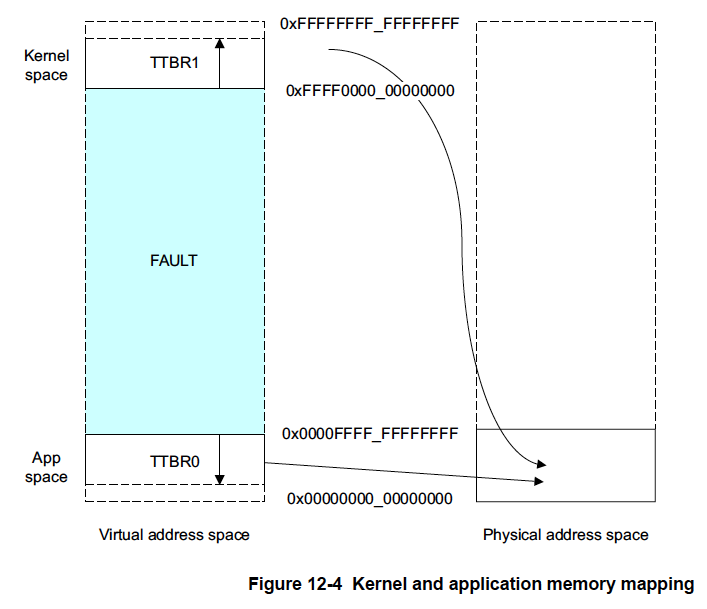

変換制御レジスタTCR_EL1はチェックされる最上位ビットの正確な数を定義します。
TCR_EL1にはサイズフィールドT0SZ[5:0]とT1SZ[5:0]があります。このフィールドの
整数はすべて0かすべて1でなければならない最上位ビットの数を示します。これらの
フィールドには粒度と開始テーブルレベルにより異なる特定の最小値と
最大値が存在します。したがって、常に2つの空間を使用する必要があり、すべての
システムで少なくとも2つの変換テーブルが必要となります。OSのないシンプルなベア
メタルシステムでもfaultエントリのみを含む小さな上位テーブルが必要です。

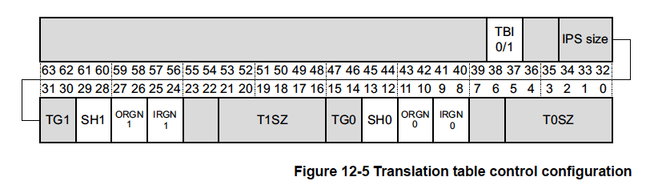

TCR_EL1はEL1とEL0のその他のメモリ管理機能も制御します。図12-5はアドレス範囲と
粒度を制御するフィールドのみを示しています。

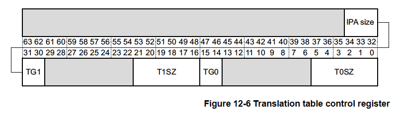

中間物理アドレスサイズ(IPS)フィールドは最大出力アドレスサイズを制御します。
000=32ビット物理アドレス、101=48ビット物理アドレスです。変換によりこの
範囲外の出力アドレスが指定された場合、アクセスは失敗します。2ビットの変換粒度
（TG）フィールドTG1とTG0はそれぞれカーネルとユーザ空間の粒度を与え、00=4KB、01=16KB、11=64KBです。

最初のルックアップに使用される変換テーブルのレベルを設定することができます。
完全な変換処理には3レベルまたは4レベルのテーブルを必要とします。すべての
レベルを実装する必要はありません。最初のレベルのルックアップは実質的には
粒度とTCR_ELn.TxSZフィールドによって決定されます。TTBR0_EL1とTTBR1_EL1は
個別に設定することができます。

## 12.3 仮想アドレスの物理アドレスへの変換処理

プロセッサが命令フェッチやデータアクセスのために64ビットの仮想アドレスを
発行すると、MMUハードウェアは仮想アドレスを対応する物理アドレスに変換します。
仮想アドレスの際上位の16ビット[63:47]はすべて0または1でなければなりません。
そうでない場合はそのアドレスはフォルトを発生させます。

最下位ビットは、選択したセクション内のオフセットの指定に使用されます。
MMUはブロックテーブルエントリの物理アドレスビットとオリジナルアドレスの
最下位ビットを組み合わせて最終的なアドレスを生成します。

このアーキテクチャはタグ付きアドレスもサポートしています。この場合、
アドレスの最上位8ビットは無視されます（アドレスの一部ではないもとして
扱われます）。これはこのビットはたとえばポインタに関する情報の記録など
他の用途に使用することができることを意味します。

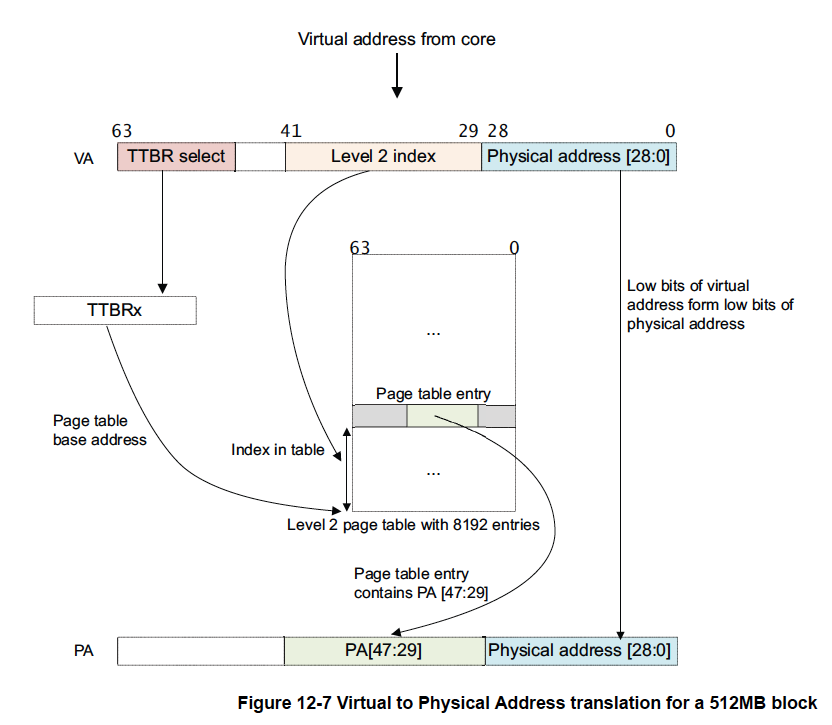

これは1レベルしかないルックアップを含む単純なアドレス変換です。42ビットの
仮想アドレスで64KBの粒度を使用すると仮定しています。MMUは仮想アドレスを
次のように変換します。

1. VA[63:42]=1の場合、TTBR1が最初のページテーブルのベースアドレスとして
   使用されます。VA[63:42]=0の場合、TTBR0が最初のページテーブルのベース
   アドレスとして使用されます。
2. ページテーブルに8192個の64ビットページテーブルエントリがあり、
   VA[41:29]により索引化されています。MMUはテーブルから該当するレベル2
   ページテーブルエントリを読み取ります。
3. MMUはページテーブルエントリの有効性をチェックし、要求されたメモリ
   アクセスが許可されているか確認します。有効であればメモリアクセスが
   許可されます。
4. 図12-7ではページテーブルエントリは512MBのページを参照しています
   （これはブロック記述子です）。
5. このページテーブルエントリから[47:29]ビットが取り出され物理アドレスの
   [47:29] ビットを形成します。
6. 1ページは512MBなので、VAのビット[28:0]がPAの[28:0]を形成するために
   取り出されます。「12.4.2 変換テーブルにおける粒度の影響」を参照して
   ください。
7. ページテーブルエントリからの追加情報とともに完全なPA[47:0]が返されます。

実際には、このような単純な変換処理ではアドレス空間をより詳細に分割する方法が
大きく制限されます。この第1レベルの変換テーブルだけを使用するのではなく、
第1レベルのテーブルエントリは第2レベルのページテーブルを指すこともできます。

こうすることで、OSは仮想メモリの大きな領域をさらに小さなページに分割する
ことができます。第2レベルのテーブルにとって第1レベルの記述子は第2レベルの
ページテーブルのベース物理アドレスを持つことになります。プロセッサが要求
する仮想アドレスに対応する物理アドレスは第2レベルの記述子から見つかります。

図12-8は通常の64KBページのステージ1、レベル2から始まる64ビット粒度の
変換例です。

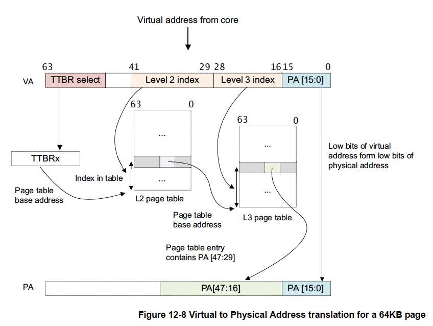

第2レベルテーブルは1つ以上の第1レベルのエントリに関連付けられています。
同一の第2レベルテーブルを指す複数の第1レベル記述子を持つことができます。
これは、同一の物理アドレスに対する複数の仮想ロケーションエイリアスを持つ
ことができることを意味します。

図12-8は2レベルのルックアップがある状況を説明しています。ここでも64KBの
粒度と42ビットの仮想アドレス空間が想定されています。

1. VA[63:42] = 1の場合、TTBR1が最初のページテーブルのベースアドレスとして
   使用されます。VA[63:42]=0の場合、TTBR0が最初のページテーブルのベース
   アドレスとして使用されます。
2. ページテーブルは8192個の64ビットページテーブルエントリをもっており、
   VA[41:29]で索引化されています。MMUはテーブルから該当するレベル2ページ
   テーブルエントリを読み取ります。
3. MMUは、レベル2ページテーブルエントリの有効性と要求されたメモリアクセスが
   許可されているかチェックします。有効であれば、メモリアクセスが許可されます。
4. 図12-8において、レベル2ページテーブルエントリはレベル3ページテーブルの
   アドレスを参照しています（テーブル記述子です）。
5. レベル2ページテーブルエントリから[47:16]ビットが取り出され，レベル3
   ページテーブルのベースアドレスを形成します。
6. VAの[28:16]ビットは、レベル3ページテーブルエントリのインデックスとして
   使用されます。MMUはテーブルから該当するレベル3ページテーブルエントリを
   読み出します。
7. MMUは、レベル3ページテーブルのエントリの有効性と要求されたメモリアクセスが
   許可されているかをチェックします。有効であればメモリアクセスが許可されます。
8. 図12-8においてレベル3ページテーブルエントリは64KBのページを参照しています
   （ページ記述子です）。
9.  レベル3ページテーブルエントリのビット[47:16]が取り出され、PA[47:16]を
    形成するために使用されます。
10. 1ページは64KBページなのでVA[15:0]がPA[15:0]を形成するために使用されます。
11. ページテーブルエントリからの追加情報と共に完全なPA[47:0]が返されます。

### 12.3.1 セキュアなアドレスと非セキュアなアドレス

理論的にはセキュアな物理アドレス空間と非セキュアな物理アドレス空間は互いに
独立しており、並行して存在します。2つの全く異なるメモリシステムを持つように
システムを設計することも可能です。しかし、実際のシステムではセキュアと
非セキュアはアクセス制御の属性として扱うことがほとんどです。通常の
（非セキュアな）世界は非セキュアな物理アドレス空間にしかアクセスできません。
セキュアな世界では両方の物理アドレス空間にアクセスできます。この場合も
変換テーブルによって制御されます。

![図12-0: 物理アドレス空間]

これはキャッシュコヒーレンシにも影響します。たとえば、セキュアな0x8000と
非セキュアな0x8000は技術的に言えば異なる物理アドレスなので両者が同時に
キャッシュにのる可能性があります。

セキュアなメモリと非セキュアなメモリが異なる場所にあるシステムでは、問題は
ありません。しかし、両者は同じ場所にある可能性の方が高いと思われます。
理想的には、メモリシステムは非セキュアなメモリへのセキュアなアクセスと
セキュアなメモリへの非セキュアなアクセスをブロックするのでしょうが、実際には、
ほとんどの場合、セキュアなメモリへの非セキュアなアクセスをブロックする
だけです。この場合も同じ物理メモリがセキュアなメモリと非セキュアな
メモリとして2回キャッシュに入ることになります。これは常にプログラミング
エラーとなります。これを避けるためにセキュアな世界は常に非セキュアな
メモリへの非セキュアなアクセスを使用しなければなりません。

### 12.3.2 MMUの構成と有効化

MMUを制御するシステムレジスタへの書き込みはコンテキストを変更するイベント
なのでそれらの書き込みの間に順序付けの要件はありません。これらのイベントの
結果はコンテキスト同期イベント（「13.2 バリア」参照）までは保証されません。

```
MSR TTBRO_EL1, X0           // TTBR0のセット
MSR TTBR1_EL1, X1           // TTBR1のセット
MSR TCR_EL1, X2             // TCRのセット
ISB                         // ISBはMMUが有効になる前にこれらの変更が見られるように強制する
MRS X0, SCTRL_EL1           // 構成データをシステム制御レジスタから読み込む
ORR X0, X0, #1              // [M]ビットをセットしてMMUを有効にする
MSR SCTLR_EL1, X0           // 構成データをシステム制御レジスタに書き込む
ISB                         // ISBは次の命令がこの変更を見られるように強制する
```

これはフラットマッピングの要件とは別で、SCTLR_EL1.Mへの書き込みの直後に
どの命令が実行されるかを確実に知るためのものです。書き込みの結果が見られる
場合、それは新しい変換体制を使用したVA+4にある命令となります。結果が
見られない場合もVA+4にある命令ですが、そこでは`VA = PA`です。ISBはここでは
役に立ちません。フラットマップしない限り、それが次に実行される命令である
ことを保証できないからです。

### 12.3.3 メモリ管理ユニットが無効の際の操作

ステージ1のMMUが無効の場合、HCR_EL2.DCビットがデータキャッシュを有効に
するように設定されている場合、非セキュアなEL0とEL1のアクセスのデフォルトの
メモリタイプは、ノーマル非共有、Innerライトバック・リードライト割り当て、
Outerライトバック・リードライト割り当てになります。

## 12.4 ARMv8-Aの変換テーブル

ARMv8-Aアーキテクチャは、3つの異なる変換テーブルフォーマットをサポート
しています。

- ARMv8-A AArch64ロングディスクリプタフォーマット
- ARMv7-Aロングディスクリプタフォーマット。ARM Cortex-A15プロセッサなどに
  見られるARMv7-Aアーキテクチャに対する大規模物理アドレス拡張（LPAE）など
- ARMv7-Aショートディスクリプターフォーマット

AArch32の状態では既存のARMv7-Aロングディスクリプタフォーマットとショート
ディスクリプターフォーマットを使用して既存のゲストOSや既存のアプリケーション
コードを変更せずに実行することができます。ARMv7-Aショートディスクリプタは
EL0とEL1のステージ1変換でしか使用できません。そのため、ハイパバイザや
セキュアなモニタコードでは使用できません。

AArch64実行状態では常にARMv8-Aロングディスクリプターフォーマットを使用
してください。これは、大きな物理アドレス拡張を持つARMv7-Aロングディスクリプタ
フォーマットとほとんど同じです。同じく64ビット長のディスクリプタフォーマットを
使用しますがいくつかの変更があります。新しくレベル0テーブルインデックスが
導入され、これあｈレベル1テーブルと同じディスクリプタフォーマットを使用します。
48ビットまでの入出力アドレスのサポートが追加されました。入力仮想アドレスは
64ビットレジスタを使うようになりました。ただし、アーキテクチャが完全な
64ビットアドレッシングをサポートしていないため、アドレスのビット63:48は
すべて同じ、すべて0かすべて1でなければなりません。または、上位8ビットを
VAタグに使用することも可能です。

AArch64は3つの異なる変換粒度をサポートします。これらは変換テーブルの最下位
レベルのブロックサイズを定義し、使用する変換テーブルのサイズを制御します。
粒度を大きくすると必要なページテーブルのレベル数を減らすことができます。
これは仮想化を提供するハイパバイザを使用するシステムでは重要な考慮事項に
なるでしょう。

サポートしている粒度は4KB、16KB、64KBであり、どれをサポートするかは実装
定義です。ページテーブルを作成するコードはシステムレジスタID_AA64MMFR0_EL1を
読み込んでどのサイズがサポートされているかを知ることができます。
Cortex-A53プロセッサは3つのサイズすべてをサポートしていますが、Cortex-A57
などの一部のプロセッサの初期バージョンはそうではなく、16KB粒度をサポート
していません。サイズは変換制御レジスタ（TCR_EL1）で変換テーブルごとに
設定可能です。

### 12.4.1 AArch64ディスクリプタフォーマット

ディスクリプタフォーマットはレベル0からレベル3までのすべてのレベルの
テーブルで使用できます。レベル0のディスクリプタはレベル1のテーブルの
アドレスを出力することができるだけです。レベル3のディスクリプタは別の
テーブルを指し示すことはできず、ブロックアドレスを出力することができる
だけです。したがって、レベル3ではテーブルのフォーマットが若干異なります。

図12-10はテーブルディスクリプタのタイプがエントリのビット1:0で識別され、
以下のいずれかを参照することができることを示しています。

- 次のレベルのテーブルのアドレス。この場合、メモリはさらに小さなブロックに
  細分化されることができます。
- メモリの可変サイズブロックのアドレス。
- FaultまたはInvalidとマークすることができるテーブルエントリ。

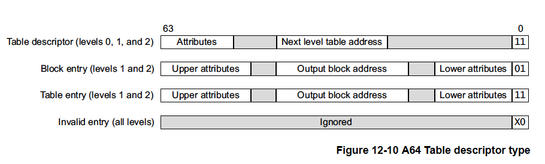

<hr class="note"/>
この図ではわかりやすいようにビットフィールドの幅を指定していません。
<hr/>

### 12.4.2 変換テーブルに対する粒度の影響

3つの異なる粒度は必要となる変換テーブルの数とサイズに影響を与えることが
あります。

<hr class="note"/>
すべての場合でVA入力範囲が42ビットに制限されている場合は第1レベルの
テーブルを省略することができます。VA範囲の大きさによってはさらに少ない
レベルにすることもできます。たとえば、4KBの粒度では、下位アドレスが1GBに
しかならないようにTTBCRが設定されていれば、レベル0と1は必要なく変換は
レベル2から始まり、レベル3で4KBページに行き着きます。
<hr/>

**4KB**

    4KB粒度を使用する場合、ハードウェアは4レベルのルックアップ処理を使用することができます。48ビットのアドレスはレベルごとに
    9ビットがアドレスビットとして変換され、それぞれ512エントリとなり、最後の12ビットがオリジナルアドレスから直接来て4KB内の
    バイトを選択します。

    仮想アドレスの47:39ビットは、512エントリのL0テーブルのインデックスになります。これらのテーブルエントリはそれぞれ512GBの
    範囲にわたり、L1テーブルを指し示します。ビット38:30は512エントリのL1テーブルからエントリを選択するためのインデックスとして
    使用され、各エントリは1GBのブロックかL2テーブルのいずれかを指し示します。ビット29:21は512エントリのL2テーブルのインデックスで
    あり、各エントリは2MBのブロックか次のテーブルレベルを指し示します。最後のレベルのビット20:12は512エントリのL3テーブルの
    インデックスであり、各エントリは4KBのブロックを指し示します。

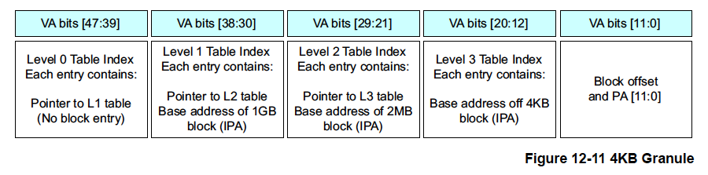

**16KB**


    16KB粒度を使用する場合、ハードウェアは4レベルのルックアップ処理を使用することができます。48ビットのアドレスはレベルごとに
    11ビットがアドレスビットとして変換され、それぞれ2048エントリとなり、最後の14ビットがオリジナルアドレスから直接来て4KB内の
    バイトを選択します。レベル0のテーブルには2つのエントリーしかありません。仮想アドレスの47ビットは、L0テーブルの2つの
    エントリのいずれかのディスクリプタを選択します。これらのテーブルエントリはそれぞれ128TBの範囲にわたり、L1テーブルを
    指し示します。ビット46:36は2048エントリのL1テーブルからエントリを選択するためのインデックスとして使用され、各エントリは
    L2テーブルを指し示します。ビット35:25は2048エントリのL2テーブルのインデックスであり、各エントリは32MBのブロックか次の
    テーブルレベルを指し示します。最後の変換ステージにおいてビット24:14は2048エントリのL3テーブルのインデックスであり、
    各エントリは16KBのブロックを指し示します。

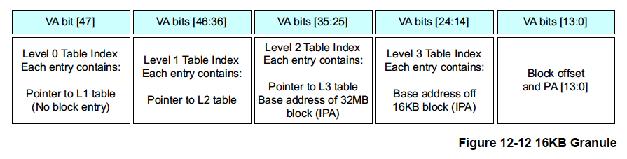

**64KB**

    64KB粒度を使用する場合、ハードウェアは3レベルのルックアップ処理を使用することができます。レベル1のテーブルには64エントリ
    しかありません。仮想アドレスのビット47:42は、64エントリのL1テーブルからディスクリプタを選択します。これらのテーブルエントリは
    それぞれ4TBの範囲にわたり、L2テーブルを指し指します。ビット41:29は8192エントリのL2テーブルからントリを選択するインデックスと
    して使用され、各エントリは512MBブロックかL2テーブルのいずれかを指し示します。最後の変換ステージにおいてビット28:16は
    8192エントリのL3テーブルのインデックスであり、各エントリは64KBブロックを指し示します。

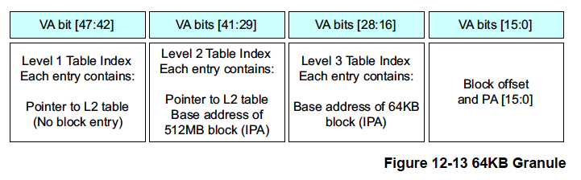

### 12.4.3 キャッシュの構成

MMUは変換テーブルと変換レジスタを使用してどのメモリ位置がキャッシュ可能かを
制御します。MMUはキャッシュポリシー、メモリ属性、アクセス権限を制御し、
仮想アドレスから物理アドレスへの変換を行います。

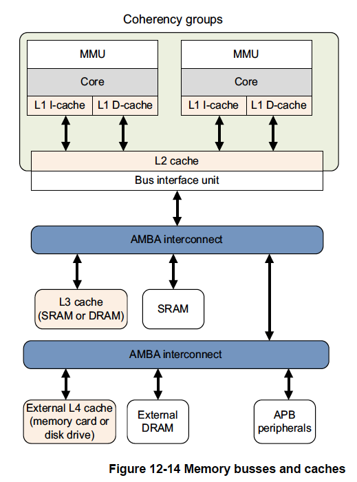

ソフトウェアの構成はシステムレジスタ（その一部は「第4章 ARMv8レジスタ」に
記載）により行われます。

設計によっては、外部メモリシステムにさらに実装固有の外部メモリキャッシュが
含まれる場合があります。

### 12.4.4 キャッシュポリシー

MMUの変換テーブルはメモリシステムの各ブロックのキャッシュポリシーも定義して
います。ノーマルメモリと定義されたメモリ領域はキャッシュ可能またはキャッシュ
不能としてマークされます。変換テーブルエントリのビット[4:2]はMAIR（メモリ
属性間接レジスタ）に定義される8つのメモリ属性符号化のいずれかを参照します。
メモリ属性符号化はそのメモリにアクセスする際に使用するキャッシュポリシーを
指定します。これらはプロセッサに対するヒントであり、特定の実装においてすべての
キャッシュポリシーをサポートするか、どのキャッシュデータをコヒーレントと
みなすは実装定義です。メモリ領域は共有可能性（Shareability）プロパティで
定義することができます。

## 12.5 変換テーブルの構成

個々の変換をTLBに格納するだけでなく、キャッシュ可能なメモリに変換テーブルを
格納するようMMUを構成することができます。通常、これにより常に外部メモリから
読み出すよりもはるかに高速なテーブルへのアクセスが可能になります。TCR_EL1
にはこれを制御するためのフィールドが追加されています。

この追加フィールドはTTBR0とTTBR1に対する変換テーブルのキャッシュ可能性と
共有可能性を指定します。関連するフィールドは共有性がSH0/1、Innerキャッシュ
可能性がIRGN0/1、Outerキャッシュ可能性がORGN0/1です。表12-2にキャッシュ
可能性に設定可能な値を示します。

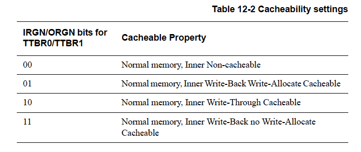

メモリの共有可能性に対応する表は変換テーブルウォークに関連します。デバイス
や強く順序付けされたメモリ領域についてはこの値は無視されます。

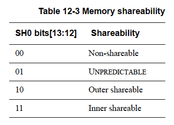

TCR_EL1で指定される属性は変換テーブルが格納される仮想メモリ領域に指定した
属性と同じでなければなりません。変換テーブルをキャッシュすることは普通の
ことです。

### 12.5.1 仮想アドレスのタグ付け

変換制御レジスタ（TCR_ELn）にはタグ付きアドレスをサポートするTBI（Top
Byte Ignore）というフィールドもあります。汎用レジスタは64ビット幅ですが
アドレスの最上位16ビットはすべて0xFFFFか0x0000でなければなりません。
これとは異なるビット値を使用しようとするとフォルトが発生します。

タグ付きアドレスのサポートが有効な場合、仮想アドレスの上位8ビット、ビット
[63:56]はプロセッサによって無視されます。プロセッサは内部的にビット[55]を
64ビット形式のアドレスに符号拡張するためのビットに設定します。これにより、
仮想アドレスの最上位8ビットをデータの受け渡しに使用できます。これらの
ビットはアドレッシングと変換フォールトの対象外となります。TCR_EL1 はEL0と
EL1に対して個別の有効化を持っています。ARMはタグ付きアドレスの特定のユース
ケースを指定したり、義務付けてはいません。

ユースケースとしてはオブジェクト指向プログラミング言語のサポートが挙げられ
ます。この場合、オブジェクトへのポインタだけでなく、オブジェクトを参照して
いる参照やポインタ、ハンドルの数を追跡する参照カウントを保持することが
必要でしょう。これにより、たとえば、自動ガベージコレクションコードはもはや
参照されなくなったオブジェクトの割り当てを解除できるようになります。この
参照カウントを別のテーブルに格納するのではなくタグ付けされたアドレスの
一部として格納することができ、オブジェクトの作成・破棄処理を高速化する
ことができます。

## 12.6 EL2とEL3での変換

ARMv8-Aアーキテクチャの仮想化拡張機能では第2ステージの変換が導入
されています。システムにハイパバイザが存在する場合、1つ以上のゲスト
オペレーティングシステムが存在する可能性があります。これらは前述したように
TTBRn_EL1を引き続き使用し、MMUの動作もかわらないように見えます。

ハイパバイザは異なるゲストオペレーティングシステム間で物理メモリシステムを
共有するために2段階のプロセスで追加の変換ステップを実行する必要があります。
最初のステージでは、仮想アドレス（VA）が中間物理アドレス（IPA）に変換されます。
これは通常、OSの制御下にあります。ハイパバイザに制御される第2ステージでは
IPAから最終的な物理アドレス（PA）への変換が行われます。

ハイパバイザとセキュアなモニタは自身のコードとデータ用にステージ1の変換
テーブルセットも持っており、VAからPAに直接マッピングを行います。

<hr class="note"/>
アーキテクチャリファレンスマニュアルではこの異なるテーブルを
"Translation Regimes"と読んでいます。
<hr/>

図12-15はこの2段階変換プロセスをまとめたものです。

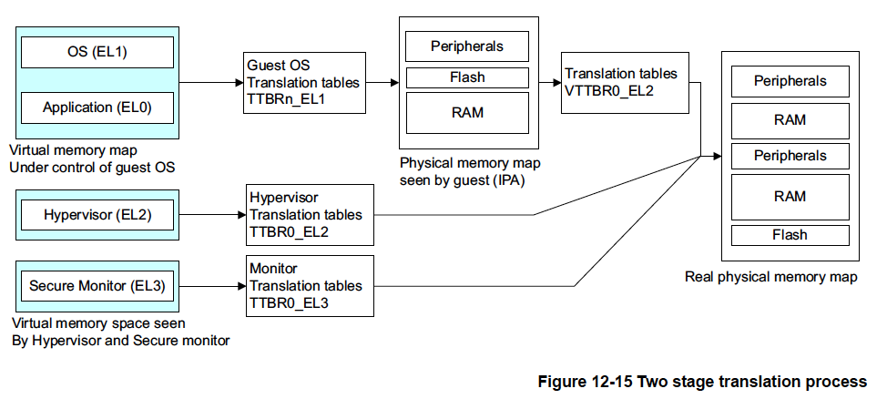

中間物理アドレスを物理アドレスに変換する第2段階の変換はハイパバイザが
制御する追加のテーブルセットを使用します。これらはハイパーバイザー設定
レジスタ（HCR_EL2）へ書き込むことで明示的に有効にする必要があります。
このプロセスは非セキュアなEL1/0アクセスにのみ適用されます。

このステージ2の変換テーブルのベースアドレスは仮想化変換テーブルベース
レジスタ（VTTBR0_EL2）で指定します。これはメモリの底にある単一の連続した
アドレス空間を指定します。サポートされるアドレス空間のサイズは仮想化変換
制御レジスタ（VTCR_EL2）のTSZ[5:0]フィールドで指定します。

このレジスタのTGフィールドは粒度を指定し、SL0フィールドは第1レベルの
テーブルルックを制御します。定義されたアドレス範囲外のアクセスはすべて
変換エラーを発生させます。

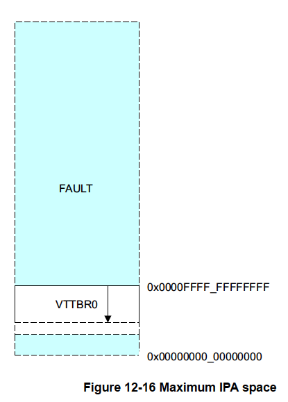

ハイパバイザEL2とセキュアモニタEL3は仮想アドレス空間から物理アドレス空間へ
直接マッピングする自身のレベル1テーブルを持っています。テーブルのベース
アドレスはそれぞれTTBR0_EL2とTTBR0_EL3により指定され、メモリの底に可変
サイズの単一の連続したアドレス空間を設定します。TGフィールドは粒度を指定し、
SL0フィールドは第1レベルのテーブルルックアップを制御します。定義された
アドレス範囲外のアクセスはすべて変換エラーを発生させます。

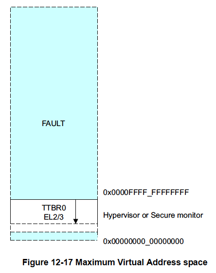

セキュアモニタEL3は専用の変換テーブルを持っています。テーブルのベース
アドレスはTTBR0_EL3により指定され、TCR_EL3を介して構成されます。変換
テーブルはセキュアな物理アドレスと非セキュアな物理アドレスのどちらにも
アクセスすることができます。TTBR0_EL3はセキュアモニタEL3モードでのみ
使用され、トラステッドカーネル自身では使用されません。セキュアなワールドへの
移行が完了すると、トラステッドカーネルはEL1変換、すなわち、TTBR0_EL1と
TTBR1_EL1により指し示される変換テーブルを使用します。これらのレジスタは
AArch64ではバンクされていないため、セキュアモニタのコードはセキュアな
ワールド用に新しいテーブルを構成し、TTBR0_EL1とTTBR1_EL1のコピーを保存
・復元する必要があります。

EL1変換レジームは非セキュア状態にある通常の動作と比べてセキュアな状態では
動作が異なります。変換の第2段階が無効になり、EL1変換レジームはセキュアな
物理アドレスと非セキュアな物理アドレスのいずれも歳示すことができるように
なります。セキュアな世界では仮想化は行われないので、IPAは常に最終的なPAと
同じです。

TLBのエントリはセキュアまたは非セキュアとタグ付けされるため、セキュアな
世界と通常の世界で移行する際にTLBを保守する必要はまったくありません。

## 12.7 アクセス権限

アクセス権限は変換テーブルのエントリによって制御されます。アクセス権限は
領域が読み取り可能か、書き込み可能か、その両方かを制御し、表12-4に示す
ように、非特権アクセスではEL0に、特権アクセスではEL1、EL2、EL3に個別に
設定することができます。

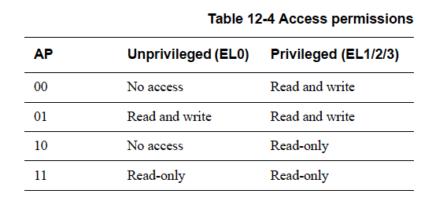

オペレーティングシステムカーネルは実行レベルEL1で動作します。それは
カーネル自身とEL0で実行するアプリケーションにより使用される変換テーブルの
マッピングを定義します。カーネルは自身のコードとアプリケーションに対して
異なるアクセス権限を指定するため、非特権アクセス権限と特権アクセス権限を
区別する必要があります。実行レベルEL2で動作するハイパバイザやEL3で動作
するセキュアモニタは自身が使用する変換スキームしか持たないので、権限に
特権と非特権を分ける必要はありません。

もう一つのアクセス権限の種類に実行可能属性があります。ブロックは実行可能と
実行不可（Execute Never (XN)）のいずれにマークすることができます。非特権
実行不可（Unprivileged Execute Never (UXN) ）と特権実行不可（Privileged
Execute Never (PXN)） という属性も個別に設定でき、これにより、たとえば、
アプリケーションコードがカーネル特権で実行されるのを防いだり、非特権状態で
カーネルコードを実行しようとするのを防ぐことができます。これらの属性を
設定するとプロセッサはメモリ位置への投機的な命令フェッチが実行できなくなり、
投機的な命令フェッチ、アクセスすることで妨害となる可能性がある位置、たとえば、
FIFO（先入れ先出し）のページ交換キューなどに誤ってアクセスすることを
防ぎます。そのため、デバイス領域は常に"Execute Never"とマークされている
必要があります。

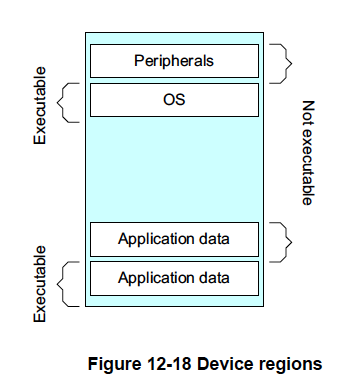

SCTLRレジスタの以下のビットを使用して書き込み可能な領域をExecute Neverと
して扱うようにプロセッサを構成することができます。

- SCTLR_EL1.WXN: EL0で書き込み可能な領域をEL0とEL1でXNとして扱う。EL1で
  書き込み可能な領域をEL1でXNとして扱う。
- SCTLR_EL2.WXN, SCTLR_EL3.WXN: ELnで書き込み可能な領域をELnでXNとして扱う。
- SCTLR.UWXN: EL0で書き込み可能な領域をEL1でXNとして扱う。AArch32のみ。

SCTLR_ELnのビットはTLBエントリにキャッシュすることができます。そのため，
SCTLRのビットを変更してもすでにTLBに登録されているエントリは影響されない
場合があります。これらのビットを変更する場合、TLBの無効化とISBのシーケンスが
必要です。ISBバリアについては「13.2 バリア」を参照してください。

## 12.8 オペレーティングシステムによる変換テーブルディスクリプタの使用

ディスクリプタにあるもう一つのメモリ属性ビットであるアクセスフラグ（AF）は
ブロックエントリが使用されたか否かを示します。

- AF = 0: このブロックエントリはまだ使用されていません。
- AF = 1: このブロックエントリが使用されたことがあります。

オペレーティングシステムはアクセスフラグビットを使ってどのページが使用
されたかを把握することができます。このフラグはソフトウェアが管理します。
ページが最初に作成されたとき、そのエントリのAFには0に設定されています。
コードが初めてそのページにアクセスした際にAFが0であれば、MMUフォルトが
トリガーされます。ページフォルトハンドラはこのページが使用されたことを
記録し、テーブルエントリのAFビットを手動で設定します。たとえば、Linux
カーネルは[AF]ビットをARM64（AArch64のLinuxにおけるカーネル名）のPTE_AF
として使用し、ページがアクセスされたことがあるかをチェックするために
使用しています。これはカーネルのメモリ管理の選択に影響を与えます。たとえば、
ページをメモリからスワップアウトする必要がある場合、頻繁に使用されて
いるページをスワップアウトする可能性は低くなります。

ディスクリプタの[58:55]ビットはソフトウェア利用のために予約されており、
OS固有の情報を変換テーブルに記録するために使用することができます。
たとえば、Linuxカーネルはこれらのビットの1つをエントリがクリーンであるか
ダーティであるかを示すマークとして使用しています。ダーティステータスは
そのページに書き込みがあったか否かを記録します。その後、ページがメモリから
スワップアウトされる際にクリーンページは単に廃棄するだけですみますが、
ダーティページはその内容をまず保存する必要があります。

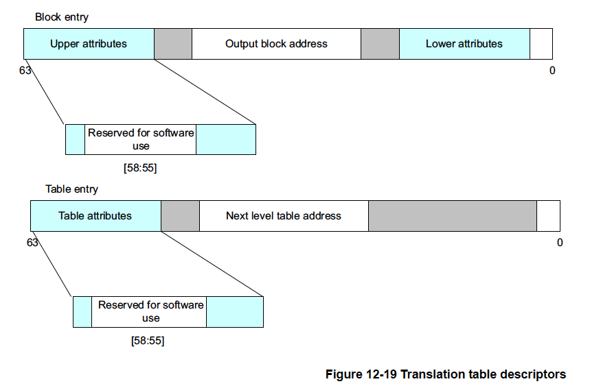

メモリタイプやキャッシュ可能性性、共有性を指定するその他のメモリ属性に
ついては「13章 メモリの順序付け」を参照してください。

## 12.9 セキュリティとMMU

ARMv8-Aアーキテクチャではセキュアと非セキュアという2つのセキュリティ状態が
定義されています。また、セキュアな物理アドレス空間と非セキュアな物理アドレス
空間の2つが定義されています。そして、通常の世界では非セキュアな物理アドレス
空間にしかアクセスできます。セキュアな世界ではセキュアな物理アドレス空間にも
非セキュアな物理アドレス空間にもアクセスできます。

非セキュアな状態では変換テーブルのNSビットとNSTableビットは無視されます。
非セキュアメモリだけがアクセス可能です。セキュアな状態ではNSビットとNSTable
ビットは。仮想アドレスをセキュアな物理アドレスに変換するか、非セキュアな
物理アドレスに変換するかを制御します。SCR_EL3.CIFを使用すると、非セキュアな
物理アドレスに変換される仮想アドレスをセキュアなワールが実行するのを防ぐ
ことができます。さらに、セキュアなワールドでは、SCR.CIFビットを使用して、
セキュアな命令フェッチを非セキュアな物理メモリに対して行うことができるか
否かを制御することができます。

## 12.10 コンテキストスイッチ

ARMv8-Aアーキテクチャを実装したプロセッサは、通常、多くのアプリケーションや
タスクが同時に実行される複雑なオペレーティングシステムを実行するシステムで
使用されます。各プロセスは、物理メモリに存在する各自の変換テーブルを持って
います。アプリケーションが起動すると、オペレーティングシステムはアプリ
ケーションが使用するコードとデータの物理メモリにマッピングする変換テーブルの
エントリセットを割り当てます。その後、これらのテーブルはたとえば追加の
空間のマッピングするためにカーネルにより変更され、アプリケーションが実行され
なくなった際には削除されます。

したがって、メモリシステムには複数のタスクが存在する可能性があります。
カーネルスケジューラは定期的にあるタスクから別のタスクに実行を移します。
これはコンテキストスイッチと呼ばれ、カーネルはプロセスに関連するすべての
実行状態を保存し、次に実行されるプロセスの状態を復元する必要があります。
さらに、カーネルは変換テーブルエントリを次に実行されるプロセスのものに
切り替えます。現在実行されていないタスクのメモリは、実行中のタスクからは
完全に保護されます。

正しく保存と復元が必要なものはOSによって異なりますが、通常、プロセスの
コンテキストスイッチには以下の要素の一部またはすべての保存または復元が
含まれます。

- 汎用レジスタX0-X30
- 高度SIMDおよび浮動小数点レジスタV0-V31
- ステータスレジスタの一部
- TTBR0_EL1とTTBR0
- スレッドプロセスID (TPIDxxx) レジスタ
- アドレス空間ID (ASID)

EL0とEL1については2つの変換テーブルがあります。TTBR0_EL1は通常アプリ
ケーション空間である仮想アドレス空間の下部の変換を、TTBR1_EL1は
通常カーネル空間である仮想アドレス空間の上部の変換をカバーします。
このように分割することでOSのマッピングを各タスクの変換テーブルに複製
する必要がなくなります。

変換テーブルのエントリには非グローバル（nG）ビットが含まれています。
あるページにnGビットが設定されている場合、そのページは特定のタスクか
アプリケーションに関連付けられます。このビットが0とマークされている場合、
そのエントリはグローバルであり、すべてのタスクに適用されます。

非グローバルエントリの場合、TLBが更新され、そのエントリが非グローバルと
マークされると通常の変換情報に加えて、ある値がTLBエントリーに保存されます。
この値はアドレス空間ID（ASID）と呼ばれ、OSが個々のタスクに割り当てる番号です。
これ以降のTLBルックアップでは現在のASIDがエントリに格納されているASIDと
一致する場合にのみそのエントリでマッチングされます。これにより非グローバルと
マークされた特定のページに対して異なるASID値を持つ複数の有効なTLBエントリを
存在させることができます。言い換えれば、コンテキストスイッチの際に
必ずしもTLBをフラッシュする必要がなくなります。

AArch64では、このASID値は8ビット値または16ビット値として指定でき、
TCR_EL1.ASビットで制御されます。現在のASID値はTTBR0_EL1かTTBR1_EL1で
指定されます。TCR_EL1はどちらのTTBRがASIDを保持するかを制御しますが、
これはアプリケーション空間に対応するため通常はTTBR0_EL1です。

<hr class="note"/>
ASIDの現在値が変換テーブルレジスタに格納されていることは、1つの命令で
変換テーブルとASIDの両方をアトミックに変更できることを意味します。
これによりARMv7-Aアーキテクチャと比較してテーブルとASIDの変更処理が
簡素化されています。
<hr/>

さらに、ARMv8-Aアーキテクチャはオペレーティングシステムソフトウェアが
使用できるスレッドIDレジスタも提供しています。これらはハードウェア的には
何の意味もありませんが、通常、スレッドライブラリによりスレッド独自データへの
ベースポインタとして使用されています。これはしばしばスレッドローカルストレージ
（TLS）と呼ばれています。たとえば、pthreadsライブラリはこの機能を使用して
おり、以下のレジスタを含んでいます。

- ユーザー読み書きスレッドIDレジスタ (TPIDR_EL0)。
- ユーザー読み取り専用スレッドIDレジスタ (TPIDRRO_EL0)。
- スレッドIDレジスタ、特権アクセスのみ(TPIDR_EL1).

## 12.11 ユーザ権限でのカーネルアクセス

EL1で実行されるコード（たとえばOS）が、EL0やアプリケーションの権限で
メモリアクセスを実行可能にする命令があります。これは、たとえばシステム
コールで提供されたポインタを逆参照したり、アプリケーションにアクセス
可能なデータだけがアクセスしているかをOSが確認するために使用できます。
これはLDTR命令とSTTR命令で実現できます。これらの命令はEL1で実行された
場合、EL0で実行されたかのようにロードまたはストアを実行します。その他の
例外レベルではLDTRとSTTRは通常のLDRとSTRのように動作します。通常のロード・
ストア命令と同様にサイズ、符号付き、符号なしのバリエーションがありますが、
オフセットは小さく、インデックスのオプションに制約があります。
