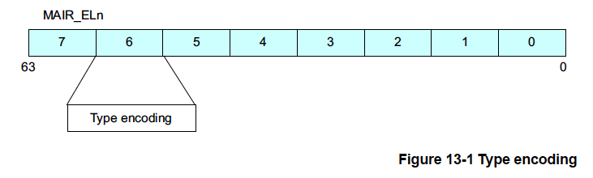
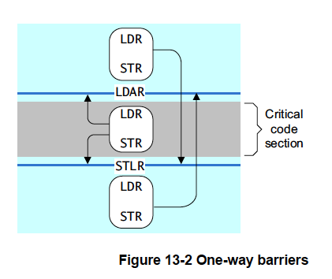
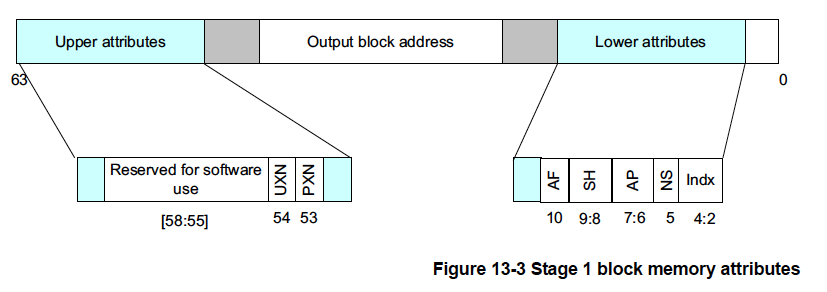
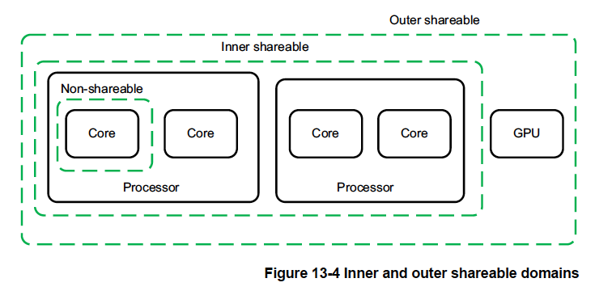

# 13章 メモリオーダリング

あなたのコードがハードウェアや他のコアで実行されているコードと直接
やりとりする場合や実行する命令を直接ロードしたり書き込む場合、または
ページテーブルを変更する場合はメモリオーダリングの問題に注意する必要が
あります。

あなたがアプリケーション開発者の場合、ハードウェアとのやり取りはデバイス
ドライバを、他のコアとのやり取りはPthreadsなどのマルチスレッドAPIを、
ページによるメモリシステムとのやり取りはオペレーティングシステムを介して
行わうことになるでしょう。これらすべての場合において、メモリオーダリングの
問題は関連するコードにより処理されます。しかし、あなたがオペレーティング
システムのカーネルやデバイスドライバを書いている場合、ハイパバイザや
JITコンパイラ、マルチスレッドライブラリを実装している場合は、ARMアーキ
テクチャのメモリオーダリング規則を十分に理解する必要があります。コードが
メモリアクセスの明示的なオーダリングを必要とする場合、バリアを正しい使用
することでこれを実現することができます。

ARMv8アーキテクチャはメモリの弱いオーダリングモデルを採用しています。
ざっくりいうと、これはメモリアクセスの順序はロード・ストア操作のプログラム
順序と同じである必要はないことを意味します。プロセッサはメモリの読み込み
操作を互いに並べ替えることができます。書き込みも順番を変えることができます
（たとえばまとめて書き込むなど）。その結果、キャッシュや書き込みバッファの
使用などのハードウェア最適化がプロセッサの性能を向上させる形で機能します。
これはプロセッサと外部メモリの間で必要となる帯域幅を削減でき、そのような外部
メモリアクセスに関連する長いレイテンシが隠蔽されることを意味します。

ノーマルメモリへの読み書きはハードウェアにより順序を変更することが可能です。
これはデータ依存性と明示的なメモリバリア命令のみに依存します。特定の状況下
ではより強力なオーダリング規則が必要になります。この情報はそのメモリを記述
する変換テーブルエントリのメモリタイプ属性を通じてコアに提供することが
できます。

非常に高性能なシステムでは投機的なメモリ読み出し、複数の命令の同時発行、
アウトオブオーダ実行などの技術をサポートしている場合があります。この
場合、他の技術とともに、メモリアクセスのハードウェア再オーダリングの
可能性が高まります。

**複数命令の同時発行**

    プロセッサは1サイクルの間に複数の命令を発行・実行することによりプログラム順序で前後にある命令を同時に
    実行できる場合があります。

**アウトオブオーダ実行**

    多くのプロセッサは非依存的な命令のアウトオブオーダ実行をサポートしています。ある命令が先行する命令の
    結果を待つために停止した場合、プロセッサは依存関係のない後続の命令をいつでも実行することができます。

**投機**

    分岐などの条件付き命令に遭遇した場合、プロセッサはその命令が実行するべきか否かが判明する前に投機的に
    命令の実行を開始することができます。そのため、推測が正しかったことを示す条件が整えばより早く結果を得る
    ことができます。

**投機的ロード**

    キャッシュ可能な場所から読み出すロード命令が投機的に実行された場合、キャッシュラインフィルが発生し、
    既存のキャッシュラインが消去される場合があります。

**ロードとストアの最適化**

    外部メモリの読み書きは長いレイテンシを持つことがあるので、プロセッサは、たとえば、複数のストアを1つの
    大きなトランザクションにマージすることにより転送回数を減らすことができます。

**外部メモリシステム**

    多くの複雑なシステムオンチップ (SoC) デバイスに数多くの転送を開始するエージェントや読み書きを行う
    デバイスへの複数のルートが存在します。これらのデバイスの中には、DRAMコントローラのように異なるマスタ
    から同時にリクエストを受け付けることができるものがあります。トランザクションはバッファリングされたり、
    インターコネクトにより再オーダリングされることがあります。これは異なるマスタからのアクセスが完了する
    までにさまざまなサイクル数を要し、互いに追い越される可能性があることを意味します。

**キャッシュコヒーレントなマルチコア処理**

    マルチコアプロセッサではハードウェアキャッシュコヒーレンシがコア間でキャッシュラインを移行させる
    ことがあります。そのため、異なるコアでキャッシュされたメモリ位置の更新が互いに異なる順序で見える
    可能性があります。

**最適化コンパイラ**

    最適化コンパイラはレイテンシを抑えたりハードウェアの機能を最大限に活用するために命令を並べ替える
    場合があります。また、メモリアクセスのタイミングを早めることで値が必要になる前に読み込みを完了
    させておくこともよくあります。

シングルコアのシステムでは、個々のプロセッサがハザードをチェックし、
データの依存関係を担保するため、一般に、このような再オーダリングの影響は
プログラマには透過的です。しかし、複数のコアがあり、共有メモリを介して
通信したり、他の方法でデータを共有したりする場合、メモリオーダリングを
考慮することがより重要になります。この章ではマルチプロセシング（MP）操作と
複数の実行スレッドの同期に関連するトピックについて説明します。また、
アーキテクチャにより定義されるメモリの種類とルールとそれらをどのように
制御するかについても説明します。

## 13.1 メモリタイプ

ARMv8アーキテクチャは相互に排他的な2種類のメモリを定義しいます。すべての
メモリ領域はこの2つのタイプ（ノーマルとデバイス）のいずれかに設定され
ます。3つ目のメモリタイプであるStrongly OrderedはARMv7アーキテクチャの
ものです。このタイプとデバイスメモリの違いはほとんどないため、ARMv8では
なくなりました（13.1.2 デバイスメモリを参照）。

属性はメモリタイプの他にキャッシュ可能性、共有可能性、アクセス、実行
権限を制御します。共有可能性とキャッシュ属性はノーマルメモリだけに
関係します。デバイス領域は常にキャッシュ不能かつ外部共有可能であると
みなされます。キャッシュ可能な場所については属性を使用してプロセッサに
キャッシュ割り当てポリシーを示すことができます。

メモリタイプは変換テーブルエントリには直接エンコードされません。
代わりに、各ブロックエントリはメモリタイプテーブルへの3ビットの
インデックスを指定します。このテーブルはメモリ属性間接レジスタ
（MAIR_ELn）に格納されます。このテーブルは図13-1に示すように、8つの
エントリを持ち、各エントリは8ビットです。

変換テーブルブロックのエントリ自体はメモリタイプのエンコーディングを
直接持ちませんが、プロセッサ内部のTLBエントリには通常、特定のエントリに
対するこの情報が格納されます。したがって、ISB命令バリアとTLB無効化
操作の両方が行われるまでMAIR_ELnの変化は観察されません。



### 13.1.1 ノーマルメモリ

ノーマルメモリは、メモリ内のすべてのコード領域とほとんどのデータ領域に
使用することができます。ノーマルメモリの例としては物理メモリ内のRAM、
Flash、ROMの領域があります。この種のメモリは順序付けが弱く、プロセッサ
に課される制約が少ないため、プロセッサのパフォーマンスが最も高く
なります。プロセッサはノーマルメモリへのアクセスの順序を変えたり、
繰り返したり、結合したりすることができます。

さらに、ノーマルとマークされたアドレス位置をプロセッサは投機的に
アクセスできるため、プログラム内で明示的に参照しなくても、あるいは
明示的な参照による実際の実行に先立って、メモリからデータや命令を
読み出すことができます。このような投機的アクセスは分岐予測、投機的
キャッシュラインフィル、アウトオブオーダデータロード、その他のハード
ウェア最適化の結果として発生する可能性があります。

最高のパフォーマンスを得るにアプリケーションのコードとデータには
常にノーマルとマークします。メモリ順序を強制する必要があった場合には
明示的なバリア操作を使用してそれを実現することができます。ノーマル
メモリは弱い順序付けメモリモードを実装しています。ノーマルアクセスは
他のノーマルアクセスやデバイスアクセスに対して順番に完了する必要は
ありません。

ただし、プロセッサは常にアドレス依存によるハザードを処理しなければ
なりません。

たとえば、次のような単純なコード列を考えてみます。

```
    STR X0, [X2]
    LDR X1, [X2]
```

プロセッサは常にX1に置かれる値がX2に格納されたアドレスに書き込まれた
値であることを保証します。

これはもちろんより複雑な依存関係にも適用されます。

次のようなコードを考えてみます。

```
    ADD X4, X3, #3
    ADD X5, X3, #2

    STR X0. [X3]
    STRB W1, [X4]
    LDRH W3, [X5]
```

この場合、アクセスは互いに重なり合うアドレスに対して行われます。
プロセッサはSTRとSTRBが順番に発生したかのようにメモリを更新し、
LDRHが最新の値を返すようにしなければなりません。プロセッサが
STRとSTRBを書き込むべき最新の正しいデータを含む単一のアクセスに
統合しても問題はありません。

### 13.1.2 デバイスメモリ

アクセスによって副作用が発生する可能性のあるすべてのメモリ領域には
デバイスメモリが使用できます。たとえば、FIFOロケーションやタイマの
読み込みは読み込むたびに異なる値が返されるので繰り返し実行することは
できません。制御レジスタへの書き込みは割り込みを発生させる可能性が
あります。デバイスメモリは、通常、システムのペリフェラルにのみ使用
されます。デバイスメモリタイプはさらに多くの制限をコアに課します。
デバイスとマークされたメモリ領域は投機的なデータアクセスを行うことが
できません。ただし、これには1つだけ一般的ではない例外があります。
NEON操作を使用してデバイスメモリからバイトを読み取る場合、それが
明示的に参照されたメモリを1バイト以上含むアライメントされた16バイト
ブロック内にある場合、プロセッサは明示的に参照されていないバイトを
読み取ることがあります。

デバイスとしてマークされた領域のコードを実行した場合の結果は一般に
UNPREDICTABLEです。実装ではノーマルキャッシュ不能属性を持つメモリ
位置にあるかのように命令フェッチを処理するか、パーミッション
フォルトが発生する可能性があります。

デバイスメモリには4つのタイプがあり、それぞれ異なる規則が適用されます。

- Device-nGnRnE: 最も制限の厳しいもの（ARMv7アーキテクチャのStrongly
  Orderedメモリに相当）
- Device-nGnRE
- Device-nGRE
- Device-GRE: もっとも制約が少ない

文字の接尾辞は次の3つの性質を表します。

**ギャザリングまたは非ギャザリング (G または nG)**

    この属性はこのメモリ領域に対する複数のアクセスを1つのバストランザクションにマージすることが可能か
    否かを決定します。アドレスが非ギャザリング（nG）とマークされている場合、その場所へのメモリバス上の
    アクセスの数とサイズは、コードに明示されているアクセスの数とサイズと正確に一致する必要があります。
    アドレスがギャザリング（G）とマークされている場合、プロセッサは、たとえば、2つの1バイト書き込みを
    1つのハーフワード書き込みに統合することができます。

    ギャザリングとマークされた領域については、同じメモリ位置への複数のメモリアクセスをマージすることも
    可能です。たとえば、プログラムが同じ場所を2回読み込む場合、コアは1回しか読み込む必要がなく、両方の
    命令と同じ結果を返すことができます。非ギャザリングとマークされた領域からの読み込む場合はデータ値は
    エンドデバイスのものである必要があります。書き込みバッファや他の場所から盗み見ることはできません。

**再オーダリング（R または nR）**

    同じデバイスへのアクセスを互いに再オーダリングできるか否かを決定します。アドレスが非再オーダリング
    （nR）とマークされている場合、同じブロック内のアクセスは常にプログラム順にバス上に現れます。
    このブロックのサイズは実装定義です。このブロックのサイズが大きい場合、いくつかのテーブルエントリに
    またがる可能性があります。この場合、他のアクセスもnRとマークされていればオーダリング規則が
    守られます。

**早期書き込み確認 (E または nE)**

    プロセッサとアクセスされるスレーブデバイスの間にある中間書き込みバッファが書き込み完了通知を
    送信することが許可されるか否かを決定します。アドレスが非早期書き込み確認 (nE) とマークされている
    場合、書き込み応答は周辺機器から来る必要があります。アドレスが早期書き込み確認 (E)とマークされて
    いる場合は、書き込みが最終デバイスに実際に受信される前に、インターコネクトロジック内のバッファが
    書き込み受理の信号を出すことが許可されます。これは、基本的に外部メモリシステムに対するメッセージ
    です。

## 13.2 バリア

ARMアーキテクチャには特定のポイントでアクセスオーダリングとアクセス
完了を強制するバリア命令があります。アーキテクチャによっては同様の
命令はフェンスと呼ばれています。

オーダリングが重要なコードを書く場合、ARMv8-Aアーキテクチャ
プロファイルについては「ARMアーキテクチャリファレンスマニュアル -
ARMv8」の"付録J7 バリアリトマステスト"を、多くの動作例を含む「ARM
アーキテクチャリファレンスマニュアル ARMv7-A/Rエディション』の
"付録G バリアリトマステスト"を参照してください。

ARMアーキテクチャリファレンスマニュアルは、特定のキーワード、特に
"オブザーブ"と"オブザーブが必要"という用語を定義しています。これは
一般的なシステムにおいて、コアやGPU、インターコネクトなどのマスタの
バスインターフェースがバストランザクションをどのように処理しなければ
ならないかを定義しています。マスタだけが転送をオブザーブできます。
すべてのバストランザクションはマスタにより開始されます。マスタが
トランザクションを実行する順番はスレーブデバイスでトランザクションが
完了する順番と同じとは限りません。何らかのオーダリングが明示的に強制
されない限り、インターコネクトによってトランザクションが再オーダリング
可能性があるからです。

オブザーブ可能性を簡単に説明すると「あなたの書き込みを私が読むことが
できる時にあなたの書き込みをオブザーブし、あなたが読み込んだ値が変更
できなくなった時にあなたの読み込みをオブザーブします」となります
（ここで私とあなたはいずれもシステム内のコアまたは他のマスターを
指します）。

このアーキテクチャは3種類のバリア命令を提供しています。

**ISB（命令同期バリア）**

    後続の命令が再フェッチし、現在のMMU構成で特権とアクセスが確認されることを保証するために使用
    されます。システム制御レジスタへの書き込みなど、以前に実行されたコンテキスト変更操作がすべて
    ISBが完了した地点で完了していることを保証するために使用されます。ハードウェア的に言えば、たとえば、
    命令パイプラインがフラッシュされることを意味します。典型的な用途としては、メモリ管理、
    キャッシュ制御、コンテキストスイッチングのコードやメモリ内でコードを移動させる場合などです。

**DMB（データメモリバリア）**

    バリア命令をまたぐデータアクセス命令の再オーダリングを防止します。DMBの前にあるこのプロセッサに
    よって実行されるすべてのデータアクセス、すなわちロードとストア（命令フェッチは除く）が、DMBの後に
    あるデータアクセスより前に指定された共有可能領域内にある他のすべてのマスタから見えるようになります。

    たとえば

    LDB X0, [X1]        // 下のSTRより必ず前にメモリシステうから見える
    DMB ISHLD
    ADD X2, #1          // メモリシステムがLDRを見る前、または後に実行される可能性がある
    STR X3, [X4]        // 上のLDBより必ず後にメモリシステうから見える

    また、明示的に先行させたデータやユニファイドキャッシュのメンテナンス操作は後続のデータアクセスが
    実行される前に完了していることを保証します

    DC CSW, X5          // Set/WAyによるデータ消去
    LDR X0, [X1]        // データキャッシュ消去の効果はこの命令には見えない可能性がある
    DMB ISH
    LDR X2, [X3]        // データキャッシュ消去の効果はこの命令には見える

**DSB(データ同期バリア）**

    データメモリバリアと同じオーダリングを強制しますが、同期が完了するまで、ロードとストアだけでなく、
    それ以降のすべての命令の実行をブロックする追加の効果があります。これは、たとえば、イベント発生を
    他のコアに知らせるSEV命令の実行を阻止するのに使用できます。このプロセッサが発行するすべての
    キャッシュ、TLB、分岐予測器メンテナンス操作が指定された共有可能領域について完了するまで待ちます。

    たとえば

    CD ISW, X5          // DSBが完了するにはこの操作が完了しなければならない
    STR X0, [X1]        // DSBが完了するにはこのアクセスが完了しなければならない
    DSB ISH
    ADD X2, X2, #3      // DSBが完了するまで実行できない

上記の例からわかるように、DMB命令とDSB命令はバリアが対象とする
アクセスの種類、前後の命令、適用される共有可能ドメインを指定する
パラメータをとります。

利用可能なオプションを表に示しました。


表のオーダリングアクセス欄はバリアが動作するクラスアクセスを指定
します。3つの選択肢があります。

**LOAD - LOAD/Store**

    これは、バリアの前にすべてのロードが完了している要求しますが、ストアの完了は要求しないことを
    意味します。プログラム順序がバリアの後に現れるロードとストアは共にバリアが完了するまで待機
    する必要があります。

**Store - Store**

    バリアがストアアクセスだけに影響し、ロードはバリアの前後で自由に実行順を変えることができる
    ことを意味します。

**Any - Any**

    ロードとストアは共にバリアの前に完了しなければならないことを意味します。プログラムの順序で
    バリアの後に現れるロードとストアは共にバリアが完了するまで待機する必要があります。

バリアは危険な最適化の発生を防ぎ、特定のメモリオーダリングを強制する
際に使用されます。そのため、不要なバリア命令の使用はソフトウェアの
パフォーマンスが低下させる可能性があります。特定の状況下でバリアが
必要か否か、必要な場合はどのバリアを使用するのが正しいのかを慎重に
検討してください。

オーダリング規則のより微妙な効果はコアの命令インターフェース、データ
インターフェース、MMUテーブルウォーカは別個のオブザーバとして考えれる
ことです。これはたとえば、あるインタフェースのアクセスを別のインタ
フェースでオブザーブできるように保証するためにDSB命令を使用する必要が
あるかもしれないことを意味します。

たとえば、`DCCVAU、X0`のようなデータキャッシュの消去・無効化命令を実行
する場合、この命令の後にDSB命令を挿入して、その後に続くページテーブル
ウォーク、変換テーブルエントリの変更、命令フェッチ、メモリ内の命令の
更新がすべて新しい値を確認できるようにしなければなりません。

たとえば、次のような変換テーブルの更新を考えてみます。

```
    STR X0. [X1]            // 変換レーブルエントリを変更
    DSB ISHST               // 書き込みの完了を保証
    TLBI VAE1IS, X2         // 変更したエントリのTLBエントリを無効化
    DSB ISH                 // TLB無効化の完了を保証
    ISB                     // このプロセッサ上のコンテキストを同期
```

DSBは保守作業の完了を保証するために必要であり、ISBはこれらの作業の
効果が後続の命令が見られることを保証するために必要です。

プロセッサはノーマルとマークされているアドレスには常に投機的にアクセス
する可能性があります。したがって、バリアが必要か否かを検討する際には
ロード命令やストア命令で生成される明示的なアクセスだけを考えていては
いけません。

### 13.2.1 一方向バリア

AArch64には暗黙のバリア機能を持つ新しいロード命令とストア命令が追加
されました。これらの命令では暗黙のバリアの前後のすべてのロードと
ストアがプログラム順で観察される必要があります。

**LDAR（Load-Aqcuire）**

    プログラム順でLDARの後にあり、対象アドレスの共有可能性ドメインに一致するすべてのロードと
    ストアはLDARの後に観測されなければなりません。

**STLR（Store-Release）**

    STLRの前にあり、対象アドレスの共有可能性ドメインに一致するすべてのロードとストアは STLRの
    前に観測されなければなりません。

上記の排他的バージョンであるLDAXRとSTLXRも用意されています。

どの共有可能性ドメインがバリアの効果を見られるかを制御する修飾子を
取るデータバリア命令とは異なり、LDAR命令とSTLR命令はアクセスされる
アドレスの属性を使用します。

LDAR命令はLDARの後にあるすべてのメモリアクセス命令がLDARの後でしか
見えないことを保証します。STLRはそれ以前のすべてのメモリアクセスが
STLRが見えるようになる前に見え、同時にキャッシュデータを格納できる
システムのすべての部分からストアが見えることを保証します。



この図はアクセスが一方向のバリアは越えられるが、もう一方は越えら
れないことを表しています。

### 13.2.2 ISBの詳細

ARMv8アーキテクチャはコンテキストをシステムレジスタの状態と定義し、
コンテキストを変更する操作をキャッシュやTLB、分岐予測器の保守操作、
SCTLR_EL1、TCR_EL1、TTBRn_EL1などのシステム制御レジスタの変更など
のものと定義しています。このようなコンテキスト変更操作の効果は
コンテキスト同期イベント後にしか見ることが保証されていません。

コンテキスト同期イベントには次の3種類あります。

- 例外の捕捉
- 例外からの復帰
- ISB（命令同期バリア）

ISBはパイプラインをフラッシュし、キャッシュやメモリから命令を再
フェッチし、ISB以前に完了したコンテキスト変更操作の効果がISB以後の
命令から見えるようにします。また、ISB命令以後の文脈変更操作は
ISBの実行後にしか効果を発揮せず、ISB以前の命令からは見えないことを
保証します。これは、プロセッサレジスタを変更する命令を実行する
たびにISBが必要であることは意味しません。たとえば、PSTATEフィールド、
ELR、SP、SPSRの読み書きは他の命令と相対的にプログラム順で実行
されます。

次の例は浮動小数点ユニットとNEONを有効にする方法を示しています。
これはAArch64でCPACR_EL1レジスタのビット[20]に書き込むことでこれを
行うことができます。ISBはコンテキスト同期イベントであり、後続の
命令やNEON命令が実行される前に有効化が完了することを保証します。

```
    MRS X1, CPACR_EL1
    ORR X1, X1, #(0x3 << 20)
    MSR CPACR_EL1, X1
    ISB
```

### 13.2.3 Cコードによるバリアの使用

C11、C++11言語にはプラットフォームに依存しない優れたメモリモデルが
あり、可能であればシステム固有のモデルよりも望ましいとされて
います。

CとC++のすべてのバージョンはシーケンスポイントを備えていますが、
C11とC++11もメモリモデルも提供しています。シーケンスポイントは
コンパイラがC++のソースコードの再オーダリングをするのを防止する
だけです。プロセッサが生成されたオブジェクトコード内の命令を並べ
替えたり、リードバッファやライトバッファがデータをキャッシュに
転送する際に順番を並べ替えたりするのを阻止することはできません。
言い換えれば、シングルスレッドコードにしか関係しません。マルチ
スレッドコードの場合はC11/C++11のメモリモデル機能を使用するか、
オペレーティングシステムが提供するミューテックスなどの同期機構を
使用します。通常、コンパイラはシーケンスポイントをまたいでステート
メントを並べ替えることはできず、コンパイラが行える最適化には制限が
あります。コード内のシーケンスポイントの例としては関数呼び出しや
volatile変数へのアクセスなどがあります。

C言語仕様ではシーケンスポイント（副作用完了点）を次のように
定義しています。

「実行シーケンスのシーケンスポイントと呼ばれる特定の点において、
それ以前の評価の副作用がすべて完了しており、後続の評価の副作用が
発生していない」。

#### Linuxにおけるバリア

Linuxカーネルにはプラットフォームに依存しないバリア機能が多数
含まれています。詳細は https://git.kernel.org/cgit/linux/kernel/git/torvalds/linux.git/tree/Documentation/ に
あるLinuxカーネルドキュメント"memory-barriers.txt"ファイルを参照
してください。

### 13.2.4 非一時的なロード・ストアペア

ARMv8の新しいコンセプトは非一時的なロードとストアです。これは
レジスタ値のペアの読み込みと書き込みを実行するLDNP命令とSTNP命令
です。この命令はメモリシステムに対してこのデータにはキャッシュは
有効でないというヒントも与えます。このヒントはアドレスのキャッシュ、
プリロード、ギャザリングなどのメモリシステムの操作を禁止するもの
ではなく、単にキャッシュしてもパフォーマンスを向上させる可能性は
低いことを示すだけです。典型的な使用例はストリーミングデータだと
思われますが、これらの命令の効果的な使用にはマイクロアーキテクチャ
に特有のアプローチが必要であることに注意してください。

非一時的なロードとストアはメモリのオーダリングの要件を緩和します。
上記の場合、LDNP命令は先行するLDR命令より前に観測される可能性が
あり、X0の予測できないアドレスからの読み出しが発生する可能性が
あります。

たとえば

```
    LDR X0, [X3]
    LDNP X2, X1, [X0]
```

を修正するには、次のように明示的なロードバリアが必要です。

```
    LDR X0, [X3]
    DMB NSHLD
    LDNP X2, X1, [X0]
```
## 13.3 メモリ属性

システムのメモリマップはいくつかの領域に分割されます。各領域は
権限レベルの異なる読み書き権限、メモリタイプ、キャッシュポリシー
など、異なるメモリ属性が必要になるでしょう。機能的な塊である
コードとデータは一般にメモリマップ上でグループ化され、各領域の
属性は個別に制御されます。この機能はメモリ管理ユニットにより
実行されます。変換テーブルエントリはMMUハードウェアによる
仮想アドレスから物理アドレスへの変換を可能にしますが、さらに、
各ページに関連する数多くの属性も指定します。

図13-3はステージ1ブロックエントリでメモリ属性がどのように指定
されているかを示しています。変換テーブルのブロックエントリは
各メモリ領域の属性を定義します。ステージ2のエントリはレイアウトが
異なります。



ここで

- UXNとPXNは実行権限
- AFはアクセスフラグ
- SHは共有可能性属性
- APはアクセス権限
- NSはセキュリティビット、ただしEL3とセキュアEL1のみ
- IndxはMAIR_ELnのインデックス

<hr class="note"/>
わかりやすくするために、図にはすべてのビットは示していません。
<hr/>

ディスクリプタのフォーマットは階層的な属性のサポートしており、
あるレベルで設定された属性を下位レベルで継承することが可能です。
これは、L0、L1、L2テーブルのテーブルエントリはそれが指すテーブルで
指定されている1つ以上の属性を上書きできることを意味します。これは
アクセス権限、セキュリティ、実行許可で使用することができます。
たとえば、L1テーブルのエントリがNSTable=1であれば、それが指す
L2、L3テーブルのNSビットは無視され、すべてのエントリがNS=1であると
扱われることを意味します。この機能は同じ変換ステージの後続レベルの
ルックアップを制限するだけです。

### 13.3.1 メモリ属性: キャッシュ可能性と共有可能性

ノーマルとマークされたメモリの領域は、キャッシュまたは非キャッシュの
いずれかを指定することができます。キャッシュ可能なメモリについては、
「14章 マルチコアプロセッサ」を参照してください。メモリキャッシング
はマルチレベルのキャッシュにおいて内部属性と外部属性により個別に
制御できます。内部と外部の区分は実装定義ですが、通常、内部属性は
プロセッサに統合されたキャッシュで使用され、外部属性はプロセッサ
から外部メモリバスにエクスポートされるのでコアまたはクラスタの
外部にあるキャッシュハードウェアで使用されることになるでしょう。

共有可能性属性はあるロケーションを複数のコアで共有する否かの定義
に使用されます。ある領域を非共有とマークするとその領域はそのコア
だけが使用します。一方、内部共有可能または外部共有可能、
あるいはその両方とマークするとその領域は他のオブザーバと共有され
ます。たとえば、GPUやDMAデバイスが別のオブザーバだと考えられます。
ここでも内部と外部の区分は実装定義です。これらの属性のアーキ
テクチャ上の定義は、共有可能属性がデータアクセスに対してデータと
ユニファイドキャッシュを透過的にする対象となるオブザを定義可能に
するものだということです。これは、内側共有可能ドメイン内の2つの
コアが内側共有可能とマークされたロケーションのコヒーレントな
コピーを見ることができるようにシステムがハードウェアコヒーレンシの
管理を提供することを意味します。システム内のプロセッサや他の
マスタがコヒーレンシをサポートしない場合、共有可能な領域は非
キャッシュとして扱う必要があります。



キャッシュコヒーレンシハードウェアには一定のオーバーヘッドが
あります。データメモリアクセスは他の方法よりも時間がかかり、
より多くの電力を消費する可能性があります。このオーバーヘッドは
より少いマスター間でコヒーレンシを維持し、それらがシリコン上で
物理的に近接するようにすることで最小化することができます。
このため、アーキテクチャではシステムをドメインに分割することで、
コヒーレンシが必要な場所だけにオーバーヘッドを限定できるように
していいます。

共有性ドメインのオプションには以下のものがあります。

**非共有可能**

    これは、単一のプロセッサやその他のエージェントにしかメモリアクセスができないことを表します。これにより
    メモリアクセスは他のプロセッサと同期する必要がありません。通常、このドメインはSMPシステムでは使用
    されません。

**内部共有可能 (Inner Shareable)**

    複数のプロセッサが共有できる共有可能なドメインを表しますが、システム内のすべてのエージェントが共有
    できるとは限りません。システムは複数の内部共有可能ドメインを持つことができます。ある内部共有可能
    ドメインに影響を与える操作はシステム内の他の内部共有可能ドメインには影響を与えません。このような
    ドメインの例としてはクアッドコアのCortex-A57クラスタがあります。

**外部共有可能 (Outer Shareable)**

    外部共有可能（OSH）ドメインは、複数のエージェントによって共有され、1つ以上の内部共有可能 ドメインで
    構成することが可能です。外部共有可能なドメインに影響を与える操作はその内部にあるすべての内部共有可能な
    ドメインにも暗黙のうちに影響を与えます。しかし、それ以外は内部共有可能な操作として動作しません。

**フルシステム**

    フルシステム（SY）上の操作はシステム内のすべてのオブザーバに影響します。
