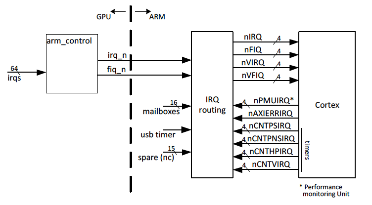

# ARM Quad A7 core

## 1. はじめに

本資料は、新製品（BCM2836）である2708プロジェクトへのQuad-A7コアの実装を
説明します。

## 2. システム概要

ARMアドレスマップは以下の表のように分割されています。

| アドレス | 装置 |
|:---------|:-----|
| 0x0000_0000 .. 0x3FFF_FFFF | GPU アクセス |
|   0x3E00_0000 .. 0x3FFF_FFFF |  GPUペリフェラルアクセス |
| 0x4000_0000 .. 0xFFFF_FFFF | ローカルペリフェラル |
|   0x4000_0000 .. 0x4001_FFFF |   ARMタイマー, IRQ, mailbox |
|   0x4002_0000 .. 0x4002_FFFF |   Debug ROM |
|   0x4003_0000 .. 0x4003_FFFF |   DAP |
|   0x4004_0000 .. 0xFFFF_FFFF | 未使用 |

## 3. ARM コントロール

ARMコントロールロジックは以下の機能を実行するモジュールです。

- 64ビットタイマーを提供
- 様々な割り込みをコアへ配信
- GPUの割り込みをコアへ配信
- プロセッサ間でのmailboxを提供
- 追加の割り込みタイマーを提供

### 3.1 64ビットタイマー

A7コアは64ビットのタイミング入力信号を必要とします。この信号は、
各プロセッサコアの内部タイマーの実装に使用されます。4つのコアに
送られる64ビットのタイマー信号は1つしかありません。したがって、
タイマーを変更すると、すべてのコアに影響が及ぶことになります。

#### 3.1.1 タイマークロック

このタイマーをどのくらいの速度で動作させるべきかについての情報は
ありませんでした。一般的には、プロセッサクロックで動作させるようです。
しかし、それではプロセッサの周波数が変動する場合、確実なタイミング信号を
得ることができません。したがって、タイマーのソースは、外部クリスタル
またはCPU関連のクロックのいずれかをつかうことになるでしょう。

タイマー速度に最大の柔軟性を持たせるために、32ビットのプリスケーラが
搭載されています。このプリスケーラは、整数と小数の分割比を提供できます。

    divider = 2^31 / prescaler_value

    (prescaler_value <= 2^31)

つまり、プリスケーラを0x8000_0000に設定すると、分周比は1になります。
プリスケーラに0を設定するとタイマーは停止します。

分周比を19.2にするには次のようにします。2^31/19.2 = 0x06AA_AAAB を使用します。
この値は上方に切り上げられ、8.9E-9の誤差が生じますが、これは通常の水晶発振器で
生じる値よりもはるかに小さいものです。

2^31(2147483648)を超えるタイマー値を使用しないでください。

設計を簡単にするために、タイマーはローカルペリフェラル(APB)クロックで
実行しています。このクロックはARMの半分の速度であるため、タイマーはARMの
クロック周波数を正確に表すことができません。最も近い数値を得るために
タイマーを2ずつ増分することができ、これによりARMクロック周波数に近い値を
得ることができます。タイマーの増分値を2に設定すると、すべて偶数または
すべて奇数の値しか得られないことに注意してください（書き込んだ初期値が
偶数か奇数かによって異なります）。

#### 3.1.2 64ビットタイマーのread/write

ARMのレジスタは32ビットですが、メインタイマーは64ビット幅で値が変化
します。LS（下位）とMS（上位）の32ビットを読み取る間にタイマーの値が
変化すると読み取った値が誤っている可能性があります。そのため、64ビットの
値に問題なくアクセスできるようにするための専用のロジックが用意されています。

64ビットのタイマー値を読み出す際、ユーザは常にLS-32ビットを先に読み出す
必要があります。LS-32ビットの読み出しと同時に、内部ではMS-32ビットが
timer-read-holdレジスタにコピーされます。タイマーのMS-32ビットを読み出す
と実際にはtimer-read-holdレジスタが読み出されます。

64ビットのタイマー値を書き込む際には、必ずLS-32ビットを先に書き込む必要が
あります。LS-32ビットはtimer-write-holdレジスタに格納されます。ユーザが
MS-32ビットを書き込むと保存されていたLS-ビットも同時に書き込まれます。

タイマー値（MS）が書き込まれると，timer-prescalerレジスタには0が設定されます。

### 3.2 割り込みのルーティング



**注**

- CNTVIRQ: Virtual timer interrupt
- CNTHPIRQ: Hyperviser physical timer interrupt (EL2)
- CNTPNSIRQ: Non-secure physical timer interrupt (EL1)
- CNTPSIRQ: Secure physical timer interrupt (EL1)

ルーティングするべき割り込みはたくさん存在します。割り込みルーティングロジックは
次の入力シグナルを持ちます。

- コア関連の割り込み
- コアに関連しない割り込み

#### 3.2.1 コア関連の割り込み

コア関連の割り込みは特定のコアに紐づく割り込みです。これらのほとんどは4つの
タイマー割り込みのようにコア自身により生成される割り込みです。さらに、各
コアには4つのメールボックスが割り当てられています。次がコア関連の割り込みです。

- 4つのタイマー割り込み（64ビットタイマー）
- 1つのパフォーマンスモニター割り込み
- 4つのメールボックス割り込み

これらの割り込みは、いずれか1つのコアのIRQピンまたはFIQピンに送る
（または全く送らない）ことしかできません。 次の表はその真理値表です。

| FIQ bit | IRQ bit | 送付先 |
|:-------:|:-------:|:------:|
| 0 | 0 | None （無効） |
| 0 | 1 | IRQ |
| 1 | 0 | FIQ |
| 1 | 1 | FIQ |

メールボックス割り込みには、個別の割り込み enable/disableビットはありません。
そのためにルーティングビットを使用する必要があります。残念ながら、これは
メールボックスの32ビットすべてを有効または無効にします。

リセット後は全てのビットが0になるので、すべての割り込みは無効になります。

#### 3.2.2 コアに関連しない割り込み

コアに関連しない割り込みとは、4つのコアのどれにも、また、そのコアの割り込み
にも高速割り込みにも送ることができる割り込みのことです。以下は、コアに関連
しない割り込みです。

- GPU IRQ (ARMコントロールロジックによって生成される)
- GPU FIQ (ARMコントロールロジックによって生成される)
- ローカルタイマー割込み
- AXIエラー
- （未使用：15のローカルペリフェラル割り込み）

これらの割り込みは、4つのコアのいずれかのIRQピンまたはFIQピンに送信する
ことを選択することができます。次の表に真理値表を示します。

| ルーティングコード | 送付先 |
|:--------:|:-----------------|
| 000 | IRQ Core 0 |
| 001 | IRQ Core 1 |
| 010 | IRQ Core 2 |
| 011 | IRQ Core 3 |
| 100 | FIQ Core 0 |
| 101 | FIQ Core 1 |
| 110 | FIQ Core 2 |
| 111 | FIQ Core 3 |

これらの割り込みには"disable"するコードはありません。それは割り込みの
生成元であるソースがenable/disableビットを持つことが想定されています。
リセット後はすべてのビットが0になるため、すべての割り込みはコア0のIRQに
送られます。

### 3.3 メールボックス

メールボックスは、32ビット幅のwrite-bits-high-to-setかつwrite-bits-high-to-clear
のレジスタです。write-setレジスタのアドレスは書き込み専用です。write-clear
レジスタのアドレスは読み取りも可能です。メールボックスは、非ゼロである限り、
割り込みを発生させます。

システムには、各コアに4つずつ、計16個のメールボックスがあります。このシステム
にはドアベルはありません。代わりにメールボックスをドアベルとして使用することが
できます。

メールボックス0～3はコア0専用、メールボックス4～7はコア1専用などとなって
います。各メールボックスには、3.2.1 コア関連の割り込みで説明したように、
2つの割り込みルーティングビットがあります。

各コアに割り当てられている4つのメールボックスには違いはありません。これらを
どのように使用するかは、プログラマに委ねられています。

## 4. レジスタ

| アドレス | レジスタ |
|:---------|:---------|
| 0x4000_0000 | Control register |
| 0x4000_0004 | （未使用） |
| 0x4000_0008 | Core timer prescaler |
| 0x4000_000C | GPU interrupts routing |
| 0x4000_0010 | Performance Monitor Interrupts routing-set |
| 0x4000_0014 | Performance Monitor Interrupts routing-clear |
| 0x4000_0018 | （未使用） |
| 0x4000_001C | Core timer access LS 32 bits |
| 0x4000_0020 | Core timer access MS 32 bits |
| 0x4000_0024 | Local Interrupt 0 [1-7] routing |
| 0x4000_0028 | Local Interrupts 8-15 routing |
| 0x4000_002C | Axi outstanding counters |
| 0x4000_0030 | Axi outstanding IRQ |
| 0x4000_0034 | Local timer control & status |
| 0x4000_0038 | Local timer write flags |
| 0x4000_003C | （未使用） |
| 0x4000_0040 | Core0 timers Interrupt control |
| 0x4000_0044 | Core1 timers Interrupt control |
| 0x4000_0048 | Core2 timers Interrupt control |
| 0x4000_004C | Core3 timers Interrupt control |
| 0x4000_0050 | Core0 Mailboxes Interrupt control |
| 0x4000_0054 | Core1 Mailboxes Interrupt control |
| 0x4000_0058 | Core2 Mailboxes Interrupt control |
| 0x4000_005C | Core3 Mailboxes Interrupt control |
| 0x4000_0060 | Core0 IRQ Source |
| 0x4000_0064 | Core1 IRQ Source |
| 0x4000_0068 | Core2 IRQ Source |
| 0x4000_006C | Core3 IRQ Source |
| 0x4000_0070 | Core0 FIQ Source |
| 0x4000_0074 | Core1 FIQ Source |
| 0x4000_0078 | Core2 FIQ Source |
| 0x4000_007C | Core3 FIQ Source |
| 0x4000_0080 | Core 0 Mailbox 0 write-set (WO) |
| 0x4000_0084 | Core 0 Mailbox 1 write-set (WO) |
| 0x4000_0088 | Core 0 Mailbox 2 write-set (WO) |
| 0x4000_008C | Core 0 Mailbox 3 write-set (WO) |
| 0x4000_0090 | Core 1 Mailbox 0 write-set (WO) |
| 0x4000_0094 | Core 1 Mailbox 1 write-set (WO) |
| 0x4000_0098 | Core 1 Mailbox 2 write-set (WO) |
| 0x4000_009C | Core 1 Mailbox 3 write-set (WO) |
| 0x4000_00A0 | Core 2 Mailbox 0 write-set (WO) |
| 0x4000_00A4 | Core 2 Mailbox 1 write-set (WO) |
| 0x4000_00A8 | Core 2 Mailbox 2 write-set (WO) |
| 0x4000_00AC | Core 2 Mailbox 3 write-set (WO) |
| 0x4000_00B0 | Core 3 Mailbox 0 write-set (WO) |
| 0x4000_00B4 | Core 3 Mailbox 1 write-set (WO) |
| 0x4000_00B8 | Core 3 Mailbox 2 write-set (WO) |
| 0x4000_00BC | Core 3 Mailbox 3 write-set (WO) |
| 0x4000_00C0 | Core 0 Mailbox 0 read & write-high-to-clear |
| 0x4000_00C4 | Core 0 Mailbox 1 read & write-high-to-clear |
| 0x4000_00C8 | Core 0 Mailbox 2 read & write-high-to-clear |
| 0x4000_00CC | Core 0 Mailbox 3 read & write-high-to-clear |
| 0x4000_00D0 | Core 1 Mailbox 0 read & write-high-to-clear |
| 0x4000_00D4 | Core 1 Mailbox 1 read & write-high-to-clear |
| 0x4000_00D8 | Core 1 Mailbox 2 read & write-high-to-clear |
| 0x4000_00DC | Core 1 Mailbox 3 read & write-high-to-clear |
| 0x4000_00E0 | Core 2 Mailbox 0 read & write-high-to-clear |
| 0x4000_00E4 | Core 2 Mailbox 1 read & write-high-to-clear |
| 0x4000_00E8 | Core 2 Mailbox 2 read & write-high-to-clear |
| 0x4000_00EC | Core 2 Mailbox 3 read & write-high-to-clear |
| 0x4000_00F0 | Core 3 Mailbox 0 read & write-high-to-clear |
| 0x4000_00F4 | Core 3 Mailbox 1 read & write-high-to-clear |
| 0x4000_00F8 | Core 3 Mailbox 2 read & write-high-to-clear |
| 0x4000_00FC | Core 3 Mailbox 3 read & write-high-to-clear |

### Write-Set / Write-clearレジスタ

アトミック操作を可能にするために、多くのレジスタはWrite-Setレジスタと
Write-clearレジスタに分けられています。

__Write-Set__ レジスタでは、追加のビットを __High__ にすることができます。
すでにHighレベルだったビットは影響を受けません。ビットをHighレベルに設定
するには、値 __'1'__ を書き込みます。

| 元のビット値 | Writeするビット値 | 結果のビット値 |
|:---:|:---:|:---:|
| 0 | 0 | 0 |
| 0 | 1 | 1 |
| 1 | 0 | 1 |
| 1 | 1 | 1 |

したがって、0x30840008のレジスタに
0xFC060014を書き込むと、0xFC86001Cとなります。

__Write-Set__ レジスタは、追加のビットを __Low__ に設定することができます。
すでにLowレベルであったビットは影響を受けません。ビットをLowに設定するには、
値 __'1'__ を書き込みます。 __'0'__ を書き込んでも元のレジスタの内容は変更
されません。__'1'__ を書いて __'0'__ を得ることに注意してください。

| 元のビット値 | Writeするビット値 | 結果のビット値 |
|:---:|:---:|:---:|
| 0 | 0 | 0 |
| 0 | 1 | 1 |
| 1 | 0 | 1 |
| 1 | 1 | 0 |

したがって、0x30840008のレジスタに0xFC060014を書き込むと、0x00800008になります。

このシステムは、割り込みのような非同期のイベントを扱うときに特に役立ちます。
割り込みのステータスビットはいつでも表示される可能性があります。そのため、
CPUが割り込み保留レジスタを読み込んで、ビット4がHighになっているとします。
次のクロックサイクルで割り込みが入り、追加でビット2がHighになったとしても
プロセッサはこのことを知りません。プロセッサは割り込みのビット4を処理します。
割り込みを解除するには、プロセッサは読み込んだ値を書き戻します。(これにより、
ビット4のみがクリアされ、処理されずに取りこぼした割り込みビットは保留された
ままになることが保証されます。

### 4.2 コントロールレジスタ

現在のところ、コントロールレジスタは64ビットコアタイマーの制御にしか使われて
いません。

- アドレス: 0x4000_0000
- リセット値: 0x0000_0000

| ビット | 説明 |
|:-------|:-----|
| 31-10  | 予約 |
| 9 | 1: 64ビットコアタイマーは2ずつ増分 <br> 0: 64ビットコアタイマーは1ずつ増分 |
| 8 | コアタイマークロックソース <br> 1: APBクロック <br> 0: クリスタルクロック |
| 7-0  | 予約 |

#### ビット8：コアタイマークロックソース

このビットは、64ビットCoreタイマーのソースクロックを制御します。実際には、コアタイマーの
プリスケーラのソースクロックを選択しますが、最終的な結果は同じです。

- セットした場合、64ビットコアタイマーのプリスケーラはAPBクロックで動作します。
- クリアした場合，64ビットコアタイマーのプリスケーラはクリスタルクロックで動作します。

なお，APBクロックはARMクロックの半分の速度で動作しています。したがって，プリスケーラは
CPUクロックの2番目のサイクルごとにしか変化しません。

#### ビット9：タイマー増分値

このビットは，64ビットコアタイマーのステップサイズを制御します。コアタイマーがCPUサイクル
数を正確に表すためには、このビットが重要になります。

コアタイマーのプリスケーラをAPBクロックで動作させた場合、APBクロックはARMクロックの
半分の速度で動作するため、プリスケーラを1分周に設定しても、ARMクロックのサイクル数に
等しいタイマー値を得ることはできません。このビットは、実際のCPUサイクル数に近づける
ための手段となります。

- セットした場合、64ビットコアタイマーは2だけ増加します。
- クリアした場合、64ビットコアタイマーは1ずつ増加します。

これでも正確なCPUサイクル数を得ることはできませんが、プラスマイナス1に近い値を得る
ことができます。コアタイマーの増分値を2に設定した場合、すべて偶数またはすべて奇数の
値しか得られないことに注意してください（書き込んだ初期値が偶数か奇数かによって
異なります）。

## 4.3 コアタイマーレジスタ

1つのコアタイマープリスケーラレジスタと2つのタイマーread/writeレジスタがあります。

次のレジスタはdeprecated

- ~~アドレス: 0x4000_0004~~
- ~~リセット値: 0x0000_0000~~

##### コアタイマープリスケーラレジスタ

- アドレス: 0x4000_0008
- リセット: 0x0000_0000

| ビット | 説明 |
|:-------|:-----|
| 31-0 | コアタイマースケーラ |

```
タイマー周波数 = (2^31 / プリスケーラ) * 入力周波数
```

詳細は3.1.1: タイマークロックを参照してください。

##### コアタイマー Read: LS-32ビット、Write: LS-32保存レジスタ

- アドレス: 0x4000_001C
- リセット: 0x0000_0000

| ビット | 説明 |
|:-------|:-----|
| 31-0 | 64ビットコアタイマー read/writeのLS 32ビット <br> 読み込みの場合、現在の64ビットタイマー値のLS32ビットが返され、MS32ビットが保存される <br> 書き込みの場合、書き込みの32ビットのコピーを保存する。このコピーはMS32ビットが書き込まれたらタイマーに送信される |

##### コアタイマー Read: MS-32ビット格納、Write: MS-32

- アドレス: 0x4000_0020
- リセット: 0x0000_0000

| ビット | 説明 |
|:-------|:-----|
| 31-0 | 64ビットコアタイマー read/writeのMS 32ビット <br> 読み込みの場合、コアタイマーread-holdレジスタの状態を返す。そのレジスタはユーザがLS32ビットを読み込んだ際にロードされる。まずLS-32ビットレジスタを読み込まずにこのレジスタを読み込んでもほとんど意味はない。 <br> 書き込みの場合、LS32write-holdレジスタに書き込まれた値と共にタイマーに送信される。まずLS-32ビットレジスタに書き込まずにこのレジスタを読み込んでもほとんど意味はない。 |

### 4.4 GPU割り込みルーティング

GPU割り込みルーティングレジスタはGPUのIRQとFIQを送信する場所を制御します。

- アドレス: 0x4000_000C
- リセット: 0x0000_0000

| ビット | 説明 |
|:-------|:-----|
| 31-4 | （予約） |
| 3:2 | GPU FIQルーティング <br> 00: GPU FIQはコア0のFIQ入力へ転送 <br> 01: GPU FIQはコア1のFIQ入力へ転送 <br> 10: GPU FIQはコア2のFIQ入力へ転送 <br> 11: GPU FIQはコア3のFIQ入力へ転送 |
| 1:0 | GPU IRQルーティング <br> 00: GPU IRQはコア0のIRQ入力へ転送 <br> 01: GPU IRQQはコア1のIRQ入力へ転送 <br> 10: GPU IRQはコア2のIRQ入力へ転送 <br> 11: GPU IRQはコア3のIRQ入力へ転送 |

IRQ /FIQは、1つのプロセッサコアにしか接続できません。これは、GPU-IRQ/GPU-FIQの割り込み
未処理ビットは1つしか存在しないことも意味します。

### 4.5 パフォーマンスモニタ割り込み

（省略）

### 4.6 コアタイマー割り込み

4つのコアタイマーコントロールレジスタと4つのコアタイマーステータスレジスタが
あります。これらのレジスタでは，IRQまたはFIQの割り込みを有効または無効に
することができます。保留中の割込みをクリアすることはできません。タイマーの
詳細については、Cortex-A7-coprocessorの説明をお読みください。

##### コアnの割り込みコントロールレジスタ

- アドレス: 0x4000_0040 : Core 0
- アドレス: 0x4000_0044 : Core 1
- アドレス: 0x4000_0048 : Core 2
- アドレス: 0x4000_004c : Core 3
- リセット: 0x0000_0000

| ビット | 説明 |
|:-------|:-----|
| 31-8  | 予約 |
| 7 | nCNTVIRQ FIQコントロール。セットするとIRQビット(3)を上書きする <br> 0: FIQ無効 <br> 1: FIQ有効 |
| 6 | nCNTHPIRQ FIQコントロール。セットするとIRQビット(2)を上書きする <br> 0: FIQ無効 <br> 1: FIQ有効 |
| 5 | nCNTPNSIRQ FIQコントロール。セットするとIRQビット(1)を上書きする <br> 0: FIQ無効 <br> 1: FIQ有効 |
| 4 | nCNTPSIRQ FIQコントロール。セットするとIRQビット(0)を上書きする <br> 0: FIQ無効 <br> 1: FIQ有効 |
| 3 | nCNTVIRQ IQコントロール。このビットはビット7がクリアの場合のみ使用される。それ以外は無視される。<br> 0: IRQ無効 <br> 1: IRQ有効 |
| 1 | nCNTPNSIRQ IQコントロール。このビットはビット5がクリアの場合のみ使用される。それ以外は無視される。<br> 0: IRQ無効 <br> 1: IRQ有効 |
| 0 | nCNTPSIRQ IQコントロール。このビットはビット4がクリアの場合のみ使用される。それ以外は無視される。<br> 0: IRQ無効 <br> 1: IRQ有効 |

### 4.7 メールボックス割り込み

（省略）

### 4.8 コアメールボックス

（省略）

### 4.9 AXI未処理

（省略）

### 4.10 コア割り込みソース

コアは多くの場所から割り込みや高速割り込みを得ることができます。割り込み処理を
高速化するために、割り込みソースレジスタはIRQ/FIQのソースビットを示します。
ここでも各プロセッサごとにレジスタがあります。

割り込みソースレジスターは4つあります。

##### コアnの割り込みソースレジスタ

- アドレス: 0x4000_0060 : Core 0
- アドレス: 0x4000_0064 : Core 1
- アドレス: 0x4000_0068 : Core 2
- アドレス: 0x4000_006c : Core 3
- リセット: 0x0000_0000

| ビット | 説明 |
|:-------|:-----|
| 31-18  | 未使用 |
| 17:12 | ペリフェラル 1..15 割り込み（現在、未使用） |
| 11 | ローカルタイマー割り込み |
| 10 | AXI-未処理(AXI-Outstanding)割り込み （コア０のみ）他のコアは0 |
| 9 | PMU割り込み |
| 8 | GPU割り込み（1つのコアのみ1となる） |
| 7 | メールボックス 3割り込み |
| 6 | メールボックス 2割り込み |
| 5 | メールボックス 1割り込み |
| 4 | メールボックス 0割り込み |
| 3 | CNTVIRQ割り込み |
| 2 | CNTHPIRQ割り込み |
| 1 | CNTPNSIRQ割り込み |
| 0 | CNTPSIRQ割り込み（物理タイマー -1 |

高速割り込みソースレジスターは4つあります。

#### コアnの高速割り込みソース

- アドレス: 0x4000_0070 : Core 0
- アドレス: 0x4000_0074 : Core 1
- アドレス: 0x4000_0078 : Core 2
- アドレス: 0x4000_007c : Core 3
- リセット: 0x0000_0000

| ビット | 説明 |
|:-------|:-----|
| 31-18  | 未使用 |
| 17:12 | ペリフェラル 1..15 割り込み（現在、未使用） |
| 11 | ローカルタイマー高速割り込み |
| 10 | 常に0 |
| 9 | PMU高速割り込み |
| 8 | GPU高速割り込み（1つのコアのみ1となる） |
| 7 | メールボックス 3高速割り込み |
| 6 | メールボックス 2高速割り込み |
| 5 | メールボックス 1高速割り込み |
| 4 | メールボックス 0高速割り込み |
| 3 | CNTVIRQ高速割り込み |
| 2 | CNTHPIRQ高速割り込み |
| 1 | CNTPNSIRQ高速割り込み |
| 0 | CNTPSIRQ高速割り込み（物理タイマー -1 |

### 4.11 ローカルタイマー

コードは割り込みを発生させることができるローカルタイマーを1つ持ちます。
ローカルタイマーは、常にクリスタルクロックからタイミングパルスを得ています。
クロックエッジごとに「タイミングパルス」を得ることができます。したがって、
19.2MHzの水晶は38.4Mパルス/秒を与えます。

ローカルタイマーには28ビットのプログラマブルな分周器があり、これにより
最低周波数は38.4*10^6/2^28=0.14Hzとなります。

ローカルタイマーはカウントダウンし、ゼロになると再ロードします。同時に、
割り込みフラグが設定されます。ユーザは、この割り込みフラグをクリアしなければ
なりません。次にローカルタイマーが再ロードされる際に、割り込みフラグがまだ
設定されているか否かは検出されません。

##### ローカルタイマーコントロール・状態レジスタ

- アドレス: 0x4000_0034
- リセット: 0x0000_0000

| ビット | 説明 |
|:-------|:-----|
| 31 | 割り込みフラグ（Read-Only） |
| 30 | 未使用 |
| 29 | 割り込みイネーブル（1 = 有効） |
| 28 | タイマーイネーブル（1 = 有効） |
| 0-27 | リロード値 |

無効の場合、ローカルタイマーは再ロード値をロードします。ビット32は
割り込みフラグの状態です。割り込みフラグは、リロード時に常に設定され、
割り込みイネーブルビットとは無関係です。割り込みフラグがセットされ、
割り込みイネーブルビットがセットされている間は、割り込みが発生します。

割り込みフラグは、ローカルタイマーIRQクリア＆リロードレジスタの31ビット目を
1にすることでクリアされます。

##### ローカルタイマーIRQクリア・リロードレジスタ（Write-Only）

- アドレス: 0x4000_0038
- リセット:

| ビット | 説明 |
|:-------|:-----|
| 31 | 1を書き込むと割り込みフラグクリア |
| 30 | 1を書き込むとローカルタイマーがリロード |
| 0-27 | 未使用 |

IRQクリア＆リロードレジスタには1ビット追加されており、ビット30に1を書き込むと
割り込みを発生させることなく、ローカルタイマーが直ちにリロードされます。そのため、
ウォッチドッグタイマーとしても使用できます。

ここでは、ローカルタイムが唯一のローカル割り込みソースであるため、ローカル
割り込みルーティングレジスタについて説明します。

##### ローカルタイマー割り込みルーティングレジスタ

- アドレス: 0x4000_0024
- リセット:

| ビット | 説明 |
|:-------|:-----|
| 31:3 | 未使用 |
| 0-2 | 000: ローカルタイマー割り込みはコア0 IRQへ配送 <br> 001: ローカルタイマー割り込みはコア1 IRQへ配送 <br> 010: ローカルタイマー割り込みはコア2 IRQへ配送 <br/> 011:ローカルタイマー割り込みはコア3 IRQへ配送 <br/> 100: ローカルタイマー割り込みはコア0 FIQへ配送 <br/> 101: ローカルタイマー割り込みはコア1 FIQへ配送 <br/> 110: ローカルタイマー割り込みはコア2 FIQへ配送 <br/> 111: ローカルタイマー割り込みはコア3 FIQへ配送 |
