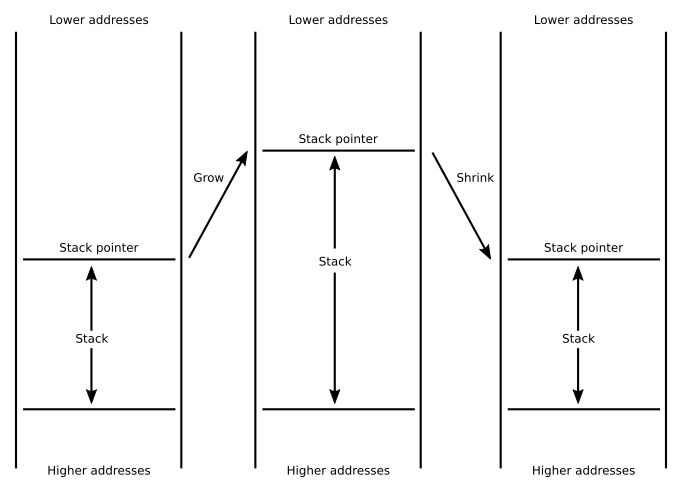
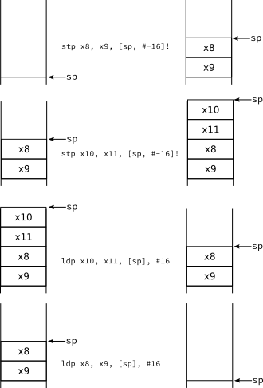

# [AArch64アセンブラ研究: 第8章](https://thinkingeek.com/2017/05/29/exploring-aarch64-assembler-chapter-8/)

前章では関数を呼び出す方法を見ました。スタックと呼ばれる特殊なメモリに
ついて触れましたが、それについて掘り下げることはしませんでした。この
章ではスタックをどのように使うか、そして、なぜ関数呼び出しにおいて
スタックが重要なのかを見ていきましょう。

## 関数の呼び出し

ある関数を呼び出すと、その関数は他の関数を呼び出すことができます。
呼び出された関数はまた別の関数を呼び出すことができます。これは
どこまでも続けることができます。これはある関数の実行を一時中断して
別の関数を実行するようなものです。ここで制約となるのは呼び出された
関数が終了したら常に呼び出した関数が実行を再開することです。つまり、
関数の呼び出しは常に逆順に戻ることです。その結果，ある時点でアクティブに
なっている関数呼び出しの数をスタックとして見ることができます（皿の
スタックのようなものものです）。

この性質は重要です。なぜなら、関数（例えばFとします）は一時的な
メモリを保持する必要がある場合があるからです。関数Fが別の関数Gを
呼び出し、Gから戻った際にこのメモリは保存されていて欲しいのです。
関数の活性化はスタック状のパターンに従っているので、関数が使用する
一時メモリもこのスキーマに従うのが自然であると思われます。この
スキーマは非常に一般的なので、ほとんどのアーキテクチャではこの種の
「関数の活性化に関連する一時メモリ」に特化した機構が提供されています。
このメモリがスタックと呼ばれるのは基本的にスタックの規律に従っている
からです。それは、スタックにある要素はその最初の要素の後に追加された
すべての要素が削除された時にしか削除することができないということです。

## スタックとコンベンション・コール

スタックメモリはスタックのように動作するので、気にすべきなものは
その先頭要素だけです。実際にはスタックが空になることはないからです。
スタックはメモリであり、メモリはアドレスでアクセスされるのでスタックの
先頭はアドレスです。このアドレスはスタックポインタ`sp`と呼ばれる特別な
レジスタに格納されます。`sp`の値を変更することでスタックの大きさが
変化します。スタックメモリ全体は、どこにも保持されず通常は規約として
決められるスタックベースからスタックポインタまでの範囲です。

スタックには2つの基本的な操作があります。成長と縮小です。成長は
スタックに新しい要素を追加する必要があるときに行われます。縮小は
そのような要素を削除するときに行われます。通常、関数は一時的なメモリを
確保するためにスタックを成長させ、関数から戻る前に同量の要素でスタックを
縮小させます。こうすることで関数呼び出しから戻ると呼び出し元の関数は
関数を呼び出す直前のスタックを持つようになります。

成長と縮小の操作が実際にどのように実装されているかについて今まで規定
してませんでした。アーキテクチャはスタックを高位アドレスに向かって
成長させる (そして低位アドレスに縮小する) か、スタックを低位アドレスに
向かって成長させる (それゆえ高位アドレスに縮小する) かを決めることが
できます。AArch64 は後者を選択していますのでスタックを成長させるには
`sp`の値を小さくし、縮小させるには`sp`の値を大きくします。



[AArch64の関数呼び出し規約](https://developer.arm.com/docs/ihi0055/latest/procedure-call-standard-for-the-arm-64-bit-architecture-aarch64)では
`sp`が取り得る値について追加の制約も 規定されています。詳細は省きますが、
`sp`を使うときは（成長・縮小だけの場合を除き）その値は16の倍数でなければ
なりません。つまり、`sp`のアドレスは常に16バイトにアラインされている
ことになります。

## スタックの操作

スタックに要素を追加する操作は一般にプッシュと呼ばれています。
プッシュは2つのことを行います。まず、要素のサイズと同じだけスタックを
成長させ、次にその要素をスタックの一番上に格納します。その逆の操作の
スタックから何かを取り除くことはポップと呼ばれます。この場合は、まず
一番上からロードして値を取得し、その後、削除された要素のサイズと同じだけ
スタックを縮小します。成長とはspからバイト数を引くことであり、縮小は
spにバイト数を足すことであることを思い出してください。値を取り出したく
ないこともあります。この場合は単にスタックを縮小するだけです。

プッシュとポップはsub/str命令とadd/ldr命令の組み合わせで実装することが
できます。それで動きますが、これらの操作は非常に頻繁に起こるのでそれぞれ
2つの命令の組み合わせは非効率的に思えます。幸いなことにアドレッシング
モードを巧みに使ってストアとロードを実行すると同時にスタックを成長させ
たり縮小させたりすることができます。

第5章を思い出すとプリインデキシングとポストインデキシングという2つの
アドレッシングモードがありました。これらのモードにはベースレジスタと
オフセットがあります。プリインデキシングモードでは計算されたアドレスは
ベースレジスタの値にオフセットを加算したものです。ポストインデキシング
モードでは計算されたアドレスはベースレジスタの値だけです。どちらの
モードもベースレジスタの値にオフセットを加算した値でベースレジスタを
更新します。これらのモードは連続したメモリにアクセスするときに便利であり、スタックメモリ要素は連続したメモリの一種です。

この知識により、今度はspをベースレジスタとするプリインデキシングモードの
ストアを使用してプッシュを実装することができます。これはうまく動きます。
ストアに使用するアドレスを新しいストレージとし、spを更新してこの新しい
メモリを指すようにしたいからです。たとえば、x8の値をスタックに保持する
ことができます。

```
// レジスタx8をスタックに保存
str x8, [sp, #-8]!      // *(sp - 8) ← x8
                        // sp ← sp - 8
```

x8は64ビットレジスタなのでオフセットが8であることに注意してください。
AArch64 では規約でスタックは下方向に成長させるのでオフセットは負です。

逆にポップはポストインデキシングモードで実装されます。たとえば、x8に
保存していた値を復元するには、次のようにします。

```
// レジスタx8を復元
ldr x8, [sp], #8        // x8 ← *sp
                        // sp ← sp + 8
```

この場合のオフセットはスタックを縮小するので正であることに注意して
ください。

さて、これはうまくいくと思うかもしれませんが、まだうまく行きません。
というのも、規約ではスタックは16の倍数にアラインさせることになって
いるからです。元々このような状態だったと仮定すると、ldr/strを1つ実行
するだけでこのプロパティはいとも簡単に壊れてしまいます。1つの方法は
add/sub命令を追加してスタックのアライメントを保つようにすることです。
もう1つの方法は64ビットレジスタをペアでプッシュ/ポップすることです。
各レジスタは8バイトなので2つで16バイトになるのは明らかです。ペアで
プッシュすればスタックは1つの命令でアライメントは保持されます。これを
行うためAArch64では`ldp`と`stp`という特別なロード/ストアペア命令を用意
しています。これらの命令は2つのレジスタと1つのアドレスモードを受け取り
ます。2つのレジスタはアドレッシングモードで計算されたアドレスの連続
した要素としてロード/ストアされます。

たとえば、次のような命令シーケンス

```
str x11, [sp, #-8]!         // *(sp - 8) ← x11
                            // sp ← sp - 8
str x8, [sp, #-8]!          //  *(sp - 8) ← x8
                            // sp ← sp - 8
```

は、次のように書き換えることができます。

```
stp x8, x11, [sp, #-16]!    // *(sp - 16) ← x8
                            // *(sp -16 + 8) ← x11
                            // sp ← sp - 16
```

ご覧のように、命令の最初のレジスタがスタックの一番上にあるものに
なります。2番目のレジスタはその後に連続して（スタックの底に向かって）
格納されます。対応する2つのレジスタのポップを実装するldpでも同様の
ことが起こります。

```
ldp x8, x11, [sp], #16      // x8 ← *sp
                            // x11 ← *(sp + 8)
                            // sp ← sp + 16
```

ldpとstpのレジスタの順番が同じであれば問題ありません。これはスタック
なので最初に置いた要素は最後に取り出さないといけないことに注意して
ください。つまり、例えばx8, x9, x10, x11を保持/復元したい場合、正しい
順序は次のようになります。

```
// push x8, x9
stp x8, x9, [sp, #16]!      // *(sp - 16) ← x8
                            // *(sp -16 + 8) ← x9
                            // sp ← sp - 16

// push x10, x11
stp x10, x11, [sp, #16]!    // *(sp - 16) ← x10
                            // *(sp -16 + 8) ← x11
                            // sp ← sp - 16
...
// pop x10, x11
ldp x10, x11, [sp], #16     // x10 ← *sp
                            // x11 ← *(sp + 8)
                            // sp ← sp + 16

// pop x8, x9
ldp x8, x9, [sp], #16       // x8 ← *sp
                            // x9 ← *(sp + 8)
                            // sp ← sp + 16
```



つまり、基本的に最初にプッシュしたものを最後にポップします。別の
言葉で言えば、ポップの順序はプッシュの順序の逆でなければなりません。

## フィボナッチ

再帰を説明する際の典型的な例は公式を直訳して計算するフィボナッチ数の
計算です。これはフィボナッチ数を計算する効率的な方法ではありませんが
（実際に必要になる場合は稀です）再帰を含む簡単な例になります。再帰を
何度も行うにはスタックが必要です（スタックを必要としない特殊な再帰
関数のサブセットを除いて）ので、フィボナッチの計算はスタックの操作方法を
示す良い例です。

数字`n`を聞いてn番目のフィボナッチ数を計算するプログラムを書きます。
まず、main関数を書きましょう。

```
.data

msg_input: .asciz "Please type a number: "
scanf_fmt: .asciz "%d"
msg_output: .asciz "Fibonacci number %d is %ld\n"

.text

.global main
main:
    stp x19, x30, [sp, #-16]!   // x19, x30(リンクレジスタ)を保存
    sub sp, sp, #16             // scamfで使用するローカル変数用の
                                // スタックを確保
    /*
      この時点のスタックは次のようになる
      Contents  Address
      | var |    [sp]       We will use the first 4 bytes for scanf
      |     |    [sp, #8]
      | x19 |    [sp, #16]
      | x30 |    [sp, #24]
    */

    // printf("Please type a number: ");
    ldr x0, addr_msg_input      // x0 ← &msg_input  [64-bit]
    bl printf                   // call printf

    // scanf("%d", &var);
    mov x1, sp                  // x1 ← sp
                                // spが指し示す最初の4バイトは'var'
    ldr x0, addr_scanf_fmt      // x0 ← &scanf_fmt  [64-bit]
    bl scanf                    // call scanf

    // res = fibonacci(var);
    ldr w0, [sp]                // w0 ← *sp   [32-bit]
                                // これはスタックにあるvar
    bl fibonacci                // call fibonacci

    // printf("Fibonacci number %d is %ld\n", var, res);
    mov x2, x0                  // x2 ← x0
                                // これはfibonacci()の結果の'ret'
    ldr w1, [sp]                // w1 ← *sp   [32-bit]
    ldr x0, addr_msg_output     // x0 ← &msg_output [64-bit]
    bl printf                   // call printf

    add sp, sp, #16             // スタックを縮小
    ldp x19, x30, [sp], #16     // x19, x30を復元
    mov w0, #0                  // w0 ← 0
    ret                         // 関数終了

addr_msg_input: .dword msg_input
addr_msg_output: .dword msg_output
addr_scanf_fmt: .dword scanf_fmt
```

```
fibonacci:
    // fibonacci(n) -> result
    //   n は32ビットでw0で渡される
    //   result は64ビットでx0で返す
    stp x19, x30, [sp, #-16]!   // x19, x20を保存
    stp x20, x21, [sp, #-16]!   // x20, x21を保存
    /*
      この時点のスタックは次のようになる
      Contents  Address
      | x20 |    [sp]
      | x21 |    [sp, #8]
      | x19 |    [sp, #16]
      | x30 |    [sp, #24]
    */

    cmp w0, #1                  // w0と1を比較してフラグを更新
    ble simple_case             // if w0 <= 0 ならsimple_caseに分岐
                                // (そうでなければrecursive_caseに続く)

    recursive_case:             // recursive case (このラベルは使用しない。
                                // わかりやすさのために追加)
        mov w19, w0             // w19 ← w0
        // fibonacci(n-1);
        sub w0, w0, 1           // w0 ← w0 - 1
        bl fibonacci            // call fibonacci
        mov x20, x0             // x20 ← x0

        sub w0, w10, #2         // w0 ← w19 - 2
        bl fibonacci            // call fibonacci
        mov x21, x0             // x20 ← x0

        add x0, x20, x21        // x0 ← x20 + x21
        b end                   // endに（無条件）分岐

    simple_case:
        sxtw x0, w0             // x0 ← ExtendSigned32To64(w0)

    end:
        ldp x20, x21, [sp], #16 // x20, x21を復元
        lop x19, x30, [sp], #16 // x19, x30を復元
    ret
```
