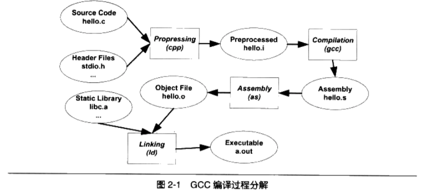

## Lab 0 ツールチェーン（開発環境の構築）

[toc]

### 0.1 実習内容の紹介

#### 0.1.1 実習の目的

  この実習は、主に、今後の実習のための開発環境を構築し、対応するツールに精通することを
  目的としています。

#### 0.1.2 開発環境

​		教育用オペレーティングシステムのカーネルを開発するために必要な環境は以下の通りです。

- UnixライクなOS（Ubuntu，Arch Linux 等）
- GCC
- GNU Make
- バージョン管理システム Git
- エミュレータ QEMU
- デバッグツール GDB

### 0.2 クロスコンパイルツールチェーン

  コンパイルとは、一連の手順を通じてコードを実行可能なファイルに変換するプロセスを
  指します。各ステップには、前ステップの出力を処理の入力として受け取るツールが
  あります。これらのツールであるコンパイラ（Compiler）、アセンブラ（Assembler）、
  リンカ（Linker）をまとめてコンパイルツールチェーンと呼びます。

															Fig.1[^程序员的自我修养]

  コンパイルプロセスには、前処理、コンパイル、アセンブリ、リンクが含まれます。

  クロスコンパイル[^Cross-Compile]とは、アーキテクチャの異なる別のプラット
  フォームでプログラムを実行できるようにコンパイルすることをいいます。クロス
  コンパイルツールチェーンはこのために使用されるツールです。この実習に即して
  いえば、X86ベースのPCプラットフォームでARMベースのCPUで実行できるオペレー
  ティングシステムカーネルをコンパイルすることを意味します。

  開発環境としては、Ubuntu、Arch Linux、WSLなどのプラットフォームを勧めます
  （以下のチュートリアルではUbuntu 18.04-LTS環境を使用しています。次の手順で
  クロスコンパイルツールチェーンをダウンロードできます。

```shell
sudo apt install gcc-aarch64-linux-gnu
```

  次の手順でインストールがうまく行ったかテストできます。

```shell
aarch64-linux-gnu-gcc -v
```

  次のように表示されるはずです。ここで、Targetはターゲットのプラットフォーム
  （ARMv8アーキテクチャのLinuxプラットフォーム）を示します。

```shell
COLLECT_GCC=aarch64-linux-gnu-gcc
COLLECT_LTO_WRAPPER=/usr/lib/gcc-cross/aarch64-linux-gnu/7/lto-wrapper
Target: aarch64-linux-gnu
Configured with: ...
Thread model: posix
gcc version 7.5.0 (Ubuntu/Linaro 7.5.0-3ubuntu1~18.04)
```

  自分で完全なツールチェーンを構築することに興味がある学生は、上記のリンクを
  参照して、自分の習慣に合ったツールチェーンを作成することができます。

### 0.3 QEMUエミュレータ

  私たちのプロジェクトではRaspberry Pi-3Bで実行する予定ですが、ボード上で
  起動する前に、実際のハードウェア環境をシミュレートするシミュレータによって
  カーネルのデバッグを支援することができます。これにより、ボード上で実行する
  際のエラー状況を効果的に軽減することができます。QEMUは、広く使用されている
  オープンソースのコンピュータエミュレータおよび仮想マシン[^QEMU]であり、
  あるアーキテクチャ（X86 PCなど）で別のアーキテクチャ（ARMなど）のオペレー
  ティングシステムやプログラムを実行できます。QEMUは、次の手順で直接インストール
  できます。

```shell
sudo apt install qemu qemu-system-arm qemu-efi-aarch64 qemu-utils
```

  インストールが完了したら、インストールしたバージョンでraspi3 socがサポートされて
  いることを次のコマンドで確認できます。サポートされていない場合は、**0.7 pwndbg**
  セクションを参照してqemuを自分でコンパイルしてください。

```shell
qemu-system-aarch64 -M help
```

### 0.4 GDB

  システム付属のgdbはクロスプラットフォームデバッグをサポートしていないので
  複数のアーキテクチャをサポートするバージョンのGDBをインストールする必要が
  あります。

```shell
sudo apt install -y build-essential gdb gdb-multiarch
```

### 0.5 Git

  gitに精通している場合は、このセクションをスキップできます。

  プロジェクト全体の開発とメンテナンスにはGitによるバージョン管理を使用する
  ことを勧めます。まず、Gitツ​​ールをインストールする必要があります。

```shell
sudo apt install git
```

  今後のラボを実行するには、このプロジェクトのクローンを作成する必要があります。

```shell
git clone https://github.com/FDUCSLG/OS-Autumn20-Fudan.git
```

  プロジェクトディレクトリに入った後、ブランチlab0に切り替えて現在のドキュメントを
  ローカルで表示します。

  Gitによるバージョン管理に関心のある学生は、Gitユーザーマニュアル[^Git-manual]を
  参照してください。

### 0.6 GNU Make

  Makeは、対応するファイルを自動的に見つけて、プロジェクトファイルによって指定
  された依存関係に従ってコンパイルします[^Make 的意义]。したがって、
  各プロジェクトには、依存を示す`Makefile`ファイルが必要です。Makefileのルールは
  次のとおりです。

```makefile
target ...: prerequisites ...
	recipe
 	...
 	...
```

- target

  これには、オブジェクトファイルや実行可能ファイル、*clean*などのラベルを指定
  することができます。

- prerequisites

  targetが依存するファイルやターゲットを指定します。

- recipe

  このターゲットによって実行されるコマンド（任意のシェルコマンド）です。

  Makeに興味のある学生は、チュートリアル[^Makefile-tutorial]を参照してください。

### 0.7 pwndbg(optional)

  gdbだけでは、デバッグの際に見ずらい（不便）な場合があります。pwndbgの
  インストールを勧めます。

```shell
git clone https://github.com/pwndbg/pwndbg
cd pwndbg
./setup.sh
```

  pwndbgをインストールすると、通常のGDBとしても使用することができますが、
  クロスコンパイラ `aarch64-linux-gdb`は、さまざまなエラーを報告します。
  *pwndbgビット*はほとんどのコードを知っているので私に多くの援助を与えて
  くれました[^Zhihu]。なお、pwndbgが使用するpipのバージョン情報に注意する
  必要があります。

  pwndbgはQEMUバージョン4.2.0では使用できないため、次の手順でQEMU 5.1.0の
  ソースコードを取得してコンパイルする必要があります（インストール後に
  `qemu-system-aarch64 -version`を実行してバージョンが5.1.0であることを
  確認してください）。

```shell
wget https://download.qemu.org/qemu-5.1.0.tar.xz
tar xvJf qemu-5.1.0.tar.xz
cd qemu-5.1.0
sudo apt-get build-dep qemu # QEMUの開発ライブラリをインストール

mkdir -p configs
cd configs/
./../configure --target-list=aarch64-softmmu --enable-debug # target-listは
makeで生成されるobjの配置場所を指定します（configs配下）
make ARCH=aarch64 CROSS_COMPILE=aarch64-linux-gnu- -j6
```

  QEMUバージョンを5.1.0にアップグレードした後もpwndbgを使用できない場合は、
  次の手順でgdbを最新バージョンに更新する必要があります。

```shell
wget http://ftp.gnu.org/gnu/gdb/gdb-9.2.tar.gz
tar -xvf gdb-9.2.tar.gz
cd gdb-9.2
mkdir build
cd build/
./../configure --target=aarch64-linux --prefix=/home/sunflower/Downloads/aarch64-linux-gdb # targetにはアーキテクチャ情報を指定し、prefixにはmakeコマンドで
生成されるobjの配置場所を指定します
make -j6
make install
```

### 0.8 練習問題

#### 0.8.1 Git Exercise

  現在OS-2020Fall-Fudanのlab0ディレクトリにいることを確認してください。
  次の操作を順番に実行してください。

- `git checkout -b dev`: ブランチ`dev`を作成して、カレントブランチを`dev`に切り替えます。
- `git branch -v`:  すべてのブランチの情報を表示します。また、カレントブランチを示します。
- `README.md`をさくせいして、自分お名前と学生番号を記入してください。
- `git status`: 変更が保存済みであるか確認します。
- `git add` と `git commit`: 変更を保存します。
- `git checkout lab0`: `lab0`ブランチに切り替え、`git rebase dev`を実行します。`dev`がマージされ、conflictsが発生する場合があります。
- `git log`: カレントブランチのログを見ることができます。

以下のgitコマンドの意味を明確に理解していることを確認してください。

- git branch
- git checkout
- git add
- git commit
- git merge
- git rebase
- git push
- git pull
- git clone
- git log
- git status

#### 0.8.2 Makefileの練習問題

​		`simple/Makefile`中のmake命令の依存関係を書き出してください。

### 0.9 参考文献

[^程序员的自我修养]:https://book.douban.com/subject/3652388/
[^Cross-Compile]:https://blog.csdn.net/hailin0716/article/details/17578767
[^QEMU]:https://wiki.archlinux.org/index.php/QEMU_(%E7%AE%80%E4%BD%93%E4%B8%AD%E6%96%87)
[^Git-manual]:https://mirrors.edge.kernel.org/pub/software/scm/git/docs/user-manual.html
[^Make 的意义]:https://blog.csdn.net/YEYUANGEN/article/details/36898505
[^Makefile-tutorial]:https://seisman.github.io/how-to-write-makefile/
[^Zhihu]:https://zhuanlan.zhihu.com/p/129837931

## 実行結果

```
$ cd simple
$ make
aarch64-linux-gnu-gcc -Wall -nostdlib -g -c -o hello.o hello.c
aarch64-linux-gnu-as -o startup.o startup.s
aarch64-linux-gnu-ld hello.o startup.o -T link.ld -o hello.elf
aarch64-linux-gnu-objcopy -O binary hello.elf hello.img

$ ls
hello.c  hello.elf  hello.img  hello.o  link.ld  Makefile  startup.o  startup.s

$ make run
qemu-system-aarch64 -M raspi3 -kernel hello.img -nographic
Hello world
```
