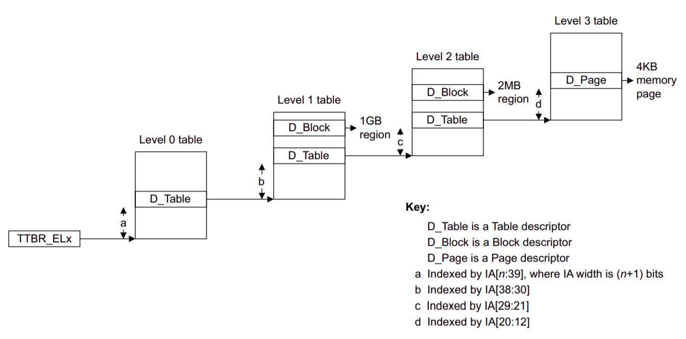

## Lab2 メモリ管理

[toc]

### 2.1 実習内容の紹介

#### 2.1.1 実習目標

カーネルは4つの主要なタスク、すなわち、メモリ管理、プロセススケジューリング、
デバイスドライバ、システムコールを担当します[^RedHat]。これらすべてを学期中に
行うオペレーティングシステムのカーネル実習で取り上げます。 今回は、教育用OS
カーネルのメモリ管理システムを実装します。メモリ管理システムは次の2つの部分に
分かれています。

- カーネルの物理メモリアロケータ。物理メモリの割り当てと再利用に使用されます。
- カーネルのページテーブル。仮想アドレスと物理アドレスのマッピングに使用されます。

#### 2.1.2 Git

今後のラボでは、ガイダンスとしてコードの一部が提供されるだけであり、ドキュメントに
したがい自分で教育用OSのカーネルを実装する必要があります。新しいラボをリリースする
たびに新しいブランチが開設されます。以下のような（強制ではない）新しいラボの取得
プロセスが今後の実習で頻繁に発生します。ここでは、現在いるブランチが`dev`であり、
lab1が実習が完了したブランチであると仮定しています。

```sh
git pull # githuｂから更新データを取得する
git checkout -b dev-lab2 # devから新規ブランチのdev-lab2に切り替える
git rebase origin/lab2 # lab2の更新をdev-lab2に適用する
# 以下、lab2-devブランチで作業する
git add files  #（あなたが更新した）
git commit -m "balabala"
git checkout dev # 新規コミット後に、devに切り替える
git rebase lab2-dev # dev-lab2の更新内容をdevに適用する
```

#### 2.1.3 参考文献

カーネルはハードウェアとのやり取りを大量に行うので、ARMアーキテクチャの
ドキュメントを参照して、関連するハードウェアの構成を理解する必要があります。
ARMアーキテクチャのドキュメントのどの部分を参照するかは、Stanfordのドキュメント
[^Stanford]を参考に、各実習のドキュメントの中で示します。

- `ref: C5.2` [ARMv8 Reference Manual](https://cs140e.sergio.bz/docs/ARMv8-Reference-Manual.pdf)のC5.2に該当箇所が記載されています。
- `A53: 4.3.30` [ARM Cortex-A53 Manual](https://cs140e.sergio.bz/docs/ARM-Cortex-A53-Manual.pdf)の4.3.30に該当箇所が記載されています。
- `guide: 10.1` 指示相关部分在 [ARMv8-A Programmer Guide](https://cs140e.sergio.bz/docs/ARMv8-A-Programmer-Guide.pdf)の10.1該当箇所が記載されています。

### 2.2 物理メモリ管理

物理メモリとはDRAMストレージユニットのことです。物理メモリの各バイトには
物理アドレスと呼ばれるアドレスが振られています。仮想メモリは、プログラム
（ユーザプロセス、カーネル）から見たストレージ空間であす。この実習では、
カーネルがユーザプロセスのページテーブルやスタックなどの領域を確保するために
物理メモリアロケータを実装する必要があります。

カーネルは、物理メモリ内のカーネルコード以降（からPHYSTOPの前まで）の物理
メモリを割り当てに使用し、空き物理メモリをリンクリストで管理します。
割り当てとは、リンクリストから物理ページを取り出し、対応する物理ページを
リンクリスト内で再利用することです。

物理メモリアロケータは、リンクリストのヘッダである`free_list`（kern/kalloc.c:20）
を通じてすべての空き物理メモリを管理しており、リンクリストの各ノードは、
未使用の1ページを表す`struct run`（kern/kalloc.c:15）となっています。
では、`struct run`はどこで定義されているのか。

カーネルコードに入ると、カーネルは`alloc_init`によって利用可能なすべての
物理メモリを確保します。`end`はリンカスクリプト`kern/linker.ld`で定義されており、
カーネルコードの終了を表します。`free_range`は`ROUNDUP`（kern/kalloc.c:48）に
よって所定の空きメモリを確保します。 `kfree`は、指定されたページの内容を
すべて1に設定します。これはデバッグのためであり、フリーメモリへのアクセスが
元のコンテンツを取得しないようにしています。

### 2.3 仮想メモリ

仮想メモリとページテーブルの管理（ページ粒度、仮想アドレスのサイズなど）は、
命令セットアーキテクチャと密接に関係しており、実習に使用しているARMアーキ
テクチャでは、64KB（16ビット）、16KB（14ビット）、4KB（12ビット）の3種類の
ページ粒度が利用でき、今回のカーネル実習では、4KBのページサイズを使用します。
ページテーブルを介して48ビットのインデックスを内包する仮想アドレスを物理
アドレスに変換します。そのプロセスを以下の図に示します。



<center>図 2.1</center>

64ビットの仮想アドレスを取得した際、

- 高位16ビットがすべて0の場合、CPUはレベル0のページテーブルを`ttbr0_el1`から
  読み込みます
- 高位16ビットがすべて1の場合、CPUはレベル0のページテーブルを`ttbr0_el1から
  読み込みます
- どちらでもない場合は、エラーを発生します

レベル0のページテーブルを取得した後、va[47:39]は、次のレベルのページテーブル情報
（ページテーブルアドレス、アクセス権）を取得するためのインデックスとして使用され
ます。その後のページテーブル変換プロセスは図2.1のようになります。

ページテーブルエントリの低位12ビットは、権限制御に使用されます。
レベル1およびレベル2では、entry[1]を使用して現在のエントリの属性を示すことが
できます（0の場合はブロック、1の場合はテーブル）**(ref:D4.3.1)**。レベル3では、
entry[1]は1のみで現在のエントリに物理アドレスが含まれていることを示します
**(ref:D4.3.2)**。entry[0]は現在のエントリが未使用であるか否かを示すために
使用されます（物理アドレスのマッピングに使用できます）**(ref:D4.3.2)**。
entry[7:6]は権限管理に使用されます **(ref:D4.4.4)**。

`map_region`関数は、`pgdir`に対応するページテーブル上に`va`から`pa`へのマップを
作成するために使用されます。ここで`size`は物理メモリセグメントのサイズ、`perm`は
そのセグメントのパーミッションを意味します。`vm_free`は、`pgdir`の物理ページを
再利用します。

### 2.4 練習問題

#### 2.4.1 物理メモリアロケータ

物理メモリアロケータのアロケータ関数`kalloc`と開放関数`kfree`を完成させてください。

#### 2.4.2 ページテーブル管理

物理アドレスのマッピング関数`map_region`と物理空間のページテーブル再利用関数
`vm_free`を完成させてください。

### 2.5 参考文献

[^RedHat]:https://www.redhat.com/en/topics/linux/what-is-the-linux-kernel
[^Stanford]:https://cs140e.sergio.bz/assignments/3-spawn/

## 実行結果

```
$ make
+ cc kern/vm.c
In file included from kern/vm.c:10:
inc/types.h:37: warning: "offsetof" redefined
   37 | #define offsetof(type, member)  ((size_t) (&((type*)0)->member))
      |
In file included from inc/string.h:5,
                 from kern/vm.c:9:
/usr/lib/gcc-cross/aarch64-linux-gnu/9/include/stddef.h:406: note: this is the location of the previous definition
  406 | #define offsetof(TYPE, MEMBER) __builtin_offsetof (TYPE, MEMBER)
      |
+ cc kern/console.c
+ cc kern/kalloc.c
In file included from kern/kalloc.c:9:
inc/types.h:37: warning: "offsetof" redefined
   37 | #define offsetof(type, member)  ((size_t) (&((type*)0)->member))
      |
In file included from inc/string.h:5,
                 from kern/kalloc.c:8:
/usr/lib/gcc-cross/aarch64-linux-gnu/9/include/stddef.h:406: note: this is the location of the previous definition
  406 | #define offsetof(TYPE, MEMBER) __builtin_offsetof (TYPE, MEMBER)
      |
+ cc kern/uart.c
+ as kern/entry.S
+ cc kern/kpgdir.c
+ cc kern/main.c
+ ld obj/kernel8.elf
+ objdump obj/kernel8.elf
+ objcopy obj/kernel8.img

$ make qemu
qemu-system-aarch64 -M raspi3 -nographic -serial null -serial mon:stdio -kernel obj/kernel8.img
Allocator: Init success.
check_map_region: passed!
check_vm_free: passed!
check_free_list: passed!
```
