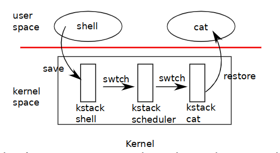

## Lab5 プロセス管理

[toc]

### 5.1 実験内容の紹介

#### 5.1.1 実験の目的

今回の実験では、教務用OSカーネルのプロセス管理部分を次のように分割して
実装する必要があります。

- カーネルのプロセス管理モジュール。プロセスの生成、スケジューリング（実行）
  を行います。
- カーネルの（簡易）システムコールモジュール。ユーザプロセスからの要求に
  応じてシステムコールを行います。

最終的な実装では`user/initcode.S`を最初のユーザプロセスとしてディスパッチし、
その実行中にシステムコールに応答します。実験ではシングルプロセッサモードに
切り替えて、シングルプロセッサですべての機能が動作することを確認してから、
マルチプロセッサモードに切り替えて、並行性の問題と他の機能の問題を分離する
ことを勧めます。

#### 5.1.2 Git

まず、今回の実習のために追加されたコードを、自分の開発ブランチに 取り込みます。次のように、pullした後,rebase/mergeしてください。

```bash
git pull
git rebase origin/lab5
# Or git merge origin/lab5
```

conflictが発生した場合は、gitの指示に従って修正してください。

#### 5.1.3 xv6マニュアル

この実験はxv6のマニュアルに記載されています。

- Chap1: コードから見たオペレーティングシステムの構成: 最初のプロセスの
  作成からChap1の終了まで
- Chap2: スケジューリングセクション

### 5.2 プロセス管理

xv6ではプロセスの概念は`inc/proc.h`で定義されています（この実験で注目
するのは以下の部分だけです）。プロセスはそれぞれカーネルスタック、ページ
テーブル（対応するアドレス空間を持つ）、コンテキスト情報を持っています。

```c++
struct proc {
    uint64_t sz;             /* プロセスメモリのサイズ（バイト単位）    */
    uint64_t *pgdir;         /* ページテーブル                          */
    char *kstack;            /* このプロセス用のカーネルスタックの底    */
    enum procstate state;    /* プロセスの状態                          */
    int pid;                 /* プロセスID                              */
    struct proc *parent;     /* 親プロセス                              */
    struct trapframe *tf;    /* カレントシステムコール用のTrapframe     */
    struct context *context; /* プロセスを実行する際、ここにswtch()     */
};
```

#### 5.2.1 質問1

proc（PCBなど）には、プロセスのtrapframeとcontext pointerしか格納されて
いませんが、trapframeとcontextのインスタンスはどこに存在するのか、また、
なぜこのような設計になっているのかを説明してください。（ヒント:
`struct context context`と`struct trapframe tf`がprocに格納されていれば、
トラップとコンテキストスイッチを実装することができます。）

#### 5.2.2 コンテキストスイッチ

コンテキストスイッチは、オペレーティングシステムのマルチタスク/マルチ
プログラミングの重要な部分であり、あるプロセスから別のプロセスへの切り替えを
実現します。このとき、スイッチはCPUで実行されている現在のプロセスを正確に
記述できる必要があります。コンテキスト情報には、一般的なレジスタ値、ランタイム
スタック（各プロセスのカーネルスタック）、PC（lr/x30レジスタ）が含まれます。




ユーザプロセスがCPUを放棄するとプロセスのカーネルスレッドは、`kern/swtch.S`の
`swtch`を呼び出して、カレントプロセスのコンテキスト情報を保存し、カーネル
スケジューラのコンテキストに切り替えます。それぞれのコンテキストは
`struct proc`の`struct context`によって記述されます。`inc/proc.h`の`struct context`の定義と`kern/swtch.S`のcontext switchの実装を完成させてください。

#### 5.2.3 質問2

`kern/proc.c`における`swtch`の宣言は`void swtch(struct context **, struct context *)`ですが、この設計となっている理由を説明してください（ヒント:
`void swtch(struct context *)`と宣言した場合の問題は何か）。`context`には
calle-saved registersだけが格納される必要がありますが、PCSの文脈でその理由を
説明してください。これとは対象的に、trapframeではなぜ多くの情報を格納する
必要があるのか説明してください。 trapframeには**すでに**コンテキストの内容が
含まれているようですが、コンテキストの切り換え時にトラップしてから切り替える
必要があるのはなぜですか。

>  ArmアーキテクチャのProcedure Call Standard（PCS)は以下を規定しています。
>
> - 関数に引数を渡す場合、どのレジスタを使用するか。
> - 呼び出しを行った関数（callerと呼ばれます）に値を返す場合、どのレジスタを使用するか。
> - 呼び出された関数（calleeと呼ばれます）が破壊する可能性があるレジスタはどれか。
> - calleeが破壊することのないレジスタはどれか。

PCSは、関数呼び出し時の汎用レジスタの使用に関するARMアーキテクチャの仕様で
あり、私たちがアセンブリを手書きしたり、コンパイラなどの他のオープンソース
ツールの助けを借りてアセンブリ命令を生成したりする際には、コードが全体的に
正しく効率的であることを保証するために、この仕様に従うようにしなければ
なりません[^PCS]。

#### 5.2.4 プロセスの作成とスケジューリング

`kern/proc.c`にあるコードのコメントに従って、最初のユーザプロセスである
`user/initcode.S`のスケジューリングをサポートするカーネルプロセス管理
モジュールを完成させてください。カーネルにはまだファイルシステムがないので、
Makefileファイルを修正して`initcode.S`をカーネルにリンクします。 プロセスは
以下の通りです。まず、`initcode.S`をコンパイルすると`obj/user`配下にバイナリ
ファイルとして変換され、その後、`kern`ディレクトリ配下のコンパイル済みカーネル
コードを含むカーネル実行ファイルにリンクされます。`obj/kernel8.hdr`のシンボル
テーブルには、`_binary_obj_user_initcode_size`、
`_binary_obj_user_initcode_start`、`_binary_obj_user_initcode_end`の3つの
シンボルがあり、`initcode`の位置をカーネルに知らせることができます。

`kern/proc`の機能は、以下の順序で実装できます。

- proc_init ptableロックを初期化します。
- user_init 最初のユーザプロセス`user/initcode`を初期化します。
  - proc_alloc プロセスを作成します。
  - pgdir_init プロセスのページテーブルを作成します。
  - uvm_init プロセスのページテーブルを初期化します。
- scheduler カーネルがスケジューリングを開始します。
  - uvm_switch ユーザプロセスのページテーブルを切り替えます (ttbr0_el1)。
  - swtch カーネルのスケジューラからユーザプロセスへ切り替えます。
  - forkret 以後の初期化のためのアドレスを指定して復帰します。

### 5.3 システムコール

現在、カーネルは基本的な例外処理をサポートしていますが、今回の実験では
カーネルのシステムコールモジュールをさらに改良する必要があります。 ユーザ
プロセスは、システムコールを使用してOSカーネルにサービスを要求し、より高い
権限を必要とするタスクを実行します。 armv8では、ユーザプロセスが`svc`命令で
システムコールを要求すると、カーネルは`ESR_EL1`の`EC[31:26]`に基づいて
適切なハンドラを割り当てて処理を行います[^ESR_EL1]。

システムコールを要求する際、ユーザプロセスは、対応するシステムコール番号と
システムコールに必要なパラメータをカーネルに通知する必要があります。システム
コール番号は`inc/syscallno.h`でマクロ定義されています。

以上のプロセスは次の順に参照することができます。

- システムコールが`alltraps`で捕捉されると`kern/trap.c`の`trap`関数が
  呼び出され、そこから`syscall`が呼び出されます。
- 在 `kern/syscall.c`にある`syscall`関数はシステムコール番号に対応する
  ハンドラを呼び出します。
- `sys_exec`は`kern/sysfile.c`で、`sys_exit`は`kern/sysproc.c`で定義されています。
- カーネルスレッドにsys_yieldオペレーションを追加し、ユーザプロセスが現在の
  タイムスライスを使い果たした時に、カーネルスレッドがユーザプロセスにCPU
  使用を放棄させられるようにしました。

すべてのモジュールが正常に実装されると、`make qemu`を実行すると、シングル
プロセッサモードでは次のように表示されます。

```shell
main: [CPU0] is init kernel
main: Allocator: Init success.
irq_init: - irq init
main: [CPU0] Init success.
sys_exec: executing /init with parameters: /init
sys_exit: in exit
```

マルチプロセッサモードでは、次のように表示されます。

```shell
qemu-system-aarch64 -M raspi3 -nographic -serial null -serial mon:stdio -kernel obj/kernel8.img
main: [CPU1] is init kernel
main: Allocator: Init success.
irq_init: - irq init
main: [CPU1] Init success.
main: [CPU2] Init success.
main: [CPU3] Init success.
main: [CPU0] Init success.
sys_exec: executing /init with parameters: /init
sys_exit: in exit
```

### 5.4 参考文献

[^PCS]:https://developer.arm.com/architectures/learn-the-architecture/aarch64-instruction-set-architecture/procedure-call-standard
[^ESR_EL1]:https://developer.arm.com/docs/ddi0595/h/aarch64-system-registers/esr_el1

## 実行結果

```
$ make
+ cc kern/vm.c
+ cc kern/trap.c
+ cc kern/spinlock.c
+ as kern/swtch.S
+ cc kern/console.c
+ as kern/vectors.S
+ cc kern/proc.c
+ cc kern/syscall.c
+ as kern/trapasm.S
+ cc kern/sysfile.c
+ cc kern/kalloc.c
+ cc kern/uart.c
+ cc kern/sysproc.c
+ as kern/entry.S
+ cc kern/clock.c
+ cc kern/timer.c
+ cc kern/kpgdir.c
+ cc kern/main.c
+ as user/initcode.S
+ ld obj/user/initcode.out
+ objcopy obj/user/initcode
+ objdump obj/user/initcode.o
+ ld obj/kernel8.elf
+ objdump obj/kernel8.elf
+ objcopy obj/kernel8.img

$ make qemu
qemu-system-aarch64 -M raspi3 -nographic -serial null -serial mon:stdio -kernel obj/kernel8.img
console_init: success.
main: [CPU 0] init started.
alloc_init: success.
proc_init: success.
irq_init: success.
timer_init: success at CPU 0.
proc_alloc: proc 1 success.
user_init: proc 1 (initproc) success.
main: [CPU 0] init success.
main: [CPU 2] init started.
timer_init: success at CPU 2.
main: [CPU 2] init success.
scheduler: switch to proc 1 at CPU 2.
main: [CPU 3] init started.
syscall: proc 1 calls syscall 0.
timer_init: success at CPU 3.
sys_exec: executing /init with parameters: /init
syscall: proc 1 calls syscall 1.
sys_exit: in exit.
main: [CPU 3] init success.
main: [CPU 1] init started.
timer_init: success at CPU 1.
main: [CPU 1] init success.
```
