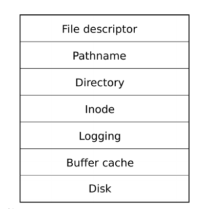
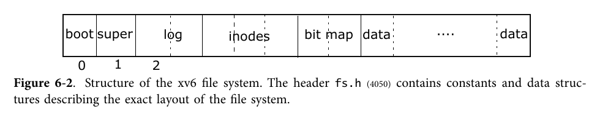

# Lab7 ファイルシステムとShell

OSの最終レベルに到達しました。おめでとう。このレベルでは、ファイルシステムと
シンプルなシェルをサポートするために、それまでに書いたすべてのコードを
つなぎ合わせ、さらに多くの新しいコードを追加する必要があります。

## 7.1 ファイルシステム

ラボ 6では、SDカードのドライバを実装し、ブロック単位のアトミックな読み
書きをできるようにしました。今回はそのドライバをベースにファイルシステムを
実装してみましょう。

簡単に言いうと、基礎となるドライバは、ファイルシステムのセクション単位
（512B）でリニアにアドレス指定可能な永続的なストレージスペースを提供します。
ただし、このアクセス方法はあまりにも原始的なのでプログラマに十分な抽象化を
提供していませんでした。そのため、ファイルベースの抽象化が登場したのです。
この抽象化は、UNIX OSに引き継がれ、すべてのものをファイルとして扱う
統一されたインタフェースが登場し、システムコールを通じて、プログラマにとって
非常に使いやすいプログラミングパラダイムを提供しました。

オペレーティングシステムにおけるファイルシステムのポイントは、基礎となる
ドライバとシステムコールインターフェースの間のギャップを埋めることです。

OSTEPの第3部（または筆者が書いたまとめ記事「[ファイルシステムとストレージシステム入門](https://zfhu.ac.cn/homepage/2019/12/file-system-present)」）を
読んで、基本的な知識を取得する事を勧めます。

### 7.1.1 設計

適切なファイルシステムを単独で実装することは難しいので、xv6のファイル
システムの実装を参考にし、そのデザインを移植またはエミュレートして、
我々のOSフレームワークにファイルシステムを実装することを勧めます。

xv6本の第6章に目を通し、そのコードの説明に従ってxv6のソースコードを
読むことを勧めます。すでにドライバは実装しており、ドライバの上にファイル
システムを実装することは、CPUのアーキテクチャとはあまり関係がないので、
xv6本のファイルシステム部分の設計は、x86系のOS用に書かれていたとしても、
私たちにとっては価値の高いものです。

xv6では、ファイルシステムのボトムアップ構造は以下の図のようになっています。




関連するコードは

- `ide.c` ハードドライブドライバは、Lab 6のsd.cで実装済みです。
- `bio.c` buffer cache，記憶媒体上の単位空間をメモリに保持してバッファリングを行います。
- `log.c` システムクラッシュ時の整合性を保つために使用されるディスク変更ログです。
- `fs.c` inodeに対する操作の実装です。
- `file.c` ファイルの抽象化します。
- `sysfile.c` ファイルシステムに関連する各種システムコールを実装しています。
- `mkfs.c` ファイルシステムを初期化します。スーパーブロック、ログ、inode、
  ビットマップなどの記憶領域の構築、ユーザプログラムのファイルシステムへの
  書き込みを行います。

記憶媒体上のコンテンツは次のように編成されています。bootはブートローダ
（OS自体はファイルシステムに保存されていないことに注意）、superは
ファイルシステムのスーパーブロックとファイルシステムのメタデータ、
logは操作ログ、inodesはファイルのメタ情報、ビットマップは、データ領域の
使用状況を保存します。



## 7.2 システムコール

ファイルシステムを追加したので、ファイルシステムとやりとりするための
ユーザモードのシステムコールを実装します。そのためには大量のソフト
割り込みを導入する必要があります。

`xv6`では非常にシンプルな`libc`を実装しており、`syscall.h`で個々の
システムコール番号を定義し、`usys.S`で割り込み命令のラッパーを実装
しています。`lab6`では、より完全な、しかしより複雑な`libc`である`musl`を
導入しました。

`xv6`のようなシンプルなラッパーを選択することもできますし、`musl`の上に
実装して、システムコールの形でファイルシステムの操作をユーザモードに
公開することもできます。なお、ユーザモードのプログラムをコンパイルする
際には、`libc`をインクルードする必要がありますのでMakefileを適切に変更
してください。

### 7.2.1 muslのハック

trapframeにはTPIDR_EL0とQ0を保持する必要があります。前者はTLS
(Thread-local storage)のアドレスを記録するためにmuslが使用している
ようです。後者はARMv8の32個のSIMDレジスタ(SIMD命令と浮動小数点演算に
使用可能)の1つで、muslがmemsetの高速化のために使用さしています。

これらのSIMD命令を使用できるように、`kern/entry.S`でCPACR_EL1を設定
していることに注意してください。

さらに、`kern/syscall.c`に記載されているように、いくつかのシステム
コールを実装する必要があります。

## 7.3 Shell

Shellは、プログラマーがUNIX系OSを操作するための最も自然なインタフェース
です。今学期で実装してきたOSで本当に遊びたいのであれば、そのための
Shellを実装しなければなりません。

### 7.3.1 Shellの起動

Shellはinitがforkすることで作成され、そのstdoutとstderrはinitプロセスが
`mknod` + `dup`で手動で設定するので、forkで作成された各プロセスはこれらの
ファイル記述子を継承します。 起動時の手順は以下の通りです。

- `user_init()`が`initcode.S`を鬼道します。
- `initcode.S`はexecシステムコールを実行し、自分自身を`user/src/init`の
  initプロセスに置き換えます。
- initプロセスは連続してforkを行い、`user/src/sh`のシェルプロセスを
  起動します。

## 7.4 演習

### 7.4.1 問題 1 (60%)

ファイルシステムを実装してください。 この実験のファイルシステムはxv6の
設計に従っていますが、独自のファイルシステムをゼロから設計することも
できます。ファイルシステムがxv6と異なる場合は`user/src/mkfs`を修正します。
実装したファイルシステムが、パッケージ化したファイルを読み込めることを
証明するためのテストを追加する必要があります。テストはファイルの内容と
サイズが正しいことをチェックしてください。

Makefileを修正して新しいコンパイルエントリ（`make testfs`など）を追加し、`-DTEST_FILE_SYSTEM`の[条件付きコンパイルディレクティブ](https://www.linuxtopia.org/online_books/an_introduction_to_gcc/gccintro_34.html)を
使用して、コード内に非侵入型テストを実装することを勧めます。

```c
#ifdef TEST_FILE_SYSTEM
test_file_system()
#endif

// compile with `gcc -DTEST_FILE_SYSTEM ...` so that the above code will be included.
```

### 7.4.2 問題 2 (20%)

`syscall.c`と`trapasm.S`を修正してmuslをフックするか、Makefileを修正して
xv6用のシンプルなlibcを実装し、ユーザモードプログラムがシステムコールを
呼び出してファイルシステムを操作できるようにしてください。

### 7.4.3 問題 3 (20%)

xv6用のシェルを`user/src/sh`ディレクトリに移動しましたが、mallocを使用
するためのbrkシステムコールを実装する必要があります。あるいは、自分で
簡単なシェルを実装することもできます。`user/src/cat`にあるcatコマンドを
実装し、自分のshellで実行してください。

### 7.4.4 チャレンジ課題

ファイルシステムの最も重要な機能は、システムのクラッシュやリカバリーの際に、
データの不整合が起こらないことです。 ファイルシステムのクラッシュ一貫性を
検証するテストを設計してください。

## 実行結果

```
$ make
make -C user
make[1]: Entering directory '/home/vagrant/xv6-armv8-lab/user'
make -C ../libc
make[2]: Entering directory '/home/vagrant/xv6-armv8-lab/libc'
make[2]: Nothing to be done for 'all'.
make[2]: Leaving directory '/home/vagrant/xv6-armv8-lab/libc'
mkdir -p ../obj/user/
# Replace "/usr/local/musl" to "../libc"
sed -e "s/\/usr\/local\/musl/..\/libc/g" ../libc/lib/musl-gcc.specs > ../obj/user/musl-gcc.specs
make ../obj/user/bin/mkfs ../obj/user/bin/init ../obj/user/bin/cat ../obj/user/bin/ls ../obj/user/bin/sh
make[2]: Entering directory '/home/vagrant/xv6-armv8-lab/user'
mkdir -p ../obj/user/src/mkfs/
aarch64-linux-gnu-gcc -specs ../obj/user/musl-gcc.specs -std=gnu99 -O3 -MMD -MP -static -fno-plt -fno-pic -fpie -z max-page-size=4096 -I../libc/obj/include/ -I../libc/arch/aarch64/ -I../libc/arch/generic/ -c -o ../obj/user/src/mkfs/main.c.o src/mkfs/main.c
mkdir -p ../obj/user/bin/
aarch64-linux-gnu-gcc -specs ../obj/user/musl-gcc.specs -std=gnu99 -O3 -MMD -MP -static -fno-plt -fno-pic -fpie -z max-page-size=4096 -I../libc/obj/include/ -I../libc/arch/aarch64/ -I../libc/arch/generic/ -o ../obj/user/bin/mkfs ../obj/user/src/mkfs/main.c.o
aarch64-linux-gnu-objdump -S -d ../obj/user/bin/mkfs > ../obj/user/src/mkfs/mkfs.asm
aarch64-linux-gnu-objdump -x ../obj/user/bin/mkfs > ../obj/user/src/mkfs/mkfs.hdr
mkdir -p ../obj/user/src/init/
aarch64-linux-gnu-gcc -specs ../obj/user/musl-gcc.specs -std=gnu99 -O3 -MMD -MP -static -fno-plt -fno-pic -fpie -z max-page-size=4096 -I../libc/obj/include/ -I../libc/arch/aarch64/ -I../libc/arch/generic/ -c -o ../obj/user/src/init/main.c.o src/init/main.c
src/init/main.c: In function ‘main’:
src/init/main.c:16:9: warning: implicit declaration of function ‘mknod’ [-Wimplicit-function-declaration]
   16 |         mknod("console", 1, 1);
      |         ^~~~~
mkdir -p ../obj/user/bin/
aarch64-linux-gnu-gcc -specs ../obj/user/musl-gcc.specs -std=gnu99 -O3 -MMD -MP -static -fno-plt -fno-pic -fpie -z max-page-size=4096 -I../libc/obj/include/ -I../libc/arch/aarch64/ -I../libc/arch/generic/ -o ../obj/user/bin/init ../obj/user/src/init/main.c.o
aarch64-linux-gnu-objdump -S -d ../obj/user/bin/init > ../obj/user/src/init/init.asm
aarch64-linux-gnu-objdump -x ../obj/user/bin/init > ../obj/user/src/init/init.hdr
mkdir -p ../obj/user/src/cat/
aarch64-linux-gnu-gcc -specs ../obj/user/musl-gcc.specs -std=gnu99 -O3 -MMD -MP -static -fno-plt -fno-pic -fpie -z max-page-size=4096 -I../libc/obj/include/ -I../libc/arch/aarch64/ -I../libc/arch/generic/ -c -o ../obj/user/src/cat/main.c.o src/cat/main.c
mkdir -p ../obj/user/bin/
aarch64-linux-gnu-gcc -specs ../obj/user/musl-gcc.specs -std=gnu99 -O3 -MMD -MP -static -fno-plt -fno-pic -fpie -z max-page-size=4096 -I../libc/obj/include/ -I../libc/arch/aarch64/ -I../libc/arch/generic/ -o ../obj/user/bin/cat ../obj/user/src/cat/main.c.o
aarch64-linux-gnu-objdump -S -d ../obj/user/bin/cat > ../obj/user/src/cat/cat.asm
aarch64-linux-gnu-objdump -x ../obj/user/bin/cat > ../obj/user/src/cat/cat.hdr
mkdir -p ../obj/user/src/ls/
aarch64-linux-gnu-gcc -specs ../obj/user/musl-gcc.specs -std=gnu99 -O3 -MMD -MP -static -fno-plt -fno-pic -fpie -z max-page-size=4096 -I../libc/obj/include/ -I../libc/arch/aarch64/ -I../libc/arch/generic/ -c -o ../obj/user/src/ls/main.c.o src/ls/main.c
mkdir -p ../obj/user/bin/
aarch64-linux-gnu-gcc -specs ../obj/user/musl-gcc.specs -std=gnu99 -O3 -MMD -MP -static -fno-plt -fno-pic -fpie -z max-page-size=4096 -I../libc/obj/include/ -I../libc/arch/aarch64/ -I../libc/arch/generic/ -o ../obj/user/bin/ls ../obj/user/src/ls/main.c.o
aarch64-linux-gnu-objdump -S -d ../obj/user/bin/ls > ../obj/user/src/ls/ls.asm
aarch64-linux-gnu-objdump -x ../obj/user/bin/ls > ../obj/user/src/ls/ls.hdr
mkdir -p ../obj/user/src/sh/
aarch64-linux-gnu-gcc -specs ../obj/user/musl-gcc.specs -std=gnu99 -O3 -MMD -MP -static -fno-plt -fno-pic -fpie -z max-page-size=4096 -I../libc/obj/include/ -I../libc/arch/aarch64/ -I../libc/arch/generic/ -c -o ../obj/user/src/sh/main.c.o src/sh/main.c
mkdir -p ../obj/user/bin/
aarch64-linux-gnu-gcc -specs ../obj/user/musl-gcc.specs -std=gnu99 -O3 -MMD -MP -static -fno-plt -fno-pic -fpie -z max-page-size=4096 -I../libc/obj/include/ -I../libc/arch/aarch64/ -I../libc/arch/generic/ -o ../obj/user/bin/sh ../obj/user/src/sh/main.c.o
aarch64-linux-gnu-objdump -S -d ../obj/user/bin/sh > ../obj/user/src/sh/sh.asm
aarch64-linux-gnu-objdump -x ../obj/user/bin/sh > ../obj/user/src/sh/sh.hdr
rm ../obj/user/src/mkfs/main.c.o ../obj/user/src/ls/main.c.o ../obj/user/src/cat/main.c.o ../obj/user/src/sh/main.c.o ../obj/user/src/init/main.c.o
make[2]: Leaving directory '/home/vagrant/xv6-armv8-lab/user'
make[1]: Leaving directory '/home/vagrant/xv6-armv8-lab/user'
make obj/sd.img
make[1]: Entering directory '/home/vagrant/xv6-armv8-lab'
+ cc kern/syscall1.c
+ cc kern/vm.c
+ cc kern/trap.c
+ cc kern/fs.c
+ cc kern/file.c
+ cc kern/spinlock.c
+ cc kern/console.c
+ cc kern/log.c
+ cc kern/sleeplock.c
+ cc kern/proc.c
+ cc kern/exec.c
+ cc kern/bio.c
+ cc kern/syscall.c
+ as kern/trapasm.S
+ cc kern/sysfile.c
+ cc kern/kalloc.c
+ cc kern/mbox.c
+ cc kern/uart.c
+ cc kern/sysproc.c
+ as kern/entry.S
+ cc kern/clock.c
+ cc kern/timer.c
+ cc kern/kpgdir.c
+ cc kern/main.c
+ cc kern/sd.c
+ as user/initcode.S
+ ld obj/user/initcode.out
+ objcopy obj/user/initcode
+ objdump obj/user/initcode.o
+ ld obj/kernel8.elf
+ objdump obj/kernel8.elf
+ objcopy obj/kernel8.img
dd if=/dev/zero of=obj/boot.img seek=131071 bs=512 count=1
1+0 records in
1+0 records out
512 bytes copied, 7.4577e-05 s, 6.9 MB/s
# -F 32 specify FAT32
# -s 1 specify one sector per cluster so that we can create a smaller one
mkfs.vfat -F 32 -s 1 obj/boot.img
mkfs.fat 4.1 (2017-01-24)
# Copy files into boot partition
mcopy -i obj/boot.img obj/kernel8.img ::kernel8.img;  mcopy -i obj/boot.img boot/LICENCE.broadcom ::LICENCE.broadcom;  mcopy -i obj/boot.img boot/bootcode.bin ::bootcode.bin;  mcopy -i obj/boot.img boot/config.txt ::config.txt;  mcopy -i obj/boot.img boot/fixup.dat ::fixup.dat;  mcopy -i obj/boot.img boot/start.elf ::start.elf;
echo obj/user/bin/mkfs obj/user/bin/init obj/user/bin/cat obj/user/bin/ls obj/user/bin/sh
obj/user/bin/mkfs obj/user/bin/init obj/user/bin/cat obj/user/bin/ls obj/user/bin/sh
cc user/src/mkfs/main.c -o obj/mkfs
./obj/mkfs obj/fs.img obj/user/bin/mkfs obj/user/bin/init obj/user/bin/cat obj/user/bin/ls obj/user/bin/sh
nmeta 59 (boot, super, log blocks 30 inode blocks 26, bitmap blocks 1) blocks 941 total 1000
input: 'obj/user/bin/mkfs' -> 'mkfs'
input: 'obj/user/bin/init' -> 'init'
input: 'obj/user/bin/cat' -> 'cat'
input: 'obj/user/bin/ls' -> 'ls'
input: 'obj/user/bin/sh' -> 'sh'
balloc: first 497 blocks have been allocated
balloc: write bitmap block at sector 58
dd if=/dev/zero of=obj/sd.img seek=262143 bs=512 count=1
1+0 records in
1+0 records out
512 bytes copied, 7.4208e-05 s, 6.9 MB/s
Checking that no-one is using this disk right now ... OK

Disk obj/sd.img: 128 MiB, 134217728 bytes, 262144 sectors
Units: sectors of 1 * 512 = 512 bytes
Sector size (logical/physical): 512 bytes / 512 bytes
I/O size (minimum/optimal): 512 bytes / 512 bytes
Disklabel type: dos
Disk identifier: 0x1f5fb71a

Old situation:

Device      Boot  Start    End Sectors Size Id Type
obj/sd.img1        2048 133119  131072  64M  c W95 FAT32 (LBA)
obj/sd.img2      133120 262143  129024  63M 83 Linux

>>> Created a new DOS disklabel with disk identifier 0x14e0b59f.
obj/sd.img1: Created a new partition 1 of type 'W95 FAT32 (LBA)' and of size 64 MiB.
Partition #1 contains a vfat signature.
obj/sd.img2: Created a new partition 2 of type 'Linux' and of size 63 MiB.
obj/sd.img3: Done.

New situation:
Disklabel type: dos
Disk identifier: 0x14e0b59f

Device      Boot  Start    End Sectors Size Id Type
obj/sd.img1        2048 133119  131072  64M  c W95 FAT32 (LBA)
obj/sd.img2      133120 262143  129024  63M 83 Linux

The partition table has been altered.
Syncing disks.
dd if=obj/boot.img of=obj/sd.img seek=2048 conv=notrunc
131072+0 records in
131072+0 records out
67108864 bytes (67 MB, 64 MiB) copied, 0.259969 s, 258 MB/s
dd if=obj/fs.img of=obj/sd.img seek=133120 conv=notrunc
1000+0 records in
1000+0 records out
512000 bytes (512 kB, 500 KiB) copied, 0.00199976 s, 256 MB/s
make[1]: Leaving directory '/home/vagrant/xv6-armv8-lab'
```

```
$ make qemu
qemu-system-aarch64 -M raspi3 -nographic -serial null -serial mon:stdio -drive file=obj/sd.img,if=sd,format=raw -kernel obj/kernel8.img
console_init: success.
main: [CPU 1] init started.
alloc_init: success.
proc_init: success.
irq_init: success.
timer_init: success at CPU 1.
file_init: success.
binit: success.
- mbox write: 0x7ecc8
- mbox read: 0x7ecc8
- clock rate: 50000000
- SD base clock rate from mailbox: 50000000
- Reset the card.
- Divisor selected = 104, shift count = 6
- EMMC: Set clock, status 0x1ff0000 CONTROL1: 0xe6807
- Send IX_GO_IDLE_STATE command.
- Send command response: 0
- EMMC: Sending ACMD41 SEND_OP_COND status 1ff0000
- Divisor selected = 2, shift count = 0
- EMMC: Set clock, status 0x1ff0000 CONTROL1: 0xe0207
- EMMC: SD Card Type 2 SC 128Mb UHS-I 0 mfr 170 'XY:QEMU!' r0.1 2/2006, #deadbeef RCA 4567
sd_init: Partition 1: 00 20 21 00 0c 49 01 08 00 08 00 00 00 00 02 00
- Status: 0
- CHS address of first absolute sector: head=32, sector=33, cylinder=0
- Partition type: 12
- CHS address of last absolute sector: head=73, sector=1, cylinder=8
- LBA of first absolute sector: 0x800
- Number of sectors: 131072
sd_init: Partition 2: 00 49 02 08 83 51 01 10 00 08 02 00 00 f8 01 00
- Status: 0
- CHS address of first absolute sector: head=73, sector=2, cylinder=8
- Partition type: 131
- CHS address of last absolute sector: head=81, sector=1, cylinder=16
- LBA of first absolute sector: 0x20800
- Number of sectors: 129024
sd_init: Partition 3: 00 00 00 00 00 00 00 00 00 00 00 00 00 00 00 00
- Status: 0
- CHS address of first absolute sector: head=0, sector=0, cylinder=0
- Partition type: 0
- CHS address of last absolute sector: head=0, sector=0, cylinder=0
- LBA of first absolute sector: 0x0
- Number of sectors: 0
sd_init: Partition 4: 00 00 00 00 00 00 00 00 00 00 00 00 00 00 00 00
- Status: 0
- CHS address of first absolute sector: head=0, sector=0, cylinder=0
- Partition type: 0
- CHS address of last absolute sector: head=0, sector=0, cylinder=0
- LBA of first absolute sector: 0x0
- Number of sectors: 0
sd_init: Boot signature: 55 aa
sd_init: success.
proc_alloc: proc 1 success.
user_init: proc 1 (initproc) success.
main: [CPU 1] init success.
main: [CPU 2] init started.
bget: dev 1 blockno 133121
timer_init: success at CPU 2.
main: [CPU 3] init started.
timer_init: success at CPU 3.
main: [CPU 3] init success.
main: [CPU 2] init success.
main: [CPU 0] init started.
super block: size 1000 nblocks 941 ninodes 200 nlog 30 logstart 2 inodestart 32 bmapstart 58
iinit: success.
bget: dev 1 blockno 133121
timer_init: success at CPU 0.
main: [CPU 0] init success.
bget: dev 1 blockno 133122
bget: dev 1 blockno 133122
initlog: success.
syscall: syscall 221 from proc 1
argstr: n 0 addr 32
sys_exec: exec '' uargv 0
sys_exec: failed to fetch argument.
```
