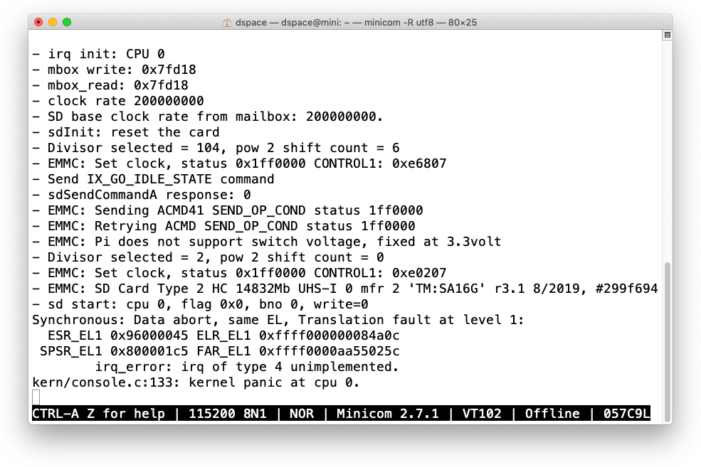
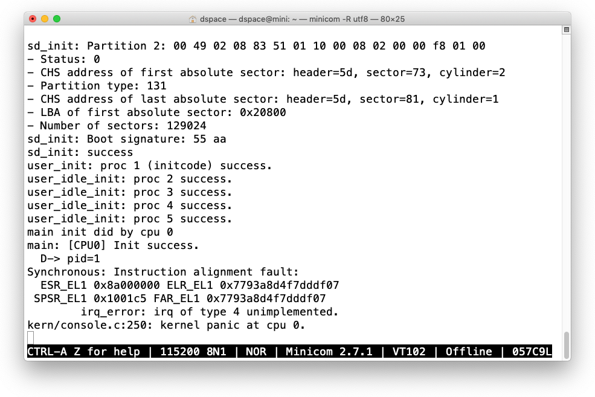
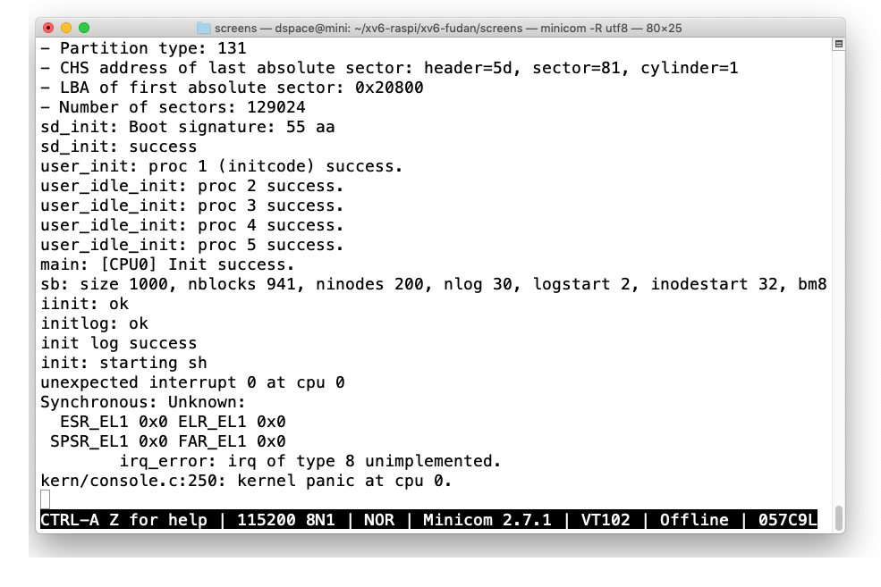

# lab1: ブート

## Ubuntu serverでUSBメモリをマウント

```
$ sudo mount -t vfat /dev/sdc1 /media
$ ls /media
bootcode.bin  config.txt  fixup.dat  kernel8.img  LICENCE.broadcom  start.elf
$ sudo cp obj/kernel8.img /media
$ sudo umount /media
```

- VirtualBoxを立ち上げる
- Ubuntu29を表示する（virtualboxのウィンドウが表示される）
- メニューバー->Devices->USB: MX のチェックを外す
- ウィンドウを閉じ、ダイアログボックスで[Coninue rnning in the background]を選択して[OK]する
- Mac側にUSBメモリがマウントされるので取り出す
- SDカードをraspiに装着

## 実行

- `minicom`を115200bps, 8n1で立ち上げる
- raspiのスイッチを入れる


# lab2: メモリ管理

**注意** `vm_free(uint64_t *pgdir, int level)`の`level`は最上位が0。hakulaは4としていた。他の人は0だったのでそちらに合わせた。この関数を試用する場合は注意すること。

## 実機で実行

```
Allocator: Init success.
check_free_list: pass!
v=55555555
check_map_region: failed!
check_vm_free: passed!
```

## QEMUで実行

```
Allocator: Init success.
check_free_list: pass!
v=ac
check_map_region: passed!
check_vm_free: passed!
```

### CPU0以外を止めることで実機でも成功


# lab3: 割り込みと例外

- CPUは1つだけで実行してが、実機とQEMUで`timer`の出力頻度が違う。`timer`はCPUごとに一つ存在し、その周波数はCPUの周波数に応じて変化するとあるので、実機とQEMUでCPUの周波数設定が違うのだろう。
- 実機では、`timer`と`clock`の出力タイミングが一緒であった。

## 実機で実行


## QEMUで実行

```
$ make qemu
qemu-system-aarch64 -M raspi3 -nographic -serial null -serial mon:stdio -kernel obj/kernel8.img
Allocator: Init success.
- irq init
cpu 0 timer.
cpu 0 timer.
cpu 0 timer.
cpu 0 clock.
cpu 0 timer.
cpu 0 timer.
cpu 0 timer.
cpu 0 clock.
cpu 0 timer.
cpu 0 timer.
```

# lab4: マルチコアとロック

## 実機で実行

```
rreelleease: not locked                         # 電源オン
kern/console.c:133: kernel panic at cpu 2.

--  iirrq init: CPU 0                           # 電源オン
- irq init: CPU 3
CPU 2: Init success.
CPU 3: Init success.
release: not locked
kern/console.c:133: kernel panic at cpu 3.

release: not locked                             # 電源オン
kern/console.c:133: kernel panic at cpu 3.
                                                # main.cを修正して、電源オン
release: not locked
kern/console.c:133: kernel panic at cpu 1.

--r  eiilrasiiit:  PU0k                         # 電源オン
d

- irq init: CPU 0                               # 電源オン
- irq init: CPU 2
CPU 0: Init success.
CPU 2: Init success.
```

- 一つのCPUでの処理が必要な初期化関数を一つにまとめた
- 処理を始める前にCPU毎に違う遅延時間を置いた


一部、表示が欠けるがpanicにはなっていない模様。cpuを意識したspinlockが実装されていないので、ここはこれで良しとして先に進む。ただし、spinlockのロジックが実機では破綻している可能性もある。linuxの実装を見たがマクロの連鎖で結局、どれが生きのか判明できなかった。

## QEMUで実行

```
$ make qemu
qemu-system-aarch64 -M raspi3 -nographic -serial null -serial mon:stdio -kernel obj/kernel8.img
CPU 0: Init start.
CPU 0 did memset
CPU 0 did console_init
CPU 2: Init start.
CPU 1: Init start.
CPU 3: Init start.
CPU 0 did alloc_init
- irq init
- irq init
- irq init
CPU 0: Init success.
- irq init
CPU 1: Init success.
CPU 3: Init success.
CPU 2: Init success.
```

# lab5

```
(gdb) b scheduler
Breakpoint 1 at 0xffff000000082bf8: file kern/proc.c, line 130.
(gdb) c
Continuing.

Thread 1 hit Breakpoint 1, scheduler () at kern/proc.c:130
130	    cprintf("CPU %d scheduler start\n", cpuid());
...
(gdb) n
142	            uvm_switch(p);
(gdb) p *p
$1 = {sz = 4096, pgdir = 0xffff00003effe000, kstack = 0xffff00003efff000 "",
  state = RUNNABLE, pid = 1, parent = 0x0, tf = 0xffff00003efffef0,
  context = 0xffff00003efffe80, chan = 0x0, killed = 0,
  name = "initcode\000\000\000\000\000\000\000"}
(gdb) x/16xg 0xffff00003effe000
0xffff00003effe000:	0x000000003effc003	0x0000000000000000
0xffff00003effe010:	0x0000000000000000	0x0000000000000000
0xffff00003effe020:	0x0000000000000000	0x0000000000000000
0xffff00003effe030:	0x0000000000000000	0x0000000000000000
0xffff00003effe040:	0x0000000000000000	0x0000000000000000
0xffff00003effe050:	0x0000000000000000	0x0000000000000000
0xffff00003effe060:	0x0000000000000000	0x0000000000000000
0xffff00003effe070:	0x0000000000000000	0x0000000000000000
(gdb) x/16xg 0x000000003effc000
0x3effc000:	0x000000003effb003	0x0000000000000000
0x3effc010:	0x0000000000000000	0x0000000000000000
0x3effc020:	0x0000000000000000	0x0000000000000000
0x3effc030:	0x0000000000000000	0x0000000000000000
0x3effc040:	0x0000000000000000	0x0000000000000000
0x3effc050:	0x0000000000000000	0x0000000000000000
0x3effc060:	0x0000000000000000	0x0000000000000000
0x3effc070:	0x0000000000000000	0x0000000000000000
(gdb) x/16xg 0x000000003effb000
0x3effb000:	0x000000003effa003	0x0000000000000000
0x3effb010:	0x0000000000000000	0x0000000000000000
0x3effb020:	0x0000000000000000	0x0000000000000000
0x3effb030:	0x0000000000000000	0x0000000000000000
0x3effb040:	0x0000000000000000	0x0000000000000000
0x3effb050:	0x0000000000000000	0x0000000000000000
0x3effb060:	0x0000000000000000	0x0000000000000000
0x3effb070:	0x0000000000000000	0x0000000000000000
(gdb) x/16xg 0x000000003effa000
0x3effa000:	0xffff00003effd747	0x0000000000000000
0x3effa010:	0x0000000000000000	0x0000000000000000
0x3effa020:	0x0000000000000000	0x0000000000000000
0x3effa030:	0x0000000000000000	0x0000000000000000
0x3effa040:	0x0000000000000000	0x0000000000000000
0x3effa050:	0x0000000000000000	0x0000000000000000
0x3effa060:	0x0000000000000000	0x0000000000000000
0x3effa070:	0x0000000000000000	0x0000000000000000
(gdb) x/16xw 0xffff00003effd000
0xffff00003effd000:	0x58000201	0x58000222	0xd2800000	0xd4000001  // initcodeのバイナリ
0xffff00003effd010:	0xd2800020	0xd4000001	0x17fffffe	0x696e692f
0xffff00003effd020:	0x00000074	0xd503201f	0xd503201f	0xd503201f
0xffff00003effd030:	0x0000001c	0x00000000	0x00000000	0x00000000
...
145	            swtch(&c->scheduler, p->context);
(gdb) s
swtch () at kern/swtch.S:12
12	    stp     x29, x30, [sp, #-16]!
...
(gdb)
swtch () at kern/swtch.S:19
19	    mov     x21, sp
(gdb) s
20	    str     x21, [x0]
(gdb) s
21	    mov     sp, x1
(gdb) i r x21
x21            0xffff00000007ff70  -281474976186512     // schedulerのsp
(gdb) i r x1
x1             0xffff00003efffe80  -281473919746432     // c->scheduler
(gdb) i r x0
x0             0xffff00000008a6d8  -281474976143656     // initcodeのp->context
(gdb) s
swtch () at kern/swtch.S:23
23	    ldp     x19,  x20,  [sp], #16
...
(gdb)
swtch () at kern/swtch.S:28
28	    ldp     x29,  x30,  [sp], #16
(gdb)
swtch () at kern/swtch.S:31
31	    eret
(gdb) i r x30
x30            0xffff000000082db0  -281474976174672     // forkret + 8
(gdb) s                                                 // ここで幾重不明: eretではだめ
0x0000000000000000 in ?? ()
(gdb) s
Cannot find bounds of current function
(gdb) q
                                                        // br x30に変更
(gdb)
swtch () at kern/swtch.S:30
30	    br x30
(gdb) i r x30
x30            0xffff000000082db0  -281474976174672     // forkret + 8
(gdb) s
forkret () at kern/proc.c:173
173	    release(&ptable.lock);
(gdb) n
174	}
(gdb)
trapret () at kern/trapasm.S:54                         // trapretへ
54	    ldp     x23, x22, [sp], #16
(gdb) s
trapret () at kern/trapasm.S:55
55	    msr     ELR_EL1, x23
...
(gdb)
trapret () at kern/trapasm.S:76
76	    eret
(gdb) i r
x0             0x0                 0                  // x0-x30は全部0
..
x29            0x0                 0
x30            0x0                 0                  //
sp             0xffff00003f000000  0xffff00003f000000              // PHYSTOP
pc             0xffff000000083310  0xffff000000083310 <trapret+80> // eret

ELR_EL1        0x0                 0
SPSR_EL1       0x0                 0
SP_EL0         0x1000              4096

TTBR0_EL1      0x3effe000          1056956416
TTBR1_EL1      0x88000             557056

cpsr           0x200001c5          536871365    // (参考) 値が0以外のEL0,EL1,SYS
SCTLR          0x30d01985          818944389
ID_AA64DFR0_EL1 0x10305106         271601926
CNTFRQ_EL0     0x3b9aca0           62500000
ID_AA64ISAR0_EL1 0x11120           69920
ID_AA64MMFR0_EL1 0x1122            4386
PMCR_EL0       0x41002000          1090527232
CNTP_CTL_EL0   0x1                 1
CNTP_CVAL_EL0  0x2072044           34021444
PMCEID0_EL0    0x20001             131073
TCR_EL1        0xb5103510          3037738256
VBAR           0xffff000000082000  -281474976178176
MAIR_EL1       0xff00              65280
OSLSR_EL1      0xa                 10
ACBAR_EL1       0x3f000000          1056964608
CLIDR          0xa200023           169869347
ID_PFR0        0x131               305
ID_DFR0        0x3010066           50397286
ID_MMFR0       0x10101105          269488389
ID_MMFR1       0x40000000          1073741824
ID_ISAR0       0x2101110           34607376
ID_ISAR1       0x13112111          319889681
CTR_EL0        0x84448004          2219081732
L2CTLR_EL1     0x3000000           50331648
MVFR0_EL1      0x10110222          269550114
MVFR1_EL1      0x12111111          303108369
MVFR2_EL1      0x43                67
(gdb) s                                         // eretで幾重不明
0x0000000000000000 in ?? ()
(gdb) c
Continuing.                                     // continueで処理は進むが
                                                // 反応はなし
```

## xv6-armv8の場合

```
(gdb)
trapret () at kern/trapasm.S:75
75	    eret
(gdb) i r x30
x30            0x0                 0          // x30 == 0
(gdb) s
0x0000000000000000 in ?? ()                   // 幾重不明になるが
(gdb) s
Cannot find bounds of current function
(gdb) c                                       // continueすると
Continuing.
```

```
sys_exec: executing /init with parameters: /init  // 処理が進む
syscall: proc 1 calls syscall 1.
sys_exit: in exit
```

## irq_error()に飛ばした

```
trap: CPU 0 unexpected irq: 0.
Synchronous: Instruction abort, lower EL:
  ESR_EL1 0x8200000f ELR_EL1 0x0              // ESR_EL1: [31:26]: Instruction Abort from a lower EL
                                              //            [5:0]: Permission fault, level 3.
 SPSR_EL1 0x0 FAR_EL1 0x0
	irq_error: irq of type 8 unimplemented.
```

## `map_region()`で`*pte`を出力

- fudanではpteがカーネルアドレスになっている。
-
```
# xv6-arvm8: i=0, pte=7ffd443             0x443 = 0100 0100 0011
# xv6-fudan: i=0, pte=ffff00003effd747    0x747 = 0111 0100 0111
```

## `map_region()`で`*pte`をV2P変換した

- 動いた。map_regionのcheckもパス。
- 最後に`exit: exit initproc`でkernel panicになっているのはinitcodeしかプロセスがないため

```
$ make qemu
qemu-system-aarch64 -M raspi3 -nographic -serial null -serial mon:stdio -kernel obj/kernel8.img
i=0, pte=1000000000707
v=ac
check_map_region: passed!
check_vm_free: passed!
i=0, pte=3effd747
user_init: proc 1 (initcode) success.
main init did by cpu 0
- irq init: CPU 0
main: [CPU0] Init success.
CPU 0 scheduler start
scheduler: CPU 0 switch to 1
get svc
syscall 0
sys_exec start
sys_exec: executing /init with parameters: /init
get svc
syscall 1
sys_exit: in exit
exit: exit initproc
kern/console.c:133: kernel panic at cpu 0.
```

## マルチコアで実行

```
$ make qemu
qemu-system-aarch64 -M raspi3 -nographic -serial null -serial mon:stdio -kernel obj/kernel8.img
i=0, pte=1000000000707
v=ac
check_map_region: passed!
check_vm_free: passed!
i=0, pte=3effd747
user_init: proc 1 (initcode) success.
main init did by cpu 0
- irq init: CPU 0
- irq init: CPU 3
- irq init: CPU 1
- irq init: CPU 2
main: [CPU3] Init success.
main: [CPU2] Init success.
CPU 3 scheduler start
CPU 2 scheduler start
scheduler: CPU 3 switch to 1
main: [CPU0] Init success.
CPU 0 scheduler start
get svc
syscall 0
sys_exec start
sys_exec: executing /init with parameters: /init
get svc
syscall 1
sys_exit: in exit
exit: exit initproc
kern/console.c:133: kernel panic at cpu 3.
```

## 実機で実行（CPU0のみ）


# lab6

- `sd_test()`を呼び出すタイミングがわからない
  - `sd_init()`の後では、まだprocを作成してないため`sleep()`でpanic
  - `forkret()`で実行すると、割り込みがまったくかからない（`initcode`でハングするためか?）
  - `sti()`でEL1での割り込みを有効にするといろいろ面倒なエラーが発生する
- とりあえず、sd_test()は棚上げで次の演習に進む

## `sd_test()`なしで実機で実行



### `ELR_EL1 0xffff000000084a0c`
```
    for (int done = 0; done < BSIZE; )
ffff0000000849d8:       b9027fff        str     wzr, [sp, #636]                 // done = [sp, #636]
ffff0000000849dc:       1400000d        b       ffff000000084a10 <sd_init+0xb0>
        infbuf[done++] = *EMMC_DATA;
ffff0000000849e0:       d2800401        mov     x1, #0x20                       // x1 = EMMC_DATA
ffff0000000849e4:       f2a7e601        movk    x1, #0x3f30, lsl #16
ffff0000000849e8:       f2ffffe1        movk    x1, #0xffff, lsl #48
ffff0000000849ec:       b9427fe0        ldr     w0, [sp, #636]                  // w0 = done
ffff0000000849f0:       11000402        add     w2, w0, #0x1                    // w2 = w0 + 1
ffff0000000849f4:       b9027fe2        str     w2, [sp, #636]                  // done += 1
ffff0000000849f8:       93407c00        sxtw    x0, w0
ffff0000000849fc:       d37ef400        lsl     x0, x0, #2                      // x0 << 2 （4バイト）
ffff000000084a00:       f9413be2        ldr     x2, [sp, #624]                  // infbuf = [sp, #624]
ffff000000084a04:       8b000040        add     x0, x2, x0                      // x0 = infbuf + done
ffff000000084a08:       b9400021        ldr     w1, [x1]                        // w1 = *EMMC_DATA
ffff000000084a0c:       b9000001        str     w1, [x0]                        // infbuf[done] = w1
    for (int done = 0; done < BSIZE; )
ffff000000084a10:       b9427fe0        ldr     w0, [sp, #636]
ffff000000084a14:       7107fc1f        cmp     w0, #0x1ff
ffff000000084a18:       54fffe4d        b.le    ffff0000000849e0 <sd_init+0x80>
    sdWaitForInterrupt(INT_DATA_DONE);
ffff000000084a1c:       52800040        mov     w0, #0x2                        // #2
ffff000000084a20:       940003ac        bl      ffff0000000858d0 <sdWaitForInterrupt>
```

## `FAR_EL1 0xffff0000aa55025c`

- [47:39] = 0x0
- [38:30] = 0x0
- [29:21] = 0b101010100 = 0x154
- [20:12] = 0b101010000 = 0x150
- [11: 0] = 0x25c

## `sd_test()`なしでQEMUで実行

```
$ make qemu
qemu-system-aarch64 -M raspi3 -nographic -serial null -serial mon:stdio -drive file=obj/sd.img,if=sd,format=raw -kernel obj/kernel8.img
- irq init: CPU 0
- mbox write: 0x7fd18
- mbox_read: 0x7fd18
- clock rate 50000000
- SD base clock rate from mailbox: 50000000.
- sdInit: reset the card
- Divisor selected = 104, pow 2 shift count = 6
- EMMC: Set clock, status 0x1ff0000 CONTROL1: 0xe6807
- Send IX_GO_IDLE_STATE command
- sdSendCommandA response: 0
- EMMC: Sending ACMD41 SEND_OP_COND status 1ff0000
- Divisor selected = 2, pow 2 shift count = 0
- EMMC: Set clock, status 0x1ff0000 CONTROL1: 0xe0207
- EMMC: SD Card Type 2 SC 128Mb UHS-I 0 mfr 170 'XY:QEMU!' r0.1 2/2006, #deadbeef RCA 4567
- sd start: cpu 0, flag 0x0, bno 0, write=0

sd_init: Partition 1: 00 20 21 00 0c 49 01 08 00 08 00 00 00 00 02 00
- Status: 0
- CHS address of first absolute sector: header=5d, sector=32, cylinder=33
- Partition type: 12
- CHS address of last absolute sector: header=5d, sector=73, cylinder=1
- LBA of first absolute sector: 0x800
- Number of sectors: 131072

sd_init: Partition 2: 00 49 02 08 83 51 01 10 00 08 02 00 00 f8 01 00
- Status: 0
- CHS address of first absolute sector: header=5d, sector=73, cylinder=2
- Partition type: 131
- CHS address of last absolute sector: header=5d, sector=81, cylinder=1
- LBA of first absolute sector: 0x20800
- Number of sectors: 129024
sd_init: Boot signature: 55 aa
sd_init: success
user_init: proc 1 (initcode) success.
main init did by cpu 0
main: [CPU0] Init success.
syscall 0
sys_exec start
sys_exec: executing /init with parameters: /init
syscall 1
sys_exit: in exit
```

## 両者の違い

- clock rateが違う。実機は200MHz, QEMUは50MHz（これは関係なさそう。実施、表示だけで他には使用されていない）
- SD Cardタイプが違う。実機はHC, QEMUはSC


```
$ make qemu
qemu-system-aarch64 -M raspi3 -nographic -serial null -serial mon:stdio -drive file=obj/sd.img,if=sd,format=raw -kernel obj/kernel8.img
- irq init: CPU 0
- mbox write: 0x7fcb8
- mbox_read: 0x7fcb8
- clock rate 50000000
- SD base clock rate from mailbox: 50000000.
- sdInit: reset the card
- Divisor selected = 104, pow 2 shift count = 6
- EMMC: Set clock, status 0x1ff0000 CONTROL1: 0xe6807
- Send IX_GO_IDLE_STATE command
- sdSendCommandA response: 0
- EMMC: Sending ACMD41 SEND_OP_COND status 1ff0000
- Divisor selected = 2, pow 2 shift count = 0
- EMMC: Set clock, status 0x1ff0000 CONTROL1: 0xe0207
- EMMC: SD Card Type 2 SC 128Mb UHS-I 0 mfr 170 'XY:QEMU!' r0.1 2/2006, #deadbeef RCA 4567
sd_start: start with 0xffff00000007fd88
- sd start: cpu 0, flag 0x0, bno 0, write=0
- sent command
- ok

sd_init: Partition 1: 00 20 21 00 0c 49 01 08 00 08 00 00 00 00 02 00
- Status: 0
- CHS address of first absolute sector: header=5d, sector=32, cylinder=33
- Partition type: 12
- CHS address of last absolute sector: header=5d, sector=73, cylinder=1
- LBA of first absolute sector: 0x800
- Number of sectors: 131072

sd_init: Partition 2: 00 49 02 08 83 51 01 10 00 08 02 00 00 f8 01 00
- Status: 0
- CHS address of first absolute sector: header=5d, sector=73, cylinder=2
- Partition type: 131
- CHS address of last absolute sector: header=5d, sector=81, cylinder=1
- LBA of first absolute sector: 0x20800
- Number of sectors: 129024
sd_init: Boot signature: 55 aa
sd_init: success
namex: path=/, ip=0x1bc4f0.
break: path=(null), name=, ip=0xffff0000001bc4f0
namei: path=/, name=, ip=0xffff0000001bc4f0
user_init: proc 1 (initcode) success.
user_idle_init: proc 2 success.
user_idle_init: proc 3 success.
user_idle_init: proc 4 success.
user_idle_init: proc 5 success.
main init did by cpu 0
main: [CPU0] Init success.
sdrw: blockno=1
sd_start: start with 0xffff0000001c2988
- sd start: cpu 0, flag 0x0, bno 68157952, write=0
- sent command
- ok
@sd_intr: start
- read
- wakeup
- ok
#- ok
sb: size 1000, nblocks 941, ninodes 200, nlog 30, logstart 2, inodestart 32, bmap start 58
sdrw: blockno=2
sd_start: start with 0xffff0000001c2be0
- sd start: cpu 0, flag 0x0, bno 68158464, write=0
- sent command
- ok
@sd_intr: start
- read
- wakeup
- ok
#- ok
sdrw: blockno=2
sd_start: start with 0xffff0000001c2be0
- sd start: cpu 0, flag 0x6, bno 68158464, write=4
- sent command
- ok
@sd_intr: start
- wakeup
- ok
#- ok
init log success
called sysno=221
sys_exec: path=/init, uargv=32
[0]: uarg=0x14[1]: uarg=0x0execve: '/init' start
namex: path=/init, ip=0x1bc4f0.
- path=, name=init
sdrw: blockno=32
sd_start: start with 0xffff0000001c2e38
- sd start: cpu 0, flag 0x0, bno 68173824, write=0
- sent command
- ok
@sd_intr: start
- read
- wakeup
- ok
#- ok
- ip=0x1bc4f0, name=init
dirlookup: dp=0xffff0000001bc4f0, name=init, poff=0x0
readi: ip=0xffff0000001bc4f0, off=0, n=16
bmap: ip->addrs[0]=3b
- addr=59
- blockno=59
sdrw: blockno=59
sd_start: start with 0xffff0000001c3090
- sd start: cpu 0, flag 0x0, bno 68187648, write=0
- sent command
- ok
@sd_intr: start
- read
- wakeup
- ok
#- ok
- de: inum=1, name=.
readi: ip=0xffff0000001bc4f0, off=16, n=16
bmap: ip->addrs[0]=3b
- addr=59
- blockno=59
- de: inum=1, name=..
readi: ip=0xffff0000001bc4f0, off=32, n=16
bmap: ip->addrs[0]=3b
- addr=59
- blockno=59
- de: inum=2, name=mkfs
readi: ip=0xffff0000001bc4f0, off=48, n=16
bmap: ip->addrs[0]=3b
- addr=59
- blockno=59
- de: inum=3, name=init
- found
- next=0x1bc578.
break: path=(null), name=init, ip=0xffff0000001bc578
namei: path=/init, name=init, ip=0xffff0000001bc578
1readi: ip=0xffff0000001bc578, off=0, n=64
bmap: ip->addrs[0]=9b
- addr=155
- blockno=155
sdrw: blockno=155
sd_start: start with 0xffff0000001c32e8
- sd start: cpu 0, flag 0x0, bno 68236800, write=0
- sent command
- ok
@sd_intr: start
- read
- wakeup
- ok
#- ok
234readi: ip=0xffff0000001bc578, off=64, n=56
bmap: ip->addrs[0]=9b
- addr=155
- blockno=155
5678readi: ip=0xffff0000001bc578, off=0, n=4096
bmap: ip->addrs[0]=9b
- addr=155
- blockno=155
bmap: ip->addrs[1]=9c
- addr=156
- blockno=156
sdrw: blockno=156
sd_start: start with 0xffff0000001c3540
- sd start: cpu 0, flag 0x0, bno 68237312, write=0
- sent command
- ok
@sd_intr: start
- read
- wakeup
- ok
#- ok
bmap: ip->addrs[2]=9d
- addr=157
- blockno=157
sdrw: blockno=157
sd_start: start with 0xffff0000001c3798
- sd start: cpu 0, flag 0x0, bno 68237824, write=0
- sent command
- ok
@sd_intr: start
- read
- wakeup
- ok
#- ok
bmap: ip->addrs[3]=9e
- addr=158
- blockno=158
sdrw: blockno=158
sd_start: start with 0xffff0000001c39f0
- sd start: cpu 0, flag 0x0, bno 68238336, write=0
- sent command
- ok
@sd_intr: start
- read
- wakeup
- ok
#- ok
bmap: ip->addrs[4]=9f
- addr=159
- blockno=159
sdrw: blockno=159
sd_start: start with 0xffff0000001c3c48
- sd start: cpu 0, flag 0x0, bno 68238848, write=0
- sent command
- ok
@sd_intr: start
- read
- wakeup
- ok
#- ok
bmap: ip->addrs[5]=a0
- addr=160
- blockno=160
sdrw: blockno=160
sd_start: start with 0xffff0000001c3ea0
- sd start: cpu 0, flag 0x0, bno 68239360, write=0
- sent command
- ok
@sd_intr: start
- read
- wakeup
- ok
#- ok
bmap: ip->addrs[6]=a1
- addr=161
- blockno=161
sdrw: blockno=161
sd_start: start with 0xffff0000001c40f8
- sd start: cpu 0, flag 0x0, bno 68239872, write=0
- sent command
- ok
@sd_intr: start
- read
- wakeup
- ok
#- ok
bmap: ip->addrs[7]=a2
- addr=162
- blockno=162
sdrw: blockno=162
sd_start: start with 0xffff0000001c4350
- sd start: cpu 0, flag 0x0, bno 68240384, write=0
- sent command
- ok
@sd_intr: start
- read
- wakeup
- ok
#- ok
readi: ip=0xffff0000001bc578, off=4096, n=4096
bmap: ip->addrs[8]=a3
- addr=163
- blockno=163
sdrw: blockno=163
sd_start: start with 0xffff0000001c45a8
- sd start: cpu 0, flag 0x0, bno 68240896, write=0
- sent command
- ok
@sd_intr: start
- read
- wakeup
- ok
#- ok
bmap: ip->addrs[9]=a4
- addr=164
- blockno=164
sdrw: blockno=164
sd_start: start with 0xffff0000001c4800
- sd start: cpu 0, flag 0x0, bno 68241408, write=0
- sent command
- ok
@sd_intr: start
- read
- wakeup
- ok
#- ok
bmap: ip->addrs[10]=a5
- addr=165
- blockno=165
sdrw: blockno=165
sd_start: start with 0xffff0000001c4a58
- sd start: cpu 0, flag 0x0, bno 68241920, write=0
- sent command
- ok
@sd_intr: start
- read
- wakeup
- ok
#- ok
bmap: ip->addrs[11]=a6
- addr=166
- blockno=166
sdrw: blockno=166
sd_start: start with 0xffff0000001c4cb0
- sd start: cpu 0, flag 0x0, bno 68242432, write=0
- sent command
- ok
@sd_intr: start
- read
- wakeup
- ok
#- ok
bmap: ip->addrs[12]=a7
sdrw: blockno=167
sd_start: start with 0xffff0000001c4f08
- sd start: cpu 0, flag 0x0, bno 68242944, write=0
- sent command
- ok
@sd_intr: start
- read
- wakeup
- ok
#- ok
- blockno=168
sdrw: blockno=168
sd_start: start with 0xffff0000001c5160
- sd start: cpu 0, flag 0x0, bno 68243456, write=0
- sent command
- ok
@sd_intr: start
- read
- wakeup
- ok
#- ok
bmap: ip->addrs[13]=0
- blockno=169
sdrw: blockno=169
sd_start: start with 0xffff0000001c53b8
- sd start: cpu 0, flag 0x0, bno 68243968, write=0
- sent command
- ok
@sd_intr: start
- read
- wakeup
- ok
#- ok
bmap: ip->addrs[14]=0
- blockno=170
sdrw: blockno=170
sd_start: start with 0xffff0000001c5610
- sd start: cpu 0, flag 0x0, bno 68244480, write=0
- sent command
- ok
@sd_intr: start
- read
- wakeup
- ok
#- ok
bmap: ip->addrs[15]=0
- blockno=171
sdrw: blockno=171
sd_start: start with 0xffff0000001c5868
- sd start: cpu 0, flag 0x0, bno 68244992, write=0
- sent command
- ok
@sd_intr: start
- read
- wakeup
- ok
#- ok
readi: ip=0xffff0000001bc578, off=8192, n=580
bmap: ip->addrs[16]=0
- blockno=172
sdrw: blockno=172
sd_start: start with 0xffff0000001c5ac0
- sd start: cpu 0, flag 0x0, bno 68245504, write=0
- sent command
- ok
@sd_intr: start
- read
- wakeup
- ok
#- ok
bmap: ip->addrs[17]=0
- blockno=173
sdrw: blockno=173
sd_start: start with 0xffff0000001c5d18
- sd start: cpu 0, flag 0x0, bno 68246016, write=0
- sent command
- ok
@sd_intr: start
- read
- wakeup
- ok
#- ok
9readi: ip=0xffff0000001bc578, off=120, n=56
bmap: ip->addrs[0]=9b
- addr=155
- blockno=155
5678readi: ip=0xffff0000001bc578, off=11960, n=0
readi: ip=0xffff0000001bc578, off=11960, n=616
bmap: ip->addrs[23]=ffff0000
- blockno=179
sdrw: blockno=179
sd_start: start with 0xffff0000001c5f70
- sd start: cpu 0, flag 0x0, bno 68249088, write=0
- sent command
- ok
@sd_intr: start
- read
- wakeup
- ok
#- ok
bmap: ip->addrs[24]=0
- blockno=180
sdrw: blockno=180
sd_start: start with 0xffff0000001c61c8
- sd start: cpu 0, flag 0x0, bno 68249600, write=0
- sent command
- ok
@sd_intr: start
- read
- wakeup
- ok
#- ok
9readi: ip=0xffff0000001bc578, off=176, n=56
bmap: ip->addrs[0]=9b
- addr=155
- blockno=155
5readi: ip=0xffff0000001bc578, off=232, n=56
bmap: ip->addrs[0]=9b
- addr=155
- blockno=155
5acalled sysno=96
unexpected interrupt at cpu 0
unexpected interrupt at cpu 0
```

## hat

```
(gdb) i r x30
x30            0x0                 0
(gdb) i r ELR_EL1
ELR_EL1        0x400260            4194912
(gdb) x/16xw 0x400260
0x400260:	0xd280001d	0xd280001e	0x910003e0	0x90000001
0x400270:	0x91000021	0x927cec1f	0x14000001	0xaa0003e2
0x400280:	0xf0000004	0xf0000003	0xf0000000	0xf947e084
0x400290:	0xd2800005	0xf947b463	0xf947d400	0xf8408441
(gdb) n
0x0000000000400260 in ?? ()
(gdb) c
Continuing.

Thread 1 hit Breakpoint 1, execve (path=0x402128 "sh",
    argv=0xffff00003effec60, envp=0x0) at kern/exec.c:28
28	    struct proc* curproc = thisproc();
(gdb) c
Continuing.
```

## fudan

```
(gdb) i r x30
x30            0x0                 0
(gdb) i r ELR_EL1
ELR_EL1        0x400260            4194912
(gdb) x/16xw 0x400260
0x400260:	0xd280001d	0xd280001e	0x910003e0	0x90000001
0x400270:	0x91000021	0x927cec1f	0x14000001	0xaa0003e2
0x400280:	0xf0000004	0xf0000003	0xf0000000	0xf947e084
0x400290:	0xd2800005	0xf947b463	0xf947d400	0xf8408441
(gdb) n
0x0000000000400260 in ?? ()
(gdb) c
Continuing.

unexpected interrupt 0 at cpu 0
Synchronous: Unknown:
  ESR_EL1 0x0 ELR_EL1 0x0
 SPSR_EL1 0x60000000 FAR_EL1 0x0
	irq_error: irq of type 8 unimplemented.
kern/console.c:248: kernel panic at cpu 0.
```

## fudan

```
- argv[0], sp=0x406ff0, len=6
- auxv,    sp=0x406fd0, len=20
- envp,    sp=0x406fc8, len=8
- ustack,  sp=0x406fb8, len=10
- argc,    sp=0x406fb0, len=8

114	    uvm_switch(p);
(gdb) p *p
$1 = {sz = 4222976, pgdir = 0xffff00003efe1000,
  kstack = 0xffff00003efff000 '\021' <repeats 200 times>..., state = RUNNING,
  pid = 1, parent = 0x0, tf = 0xffff00003efffee0,
  context = 0xffff00003efff950, chan = 0x0, killed = 0,
  name = "init", '\000' <repeats 11 times>, ofile = {0x0 <repeats 16 times>},
  cwd = 0xffff0000001bc4f0 <icache+24>}
(gdb) p *p->tf
$2 = {q0 = 0, TPIDR_EL0 = 4096, TPIDR_EL0_COPY = 4096, SP_EL0 = 4222896,
  SPSR_EL1 = 0, ELR_EL1 = 4194912, x0 = 1, x1 = 4222904, x2 = 0, x3 = 0,
  x4 = 0, x5 = 0, x6 = 0, x7 = 0, x8 = 221, x9 = 0, x10 = 0, x11 = 0, x12 = 0,
  x13 = 0, x14 = 0, x15 = 0, x16 = 0, x17 = 0, x18 = 0, x19 = 0, x20 = 0,
  x21 = 0, x22 = 0, x23 = 0, x24 = 0, x25 = 0, x26 = 0, x27 = 0, x28 = 0,
  x29 = 0, x30 = 0}
(gdb) p *p->context
$3 = {x19 = 18446462598734705808, x20 = 18446462598734672216,
  x21 = 18446462598734701000, x22 = 18446462598734686552,
  x23 = 18446462598734701528, x24 = 1, x25 = 328, x26 = 18446462598732840960,
  x27 = 18446462599789803952, x28 = 18446462598733385832,
  x29 = 18446462598734705808, x30 = 18446462598733385820}
```

## hat

```
(gdb) p *curproc
$1 = {sz = 4222976, pgdir = 0xffff00003efe1000,
  kstack = 0xffff00003efff000 '\021' <repeats 200 times>..., state = RUNNING,
  pid = 1, parent = 0x0, tf = 0xffff00003efffed0,
  context = 0xffff00003efff7d8, chan = 0x0, killed = 0,
  name = "initcode\000\000\000\000\000\000\000", ofile = {
    0x0 <repeats 16 times>}, cwd = 0xffff0000001bc7c0 <icache+24>}
(gdb) p *curproc->tf
$2 = {Q0 = 0, TPIDR_EL0 = 0, TPIDR_EL0_COPY = 0, ELR_EL1 = 4194912,
  SPSR_EL1 = 0, SP_EL0 = 4222896, x0 = 1, x1 = 4222904, x2 = 0, x3 = 0,
  x4 = 0, x5 = 0, x6 = 0, x7 = 0, x8 = 221, x9 = 0, x10 = 0, x11 = 0, x12 = 0,
  x13 = 0, x14 = 0, x15 = 0, x16 = 0, x17 = 0, x18 = 0, x19 = 0, x20 = 0,
  x21 = 0, x22 = 0, x23 = 0, x24 = 0, x25 = 0, x26 = 0, x27 = 0, x28 = 0,
  x29 = 0, x30 = 0}
(gdb) p *curproc->context
$3 = {x16 = 0, x17 = 0, x18 = 0, x19 = 1, x20 = 0, x21 = 4096,
  x22 = 2147483648, x23 = 18446462599789803600, x24 = 18446462598733378248,
  x25 = 1, x26 = 2147483648, x27 = 18446462599789803632,
  x28 = 18446462598733378404, x29 = 1, x30 = 2147483648}
```

## fudan

```
called sysno=221                                // SYS_execve
sys_exec: path=/init, uargv=32
argv[0] = '/init'
argv[1] = '(null)'
execve: '/init' start
sleep: proc=1 ->L
scheduler: pid=2, context=0xffff00003eff9e60
  wakeup pid=1
scheduler: pid=3, context=0xffff00003eff3e60
scheduler: pid=4, context=0xffff00003efede60
scheduler: pid=5, context=0xffff00003efe7e60
scheduler: pid=1, context=0xffff00003efff990
 L<-
...
sleep: proc=1 ->L
scheduler: pid=2, context=0xffff00003eff9e60
  wakeup pid=1
scheduler: pid=3, context=0xffff00003eff3e60
scheduler: pid=4, context=0xffff00003efede60
scheduler: pid=5, context=0xffff00003efe7e60
scheduler: pid=1, context=0xffff00003efff950
 L<-
- argv[0], sp=0x406ff0, len=6
- auxv, sp=0x406fd0, len=20
- envp, sp=0x406fc0, len=8
- ustack, sp=0x406fb0, len=10
- argc, sp=0x406fa0, len=8
x0=0x1, x1=0x406fb0, ELF_EL1=0x400280
called sysno=96                                 // SYS_set_tid_address
called sysno=56                                 // SYS_openat
sys_openat: dirfd=-100, path:=console, omode=20002
sys_openat: cant namei console
called sysno=33                                 // SYS_mknodat
mknodat: path 'console', major:minor 1:1
sleep: proc=1 ->L
scheduler: pid=2, context=0xffff00003eff9e60
  wakeup pid=1
scheduler: pid=3, context=0xffff00003eff3e60
scheduler: pid=4, context=0xffff00003efede60
scheduler: pid=5, context=0xffff00003efe7e60
scheduler: pid=1, context=0xffff00003efffd20
 L<-
...
sleep: proc=1 ->L
scheduler: pid=2, context=0xffff00003eff9e60
  wakeup pid=1
scheduler: pid=3, context=0xffff00003eff3e60
scheduler: pid=4, context=0xffff00003efede60
scheduler: pid=5, context=0xffff00003efe7e60
scheduler: pid=1, context=0xffff00003efffd40
 L<-
called sysno=56                                 // SYS_openat
sys_openat: dirfd=-100, path:=console, omode=20002
sys_openat: ok fd=0
called sysno=23                                 // SYS_dup
called sysno=23
called sysno=29                                 // SYS_ioctl
called sysno=66                                 // SYS_writev
init: starting sh
called sysno=135                                // SYS_rt_sigprocmask
called sysno=135
called sysno=220                                // SYS_clone
fork: old=1, new=6
called sysno=135                                // SYS_rt_sigprocmask
called sysno=135
called sysno=66                                 // SYS_writev
parent wait
called sysno=260                                // SYS_wait4
wait: chan=1 ->W sleep: proc=1 ->L
scheduler: pid=2, context=0xffff00003eff9e60
scheduler: pid=3, context=0xffff00003eff3e60
scheduler: pid=4, context=0xffff00003efede60
scheduler: pid=5, context=0xffff00003efe7e60
scheduler: pid=6, context=0xffff00003effee60    // proc 6 (forkした子プロセス)
unexpected interrupt 0 at cpu 0
Synchronous: Unknown:
  ESR_EL1 0x0 ELR_EL1 0x0
 SPSR_EL1 0x0 FAR_EL1 0x0
	irq_error: irq of type 8 unimplemented.
kern/console.c:248: kernel panic at cpu 0.
```
# hak

```
called sysno=221
sys_exec: exec '/init' uargv 0x20
argv[0] = '/init'
argv[1] = '(null)'
sleep: proc=1 ->L scheduler: pid=2, context=0xffff00003eff9db8
scheduler: pid=3, context=0xffff00003eff3db8
scheduler: pid=4, context=0xffff00003efeddb8
scheduler: pid=5, context=0xffff00003efe7db8
scheduler: pid=1, context=0xffff00003efff928
 L<-
...
sleep: proc=1 ->L scheduler: pid=2, context=0xffff00003eff9db8
scheduler: pid=3, context=0xffff00003eff3db8
scheduler: pid=4, context=0xffff00003efeddb8
scheduler: pid=5, context=0xffff00003efe7db8
scheduler: pid=1, context=0xffff00003efff8d8
 L<-
- argv[0], sp=0x406ff0, len=6
- auxv, sp=0x406fd0, len=20
- envp, sp=0x406fc0, len=8
- ustack, sp=0x406fb0, len=10
x0=0x1, x1=0x406fb0, ELF_EL1=0x40027c
called sysno=96
called sysno=56
sleep: proc=1 ->L scheduler: pid=2, context=0xffff00003eff9db8
scheduler: pid=3, context=0xffff00003eff3db8
scheduler: pid=4, context=0xffff00003efeddb8
scheduler: pid=5, context=0xffff00003efe7db8
scheduler: pid=1, context=0xffff00003efffcb8
 L<-
sleep: proc=1 ->L scheduler: pid=2, context=0xffff00003eff9db8
scheduler: pid=3, context=0xffff00003eff3db8
scheduler: pid=4, context=0xffff00003efeddb8
scheduler: pid=5, context=0xffff00003efe7db8
scheduler: pid=1, context=0xffff00003efffcb8
 L<-
called sysno=33
mknodat: path 'console', major:minor 1:1
sleep: proc=1 ->L scheduler: pid=2, context=0xffff00003eff9db8
scheduler: pid=3, context=0xffff00003eff3db8
scheduler: pid=4, context=0xffff00003efeddb8
scheduler: pid=5, context=0xffff00003efe7db8
scheduler: pid=1, context=0xffff00003efffca8
 L<-
...
sleep: proc=1 ->L scheduler: pid=2, context=0xffff00003eff9db8
scheduler: pid=3, context=0xffff00003eff3db8
scheduler: pid=4, context=0xffff00003efeddb8
scheduler: pid=5, context=0xffff00003efe7db8
scheduler: pid=1, context=0xffff00003efffcb8
 L<-
called sysno=23
called sysno=23
called sysno=29
called sysno=66
init: starting sh.sleep: proc=1 ->L scheduler: pid=2, context=0xffff00003eff9db8
scheduler: pid=3, context=0xffff00003eff3db8
scheduler: pid=4, context=0xffff00003efeddb8
scheduler: pid=5, context=0xffff00003efe7db8
scheduler: pid=1, context=0xffff00003efffc58
 L<-
...
sleep: proc=1 ->L scheduler: pid=2, context=0xffff00003eff9db8
scheduler: pid=3, context=0xffff00003eff3db8
scheduler: pid=4, context=0xffff00003efeddb8
scheduler: pid=5, context=0xffff00003efe7db8
scheduler: pid=1, context=0xffff00003efffc58
 L<-
called sysno=135
called sysno=135
called sysno=220
fork: old=1, new=6
called sysno=135
called sysno=135
called sysno=66
parent waitsleep: proc=1 ->L scheduler: pid=2, context=0xffff00003eff9db8
scheduler: pid=3, context=0xffff00003eff3db8
scheduler: pid=4, context=0xffff00003efeddb8
scheduler: pid=5, context=0xffff00003efe7db8
scheduler: pid=6, context=0xffff00003effee48
called sysno=178
called sysno=135
called sysno=135
called sysno=66
sleep: proc=6 ->L scheduler: pid=1, context=0xffff00003efffc58
 L<-
sleep: proc=1 ->L scheduler: pid=2, context=0xffff00003eff9db8
scheduler: pid=3, context=0xffff00003eff3db8
scheduler: pid=4, context=0xffff00003efeddb8
scheduler: pid=5, context=0xffff00003efe7db8
scheduler: pid=1, context=0xffff00003efffc58
 L<-

sleep: proc=1 ->L scheduler: pid=2, context=0xffff00003eff9db8
scheduler: pid=3, context=0xffff00003eff3db8
scheduler: pid=4, context=0xffff00003efeddb8
scheduler: pid=5, context=0xffff00003efe7db8
scheduler: pid=6, context=0xffff00003effecf8
 L<-
sleep: proc=6 ->L scheduler: pid=1, context=0xffff00003efffc58
 L<-
sleep: proc=1 ->L scheduler: pid=2, context=0xffff00003eff9db8
scheduler: pid=3, context=0xffff00003eff3db8
scheduler: pid=4, context=0xffff00003efeddb8
scheduler: pid=5, context=0xffff00003efe7db8
scheduler: pid=1, context=0xffff00003efffc58
 L<-
called sysno=260
wait: chan=1 ->W sleep: proc=1 ->L scheduler: pid=2, context=0xffff00003eff9db8
scheduler: pid=3, context=0xffff00003eff3db8
scheduler: pid=4, context=0xffff00003efeddb8
scheduler: pid=5, context=0xffff00003efe7db8
scheduler: pid=6, context=0xffff00003effecf8
 L<-
...
```

## hat

```
called sysno=221
- argv[0], sp=0x406ff0, len=6
- auxv, sp=0x406fd0, len=20
-
- envp, sp=0x406fc8, len=8
- ustack, sp=0x406fb8, len=10
- argc, sp=0x406fb0, len=8
x0=0x1, x1=0x406fb8, ELF_EL1=0x400260
called sysno=96     // SYS_set_tid_address
called sysno=56     // SYS_openat 56
called sysno=33     // SYS_mknodat
mknodat: path 'console', major:minor 1:1
called sysno=56     // SYS_openat
called sysno=23     // SYS_dup
called sysno=23
called sysno=29     // SYS_ioctl
called sysno=66     // SYS_ioctl
init: starting sh
called sysno=135
called sysno=135
called sysno=220
called sysno=135
called sysno=135
called sysno=260
wait: chan=1 ->W sleep: proc=1 ->L sched: p=1 ->S  S<-
sched: p=2 ->S  S<-
sched: p=3 ->S  S<-
sched: p=4 ->S  S<-
sched: p=5 ->S called sysno=178     // SYS_gettid
called sysno=135                    // SYS_rt_sigprocmask
called sysno=135
called sysno=221    // SYS_execve
called sysno=135    // SYS_rt_sigprocmask
called sysno=135
called sysno=260    // SYS_wait4
- argv[0], sp=0x410ff0, len=3
- auxv, sp=0x410fd0, len=20
- envp, sp=0x410fc8, len=8
- ustack, sp=0x410fb8, len=10
- argc, sp=0x410fb0, len=8
x0=0x1, x1=0x410fb8, ELF_EL1=0x4002fc
called sysno=96
called sysno=56
called sysno=57
called sysno=66
$ called sysno=63
```

## `initcode`の構造

```
0000000000000000 <start>:
.globl start
# exec(init, argv)
start:
    ldr     x0, =init
   0:	58000180 	ldr	x0, 30 <argv+0x10>
    ldr     x1, =argv
   4:	580001a1 	ldr	x1, 38 <argv+0x18>
    mov     x8, #SYS_execve
   8:	d2801ba8 	mov	x8, #0xdd                  	// #221
    svc     0x00
   c:	d4000001 	svc	#0x0
0000000000000010 <loop>:
loop:
    b       loop
  10:	14000000 	b	10 <loop>
0000000000000014 <init>:
  14:	696e692f 	.word	0x696e692f
  18:	0074      	.short	0x0074
  1a:	00          	.byte	0x00
  1b:	00          	.byte	0x00
  1c:	d503201f 	nop
0000000000000020 <argv>:
	...
```

```
00000000: 8001 0058 a101 0058 a81b 80d2 0100 00d4  ...X...X........
00000010: 0000 0014 2f69 6e69 7400 0000 1f20 03d5  ..../init.... ..
00000020: 1400 0000 0000 0000 0000 0000 0000 0000  ................
00000030: 1400 0000 0000 0000 2000 0000 0000 0000  ........ .......
```

```
/init'\0'
0000 NOP       // 詰め物
0000000014     // addr of /init
0000000000
0000000014
0000000000
0000000020     // addr of uargv
0000000000
```

# hakを実機で実行


```
.global trapret
trapret:
    /* restore Q0 and TPIDR_EL0 */
    ldr q0, [sp], #16
ffff0000000886b4:       3cc107e0        ldr     q0, [sp], #16
    ldp x4, x4, [sp], #16
ffff0000000886b8:       a8c113e4        ldp     x4, x4, [sp], #16
    msr tpidr_el0, x4
ffff0000000886bc:       d51bd044        msr     tpidr_el0, x4
```

# 原因

## Hak: elr_el1がelf.e_entry


## Fudan: elf_el1が0


## 問題

- syscallがあるとsched()が止まる
- tf->elf_el1が0になる

## 解決

- 最適化オプション`-O2`を外したら直った。hakもhatも外していた。
- `-g`は合ってもなくてもOK


# `cat`の`argv`がおかしい


- ustackを逆順ソートしたらさらに悪化


## argvとustackの対応、tf->x1の確認

## argv, auxv, envp, ustacks, argcで全項目前に16バイトアライメントしていたのが原因だったようだ。


# デバッグフラグ`-g`を外してコンパイルするとエラー

- `-g`を戻しても同じエラー。原因は別にあるようだ。
- `CFLAGS := -Wall -g -O2 \` をコピーして、一方を `#CFLAGS := -Wall -g -O2 \`のように
  コメントアウトするとうまく行かない、コピーせずそのまま修正する。

```
+ cc kern/vm.c
cc1: sorry, unimplemented: code model ‘large’ with ‘-fPIC’
make[1]: *** [Makefile:83: obj/kern/vm.c.o] Error 1
```

# 実機で実行

- `-g`


- `-O2`（sdカードを全初期化してからmboxの読み込みができない）


- boot/配下のファイルを更新


- FSLBAを取る


- 詳しい情報を出力(FSLABは戻した)

  iinit()でreadsb()し、sdread待ちでSleepし、proc 2に切り替えたところでエラー発生。
  ESR_EL1はSVCでiss値が不正（0でなければいけないのに0x397c74となっている。そもそも
  0x39の部分はRE0で0でリザーブされているはず）。また、この部分でシステムコールは行っていない。


- `config.txt`に`disable_command_tags=1`を追加

  変化なし


- `#define PHYSTOP 0x3B400000`とした（1GB -76MB: 76MBはGPUへの割当容量）

  変化なし


- `swtch.S`の`br x30`を`eret`に変更

  別のエラー（命令のアライメントエラー）が発生。しかし、エラー時のIPアドレス
  が0x7793a8d4f7dddf0となっており、これは不正アドレス領域であるので、そもそも
  何かおかしい。



- libcを`-02`でコンパイル

  変化なし


## QEMUでの該当箇所


## `iss`, `far_el1`

| 処置    | iss      | far_el1             |
| :------ | :------- | :------------------ |
| -g      | 0x395c74 | 0x40a203f2_0cfb80f3 |
| -O2     | 0x797c76 | 0x40b643f2_0cfb80f3 |
| FSLBA   | 0x797c74 | 0x40b643f2_0cfb80f3 |
| Info    | 0x397c74 | 0x40b643f2_0efb8173 |
| disable | 0x395c7c | 0x40b643f2_0cfb80f3 |
| PHYSTOP | 0x397e7e | 0x40b643f2_0cfb80f3 |
| libc-O2 | 0x395c74 | 0x40b643f2_7dff0973 |

##  `swtch()`呼び出し前の `esr_el1`と`far_el1`を出力

### raspiで`far_el1`のみ出力


### raspiで両方出力


### qemu


## `entry.S`で`esr_el1`と`far_el1`をクリアするようにしたらエラーがなくなった。


# ようやく動いた

が、QEMUより遅い。結局、SDカードを1セクタずつ読んでいては遅いということだろう。


## 設定を戻す

1. `config.txt`に追加した`disable_commandline_tags=1`を削除しても問題なし
2. `inc/memlayout.h`の`#define PHYSTOP 0x3B400000`を`#define PHYSTOP 0x3F000000`に
    戻すとエラー。この`0x3B400000`という値は`1GB - 76MB`で、GPUが使用する76MBを引いた値。意味があるようだ。

    

3. 最適化オプションを`O2`に変更したところ、実機、QEMU共に同じ箇所で同じエラーが発生

    
