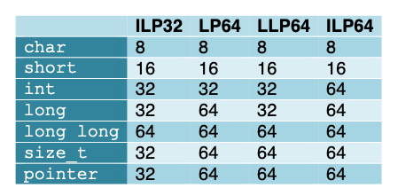

# signalを実装

## kernelでlibcのヘッダファイルを使わないよう変更

- 立ち上がらなくなる

```
iinit: ok
initlog: ok
init log success
syscall: pid=1, x0=0x10, x1=0x14, x2=0x20, x3=0x0 x4=0x0
Unexpected syscall #0
kern/console.c:250: kernel panic at cpu 0.

(gdb) p *p->tf
$1 = {
  q0 = 0,
  tpidr_el0 = 0,
  tpidr_el0_copy = 0,
  sp_el0 = 0,
  spsr_el1 = 0,
  elr_el1 = 0,
  x0 = 16,
  x1 = 20,
  x2 = 32,
  x3 = 0,
  x4 = 0,
  x5 = 0,
  x6 = 0,
  x7 = 0,
  x8 = 0,
  x9 = 221,                     // SYS_execve: ひとつずれている
  x10 = 0,

(gdb) p *p
$2 = {
  sz = 4096,
  pgdir = 0xffff00003b3de000,
  kstack = 0xffff00003b3df000 "",
  state = RUNNING,
  pid = 1,
  parent = 0x0,
  tf = 0xffff00003b3dfed8,
  context = 0xffff00003b3dfd48,
  chan = 0x0,
  killed = 0,
  xstate = 0,
  fdflag = 0,
  name = "initcode\000\000\000\000\000\000\000",

(gdb) x/16xg $sp
0xffff00003b3dfe48:	0xffff00003b3dfe78	0xffff000000081fb8
0xffff00003b3dfe58:	0x0000000000000000	0xffff00003b3dfed8
0xffff00003b3dfe68:	0xffff00003b3dfec8	0xffff0000008d8438
0xffff00003b3dfe78:	0x0000000000000000	0xffff00000008ab94
0xffff00003b3dfe88:	0x0000000000000000	0x0000000000000000
0xffff00003b3dfe98:	0x0000000000000000	0xffff00003b3dfe28
0xffff00003b3dfea8:	0x0000000000000000	0xffff00003b3dfed8
0xffff00003b3dfeb8:	0x0000000000000000	0x0000000000000000
(gdb)
0xffff00003b3dfec8:	0x0000000056000000	0x0000001500000000
0xffff00003b3dfed8:	0x0000000000000000	0x0000000000000000
0xffff00003b3dfee8:	0x0000000000000000	0x0000000000000000
0xffff00003b3dfef8:	0x0000000000000000	0x0000000000000000
0xffff00003b3dff08:	0x0000000000000010	0x0000000000000014
0xffff00003b3dff18:	0x0000000000000020	0x0000000000000000
0xffff00003b3dff28:	0x0000000000000000	0x0000000000000000
0xffff00003b3dff38:	0x0000000000000000	0x0000000000000000
(gdb)
0xffff00003b3dff48:	0x0000000000000000	0x00000000000000dd

(gdb) info registers
x0             0x0                 0
x1             0xffff00003b3dfed8  -281473982791976
x2             0x0                 0
x3             0x10                16
x4             0x0                 0
x5             0x0                 0
x6             0x0                 0
x7             0x0                 0
x8             0xdd                221      // レジスタ上は正しい
```

### `struct trapframe`の`q0`の型を独自定義した`uint128_t｀にしたのが原因だった

- `__uint128_t`（この型はgnu拡張らしい）に戻したら直った
- そもそも、aarch64のlong longは64ビットで128ビットではなかった



```
(gdb) p *tf
$1 = {
  q0 = 0,
  tpidr_el0 = 0,
  tpidr_el0_copy = 0,
  sp_el0 = 4096,
  spsr_el1 = 0,
  elr_el1 = 16,
  x0 = 20,
  x1 = 32,
  x2 = 0,
  x3 = 0,
  x4 = 0,
  x5 = 0,
  x6 = 0,
  x7 = 0,
  x8 = 221,

(gdb) info reg
x0             0xffff0000008d7d38  -281474967438024
x1             0xffff0000008d7ce0  -281474967438112
x2             0x0                 0
x3             0x10                16
x4             0x0                 0
x5             0x0                 0
x6             0x0                 0
x7             0x0                 0
x8             0xdd                221

(gdb) p *p
$2 = {
  sz = 4096,
  pgdir = 0xffff00003b3de000,
  kstack = 0xffff00003b3df000 "",
  state = RUNNING,
  pid = 1,
  parent = 0x0,
  tf = 0xffff00003b3dfed0,
  context = 0xffff00003b3dfd40,
  chan = 0x0,
  killed = 0,
  xstate = 0,
  fdflag = 0,
  name = "initcode\000\000\000\000\000\000\000",

(gdb) x/16xg $sp
0xffff00003b3dfe40:	0xffff00003b3dfe70	0xffff000000081fb0
0xffff00003b3dfe50:	0x0000000000000000	0xffff00003b3dfed0
0xffff00003b3dfe60:	0xffff00003b3dfec0	0xffff0000008d7d38
0xffff00003b3dfe70:	0x0000000000000000	0xffff00000008a08c
0xffff00003b3dfe80:	0x0000000000000000	0x0000000000000000
0xffff00003b3dfe90:	0x0000000000000000	0xffff00003b3dfe20
0xffff00003b3dfea0:	0x0000000000000000	0xffff00003b3dfed0
0xffff00003b3dfeb0:	0x0000000000000000	0x0000000000000000
(gdb)
0xffff00003b3dfec0:	0x0000000056000000	0x0000001500000000
0xffff00003b3dfed0:	0x0000000000000000	0x0000000000000000
0xffff00003b3dfee0:	0x0000000000000000	0x0000000000000000
0xffff00003b3dfef0:	0x0000000000001000	0x0000000000000000
0xffff00003b3dff00:	0x0000000000000010	0x0000000000000014
0xffff00003b3dff10:	0x0000000000000020	0x0000000000000000
0xffff00003b3dff20:	0x0000000000000000	0x0000000000000000
0xffff00003b3dff30:	0x0000000000000000	0x0000000000000000
(gdb)
0xffff00003b3dff40:	0x0000000000000000	0x00000000000000dd
0xffff00003b3dff50:	0x0000000000000000	0x0000000000000000
0xffff00003b3dff60:	0x0000000000000000	0x0000000000000000
0xffff00003b3dff70:	0x0000000000000000	0x0000000000000000
0xffff00003b3dff80:	0x0000000000000000	0x0000000000000000
0xffff00003b3dff90:	0x0000000000000000	0x0000000000000000
0xffff00003b3dffa0:	0x0000000000000000	0x0000000000000000
0xffff00003b3dffb0:	0x0000000000000000	0x0000000000000000
```

## カーネルとユーザのヘッダファイルを完全に分離

- kernで使用するものはすべてincで宣言
- userで使用するものはすべてlibcから。カーネル側の必要な定義はファイル内で再定義。

```
iinit: ok
initlog: ok
init log success
init: starting sh
acquire: spinlock (null) already held
kern/console.c:250: kernel panic at cpu 0.
```

### siglockのリリース忘れだった

- `mkdir`と`rm`でエラー

```
$ ls -l
total 0

---------- 1 4448256 0 117032 Feb 18  1970 cat
?--------- 1 4448256 0      0 Feb 18  1970 console
..
$ cat > test
aa
aa
bb
cc
cc
$ cat test
aa
aa
bb
cc
cc
$ uniq -c test
      2 aa
      1 bb
      2 cc
      1
$ head -3 test
aa
aa
bb
$ tail -3 test
$ uname -a
xv6  1.0.1 2021-09-15 (oldmalloc) AArch64 GNU/Linux
$ mv test test2
$ ls
cat	 echo	       ls	 mmaptest2  mywc   sh	 tee	uniq
console  getdentstest  mkdir	 mv	    pwd    sort  test2	wc
cp	 head	       mkfs	 mycat	    rm	   sync  touch
dash	 init	       mmaptest  myls	    rmdir  tail  uname
$ mkdir dir1/dir2
mkdir: cannot create directory ‘dir1/dir2’: Operation not permitted   // エラー
$ ls
cat	 echo	       ls	 mmaptest2  mywc   sh	 tee	uniq
console  getdentstest  mkdir	 mv	    pwd    sort  test2	wc
cp	 head	       mkfs	 mycat	    rm	   sync  touch
dash	 init	       mmaptest  myls	    rmdir  tail  uname
$ rm test
rm: cannot remove 'test': Operation not permitted                     // エラー
$ cp test2 test3
$ ls
cat	 echo	       ls	 mmaptest2  mywc   sh	 tee	uname
console  getdentstest  mkdir	 mv	    pwd    sort  test2	uniq
cp	 head	       mkfs	 mycat	    rm	   sync  test3	wc
dash	 init	       mmaptest  myls	    rmdir  tail  touch
$
```

## fstatのmodeを実装したら立ち上がらなくなった

- パターン1 （多い）

```
execve: 'sh' start
called sys_rt_sigprocmask
called sys_rt_sigprocmask
called sys_writev
called sys_wait4
data abort: insruction 0x91360, fault addr 0x80000000, dfs=5
```

- パターン2

```
execve: 'sh' start
called sys_rt_sigprocmask
called sys_rt_sigprocmask
unexpected interrupt 0 at cpu 0
Synchronous: Unknown:
  ESR_EL1 0x0 ELR_EL1 0xffff000000946648    // ffff000000946630 B q
  SPSR_EL1 0xa00003c5 FAR_EL1 0x0           // ffff000000946660 B bcache
	irq_error: irq of type 8 unimplemented.
```

### `sigset_t`の定義を変えたら直った

```diff
diff --git a/inc/signal.h b/inc/signal.h
index 434f91b..3c1480e 100644
--- a/inc/signal.h
+++ b/inc/signal.h
@@ -59,9 +59,7 @@ typedef void (*sighandler_t)(int);
 #define SIG_SETMASK   2


-typedef struct {
-    unsigned long __bits[128/sizeof(long)];
-} sigset_t;
+typedef unsigned long   sigset_t;

 struct sigaction {
     sighandler_t    sa_handler;
```

```
$ ls
cat	 echo	       ls	 mmaptest2  mywc   sh	 tee	wc
console  getdentstest  mkdir	 mv	    pwd    sort  touch
cp	 head	       mkfs	 mycat	    rm	   sync  uname
dash	 init	       mmaptest  myls	    rmdir  tail  uniq
$ ls -l
total 3513

?--------- 1 4448256 0     117032 Feb 18  1970 cat
crwxrwxrwx 1 4448256 0 1012, 1232 Feb 18  1970 console      // mknodにmodeをセット
?--------- 1 4448256 0     227168 Feb 18  1970 cp
$ dash                                                      // dashはストール
```

## `mkmf`でファイルにmodeをつける

- dinodeが68バイトになりページサイズが割り切れなくなったので60バイトのダミーを入れて128バイトとした
- すごい無駄だが、いずれもう少しフィールドは増えるか?
- dashは相変わらずストール

```
$ ls -l
total 3513                                                // トータルブロックが出力されている

-rwxrwxrwx 1 4448256 0     117032 Feb 18  1970 cat        // ファイルmodeが出力されている
crwxrwxrwx 1 4448256 0 1012, 1232 Feb 18  1970 console
-rwxrwxrwx 1 4448256 0     227168 Feb 18  1970 cp
-rwxrwxrwx 1 4448256 0     253104 Feb 18  1970 dash
...

$ cat > test
$ ls -l test
?--sr-S--- 1       0 0         15 Feb 18  1970 test       // modeがめちゃくちゃ
```

## `user/sh/main.c`を修正

```
$ cat > test
$ ls -l test
-rw-rw-rw- 1 4328172 0 15 Feb 21  1970 test
```

## `ls -l`時のconsoleのmajor, mainorがおかしい

```
crwxrwxrwx 1 4448256 0 1012, 1232 Feb 18  1970 console
```

- `makedev(x,y)`, `major(dev)`, `minor(dev)`の各マクロを`stat.h`にコピーして使用
- `ls -l`でmajor, minor番号を表示するの使用する`struct stat`のフィールドは`st_rdev`だった。


```
$ ls -l
total 3265

-rwxrwxrwx 1 4448256 0 117032 Feb 18  1970 cat
crwxrwxrwx 1 4448256 0   1, 1 Feb 18  1970 console
-rwxrwxrwx 1 4448256 0 227168 Feb 18  1970 cp
```

# `tail`で何も表示されない問題

- 依然として原因不明

```
$ tail -3 test
called sys_rt_sigprocmask, pid=6
called sys_rt_sigprocmask, pid=6
called sys_clone, pid=6
called sys_gettid, pid=8
called sys_rt_sigprocmask, pid=8
called sys_rt_sigprocmask, pid=8
called sys_exec, pid=8
called sys_rt_sigprocmask, pid=6
called sys_rt_sigprocmask, pid=6
called sys_wait4, pid=6
called sys_gettid, pid=8
called sys_brk, pid=8
called sys_brk, pid=8
called sys_openat, pid=8    // tail_file()
called sys_fstat, pid=8     // tail_lines()
called sys_lseek, pid=8     // file_files(): start_pos = lseek (fd, 0, SEEK_CUR)
called sys_lseek, pid=8     // file_files(): end_pos = lseek (fd, 0, SEEK_END)
called sys_lseek, pid=8     // xlseek(): off_t new_offset = lseek (fd, offset, whence);
called sys_read, pid=8
called sys_close, pid=8
called sys_close, pid=8
called sys_close, pid=8
called sys_exit, pid=8
called sys_writev, pid=6
```

```
(gdb) p r
$6 = 13
(gdb) x/16b addr
0x40d9d0:	0x74	0x61	0x69	0x6c	0x20	0x2d	0x33	0x20    // tail -3 test
0x40d9d8:	0x74	0x65	0x73	0x74	0x0a	0x00	0x00	0x00

(gdb) p r
$10 = 0
(gdb) x/16b addr
0x4274e0:	0x88	0x3b	0x42	0x00	0x00	0x00	0x00	0x00    // なにかのゴミ
0x4274e8:	0x88	0x3b	0x42	0x00	0x00	0x00	0x00	0x00
```

```
$ tail -3 test
sys_lseek: fd=3, offset: 0, whence=1  // SEEK_CUR
sys_lseek: fd=3, offset: 0, whence=2  // SEEK_END
sys_lseek: fd=3, offset: 15, whence=0 // SEEK_SET
sys_close: fd=3
sys_close: fd=1
sys_close: fd=2
$
```

## `tail.c`のバグだったような

- 以下の修正で動くようになった

```diff
diff --git a/coreutils-8.32/src/tail.c b/coreutils-8.32/src/tail.c
index 1c88723..ae6363a 100644
--- a/coreutils-8.32/src/tail.c
+++ b/coreutils-8.32/src/tail.c
@@ -1931,7 +1931,7 @@ tail_lines (const char *pretty_filename, int fd, uintmax_t n_lines,
          which lseek (... SEEK_END) works.  */
       if ( ! presume_input_pipe
            && S_ISREG (stats.st_mode)
-           && (start_pos = lseek (fd, 0, SEEK_CUR)) != -1
+           && (start_pos = lseek (fd, 0, SEEK_SET)) != -1
            && start_pos < (end_pos = lseek (fd, 0, SEEK_END)))
         {
           *read_pos = end_pos;
```

```
$ cat > test
aa
aa
bb
cc
cc
$ tail -3 test
bb
cc
cc
$ tail test
aa
aa
bb
cc
cc
$ tail -n +2 test
aa
bb
cc
cc
$ tail --bytes=5 test
c
cc
```

## `tail.c`のバグではなく、`sys_lseek()`のバグだった

- switchのcase文で一箇所breakを忘れていた
- tail.cはrevert

### 修正前

```
$ tail -3 test
sys_openat: fd=3, readable=1, writable=0, flags=0x20000, off=0
sys_lseek: fd=3, offset: 0, whence=1
open: f->off=15
sys_lseek: fd=3, offset: 0, whence=1
f_off=15
sys_lseek: fd=3, offset: 0, whence=0
sys_lseek: fd=3, offset: 0, whence=2
sys_lseek: fd=3, offset: 0, whence=0
bb
cc
cc
```

### 修正後

```
$ tail -3 test
sys_openat: fd=3, readable=1, writable=0, flags=0x20000, off=0
sys_lseek: fd=3, offset: 0, whence=1
open: f->off=0
sys_lseek: fd=3, offset: 0, whence=1
f_off=0
sys_lseek: fd=3, offset: 0, whence=0
sys_lseek: fd=3, offset: 0, whence=2
sys_lseek: fd=3, offset: 0, whence=0
bb
cc
cc
```

# shで`>>`(追加モード)が動作しない

```
$ cat test
aa
bb
$ cat >> test
ab
bc
$ cat test
ab
bc
```

## `>>`時のopen()のflags引数に`O_APPEND`が指定されていなかった

```
$ cat test
aa
bb
$ cat >> test
ab
bc
$ cat test
aa
bb
ab
bc
```


# `dash`がストール

- dashをshから実行するとストール
- shの代わりにinitから実行してもストール

```
$ dash
called sys_rt_sigprocmask, pid=6
called sys_rt_sigprocmask, pid=6
called sys_clone, pid=6
called sys_gettid, pid=8
called sys_rt_sigprocmask, pid=8
called sys_rt_sigprocmask, pid=8
called sys_exec, pid=8
called sys_rt_sigprocmask, pid=6
called sys_rt_sigprocmask, pid=6
called sys_wait4, pid=6
called sys_gettid, pid=8
called sys_getpid, pid=8
called sys_rt_sigprocmask, pid=8
called sys_rt_sigaction, pid=8
called sys_getuid, pid=8
called sys_getppid, pid=8
called sys_brk, pid=8
called sys_brk, pid=8
called sys_getcwd, pid=8
called sys_ioctl, pid=8
called sys_ioctl, pid=8
called sys_rt_sigaction, pid=8
called sys_rt_sigaction, pid=8
called sys_rt_sigaction, pid=8
called sys_rt_sigaction, pid=8
called sys_rt_sigaction, pid=8
called sys_rt_sigaction, pid=8
called sys_openat, pid=8
called sys_ioctl, pid=8
called sys_fcntl, pid=8
called sys_close, pid=8
called sys_fcntl, pid=8
called sys_ioctl, pid=8
called sys_getpgid, pid=8
called sys_kill, pid=8          // kill?
```

- `init`から直接呼び出してみたが、結果は同じ

```
iinit: ok
initlog: ok
init log success
called sys_exec, pid=1
called sys_gettid, pid=1
called sys_openat, pid=1
called sys_mknodat, pid=1
mknod: major: 1, minor: 1
called sys_openat, pid=1
called sys_dup, pid=1
called sys_dup, pid=1
called sys_ioctl, pid=1
called sys_writev, pid=1
init: starting sh
called sys_rt_sigprocmask, pid=1
called sys_rt_sigprocmask, pid=1
called sys_clone, pid=1
called sys_gettid, pid=6
called sys_rt_sigprocmask, pid=6
called sys_rt_sigprocmask, pid=6
called sys_exec, pid=6
called sys_rt_sigprocmask, pid=1
called sys_rt_sigprocmask, pid=1
called sys_wait4, pid=1
called sys_gettid, pid=6
called sys_getpid, pid=6
called sys_rt_sigprocmask, pid=6
called sys_rt_sigaction, pid=6
called sys_getuid, pid=6
called sys_getppid, pid=6
called sys_brk, pid=6
called sys_brk, pid=6
called sys_getcwd, pid=6
called sys_ioctl, pid=6
called sys_ioctl, pid=6
called sys_rt_sigaction, pid=6
called sys_rt_sigaction, pid=6
called sys_rt_sigaction, pid=6
called sys_rt_sigaction, pid=6
called sys_rt_sigaction, pid=6
called sys_rt_sigaction, pid=6
called sys_openat, pid=6
called sys_ioctl, pid=6
called sys_fcntl, pid=6
called sys_close, pid=6
called sys_fcntl, pid=6
called sys_ioctl, pid=6
called sys_getpgid, pid=6
called sys_kill, pid=6
```

## `sys_kill`の内容

- 端末制御を考えないとだめみたいなのでペンディング

```
$ dash
sys_kill: pid=0, sig=21     // 21: SIGTTIN
```

# RTCを導入する

- Raspberry Pi用RTC（DS1307）を購入
- `i2c`, `rtc`, `ds3231`ドライバを作成
- `SYS_clock_gettime`を実装

```
$ date
sys_clock_getime: id: 0, tp: 0x42aee8     // ここでスタック
```

## `sys_clock_getime()`内で仮のtimeを変えすスタブでテスト

```
$ date
sys_clock_getime: id: 0, tp: 0x42aee8
Tue Sep 28 09:26:00 UTC 2021              // dateコマンドはOK
```

## i2cがうまく動いてないと思われる

```
$ date
sys_clock_getime: id: 0, tp: 0x42aee8
ds start: i2c send start:
```

## `i2c.c`にバグ発見

```
$ date
sys_clock_getime: id: 0, tp: 0x42aee8
ds start: i2c send start: a b a 1 ok
1 i2c recv start: a a b b b b b b b 1 2 ok
2
ds3231_get_time: secs=7, mins=31, hours=0, mday=1, mon=0, year=0, wday=0
Thu Jan 29 00:31:07 UTC 14610832
```

```
$ date
sys_clock_getime: id: 0, tp: 0x42aee8
1 ds3231_get_time: secs=19, mins=0, hours=1, mday=1, mon=0, year=0, wday=0
Thu Jan 29 01:00:19 UTC 14610832
$ date 0928172421.23
ds3231_set_datetime: send2 error=-1
Tue Sep 28 17:24:23 UTC 2021
$ ls -l
total 4054

sys_clock_getime: id: 0, tp: 0x4404a8
1 ds3231_get_time: secs=6, mins=1, hours=1, mday=1, mon=0, year=0, wday=0
-rwxrwxrwx 1    4448256          0 117032 Feb 18  1970 cat
...
$ date
unexpected interrupt 0 at cpu 0: sp=1000
Synchronous: Unknown:
  ESR_EL1 0x0 ELR_EL1 0x0
 SPSR_EL1 0x0 FAR_EL1 0x442fe0
        irq_error: irq of type 8 unimplemented.

// リスタート

$ date
sys_clock_getime: id: 0, tp: 0x42aee8
1 ds3231_get_time: secs=58, mins=1, hours=1, mday=1, mon=0, year=0, wday=0
Thu Jan 29 01:01:58 UTC 14610832
$ date 0928172621.12
Tue Sep 28 17:26:12 UTC 2021
$ date
sys_clock_getime: id: 0, tp: 0x42aee8  // 書き込まれていない
1 ds3231_get_time: secs=42, mins=3, hours=28, mday=1, mon=0, year=0, wday=0
Fri Jan 30 04:03:42 UTC 14610832
$
```

```
$ date
sys_clock_getime: id: 0, tp: 0x42aee8
ds3231_get_time: secs=35, mins=31, hours=28, mday=1, mon=0, year=0, wday=0
Fri Jan 30 04:31:35 UTC 14610832
$ date 0928175521
sys_clock_setime: id: 0, tp: 0x42aec8
clock_settime: secs=0, mins=55, hours=17, mday=28, mon=8, year=121, wday=2        // int
ds3231_set_time: secs=0, mins=55, hours=17, mday=28, mon=89, year=c1, wday=3      // bsd: yearから100を引いていない
Tue Sep 28 17:55:00 UTC 2021

// restart

$ date
sys_clock_getime: id: 0, tp: 0x42aee8
ds3231_get_time: secs=39, mins=19, hours=3, mday=9, mon=0, year=100, wday=-1      // バッテリバックアップされていない
Thu Jan  1 00:00:00 UTC 1970                                                      // unix time 0で初期化
$ date 0928175821.23
sys_clock_setime: id: 0, tp: 0x42aec8
clock_settime: secs=23, mins=58, hours=17, mday=28, mon=8, year=121, wday=2
ds3231_set_time: secs=23, mins=58, hours=17, mday=28, mon=89, year=c1, wday=3
ds3231_set_datetime: send2 error=-1                                              // このエラーの影響か?
Tue Sep 28 17:58:23 UTC 2021
$ date
sys_clock_getime: id: 0, tp: 0x42aee8
ds3231_get_time: secs=43, mins=20, hours=3, mday=9, mon=0, year=100, wday=-1
Thu Jan  1 00:00:00 UTC 1970                                                      // 更新されていない
```

```
$ date
sys_clock_getime: id: 0, tp: 0x42aee8
ds3231_get_time: secs=45, mins=20, hours=19, mday=9, mon=0, year=100, wday=-1     // (1)
Thu Jan  1 00:00:00 UTC 1970
$ date 0929100021
sys_clock_setime: id: 0, tp: 0x42aec8
clock_settime: secs=0, mins=0, hours=10, mday=29, mon=8, year=121, wday=3
ds3231_set_time: secs=0, mins=0, hours=10, mday=a9, mon=9, year=21, wday=4
Wed Sep 29 10:00:00 UTC 2021
$ date
sys_clock_getime: id: 0, tp: 0x42aee8
ds3231_get_time: secs=30, mins=10, hours=4, mday=9, mon=0, year=0, wday=0         // (2) 1と違うが、設定した値でもない
Thu Jan  1 00:00:00 UTC 1970
```

## ds3231_init()を実装

```
$ date
ds3231_get_time: secs=37, mins=53, hours=10, mday=29, mon=8, year=21, wday=3    // RTCは動いている
Thu Jan  1 00:00:00 UTC 1970                                                    // dataが返されていない
```

```
$ date
ds3231_get_time: secs=12, mins=11, hours=11, mday=29, mon=8, year=21, wday=3    // mdayの世紀フラグがたっていないのでyearに100が足されていない
Thu Jan  1 00:00:00 UTC 1970
$ date 0929111221.12
clock_settime: secs=12, mins=12, hours=11, mday=29, mon=8, year=121, wday=3
ds3231_set_time: secs=12, mins=12, hours=11, mday=a9, mon=9, year=21, wday=4
Wed Sep 29 11:12:12 UTC 2021
$ date
ds3231_get_time: secs=32, mins=4, hours=29, mday=21, mon=8, year=21, wday=0
clock_gettime: tp_sec: -1526151328
Mon Aug 22 05:04:32 UTC 1921
```

```
$ date 0929121121.23
clock_settime: secs=23, mins=11, hours=12, mday=29, mon=8, year=121, wday=3
ds3231_set_time: secs=23, mins=11, hours=12, mday=29, mon=89, year=21, wday=4
Wed Sep 29 12:11:23 UTC 2021
$ date
ds3231_get_time: secs=40, mins=11, hours=12, mday=29, mon=89, year=21, wday=4
ds3231_get_time: secs=40, mins=11, hours=12, mday=29, mon=8, year=121, wday=3   // 正しい
Thu Jan  1 00:00:00 UTC 1970                                                    // おかしい
$ date
ds3231_get_time: secs=14, mins=12, hours=12, mday=29, mon=89, year=21, wday=4
ds3231_get_time: secs=14, mins=12, hours=12, mday=29, mon=8, year=121, wday=3   // RTCは動いている
Thu Jan  1 00:00:00 UTC 1970
```

## バグ修正

```
$ date
ds3231_get_time: secs=23, mins=36, hours=12, mday=29, mon=89, year=21, wday=4
ds3231_get_time: secs=23, mins=36, hours=12, mday=29, mon=8, year=121, wday=3
clock_gettime: tp_sec: 1630240583
Sun Aug 29 12:36:23 UTC 2021
$ date 0929123721.23
clock_settime: secs=23, mins=37, hours=12, mday=29, mon=8, year=121, wday=3
ds3231_set_time: secs=23, mins=37, hours=12, mday=29, mon=89, year=21, wday=4
Wed Sep 29 12:37:23 UTC 2021
$ date
ds3231_get_time: secs=45, mins=37, hours=12, mday=29, mon=89, year=21, wday=4
ds3231_get_time: secs=45, mins=37, hours=12, mday=29, mon=8, year=121, wday=3   // unixtimeへの変換が間違い。正しくは 1632886643
clock_gettime: tp_sec: 1630240665                                               //   このunixtimeは、2021-08-29 21:37:45
Sun Aug 29 12:37:45 UTC 2021                                                    // mon, wdayがおかしい
```

## monの補正が必要だった

```
$ date 0929142821
clock_settime: secs=0, mins=28, hours=14, mday=29, mon=8, year=121, wday=3
ds3231_set_time: secs=0, mins=28, hours=14, mday=29, mon=89, year=21, wday=4
Wed Sep 29 14:28:00 UTC 2021
$ date
ds3231_get_time: secs=14, mins=28, hours=14, mday=29, mon=89, year=21, wday=4
ds3231_get_time: secs=14, mins=28, hours=14, mday=29, mon=8, year=121, wday=3
clock_gettime: tp_sec: 1632925694
Wed Sep 29 14:28:14 UTC 2021
```

## デバッグコメントを削除

```
$ date
Wed Sep 29 14:34:44 UTC 2021
$ date 0929053821                       // UTC時刻を設定
Wed Sep 29 05:38:00 UTC 2021
$ date
Wed Sep 29 05:38:11 UTC 2021
```

# inodeにタイムスタンプを追加

```
struct dinode {
  uint16_t type;                // File type
  uint16_t major;               // Major device number (T_DEV only)
  uint16_t minor;               // Minor device number (T_DEV only)
  uint16_t nlink;               // Number of links to inode in file system
  uint32_t size;                // Size of file (bytes)
  mode_t   mode;                // file mode
  struct timespec atime;
  struct timespec mtime;
  struct timespec ctime;
  uint32_t addrs[NDIRECT+1];    // Data block addresses
  char    _dummy[12];
```
```
ts1: sec=0x61542b30 (1632906032), nsec=0xe2b9391 (237736849)
ts2: sec=0x61542b30 (1632906032), nsec=0xe2b9391 (237736849)
input: 'obj/user/bin/mmaptest2' -> 'mmaptest2'

ts1: sec=0x61542b30 (1632906032), nsec=0xe408627 (239109671)
ts2: sec=0x61542b30 (1632906032), nsec=0xe408627 (239109671)
input: 'obj/user/bin/mkfs' -> 'mkfs'

04120080: 0100 0000 0000 0100 0010 0000 ff81 0000  ................
04120090: 302b 5461 0000 0000 9193 2b0e 0000 0000  0+Ta......+.....
041200a0: 302b 5461 0000 0000 9193 2b0e 0000 0000  0+Ta......+.....
041200b0: 302b 5461 0000 0000 9193 2b0e 0000 0000  0+Ta......+.....
041200c0: 3200 0000 0000 0000 0000 0000 0000 0000  2...............
041200d0: 0000 0000 0000 0000 0000 0000 0000 0000  ................
041200e0: 0000 0000 0000 0000 0000 0000 0000 0000  ................
041200f0: 0000 0000 0000 0000 0000 0000 0000 0000  ................
04120100: 0200 0000 0000 0100 b84b 0100 ff81 0000  .........K......
04120110: 302b 5461 0000 0000 2786 400e 0000 0000  0+Ta....'.@.....
04120120: 302b 5461 0000 0000 2786 400e 0000 0000  0+Ta....'.@.....
04120130: 302b 5461 0000 0000 2786 400e 0000 0000  0+Ta....'.@.....
04120140: 3300 0000 3400 0000 3500 0000 3600 0000  3...4...5...6...
04120150: 3700 0000 3800 0000 3900 0000 3a00 0000  7...8...9...:...
04120160: 3b00 0000 3c00 0000 3d00 0000 3e00 0000  ;...<...=...>...
04120170: 3f00 0000 0000 0000 0000 0000 0000 0000  ?...............
```

```
$ ls -l
total 4058

-rwxrwxrwx 1    4448256          0 117032 Sep 29 09:00 cat            // UTC （mkfsで作成）
-rwxrwxrwx 1    4448256          0 151000 Sep 29 09:00 chmod
crwxrwxrwx 1    4448256          0   1, 1 Sep 29 09:09 console        // consoleはinitで作成なので時間が違う
-rwxrwxrwx 1    4448256          0 227168 Sep 29 09:00 cp
-rwxrwxrwx 1    4448256          0 196376 Sep 29 09:00 date
-rwxrwxrwx 1    4448256          0 101704 Sep 29 09:00 echo
-rwxrwxrwx 1    4448256          0  41096 Sep 29 09:00 getdentstest
-rwxrwxrwx 1    4448256          0 126512 Sep 29 09:00 head
-rwxrwxrwx 1    4448256          0  25384 Sep 29 09:00 init
-rwxrwxrwx 1    4448256          0 122304 Sep 29 09:00 kill
-rwxrwxrwx 1    4448256          0 169488 Sep 29 09:00 ln
-rwxrwxrwx 1    4448256          0 318088 Sep 29 09:00 ls
-rwxrwxrwx 1    4448256          0 129984 Sep 29 09:00 mkdir
-rwxrwxrwx 1    4448256          0  52456 Sep 29 09:00 mkfs
-rwxrwxrwx 1    4448256          0  58120 Sep 29 09:00 mmaptest
-rwxrwxrwx 1          0          0  84920 Sep 29 09:00 mmaptest2
-rwxrwxrwx 1    4448256          0 237608 Sep 29 09:00 mv
-rwxrwxrwx 1    4448256          0  40536 Sep 29 09:00 mycat
-rwxrwxrwx 1    4448256          0  46440 Sep 29 09:00 myls
-rwxrwxrwx 1    4448256          0  40856 Sep 29 09:00 mywc
-rwxrwxrwx 1    4448256          0 165904 Sep 29 09:00 od
-rwxrwxrwx 1    4448256          0 121896 Sep 29 09:00 pwd
-rwxrwxrwx 1    4448256          0 162064 Sep 29 09:00 rm
-rwxrwxrwx 1    4448256          0 112576 Sep 29 09:00 rmdir
-rwxrwxrwx 1    4448256          0  59264 Sep 29 09:00 sh
-rwxrwxrwx 1    4448256          0 260160 Sep 29 09:00 sort
-rwxrwxrwx 1    4448256          0 111592 Sep 29 09:00 sync
-rwxrwxrwx 1    4448256          0 180216 Sep 29 09:00 tail
-rwxrwxrwx 1    4448256          0 118392 Sep 29 09:00 tee
-rw-rw-rw- 1 2150114160 1619274509     15 Sep 29 09:10 test         // cat > test で作成
-rwxrwxrwx 1    4448256          0 188248 Sep 29 09:00 touch
-rwxrwxrwx 1    4448256          0 111464 Sep 29 09:00 uname
-rwxrwxrwx 1    4448256          0 129112 Sep 29 09:00 uniq
-rwxrwxrwx 1    4448256          0 138240 Sep 29 09:00 wc
```

# QEMUで実行できる方策を追加

- ds3231_get/set_datetime()`と`i2c_init()`を条件コンパイルするために`raspi.h`を追加した

```
// QEMUで実行する場合
#undef USING_RASPI

// Raspiで実行する場合
#define USING_RASPI 1
```
