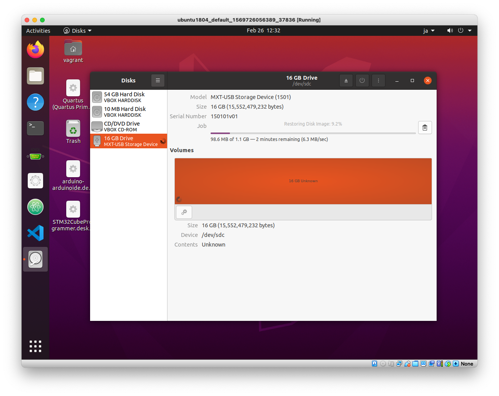
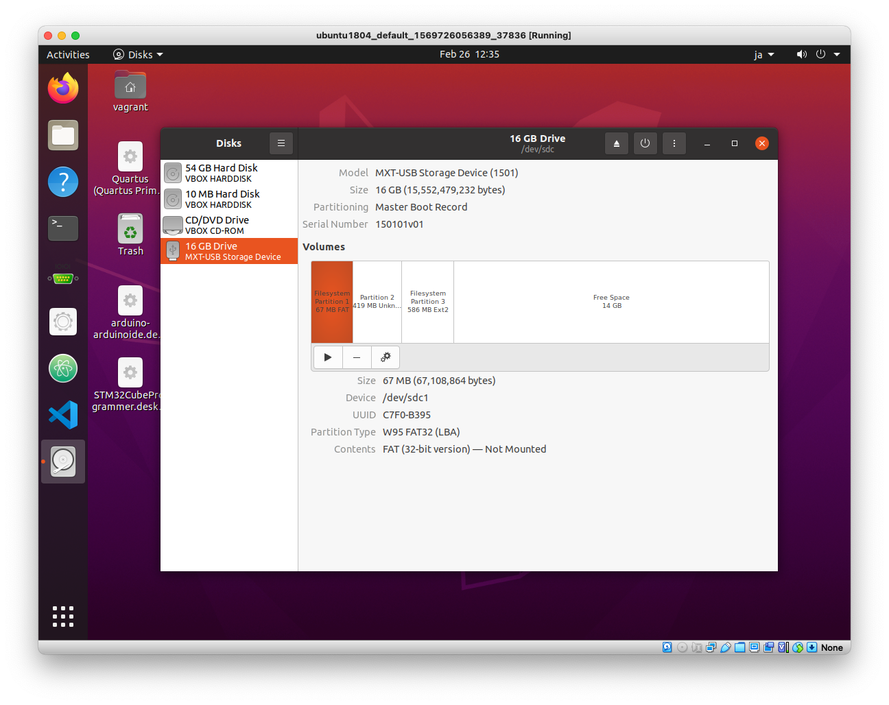

# raspi実機での実行

1. `inc/raspi.h`で`#define USING_RASPI 1`を有効にする
2. `rm -rf obj; make`
3. ubuntuで`Show applications`->`Utilities`->`Disks`を実行
4. sdカードをセット
5. sdカードを初期化
   
6. `Restore Disk Image..`で`obj/sd.img`を選択する
   
7. Disksを終了
8. Ubuntuメニューの`Devices`->`USB`でUSBメモリを選択してubuntuから解除
9.  MacでUSBメモリを取り出す
10. SDカードをraspiにセット
11. minicomを立ち上げ、raspiの電源オン
12. esc-qでminicom終了、raspiの電源オフ
