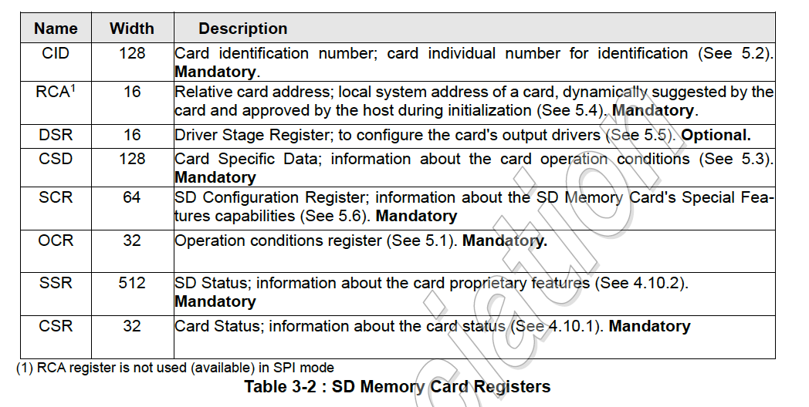

# 容量によるSDカードの区分

- SDSC (Standard):      -   2GB
- SDHC (High):      2GB -  32GB
- SDXC (Extended): 32GB -   2TB
- SDUC (Ultra):     2TB - 128TB

# SDカードレジスタ一覧

# コマンド

## コマンドタイプ

- bc:   broadcast without response
- bcr:  broadcast with response
- ac:   addressed, no data transfer
- adtc: addressed, data transfer
