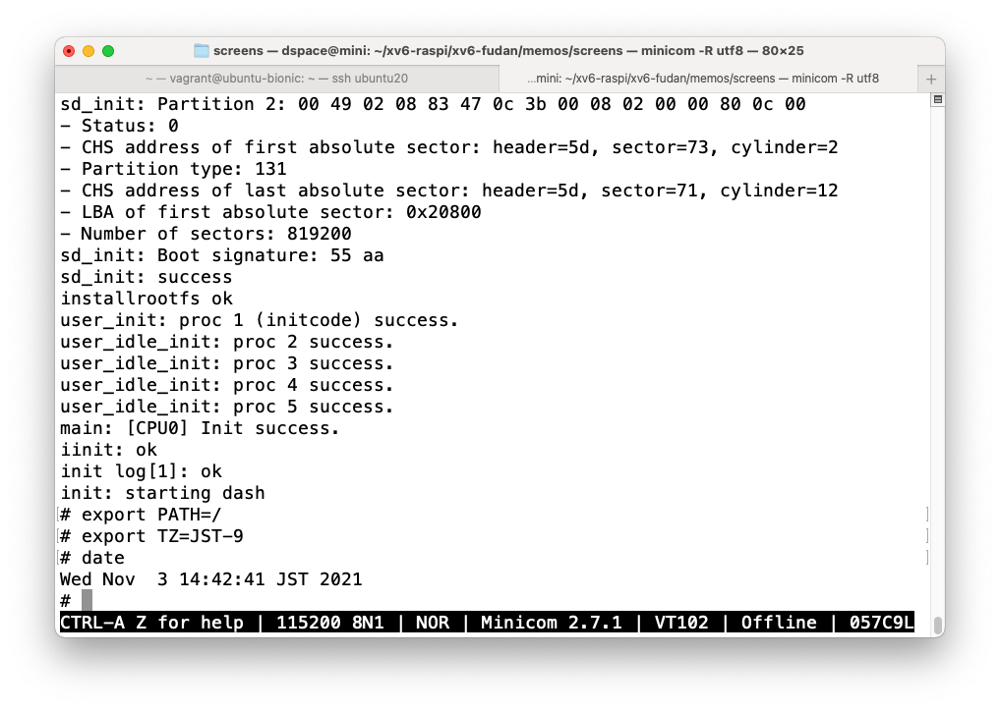
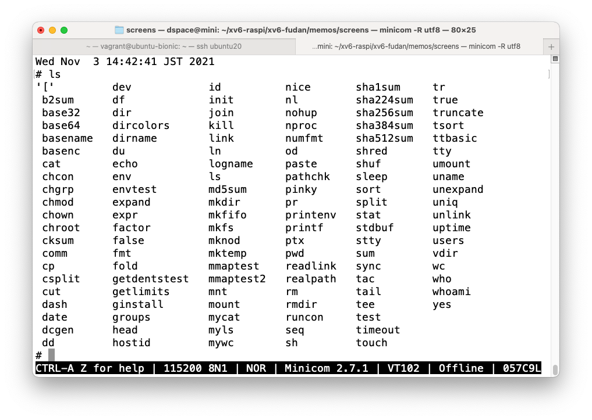
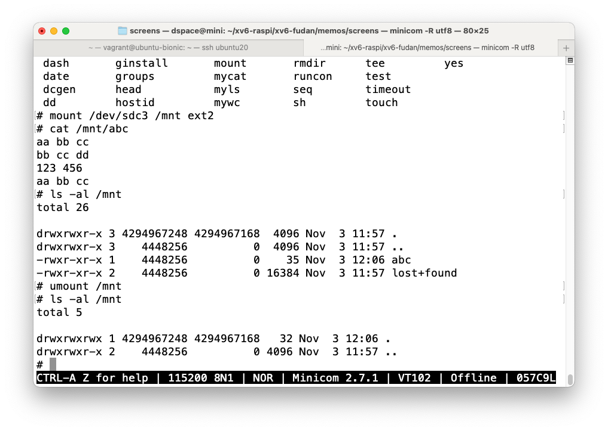

# ext2用のパーティションを追加

```
Disk obj/sd.img: 1 GiB, 1073741824 bytes, 2097152 sectors
Units: sectors of 1 * 512 = 512 bytes
Sector size (logical/physical): 512 bytes / 512 bytes
I/O size (minimum/optimal): 512 bytes / 512 bytes

>>> Created a new DOS disklabel with disk identifier 0xe91e85de.
obj/sd.img1: Created a new partition 1 of type 'W95 FAT32 (LBA)' and of size 64 MiB.
obj/sd.img2: Created a new partition 2 of type 'Linux' and of size 400 MiB.
obj/sd.img3: Created a new partition 3 of type 'Linux' and of size 559 MiB.
obj/sd.img4: Done.

New situation:
Disklabel type: dos
Disk identifier: 0xe91e85de

Device      Boot  Start     End Sectors  Size Id Type
obj/sd.img1        2048  133119  131072   64M  c W95 FAT32 (LBA)
obj/sd.img2      133120  952319  819200  400M 83 Linux
obj/sd.img3      952320 2097151 1144832  559M 83 Linux

The partition table has been altered.
Syncing disks.
dd if=obj/boot.img of=obj/sd.img seek=2048 conv=notrunc
131072+0 records in
131072+0 records out
67108864 bytes (67 MB, 64 MiB) copied, 0.284594 s, 236 MB/s
dd if=obj/fs.img of=obj/sd.img seek=133120 conv=notrunc
800000+0 records in
800000+0 records out
409600000 bytes (410 MB, 391 MiB) copied, 1.66297 s, 246 MB/s
dd if=obj/ext2.img of=obj/sd.img seek=952320 conv=notrunc
61440+0 records in
61440+0 records out
31457280 bytes (31 MB, 30 MiB) copied, 0.138409 s, 227 MB/s
make[1]: Leaving directory '/home/vagrant/xv6-fudan'
```

# `ls dev`でエラー

```
$ ls
cat	 date	       head  ls        mmaptest2  mywc	rmdir  tail   uniq
chmod	 dev	       init  mkdir     mv	  od	sh     tee    wc
console  echo	       kill  mkfs      mycat	  pwd	sort   touch
cp	 getdentstest  ln    mmaptest  myls	  rm	sync   uname
$ ls dev
log_write outside of trans
kern/console.c:252: kernel panic at cpu 0.
```

```
Thread 1 hit Breakpoint 1, log_write (b=0xffff0000001182e8 <bcache+115832>)
    at kern/log.c:257
257	    if (log[b->dev].outstanding < 1)
(gdb) bt
#0  log_write (b=0xffff0000001182e8 <bcache+115832>) at kern/log.c:257
#1  0xffff0000000841d0 in v6_balloc (dev=1) at kern/v6.c:230
#2  0xffff000000084b54 in v6_bmap (ip=0xffff0000000c1e50 <icache+24>, bn=0)
    at kern/v6.c:423
#3  0xffff00000008502c in v6_readi (ip=0xffff0000000c1e50 <icache+24>,
    dst=0xffff00003b3dcd68 "\343?D", off=0, n=16) at kern/v6.c:507
#4  0xffff000000084524 in v6_dirlookup (dp=0xffff0000000c1e50 <icache+24>,
    name=0xffff00003b3dcdf0 "dev", poff=0x0) at kern/v6.c:286
#5  0xffff000000097c9c in namex (path=0x443fe3 "", nameiparent=0,
    name=0xffff00003b3dcdf0 "dev") at kern/vfs.c:508
#6  0xffff000000097df8 in namei (path=0x443fe0 "dev") at kern/vfs.c:538
#7  0xffff00000008cf68 in sys_fstatat () at kern/sysfile.c:390
#8  0xffff00000008bd48 in syscall (tf=0xffff00003b3dced0) at kern/syscall.c:403
#9  0xffff000000082118 in trap (tf=0xffff00003b3dced0) at kern/trap.c:66
#10 0xffff00000008be48 in alltraps () at kern/trapasm.S:52
#11 0x0000000000000000 in ?? ()
Backtrace stopped: not enough registers or memory available to unwind further
```
## `exec.c`で`begin_op, end_op`をせずに`readi`してたのが原因と思われる

```
$ ls -ail
total 4067

 1 -rwxrwxrwx 1       0 0   4096 Oct 13  2021 .
 1 -rwxrwxrwx 1 4448256 0   4096 Oct 13  2021 ..
30 -rwxrwxrwx 1 4448256 0 117032 Oct 13  2021 cat
33 -rwxrwxrwx 1 4448256 0 151000 Oct 13  2021 chmod
38 crwxrwxrwx 1 4448256 0   1, 1 Sep 30  2021 console
15 -rwxrwxrwx 1 4448256 0 227168 Oct 13  2021 cp
34 -rwxrwxrwx 1 4448256 0 196376 Oct 13  2021 date
 2 -rwxrwxrwx 1 4448256 0     80 Oct 13  2021 dev
```

```
# dev inode=2

04120100: 0100 0000 0000 0100 5000 0000 ff81 0000  ........P.......
04120110: 032b 6661 0000 0000 42bc d402 0000 0000  .+fa....B.......
04120120: 032b 6661 0000 0000 42bc d402 0000 0000  .+fa....B.......
04120130: 032b 6661 0000 0000 42bc d402 0000 0000  .+fa....B.......
04120140: 3300 0000 0000 0000 0000 0000 0000 0000  3...............
04120150: 0000 0000 0000 0000 0000 0000 0000 0000  ................
04120160: 0000 0000 0000 0000 0000 0000 0000 0000  ................
04120170: 0000 0000 0000 0000 0000 0000 0000 0000  ................

# sdc1 inode=3
04120180: 0300 0000 0000 0100 0000 0000 ff81 0000  ................
04120190: 032b 6661 0000 0000 7916 d502 0000 0000  .+fa....y.......
041201a0: 032b 6661 0000 0000 7916 d502 0000 0000  .+fa....y.......
041201b0: 032b 6661 0000 0000 7916 d502 0000 0000  .+fa....y.......
041201c0: 0000 0000 0000 0000 0000 0000 0000 0000  ................
041201d0: 0000 0000 0000 0000 0000 0000 0000 0000  ................
041201e0: 0000 0000 0000 0000 0000 0000 0000 0000  ................
041201f0: 0000 0000 0000 0000 0000 0000 0000 0000  ................

# sdc2 inode=4

04120200: 0300 0000 0100 0100 0000 0000 ff81 0000  ................
04120210: 032b 6661 0000 0000 0b49 d502 0000 0000  .+fa.....I......
04120220: 032b 6661 0000 0000 0b49 d502 0000 0000  .+fa.....I......
04120230: 032b 6661 0000 0000 0b49 d502 0000 0000  .+fa.....I......
04120240: 0000 0000 0000 0000 0000 0000 0000 0000  ................
04120250: 0000 0000 0000 0000 0000 0000 0000 0000  ................
04120260: 0000 0000 0000 0000 0000 0000 0000 0000  ................
04120270: 0000 0000 0000 0000 0000 0000 0000 0000  ................

# sdc3 inode=5

04120280: 0300 0000 0200 0100 0000 0000 ff81 0000  ................
04120290: 032b 6661 0000 0000 f37b d502 0000 0000  .+fa.....{......
041202a0: 032b 6661 0000 0000 f37b d502 0000 0000  .+fa.....{......
041202b0: 032b 6661 0000 0000 f37b d502 0000 0000  .+fa.....{......
041202c0: 0000 0000 0000 0000 0000 0000 0000 0000  ................
041202d0: 0000 0000 0000 0000 0000 0000 0000 0000  ................
041202e0: 0000 0000 0000 0000 0000 0000 0000 0000  ................
041202f0: 0000 0000 0000 0000 0000 0000 0000 0000  ................

# direntry

04132000: 0100 2e00 0000 0000 0000 0000 0000 0000  ................
04132010: 0100 2e2e 0000 0000 0000 0000 0000 0000  ................
04132020: 0200 6465 7600 0000 0000 0000 0000 0000  ..dev...........
04132030: 0600 6d6d 6170 7465 7374 3200 0000 0000  ..mmaptest2.....

# data for dev (inode=2)

04133020: 0300 7364 6331 0000 0000 0000 0000 0000  ..sdc1..........
04133030: 0400 7364 6332 0000 0000 0000 0000 0000  ..sdc2..........
04133040: 0500 7364 6333 0000 0000 0000 0000 0000  ..sdc3..........
04133050: 0000 0000 0000 0000 0000 0000 0000 0000  ................
```

## mkfs.cのialloc.cを修正

```
$ ls -ail dev                                           // dev配下を表示しない
2 -rwxrwxrwx 1 4328172 0 80 Oct 13  2021 dev
$ cd dev
$ ../ls -ail
total 7

2 -rwxrwxrwx 1       0 0         80 Oct 13  2021 .
1 -rwxrwxrwx 1 4448256 0       4096 Oct 13  2021 ..
3 brwxrwxrwx 1 4448256 0 1012, 1232 Oct 13  2021 sdc1   // major, minorがつかない
4 brwxrwxrwx 1       0 0    0,    0 Oct 13  2021 sdc2
5 brwxrwxrwx 1       0 0    0,    0 Oct 13  2021 sdc3

$ ls -al ./dev                                          //
total 7
drwxrwxr-x 1 4294967248 4294967168         80 Oct 13  2021 .
drwxrwxr-x 1    4448256          0       4096 Oct 13  2021 ..
brw-rw-rw- 1    4448256          0 1012, 1232 Oct 13  2021 sdc1
brw-rw-rw- 1          0          0    0,    0 Oct 13  2021 sdc2
brw-rw-rw- 1          0          0    0,    0 Oct 13  2021 sdc3
```

```
$ mkdir test
$ ls
ls: cannot open directory '.': No such file or directory
$ ls
execve: 'ls' fail
exec ls failed
```

## そのまま再度実行

```
$ ls -l
total 4059

-rwxrwxrwx 1 4448256 0 117032 Oct 13  2021 cat
-rwxrwxrwx 1 4448256 0 151000 Oct 13  2021 chmod
crwxrwxrwx 1 4448256 0   1, 1 Sep 30  2021 console
-rwxrwxrwx 1 4448256 0 227168 Oct 13  2021 cp
-rwxrwxrwx 1 4448256 0 196376 Oct 13  2021 date
-rwxrwxrwx 1       0 0     80 Oct 13  2021 dev
-rwxrwxrwx 1 4448256 0 101704 Oct 13  2021 echo
-rwxrwxrwx 1 4448256 0  41096 Oct 13  2021 getdentstest
-rwxrwxrwx 1 4448256 0 126512 Oct 13  2021 head
-rwxrwxrwx 1 4448256 0  25384 Oct 13  2021 init
-rwxrwxrwx 1 4448256 0 122304 Oct 13  2021 kill
-rwxrwxrwx 1 4448256 0 169488 Oct 13  2021 ln
-rwxrwxrwx 1 4448256 0 318088 Oct 13  2021 ls
-rwxrwxrwx 1 4448256 0 129984 Oct 13  2021 mkdir
-rwxrwxrwx 1 4448256 0  52456 Oct 13  2021 mkfs
-rwxrwxrwx 1 4448256 0  58120 Oct 13  2021 mmaptest
-rwxrwxrwx 1 4448256 0  84920 Oct 13  2021 mmaptest2
-rwxrwxrwx 1 4448256 0 237608 Oct 13  2021 mv
-rwxrwxrwx 1 4448256 0  40536 Oct 13  2021 mycat
-rwxrwxrwx 1 4448256 0  46440 Oct 13  2021 myls
-rwxrwxrwx 1 4448256 0  40856 Oct 13  2021 mywc
-rwxrwxrwx 1 4448256 0 165904 Oct 13  2021 od
-rwxrwxrwx 1 4448256 0 121896 Oct 13  2021 pwd
-rwxrwxrwx 1 4448256 0 162064 Oct 13  2021 rm
-rwxrwxrwx 1 4448256 0 112576 Oct 13  2021 rmdir
-rwxrwxrwx 1 4448256 0  59264 Oct 13  2021 sh
-rwxrwxrwx 1 4448256 0 260160 Oct 13  2021 sort
-rwxrwxrwx 1 4448256 0 111592 Oct 13  2021 sync
-rwxrwxrwx 1 4448256 0 180216 Oct 13  2021 tail
-rwxrwxrwx 1 4448256 0 118392 Oct 13  2021 tee
drwxrwxrwx 1       0 0     32 Sep 30  2021 test
-rwxrwxrwx 1 4448256 0 188248 Oct 13  2021 touch
-rwxrwxrwx 1 4448256 0 111464 Oct 13  2021 uname
-rwxrwxrwx 1 4448256 0 129112 Oct 13  2021 uniq
-rwxrwxrwx 1 4448256 0 138240 Oct 13  2021 wc
$ ls test
$ ls -l test
total 0
$ echo abc test/abc
abc test/abc
$ echo abc > test/abc
$ cat test/abc
abc
$ ls -l test
total 1

-rw-rw-rw- 1 4294967248 4294967168 4 Sep 30  2021 abc
$ ls -al test
total 6

drwxrwxrwx 1 4294967248 4294967168   48 Sep 30  2021 .
-rwxrwxrwx 2    4448256          0 4096 Oct 13  2021 ..
-rw-rw-rw- 1    4448256          0    4 Sep 30  2021 abc
$ ls -al
total 4068

-rwxrwxrwx 2       0 0   4096 Oct 13  2021 .
-rwxrwxrwx 2 4448256 0   4096 Oct 13  2021 ..
-rwxrwxrwx 1 4448256 0 117032 Oct 13  2021 cat

```

## 最初に`ls ./dev`とすると後はOK、最初に`ls /dev`や`ls dev`とするとだめ。

- `ls ./dev`から

```
$ ls -al ./dev
total 7

drwxrwxr-x 1 4294967248 4294967168         80 Oct 13  2021 .
drwxrwxr-x 1    4448256          0       4096 Oct 13  2021 ..
brw-rw-rw- 1    4448256          0 1012, 1232 Oct 13  2021 sdc1
brw-rw-rw- 1          0          0    0,    0 Oct 13  2021 sdc2
brw-rw-rw- 1          0          0    0,    0 Oct 13  2021 sdc3
$ ls -al /dev
total 7

drwxrwxr-x 1 4294967248 4294967168         80 Oct 13  2021 .
drwxrwxr-x 1    4448256          0       4096 Oct 13  2021 ..
brw-rw-rw- 1    4448256          0 1012, 1232 Oct 13  2021 sdc1
brw-rw-rw- 1          0          0    0,    0 Oct 13  2021 sdc2
brw-rw-rw- 1          0          0    0,    0 Oct 13  2021 sdc3
$ ls -al dev
total 7

drwxrwxr-x 1 4294967248 4294967168         80 Oct 13  2021 .
drwxrwxr-x 1    4448256          0       4096 Oct 13  2021 ..
brw-rw-rw- 1    4448256          0 1012, 1232 Oct 13  2021 sdc1
brw-rw-rw- 1          0          0    0,    0 Oct 13  2021 sdc2
brw-rw-rw- 1          0          0    0,    0 Oct 13  2021 sdc3
```

- `ls /dev`から

```
$ ls -al /dev
ls: cannot open directory '/dev': No such file or directory     // 一度、エラーになると次のコマンドを
$ ls -al ./dev                                                  // 受け付けない
execve: 'ls' fail
exec ls failed
```

- `ls dev`から

```
$ ls -al dev
ls: cannot open directory 'dev': No such file or directory
$ ls -al ./dev
execve: 'ls' fail
exec ls failed
```

## `myls`から入ってもOK

```
$ myls dev
.              41fd 2 80
..             41fd 1 4096
sdc1           61b6 3 0
sdc2           61b6 4 0
sdc3           61b6 5 0
$ ls dev
sdc1  sdc2  sdc3
$ ls -ial dev
total 7

2 drwxrwxr-x 1 4294967248 4294967168         80 Oct 13  2021 .
1 drwxrwxr-x 1    4448256          0       4096 Oct 13  2021 ..
3 brw-rw-rw- 1    4448256          0 1012, 1232 Oct 13  2021 sdc1
4 brw-rw-rw- 1          0          0    0,    0 Oct 13  2021 sdc2
5 brw-rw-rw- 1          0          0    0,    0 Oct 13  2021 sdc3
```

## devでmajor, minorが出力されない件はstati()でのst->st_rdevの設定条件を修正して解決

```
$ ls -al ./dev
total 7

drwxrwxr-x 1 4294967248 4294967168   80 Oct 13  2021 .
drwxrwxr-x 1    4448256          0 4096 Oct 13  2021 ..
brw-rw-rw- 1    4448256          0 0, 0 Oct 13  2021 sdc1
brw-rw-rw- 1          0          0 0, 1 Oct 13  2021 sdc2
brw-rw-rw- 1          0          0 0, 2 Oct 13  2021 sdc3
```

```
$ ls -al dev
argv[0]=ls
argv[1]=-al
argv[2]=dev
ls: cannot open directory 'dev': No such file or directory

$ ls -al ./dev
argv[0]=ls
argv[1]=-al
argv[2]=./dev
total 7

drwxrwxr-x 1 4294967248 4294967168   80 Oct 13  2021 .
drwxrwxr-x 1    4448256          0 4096 Oct 13  2021 ..
brw-rw-rw- 1    4448256          0 0, 0 Oct 13  2021 sdc1
brw-rw-rw- 1          0          0 0, 1 Oct 13  2021 sdc2
brw-rw-rw- 1          0          0 0, 2 Oct 13  2021 sdc3
```

## '/'配下で指定のファイルを検索する

- 正しい

```
$ ls
execve: 'ls' start
- cwd: 1
name: path: ''
dirlookup: dp_inum=1, name='ls', type=1, size=4096
readi: ip=0xffff0000000c1e50, off=0, n=16
bread: dev=1, blockno=50
bget: cache hit
v6_namecmp: s: 'ls', t: '.'
readi: ip=0xffff0000000c1e50, off=16, n=16
```

- 間違い

```
$ mkdir mnt
execve: 'mkdir' start
- cwd: 1
name: path: ''
dirlookup: dp_inum=1, name='mkdir', type=1, size=4096
readi: ip=0xffff0000000c1e50, off=0, n=16
bread: dev=1, blockno=46
bget: new buf
bread: dev=1, blockno=1109
bget: new buf
```

- 成功時

```
$ mkdir mnt
execve: 'mkdir' start
- cwd: 1
bmap: ip: 1, bn=0       // '/'
- ret=50
bmap: ip: 1, bn=0
- ret=50
...
bmap: ip: 19, bn=0      // 'mkdir'
- ret=290
bmap: ip: 19, bn=0
- ret=290
bmap: ip: 19, bn=0
- ret=290
bmap: ip: 19, bn=1
...
bmap: ip: 1, bn=0       // '/'
- ret=50
bmap: ip: 1, bn=0
- ret=50
...
bmap: ip: 40, bn=0      // 'mnt'
- call balloc
v6_balloc: blockno: 46
- b: 0, bi: 1109
- ret=1109
bmap: ip: 40, bn=0
- ret=1109
bmap: ip: 40, bn=0
- ret=1109
bmap: ip: 40, bn=0
- ret=1109
bmap: ip: 1, bn=0
- ret=50
...
```

- 失敗時

```
$ mkidr mnt
execve: 'mkidr' start
- cwd: 1
bmap: ip: 1, bn=0
- call balloc
v6_balloc: blockno: 46
- b: 0, bi: 1109
- ret=1109
v6_dirlookup: name: mkidr not found
namex: ip '1', name: 'mkidr' is not found
execve: 'mkidr' fail
```

```
 1 drwxrwxr-x 1       0 0   4096 Oct 15  2021 .
 1 drwxrwxr-x 1 4448256 0   4096 Oct 15  2021 ..
31 -rwxr-xr-x 1 4448256 0 117032 Oct 15  2021 cat
34 -rwxr-xr-x 1 4448256 0 151000 Oct 15  2021 chmod
39 crwxrwxrwx 1 4448256 0   1, 1 Sep 30  2021 console
16 -rwxr-xr-x 1 4448256 0 227168 Oct 15  2021 cp
35 -rwxr-xr-x 1 4448256 0 196376 Oct 15  2021 date
 2 drwxrwxr-x 1 4448256 0     80 Oct 15  2021 dev
17 -rwxr-xr-x 1 4448256 0 101704 Oct 15  2021 echo
15 -rwxr-xr-x 1 4448256 0  41096 Oct 15  2021 getdentstest
18 -rwxr-xr-x 1 4448256 0 126512 Oct 15  2021 head
 9 -rwxr-xr-x 1 4448256 0  25384 Oct 15  2021 init
36 -rwxr-xr-x 1 4448256 0 122304 Oct 15  2021 kill
37 -rwxr-xr-x 1 4448256 0 169488 Oct 15  2021 ln
32 -rwxr-xr-x 1 4448256 0 318088 Oct 15  2021 ls
19 -rwxr-xr-x 1 4448256 0 129984 Oct 15  2021 mkdir
 7 -rwxr-xr-x 1 4448256 0  52456 Oct 15  2021 mkfs
11 -rwxr-xr-x 1 4448256 0  58120 Oct 15  2021 mmaptest
 6 -rwxr-xr-x 1 4448256 0  84920 Oct 15  2021 mmaptest2
10 -rwxr-xr-x 1 4448256 0  16920 Oct 15  2021 mount
20 -rwxr-xr-x 1 4448256 0 237608 Oct 15  2021 mv
 8 -rwxr-xr-x 1 4448256 0  40536 Oct 15  2021 mycat
13 -rwxr-xr-x 1 4448256 0  46440 Oct 15  2021 myls
14 -rwxr-xr-x 1 4448256 0  40856 Oct 15  2021 mywc
38 -rwxr-xr-x 1 4448256 0 165904 Oct 15  2021 od
33 -rwxr-xr-x 1 4448256 0 121896 Oct 15  2021 pwd
21 -rwxr-xr-x 1 4448256 0 162064 Oct 15  2021 rm
22 -rwxr-xr-x 1 4448256 0 112576 Oct 15  2021 rmdir
12 -rwxr-xr-x 1 4448256 0  59264 Oct 15  2021 sh
23 -rwxr-xr-x 1 4448256 0 260160 Oct 15  2021 sort
24 -rwxr-xr-x 1 4448256 0 111592 Oct 15  2021 sync
25 -rwxr-xr-x 1 4448256 0 180216 Oct 15  2021 tail
26 -rwxr-xr-x 1 4448256 0 118392 Oct 15  2021 tee
27 -rwxr-xr-x 1 4448256 0 188248 Oct 15  2021 touch
28 -rwxr-xr-x 1 4448256 0 111464 Oct 15  2021 uname
29 -rwxr-xr-x 1 4448256 0 129112 Oct 15  2021 uniq
30 -rwxr-xr-x 1 4448256 0 138240 Oct 15  2021 wc
```

```
nmeta 110 (boot, super, log blocks 90 inode blocks 14, bitmap blocks 4) blocks 99890 total 100000
```


```
$ ls
execve: 'ls' start
- cwd: 1
dirlookup: dp_inum=1, name='ls', type=1, size=4096
bread: call sdrw for blockno: 796                       // lsの読み込み
...
bread: call sdrw for blockno: 859
dirlookup: dp_inum=1, name='.', type=1, size=4096
bread: call sdrw for blockno: 50                        // . の読み込み
cat	 date	       head  ls        mmaptest2  myls	rm     sync   uname
chmod	 dev	       init  mkdir     mount	  mywc	rmdir  tail   uniq
console  echo	       kill  mkfs      mv	  od	sh     tee    wc
cp	 getdentstest  ln    mmaptest  mycat	  pwd	sort   touch
$ mkdir mnt
execve: 'mkdir' start
- cwd: 1
dirlookup: dp_inum=1, name='mkdir', type=1, size=4096
bmp: call balloc for bn: 0
v6_balloc: blockno: 46
bread: call sdrw for blockno: 46
bread: call sdrw for blockno: 1109
- b: 0, bi: 1109
v6_dirlookup: name: mkdir not found
namex: ip '1', name: 'mkdir' is not found
execve: 'mkdir' fail
bread: call sdrw for blockno: 3
bread: call sdrw for blockno: 4
bread: call sdrw for blockno: 2
exec mkdir failed
```

```
$ ls -lai
execve: 'ls' start
- cwd: 1
dirlookup: dp_inum=1, name='ls', type=1, size=4096
bread: call sdrw for blockno: 856                   // ls の読み込み
...
bread: call sdrw for blockno: 919
dirlookup: dp_inum=1, name='.', type=1, size=4096
bread: call sdrw for blockno: 110                   // . の読み込み
dirlookup: dp_inum=1, name='.', type=1, size=4096
dirlookup: dp_inum=1, name='etc', type=1, size=4096 // etc の検索（所有権を表示するためと思われる）
v6_dirlookup: name: etc not found
namex: ip '1', name: 'etc' is not found
dirlookup: dp_inum=1, name='etc', type=1, size=4096
v6_dirlookup: name: etc not found
namex: ip '1', name: 'etc' is not found
dirlookup: dp_inum=1, name='..', type=1, size=4096
dirlookup: dp_inum=1, name='etc', type=1, size=4096
v6_dirlookup: name: etc not found
namex: ip '1', name: 'etc' is not found
dirlookup: dp_inum=1, name='dev', type=1, size=4096
bread: call sdrw for blockno: 92                    // dev の読み込み
dirlookup: dp_inum=1, name='mmaptest2', type=1, size=4096   // lsファイルの検索
dirlookup: dp_inum=1, name='mkfs', type=1, size=4096
dirlookup: dp_inum=1, name='mycat', type=1, size=4096
dirlookup: dp_inum=1, name='init', type=1, size=4096
dirlookup: dp_inum=1, name='mount', type=1, size=4096
dirlookup: dp_inum=1, name='mmaptest', type=1, size=4096
dirlookup: dp_inum=1, name='sh', type=1, size=4096
dirlookup: dp_inum=1, name='myls', type=1, size=4096
dirlookup: dp_inum=1, name='mywc', type=1, size=4096
dirlookup: dp_inum=1, name='getdentstest', type=1, size=4096
dirlookup: dp_inum=1, name='cp', type=1, size=4096
dirlookup: dp_inum=1, name='echo', type=1, size=4096
dirlookup: dp_inum=1, name='head', type=1, size=4096
dirlookup: dp_inum=1, name='mkdir', type=1, size=4096
dirlookup: dp_inum=1, name='mv', type=1, size=4096
dirlookup: dp_inum=1, name='rm', type=1, size=4096
dirlookup: dp_inum=1, name='rmdir', type=1, size=4096
dirlookup: dp_inum=1, name='sort', type=1, size=4096
dirlookup: dp_inum=1, name='sync', type=1, size=4096
dirlookup: dp_inum=1, name='tail', type=1, size=4096
dirlookup: dp_inum=1, name='tee', type=1, size=4096
dirlookup: dp_inum=1, name='touch', type=1, size=4096
dirlookup: dp_inum=1, name='uname', type=1, size=4096
dirlookup: dp_inum=1, name='uniq', type=1, size=4096
dirlookup: dp_inum=1, name='wc', type=1, size=4096
dirlookup: dp_inum=1, name='cat', type=1, size=4096
dirlookup: dp_inum=1, name='ls', type=1, size=4096
bread: call sdrw for blockno: 93                        //
dirlookup: dp_inum=1, name='pwd', type=1, size=4096
dirlookup: dp_inum=1, name='chmod', type=1, size=4096
dirlookup: dp_inum=1, name='date', type=1, size=4096
dirlookup: dp_inum=1, name='kill', type=1, size=4096
dirlookup: dp_inum=1, name='ln', type=1, size=4096
dirlookup: dp_inum=1, name='od', type=1, size=4096
dirlookup: dp_inum=1, name='console', type=1, size=4096
total 4084

dirlookup: dp_inum=1, name='etc', type=1, size=4096
v6_dirlookup: name: etc not found
namex: ip '1', name: 'etc' is not found
 1 drwxrwxr-x 1       0 0   4096 Oct 15  2021 .
 1 drwxrwxr-x 1 4448256 0   4096 Oct 15  2021 ..
31 -rwxr-xr-x 1 4448256 0 117032 Oct 15  2021 cat
34 -rwxr-xr-x 1 4448256 0 151000 Oct 15  2021 chmod
39 crwxrwxrwx 1 4448256 0   1, 1 Sep 30  2021 console
16 -rwxr-xr-x 1 4448256 0 227168 Oct 15  2021 cp
35 -rwxr-xr-x 1 4448256 0 196376 Oct 15  2021 date
 2 drwxrwxr-x 1 4448256 0     80 Oct 15  2021 dev
17 -rwxr-xr-x 1 4448256 0 101704 Oct 15  2021 echo
15 -rwxr-xr-x 1 4448256 0  41096 Oct 15  2021 getdentstest
18 -rwxr-xr-x 1 4448256 0 126512 Oct 15  2021 head
 9 -rwxr-xr-x 1 4448256 0  25384 Oct 15  2021 init
36 -rwxr-xr-x 1 4448256 0 122304 Oct 15  2021 kill
37 -rwxr-xr-x 1 4448256 0 169488 Oct 15  2021 ln
32 -rwxr-xr-x 1 4448256 0 318088 Oct 15  2021 ls
19 -rwxr-xr-x 1 4448256 0 129984 Oct 15  2021 mkdir
 7 -rwxr-xr-x 1 4448256 0  52456 Oct 15  2021 mkfs
11 -rwxr-xr-x 1 4448256 0  58120 Oct 15  2021 mmaptest
 6 -rwxr-xr-x 1 4448256 0  84920 Oct 15  2021 mmaptest2
10 -rwxr-xr-x 1 4448256 0  16920 Oct 15  2021 mount
20 -rwxr-xr-x 1 4448256 0 237608 Oct 15  2021 mv
 8 -rwxr-xr-x 1 4448256 0  40536 Oct 15  2021 mycat
13 -rwxr-xr-x 1 4448256 0  46440 Oct 15  2021 myls
14 -rwxr-xr-x 1 4448256 0  40856 Oct 15  2021 mywc
38 -rwxr-xr-x 1 4448256 0 165904 Oct 15  2021 od
33 -rwxr-xr-x 1 4448256 0 121896 Oct 15  2021 pwd
21 -rwxr-xr-x 1 4448256 0 162064 Oct 15  2021 rm
22 -rwxr-xr-x 1 4448256 0 112576 Oct 15  2021 rmdir
12 -rwxr-xr-x 1 4448256 0  59264 Oct 15  2021 sh
23 -rwxr-xr-x 1 4448256 0 260160 Oct 15  2021 sort
24 -rwxr-xr-x 1 4448256 0 111592 Oct 15  2021 sync
25 -rwxr-xr-x 1 4448256 0 180216 Oct 15  2021 tail
26 -rwxr-xr-x 1 4448256 0 118392 Oct 15  2021 tee
27 -rwxr-xr-x 1 4448256 0 188248 Oct 15  2021 touch
28 -rwxr-xr-x 1 4448256 0 111464 Oct 15  2021 uname
29 -rwxr-xr-x 1 4448256 0 129112 Oct 15  2021 uniq
30 -rwxr-xr-x 1 4448256 0 138240 Oct 15  2021 wc
$ mkdir mnt
execve: 'mkdir' start
- cwd: 1
dirlookup: dp_inum=1, name='mkdir', type=1, size=4096
bread: call sdrw for blockno: 350
bread: call sdrw for blockno: 351
bread: call sdrw for blockno: 352
bread: call sdrw for blockno: 353
bread: call sdrw for blockno: 354
bread: call sdrw for blockno: 355
bread: call sdrw for blockno: 356
bread: call sdrw for blockno: 357
bread: call sdrw for blockno: 358
bread: call sdrw for blockno: 359
bread: call sdrw for blockno: 360
bread: call sdrw for blockno: 361
bread: call sdrw for blockno: 362
bread: call sdrw for blockno: 363
bread: call sdrw for blockno: 364
bread: call sdrw for blockno: 365
bread: call sdrw for blockno: 366
bread: call sdrw for blockno: 367
bread: call sdrw for blockno: 368
bread: call sdrw for blockno: 369
bread: call sdrw for blockno: 370
bread: call sdrw for blockno: 371
bread: call sdrw for blockno: 372
bread: call sdrw for blockno: 373
bread: call sdrw for blockno: 374
dirlookup: dp_inum=1, name='mnt', type=1, size=4096
v6_dirlookup: name: mnt not found
dirlookup: dp_inum=40, name='.', type=1, size=0
v6_dirlookup: name: . not found
bmp: call balloc for bn: 0
v6_balloc: blockno: 106
bread: call sdrw for blockno: 106
bread: call sdrw for blockno: 1170
- b: 0, bi: 1170
dirlookup: dp_inum=40, name='..', type=1, size=16
v6_dirlookup: name: .. not found
dirlookup: dp_inum=1, name='mnt', type=1, size=4096
v6_dirlookup: name: mnt not found
bread: call sdrw for blockno: 3         // log領域のr
bread: call sdrw for blockno: 4
bread: call sdrw for blockno: 5
bread: call sdrw for blockno: 6
bread: call sdrw for blockno: 7
bread: call sdrw for blockno: 2
$ ls
execve: 'ls' start
- cwd: 1
dirlookup: dp_inum=1, name='ls', type=1, size=4096
bread: call sdrw for blockno: 856
...
bread: call sdrw for blockno: 919
dirlookup: dp_inum=1, name='.', type=1, size=4096
bread: call sdrw for blockno: 110
cat	 date	       head  ls        mmaptest2  mycat  pwd	sort  touch
chmod	 dev	       init  mkdir     mnt	  myls	 rm	sync  uname
console  echo	       kill  mkfs      mount	  mywc	 rmdir	tail  uniq
cp	 getdentstest  ln    mmaptest  mv	  od	 sh	tee   wc
$ mount /dev/sdc3 /mnt ext2
execve: 'mount' start
- cwd: 1
dirlookup: dp_inum=1, name='mount', type=1, size=4096
bread: call sdrw for blockno: 92
bread: call sdrw for blockno: 165
bread: call sdrw for blockno: 166
bread: call sdrw for blockno: 167
sys_mount: source: /dev/sdc3, target: /mnt, fstype: ext2
dirlookup: dp_inum=1, name='mnt', type=1, size=4096
dirlookup: dp_inum=1, name='dev', type=1, size=4096
dirlookup: dp_inum=2, name='sdc3', type=1, size=80
bread: call sdrw for blockno: 111
sys_mount: FS type not found
mount: failed to mouting device
$ QEMU: Terminated
```

```
$ ls -l
execve: 'ls' start
- cwd: 1
namei: path: ls
namei: path: .
namei: path: dev
namei: path: /etc/passwd
namei: path: /etc/group
namei: path: mmaptest2
namei: path: /etc/passwd
namei: path: mkfs
namei: path: mycat
namei: path: init
namei: path: mount
namei: path: mmaptest
namei: path: sh
namei: path: myls
namei: path: mywc
namei: path: getdentstest
namei: path: cp
namei: path: echo
namei: path: head
namei: path: mkdir
namei: path: mv
namei: path: rm
namei: path: rmdir
namei: path: sort
namei: path: sync
namei: path: tail
namei: path: tee
namei: path: touch
namei: path: uname
namei: path: uniq
namei: path: wc
namei: path: cat
namei: path: ls
namei: path: pwd
namei: path: chmod
namei: path: date
namei: path: kill
namei: path: ln
namei: path: od
namei: path: console
total 4075

namei: path: /etc/localtime
-rwxr-xr-x 1 4448256 0 117032 Oct 15  2021 cat
-rwxr-xr-x 1 4448256 0 151000 Oct 15  2021 chmod
crwxrwxrwx 1 4448256 0   1, 1 Sep 30  2021 console
-rwxr-xr-x 1 4448256 0 227168 Oct 15  2021 cp
-rwxr-xr-x 1 4448256 0 196376 Oct 15  2021 date
drwxrwxr-x 1       0 0     80 Oct 15  2021 dev
-rwxr-xr-x 1 4448256 0 101704 Oct 15  2021 echo
-rwxr-xr-x 1 4448256 0  41096 Oct 15  2021 getdentstest
-rwxr-xr-x 1 4448256 0 126512 Oct 15  2021 head
-rwxr-xr-x 1 4448256 0  25384 Oct 15  2021 init
-rwxr-xr-x 1 4448256 0 122304 Oct 15  2021 kill
-rwxr-xr-x 1 4448256 0 169488 Oct 15  2021 ln
-rwxr-xr-x 1 4448256 0 318088 Oct 15  2021 ls
-rwxr-xr-x 1 4448256 0 129984 Oct 15  2021 mkdir
-rwxr-xr-x 1 4448256 0  52456 Oct 15  2021 mkfs
-rwxr-xr-x 1 4448256 0  58120 Oct 15  2021 mmaptest
-rwxr-xr-x 1 4448256 0  84920 Oct 15  2021 mmaptest2
-rwxr-xr-x 1 4448256 0  16920 Oct 15  2021 mount
-rwxr-xr-x 1 4448256 0 237608 Oct 15  2021 mv
-rwxr-xr-x 1 4448256 0  40536 Oct 15  2021 mycat
-rwxr-xr-x 1 4448256 0  46440 Oct 15  2021 myls
-rwxr-xr-x 1 4448256 0  40856 Oct 15  2021 mywc
-rwxr-xr-x 1 4448256 0 165904 Oct 15  2021 od
-rwxr-xr-x 1 4448256 0 121896 Oct 15  2021 pwd
-rwxr-xr-x 1 4448256 0 162064 Oct 15  2021 rm
-rwxr-xr-x 1 4448256 0 112576 Oct 15  2021 rmdir
-rwxr-xr-x 1 4448256 0  59264 Oct 15  2021 sh
-rwxr-xr-x 1 4448256 0 260160 Oct 15  2021 sort
-rwxr-xr-x 1 4448256 0 111592 Oct 15  2021 sync
-rwxr-xr-x 1 4448256 0 180216 Oct 15  2021 tail
-rwxr-xr-x 1 4448256 0 118392 Oct 15  2021 tee
-rwxr-xr-x 1 4448256 0 188248 Oct 15  2021 touch
-rwxr-xr-x 1 4448256 0 111464 Oct 15  2021 uname
-rwxr-xr-x 1 4448256 0 129112 Oct 15  2021 uniq
-rwxr-xr-x 1 4448256 0 138240 Oct 15  2021 wc
$ mkdir mnt
execve: 'mkdir' start
- cwd: 1
namei: path: mkdir
bmp: call balloc for bn: 0
v6_balloc: blockno: 106
- b: 0, bi: 1169
$ ls
execve: 'ls' start
- cwd: 1
namei: path: ls
namei: path: .
cat	 date	       head  ls        mmaptest2  mycat  pwd	sort  touch
chmod	 dev	       init  mkdir     mnt	  myls	 rm	sync  uname
console  echo	       kill  mkfs      mount	  mywc	 rmdir	tail  uniq
cp	 getdentstest  ln    mmaptest  mv	  od	 sh	tee   wc
$ mount /dev/sdc3 /mnt ext2
execve: 'mount' start
- cwd: 1
namei: path: mount
sys_mount: source: /dev/sdc3, target: /mnt, fstype: ext2
namei: path: /mnt
namei: path: /dev/sdc3
sys_mount: FS type not found
mount: failed to mouting device
```

```
$ ls
execve: 'ls' start
- cwd: 1
namei: path: ls
namei: path: .
cat	 date	       head  ls        mmaptest2  myls	rm     sync   uname
chmod	 dev	       init  mkdir     mount	  mywc	rmdir  tail   uniq
console  echo	       kill  mkfs      mv	  od	sh     tee    wc
cp	 getdentstest  ln    mmaptest  mycat	  pwd	sort   touch
$ mkdir mnt
execve: 'mkdir' start
- cwd: 1
namei: path: mkdir
bmp: call balloc for bn: 0
v6_balloc: blockno: 106
- b: 0, bi: 1169
execve: 'mkdir' fail
exec mkdir failed
$ ls
execve: 'ls' start
- cwd: 1
namei: path: ls
bmp: call balloc for bn: 0
v6_balloc: blockno: 106
- b: 0, bi: 1170
execve: 'ls' fail
exec ls failed
```

# mount

```
(gdb) p *b
$3 = {
  flags = 3,
  dev = 2,
  blockno = 1,
  bsize = 4096,
  data = "\003\000\000\000\004\000\000\000\005\000\000\000=\035t\a\002\000\004", '\000' <repeats 4076 times>,
  prev = 0xffff000000106888 <bcache+74472>,
  next = 0xffff000000112a68 <bcache+124104>,
  qnext = 0x0
}
```

```
Device      Boot  Start     End Sectors  Size Id Type
obj/sd.img1        2048  133119  131072   64M  c W95 FAT32 (LBA)
obj/sd.img2      133120  952319  819200  400M 83 Linux
obj/sd.img3      952320 2097151 1144832  559M 83 Linux
```

## ext2のsuperblock (0x00000400)

```
00000400: 8007 0000 001e 0000 8001 0000 3d1d 0000  ............=...
00000410: 7407 0000 0000 0000 0200 0000 0200 0000  t...............
00000420: 0080 0000 0080 0000 8007 0000 fe2f 6961  ............./ia
00000430: 5d30 6961 0100 ffff 53ef 0100 0100 0000  ]0ia....S.......
00000440: d2ef 6861 0000 0000 0000 0000 0100 0000  ..ha............
00000450: 0000 0000 0b00 0000 0001 0000 3800 0000  ............8...
00000460: 0200 0000 0300 0000 b22d c643 5820 43bc  .........-.CX C.
00000470: a477 a8c3 12f8 09ef 0000 0000 0000 0000  .w..............
00000480: 0000 0000 0000 0000 2f68 6f6d 652f 7661  ......../home/va
00000490: 6772 616e 742f 7876 362d 6675 6461 6e2f  grant/xv6-fudan/
000004a0: 6d6e 7400 0000 0000 0000 0000 0000 0000  mnt.............
000004b0: 0000 0000 0000 0000 0000 0000 0000 0000  ................
000004c0: 0000 0000 0000 0000 0000 0000 0000 0100  ................
000004d0: 0000 0000 0000 0000 0000 0000 0000 0000  ................
000004e0: 0000 0000 0000 0000 0000 0000 8107 f1d5  ................
000004f0: 86b4 4449 8e70 f7fd f7bd f3b9 0100 0000  ..DI.p..........
00000500: 0c00 0000 0000 0000 d2ef 6861 0000 0000  ..........ha....
00000510: 0000 0000 0000 0000 0000 0000 0000 0000  ................
00000520: 0000 0000 0000 0000 0000 0000 0000 0000  ................
```

### sd.img

```
1d100400: 8007 0000 001e 0000 8001 0000 3d1d 0000  ............=...
1d100410: 7407 0000 0000 0000 0200 0000 0200 0000  t...............
1d100420: 0080 0000 0080 0000 8007 0000 fe2f 6961  ............./ia
1d100430: 5d30 6961 0100 ffff 53ef 0100 0100 0000  ]0ia....S.......
1d100440: d2ef 6861 0000 0000 0000 0000 0100 0000  ..ha............
1d100450: 0000 0000 0b00 0000 0001 0000 3800 0000  ............8...
1d100460: 0200 0000 0300 0000 b22d c643 5820 43bc  .........-.CX C.
1d100470: a477 a8c3 12f8 09ef 0000 0000 0000 0000  .w..............
1d100480: 0000 0000 0000 0000 2f68 6f6d 652f 7661  ......../home/va
1d100490: 6772 616e 742f 7876 362d 6675 6461 6e2f  grant/xv6-fudan/
1d1004a0: 6d6e 7400 0000 0000 0000 0000 0000 0000  mnt.............
1d1004b0: 0000 0000 0000 0000 0000 0000 0000 0000  ................
1d1004c0: 0000 0000 0000 0000 0000 0000 0000 0100  ................
1d1004d0: 0000 0000 0000 0000 0000 0000 0000 0000  ................
1d1004e0: 0000 0000 0000 0000 0000 0000 8107 f1d5  ................
1d1004f0: 86b4 4449 8e70 f7fd f7bd f3b9 0100 0000  ..DI.p..........
1d100500: 0c00 0000 0000 0000 d2ef 6861 0000 0000  ..........ha....
1d100510: 0000 0000 0000 0000 0000 0000 0000 0000  ................
1d100520: 0000 0000 0000 0000 0000 0000 0000 0000  ................

1d101000: 0300 0000 0400 0000 0500 0000 3d1d 7407  ............=.t.
1d101010: 0200 0400 0000 0000 0000 0000 0000 0000  ................
1d101020: 0000 0000 0000 0000 0000 0000 0000 0000  ................
1d101030: 0000 0000 0000 0000 0000 0000 0000 0000  ................
```

## ext2のlogic_sb_blockを調整（1->0）してreadsbは通った

- 別のエラー

```
$ mount /dev/sdc3 /mnt ext2
execve: 'mount' start
- cwd: 1
namei: path: mount
sys_mount: source: /dev/sdc3, target: /mnt, fstype: ext2
namei: path: /mnt
namei: path: /dev/sdc3
ext2: invalid file mode
kern/console.c:252: kernel panic at cpu 0.
```

## ex2_superblockの内容 (blocksize=4096)

```
superblock = {
  s_inodes_count = 1920,
  s_blocks_count = 7680,
  s_r_blocks_count = 384,
  s_free_blocks_count = 7549,
  s_free_inodes_count = 1909,
  s_first_data_block = 0,
  s_log_block_size = 2,
  s_log_frag_size = 2,
  s_blocks_per_group = 32768,
  s_frags_per_group = 32768,
  s_indoes_per_group = 1920,
  s_mtime = 0,
  s_wtime = 1634343669,
  s_mnt_count = 0,
  s_max_mnt_count = 65535,
  s_magic = 61267,
  s_state = 1,
  s_errors = 1,
  s_minor_rev_level = 0,
  s_lastcheck = 1634343669,
  s_checkinterval = 0,
  s_creator_os = 0,
  s_rev_level = 1,
  s_def_resuid = 0,
  s_def_resgid = 0,
  s_first_ino = 11,
  s_inode_size = 256,
  s_block_group_nr = 0,
  s_feature_compat = 56,
  s_feature_incompat = 2,
  s_feature_ro_compat = 3,
  s_uuid = "\003y&i\005\016G*\215\070\201b\266Z", <incomplete sequence \352>,
  s_volume_name = '\000' <repeats 15 times>,
  s_last_mounted = '\000' <repeats 63 times>,
  s_algorithm_usage_bitmap = 0,
  s_prealloc_block = 0 '\000',
  s_prealloc_dir_blocks = 0 '\000',
  s_padding1 = 1,
  s_journal_uuid = '\000' <repeats 15 times>,
  s_journal_inum = 0,
  s_journal_dev = 0,
  s_last_orphan = 0,
  s_hash_seed = {2694647882, 2118886477, 1003855747, 3328844403},
  s_def_hash_version = 1 '\001',
  s_reserved_char_pad = 0 '\000',
  s_reserved_word_pad = 0,
  s_default_mount_opts = 12,
  s_first_meta_bg = 0,
  s_reserved = {1634343669, 0 <repeats 20 times>, 2097184, 1,
    0 <repeats 167 times>}
}
```

###

```
struct ext2_sb_info  = {
  s_inodes_per_block = 16,
  s_blocks_per_group = 32768,
  s_inodes_per_group = 1920,
  s_itb_per_group = 120,
  s_gdb_count = 1,
  s_desc_per_block = 128,
  s_groups_count = 1,
  s_overhead_last = 0,
  s_blocks_last = 0,
  s_sbh = 0xffff000000104838 <bcache+66200>,
  s_es = 0xffff000000104c48 <bcache+67240>,
  s_group_desc = {0xffff000000106888 <bcache+74472>, 0x0 <repeats 39 times>},
  s_sb_block = 0,
  s_pad = 0,
  s_addr_per_block_bits = 10,
  s_desc_per_block_bits = 7,
  s_inode_size = 256,
  s_first_ino = 11,
  s_dir_count = 0,
  s_debts = 0x0,
  flags = 1
}
```

###

```
(gdb) p *(struct ext2_group_desc *)sbi->s_group_desc[0]->data
$4 = {
  bg_block_bitmap = 0,
  bg_inode_bitmap = 0,
  bg_inode_table = 0,
  bg_free_blocks_count = 0,
  bg_free_inodes_count = 0,
  bg_used_dirs_count = 0,
  bg_pad = 0,
  bg_reserved = {0, 0, 0}
}
(gdb) p *(struct buf *)sbi->s_group_desc[0]
$5 = {
  flags = 3,
  dev = 2,
  blockno = 2,
  bsize = 4096,
  data = '\000' <repeats 4095 times>,
  prev = 0xffff0000001078b0 <bcache+78608>,
  next = 0xffff000000112a68 <bcache+124104>,
  qnext = 0x0
}
```

```
00000400: 8007 0000 001e 0000 8001 0000 7d1d 0000  ............}...     // superblock
00000410: 7507 0000 0000 0000 0200 0000 0200 0000  u...............
00000420: 0080 0000 0080 0000 8007 0000 0000 0000  ................
00000430: f51a 6a61 0000 ffff 53ef 0100 0100 0000  ..ja....S.......
00000440: f51a 6a61 0000 0000 0000 0000 0100 0000  ..ja............
00000450: 0000 0000 0b00 0000 0001 0000 3800 0000  ............8...
00000460: 0200 0000 0300 0000 0379 2669 050e 472a  .........y&i..G*
00000470: 8d38 8162 b65a 14ea 0000 0000 0000 0000  .8.b.Z..........
00000480: 0000 0000 0000 0000 0000 0000 0000 0000  ................
00000490: 0000 0000 0000 0000 0000 0000 0000 0000  ................
000004a0: 0000 0000 0000 0000 0000 0000 0000 0000  ................
000004b0: 0000 0000 0000 0000 0000 0000 0000 0000  ................
000004c0: 0000 0000 0000 0000 0000 0000 0000 0100  ................
000004d0: 0000 0000 0000 0000 0000 0000 0000 0000  ................
000004e0: 0000 0000 0000 0000 0000 0000 4a10 9da0  ............J...
000004f0: 4da4 4b7e 839f d53b 7322 6ac6 0100 0000  M.K~...;s"j.....
00000500: 0c00 0000 0000 0000 f51a 6a61 0000 0000  ..........ja....
00000510: 0000 0000 0000 0000 0000 0000 0000 0000  ................
00000520: 0000 0000 0000 0000 0000 0000 0000 0000  ................

00001000: 0300 0000 0400 0000 0500 0000 7d1d 7507  ............}.u.     // block 1: block group descriptors
00001010: 0200 0400 0000 0000 0000 0000 0000 0000  ................
00001020: 0000 0000 0000 0000 0000 0000 0000 0000  ................
00001030: 0000 0000 0000 0000 0000 0000 0000 0000  ................

00002000: 0000 0000 0000 0000 0000 0000 0000 0000  ................     // block 2:
00002010: 0000 0000 0000 0000 0000 0000 0000 0000  ................
00002020: 0000 0000 0000 0000 0000 0000 0000 0000  ................
00002030: 0000 0000 0000 0000 0000 0000 0000 0000  ................
00002040: 0000 0000 0000 0000 0000 0000 0000 0000  ................

00003000: ffff ffff ffff ffff ffff ffff ffff ffff  ................     // block 3: block bitmap
00003010: 0700 0000 0000 0000 0000 0000 0000 0000  ................
00003020: 0000 0000 0000 0000 0000 0000 0000 0000  ................
00003030: 0000 0000 0000 0000 0000 0000 0000 0000  ................
00003040: 0000 0000 0000 0000 0000 0000 0000 0000  ................

000033b0: 0000 0000 0000 0000 0000 0000 0000 0000  ................
000033c0: ffff ffff ffff ffff ffff ffff ffff ffff  ................
000033d0: ffff ffff ffff ffff ffff ffff ffff ffff  ................

00003ff0: ffff ffff ffff ffff ffff ffff ffff ffff  ................

00004000: ff07 0000 0000 0000 0000 0000 0000 0000  ................     // block 4: inode bitmap
00004010: 0000 0000 0000 0000 0000 0000 0000 0000  ................
00004020: 0000 0000 0000 0000 0000 0000 0000 0000  ................
00004030: 0000 0000 0000 0000 0000 0000 0000 0000  ................
00004040: 0000 0000 0000 0000 0000 0000 0000 0000  ................

000040e0: 0000 0000 0000 0000 0000 0000 0000 0000  ................
000040f0: ffff ffff ffff ffff ffff ffff ffff ffff  ................
00004100: ffff ffff ffff ffff ffff ffff ffff ffff  ................

00004ff0: ffff ffff ffff ffff ffff ffff ffff ffff  ................

00005000: 0000 0000 0000 0000 f51a 6a61 f51a 6a61  ..........ja..ja     // block 5: inode table
00005010: f51a 6a61 0000 0000 0000 0000 0000 0000  ..ja............
00005020: 0000 0000 0000 0000 0000 0000 0000 0000  ................
00005030: 0000 0000 0000 0000 0000 0000 0000 0000  ................
00005040: 0000 0000 0000 0000 0000 0000 0000 0000  ................

00005100: ed41 0000 0010 0000 f51a 6a61 f51a 6a61  .A........ja..ja
00005110: f51a 6a61 0000 0000 0000 0300 0800 0000  ..ja............
00005120: 0000 0000 0000 0000 7d00 0000 0000 0000  ........}.......
00005130: 0000 0000 0000 0000 0000 0000 0000 0000  ................
00005140: 0000 0000 0000 0000 0000 0000 0000 0000  ................
00005150: 0000 0000 0000 0000 0000 0000 0000 0000  ................
00005160: 0000 0000 0000 0000 0000 0000 0000 0000  ................
00005170: 0000 0000 0000 0000 0000 0000 0000 0000  ................
00005180: 2000 0000 0000 0000 0000 0000 0000 0000   ...............
00005190: f51a 6a61 0000 0000 0000 0000 0000 0000  ..ja............

00005200: 0000 0000 0000 0000 0000 0000 0000 0000  ................
00005210: 0000 0000 0000 0000 0000 0000 0000 0000  ................
00005220: 0000 0000 0000 0000 0000 0000 0000 0000  ................
00005230: 0000 0000 0000 0000 0000 0000 0000 0000  ................
00005240: 0000 0000 0000 0000 0000 0000 0000 0000  ................

00005300: 0000 0000 0000 0000 0000 0000 0000 0000  ................
00005310: 0000 0000 0000 0000 0000 0000 0000 0000  ................
00005320: 0000 0000 0000 0000 0000 0000 0000 0000  ................
00005330: 0000 0000 0000 0000 0000 0000 0000 0000  ................

00005400: 0000 0000 0000 0000 0000 0000 0000 0000  ................
00005410: 0000 0000 0000 0000 0000 0000 0000 0000  ................
00005420: 0000 0000 0000 0000 0000 0000 0000 0000  ................
00005430: 0000 0000 0000 0000 0000 0000 0000 0000  ................

00005500: 0000 0000 0000 0000 0000 0000 0000 0000  ................
00005510: 0000 0000 0000 0000 0000 0000 0000 0000  ................
00005520: 0000 0000 0000 0000 0000 0000 0000 0000  ................
00005530: 0000 0000 0000 0000 0000 0000 0000 0000  ................

00005600: 8081 0000 00c0 4000 f51a 6a61 f51a 6a61  ......@...ja..ja
00005610: f51a 6a61 0000 0000 0000 0100 1000 0000  ..ja............
00005620: 0000 0000 0000 0000 0000 0000 0000 0000  ................
00005630: 0000 0000 0000 0000 0000 0000 0000 0000  ................
00005640: 0000 0000 0000 0000 0000 0000 0000 0000  ................
00005650: 0000 0000 0000 0000 0000 0000 8200 0000  ................
00005660: 0000 0000 0000 0000 0000 0000 0100 0000  ................
00005670: 0000 0000 0000 0000 0000 0000 0000 0000  ................
00005680: 2000 0000 0000 0000 0000 0000 0000 0000   ...............
00005690: f51a 6a61 0000 0000 0000 0000 0000 0000  ..ja............

00005a00: c041 0000 0040 0000 f51a 6a61 f51a 6a61  .A...@....ja..ja
00005a10: f51a 6a61 0000 0000 0000 0200 2000 0000  ..ja........ ...
00005a20: 0000 0000 0000 0000 7e00 0000 7f00 0000  ........~.......
00005a30: 8000 0000 8100 0000 0000 0000 0000 0000  ................
00005a40: 0000 0000 0000 0000 0000 0000 0000 0000  ................
00005a50: 0000 0000 0000 0000 0000 0000 0000 0000  ................
00005a60: 0000 0000 0000 0000 0000 0000 0000 0000  ................
00005a70: 0000 0000 0000 0000 0000 0000 0000 0000  ................
00005a80: 2000 0000 0000 0000 0000 0000 0000 0000   ...............
00005a90: f51a 6a61 0000 0000 0000 0000 0000 0000  ..ja............
                                                                      // inode---- rlen nlty name-------------------------
1d17d000: 0200 0000 0c00 0102 2e00 0000 0200 0000  ................   // 0200 0000 0c00 0102 2e00 0000
1d17d010: 0c00 0202 2e2e 0000 0b00 0000 1400 0a02  ................   // 0200 0000 0c00 0202 2e2e 0000
1d17d020: 6c6f 7374 2b66 6f75 6e64 0000 0e00 0000  lost+found......   // 0b00 0000 1400 0a02 6c6f 7374 2b66 6f75 6e64 0000
1d17d030: d40f 0301 6162 6300 0000 0000 0000 0000  ....abc.........   // 0e00 0000 d40f 0301 6162 6300 0000
1d17d040: 0000 0000 0000 0000 0000 0000 0000 0000  ................   // 最後のdirentのレコード長=4096-(それ以外のdirentの総レコード長)

1d17e000: 0b00 0000 0c00 0102 2e00 0000 0200 0000  ................
1d17e010: f40f 0202 2e2e 0000 0000 0000 0000 0000  ................
1d17e020: 0000 0000 0000 0000 0000 0000 0000 0000  ................

1d17f000: 0000 0000 0010 0000 0000 0000 0000 0000  ................
1d17f010: 0000 0000 0000 0000 0000 0000 0000 0000  ................

1d180000: 0000 0000 0010 0000 0000 0000 0000 0000  ................
1d180010: 0000 0000 0000 0000 0000 0000 0000 0000  ................

1d181000: 0000 0000 0010 0000 0000 0000 0000 0000  ................
1d181010: 0000 0000 0000 0000 0000 0000 0000 0000  ................

1d182000: 0000 0000 0200 0000 0000 0000 0000 0000  ................
1d182010: 0000 0000 0000 0000 0000 0000 0000 0000  ................

1d183000: 6162 630a 0000 0000 0000 0000 0000 0000  abc.............
1d183010: 0000 0000 0000 0000 0000 0000 0000 0000  ................

```

```
block = descriptor_loc(sb, logic_sb_block, 1);          // ここが間違い、1 であるべきなのに2 になっている

(bdb) p block
$1 = 2
(gdb) p block=1
$2 = 1
(gdb) n
393	        if (!sbi->s_group_desc[i]) {
(gdb)
390	    for (i = 0; i < db_count; i++) {
(gdb)
397	    sbi->s_gdb_count = db_count;
(gdb) p *(struct ext2_group_desc *)sbi->s_group_desc[0]->data
$3 = {
  bg_block_bitmap = 3,
  bg_inode_bitmap = 4,
  bg_inode_table = 5,
  bg_free_blocks_count = 7549,
  bg_free_inodes_count = 1909,
  bg_used_dirs_count = 2,
  bg_pad = 4,
  bg_reserved = {0, 0, 0}
}
```

- ただし、依然としてエラー

```
$ mount /dev/sdc3 /mnt ext2
execve: 'mount' start
- cwd: 1
namei: path: mount
sys_mount: source: /dev/sdc3, target: /mnt, fstype: ext2
namei: path: /mnt
namei: path: /dev/sdc3
ext2_fill_inode: i_mode: 0
ext2: invalid file mode
kern/console.c:252: kernel panic at cpu 0.
```

## `ext2_get_inode()`のinodeテーブルを読み込むブロック番号の計算に誤り

```C
    offset = ((ino - 1) % EXT2_INODES_PER_GROUP(sb)) * EXT2_INODE_SIZE(sb); // 256
    block = gdp->bg_inode_table +                   // 5 <= これがinodeテーブルのblockno
        (offset >> EXT2_BLOCK_SIZE_BITS(sb));       // 16 = 256 >> 4 (256で割っているが
                                                    // 4096で割るのが正しい。256 >> 12 = 0)
```

- ただし、別のエラー

```
$ mount /dev/sdc3 /mnt ext2
execve: 'mount' start
- cwd: 1
namei: path: mount
sys_mount: source: /dev/sdc3, target: /mnt, fstype: ext2
namei: path: /mnt
namei: path: /dev/sdc3
$ echo abc > mnt/abc
ext2_ilock: invalid file mode
kern/console.c:252: kernel panic at cpu 0.
```

## EXT2_BLOCK_SIZE_BITS(s)のs_blocksize_bitを計算している`device.c#blksize_bits()`を修正

- 理由は不明だが、256バイト単位のビット数としていたので、全バイト対象とした。
- マウントが成功して、書き込みもできた

```
$ ls -l
total 4076

-rwxr-xr-x 1 4448256 0 129984 Oct 16  2021 mkdir
drwxrwxrwx 1       0 0     32 Sep 30  2021 mnt
$ echo abc > /mnt/abc
$ cat /mnt/abc
abc
$ ls -al /mnt
total 6

drwxrwxrwx 1 4294967248 4294967168   48 Sep 30  2021 .
drwxrwxr-x 2    4448256          0 4096 Oct 16  2021 ..
-rw-rw-rw- 1    4448256          0    4 Sep 30  2021 abc
$ ls -ali /mnt                                              // これはだんまり
```

## 実機でも動き、問題点もそのまま

```
$ ls -l
total 4076

-rwxr-xr-x 1 4448256          0 117032 Oct 16  2021 cat
-rwxr-xr-x 1 4448256          0 151000 Oct 16  2021 chmod
crwxrwxrwx 1 4448256          0   1, 1 Sep 30  2021 console
-rwxr-xr-x 1 4448256          0 227168 Oct 16  2021 cp
-rwxr-xr-x 1 4448256          0 196376 Oct 16  2021 date
drwxrwxr-x 1       0          0     80 Oct 16  2021 dev
-rwxr-xr-x 1 4448256          0 101704 Oct 16  2021 echo
-rwxr-xr-x 1 4448256          0  41096 Oct 16  2021 getdentstest
-rwxr-xr-x 1 4448256          0 126512 Oct 16  2021 head
-rwxr-xr-x 1 4448256          0  25384 Oct 16  2021 init
-rwxr-xr-x 1 4448256          0 122304 Oct 16  2021 kill
-rwxr-xr-x 1 4448256          0 169488 Oct 16  2021 ln
-rwxr-xr-x 1 4448256          0 318088 Oct 16  2021 ls
-rwxr-xr-x 1 4448256          0 129984 Oct 16  2021 mkdir
-rwxr-xr-x 1 4448256          0  52456 Oct 16  2021 mkfs
-rwxr-xr-x 1 4448256          0  58120 Oct 16  2021 mmaptest
-rwxr-xr-x 1 4448256          0  84920 Oct 16  2021 mmaptest2
drwxrwxrwx 1 2237040 1610883853     48 Sep 30  2021 mnt             // umountがないのでmountしたままのディスクがコピーされた
-rwxr-xr-x 1 4448256          0  16920 Oct 16  2021 mount
-rwxr-xr-x 1 4448256          0 237608 Oct 16  2021 mv
-rwxr-xr-x 1 4448256          0  40536 Oct 16  2021 mycat
-rwxr-xr-x 1 4448256          0  46440 Oct 16  2021 myls
-rwxr-xr-x 1 4448256          0  40856 Oct 16  2021 mywc
-rwxr-xr-x 1 4448256          0 165904 Oct 16  2021 od
-rwxr-xr-x 1 4448256          0 121896 Oct 16  2021 pwd
-rwxr-xr-x 1 4448256          0 162064 Oct 16  2021 rm
-rwxr-xr-x 1 4448256          0 112576 Oct 16  2021 rmdir
-rwxr-xr-x 1 4448256          0  59264 Oct 16  2021 sh
-rwxr-xr-x 1 4448256          0 260160 Oct 16  2021 sort
-rwxr-xr-x 1 4448256          0 111592 Oct 16  2021 sync
-rwxr-xr-x 1 4448256          0 180216 Oct 16  2021 tail
-rwxr-xr-x 1 4448256          0 118392 Oct 16  2021 tee
-rwxr-xr-x 1 4448256          0 188248 Oct 16  2021 touch
-rwxr-xr-x 1 4448256          0 111464 Oct 16  2021 uname
-rwxr-xr-x 1 4448256          0 129112 Oct 16  2021 uniq
-rwxr-xr-x 1 4448256          0 138240 Oct 16  2021 wc
$ ls /mnt
abc
$ umount /mnt                                                 // umountは未実装だった
execve: 'umount' fail
exec umount failed
$ cat /mnt/abc                                                // mount先のファイルを読める
abc
$ unexpected interrupt 0 at cpu 0: sp=1000                    // 直後にエラー（ヌルポ?）
Synchronous: Unknown:
  ESR_EL1 0x0 ELR_EL1 0x0
 SPSR_EL1 0x0 FAR_EL1 0x442fe0
        irq_error: irq of type 8 unimplemented.

$ ls
cat      date          head  ls        mmaptest2  mycat  pwd    sort  touch
chmod    dev           init  mkdir     mnt        myls   rm     sync  uname
console  echo          kill  mkfs      mount      mywc   rmdir  tail  uniq
cp       getdentstest  ln    mmaptest  mv         od     sh     tee   wc
$ ls -l                                                       // ls -l から入らないと次のコマンドが実行できない
execve: 'ls' fail
exec ls failed
```

# umount

```
$ mkdir mnt
$ mount /dev/sdc3 /mnt ext2
$ echo abc > /mnt/abc
$ cat /mnt/abc
abc
$ umount /mnt
$ cat /mnt/abc
cat: /mnt/abc: No such file or directory
$ mount /dev/sdc3 /mnt ext2                   // ここでだんまり。2回めのmountができない
```

## 2回目のext2_mount(devi, ip)の呼び出しの引数の中身

```
Thread 1 hit Breakpoint 1, ext2_mount (devi=0xffff0000000ba450 <icache+440>,
    ip=0xffff0000000ba380 <icache+232>) at kern/ext2.c:163
163	    ext2_ops.readsb(devi->minor, &sb[devi->minor]);
(gdb) p *ip
$1 = {
  dev = 1,
  inum = 41,
  ref = 2,
  flags = 3,
  fs_t = 0xffff0000000a00d8 <v6fs>,
  iops = 0xffff0000000a0070 <v6_iops>,
  i_private = 0xffff0000000a5e38 <v6_inode_pool+2488>,
  type = 1,
  major = 0,
  minor = 0,
  nlink = 1,
  size = 32,
  mode = 16895,
  atime = {
    tv_sec = 1632961163,
    tv_nsec = 0
  },
  mtime = {
    tv_sec = 1632961163,
    tv_nsec = 0
  },
  ctime = {
    tv_sec = 1632961163,
--Type <RET> for more, q to quit, c to continue without paging--
    tv_nsec = 0
  }
}
(gdb) p *devi
$2 = {
  dev = 1,
  inum = 5,
  ref = 2,
  flags = 3,
  fs_t = 0xffff0000000a00d8 <v6fs>,
  iops = 0xffff0000000a0070 <v6_iops>,
  i_private = 0xffff0000000a5ea8 <v6_inode_pool+2600>,
  type = 3,
  major = 0,
  minor = 2,
  nlink = 1,
  size = 0,
  mode = 25014,
  atime = {
    tv_sec = 1634633563,
    tv_nsec = 307890074
  },
  mtime = {
    tv_sec = 1634633563,
    tv_nsec = 307890074
  },
  ctime = {
    tv_sec = 1634633563,
--Type <RET> for more, q to quit, c to continue without paging--
    tv_nsec = 307890074
  }
}
```

## /mnt

```
$ mkdir mnt
$ mount /dev/sdc3 /mnt ext2
$ ls -ali /mnt
ls: cannot access '/mnt/'$'\002\002''..': No such file or directory
ls: cannot access '/mnt/st+found': No such file or directory
total 5

2 drwxrwxr-x 3 4294967248 4294967168 4096 Oct 19  2021 ''
? d????????? ? ?          ?             ?            ? ''$'\002\002''..'
? d????????? ? ?          ?             ?            ?  st+found
$ echo abc > /mnt/abc
$ ls -ali /mnt
ls: cannot access '/mnt/'$'\002\002''..': No such file or directory
ls: cannot access '/mnt/st+found': No such file or directory
ls: cannot access '/mnt/'$'\003\001''abc': No such file or directory
total 5

2 drwxrwxr-x 3 4294967248 4294967168 4096 Oct 19  2021 ''
? d????????? ? ?          ?             ?            ? ''$'\002\002''..'
? d????????? ? ?          ?             ?            ? ''$'\003\001''abc'
? d????????? ? ?          ?             ?            ?  st+found
$ ls -i /mnt
ls: cannot access '/mnt/'$'\002\002''..': No such file or directory
ls: cannot access '/mnt/st+found': No such file or directory
ls: cannot access '/mnt/'$'\003\001''abc': No such file or directory
2 ''  ? ''$'\002\002''..'  ? ''$'\003\001''abc'  ?  st+found
$ cat /mnt/abc
abc
```

## getdents()をv6とext2で分ける

```
$ ls -l
sys_getdents: fd: 3, data: 0x444198, size: 0x800
de64: d_ino: 1, d_off: 16, d_reclen: 24, d_type: 4, d_name: .
de64: d_ino: 1, d_off: 32, d_reclen: 24, d_type: 4, d_name: ..
de64: d_ino: 2, d_off: 48, d_reclen: 24, d_type: 4, d_name: dev
...
de64: d_ino: 40, d_off: 608, d_reclen: 32, d_type: 4, d_name: console
v6_getdents: read 0                                           // ファイル終端
sys_gedents: ret: 1008
sys_getdents: fd: 3, data: 0x444198, size: 0x800              // 2回めのgetdents呼び出し
v6_getdents: read 0
sys_gedents: ret: 0                                           // ファイル終端に達しているので0を返す
total 4092

-rwxr-xr-x 1 4448256 0 117032 Oct 20  2021 cat                // ls表示

$ mkdir mnt
$ mount /dev/sdc3 /mnt ext2
$ echo abc > /mnt/abc
$ ls -l /mnt
sys_getdents: fd: 3, data: 0x444198, size: 0x800              // fd=3で同じ
de64: d_ino: 2, d_off: 0, d_reclen: 12, d_type: 4, d_name: .
de64: d_ino: 2, d_off: 12, d_reclen: 12, d_type: 4, d_name: ..
de64: d_ino: 11, d_off: 24, d_reclen: 20, d_type: 4, d_name: lost+found
de64: d_ino: 14, d_off: 44, d_reclen: 12, d_type: 8, d_name: abc
ext2_getdents: read 0
sys_gedents: ret: 104                                         // 2回めのgetdents呼び出しがなくmremap呼び出し
sys_mremap: addr: 0x0, size1: 0x48000, size3: 0x90000
sys_mremap: addr: 0x0, size1: 0x90000, size3: 0x120000
sys_mremap: addr: 0x0, size1: 0x120000, size3: 0x240000
sys_mremap: addr: 0x0, size1: 0x240000, size3: 0x47f000

$ mount /dev/sdc3 /mnt ext2
$ ls -il /mnt/abc                                             // ファイルを個別に指定するとOK
?=D-rwxr-xr-x 1 4328172 0 4 Sep 30  2021 /mnt/abc
14 -rwxr-xr-x 1 4328172 0 4 Sep 30  2021 /mnt/abc
$ ls -il /mnt/lost+found
?=D-rwxr-xr-x 2 4328172 0 16384 Oct 20  2021 /mnt/lost+found
11 -rwxr-xr-x 2 4328172 0 16384 Oct 20  2021 /mnt/lost+found
```

```
$ myls                                                          // myls
sys_fstat: f: 1, st: 40c9c0                                     // まず、sys_fstat()
sys_fstatat: fd: -100, path: ./., st: 40c9c0, flags: 0          // ファイル個別にsys_fstatat()を呼び出し
sys_fstatat: fd: -100, path: ./.., st: 40c9c0, flags: 0
sys_fstatat: fd: -100, path: ./dev, st: 40c9c0, flags: 0
...

.              41fd 1 4096
..             41fd 1 4096
dev            41fd 2 80
...
mnt            41ff 41 32
$ mount /dev/sdc3 /mnt ext2
$ echo abc > /mnt/abc
$ myls /mnt
sys_fstat: f: 2, st: 40c9a0
sys_fstatat: fd: -100, path: /mnt/, st: 40c9a0, flags: 0
sys_fstatat: fd: -100, path: /mnt/.., st: 40c9a0, flags: 0
ls: cannot stat /mnt/..
sys_fstatat: fd: -100, path: /mnt/st+found, st: 40c9a0, flags: 0
ls: cannot stat /mnt/st+found
sys_fstatat: fd: -100, path: /mnt/abc, st: 40c9a0, flags: 0
ls: cannot stat /mnt/abc
               41fd 2 4096

$ ls -l                                                         // ls
$ ls -l
sys_openat: dirfd=-100, path:=., flags=0xa4000, mode=0x0
sys_openat: fd=3, readable=1, writable=0, flags=0xa4000, off=0
sys_getdents: fd: 3, inum: 1, data: 0x444198, size: 0x800       // まず、ディレクトリエントリを取得
de64: d_ino: 1, d_off: 16, d_reclen: 24, d_type: 4, d_name: .
de64: d_ino: 1, d_off: 32, d_reclen: 24, d_type: 4, d_name: ..
de64: d_ino: 2, d_off: 48, d_reclen: 24, d_type: 4, d_name: dev
de64: d_ino: 6, d_off: 64, d_reclen: 32, d_type: 4, d_name: mmaptest2
...
v6_getdents: read 0
sys_gedents: ret: 1008
sys_fstatat: fd: -100, path: dev, st: 443a20, flags: 100        // devから個別にsys_fstat()を呼び出し
sys_openat: dirfd=-100, path:=/etc/passwd, flags=0xa0000, mode=0x1b6
sys_openat: dirfd=-100, path:=/etc/group, flags=0xa0000, mode=0x1b6
sys_fstatat: fd: -100, path: mmaptest2, st: 443a20, flags: 100
...
sys_getdents: fd: 3, inum: 1, data: 0x444198, size: 0x800       // さらにディレクトリエントリを取得
v6_getdents: read 0
sys_gedents: ret: 0                                             // もうディレクトリエントリはなし
total 4092

sys_openat: dirfd=-100, path:=/etc/localtime, flags=0xa0800, mode=0x436a63
-rwxr-xr-x 1 4448256 0 117032 Oct 21  2021 cat                  // 表示

$ mkdir mnt
$ mount /dev/sdc3 /mnt ext2
$ echo abc > /mnt/abc
sys_openat: dirfd=-100, path:=/mnt/abc, flags=0x20041, mode=0x81b6
sys_openat: fd=1, readable=0, writable=1, flags=0x20041, off=0
$ ls -l /mnt
sys_fstatat: fd: -100, path: /mnt, st: 443bf0, flags: 100       // まず、fstatat()を/mntで呼び出し
sys_openat: dirfd=-100, path:=/etc/passwd, flags=0xa0000, mode=0x1b6
sys_openat: dirfd=-100, path:=/etc/group, flags=0xa0000, mode=0x1b6
sys_openat: dirfd=-100, path:=/mnt, flags=0xa4000, mode=0x0
sys_openat: fd=3, readable=1, writable=0, flags=0xa4000, off=0
sys_getdents: fd: 3, inum: 2, data: 0x444198, size: 0x800      // 次に、ディレクトリエントリを取得
de64: d_ino: 2, d_off: 0, d_reclen: 12, d_type: 4, d_name: .
de64: d_ino: 2, d_off: 12, d_reclen: 12, d_type: 4, d_name: ..
de64: d_ino: 11, d_off: 24, d_reclen: 20, d_type: 4, d_name: lost+found
de64: d_ino: 14, d_off: 44, d_reclen: 12, d_type: 8, d_name: abc
ext2_getdents: read 0
sys_gedents: ret: 104
sys_fstatat: fd: -100, path: /mnt/, st: 443a10, flags: 100    // fstatat()を/mnt/で無限呼び出し
sys_openat: dirfd=-100, path:=/etc/passwd, flags=0xa0000, mode=0x1b6
sys_openat: dirfd=-100, path:=/etc/group, flags=0xa0000, mode=0x1b6
sys_fstatat: fd: -100, path: /mnt/, st: 443a10, flags: 100
sys_openat: dirfd=-100, path:=/etc/passwd, flags=0xa0000, mode=0x1b6
sys_fstatat: fd: -100, path: /mnt/, st: 443a10, flags: 100

...
```

## ls.cのREADDIR_LIES_ABOUT_MOUNTPOINT_D_INO=0

```
$ ls -l /mnt
sys_fstatat: fd: -100, path: /mnt, st: 443bf0, flags: 100
sys_getdents: fd: 3, inum: 2, data: 0x444198, size: 0x800
ext2_getdents: read 0
sys_gedents: ret: 104
sys_fstatat: fd: -100, path: /mnt/, st: 443a10, flags: 100    // 以下、無限ループ
```

## ls.cのREADDIR_LIES_ABOUT_MOUNTPOINT_D_INO=1

```
sys_fstatat: fd: -100, path: /mnt, st: 443bf0, flags: 100
sys_getdents: fd: 3, inum: 2, data: 0x444198, size: 0x800
ext2_getdents: read 0
sys_gedents: ret: 104
sys_fstatat: fd: -100, path: /mnt/., st: 443a10, flags: 100   // /mnt/.でfstatatを読んでいる
sys_fstatat: fd: -100, path: /mnt/, st: 443a10, flags: 100    // 以下、無限ループ
```

## ext2_getdentsのext2->d_reclenとdireent64->d_reclenがごっちゃになっていたため、dentsが正しく設定されていなかった

```
$ mkdir mnt
dirlookup: dp_inum=1, name='mkdir', type=1, size=4096
dirlookup: dp_inum=1, name='mnt', type=1, size=4096
dirlookup: dp_inum=41, name='.', type=1, size=0
dirlookup: dp_inum=41, name='..', type=1, size=16
dirlookup: dp_inum=1, name='mnt', type=1, size=4096
$ mount /dev/sdc3 /mnt ext2
dirlookup: dp_inum=1, name='mount', type=1, size=4096
dirlookup: dp_inum=1, name='mnt', type=1, size=4096
dirlookup: dp_inum=1, name='dev', type=1, size=4096
dirlookup: dp_inum=2, name='sdc3', type=1, size=80
$ echo abc > /mnt/abc
dirlookup: dp_inum=1, name='mnt', type=1, size=4096
dirlookup: dp_inum=1, name='echo', type=1, size=4096
$ ls -l /mnt
dirlookup: dp_inum=1, name='ls', type=1, size=4096
full_name: /mnt
dirlookup: dp_inum=1, name='mnt', type=1, size=4096
dirlookup: dp_inum=1, name='etc', type=1, size=4096
dirlookup: dp_inum=1, name='etc', type=1, size=4096
print_dir: name=/mnt
dirlookup: dp_inum=1, name='mnt', type=1, size=4096
sys_getdents: ret=104
de64: d_ino: 2, d_off: 0, d_reclen: 24, d_type: 4, d_name: .
de64: d_ino: 2, d_off: 12, d_reclen: 24, d_type: 4, d_name: ..
de64: d_ino: 11, d_off: 24, d_reclen: 32, d_type: 4, d_name: lost+found
de64: d_ino: 14, d_off: 44, d_reclen: 24, d_type: 8, d_name: abc
ignore .
ignore ..
full_name: /mnt/lost+found
dirlookup: dp_inum=1, name='mnt', type=1, size=4096
full_name: /mnt/abc
dirlookup: dp_inum=1, name='mnt', type=1, size=4096
total 17

dirlookup: dp_inum=1, name='etc', type=1, size=4096
-rwxr-xr-x 1 0 0     4 Sep 30  2021 abc
-rwxr-xr-x 2 0 0 16384 Oct 21  2021 lost+found
$ ls -al /mnt
dirlookup: dp_inum=1, name='ls', type=1, size=4096
full_name: /mnt
dirlookup: dp_inum=1, name='mnt', type=1, size=4096
dirlookup: dp_inum=1, name='etc', type=1, size=4096
dirlookup: dp_inum=1, name='etc', type=1, size=4096
print_dir: name=/mnt
dirlookup: dp_inum=1, name='mnt', type=1, size=4096
total 0
$ ls -l /mnt
dirlookup: dp_inum=1, name='ls', type=1, size=4096
full_name: /mnt
dirlookup: dp_inum=1, name='mnt', type=1, size=4096
dirlookup: dp_inum=1, name='etc', type=1, size=4096
dirlookup: dp_inum=1, name='etc', type=1, size=4096
print_dir: name=/mnt
dirlookup: dp_inum=1, name='mnt', type=1, size=4096
total 0
$ ls -i /mnt
dirlookup: dp_inum=1, name='ls', type=1, size=4096
dirlookup: dp_inum=1, name='mnt', type=1, size=4096
print_dir: name=/mnt
dirlookup: dp_inum=1, name='mnt', type=1, size=4096
$ QEMU: Terminated

$ mount /dev/sdc3 /mnt ext2
$ cd /mnt
$ /ls -l abc
full_name: abc
?=D0 0 4 Sep 30  2021 abc
-rwxr-xr-x 1 0 0 4 Sep 30  2021 abc
$ /ls -li lost+found
full_name: lost+found
?=D-rwxr-xr-x 2 0 0 16384 Oct 22  2021 lost+found
11 -rwxr-xr-x 2 0 0 16384 Oct 22  2021 lost+found
$ /ls -i lost+found
full_name: lost+found
11 lost+found
$ /ls -a .                                            // /mntの., .. がうまく引けない
print_dir: name=.
QEMU: Terminated

$ ls -al /mnt
full_name: /mnt
sys_openat: dirfd=-100, path:=/etc/passwd, flags=0xa0000, mode=0x1b6
sys_openat: dirfd=-100, path:=/etc/group, flags=0xa0000, mode=0x1b6
print_dir: name=/mnt
sys_openat: dirfd=-100, path:=/mnt, flags=0xa4000, mode=0x0
sys_openat: fd=3, readable=1, writable=0, flags=0xa4000, off=0
sys_getdents: ret=104
de64: d_ino: 2, d_off: 0, d_reclen: 24, d_type: 4, d_name: .
de64: d_ino: 2, d_off: 12, d_reclen: 24, d_type: 4, d_name: ..
de64: d_ino: 11, d_off: 24, d_reclen: 32, d_type: 4, d_name: lost+found
de64: d_ino: 14, d_off: 44, d_reclen: 24, d_type: 8, d_name: abc
full_name: /mnt/.
full_name: /mnt/..

(gdb) bt
#0  v6_dirlookup (dp=0xffff0000000ba380 <icache+232>,
    name=0xffff000038accdf0 "..", poff=0x0) at kern/v6.c:295
#1  0xffff000000098540 in namex (path=0x443aa7 "", nameiparent=0,
    name=0xffff000038accdf0 "..") at kern/vfs.c:547
#2  0xffff0000000986a8 in namei (path=0x443aa0 "/mnt/..") at kern/vfs.c:577
#3  0xffff00000008cf0c in sys_fstatat () at kern/sysfile.c:389
#4  0xffff00000008bd68 in syscall (tf=0xffff000038acced0) at kern/syscall.c:403
#5  0xffff0000000821a0 in trap (tf=0xffff000038acced0) at kern/trap.c:66
#6  0xffff00000008be68 in alltraps () at kern/trapasm.S:52
#7  0x3030303030303030 in ?? ()
Backtrace stopped: previous frame identical to this frame (corrupt stack?)
```

## dirlookupでtype==T_MOUNTの場合、mountrtinodeを返すように変更

```
$ mount /dev/sdc3 /mnt ext2
$ ls -l /mnt
full_name: /mnt
sys_openat: dirfd=-100, path:=/etc/passwd, flags=0xa0000, mode=0x1b6
sys_openat: dirfd=-100, path:=/etc/group, flags=0xa0000, mode=0x1b6
print_dir: name=/mnt
sys_openat: dirfd=-100, path:=/mnt, flags=0xa4000, mode=0x0
sys_openat: fd=3, readable=1, writable=0, flags=0xa4000, off=0
sys_getdents: ret=104
de64: d_ino: 2, d_off: 0, d_reclen: 24, d_type: 4, d_name: .
de64: d_ino: 2, d_off: 12, d_reclen: 24, d_type: 4, d_name: ..
de64: d_ino: 11, d_off: 24, d_reclen: 32, d_type: 4, d_name: lost+found
de64: d_ino: 14, d_off: 44, d_reclen: 24, d_type: 8, d_name: abc
ignore .
ignore ..
full_name: /mnt/lost+found
full_name: /mnt/abc
total 17

sys_openat: dirfd=-100, path:=/etc/localtime, flags=0xa0800, mode=0x436ae3
-rwxr-xr-x 1 0 0     4 Sep 30  2021 abc
-rwxr-xr-x 2 0 0 16384 Oct 22  2021 lost+found
$ cd /mnt
$ /ls -al
print_dir: name=.
sys_openat: dirfd=-100, path:=., flags=0xa4000, mode=0x0
sys_openat: fd=3, readable=1, writable=0, flags=0xa4000, off=0
sys_getdents: ret=104
de64: d_ino: 2, d_off: 0, d_reclen: 24, d_type: 4, d_name: .
de64: d_ino: 2, d_off: 12, d_reclen: 24, d_type: 4, d_name: ..
de64: d_ino: 11, d_off: 24, d_reclen: 32, d_type: 4, d_name: lost+found
de64: d_ino: 14, d_off: 44, d_reclen: 24, d_type: 8, d_name: abc
full_name: .
sys_openat: dirfd=-100, path:=/etc/passwd, flags=0xa0000, mode=0x1b6
sys_openat: dirfd=-100, path:=/etc/group, flags=0xa0000, mode=0x1b6
full_name: ..
full_name: lost+found
full_name: abc
total 26

sys_openat: dirfd=-100, path:=/etc/localtime, flags=0xa0800, mode=0x436ae3
drwxrwxr-x 3 0 0  4096 Oct 22  2021 .
drwxrwxr-x 3 0 0  4096 Oct 22  2021 ..
-rwxr-xr-x 1 0 0     4 Sep 30  2021 abc
-rwxr-xr-x 2 0 0 16384 Oct 22  2021 lost+found
$ /ls -ali
print_dir: name=.
sys_openat: dirfd=-100, path:=., flags=0xa4000, mode=0x0
sys_openat: fd=3, readable=1, writable=0, flags=0xa4000, off=0
sys_getdents: ret=104
de64: d_ino: 2, d_off: 0, d_reclen: 24, d_type: 4, d_name: .
de64: d_ino: 2, d_off: 12, d_reclen: 24, d_type: 4, d_name: ..
de64: d_ino: 11, d_off: 24, d_reclen: 32, d_type: 4, d_name: lost+found
de64: d_ino: 14, d_off: 44, d_reclen: 24, d_type: 8, d_name: abc
full_name: .
sys_openat: dirfd=-100, path:=/etc/passwd, flags=0xa0000, mode=0x1b6
sys_openat: dirfd=-100, path:=/etc/group, flags=0xa0000, mode=0x1b6
full_name: ..
full_name: lost+found
full_name: abc
total 26

sys_openat: dirfd=-100, path:=/etc/localtime, flags=0xa0800, mode=0x436ae3
 2 drwxrwxr-x 3 0 0  4096 Oct 22  2021 .
 2 drwxrwxr-x 3 0 0  4096 Oct 22  2021 ..
14 -rwxr-xr-x 1 0 0     4 Sep 30  2021 abc
11 -rwxr-xr-x 2 0 0 16384 Oct 22  2021 lost+found
$ cd /
$ ls
print_dir: name=.
sys_openat: dirfd=-100, path:=., flags=0xa4000, mode=0x0
sys_openat: fd=3, readable=1, writable=0, flags=0xa4000, off=0
v6_getdents: read 0
sys_getdents: ret=1056
de64: d_ino: 1, d_off: 0, d_reclen: 24, d_type: 4, d_name: .
ignore .
ignore ..
v6_getdents: read 0
cat	 date  getdentstest  ln     mmaptest   mv     od     sh    tee	   uniq
chmod	 dev   head	     ls     mmaptest2  mycat  pwd    sort  touch   wc
console  dir2  init	     mkdir  mnt        myls   rm     sync  umount
cp	 echo  kill	     mkfs   mount      mywc   rmdir  tail  uname
$QEMU: Terminated
```

## マウントした/mntの以下の挙動は正しいと思う

```
$ cd mnt
$ cd ..
$ /ls -ali
print_dir: name=.
sys_openat: dirfd=-100, path:=., flags=0xa4000, mode=0x0


$ mount /dev/sdc3 /mnt ext2
$ cd /mnt
$ cd ..                             // '/mnt'から 'cd ..' しても '/mnt' のまま
$ /ls
lost+found
$ cd /                              // rootディレクトリは明に'/'を指定してcdすれば良い
$ ls
cat	 dev	       kill   mmaptest	 mycat	rm     tail    uniq
chmod	 echo	       ln     mmaptest2  myls	rmdir  tee     wc
console  getdentstest  ls     mnt	 mywc	sh     touch
cp	 head	       mkdir  mount	 od	sort   umount
date	 init	       mkfs   mv	 pwd	sync   uname
```

## デバッグ出力を削除

```
$ ls -l
total 4092

-rwxr-xr-x 1 4448256 0 117032 Oct 22  2021 cat
-rwxr-xr-x 1 4448256 0 151000 Oct 22  2021 chmod
crwxrwxrwx 1 4448256 0   1, 1 Sep 30  2021 console
-rwxr-xr-x 1 4448256 0 227168 Oct 22  2021 cp
-rwxr-xr-x 1 4448256 0 196376 Oct 22  2021 date
drwxrwxr-x 1       0 0     80 Oct 22  2021 dev
-rwxr-xr-x 1 4448256 0 101704 Oct 22  2021 echo
-rwxr-xr-x 1 4448256 0  41096 Oct 22  2021 getdentstest
-rwxr-xr-x 1 4448256 0 126512 Oct 22  2021 head
-rwxr-xr-x 1 4448256 0  25384 Oct 22  2021 init
-rwxr-xr-x 1 4448256 0 122304 Oct 22  2021 kill
-rwxr-xr-x 1 4448256 0 169488 Oct 22  2021 ln
-rwxr-xr-x 1 4448256 0 318088 Oct 22  2021 ls
-rwxr-xr-x 1 4448256 0 129984 Oct 22  2021 mkdir
-rwxr-xr-x 1 4448256 0  52456 Oct 22  2021 mkfs
-rwxr-xr-x 1 4448256 0  58120 Oct 22  2021 mmaptest
-rwxr-xr-x 1 4448256 0  84920 Oct 22  2021 mmaptest2
-rwxr-xr-x 1 4448256 0  16920 Oct 22  2021 mount
-rwxr-xr-x 1 4448256 0 237608 Oct 22  2021 mv
-rwxr-xr-x 1 4448256 0  40536 Oct 22  2021 mycat
-rwxr-xr-x 1 4448256 0  46504 Oct 22  2021 myls
-rwxr-xr-x 1 4448256 0  40856 Oct 22  2021 mywc
-rwxr-xr-x 1 4448256 0 165904 Oct 22  2021 od
-rwxr-xr-x 1 4448256 0 121896 Oct 22  2021 pwd
-rwxr-xr-x 1 4448256 0 162064 Oct 22  2021 rm
-rwxr-xr-x 1 4448256 0 112576 Oct 22  2021 rmdir
-rwxr-xr-x 1 4448256 0  59264 Oct 22  2021 sh
-rwxr-xr-x 1 4448256 0 260160 Oct 22  2021 sort
-rwxr-xr-x 1 4448256 0 111592 Oct 22  2021 sync
-rwxr-xr-x 1 4448256 0 180216 Oct 22  2021 tail
-rwxr-xr-x 1 4448256 0 118392 Oct 22  2021 tee
-rwxr-xr-x 1 4448256 0 188248 Oct 22  2021 touch
-rwxr-xr-x 1 4448256 0  16920 Oct 22  2021 umount
-rwxr-xr-x 1 4448256 0 111464 Oct 22  2021 uname
-rwxr-xr-x 1 4448256 0 129112 Oct 22  2021 uniq
-rwxr-xr-x 1 4448256 0 138240 Oct 22  2021 wc
$ mkdir mnt
$ mount /dev/sdc3 /mnt ext2
$ echo abc > /mnt/abc
$ ls -al /mnt
total 26

drwxrwxr-x 3 4294967248 4294967168  4096 Oct 22  2021 .
drwxrwxr-x 3    4448256          0  4096 Oct 22  2021 ..
-rwxr-xr-x 1    4448256          0     4 Sep 30  2021 abc
-rwxr-xr-x 2    4448256          0 16384 Oct 22  2021 lost+found
$ cd mnt
$ /ls -al
total 26

drwxrwxr-x 3       0 0  4096 Oct 22  2021 .
drwxrwxr-x 3 4448256 0  4096 Oct 22  2021 ..
-rwxr-xr-x 1 4448256 0     4 Sep 30  2021 abc
-rwxr-xr-x 2 4448256 0 16384 Oct 22  2021 lost+found
$ cd ..
$ /ls -al
total 26

drwxrwxr-x 3       0 0  4096 Oct 22  2021 .
drwxrwxr-x 3 4448256 0  4096 Oct 22  2021 ..
-rwxr-xr-x 1 4448256 0     4 Sep 30  2021 abc
-rwxr-xr-x 2 4448256 0 16384 Oct 22  2021 lost+found
$ cd /
$ ls -a
.	 cp	       head  mkdir	mount  od     sort   umount
..	 date	       init  mkfs	mv     pwd    sync   uname
cat	 dev	       kill  mmaptest	mycat  rm     tail   uniq
chmod	 echo	       ln    mmaptest2	myls   rmdir  tee    wc
console  getdentstest  ls    mnt	mywc   sh     touch
$
```

# `ls`の出力フォーマットでlong_formatだけ最初のエントリが出力されない件

- 原因不明

```
$ ls -l                                               // long_format
total 4092

-rwxr-xr-x 1 4448256 0 151000 Oct 22  2021 chmod      // catが出力されない
crwxrwxrwx 1 4448256 0   1, 1 Sep 30  2021 console
...
$ ls -C                                               // many_per_line
cat	 date	       head  ls        mmaptest2  myls	rm     sync   umount
chmod	 dev	       init  mkdir     mount	  mywc	rmdir  tail   uname
console  echo	       kill  mkfs      mv	  od	sh     tee    uniq
cp	 getdentstest  ln    mmaptest  mycat	  pwd	sort   touch  wc
$ ls -m                                               // with_commas
cat, chmod, console, cp, date, dev, echo, getdentstest, head, init, kill, ln,
ls, mkdir, mkfs, mmaptest, mmaptest2, mount, mv, mycat, myls, mywc, od, pwd, rm,
rmdir, sh, sort, sync, tail, tee, touch, umount, uname, uniq, wc
$ ls -1                                               // one_per_line
cat
chmod
...
$ ls -x                                               // horizontal
cat   chmod  console  cp    date   dev	   echo      getdentstest  head
init  kill   ln       ls    mkdir  mkfs    mmaptest  mmaptest2	   mount
mv    mycat  myls     mywc  od	   pwd	   rm	     rmdir	   sh
sort  sync   tail     tee   touch  umount  uname     uniq	   wc
```

# umount

```
$ mkdir mnt
$ ls -ali /mnt
total 5

41 drwxrwxrwx 1 4294967248 4294967168   32 Sep 30  2021 .
 1 drwxrwxr-x 2    4448256          0 4096 Oct 22  2021 ..
$ mount /dev/sdc3 /mnt ext2
$ echo abc > /mnt/abc
$ ls -ali /mnt
total 26

 2 drwxrwxr-x 3 4294967248 4294967168  4096 Oct 22  2021 .
 2 drwxrwxr-x 3    4448256          0  4096 Oct 22  2021 ..
14 -rwxr-xr-x 1    4448256          0     4 Sep 30  2021 abc
11 -rwxr-xr-x 2    4448256          0 16384 Oct 22  2021 lost+found
$ umount /mnt
$ ls -ali /mnt
total 5

41 drwxrwxrwx 1 4294967248 4294967168   32 Sep 30  2021 .
 1 drwxrwxr-x 2    4448256          0 4096 Oct 22  2021 ..
$ ls cat
cat
$ mount /dev/sdc3 /mnt ext2             // だんまり
```

## `sys_mount`にブレークポイント

- 2回めのmount

```
Thread 1 hit Breakpoint 1, sys_mount () at kern/sysfile.c:777
777	    if (argstr(0, &source) < 0 || argstr(1, &target) < 0 || argstr(2, &fstype) < 0
(gdb) n
778	     || argint(3, &flags) < 0 || argstr(4, &data) < 0)
(gdb)
781	    begin_op("sys_mount");
(gdb)
782	    if ((ip = namei(target)) == 0 || (devi = namei(source)) == 0) {
(gdb) n
787	    end_op("sys_mount");
(gdb) n
790	    struct filesystem_type *fs_t = getfs(fstype);
(gdb) p *ip
$1 = {
  dev = 1,
  inum = 41,                                            // v6の/mnt
  ref = 2,
  flags = 2,
  fs_t = 0xffff0000000a00e0 <v6fs>,
  iops = 0xffff0000000a0078 <v6_iops>,
  i_private = 0xffff0000000a5e38 <v6_inode_pool+2488>,
  type = 1,
  major = 0,
  minor = 0,
  nlink = 1,
  size = 32,
  mode = 16895,
  atime = {
    tv_sec = 1632961163,
    tv_nsec = 0
  },
  mtime = {
    tv_sec = 1632961163,
    tv_nsec = 0
  },
  ctime = {
    tv_sec = 1632961163,
--Type <RET> for more, q to quit, c to continue without paging--
    tv_nsec = 0
  }
}
(gdb) p *devi
$2 = {
  dev = 1,
  inum = 5,                                                 // /dev/sdc3
  ref = 2,
  flags = 2,
  fs_t = 0xffff0000000a00e0 <v6fs>,
  iops = 0xffff0000000a0078 <v6_iops>,
  i_private = 0xffff0000000a5ea8 <v6_inode_pool+2600>,
  type = 3,
  major = 0,
  minor = 2,
  nlink = 1,
  size = 0,
  mode = 25014,
  atime = {
    tv_sec = 1634888959,
    tv_nsec = 895219695
  },
  mtime = {
    tv_sec = 1634888959,
    tv_nsec = 895219695
  },
  ctime = {
    tv_sec = 1634888959,
--Type <RET> for more, q to quit, c to continue without paging--
    tv_nsec = 895219695
  }
}
(gdb) p target
$3 = 0x405fd0 "/mnt"
(gdb) p source
$4 = 0x405fe0 "/dev/sdc3"
(gdb) n
791	    if (fs_t == 0) {
(gdb)
796	    ip->iops->ilock(ip);
(gdb)
797	    devi->iops->ilock(devi);
(gdb)
799	    if (ip->type != T_DIR && ip->ref > 1) {
(gdb)
807	    if (devi->type != T_DEV) {
(gdb)
814	    if (bdev_open(devi) != 0) {
(gdb) s
bdev_open (devi=0xffff0000000ba450 <icache+440>) at kern/device.c:36
36	    if (devi->major > (MAXBDEV - 1))
(gdb) n
39	    struct bdev_ops *bops = bdevtable.bdeventry[devi->major];
(gdb)
40	    if (bops == 0) {
(gdb) p *bops
$5 = {
  open = 0xffff00000009a05c <sd_open>,
  close = 0xffff00000009a0b8 <sd_close>
}
(gdb) n
45	    return bops->open(devi->minor);
(gdb) s
sd_open (minor=2) at kern/sd.c:608
608	    if (minor == 0) return 0;
(gdb) n
611	    if (minor == ROOTDEV) return havediskroot;
(gdb) n
613	    if (minor >= 2) {
(gdb)
615	        return 0;
(gdb)
618	}
(gdb)
bdev_open (devi=0xffff0000000ba450 <icache+440>) at kern/device.c:46
46	}
(gdb)
sys_mount () at kern/sysfile.c:814
814	    if (bdev_open(devi) != 0) {
(gdb)
821	    if (devi->minor == 0 || devi->minor == ROOTDEV) {
(gdb)
829	    if (putvfsonlist(devi->major, devi->minor, fs_t) == -1) {   // devi が ext2になっている
(gdb) s
putvfsonlist (major=0, minor=2, fs_t=0xffff0000000a1df0 <ext2fs>)
    at kern/vfs.c:131
131	    if ((nvfs = allocvfs()) == 0)
(gdb) n
134	    nvfs->major = major;
(gdb)
135	    nvfs->minor = minor;
(gdb)
136	    nvfs->fs_t  = fs_t;
(gdb)
138	    acquire(&vfsmlist.lock);
(gdb)
139	    list_add_tail(&(nvfs->fs_next), &(vfsmlist.fs_list));
(gdb)
140	    release(&vfsmlist.lock);
(gdb)
142	    return 0;
(gdb)
143	}
(gdb)
sys_mount () at kern/sysfile.c:829
829	    if (putvfsonlist(devi->major, devi->minor, fs_t) == -1) {
(gdb)
836	    int mounted = fs_t->ops->mount(devi, ip);
(gdb) s
ext2_mount (devi=0xffff0000000ba450 <icache+440>,
    ip=0xffff0000000ba380 <icache+232>) at kern/ext2.c:164
164	    ext2_ops.readsb(devi->minor, &sb[devi->minor]);   // devi->minor=1 v6なのにext2_mountしている
(gdb) n                                                   // ここでだんまり

(gdb) s
ext2_readsb (dev=2, sb=0xffff0000000ba198 <sb+64>) at kern/ext2.c:313
313	    uint32_t blocksize = EXT2_MIN_BLKSIZE;      // 1024
(gdb) n
316	    unsigned long logic_sb_block = 0;
(gdb)
317	    unsigned long offset = 0;
(gdb)
320	        sbi = alloc_ext2_sb();  // allocate a new ext2 sb struct to the superblock
(gdb) s
alloc_ext2_sb () at kern/ext2.c:90
90	    acquire(&ext2_sb_pool.lock);
...
(gdb) s
ext2_readsb (dev=2, sb=0xffff0000000ba198 <sb+64>) at kern/ext2.c:326
326	    sb->major = SDMAJOR;
(gdb)
327	    sb->minor = dev;
(gdb)
328	    sb_set_blocksize(sb, blocksize);
(gdb)
329	    sb->fs_info = sbi;
(gdb)                                               // ここでスタック
331	    bp = ext2_ops.bread(dev, logic_sb_block);   // subperblokはblockno 0のoffset 1024にあり(blocksize=4096)
(gdb) p *sb
$10 = {
  major = 0,
  minor = 2,
  blocksize = 1024,
  fs_info = 0xffff0000000b9a98 <ext2_sb_pool+488>,
  s_blocksize_bits = 11 '\v',
  flags = 0
}
(gdb) n
```
## `ext2_unmount()でmount pointを探す条件が間違っていた(devi->devでなくdevi->minorになっていた)

```
$ mkdir mnt
$ mount /dev/sdc3 /mnt ext2
$ echo abc > /mnt/abc
$ ls -al /mnt
total 26

drwxrwxr-x 3 4294967248 4294967168  4096 Oct 23  2021 .
drwxrwxr-x 3    4448256          0  4096 Oct 23  2021 ..
-rwxr-xr-x 1    4448256          0     4 Sep 30  2021 abc
-rwxr-xr-x 2    4448256          0 16384 Oct 23  2021 lost+found
$ umount /mnt
$ ls -al /mnt
total 5

drwxrwxrwx 1 4294967248 4294967168   32 Sep 30  2021 .
drwxrwxr-x 2    4448256          0 4096 Oct 23  2021 ..
$ mount /dev/sdc3 /mnt ext2
$ ls -al /mnt
total 26

drwxrwxr-x 3 4294967248 4294967168  4096 Oct 23  2021 .
drwxrwxr-x 3    4448256          0  4096 Oct 23  2021 ..
-rwxr-xr-x 1    4448256          0     4 Sep 30  2021 abc
-rwxr-xr-x 2    4448256          0 16384 Oct 23  2021 lost+found
$ umount /mnt
$ ls -al /mnt
total 5

drwxrwxrwx 1 4294967248 4294967168   32 Sep 30  2021 .
drwxrwxr-x 2    4448256          0 4096 Oct 23  2021 ..
$
```

# まず、`ls -l`をしないと以下のコマンドが実行できない件

```
$ echo abc
called sys_rt_sigprocmask, pid=6
called sys_rt_sigprocmask, pid=6
called sys_clone, pid=6
called sys_gettid, pid=7
called sys_rt_sigprocmask, pid=7
called sys_rt_sigprocmask, pid=7
called sys_exec, pid=7
called sys_rt_sigprocmask, pid=6
called sys_rt_sigprocmask, pid=6
called sys_wait4, pid=6
called sys_gettid, pid=7
called sys_ioctl, pid=7
called sys_writev, pid=7
abc
called sys_close, pid=7
called sys_close, pid=7
called sys_exit, pid=7
called sys_writev, pid=6              // > の出力
$ called sys_read, pid=6              // コマンド入力
ls .
called sys_rt_sigprocmask, pid=6
called sys_rt_sigprocmask, pid=6
called sys_clone, pid=6
called sys_gettid, pid=8
called sys_rt_sigprocmask, pid=8
called sys_rt_sigprocmask, pid=8
called sys_exec, pid=8
called sys_rt_sigprocmask, pid=6
called sys_rt_sigprocmask, pid=6
called sys_wait4, pid=6
called sys_gettid, pid=8
called sys_ioctl, pid=8
called sys_ioctl, pid=8
called sys_brk, pid=8
called sys_brk, pid=8
called sys_brk, pid=8
called sys_fstatat, pid=8
sys_fstatat: fd: -100, path: ., st: 443c00, flags: 0    // symlinkをたどる
sys_fstatat: error on namei
called sys_fstatat, pid=8
sys_fstatat: fd: -100, path: ., st: 443c00, flags: 100  // symlinkをたどらない
sys_fstatat: error on namei
called sys_fcntl, pid=8
sys_fcntl: fd=1, cmd=0x3, args[0]=-132444162
sys_fcnt: FGETFL ret=2                            // O_RDWR
called sys_writev, pid=8
ls: called sys_writev, pid=8
cannot access '.'
called sys_writev, pid=8
: No such file or directorycalled sys_writev, pid=8

called sys_close, pid=8
called sys_close, pid=8
called sys_exit, pid=8
called sys_writev, pid=6
$ called sys_read, pid=6

```

# v6.img

```
$ ls -ail
total 4102

 1 drwxrwxr-x 2       0 0   4096 Oct 23  2021 .
 1 drwxrwxr-x 2 4448256 0   4096 Oct 23  2021 ..
32 -rwxr-xr-x 1 4448256 0 117032 Oct 23  2021 cat
35 -rwxr-xr-x 1 4448256 0 151000 Oct 23  2021 chmod
40 crwxrwxrwx 1 4448256 0   1, 1 Sep 30  2021 console
17 -rwxr-xr-x 1 4448256 0 227168 Oct 23  2021 cp
36 -rwxr-xr-x 1 4448256 0 196376 Oct 23  2021 date
 2 drwxrwxr-x 1 4448256 0     80 Oct 23  2021 dev
18 -rwxr-xr-x 1 4448256 0 101704 Oct 23  2021 echo
16 -rwxr-xr-x 1 4448256 0  41096 Oct 23  2021 getdentstest
19 -rwxr-xr-x 1 4448256 0 126512 Oct 23  2021 head
 9 -rwxr-xr-x 1 4448256 0  25384 Oct 23  2021 init
37 -rwxr-xr-x 1 4448256 0 122304 Oct 23  2021 kill
38 -rwxr-xr-x 1 4448256 0 169488 Oct 23  2021 ln
33 -rwxr-xr-x 1 4448256 0 318088 Oct 23  2021 ls
20 -rwxr-xr-x 1 4448256 0 129984 Oct 23  2021 mkdir
 7 -rwxr-xr-x 1 4448256 0  52456 Oct 23  2021 mkfs
12 -rwxr-xr-x 1 4448256 0  58120 Oct 23  2021 mmaptest
 6 -rwxr-xr-x 1 4448256 0  84920 Oct 23  2021 mmaptest2
41 drwxrwxrwx 1       0 0     32 Sep 30  2021 mnt
11 -rwxr-xr-x 1 4448256 0  16920 Oct 23  2021 mount
21 -rwxr-xr-x 1 4448256 0 237608 Oct 23  2021 mv
 8 -rwxr-xr-x 1 4448256 0  40536 Oct 23  2021 mycat
14 -rwxr-xr-x 1 4448256 0  46504 Oct 23  2021 myls
15 -rwxr-xr-x 1 4448256 0  40856 Oct 23  2021 mywc
39 -rwxr-xr-x 1 4448256 0 165904 Oct 23  2021 od
34 -rwxr-xr-x 1 4448256 0 121896 Oct 23  2021 pwd
22 -rwxr-xr-x 1 4448256 0 162064 Oct 23  2021 rm
23 -rwxr-xr-x 1 4448256 0 112576 Oct 23  2021 rmdir
13 -rwxr-xr-x 1 4448256 0  59264 Oct 23  2021 sh
24 -rwxr-xr-x 1 4448256 0 260160 Oct 23  2021 sort
25 -rwxr-xr-x 1 4448256 0 111592 Oct 23  2021 sync
26 -rwxr-xr-x 1 4448256 0 180216 Oct 23  2021 tail
27 -rwxr-xr-x 1 4448256 0 118392 Oct 23  2021 tee
28 -rwxr-xr-x 1 4448256 0 188248 Oct 23  2021 touch
10 -rwxr-xr-x 1 4448256 0  16920 Oct 23  2021 umount
29 -rwxr-xr-x 1 4448256 0 111464 Oct 23  2021 uname
30 -rwxr-xr-x 1 4448256 0 129112 Oct 23  2021 uniq
31 -rwxr-xr-x 1 4448256 0 138240 Oct 23  2021 wc
$ ls -ail dev
total 7

2 drwxrwxr-x 1 4294967248 4294967168   80 Oct 23  2021 .
1 drwxrwxr-x 2    4448256          0 4096 Oct 23  2021 ..
3 brw-rw-rw- 1    4448256          0 0, 0 Oct 23  2021 sdc1
4 brw-rw-rw- 1          0          0 0, 1 Oct 23  2021 sdc2
5 brw-rw-rw- 1          0          0 0, 2 Oct 23  2021 sdc3
```

- inode

```
0415c080: 0100 0000 0000 0200 0010 0000 fd41 0000  .............A..     // inum = 1  => '.'
0415c090: 8b02 5561 0000 0000 0000 0000 0000 0000  ..Ua............
0415c0a0: f983 7361 0000 0000 8527 6c1c 0000 0000  ..sa.....'l.....
0415c0b0: f983 7361 0000 0000 8527 6c1c 0000 0000  ..sa.....'l.....
0415c0c0: 6e00 0000 0000 0000 0000 0000 0000 0000  n...............
0415c0d0: 0000 0000 0000 0000 0000 0000 0000 0000  ................
0415c0e0: 0000 0000 0000 0000 0000 0000 0000 0000  ................
0415c0f0: 0000 0000 0000 0000 0000 0000 0000 0000  ................

0415c100: 0100 0000 0000 0100 5000 0000 fd41 0000  ........P....A..     // inum = 2  => 'dev'
0415c110: f983 7361 0000 0000 4c93 6c1c 0000 0000  ..sa....L.l.....
0415c120: f983 7361 0000 0000 4c93 6c1c 0000 0000  ..sa....L.l.....
0415c130: f983 7361 0000 0000 4c93 6c1c 0000 0000  ..sa....L.l.....
0415c140: 6f00 0000 0000 0000 0000 0000 0000 0000  o...............
0415c150: 0000 0000 0000 0000 0000 0000 0000 0000  ................
0415c160: 0000 0000 0000 0000 0000 0000 0000 0000  ................
0415c170: 0000 0000 0000 0000 0000 0000 0000 0000  ................

0415c180: 0300 0000 0000 0100 0000 0000 b661 0000  .............a..     // inum = 3  => 'sdc1'
0415c190: f983 7361 0000 0000 39ec 6c1c 0000 0000  ..sa....9.l.....
0415c1a0: f983 7361 0000 0000 39ec 6c1c 0000 0000  ..sa....9.l.....
0415c1b0: f983 7361 0000 0000 39ec 6c1c 0000 0000  ..sa....9.l.....
0415c1c0: 0000 0000 0000 0000 0000 0000 0000 0000  ................
0415c1d0: 0000 0000 0000 0000 0000 0000 0000 0000  ................
0415c1e0: 0000 0000 0000 0000 0000 0000 0000 0000  ................
0415c1f0: 0000 0000 0000 0000 0000 0000 0000 0000  ................

0415c200: 0300 0000 0100 0100 0000 0000 b661 0000  .............a..     // inum = 4  => 'sdc2'
0415c210: f983 7361 0000 0000 331e 6d1c 0000 0000  ..sa....3.m.....
0415c220: f983 7361 0000 0000 331e 6d1c 0000 0000  ..sa....3.m.....
0415c230: f983 7361 0000 0000 331e 6d1c 0000 0000  ..sa....3.m.....
0415c240: 0000 0000 0000 0000 0000 0000 0000 0000  ................
0415c250: 0000 0000 0000 0000 0000 0000 0000 0000  ................
0415c260: 0000 0000 0000 0000 0000 0000 0000 0000  ................
0415c270: 0000 0000 0000 0000 0000 0000 0000 0000  ................

0415c280: 0300 0000 0200 0100 0000 0000 b661 0000  .............a..     // inum = 5  => 'sdc3'
0415c290: f983 7361 0000 0000 7050 6d1c 0000 0000  ..sa....pPm.....
0415c2a0: f983 7361 0000 0000 7050 6d1c 0000 0000  ..sa....pPm.....
0415c2b0: f983 7361 0000 0000 7050 6d1c 0000 0000  ..sa....pPm.....
0415c2c0: 0000 0000 0000 0000 0000 0000 0000 0000  ................
0415c2d0: 0000 0000 0000 0000 0000 0000 0000 0000  ................
0415c2e0: 0000 0000 0000 0000 0000 0000 0000 0000  ................
0415c2f0: 0000 0000 0000 0000 0000 0000 0000 0000  ................

0415c300: 0200 0000 0000 0100 b84b 0100 ed81 0000  .........K......     // inum = 6  => 'sdc1'
0415c310: f983 7361 0000 0000 bc13 701c 0000 0000  ..sa......p.....
0415c320: f983 7361 0000 0000 bc13 701c 0000 0000  ..sa......p.....
0415c330: f983 7361 0000 0000 bc13 701c 0000 0000  ..sa......p.....
0415c340: 7000 0000 7100 0000 7200 0000 7300 0000  p...q...r...s...
0415c350: 7400 0000 7500 0000 7600 0000 7700 0000  t...u...v...w...
0415c360: 7800 0000 7900 0000 7a00 0000 7b00 0000  x...y...z...{...
0415c370: 7c00 0000 0000 0000 0000 0000 0000 0000  |...............

0415c380: 0200 0000 0000 0100 e8cc 0000 ed81 0000  ................     // inum = 7 => mmaptest2
0415c390: f983 7361 0000 0000 f302 7b1c 0000 0000  ..sa......{.....
0415c3a0: f983 7361 0000 0000 f302 7b1c 0000 0000  ..sa......{.....
0415c3b0: f983 7361 0000 0000 f302 7b1c 0000 0000  ..sa......{.....
0415c3c0: 8600 0000 8700 0000 8800 0000 8900 0000  ................
0415c3d0: 8a00 0000 8b00 0000 8c00 0000 8d00 0000  ................
0415c3e0: 8e00 0000 8f00 0000 9000 0000 9100 0000  ................
0415c3f0: 9200 0000 0000 0000 0000 0000 0000 0000  ................

0415c400: 0200 0000 0000 0100 589e 0000 ed81 0000  ........X.......     // inum = 8 => mycat
0415c410: f983 7361 0000 0000 6e37 801c 0000 0000  ..sa....n7......
0415c420: f983 7361 0000 0000 6e37 801c 0000 0000  ..sa....n7......
0415c430: f983 7361 0000 0000 6e37 801c 0000 0000  ..sa....n7......
0415c440: 9400 0000 9500 0000 9600 0000 9700 0000  ................
0415c450: 9800 0000 9900 0000 9a00 0000 9b00 0000  ................
0415c460: 9c00 0000 9d00 0000 0000 0000 0000 0000  ................
0415c470: 0000 0000 0000 0000 0000 0000 0000 0000  ................

```

- inode=1のdata

```
0416e000: 0100 2e00 0000 0000 0000 0000 0000 0000  ................
0416e010: 0100 2e2e 0000 0000 0000 0000 0000 0000  ................
0416e020: 0200 6465 7600 0000 0000 0000 0000 0000  ..dev...........
0416e030: 0600 6d6d 6170 7465 7374 3200 0000 0000  ..mmaptest2.....
0416e040: 0700 6d6b 6673 0000 0000 0000 0000 0000  ..mkfs..........
0416e050: 0800 6d79 6361 7400 0000 0000 0000 0000  ..mycat.........
0416e060: 0900 696e 6974 0000 0000 0000 0000 0000  ..init..........
0416e070: 0a00 756d 6f75 6e74 0000 0000 0000 0000  ..umount........
0416e080: 0b00 6d6f 756e 7400 0000 0000 0000 0000  ..mount.........
0416e090: 0c00 6d6d 6170 7465 7374 0000 0000 0000  ..mmaptest......
0416e0a0: 0d00 7368 0000 0000 0000 0000 0000 0000  ..sh............
0416e0b0: 0e00 6d79 6c73 0000 0000 0000 0000 0000  ..myls..........
0416e0c0: 0f00 6d79 7763 0000 0000 0000 0000 0000  ..mywc..........
0416e0d0: 1000 6765 7464 656e 7473 7465 7374 0000  ..getdentstest..
0416e0e0: 1100 6370 0000 0000 0000 0000 0000 0000  ..cp............
```

## `ls -l`

```
v6_readi: ip->inum: 33, dev: 1, off: 176, blockno: 861
v6_readi: ip->inum: 33, dev: 1, off: 232, blockno: 861
called sys_gettid, pid=7
called sys_ioctl, pid=7
called sys_ioctl, pid=7
called sys_brk, pid=7
called sys_brk, pid=7
called sys_brk, pid=7
called sys_openat, pid=7
v6_readi: ip->inum: 1, dev: 1, off: 0, blockno: 110     //
called sys_fcntl, pid=7                                 //
called sys_getdents64, pid=7                            // getdentsが呼ばれている
v6_readi: ip->inum: 1, dev: 1, off: 0, blockno: 110
v6_readi: ip->inum: 1, dev: 1, off: 16, blockno: 110
v6_readi: ip->inum: 1, dev: 1, off: 32, blockno: 110

...
v6_readi: ip->inum: 1, dev: 1, off: 4064, blockno: 110
v6_readi: ip->inum: 1, dev: 1, off: 4080, blockno: 110
v6_readi: ip->inum: 1, dev: 1, off: 0, blockno: 110
sys_statat: ip=1
v6_readi: ip->inum: 1, dev: 1, off: 0, blockno: 110
v6_readi: ip->inum: 1, dev: 1, off: 16, blockno: 110

called sys_close, pid=7
called sys_close, pid=7
called sys_exit, pid=7
called sys_writev, pid=6
called sys_read, pid=6
$ ls .
called sys_rt_sigprocmask, pid=6
called sys_rt_sigprocmask, pid=6
called sys_clone, pid=6
called sys_gettid, pid=8
called sys_rt_sigprocmask, pid=8
called sys_rt_sigprocmask, pid=8
called sys_exec, pid=8
v6_readi: ip->inum: 1, dev: 1, off: 0, blockno: 110
v6_readi: ip->inum: 1, dev: 1, off: 16, blockno: 110
```

## `ls`

```
v6_readi: ip->inum: 33, dev: 1, off: 176, blockno: 861
v6_readi: ip->inum: 33, dev: 1, off: 232, blockno: 861
called sys_gettid, pid=7
called sys_ioctl, pid=7
called sys_ioctl, pid=7
called sys_brk, pid=7
called sys_brk, pid=7
called sys_brk, pid=7
called sys_openat, pid=7
v6_readi: ip->inum: 1, dev: 1, off: 0, blockno: 110
called sys_fcntl, pid=7
called sys_getdents64, pid=7
v6_readi: ip->inum: 1, dev: 1, off: 0, blockno: 110
v6_readi: ip->inum: 1, dev: 1, off: 16, blockno: 110
v6_readi: ip->inum: 1, dev: 1, off: 32, blockno: 110
...
cat	 date	       head  ls        mmaptest2  myls	rm     sync   umount
called sys_writev, pid=7
chmod	 dev	       init  mkdir     mount	  mywc	rmdir  tail   uname
called sys_writev, pid=7
console  echo	       kill  mkfs      mv	  od	sh     tee    uniq
called sys_writev, pid=7
cp	 getdentstest  ln    mmaptest  mycat	  pwd	sort   touch  wc
called sys_close, pid=7
called sys_close, pid=7
called sys_exit, pid=7
called sys_writev, pid=6
called sys_read, pid=6
$ ls -l
called sys_rt_sigprocmask, pid=6
called sys_rt_sigprocmask, pid=6
called sys_clone, pid=6
called sys_gettid, pid=9
called sys_rt_sigprocmask, pid=6
called sys_rt_sigprocmask, pid=9
called sys_rt_sigprocmask, pid=6
called sys_rt_sigprocmask, pid=9
called sys_exec, pid=9
called sys_wait4, pid=6
v6_readi: ip->inum: 1, dev: 1, off: 0, blockno: 1177      // おかしなblocknoが振られている
execve: 'ls' fail
called sys_writev, pid=9
exec ls failed
called sys_exit, pid=9

```


## `ls .`

```
v6_readi: ip->inum: 33, dev: 1, off: 176, blockno: 861
v6_readi: ip->inum: 33, dev: 1, off: 232, blockno: 861
called sys_gettid, pid=7                                  // pid=6 はsh, pid=7 は ls
called sys_ioctl, pid=7
called sys_ioctl, pid=7
called sys_brk, pid=7
called sys_brk, pid=7
called sys_brk, pid=7
called sys_fstatat, pid=7
v6_readi: ip->inum: 1, dev: 1, off: 0, blockno: 110       //
sys_statat: ip=1
called sys_openat, pid=7
v6_readi: ip->inum: 1, dev: 1, off: 0, blockno: 1174      // この段階でおかしなblocknoが振られる
called sys_fcntl, pid=7
called sys_writev, pid=7
ls: called sys_writev, pid=7
cannot open directory '.'called sys_writev, pid=7
: No such file or directorycalled sys_writev, pid=7
```

## makeのログに以下のようなものがあり

- おかしなblocknoは1174から始まり、実行するたびに1ずつ増えていく (1179まであり)

```
input: 'coreutils-8.32/src/ln' -> 'ln'
input: 'coreutils-8.32/src/od' -> 'od'
balloc: first 1174 blocks have been allocated       // <= 注目
balloc: write bitmap block at sector 106
dd if=/dev/zero of=obj/ext2.img bs=30M count=1

```

## 原因判明

- `ls .`の場合、`sys_statat()`でip->i_privateが設定され、`sys_openat()`で`ip->i_private`を参照するがその時点で`ip->i_private`がクリアされていた。
- それは、`iput()`の処理中でipをクリアする条件にタイポがあり、`ip->ref == 9`でクリアするようになっており、たまたま、`ls .`の場合はこの条件に合致したしたためクリアされた模様。`ip->ref == 0`に修正したところ問題がなくなった。

```
$ ls .
cat	 date	       head  ls        mmaptest2  myls	rm     sync   umount
chmod	 dev	       init  mkdir     mount	  mywc	rmdir  tail   uname
console  echo	       kill  mkfs      mv	  od	sh     tee    uniq
cp	 getdentstest  ln    mmaptest  mycat	  pwd	sort   touch  wc
$ echo abc
abc
$ mkdir mnt
$ mount /dev/sdc3 /mnt ext2
$ echo abc > /mnt/abc
$ cat /mnt/abc
abc
$ umount /mnt
$ ls -al /mnt
total 5

drwxrwxrwx 1 4294967248 4294967168   32 Sep 30  2021 .
drwxrwxr-x 2    4448256          0 4096 Oct 24  2021 ..
```

## 実機で実行

```
$ minicom


Welcome to minicom 2.7.1

OPTIONS:
Compiled on Aug 20 2018, 10:22:42.
Port /dev/cu.usbserial-AI057C9L, 14:37:25
Using character set conversion

Press CTRL-A Z for help on special keys

i2c_init ok
free_range: 0xffff000000116000 - 0xffff00003b400000
[CPU0] irq_init: success.
initvfssw ok
initvfsmlist ok
mountinit ok
bdevtableinit ok
pagecache_init ok
- mbox write: 0x7ef38
- mbox_read: 0x7ef38
- clock rate 200000000
- SD base clock rate from mailbox: 200000000.
- sdInit: reset the card
- Divisor selected = 104, pow 2 shift count = 6
- EMMC: Set clock, status 0x1ff0000 CONTROL1: 0xe6807
- Send IX_GO_IDLE_STATE command
- sdSendCommandA response: 0
- EMMC: Sending ACMD41 SEND_OP_COND status 1ff0000
- EMMC: Retrying ACMD SEND_OP_COND status 1ff0000
- EMMC: Pi does not support switch voltage, fixed at 3.3volt
- Divisor selected = 2, pow 2 shift count = 0
- EMMC: Set clock, status 0x1ff0000 CONTROL1: 0xe0207
- EMMC: SD Card Type 2 HC 14832Mb UHS-I 0 mfr 2 'TM:SA16G' r3.1 8/2019, #299f694

sd_init: Partition 1: 00 20 21 00 0c 49 01 08 00 08 00 00 00 00 02 00
- Status: 0
- CHS address of first absolute sector: header=5d, sector=32, cylinder=33
- Partition type: 12
- CHS address of last absolute sector: header=5d, sector=73, cylinder=1
- LBA of first absolute sector: 0x800
- Number of sectors: 131072

sd_init: Partition 2: 00 49 02 08 83 47 0c 3b 00 08 02 00 00 80 0c 00
- Status: 0
- CHS address of first absolute sector: header=5d, sector=73, cylinder=2
- Partition type: 131
- CHS address of last absolute sector: header=5d, sector=71, cylinder=12
- LBA of first absolute sector: 0x20800
- Number of sectors: 819200
sd_init: Boot signature: 55 aa
sd_init: success
installrootfs ok
user_init: proc 1 (initcode) success.
user_idle_init: proc 2 success.
user_idle_init: proc 3 success.
user_idle_init: proc 4 success.
user_idle_init: proc 5 success.
main: [CPU0] Init success.
iinit: ok
init log[1]: ok
init: starting sh
$ ls
cat      date          head  ls        mmaptest2  myls  rm     sync   umount
chmod    dev           init  mkdir     mount      mywc  rmdir  tail   uname
console  echo          kill  mkfs      mv         od    sh     tee    uniq
cp       getdentstest  ln    mmaptest  mycat      pwd   sort   touch  wc
$ mkdir mnt
$ mount /dev/sdc3 /mnt ext2
$ echo abc > /mnt/abc
$ cat /mnt/abc
abc
$ ls -ai /mnt
ls: cannot access '/mnt'$'\033''[D'$'\033''[D'$'\033''[D'$'\033''[D'$'\033''[D'y
$ ls -ail /mnt
total 26

 2 drwxrwxr-x 3 4294967248 4294967168  4096 Oct 24 05:28 .
 2 drwxrwxr-x 3    4448256          0  4096 Oct 24 05:28 ..
14 -rwxr-xr-x 1    4448256          0     4 Oct 24 05:38 abc
11 -rwxr-xr-x 2    4448256          0 16384 Oct 24 05:28 lost+found
$ umount /mnt
$ ls -ail /mnt
total 5

41 drwxrwxrwx 1 4294967248 4294967168   32 Oct 24 05:38 .
 1 drwxrwxr-x 2    4448256          0 4096 Oct 24 05:28 ..
$ ls -l
total 4093

-rwxr-xr-x 1    4448256          0 117032 Oct 24 05:28 cat
-rwxr-xr-x 1    4448256          0 151000 Oct 24 05:28 chmod
crwxrwxrwx 1    4448256          0   1, 1 Oct 24 05:37 console
-rwxr-xr-x 1    4448256          0 227168 Oct 24 05:28 cp
-rwxr-xr-x 1    4448256          0 196376 Oct 24 05:28 date
drwxrwxr-x 1          0          0     80 Oct 24 05:28 dev
-rwxr-xr-x 1    4448256          0 101704 Oct 24 05:28 echo
-rwxr-xr-x 1    4448256          0  41096 Oct 24 05:28 getdentstest
-rwxr-xr-x 1    4448256          0 126512 Oct 24 05:28 head
-rwxr-xr-x 1    4448256          0  25384 Oct 24 05:28 init
-rwxr-xr-x 1    4448256          0 122304 Oct 24 05:28 kill
-rwxr-xr-x 1    4448256          0 169488 Oct 24 05:28 ln
-rwxr-xr-x 1    4448256          0 318088 Oct 24 05:28 ls
-rwxr-xr-x 1    4448256          0 129984 Oct 24 05:28 mkdir
-rwxr-xr-x 1    4448256          0  52456 Oct 24 05:28 mkfs
-rwxr-xr-x 1    4448256          0  58120 Oct 24 05:28 mmaptest
-rwxr-xr-x 1    4448256          0  84920 Oct 24 05:28 mmaptest2
drwxrwxrwx 1 2150114160 1610885901     32 Oct 24 05:38 mnt
-rwxr-xr-x 1    4448256          0  16920 Oct 24 05:28 mount
-rwxr-xr-x 1    4448256          0 237608 Oct 24 05:28 mv
-rwxr-xr-x 1    4448256          0  40536 Oct 24 05:28 mycat
-rwxr-xr-x 1    4448256          0  46504 Oct 24 05:28 myls
-rwxr-xr-x 1    4448256          0  40856 Oct 24 05:28 mywc
-rwxr-xr-x 1    4448256          0 165904 Oct 24 05:28 od
-rwxr-xr-x 1    4448256          0 121896 Oct 24 05:28 pwd
-rwxr-xr-x 1    4448256          0 162064 Oct 24 05:28 rm
-rwxr-xr-x 1    4448256          0 112576 Oct 24 05:28 rmdir
-rwxr-xr-x 1    4448256          0  59264 Oct 24 05:28 sh
-rwxr-xr-x 1    4448256          0 260160 Oct 24 05:28 sort
-rwxr-xr-x 1    4448256          0 111592 Oct 24 05:28 sync
-rwxr-xr-x 1    4448256          0 180216 Oct 24 05:28 tail
-rwxr-xr-x 1    4448256          0 118392 Oct 24 05:28 tee
-rwxr-xr-x 1    4448256          0 188248 Oct 24 05:28 touch
-rwxr-xr-x 1    4448256          0  16920 Oct 24 05:28 umount
-rwxr-xr-x 1    4448256          0 111464 Oct 24 05:28 uname
-rwxr-xr-x 1    4448256          0 129112 Oct 24 05:28 uniq
-rwxr-xr-x 1    4448256          0 138240 Oct 24 05:28 wc
$ pwd
/.
$
```

# [豊四季Tiny Basic](https://github.com/vintagechips/ttbasic_lin.git)を移植

- struct devswにtermiosフィールドを追加
- sys_ioctlを実装
- console.cでとりあえず、ECHOとICANONに対応

```
$ ttbasic
TOYOSHIKI TINY BASIC
XV6_ARM64 EDITION

OK
>print "test"
test

OK
>10 for i=2 to -2 step -1; gosub 100; next i
>20 stop
>100 rem subroutine
>110 print abs(i); return
>list
10 FOR I=2 TO -2 STEP -1; GOSUB 100; NEXT I
20 STOP
100 REM subroutine
110 PRINT ABS(I); RETURN

OK
>run
2
1
0
1
2

OK
>system
$
```

# `chmod`コマンドに対応

- `SYS_fchmodat`を実装

```
$ ls -l wc
-rwxr-xr-x 1 4328196 0 138240 Oct 28  2021 wc
$ chmod 741 wc
$ ls -l wc
-rwxr----x 1 4328196 0 138240 Oct 28  2021 wc
$ chmod 755 wc
$ ls -l wc
-rwxr-xr-x 1 4328196 0 138240 Oct 28  2021 wc
$
```

# `od`コマンドに対応

- `SYS_readv`を実装

```
$ od -A x -t x1z -N128 od
000000 7f 45 4c 46 02 01 01 00 00 00 00 00 00 00 00 00  >.ELF............<
000010 02 00 b7 00 01 00 00 00 54 15 40 00 00 00 00 00  >........T.@.....<
000020 40 00 00 00 00 00 00 00 d0 83 02 00 00 00 00 00  >@...............<
000030 00 00 00 00 40 00 38 00 04 00 40 00 11 00 10 00  >....@.8...@.....<
000040 01 00 00 00 05 00 00 00 00 00 00 00 00 00 00 00  >................<
000050 00 00 40 00 00 00 00 00 00 00 40 00 00 00 00 00  >..@.......@.....<
000060 2c e1 01 00 00 00 00 00 2c e1 01 00 00 00 00 00  >,.......,.......<
000070 00 10 00 00 00 00 00 00 01 00 00 00 06 00 00 00  >................<
000080
$ echo abc > test.txt
$ od -A x -t x1z test.txt
000000 61 62 63 0a                                      >abc.<
000004
$ od -c test.txt
0000000   a   b   c  \n
0000004
$
```

# `mktemp`コマンドに対応

- `sys_openat()`を修正

```
$ mkdir tmp
$ mktemp                  // 何も指定しないと -tmpdir=./tmp/ テンプレート=tmp.XXXXXXXXXX が指定される
/tmp/tmp.Cf1aJOhdr4
$ mktemp -d               // directoryの同じ
/tmp/tmp.Pcafn8fvfD
$ mktemp temp-XXX         // テンプレートだけ指定すると -tmpdir=. が指定される
temp-Cf1
$ mktemp -t               // -t を指定すると-tmpdir=./tmp/が指定される
/tmp/tmp.Kl7VCUCUGZ
$ mktemp -p tmp tmp-XXX   // -tmpdir (-p) を指定するとその配下に作成される
tmp/tmp-W9o
$ mktemp -p tmp -d dir-XXX
tmp/dir-Kl7
$ ls -al tmp
total 8

drwxrwxrwx 3 4294967248 4294967168  112 Sep 30  2021  .
drwxrwxr-x 2    4448256          0 4096 Oct 28  2021  ..
drwx------ 1    4448256          0   32 Sep 30  2021  dir-Kl7
-rw------- 1          0          0    0 Sep 30  2021  tmp-W9o
-rw------- 1         14          0    0 Sep 30  2021 'tmp.Cf1aJOhdr4'$'\310'
-rw------- 1    4462268          0    0 Sep 30  2021  tmp.Kl7VCUCUGZX
drwx------ 1    4448256          0   32 Sep 30  2021 'tmp.Pcafn8fvfD'$'\360'
$ ls -l
...
-rwxr-xr-x 1 4448256 0 118392 Oct 28  2021 tee
-rw------- 1 4448256 0      0 Sep 30  2021 temp-Cf1
drwxrwxrwx 3       0 0     96 Sep 30  2021 tmp
```

## lsの表示が `tmp.Cf1aJOhdr4'$'\310'`  となる

- dirent.nameは14桁しかないが、デフォルトテンプレートの長さが14であるので最後の\0がつかず、次のフィールドまで表示されてしまう
- mktempのでファルト店プートを`tmp.XXXXXXXXX`(13桁とした)

```
$ mkdir tmp
$ mktemp
/tmp/tmp.Cf1aJOhdr
$ ls -al tmp
total 6

drwxrwxrwx 1 4294967248 4294967168   48 Sep 30  2021 .
drwxrwxr-x 2    4448256          0 4096 Oct 28  2021 ..
-rw------- 1    4462268          0    0 Sep 30  2021 tmp.Cf1aJOhdr
```

## TODO: `/dev/urandom`がないといつも同じ文字列が順番に作成されるようだ

# シンボリックリンクを実装

- システムコール SYS_symlinkat と SYS_readlinkat を実装
- sys_openat()で`ip->type == T_SYMLINK`の場合の処理を追加

```
$ echo abc > test
$ ln -s test test.1
$ cat test.1
abc
$ ls -l
-rw-rw-rw- 1       0 0      4 Sep 30  2021 test
lrwxrwxrwx 1 4448256 0      4 Sep 30  2021 test.1 -> test
$ rm test.1
$ ls -l
-rw-rw-rw- 1       0 0      4 Sep 30  2021 test
-rwxr-xr-x 1 4448256 0 188248 Oct 29  2021 touch
$ mkdir mnt
$ mount /dev/sdc3 /mnt ext2
$ echo abc > /mnt/test
$ cat /mnt/test
abc
$ ln -s /mnt/test test.2
$ cat test.2
abc
$ umount /mnt
$ cat test.2
cat: test.2: No such file or directory
$ ls -l
-rw-rw-rw- 1       0 0      4 Sep 30  2021 test
lrwxrwxrwx 1 4448256 0      9 Sep 30  2021 test.2 -> /mnt/test
$ mount /dev/sdc3 /mnt ext2
$ cat test.2
abc
$ umount /mnt
$ rm test.2
$ ls -l
-rw-rw-rw- 1       0 0      4 Sep 30  2021 test
-rwxr-xr-x 1 4448256 0 188248 Oct 29  2021 touch
$
```

# `dash`に再挑戦

```
execve: 'dash' start
called sys_rt_sigprocmask, pid=1
called sys_rt_sigprocmask, pid=1
called sys_wait4, pid=1
called sys_gettid, pid=6              // スレッドID: pidとする
called sys_getpid, pid=6              // pid
called sys_rt_sigprocmask, pid=6
called sys_rt_sigaction, pid=6
called sys_getuid, pid=6              // 当面 0
called sys_getppid, pid=6             // ppid
called sys_brk, pid=6
called sys_brk, pid=6
called sys_getcwd, pid=6
called sys_ioctl, pid=6
called sys_ioctl, pid=6
called sys_rt_sigaction, pid=6
called sys_rt_sigaction, pid=6
called sys_rt_sigaction, pid=6
called sys_rt_sigaction, pid=6
called sys_rt_sigaction, pid=6
called sys_rt_sigaction, pid=6
called sys_openat, pid=6
called sys_ioctl, pid=6
called sys_fcntl, pid=6
called sys_close, pid=6
called sys_fcntl, pid=6
called sys_ioctl, pid=6             // 以降、sys_ioctl, sys_getpgid, sys_killが無限ループ
called sys_getpgid, pid=6           // pgid を新設する。プロセスグループID (shのpid)
called sys_kill, pid=6
```

##

```
init: starting dash
sys_rt_sigprocmask: how: 0, set: 0x7fffffff, oldset: set  // SIG_BLOCK
sys_rt_sigprocmask: how: 0, set: 0xffffffff, oldset: set
sys_rt_sigprocmask: how: 2, set: 0x0, oldset: not         // SIG_SETMASK
sys_rt_sigprocmask: how: 2, set: 0x0, oldset: not
sys_rt_sigprocmask: how: 2, set: 0x0, oldset: not
sys_rt_sigprocmask: how: 2, set: 0x0, oldset: not
sys_rt_sigprocmask: how: 1, set: 0x0, oldset: not         // SIG_UNBLOCK
sys_rt_sigaction: signum: 17, act: set, oldact: not       // SIGCHLD
sys_ioctl: fd=0, req=0x5413                               // stdin:  TIOCGWINSZ
sys_ioctl: fd=1, req=0x5413                               // stdout: TIOCGWINSZ
sys_rt_sigaction: signum: 2, act: not, oldact: set        // SIGINT
sys_rt_sigaction: signum: 2, act: set, oldact: not
sys_rt_sigaction: signum: 3, act: not, oldact: set        // SIGQUIT
sys_rt_sigaction: signum: 3, act: set, oldact: not
sys_rt_sigaction: signum: 15, act: not, oldact: set       // SIGTERM
sys_rt_sigaction: signum: 15, act: set, oldact: not
sys_openat: dirfd=-100, path=/dev/tty, flags=0x20002, mode=0x0
sys_ioctl: fd=2, req=0x5413                               // stdout: TIOCGWINSZ
sys_fcntl: fd=2, cmd=0x0, args[0]=0                       // stdout: F_DUPFD: dup(0)
sys_fcntl: fd=3, cmd=0x2, args[0]=0                       // stderr: F_SETFD: stderr = 0
sys_ioctl: fd=3, req=0x540f                               // TIOCGPGRP
sys_kill: pid=0, sig=0x15                                 // p->pgpの全メンバーにシグナルを送る
```

## `sys_ioctl`の`req=0x540f`を修正

```
sys_openat: dirfd=-100, path=/dev/tty, flags=0x20002, mode=0x0
sys_fcntl: fd=2, cmd=0x0, args[0]=0
sys_fcntl: fd=3, cmd=0x2, args[0]=0
sys_rt_sigaction: signum: 20, act: not, oldact: set       // SIGTSTP
sys_rt_sigaction: signum: 20, act: set, oldact: not
sys_rt_sigaction: signum: 22, act: not, oldact: set       // SIGTTOU
sys_rt_sigaction: signum: 22, act: set, oldact: not
sys_rt_sigaction: signum: 21, act: not, oldact: set       // SIGTTIN
sys_rt_sigaction: signum: 21, act: set, oldact: not
syscall: pid=6, x0=0x0, x1=0x6, x2=0x41ed1c, x3=0x431000 x4=0x435d10
Unexpected syscall #154                                   // SYS_setpgid
```

## `sys_setpgid`を実装

- `struct proc`に、pgid, sid, group_leaderを追加

```
# ls
/init: 1: ls: not found
# /ls
sys_wait4: unimplemented. pid -1, wstatus 0x435c1c, opt 0x2, rusage 0x0   // このエラーでプロンプトが出るが
# sys_rt_sigprocmask: how: 2, set: 0x0, oldset: not                       // 処理は継続されている
cat    dev	     kill   mktemp     mycat	 pwd	stty   ttbasic	wc
chmod  echo	     ln     mmaptest   myls	 rm	sync   tty
cp     getdentstest  ls     mmaptest2  mywc	 rmdir	tail   umount
dash   head	     mkdir  mount      od	 sh	tee    uname
date   init	     mkfs   mv	       printenv  sort	touch  uniq
                        　　// すでにプロンプトが出力されているので再度改行しないとプロンプトが出ない
# /ls -al
sys_wait4: unimplemented. pid -1, wstatus 0x435c1c, opt 0x2, rusage 0x0
# sys_fcntl: fd=3, cmd=0x2, args[0]=0
total 4902

drwxrwxr-x 1       0 0   4096 Oct 31  2021 .
drwxrwxr-x 1 4448256 0   4096 Oct 31  2021 ..
-rwxr-xr-x 1 4448256 0 117032 Oct 31  2021 cat

# /ls -l dev
sys_wait4: unimplemented. pid -1, wstatus 0x435c1c, opt 0x2, rusage 0x0
#
total 2

brw-rw-rw- 1 4294967248 4294967168 0, 0 Oct 31  2021 sdc1
brw-rw-rw- 1          0          0 0, 1 Oct 31  2021 sdc2
brw-rw-rw- 1          0          0 0, 2 Oct 31  2021 sdc3
crw-rw-rw- 1          0          0 1, 0 Oct 31  2021 tty
```

## `wait4()`の実装を修正

```
# /ls
cat    dev	     kill   mktemp     mycat	 pwd	stty   ttbasic	wc
chmod  echo	     ln     mmaptest   myls	 rm	sync   tty
cp     getdentstest  ls     mmaptest2  mywc	 rmdir	tail   umount
dash   head	     mkdir  mount      od	 sh	tee    uname
date   init	     mkfs   mv	       printenv  sort	touch  uniq
# /echo abc
# abc

# /echo abc > test
execve: '/echo' fail
/init: 4: # /echo: Operation not permitted

# /echo "abc" > test
# /cat test
# cat: standard output: Bad file descriptor
cat: write error: Operation not permitted
```

## リダイレクトでエラー

```
init: starting dash
execve: proc[6] 'dash' start                  // proc[6]: dash
sys_wait4: pid: -1, options: 0x0
sys_openat: proc[6], path: /dev/tty, fd: 3
sys_fcntl: fd=3, cmd=0x0, args=10
dupfd: proc[6] from: 3, to: 10
sys_close: proc[6] fd=3
sys_fcntl: fd=10, cmd=0x2, args=1
# /echo abc > test
sys_openat: proc[6], path: test, fd: 3
sys_fcntl: fd=1, cmd=0x0, args=10
dupfd: proc[6] from: 1, to: 11                // fd=1 を dup して fd=11 を取得
sys_close: proc[6] fd=1                       // fd=1 を close
sys_fcntl: fd=11, cmd=0x2, args=1             // ここは fd=11 でアクセス
sys_dup3 start
argfd: proc[6] fd 1 not opened                // sys_dup3 が fd=1 でアクセス
 opened fd: 0, 2, 3, 10, 11,                  // 0: sysin, 2: syserr, 3, 10: /dev/tty, 11: sysout
sys_close: proc[6] fd=3
execve: proc[7] '/echo' start
sys_wait4: pid: -1, options: 0x2
argfd: proc[7] fd 1 not opened               // sys_writev (fd=1がない)
 opened fd: 0, 2,
argfd: proc[7] fd 1 not opened
 opened fd: 0, 2,
argfd: proc[7] fd 1 not opened
 opened fd: 0, 2,
argfd: proc[7] fd 1 not opened
 opened fd: 0, 2,
argfd: proc[7] fd 1 not opened
 opened fd: 0, 2,
sys_fnctl: invalid fd
echo: write error: Invalid argument
sys_exit: proc[7], status=1
wait4: exit proc 7, status=0
sys_wait4: pid: -1, options: 0x3
argfd: proc[6] fd 1 not opened
 opened fd: 0, 2, 10, 11,
sys_close: proc[6] fd=11
```

## `sys_dup3()`の実装の誤りだった

-- fd2をargfd()で解釈するのは間違いで、argint()で解釈するのが正しかった

```
# /echo abc > test
sys_openat: proc[6], path: test, fd: 3
sys_fcntl start
- fd=1, cmd=0x0, args=10
dupfd: proc[6] from: 1, to: 11
sys_close: proc[6] fd=1
sys_fcntl start
- fd=11, cmd=0x2, args=1
sys_dup3 start
- fd1=3, fd2=1
sys_close: proc[6] fd=3
execve: proc[7] '/echo' start
sys_wait4: pid: -1, options: 0x2
sys_close: proc[7] fd=1
sys_close: proc[7] fd=2
sys_exit: proc[7], status=0
wait4: exit proc 7, status=0
sys_wait4: pid: -1, options: 0x3
sys_dup3 start                          // fd=11 を fd=1 に dup
- fd1=11, fd2=1
sys_close: proc[6] fd=11
# /cat test
execve: proc[8] '/cat' start
sys_wait4: pid: -1, options: 0x2
sys_openat: proc[8], path: test, fd: 3
fputs abc to 1
abc
sys_close: proc[8] fd=3
sys_close: proc[8] fd=1
sys_close: proc[8] fd=2
sys_exit: proc[8], status=0
wait4: exit proc 8, status=0
sys_wait4: pid: -1, options: 0x3
```

## デバッグプリントを削除

```
# /echo abc > test
# /cat test
abc
# /ls -l
total 4893

-rwxr-xr-x 1 4448256 0 117032 Nov  1  2021 cat
-rwxr-xr-x 1 4448256 0 151000 Nov  1  2021 chmod
...
# PATH=/ ls
cat    dev	     kill   mktemp     mycat	 pwd	stty  touch    uniq
chmod  echo	     ln     mmaptest   myls	 rm	sync  ttbasic  wc
cp     getdentstest  ls     mmaptest2  mywc	 rmdir	tail  tty
dash   head	     mkdir  mount      od	 sh	tee   umount
date   init	     mkfs   mv	       printenv  sort	test  uname
# export PATH=/
# ls
cat    dev	     kill   mktemp     mycat	 pwd	stty  touch    uniq
chmod  echo	     ln     mmaptest   myls	 rm	sync  ttbasic  wc
cp     getdentstest  ls     mmaptest2  mywc	 rmdir	tail  tty
dash   head	     mkdir  mount      od	 sh	tee   umount
date   init	     mkfs   mv	       printenv  sort	test  uname
# printenv      // printenvには出てこない
# cat test
abc
# echo $PATH    // ENVに設定されている
/
# date
Thu Sep 30 00:19:23 UTC 2021
# TZ=JST-9 date
Thu Sep 30 00:19:23 UTC 2021
# export TZ=JST-9
# date                           // TZは未実装
Thu Sep 30 00:19:23 UTC 2021
# echo $TZ
JST-9
```

## パイプ処理でエラー

- パイプの実装がshとdashで違うようなので、パイプ処理を根本から考え直す必要がある

```
# /ls | /wc -l
sys_close: proc[11] fd=3
sys_dup3 start
- fd1=4, fd2=1
sys_close: proc[11] fd=4
execve: proc[11] '/ls' start
sys_close: proc[6] fd=4
sys_dup3 start
- fd1=3, fd2=0
sys_close: proc[12] fd=3
sys_close: proc[6] fd=3
sys_wait4: pid: -1, options: 0x2
execve: proc[12] '/wc' start
fileread: unsupported type 1                  // f->type == F_PIPE
kern/console.c:284: kernel panic at cpu 0.
```

```
ls | wc -l                                                  // proc: [6]=dash, [7]=ls, [8]=wc
proc[6] calls sys_fstatat
 - x0=0xffffffffffffff9c, x1=0x433710, x2=0x435c40, x3=0x0
proc[6] calls sys_pipe2                                     // pip2: fd[2], flags=0
 - x0=0x435e80, x1=0x0, x2=0x433048, x3=0x431000
proc[6] calls sys_rt_sigprocmask
 - x0=0x0, x1=0x42af30, x2=0x435d40, x3=0x8
proc[6] calls sys_rt_sigprocmask
 - x0=0x0, x1=0x42af28, x2=0x435c80, x3=0x8
proc[6] calls sys_clone
 - x0=0x11, x1=0x0, x2=0x0, x3=0x8
proc[7] calls sys_gettid
 - x0=0x0, x1=0x432df8, x2=0x432d30, x3=0x8
proc[7] calls sys_rt_sigprocmask
 - x0=0x2, x1=0x435c80, x2=0x0, x3=0x8
proc[7] calls sys_rt_sigprocmask
 - x0=0x2, x1=0x435d40, x2=0x0, x3=0x8
proc[7] calls sys_getpid
 - x0=0x41ebc0, x1=0x433010, x2=0x431000, x3=0x4334e8
proc[7] calls sys_setpgid                                   // setpgid
 - x0=0x0, x1=0x7, x2=0x41ed1c, x3=0x4334e8
proc[7] calls sys_ioctl
 - x0=0xa, x1=0x5410, x2=0x435d7c, x3=0xfffffff8
proc[7] calls sys_rt_sigaction
 - x0=0x14, x1=0x435c30, x2=0x0, x3=0x8
proc[7] calls sys_rt_sigaction
 - x0=0x16, x1=0x435c30, x2=0x0, x3=0x8
proc[7] calls sys_rt_sigaction
 - x0=0x2, x1=0x435c30, x2=0x0, x3=0x8
proc[7] calls sys_rt_sigaction
 - x0=0x3, x1=0x435c30, x2=0x0, x3=0x8
proc[6] calls sys_rt_sigprocmask
 - x0=0x2, x1=0x435c80, x2=0x0, x3=0x8
proc[6] calls sys_rt_sigprocmask
 - x0=0x2, x1=0x435d40, x2=0x0, x3=0x8
proc[6] calls sys_setpgid                                     // setpgid
 - x0=0x7, x1=0x7, x2=0x41ed1c, x3=0x8
proc[6] calls sys_close
 - x0=0x4, x1=0x0, x2=0x0, x3=0x0
proc[6] calls sys_fstatat
 - x0=0xffffffffffffff9c, x1=0x433710, x2=0x435c40, x3=0x0
proc[6] calls sys_rt_sigprocmask
 - x0=0x0, x1=0x42af30, x2=0x435d40, x3=0x8
proc[6] calls sys_rt_sigprocmask
 - x0=0x0, x1=0x42af28, x2=0x435c80, x3=0x8
proc[6] calls sys_clone
 - x0=0x11, x1=0x0, x2=0x0, x3=0x8
proc[7] calls sys_rt_sigaction
 - x0=0xf, x1=0x435c30, x2=0x0, x3=0x8
proc[7] calls sys_close
 - x0=0x3, x1=0x0, x2=0x0, x3=0x0
proc[7] calls sys_dup3                                          // dup3: 4 => 1
 - x0=0x4, x1=0x1, x2=0x0, x3=0x0
proc[7] calls sys_close                                         // close: 4
 - x0=0x4, x1=0x0, x2=0x0, x3=0x0
proc[8] calls sys_gettid
 - x0=0x0, x1=0x432df8, x2=0x432d30, x3=0x8
proc[8] calls sys_rt_sigprocmask
 - x0=0x2, x1=0x435c80, x2=0x0, x3=0x8
proc[8] calls sys_rt_sigprocmask
 - x0=0x2, x1=0x435d40, x2=0x0, x3=0x8
proc[8] calls sys_setpgid
 - x0=0x0, x1=0x7, x2=0x41ed1c, x3=0x4334e8
proc[8] calls sys_ioctl
 - x0=0xa, x1=0x5410, x2=0x435d7c, x3=0xfffffff8
proc[8] calls sys_rt_sigaction
 - x0=0x14, x1=0x435c30, x2=0x0, x3=0x8
proc[8] calls sys_rt_sigaction
 - x0=0x16, x1=0x435c30, x2=0x0, x3=0x8
proc[8] calls sys_rt_sigaction
 - x0=0x2, x1=0x435c30, x2=0x0, x3=0x8
proc[8] calls sys_rt_sigaction
 - x0=0x3, x1=0x435c30, x2=0x0, x3=0x8
proc[8] calls sys_rt_sigaction
 - x0=0xf, x1=0x435c30, x2=0x0, x3=0x8
proc[6] calls sys_rt_sigprocmask
 - x0=0x2, x1=0x435c80, x2=0x0, x3=0x8
proc[6] calls sys_rt_sigprocmask
 - x0=0x2, x1=0x435d40, x2=0x0, x3=0x8
proc[6] calls sys_setpgid
 - x0=0x8, x1=0x7, x2=0x41ed1c, x3=0x8
proc[6] calls sys_close
 - x0=0x3, x1=0x0, x2=0x0, x3=0x0
proc[6] calls sys_close
 - x0=0xffffffffffffffff, x1=0x0, x2=0x0, x3=0x0
proc[6] calls sys_wait4
 - x0=0xffffffffffffffff, x1=0x435c8c, x2=0x2, x3=0x0
proc[7] calls sys_exec
 - x0=0x433758, x1=0x433730, x2=0x433740, x3=0x431000
proc[8] calls sys_dup3
 - x0=0x3, x1=0x0, x2=0x0, x3=0x0
proc[8] calls sys_close
 - x0=0x3, x1=0x0, x2=0x0, x3=0x0
proc[8] calls sys_exec
 - x0=0x433778, x1=0x433748, x2=0x433760, x3=0x431000
proc[8] calls sys_gettid
 - x0=0x41f960, x1=0x1, x2=0xffffffffffbe4828, x3=0x41f8f0
proc[8] calls sys_brk
 - x0=0x0, x1=0x41a000, x2=0x7ffffffffffff000, x3=0x2f
proc[8] calls sys_brk
 - x0=0x423000, x1=0x41a000, x2=0x0, x3=0x422000
proc[8] calls sys_fadvise64
 - x0=0x0, x1=0x0, x2=0x0, x3=0x2
proc[8] calls sys_read
 - x0=0x0, x1=0x41b8a8, x2=0x4000, x3=0x0
fileread: unsupported type 1
kern/console.c:284: kernel panic at cpu 0.
```

## `fileread()`, `filewrite()`, `fileclose()`でFD_PIPEが処理されていなかった

```
# /ls | /wc -l
41
# export PATH=/
# cat > test
aa bb cc
bb cc dd
124 345
aa bb cc
# cat test | wc -l
cat: standard output: Operation not permitted
0
# cat test
aa bb cc
bb cc dd
124 345
aa bb cc
# wc -l test
4 test
# ls | wc
42 42 224
# wc test
 4 11 35 test
# ls . | wc
42 42 224
# cat test
aa bb cc
bb cc dd
124 345
aa bb cc
# cat test | wc
cat: standard output: Operation not permitted
0 0 0
```

## cat: standard output: Operation not permitted

```
cat test | wc
proc[11] calls sys_setpgid
 - x0=0x0, x1=0xb, x2=0x41ed1c, x3=0x4334e8
proc[11] calls sys_ioctl
 - x0=0xa, x1=0x5410, x2=0x435d7c, x3=0xfffffff8
proc[11] calls sys_close                                // proc[11] close 3
 - x0=0x3, x1=0x0, x2=0x0, x3=0x0
proc[11] calls sys_dup3                                 // proc[11] dup3 4 -> 1
 - x0=0x4, x1=0x1, x2=0x0, x3=0x0
proc[11] calls sys_close                                // proc[11] close 4
 - x0=0x4, x1=0x0, x2=0x0, x3=0x0
proc[11] calls sys_exec
 - x0=0x433778, x1=0x433748, x2=0x433760, x3=0x431000
proc[12] calls sys_setpgid
 - x0=0x0, x1=0xb, x2=0x41ed1c, x3=0x4334e8
proc[12] calls sys_ioctl
 - x0=0xa, x1=0x5410, x2=0x435d7c, x3=0xfffffff8
proc[11] calls sys_gettid
 - x0=0x417440, x1=0x1, x2=0xffffffffffbe8d40, x3=0x4173d0
proc[12] calls sys_dup3                                 // proc[12] dup3 3 -> 0
 - x0=0x3, x1=0x0, x2=0x0, x3=0x0
proc[12] calls sys_close                                // proc[12] close 3
 - x0=0x3, x1=0x0, x2=0x0, x3=0x0
proc[12] calls sys_exec
 - x0=0x433758, x1=0x433730, x2=0x433740, x3=0x431000
proc[11] calls sys_fstat
 - x0=0x1, x1=0x419d30, x2=0x1, x3=0x1000
proc[11] calls sys_fcntl
 - x0=0x1, x1=0x3, x2=0x408b58, x3=0x408b58
cat: standard output: Operation not permitted
```

## `sys_fstat()`でFD_PIPEを処理

```
# export PATH=/
# cat > test
aa bb cc
bb cc dd
123 345
aa bb cc
# cat test
aa bb cc
bb cc dd
123 345
aa bb cc
# cat test | wc
      4      11      35
```

# 環境変数を設定する

```
iinit: ok
init log[1]: ok
0x406ff0: argv[0]=/init
0x406fc0: envp[0]=(null)
init: starting dash
0x435ff0: argv[0]=/dash
0x435fc0: envp[0]=(null)
# export PATH=/
# printenv
0x418ff0: argv[0]=printenv
0x418fc0: envp[0]=PATH=/
0x418fb0: envp[1]=PWD=/.
0x418fa0: envp[2]=(null)
# ls
0x443ff0: argv[0]=ls
0x443fc0: envp[0]=PATH=/
0x443fb0: envp[1]=PWD=/.
0x443fa0: envp[2]=(null)
cat    dev	     kill   mktemp     mycat	 pwd	stty   ttbasic	wc
chmod  echo	     ln     mmaptest   myls	 rm	sync   tty
cp     getdentstest  ls     mmaptest2  mywc	 rmdir	tail   umount
dash   head	     mkdir  mount      od	 sh	tee    uname
date   init	     mkfs   mv	       printenv  sort	touch  uniq
# export TZ=JST-9
# date
0x42aff0: argv[0]=date
0x42afc0: envp[0]=PATH=/
0x42afb0: envp[1]=PWD=/.
0x42afa0: envp[2]=TZ=JST-9
0x42af90: envp[3]=(null)
Thu Sep 30 00:19:23 UTC 2021
```

## printenvで環境変数が表示されない

- execve()でenvp()を設定するようにした
- しかし、printenvはenviron変数を見ているが、environはユーザに紐付く変数らしい
- まだ、ユーザを作成していないので表示されないということか
- 直接関係ないが、coreutilsの全コマンドをkernelにコピーした

```
# whoami
whoami: cannot find name for user ID 0: No such file or directory
# printenv

# export TZ=JST-9
# date
Thu Sep 30 00:19:23 UTC 2021
# ls
'['	    df		   join        nohup	   sha256sum   truncate
 b2sum	    dir		   kill        nproc	   sha384sum   tsort
 base32     dircolors	   link        numfmt	   sha512sum   ttbasic
 base64     dirname	   ln	       od	   shred       tty
 basename   du		   logname     paste	   shuf        umount
 basenc     echo	   ls	       pathchk	   sleep       uname
 cat	    env		   md5sum      pinky	   sort        unexpand
 chcon	    expand	   mkdir       pr	   split       uniq
 chgrp	    expr	   mkfifo      printenv    stat        unlink
 chmod	    factor	   mkfs        printf	   stdbuf      uptime
 chown	    false	   mknod       ptx	   stty        users
 chroot     fmt		   mktemp      pwd	   sum	       vdir
 comm	    fold	   mmaptest    readlink    sync        wc
 cp	    getdentstest   mmaptest2   realpath    tac	       who
 csplit     getlimits	   mount       rm	   tail        whoami
 cut	    ginstall	   mv	       rmdir	   tee	       yes
 dash	    groups	   mycat       runcon	   test
 date	    head	   myls        seq	   timeout
 dcgen	    hostid	   mywc        sh	   touch
 dd	    id		   nice        sha1sum	   tr
 dev	    init	   nl	       sha224sum   true
```

## execve()でのスタック表示

```
# export PATH=/
# envtest -a abc
0x40aff0: argv[0]=envtest
0x40afe0: argv[1]=-a
0x40afd0: argv[2]=abc
0x40afc8: auxv[3]=0
0x40afc0: auxv[2]=4096
0x40afb8: auxv[1]=6
0x40afb0: auxv[0]=0
0x40afa0: envp[2]=(null)
0x40af90: envp[1]=PWD=/.
0x40af80: envp[0]=PATH=/
0x40af78: ustack[3]=0x0
0x40af70: ustack[2]=0x40afd0
0x40af68: ustack[1]=0x40afe0
0x40af60: ustack[0]=0x40aff0
0x40af58: argc=3
argc=3, argv=0x40af60
argv[0]=envtest
argv[1]=-a
argv[2]=abc
envp=0x40af80
data abort: insruction 0x402c48, fault addr 0x2f3d48544150, dfs=4
kern/console.c:284: kernel panic at cpu 0.
```

## argvと同じ用にenvpも文字列の配列と文字列へのポインタの配列を作成

```
# export PATH=/
# envtest
0x40aff0: argv[0]=envtest
0x40afe0: envp[0]=PATH=/
0x40afd0: envp[1]=PWD=/.
0x40afc8: auxv[3]=0
0x40afc0: auxv[2]=4096
0x40afb8: auxv[1]=6
0x40afb0: auxv[0]=0
0x40afb0: estack[2]=0x0
0x40afa8: estack[1]=0x40afd0
0x40afa0: estack[0]=0x40afe0
0x40af98: ustack[1]=0x0
0x40af90: ustack[0]=0x40aff0
0x40af88: argc=1
argc=1, argv=0x40af90
argv[0]=envtest
envp=0x40afa0
envp=PATH=/
envp=PWD=/.
```

## デバッグプリントを外す

```
# export PATH=/
# envtest
envp=PATH=/
envp=PWD=/.
```

## raspiでの実行画面

- TZが効いている`date`コマンド



- coreutilsの全コマンドを導入



- ext2をmount



# コマンドを`/bin`に移す

```
# echo $PATH
/usr/local/sbin:/usr/local/bin:/usr/sbin:/usr/bin:/sbin:/bin    // PATHはdashで設定されていた
# ls -ail /
total 12

1 drwxrwxr-x 1 4294967248 4294967168 4096 Nov  3  2021 .
1 drwxrwxr-x 1    4448256          0 4096 Nov  3  2021 ..
2 drwxrwxr-x 1    4448256          0 1984 Nov  3  2021 bin
3 drwxrwxr-x 1    4448256          0   96 Nov  3  2021 dev
# ls -ail /bin
total 17045

  2 drwxrwxr-x 1 4294967248 4294967168   1984 Nov  3  2021  .
  1 drwxrwxr-x 1    4448256          0   4096 Nov  3  2021  ..
114 -rwxr-xr-x 1    4448256          0 121424 Nov  3  2021 '['
 80 -rwxr-xr-x 1    4448256          0 145928 Nov  3  2021  b2sum
 26 -rwxr-xr-x 1    4448256          0 127008 Nov  3  2021  base32
...
104 -rwxr-xr-x 1    4448256          0 111360 Nov  3  2021  yes
# ls -ail /dev
total 7

3 drwxrwxr-x 1 4294967248 4294967168   96 Nov  3  2021 .
1 drwxrwxr-x 1    4448256          0 4096 Nov  3  2021 ..
4 brw-rw-rw- 1    4448256          0 0, 0 Nov  3  2021 sdc1
5 brw-rw-rw- 1          0          0 0, 1 Nov  3  2021 sdc2
6 brw-rw-rw- 1          0          0 0, 2 Nov  3  2021 sdc3
7 crw-rw-rw- 1          0          0 1, 0 Nov  3  2021 tty
#
```

# ユーザ、グループを導入

- proc構造体に各種uid, pidを追加
- capabilityを導入
- uid, pidのgetter/setterシステムコールを追加
- sysfileでファイルの利用に権限チェックを追加
- mkfsで各ファイルにuid = gid = 0を追加

```
# ls -al
total 12

drwxrwxr-x 1 0 0 4096 Nov  5  2021 .          // 設定したuid, gidが表示されている
drwxrwxr-x 1 0 0 4096 Nov  5  2021 ..
drwxrwxr-x 1 0 0 1984 Nov  5  2021 bin
drwxrwxr-x 1 0 0   96 Nov  5  2021 dev
# ls -al dev
total 7

drwxrwxr-x 1 0 0   96 Nov  5  2021 .
drwxrwxr-x 1 0 0 4096 Nov  5  2021 ..
brw-rw-rw- 1 0 0 0, 0 Nov  5  2021 sdc1
brw-rw-rw- 1 0 0 0, 1 Nov  5  2021 sdc2
brw-rw-rw- 1 0 0 0, 2 Nov  5  2021 sdc3
crw-rw-rw- 1 0 0 1, 0 Nov  5  2021 tty
# ls -al bin
total 17045

drwxrwxr-x 1 0 0   1984 Nov  5  2021  .
drwxrwxr-x 1 0 0   4096 Nov  5  2021  ..
-rwxr-xr-x 1 0 0 121424 Nov  5  2021 '['
-rwxr-xr-x 1 0 0 145928 Nov  5  2021  b2sum
```

# `/etc/passwd,group`を追加

```
# ls -l
total 3

drwxrwxr-x 1 root root 1984 Nov  6  2021 bin      // uid, gidがユーザ名、グループ名になっている
drwxrwxr-x 1 root root   96 Nov  6  2021 dev
drwxrwxr-x 1 root root   64 Nov  6  2021 etc
# ls -al dev
total 7

drwxrwxr-x 1 root root   96 Nov  6  2021 .
drwxrwxr-x 1 root root 4096 Nov  6  2021 ..
brw-rw-rw- 1 root root 0, 0 Nov  6  2021 sdc1
brw-rw-rw- 1 root root 0, 1 Nov  6  2021 sdc2
brw-rw-rw- 1 root root 0, 2 Nov  6  2021 sdc3
crw-rw-rw- 1 root root 1, 0 Nov  6  2021 tty
# ls -al etc
total 7

drwxrwxr-x 1 root root   64 Nov  6  2021 .
drwxrwxr-x 1 root root 4096 Nov  6  2021 ..
-rw-r--r-- 1 root root 1063 Nov  6  2021 group
-rw-r--r-- 1 root root   62 Nov  6  2021 passwd
# ls -al bin
total 17045

drwxrwxr-x 1 root root   1984 Nov  6  2021  .
drwxrwxr-x 1 root root   4096 Nov  6  2021  ..
-rwxr-xr-x 1 root root 121424 Nov  6  2021 '['
-rwxr-xr-x 1 root root 145928 Nov  6  2021  b2sum
```

# `sort`が動いた

- `SYS_sysinfo`を実装

```
# cat test
aa
bb
ab
# sort test
aa
ab
bb
```

# getty, loginを導入

- `getty`は[troglobit/getty](https://github.com/troglobit/getty)
  - `user/src/getty`を作成してgetty.cをmain.cとしてコピー
- `login`は[shadow](http://github.com/shadow-maint/shadow)のloginを使用
  - shadowの[shadowのインストールメモ](shadow.md)

## `init`から`getty`を実行

```
init: starting login
sys_readlinkat: dirfd=0xffffff9c, path=/proc/self/fd/0, buf=40c144, bufsize=32
: getty: unknown TTY

syscall: pid=6, x0=0x0, x1=0x0, x2=0x0, x3=0x0 x4=0x0
Unexpected syscall #73                         // これはgettyでttyname(0)が失敗して
kern/console.c:284: kernel panic at cpu 0.     // pause()から呼ばれているSYS_ppoll()
QEMU: Terminated                               // なので、無視
vagrant@ubuntu-bionic:~/xv6-fudan$ less libc/src/unistd/readlink.c
vagrant@ubuntu-bionic:~/xv6-fudan$ less libc/src/unistd/ttyname_r.c
vagrant@ubuntu-bionic:~/xv6-fudan$ ls /proc/self/fd/*
ls: cannot access '/proc/self/fd/255': No such file or directory
ls: cannot access '/proc/self/fd/3': No such file or directory
/proc/self/fd/0  /proc/self/fd/1  /proc/self/fd/2
vagrant@ubuntu-bionic:~/xv6-fudan$ ls -l /proc/self/fd/0
lrwx------ 1 vagrant vagrant 64 Nov 11 11:09 /proc/self/fd/0 -> /dev/pts/0
vagrant@ubuntu-bionic:~/xv6-fudan$ ls /dev/pts/*
/dev/pts/0  /dev/pts/ptmx
```

## `sys_ioctl()`でリクエスト処理を追加

```
init: starting login

Welcome to xv6 2021-09-15 (oldmalloc)  tty

 login: vagrant
syscall: pid=6, x0=0x0, x1=0x4347c0, x2=0x4347e0, x3=0x8 x4=0x434680
Unexpected syscall #103     // SYS_setitimer
```

# `sys_setitimer()`の実装

## linux 2.4のタイマ関係

```
// linux/sched.h
struct task_struct {
  ...
  unsigned long it_real_value, it_prof_value, it_virt_value;
  unsigned long it_real_incr, it_prof_incr, it_virt_incr;
  struct timer_list real_timer;
  struct tms times;
  unsigned long start_time;
  ...
}

// linux/timer.h
struct timer_list {
    struct list_head list;
    unsigned long expires;
    unsigned long data;
    void (*function)(unsigned long);
};

// linux/times.h
struct tms {
    clock_t tms_utime;
    clock_t tms_stime;
    clock_t tms_cutime;
    clock_t tms_cstime;
};
```

## linux 2.6のタイマ関係

```
// linux/sched.h
struct task_struct {
  struct signal_struct *signal;
}

struct signal_stract {
  /* POSIX.1b Interval Timers */
  struct list_head posix_timers;

  /* ITIMER_REAL timer for the process */
  struct timer_list real_timer;
  unsigned long it_real_value, it_real_incr;

  /* ITIMER_PROF and ITIMER_VIRTUAL timers for the process */
  cputime_t it_prof_expires, it_virt_expires;
  cputime_t it_prof_incr, it_virt_incr;
  /*
  * Cumulative ns of scheduled CPU time for dead threads in the
  * group, not including a zombie group leader.  (This only differs
  * from jiffies_to_ns(utime + stime) if sched_clock uses something
  * other than jiffies.)
  */
  unsigned long long sched_time;
}

// kernel/itimer.c
// posix-cpu-timers.c
// posix-timers.c
```

### sys_setitimerを実装

- linux-2.4の実装を使用

```
iinit: ok
init log[1]: ok
init: starting login

Welcome to xv6 2021-09-15 (oldmalloc)  tty

 login: vagrant
syscall: pid=6, x0=0x0, x1=0x3e8, x2=0x3e8, x3=0x417f24 x4=0x0
Unexpected syscall #55                                            // SYS_fchown
```

### sys_fchownを実装

```
execve: proc[6] '/bin/getty' start

Welcome to xv6 2021-09-15 (oldmalloc)  tty

 login: vagrant
execve: proc[6] '/bin/login' start
v6_ilock: inum=7, ref=0
ilock: invalid inode


Welcome to xv6 2021-09-15 (oldmalloc)  tty

 login: root
execve: proc[6] '/bin/login' start
Password:
syscall: pid=6, x0=0x4347f0, x1=0x4347f0, x2=0x0, x3=0x0 x4=0x0
Unexpected syscall #101
```

### sys_fchownを実装

- /home/root, /home/vagrantを作成
- etc/passwdにホームを反映

```
// initからgettyを実行
 login: root
syscall: pid=6, x0=0x1, x1=0x80002, x2=0x0, x3=0x0 x4=0x0
Unexpected syscall #198         // SYS_socket

// initからdashを実行

# passwd vagrant
Changing password for vagrant
Enter the new password (minimum of 5, maximum of 8 characters)
Please use a combination of upper and lower case letters and numbers.
New password:
Re-enter new password:
syscall: pid=11, x0=0x42acb0, x1=0x8, x2=0x0, x3=0x0 x4=0x0
Unexpected syscall #278       // SYS_getrandom
```

### sys_getrandmを実装

```
# passwd vagrant
Changing password for vagrant
Enter the new password (minimum of 5, maximum of 8 characters)
Please use a combination of upper and lower case letters and numbers.
New password:
Re-enter new password:
sys_getrandom: buflen=8
f9871de3f63e6c80
sys_getrandom: buflen=8
e97e4a127689739
sys_getrandom: buflen=8
2a3264b3231640f1
sys_getrandom: buflen=8
7bf17b582d2095ad
sys_getrandom: buflen=8
f8651371bdef314
sys_getrandom: buflen=8
b2acf3a3388e47ae
sys_getrandom: buflen=8
19e15582ef97b8d9
sys_getrandom: buflen=8
ddb58bd5fe254c9a
syscall: pid=7, x0=0xffffffffffffff9c, x1=0x425d00, x2=0x0, x3=0x0 x4=0x41d2e7
Unexpected syscall #48            // SYS_faccessat
```

### sys_faccessatを実装

```
# passwd vagrant
Changing password for vagrant
Enter the new password (minimum of 5, maximum of 8 characters)
Please use a combination of upper and lower case letters and numbers.
New password:
Re-enter new password:
syscall: pid=7, x0=0x3, x1=0x0, x2=0x0, x3=0x0 x4=0x0
Unexpected syscall #83            // SYS_fdatasync
```

### sys_fdatasyncを実装

```
# passwd vagrant
Changing password for vagrant
Enter the new password (minimum of 5, maximum of 8 characters)
Please use a combination of upper and lower case letters and numbers.
New password:
Re-enter new password:
execve: '/usr/sbin/nscd' fail
passwd: cannot execute /usr/sbin/nscd: Operation not permitted
execve: '/usr/sbin/nscd' fail
passwd: cannot execute /usr/sbin/nscd: Operation not permitted
execve: '/usr/sbin/sss_cache' fail
passwd: cannot execute /usr/sbin/sss_cache: Operation not permitted
syscall: pid=7, x0=0x1, x1=0x80002, x2=0x0, x3=0x0 x4=0x0
Unexpected syscall #198           // SYS_socket
```

## loginとpasswdをnetbsd版に変える

```
Welcome to xv6 2021-09-15 (oldmalloc)  tty

 login: root
execve: proc[6] '/bin/login' start
sys_close: fd=3
sys_close: fd=3
syscall: pid=6, x0=0xffffffffffffff9c, x1=0x419458, x2=0x0, x3=0x5 x4=0x0
Unexpected syscall #54            // SYS_fchownat
```

## 現状

- passwdを設定するには何らかのdb（muslではnscd, netbsdではdb）が必要
- nscdはglibcのdaemonプログラムでmuslには実装されていない
  - https://github.com/pikhq/musl-nscd が利用できる
  - muslはnscdとのインターフェース関数は持っており、この関数はsocketを
    使ってnscdを利用する（それでSYS_socketが要求されていた）
- netbsdを使う場合は、dbインターフェースを持ち込む必要がある上、passwd, group関係のincludeファイルをmuslとは独立に保つ必要がある

## v7x86のloginを試す

```
init log[1]: ok
execve: proc[1] '/bin/init' start
init: starting login
execve: proc[6] '/bin/getty' start

Welcome to xv6 2021-09-15 (oldmalloc)  tty

 login: vagrant
execve: proc[6] '/bin/login' start
sys_close: fd=3
sys_close: fd=4
sys_close: fd=5
sys_close: fd=6
sys_close: fd=7
sys_close: fd=8
sys_close: fd=9
sys_close: fd=10
sys_close: fd=11
sys_close: fd=12
sys_close: fd=13
sys_close: fd=14
sys_close: fd=15
sys_close: fd=16
sys_close: fd=17
sys_close: fd=18
sys_close: fd=19
sys_close: fd=3
execve: proc[6] '/bin/dash' start
execve: proc[6] '/bin/dash' start
proc[6] calls sys_gettid
proc[6] calls sys_getpid
proc[6] calls sys_rt_sigprocmask
proc[6] calls sys_rt_sigaction
proc[6] calls sys_geteuid
proc[6] calls sys_getppid
proc[6] calls sys_brk
proc[6] calls sys_brk
proc[6] calls sys_getcwd
log_write outside of trans: [1] = 0     // outstanding = 0 => begin_opされてない?
```


```
1408	        for (i = 0; i < n; i++) {
(gdb)
1409	            buf[pos+i] = de.name[n - i - 1];    // bufに逆順に詰める。NULLは取る
(gdb) p de.name
$1 = "vagrant\000\000\000\000\000\000"
(gdb)
$2 = "vagrant\000\000\000\000\000\000"
(gdb) n
1408	        for (i = 0; i < n; i++) {
(gdb)
1409	            buf[pos+i] = de.name[n - i - 1];    // bufに逆順に詰める。NULLは取る
(gdb)
1408	        for (i = 0; i < n; i++) {
(gdb) u
1411	        pos += i;
(gdb) n
1412	        if (dp->inum == dp->fs_t->ops->getrootino()) break;
(gdb) u
1413	        memmove(&buf[pos++], "/", 1);    // NULL終端しない
(gdb)
1414	        cwd = idup(dp);
(gdb)
1395	        dp = cwd->iops->dirlookup(cwd, "..", 0); // 2週目のここでエラー（cwd = /home/vagrant)

1395	        dp = cwd->iops->dirlookup(cwd, "..", 0);
(gdb) s
v6_dirlookup (dp=0xffff0000000c1350 <icache+136>,
    name=0xffff0000000a2930 "..", poff=0x0) at kern/v6.c:298
298	    if (dp->type == T_MOUNT) {
(gdb)
305	    if (dp->type != T_DIR) panic("v6_dirlookup: dirlookup not DIR nor MOUNT\n");
(gdb) n
307	    for (uint32_t off = 0; off < dp->size; off += sizeof(de)) {
(gdb) n
308	        if (v6_iops.readi(dp, (char*)&de, off, sizeof(de)) != sizeof(de))
(gdb) n
```

## sys_getcwd()にbegin_op, end_opを追加

```
proc[6] calls sys_getcwd
trap: CPU 0 unexpected irq: 0x21, iss: 0xf, sp: 1000.
Synchronous: Instruction abort, same EL:
  ESR_EL1 0x8600000f ELR_EL1 0x0
 SPSR_EL1 0x600003c5 FAR_EL1 0x0
	irq_error: irq of type 8 unimplemented.
```

## sys_getcwdのバグだった

```
@@ -1263,17 +1393,20 @@ sys_getcwd()

     cwd = idup(thisproc()->cwd);
     while (1) {
+        begin_op("sys_getcwd");                                      // トランザクション処理が必要
         dp = cwd->iops->dirlookup(cwd, "..", 0);
         dp->iops->ilock(dp);
         if (dp->fs_t->ops->direntlookup(dp, cwd->inum, &de) < 0) {
             iput(cwd);
             iunlockput(dp);
+            end_op("sys_getcwd");
             return (void *)0;
         }
         iput(cwd);
-        iunlockput(dp);                                              // このiputでdp->ref=0となり
+        dp->iops->iunlock(dp);                                       // dpが削除されていた
+        end_op("sys_getcwd");
         n = strlen(de.name);
         if ((n + pos + 2) > size) return (void *)0;
         for (i = 0; i < n; i++) {
```

## vagrantでlogin

```
init: starting login

Welcome to xv6 2021-09-15 (oldmalloc)  tty
                                                // TODO: passwdコマンドを実装する
 login: vagrant                                 // 現在は/etc/passwdのpasswordが空欄だとpassword
$ printenv                                      // なしでloginできる
PWD=/home/vagrant
$ pwd
/home/vagrant
$ cat > test.txt
$ ls -al
total 2

drwxrwxr-x 1 root vagrant 48 Nov 20  2021 .
drwxrwxr-x 1 root root    64 Nov 20  2021 ..
-rw-rw-r-- 1 root root    19 Sep 30  2021 test.txt    // uid, gidがvagrantでない
$ sort test.txt
123
aa
ab
bb
bc
cc
$ whoami
vagrant
```

## rootでlogin

```
init: starting login

Welcome to xv6 2021-09-15 (oldmalloc)  tty

 login: root
# printenv
PWD=/home/root
# pwd
/home/root
# cat > test2
# ls -al
total 2

drwxrwxr-x 1 root root 48 Nov 20  2021 .
drwxrwxr-x 1 root root 64 Nov 20  2021 ..
-rw-rw-r-- 1 root root  6 Sep 30  2021 test2
```

## dashを呼び出す時点でgidが変更されていない

```
init log[1]: ok
execve: proc[1] '/bin/init' start, uid=0, gid=0
init: starting login
execve: proc[6] '/bin/getty' start, uid=0, gid=0

Welcome to xv6 2021-09-15 (oldmalloc)  tty

 login: vagrant
execve: proc[6] '/bin/login' start, uid=0, gid=0
- bad EPERM
execve: proc[6] '/bin/dash' start, uid=1000, gid=0    // gid=0
$ echo ab > test
create: path=test, uid=1000, gid=0
$ ls -l
execve: proc[8] '/bin/ls' start, uid=1000, gid=0
total 1

-rw-rw-r-- 1 vagrant root 3 Sep 30  2021 test
```

## sys_setgid, sys_getuidの関数冒頭とreturn前のprocの内容

### sys_setgid冒頭

```
(gdb) p *p
$1 = {
  sz = 4276224,
  pgdir = 0xffff00003b3db000,
  kstack = 0xffff00003b3dd000 "",
  state = RUNNING,
  pid = 6,
  pgid = 1,
  sid = 1,
  uid = 0,
  euid = 0,
  suid = 0,
  fsuid = 0,
  gid = 0,
  egid = 0,
  sgid = 0,
  fsgid = 0,
  groups = {0 <repeats 32 times>},
  ngroups = 0,
...
  vmas = {{
      addr = 0,
      size = 0,
      prot = 0,
      flags = 0,
      fd = 0,
      offset = 0,
      ref_count = 0,
      stored_size = 0,
      file = 0x0
    } <repeats 32 times>},
...
}
```

### sys_getgidのreturn前

```
(gdb) p *p
$2 = {
  sz = 12258520977104699584,                                                                  // おかしな値
  pgdir = 0xaa1f03e3aa1f03e2,
  kstack = 0xd61f008058000084 <error: Cannot access memory at address 0xd61f008058000084>,    // エラー発生
  state = 256,
  pid = 0,
  pgid = 524288,
  sid = 0,
  uid = 0,
  euid = 0,
  suid = 0,
  fsuid = 0,
  gid = 1000,
  egid = 1000,
  sgid = 1000,
  fsgid = 0,
  groups = {0 <repeats 32 times>},
  ngroups = 0,
  vmas = {{
      addr = 0,
      size = 0,
      prot = 0,
      flags = 0,
      fd = 0,
      offset = 0,
      ref_count = 0,
      stored_size = 0,
      file = 0x0
    }, {
...
      addr = 0,                                               // おかしなvmas
      size = 15364030845270629125,                            //
      prot = -1841298234,
      flags = -721215393,
      fd = -127502172,
      offset = -1258291260,
      ref_count = -763363328,
      stored_size = -763363327,
      file = 0xd2800003d2800002
    }, {
...
}
```

### sys_setuidの冒頭

```
(gdb) p *p
$3 = {
  sz = 4276224,
  pgdir = 0xffff00003b3db000,
  kstack = 0xffff00003b3dd000 "",
  state = RUNNING,
  pid = 6,
  pgid = 1,
  sid = 1,
  uid = 0,
  euid = 0,
  suid = 0,
  fsuid = 0,
  gid = 0,                                                // gidがクリアされている
  egid = 0,
  sgid = 0,
  fsgid = 0,
  groups = {0 <repeats 32 times>},
  ngroups = 0,
...
  vmas = {{
      addr = 0,
      size = 0,
      prot = 0,
      flags = 0,
      fd = 0,
      offset = 0,
      ref_count = 0,
      stored_size = 0,
      file = 0x0
    } <repeats 32 times>},
...
}
```

### sys_setuidのreturn前

```
(gdb) p *p
$4 = {
  sz = 4276224,
  pgdir = 0xffff00003b3db000,
  kstack = 0xffff00003b3dd000 "",
  state = RUNNING,
  pid = 6,
  pgid = 1,
  sid = 1,
  uid = 1000,
  euid = 1000,
  suid = 1000,
  fsuid = 1000,
  gid = 0,
  egid = 0,
  sgid = 0,
  fsgid = 0,
  groups = {0 <repeats 32 times>},
  ngroups = 0,
...
  vmas = {{
      addr = 0,
      size = 0,
      prot = 0,
      flags = 0,
      fd = 0,
      offset = 0,
      ref_count = 0,
      stored_size = 0,
      file = 0x0
    } <repeats 32 times>},
}
```

## sys_setgidで削除していたバリア処理を追加

### sys_segidのreturn前

```
$2 = {
  sz = 4276224,
  pgdir = 0xffff00003b3db000,
  kstack = 0xffff00003b3dd000 "",
  state = RUNNING,
  pid = 6,
  pgid = 1,
  sid = 1,
  uid = 0,
  euid = 0,
  suid = 0,
  fsuid = 0,
  gid = 1000,
  egid = 1000,
  sgid = 1000,
  fsgid = 0,
  groups = {0 <repeats 32 times>},
  ngroups = 0,
...
  vmas = {{
      addr = 0,
      size = 0,
      prot = 0,
      flags = 0,
      fd = 0,
      offset = 0,
      ref_count = 0,
      stored_size = 0,
      file = 0x0
    } <repeats 32 times>},
```

### vagrantのgidが設定された

```
execve: proc[1] '/bin/init' start, uid=0, gid=0
init: starting login
execve: proc[6] '/bin/getty' start, uid=0, gid=0

Welcome to xv6 2021-09-15 (oldmalloc)  tty

 login: vagrant
execve: proc[6] '/bin/login' start, uid=0, gid=0
sys_setuid: uid=1000, gid=1000
execve: proc[6] '/bin/dash' start, uid=1000, gid=1000
$ echo ab > test
create: path=test, uid=1000, gid=1000
execve: proc[7] '/bin/ls' start, uid=1000, gid=1000
total 2

drwxrwxr-x 1 root    root    48 Nov 21  2021 .          // /home/vagrant がroot:root
drwxrwxr-x 1 root    root    64 Nov 21  2021 ..
-rw-rw-r-- 1 vagrant vagrant  3 Sep 30  2021 test       // OK

```

## passedコマンドの移植（v7x86から）

```
Welcome to xv6 2021-09-15 (oldmalloc)  tty

 login: root
# passwd vagrant
New password:
Retype new password:
# cat /etc/passwd
root::0:0:root:/home/root:/bin/dash
vagrant:G8.E223I/.//.:1000:1000:,,,:/home/vagrant:/bin/dash
# passwd root
New password:
Retype new password:
# cat /etc/passwd
root:I8.2J./J//FF.:0:0:root:/home/root:/bin/dash
vagrant:G8.E223I/.//.:1000:1000:,,,:/home/vagrant:/bin/dash

Welcome to xv6 2021-09-15 (oldmalloc)  tty

 login: vagrant
Password:
$
```

## suコマンドの移植（v7x86から）

```
Welcome to xv6 2021-09-15 (oldmalloc)  tty

 login: vagrant
Password:
$ su root
Password:
# whoami
root
# exit
$ whoami
vagrant
$
```
