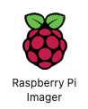
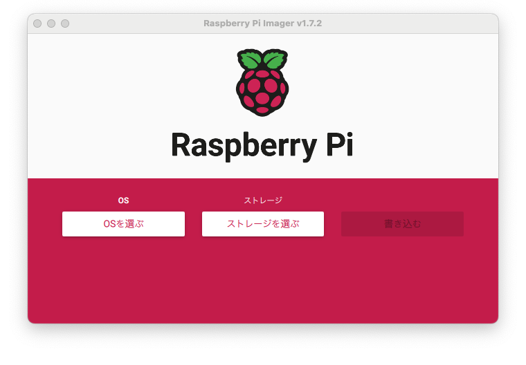
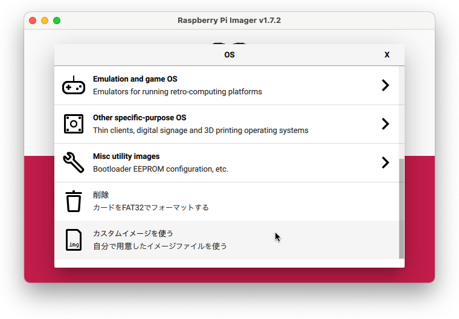
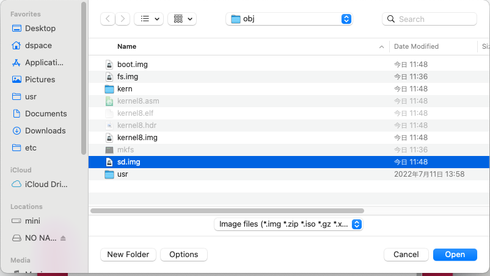
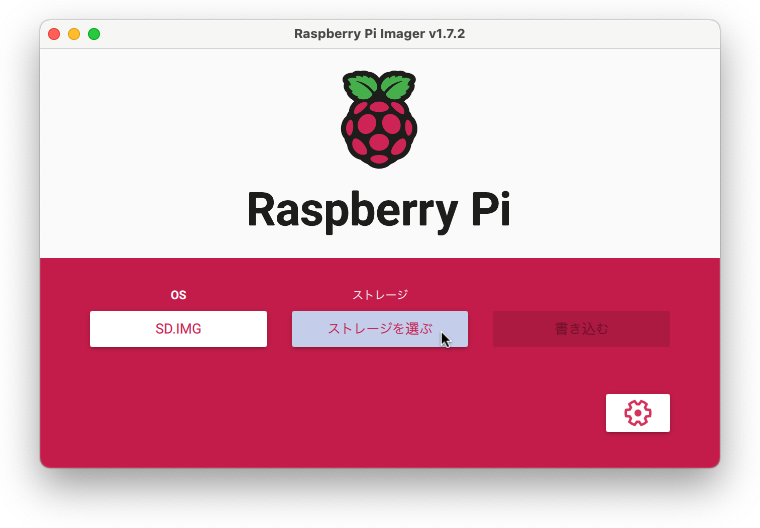
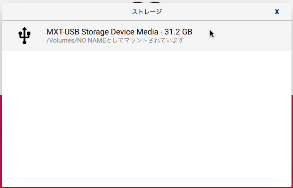
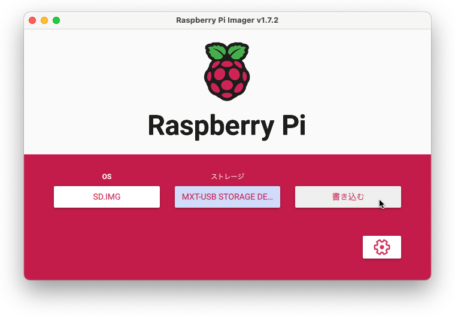

# Raspberry Pi ImagerによるSDカードへの書き込み

## 実機用に再コンパイルする

1. `inc/rtc.h`で`#undef USING_RASPI`行をコメントアウトし、`#define USING_RASPI 1`行のコメントを外す
2. `rm -rf obj && make`

## Raspberry Pi ImagerでSDカードを作成する

### 1. Raspberry Pi Imagerを立ち上げる

### 2. トップ画面で[OSを選ぶ]ボタンをクリック

### 4. OS選択画面で[カスタムイメージを使う]を選択する

### 4. ファイル選択画面で`obj/sd.img`を選択する

### 5. トップ画面で[ストレージを選ぶ]ボタンをクリック

### 6. 書き込むSDカードを選択

### 5. トップ画面で[書き込む]ボタンをクリック

### 6. 書き込みが終わったらSDカードを取り出し、RasPiに挿入
