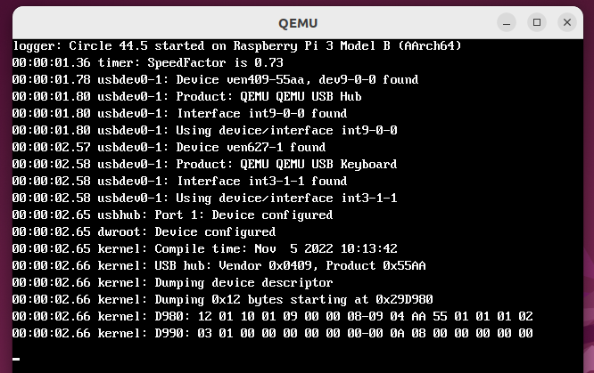
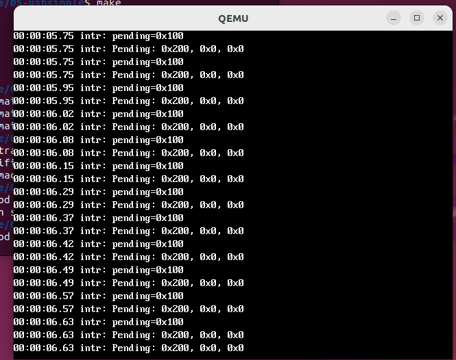
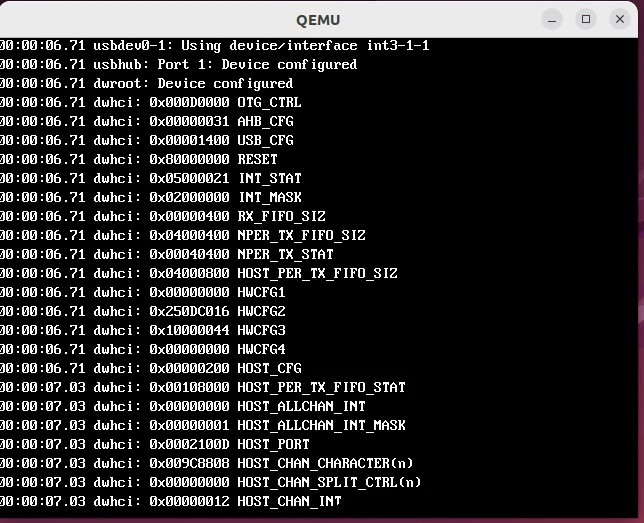
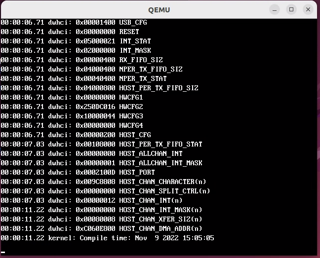

# USB機能の追加の試み

```
[1]HCDInitialise: VenderID=0x4f54294a, UserID=0x0
[1]HCDInitialise: DWC_CORE_HARDWARE=0x10000044_250dc016_00000000

[1]HCDInitialise: HCD: Hardware: OT2.94a (BCM00000).
[1]HCDInitialise: HCD: High speed physical unsupported:
[1]UsbInitialise: FATAL ERROR: HCD failed to initialise.

 +-Unconfigured Device id: 3 port: 0 speed: High packetsize: 16

 (qemu) info qtree
bus: main-system-bus
  type System
  dev: bcm2836-control, id ""
    gpio-out "fiq" 4
    gpio-out "irq" 4
    gpio-in "gpu-fiq" 1
    gpio-in "gpu-irq" 1
    gpio-in "cntvirq" 4
    gpio-in "cnthpirq" 4
    gpio-in "cntpnsirq" 4
    gpio-in "cntpsirq" 4
    mmio 0000000040000000/0000000000000100
(...)
  dev: dwc2-usb, id ""
    gpio-out "sysbus-irq" 1
    usb_version = 2 (0x2)
    mmio ffffffffffffffff/0000000000011000
    bus: usb-bus.0
      type usb-bus
      dev: usb-hub, id ""
        ports = 8 (0x8)
        port-power = false
        port = ""
        serial = ""
        msos-desc = true
        pcap = ""
        addr 0.0, port 1, speed 12, name QEMU USB Hub, attached
      dev: usb-net, id ""
        mac = "52:54:00:12:34:57"
        netdev = "net1"
        port = ""
        serial = ""
        msos-desc = true
        pcap = ""
        addr 0.0, port 1.1, speed 12, name QEMU USB Network Interface, attached
  dev: bcm2835-mphi, id ""
    gpio-out "sysbus-irq" 1
    mmio ffffffffffffffff/0000000000001000

```

## 実機で実行

```
[0]HCDInitialise: VenderID=0x4f54280a, UserID=0x2708a000

[0]HCDInitialise: HCD: Hardware: OT2.80a (BCM2708a).
[0]EnumerateDevice: HCD: Attach Device USB Root Hub. Address:1 Class:9 USB:2.0,.
[0]EnumerateDevice: HCD:  -Product:       FAKED Root Hub (tm).
[0]EnumerateDevice: HCD:  -Configuration: FAKE config string.
[0]HcdProcessRootHubMessage: Physical host power on
[0]HCDChannelTransfer: Result: -16 Action: 0x20010100 tempInt: 0x0000000a tempS0
[0]HCDChannelTransfer: Result: -16 Action: 0x20020200 tempInt: 0x0000000a tempS0
[0]HCDChannelTransfer: Result: -10 Action: 0x40020300 tempInt: 0x0000000a tempS0
[0]HCDSumbitControlMessage: HCD: Could not transfer DATA to device 0.
[0]EnumerateDevice: Enumeration: Step 1 on device 2 failed, Result: %#x.

 +-USB Root Hub id: 1 port: 0 speed: Full packetsize: 64
    ?-New Device (Not Ready) id: 0 port: 0 speed: High packetsize: 8
```

## QEMUのraspiのUSB対応はusb.cが必要とする機能を提供していないらしい

- qemuのhcd-dwc2 USBコントローラはfull speedが前提らしい
  - [arm raspi2/raspi3 emulation has no USB support](https://bugs.launchpad.net/qemu/+bug/1772165)における作者の回答より

    > But note that if you absolutely must pass-through a USB device from the host, it probably won't work.
    > That's because the dwc2 controller emulation is connected through a full-speed hub emulation, so unless
    > your USB device is connected at full-speed on the host, it probably won't work.
    > しかし、どうしてもホストからUSBデバイスをパススルーしなければならない場合、おそらく動作しないので
    > 注意してください。というのも、dwc2コントローラエミュレーションはフルスピードハブエミュレーションを
    > 介して接続されるので、USBデバイスがホスト上でフルスピードで接続されていない限りおそらく動作しないからです。


    ```
    // QEMU/hw/usb/hcd-dwc2.c
    static void dwc2_reset_enter(Object *obj, ResetType type)
    {
    (...)
        s->guid = 0;
        s->gsnpsid = 0x4f54294a;
        s->ghwcfg1 = 0;
        s->ghwcfg2 = (8 << GHWCFG2_DEV_TOKEN_Q_DEPTH_SHIFT) |                   // ただし、GHWCFG2_HS_PHY_TYPEだけでなく
                    (4 << GHWCFG2_HOST_PERIO_TX_Q_DEPTH_SHIFT) |                // GHWCFG2_FS_PHY_TYPEも指定していない
                    (4 << GHWCFG2_NONPERIO_TX_Q_DEPTH_SHIFT) |
                    GHWCFG2_DYNAMIC_FIFO |
                    GHWCFG2_PERIO_EP_SUPPORTED |
                    ((DWC2_NB_CHAN - 1) << GHWCFG2_NUM_HOST_CHAN_SHIFT) |
                    (GHWCFG2_INT_DMA_ARCH << GHWCFG2_ARCHITECTURE_SHIFT) |
                    (GHWCFG2_OP_MODE_NO_SRP_CAPABLE_HOST << GHWCFG2_OP_MODE_SHIFT);
        s->ghwcfg3 = (4096 << GHWCFG3_DFIFO_DEPTH_SHIFT) |
                    (4 << GHWCFG3_PACKET_SIZE_CNTR_WIDTH_SHIFT) |
                    (4 << GHWCFG3_XFER_SIZE_CNTR_WIDTH_SHIFT);
        s->ghwcfg4 = 0;
    ```

- 一方、usb.cはhigh speedを前提に書かれている

    ```
    // usb.c#HCDInitialise()
    if (DWC_CORE_HARDWARE->HighSpeedPhysical == NotSupported) {     // high speed転送が必要
        LOG("HCD: High speed physical unsupported: ");
        return ErrorIncompatible;                                   // Return hardware incompatible
    }
    ```

## 一旦、あきらめる

# Circlを検討する

- Circleはベアペタル環境で実機とQEMUでUSB、Netともに動作したので導入を検討する。ただし、CircleはC++で
書かれている。
- Circleのコードをそのままcで書き直したuspiというライブラリがあるが残念ながらnet機能が実装されていない。
- net機能は実機ではLAN7800ドライバが、QEMUではUSB Serial CDCで処理しているようだ。

## 方針

- uspiのコードを参考に足りない機能をcircleから取り込む。
- プラグアンドプレイは使用しない
- USE_USB_SOF_INTRは当面undef
- USE_USB_FIQはundef

## usbhc_init()のコールシーケンス

```
usbhc_init
	dw2_hc
		dw2_rport
	dw2_hc_init
		dw2_hc_power_on: MBOX使用
		irq_enable, irq_register
		dw2_hc_init_core
			dw2_hc_reset
				dw2_hc_wait_for_bit
			dw2_hc_enable_common_intr
		dw2_hc_enable_global_intr
		dw2_hc_init_host
			dw2_hc_flush_tx_fifo
				dw2_hc_wait_for_bit
			dw2_hc_flush_rx_fifo
				dw2_hc_wait_for_bit
			dw2_hc_enable_host_intr
				dw2_hc_enable_common_intr
		dw2_hc_rescan_dev
			dw2_hc_enable_rport
				dw2_hc_wait_for_bit
			dw2_rport_init
				usb_device
				usb_dev_init
					dw2_hc_get_desc: 8バイトデバイスディスクリプタ
						dw2_hc_control_message
							usb_request
							dw2_hc_submit_block_request
								dw2_hc_xfer_stage
									usb_req_set_comp_cb
									dw2_hc_xfer_stage_async
										dw2_xfer_stagedata
											dw2_fsched_nsplit
										dw2_hc_enable_channel_intr
										dw2_hc_start_trans
											dw2_hc_start_channel
					dw2_hc_get_desc: 正式なdeviceディスクリプタ
					dw2_hc_set_addr: アドレス設定
						dw2_hc_control_message
					dw2_hc_get_desc: 8バイトコンフィグレーションディスクリプタ
					dw2_hc_get_desc: 正式なコンフィグレーションディスクリプタ
					cfg_parser
					usb_string_get_from_desc
						dw2_hc_control_message
					cfg_parser_get_desc
					usb_devfactory_get_device
				usb_dev_config
					dw2_hc_set_config
						dw2_hc_control_message
						usb_func->configure(usb_func)
				dw2_hc_overcurrent_detected
```

## USBの初期設定を実行

- フレームを送信して終了を待つが、少量条件を満たさず無限ループ

```
[0]dw2_hc_init: ver-chk ok
[0]dw2_hc_init: poweron ok
[0]dw2_hc_init: irq ok
[0]dw2_hc_init: init_core ok
[0]dw2_hc_init_host: start
[0]dw2_hc_init_host: dw2 host_cfg ok
[0]dw2_hc_init_host: dynamic fifo ok
[0]dw2_hc_init_host: flush tx/rx fifo ok
[0]dw2_hc_init_host: hostport ok
[0]dw2_hc_enable_host_intr: host intr ok
[0]dw2_hc_init_host: host_intr enabled
[0]dw2_hc_init: init_host ok
[0]dw2_hc_enable_rport: host port reset start
[0]dw2_hc_init: rport enabled
[0]usb_dev_init: start
[0]usb_dev_init: 1
[0]dw2_hc_get_desc: start
[0]dw2_hc_control_message: start
[0]dw2_hc_control_message: 1
[0]dw2_hc_control_message: 2
[0]dw2_hc_submit_block_request: start
[0]dw2_hc_submit_block_request: 1
[0]dw2_hc_submit_block_request: 2
[0]dw2_hc_submit_block_request: 3
[0]dw2_hc_xfer_stage: start
[0]dw2_hc_alloc_wblock: start
[0]dw2_hc_alloc_wblock: 1
[0]dw2_hc_alloc_wblock: b=0
[0]dw2_hc_alloc_wblock: 2
[0]dw2_hc_alloc_wblock: 3
[0]dw2_hc_xfer_stage: 1
[0]dw2_hc_xfer_stage: 2
[0]dw2_hc_xfer_stage: 3
[0]dw2_hc_xfer_stage: 4
[0]dw2_fsched_nsplit_wait_for_frame: inum=0x3311, next=0x3312
[0]dw2_fsched_nsplit_wait_for_frame: num=0x3382     // whileループでnum=0x3312になるのを待つ
[0]dw2_fsched_nsplit_wait_for_frame: num=0x3382     // numが3382となりループが終わらない
```

## QEMUのトレース機能が聞くことが判明

- [ベアメタルでRaspberry Pi 3のUSBコントロール転送](https://qiita.com/eggman/items/5b9e4f5802f0ec22921f)にあるeventsファイルをコピーし、qemuに`-trace events=events`オプションを付けたところ、macのqemu環境でもトレースが出力された

```
qemu-system-aarch64 -M raspi3b -nographic -serial null -serial mon:stdio -drive file=obj/sd.img,if=sd,format=raw -device usb-kbd -trace events=events -kernel obj/kernel8.img
usb_port_claim bus 0, port 1
usb_hub_reset dev 0
usb_port_attach bus 0, port 1, devspeed full, portspeed full+high
usb_dwc2_attach port 0x7face28669e0
usb_dwc2_attach_speed full-speed device attached
usb_dwc2_bus_start start SOFs
usb_dwc2_raise_global_irq 0x01000000
usb_port_claim bus 0, port 1.1
usb_port_attach bus 0, port 1.1, devspeed full+high, portspeed full
usb_hub_attach dev 0, port 1
usb_dwc2_reset_enter === RESET enter ===
usb_dwc2_detach port 0x7face28669e0
usb_dwc2_bus_stop stop SOFs
usb_dwc2_bus_stop stop SOFs
usb_dwc2_reset_hold === RESET hold ===
usb_dwc2_reset_exit === RESET exit ===
usb_dwc2_attach port 0x7face28669e0
usb_dwc2_attach_speed full-speed device attached
usb_dwc2_bus_start start SOFs
usb_dwc2_raise_global_irq 0x01000000
usb_hub_reset dev 0
usb_dwc2_raise_global_irq 0x00000008    //
usb_dwc2_glbreg_read  0x0040 GSNPSID   val 0x4f54294a
usb_dwc2_glbreg_read  0x0008 GAHBCFG   val 0x00000000
usb_dwc2_glbreg_write 0x0008 GAHBCFG   val 0x00000000 old 0x00000000 result 0x00000000
usb_dwc2_glbreg_read  0x000c GUSBCFG   val 0x00001400
usb_dwc2_glbreg_write 0x000c GUSBCFG   val 0x00001400 old 0x00001400 result 0x00001400
usb_dwc2_glbreg_read  0x0010 GRSTCTL   val 0x80000000
usb_dwc2_glbreg_read  0x0010 GRSTCTL   val 0x80000000
usb_dwc2_glbreg_write 0x0010 GRSTCTL   val 0x80000001 old 0x80000000 result 0x80000001
usb_dwc2_glbreg_read  0x0010 GRSTCTL   val 0x80000000
usb_dwc2_glbreg_read  0x000c GUSBCFG   val 0x00001400
usb_dwc2_glbreg_write 0x000c GUSBCFG   val 0x00001400 old 0x00001400 result 0x00001400
usb_dwc2_glbreg_read  0x0048 GHWCFG2   val 0x250dc016
usb_dwc2_glbreg_read  0x000c GUSBCFG   val 0x00001400
usb_dwc2_glbreg_write 0x000c GUSBCFG   val 0x00001400 old 0x00001400 result 0x00001400
usb_dwc2_glbreg_read  0x0008 GAHBCFG   val 0x00000000
usb_dwc2_glbreg_write 0x0008 GAHBCFG   val 0x00000030 old 0x00000000 result 0x00000030
usb_dwc2_glbreg_read  0x000c GUSBCFG   val 0x00001400
usb_dwc2_glbreg_write 0x000c GUSBCFG   val 0x00001400 old 0x00001400 result 0x00001400
usb_dwc2_glbreg_write 0x0014 GINTSTS   val 0xffffffff old 0x15000029 result 0xffffffff05000021
usb_dwc2_raise_global_irq 0x00000008
usb_dwc2_glbreg_read  0x0008 GAHBCFG   val 0x00000030
usb_dwc2_glbreg_write 0x0008 GAHBCFG   val 0x00000031 old 0x00000030 result 0x00000031
usb_dwc2_pcgreg_write 0x0e00 PCGCTL    val 0x00000000 old 0x00000000 result 0x00000000
usb_dwc2_hreg0_read   0x0400 HCFG      val 0x00000200
usb_dwc2_glbreg_read  0x0048 GHWCFG2   val 0x250dc016
usb_dwc2_glbreg_read  0x000c GUSBCFG   val 0x00001400
usb_dwc2_hreg0_write  0x0400 HCFG      val 0x00000200 old 0x00000200 result 0x00000200
usb_dwc2_glbreg_write 0x0024 GRXFSIZ   val 0x00000400 old 0x00000400 result 0x00000400
usb_dwc2_glbreg_write 0x0028 GNPTXFSIZ val 0x04000400 old 0x04000000 result 0x04000400
usb_dwc2_fszreg_write 0x0100 HPTXFSIZ  val 0x04000800 old 0x01f40000 result 0x04000800
usb_dwc2_glbreg_write 0x0010 GRSTCTL   val 0x00000420 old 0x80000000 result 0x80000420
usb_dwc2_glbreg_read  0x0010 GRSTCTL   val 0x80000400
usb_dwc2_glbreg_write 0x0010 GRSTCTL   val 0x00000010 old 0x80000400 result 0x80000010
usb_dwc2_glbreg_read  0x0010 GRSTCTL   val 0x80000000
usb_dwc2_hreg0_read   0x0440 HPRT0     val 0x00021003
usb_dwc2_glbreg_write 0x0018 GINTMSK   val 0x00000000 old 0x00000000 result 0x00000000
usb_dwc2_glbreg_write 0x0014 GINTSTS   val 0xffffffff old 0x05000029 result 0xffffffff05000021
usb_dwc2_glbreg_read  0x0018 GINTMSK   val 0x00000000
usb_dwc2_glbreg_write 0x0018 GINTMSK   val 0x02000000 old 0x00000000 result 0x02000000
usb_dwc2_hreg0_read   0x0440 HPRT0     val 0x00021003
usb_dwc2_raise_global_irq 0x00000008
usb_dwc2_hreg0_read   0x0440 HPRT0     val 0x00021003
usb_dwc2_hreg0_write  0x0440 HPRT0     val 0x00021101 old 0x00021003 result 0x00021103
usb_dwc2_hreg0_action enable PRTINT
usb_dwc2_hreg0_read   0x0440 HPRT0     val 0x00021103
usb_dwc2_hreg0_write  0x0440 HPRT0     val 0x00021001 old 0x00021103 result 0x0002100d
usb_dwc2_hreg0_action call usb_port_reset
usb_dwc2_detach port 0x7face28669e0
usb_dwc2_bus_stop stop SOFs
usb_dwc2_attach port 0x7face28669e0
usb_dwc2_attach_speed full-speed device attached
usb_dwc2_bus_start start SOFs
usb_hub_reset dev 0
usb_dwc2_hreg0_action enable PRTINT
usb_dwc2_hreg0_read   0x0440 HPRT0     val 0x0002100d
usb_dwc2_hreg0_read   0x0418 HAINTMSK  val 0x00000000
usb_dwc2_hreg0_write  0x0418 HAINTMSK  val 0x00000001 old 0x00000000 result 0x00000001
usb_dwc2_hreg1_read   0x0500 HCCHAR  40 val 0x00000000
usb_dwc2_hreg1_write  0x0508 HCINT   0 val 0xffffffff old 0x00000000 result 0x00000000
usb_dwc2_hreg1_write  0x0510 HCTSIZ  0 val 0x60080008 old 0x00000000 result 0x60080008
usb_dwc2_hreg1_write  0x0514 HCDMA   0 val 0xc007ced0 old 0x00000000 result 0xc007ced0
usb_dwc2_hreg1_write  0x0504 HCSPLT  0 val 0x00000000 old 0x00000000 result 0x00000000
usb_dwc2_hreg1_read   0x0500 HCCHAR  40 val 0x00000000
usb_dwc2_hreg0_read   0x0408 HFNUM     val 0x00002d5e
usb_dwc2_hreg0_read   0x0408 HFNUM     val 0x00002d5e   // loop
QEMU: Terminated
```

## 該当部分はコンパイラスイッチ USE_QEMU_USB_FIX で実行しないようになっていた

- 実際、ubuntuでUSE_USB_SOF_INTRをundef、USE_QEMU_USB_FIXも未定義だとストール。
- USE_QEMU_USB_FIXを定義すると実行された



### 別の問題でストールした

```
qemu-system-aarch64 -M raspi3b -nographic -serial null -serial mon:stdio -drive file=obj/sd.img,if=sd,format=raw -device usb-kbd -trace events=events -kernel obj/kernel8.img
usb_port_claim bus 0, port 1
usb_hub_reset dev 0
usb_port_attach bus 0, port 1, devspeed full, portspeed full+high
usb_dwc2_attach port 0x7fd5df8669e0
usb_dwc2_attach_speed full-speed device attached
usb_dwc2_bus_start start SOFs
usb_dwc2_raise_global_irq 0x01000000
usb_port_claim bus 0, port 1.1
usb_port_attach bus 0, port 1.1, devspeed full+high, portspeed full
usb_hub_attach dev 0, port 1
usb_dwc2_reset_enter === RESET enter ===
usb_dwc2_detach port 0x7fd5df8669e0
usb_dwc2_bus_stop stop SOFs
usb_dwc2_bus_stop stop SOFs
usb_dwc2_reset_hold === RESET hold ===
usb_dwc2_reset_exit === RESET exit ===
usb_dwc2_attach port 0x7fd5df8669e0
usb_dwc2_attach_speed full-speed device attached
usb_dwc2_bus_start start SOFs
usb_dwc2_raise_global_irq 0x01000000
usb_hub_reset dev 0
usb_dwc2_raise_global_irq 0x00000008
[0]free_range: 0xffff000000348000 ~ 0xffff00003b400000, 241848 pages
[0]console_init: devsw[1].termios: 0xffff00003b3ff000
[0]rand_init: rand_init ok
[0]init_vfssw: init_vfssw ok
mountinit ok
[0]install_rootfs: install_rootfs ok
pagecache_init ok
usb_dwc2_glbreg_read  0x0040 GSNPSID   val 0x4f54294a
usb_dwc2_glbreg_read  0x0008 GAHBCFG   val 0x00000000
usb_dwc2_glbreg_write 0x0008 GAHBCFG   val 0x00000000 old 0x00000000 result 0x00000000
usb_dwc2_glbreg_read  0x000c GUSBCFG   val 0x00001400
usb_dwc2_glbreg_write 0x000c GUSBCFG   val 0x00001400 old 0x00001400 result 0x00001400
usb_dwc2_glbreg_read  0x0010 GRSTCTL   val 0x80000000
usb_dwc2_glbreg_read  0x0010 GRSTCTL   val 0x80000000
usb_dwc2_glbreg_write 0x0010 GRSTCTL   val 0x80000001 old 0x80000000 result 0x80000001
usb_dwc2_glbreg_read  0x0010 GRSTCTL   val 0x80000000
usb_dwc2_glbreg_read  0x000c GUSBCFG   val 0x00001400
usb_dwc2_glbreg_write 0x000c GUSBCFG   val 0x00001400 old 0x00001400 result 0x00001400
usb_dwc2_glbreg_read  0x0048 GHWCFG2   val 0x250dc016
usb_dwc2_glbreg_read  0x000c GUSBCFG   val 0x00001400
usb_dwc2_glbreg_write 0x000c GUSBCFG   val 0x00001400 old 0x00001400 result 0x00001400
usb_dwc2_glbreg_read  0x0008 GAHBCFG   val 0x00000000
usb_dwc2_glbreg_write 0x0008 GAHBCFG   val 0x00000030 old 0x00000000 result 0x00000030
usb_dwc2_glbreg_read  0x000c GUSBCFG   val 0x00001400
usb_dwc2_glbreg_write 0x000c GUSBCFG   val 0x00001400 old 0x00001400 result 0x00001400
usb_dwc2_glbreg_write 0x0014 GINTSTS   val 0xffffffff old 0x15000029 result 0xffffffff05000021
usb_dwc2_glbreg_read  0x0008 GAHBCFG   val 0x00000030
usb_dwc2_glbreg_write 0x0008 GAHBCFG   val 0x00000031 old 0x00000030 result 0x00000031
usb_dwc2_raise_global_irq 0x00000008
usb_dwc2_pcgreg_write 0x0e00 PCGCTL    val 0x00000000 old 0x00000000 result 0x00000000
usb_dwc2_hreg0_read   0x0400 HCFG      val 0x00000200
usb_dwc2_glbreg_read  0x0048 GHWCFG2   val 0x250dc016
usb_dwc2_glbreg_read  0x000c GUSBCFG   val 0x00001400
usb_dwc2_hreg0_write  0x0400 HCFG      val 0x00000200 old 0x00000200 result 0x00000200
usb_dwc2_glbreg_write 0x0024 GRXFSIZ   val 0x00000400 old 0x00000400 result 0x00000400
usb_dwc2_glbreg_write 0x0028 GNPTXFSIZ val 0x04000400 old 0x04000000 result 0x04000400
usb_dwc2_fszreg_write 0x0100 HPTXFSIZ  val 0x04000800 old 0x01f40000 result 0x04000800
usb_dwc2_glbreg_write 0x0010 GRSTCTL   val 0x00000420 old 0x80000000 result 0x80000420
usb_dwc2_glbreg_read  0x0010 GRSTCTL   val 0x80000400
usb_dwc2_glbreg_write 0x0010 GRSTCTL   val 0x00000010 old 0x80000400 result 0x80000010
usb_dwc2_glbreg_read  0x0010 GRSTCTL   val 0x80000000
usb_dwc2_hreg0_read   0x0440 HPRT0     val 0x00021003
usb_dwc2_glbreg_write 0x0018 GINTMSK   val 0x00000000 old 0x00000000 result 0x00000000
usb_dwc2_glbreg_write 0x0014 GINTSTS   val 0xffffffff old 0x05000029 result 0xffffffff05000021
usb_dwc2_glbreg_read  0x0018 GINTMSK   val 0x00000000
usb_dwc2_glbreg_write 0x0018 GINTMSK   val 0x02000000 old 0x00000000 result 0x02000000
usb_dwc2_hreg0_read   0x0440 HPRT0     val 0x00021003
usb_dwc2_raise_global_irq 0x00000008
usb_dwc2_hreg0_read   0x0440 HPRT0     val 0x00021003
usb_dwc2_hreg0_write  0x0440 HPRT0     val 0x00021101 old 0x00021003 result 0x00021103
usb_dwc2_hreg0_action enable PRTINT
usb_dwc2_hreg0_read   0x0440 HPRT0     val 0x00021103
usb_dwc2_hreg0_write  0x0440 HPRT0     val 0x00021001 old 0x00021103 result 0x0002100d
usb_dwc2_hreg0_action call usb_port_reset
usb_dwc2_detach port 0x7fd5df8669e0
usb_dwc2_bus_stop stop SOFs
usb_dwc2_attach port 0x7fd5df8669e0
usb_dwc2_attach_speed full-speed device attached
usb_dwc2_bus_start start SOFs
usb_hub_reset dev 0
usb_dwc2_hreg0_action enable PRTINT
usb_dwc2_hreg0_read   0x0440 HPRT0     val 0x0002100d
usb_dwc2_hreg0_read   0x0418 HAINTMSK  val 0x00000000
usb_dwc2_hreg0_write  0x0418 HAINTMSK  val 0x00000001 old 0x00000000 result 0x00000001
usb_dwc2_hreg1_read   0x0500 HCCHAR  40 val 0x00000000
usb_dwc2_hreg1_write  0x0508 HCINT   0 val 0xffffffff old 0x00000000 result 0x00000000
usb_dwc2_hreg1_write  0x0510 HCTSIZ  0 val 0x60080008 old 0x00000000 result 0x60080008
usb_dwc2_hreg1_write  0x0514 HCDMA   0 val 0xc007fed0 old 0x00000000 result 0xc007fed0
usb_dwc2_hreg1_write  0x0504 HCSPLT  0 val 0x00000000 old 0x00000000 result 0x00000000
usb_dwc2_hreg1_read   0x0500 HCCHAR  40 val 0x00000000
usb_dwc2_hreg1_write  0x050c HCINTMSK0 val 0x0000078f old 0x00000000 result 0x0000078f
usb_dwc2_hreg1_write  0x0500 HCCHAR  0 val 0x80100008 old 0x00000000 result 0x80100008
usb_dwc2_find_device 0
usb_dwc2_device_found device found on port 0
usb_dwc2_enable_chan ch 0 dev 0x7fd5e00afa00 pkt 0x7fd5df866a28 ep 0
usb_dwc2_handle_packet ch 0 dev 0x7fd5e00afa00 pkt 0x7fd5df866a28 ep 0 type Ctrl dir Out mps 8 len 8 pcnt 1
usb_dwc2_memory_read addr -1073217840 len 8
usb_packet_state_change bus 0, port 1, ep 0, packet 0x7fd5df866a28, state undef -> setup  // ここでストール
```

### USB割り込みが発生しないのが原因

- Circleでの割り込み



```
intr: pending=0x100                 // [8]=1: GPU Interrupt
inter: Pending: 0x200, 0x0, 0x0     // [9]=1: USB Controller
```

### dw2_hc_enable_rport()の呼び出し後のUSBレジスタの値

- GINTST: [3]=1 はパワーオン後にセットされる場合があるが、write 1でクリアされるはず。
- GHWCFG2: [20]=0 Multi Process Interruptがdisableだがこれで良いのか
- GHWCFG2: [9:8]=00 Full speed interface not supportedだがこれで良いのか
- GHWCFG2: [7:6]=00 2'b00: High Speed interface not supportedだがこれで良いのか
- HPRT: [1]=0 Port Connect Not Detected だがこれで良いか

```
(gdb) x/16x 0x3f980000
0x3f980000: 0x000d0000  0x00000000  0x00000031  0x00001400  // GOTGCTL   GOTGINT   GAHBCFG   GUSBCFG
0x3f980010: 0x80000000  0x05000029  0x02000000  0x00000000  // GRSTCTL   GINTSTS   GINTMSK   GRXSTSR
0x3f980020: 0x00000000  0x00000400  0x04000400  0x00040400  // GRXSTSP   GRXFSIZ   GNPTXFSIZ GNPTXSTS
0x3f980030: 0x11000000  0x00000000  0x00000000  0x00000000  // GI2CCTL   GPVNDCTL  GGPIO     GUID
0x3f980040: 0x4f54294a  0x00000000  0x250dc016  0x10000044  // GSNPSID   GHWCFG1   GHWCFG2   GHWCFG3
0x3f980050: 0x00000000  0x00000000  0x00000010  0x00000000  // GHWCFG4   GLPMCFG   GPWRDN    GDFIFOCFG
0x3f980060: 0x00000000  0x00000000  0x00000000  0x00000000
0x3f980070: 0x00000000  0x00000000  0x00000000  0x00000000
(gdb) x/16x 0x3f980400
0x3f980400: 0x00000200  0x0000ea60  0x13031d9c  0x00000000  // HCFG      HFIR      HFNUM     -
0x3f980410: 0x00108000  0x00000000  0x00000000  0x00000000  // HPTXSTS   HAINT     HAINTMSK  HFLBAddr
0x3f980420: 0x00000000  0x00000000  0x00000000  0x00000000
0x3f980430: 0x00000000  0x00000000  0x00000000  0x00000000
0x3f980440: 0x0002100d  0x00000000  0x00000000  0x00000000  // HPRT
(gdb) x/16x 0x3f980500
```

#### dw2_hc_start_channel()のreturm前のレジスタ

```
(gdb) x/16x 0x3f980000
0x3f980000: 0x000d0000  0x00000000  0x00000031  0x00001400
0x3f980010: 0x80000000  0x07000029  0x02000000  0x00000000
0x3f980020: 0x00000000  0x00000400  0x04000400  0x00040400
0x3f980030: 0x11000000  0x00000000  0x00000000  0x00000000
0x3f980040: 0x4f54294a  0x00000000  0x250dc016  0x10000044
0x3f980050: 0x00000000  0x00000000  0x00000010  0x00000000
(gdb) x/16x 0x3f980400
0x3f980400: 0x00000200  0x0000ea60  0x06d22456  0x00000000
0x3f980410: 0x00108000  0x00000001  0x00000001  0x00000000
0x3f980420: 0x00000000  0x00000000  0x00000000  0x00000000
0x3f980430: 0x00000000  0x00000000  0x00000000  0x00000000
0x3f980440: 0x0002100d  0x00000000  0x00000000  0x00000000
(gdb) x/16x 0x3f980500
0x3f980500: 0x00100008  0x00000000  0x00000003  0x0000078f
0x3f980510: 0x60000000  0xc007ded8  0x00000000  0x00000000
```

### circleでのHC初期化後のレジスタ値

- []で囲んだレジスタの値が違う

```
0x3f980000: 0x000d0000  -           0x00000031  0x00001400  // GOTGCTL   GOTGINT   GAHBCFG   GUSBCFG
0x3f980010: 0x80000000  0x05000021  0x02000000  -           // GRSTCTL  [GINTSTS]  GINTMSK   GRXSTSR
0x3f980020: -           0x00000400  0x04000400  0x00040400  // GRXSTSP   GRXFSIZ   GNPTXFSIZ GNPTXSTS
0x3f980030: -           -           -           -           // GI2CCTL   GPVNDCTL  GGPIO     GUID
0x3f980040: -           0x00000000  0x250dc016  0x10000044  // GSNPSID   GHWCFG1   GHWCFG2   GHWCFG3
0x3f980050: 0x00000000  -           -           -           // GHWCFG4   GLPMCFG   GPWRDN    GDFIFOCFG
(gdb) x/16x 0x3f980400
0x3f980400: 0x00000200  -           -           -           // HCFG      HFIR      HFNUM     -
0x3f980410: 0x00108000  0x00000000  0x00000001  -           // HPTXSTS   HAINT    [HAINTMSK] HFLBAddr
0x3f980420: -           -           -           -
0x3f980430: -           -           -           -
0x3f980440: 0x0002100d  -           -           -           // HPRT
(gdb) x/16x 0x3f980500
0x3f980500: 0x009c8800  0x00000000  0x00000012  0x00000000  // HCCHAR0   HCSPLT0   HCINT0    HCINTMSK0
0x3f980510: 0x00080008  0xc060e800  -           -           // HCTSIZ0   HCDMA0
```




## usbhc_init()の呼び出し位置を変更

- main.cからproc.c#forkert()に移動
- vector[5]を有効化

```
qemu-system-aarch64 -M raspi3b -nographic -serial null -serial mon:stdio -drive file=obj/sd.img,if=sd,format=raw -device usb-kbd  -kernel obj/kernel8.img
[3]free_range: 0xffff000000348000 ~ 0xffff00003b400000, 241848 pages
[3]console_init: devsw[1].termios: 0xffff00003b3ff000
[3]rand_init: rand_init ok
[3]init_vfssw: init_vfssw ok
mountinit ok
[3]install_rootfs: install_rootfs ok
pagecache_init ok
[3]timer_init: timerfreq = 0x3b9aca0
[1]timer_init: timerfreq = 0x3b9aca0
[3]main: cpu 3 init finished
[1]main: cpu 1 init finished
[0]timer_init: timerfreq = 0x3b9aca0
[0]main: cpu 0 init finished
[2]timer_init: timerfreq = 0x3b9aca0
[2]main: cpu 2 init finished
[3]emmc_card_init: poweron
[2]emmc_issue_command_int: rrror occured whilst waiting for command complete interrupt
[3]emmc_card_reset: found valid version 2.00 SD card
[3]dev_init: partition[0]: LBA=0x800, #SECS=0x20000
[0]dev_init: partition[1]: LBA=0x20800, #SECS=0xf0000
[0]dev_init: partition[2]: LBA=0x110800, #SECS=0xef800
[0]iinit: sb: size 100000 nblocks 99835 ninodes 1024 nlog 126 logstart 2 inodestart 128 bmapstart 161
[3]initlog: init log ok
[0]irq_handler: src=0x100
[0]dw2_hc_free_channel: allocch=0x1
[0]dw2_hc_comp_cb: called
[2]dw2_hc_xfer_stage: 1
[2]dw2_hc_xfer_stage: 2
[2]dw2_hc_xfer_stage: 1
[0]irq_handler: src=0x100
[0]dw2_hc_free_channel: allocch=0x1
[0]dw2_hc_comp_cb: called
[2]dw2_hc_xfer_stage: 2
[2]dw2_hc_xfer_stage: 1
[0]irq_handler: src=0x100
[0]dw2_hc_free_channel: allocch=0x1
[0]dw2_hc_comp_cb: called
[2]dw2_hc_xfer_stage: 2
[1]dw2_hc_xfer_stage: 1
[3]dw2_hc_free_channel: allocch=0x1
[3]dw2_hc_comp_cb: called
[1]dw2_hc_xfer_stage: 2
[1]dw2_hc_xfer_stage: 1
[0]irq_handler: src=0x100
[0]dw2_hc_free_channel: allocch=0x1
[0]dw2_hc_comp_cb: called
[1]dw2_hc_xfer_stage: 2
[1]dw2_hc_xfer_stage: 1
[0]irq_handler: src=0x900
[0]dw2_hc_free_channel: allocch=0x1
[0]dw2_hc_comp_cb: called
[1]dw2_hc_xfer_stage: 2
[1]dw2_hc_xfer_stage: 1
[3]dw2_hc_free_channel: allocch=0x1
[0]irq_handler: src=0x100
[3]dw2_hc_comp_cb: called
[1]dw2_hc_xfer_stage: 2
[1]dw2_hc_xfer_stage: 1
[0]irq_handler: src=0x100
[0]dw2_hc_free_channel: allocch=0x1
[0]dw2_hc_comp_cb: called
[1]dw2_hc_xfer_stage: 2
[0]irq_handler: src=0x100
[0]dw2_hc_free_channel: allocch=0x1
[0]dw2_hc_comp_cb: called
[0]dw2_hc_xfer_stage: 1
[0]dw2_hc_xfer_stage: 2
[0]irq_handler: src=0x100
[0]dw2_hc_free_channel: allocch=0x1
[0]dw2_hc_comp_cb: called
[0]dw2_hc_xfer_stage: 1
[0]dw2_hc_xfer_stage: 2
[0]irq_handler: src=0x100
[0]dw2_hc_free_channel: allocch=0x1
[0]dw2_hc_comp_cb: called
[0]dw2_hc_xfer_stage: 1
[0]dw2_hc_xfer_stage: 2
[0]irq_handler: src=0x100
[0]dw2_hc_free_channel: allocch=0x1
[0]dw2_hc_comp_cb: called
[0]dw2_hc_xfer_stage: 1
[0]dw2_hc_xfer_stage: 2
[0]irq_handler: src=0x100
[1]dw2_hc_free_channel: allocch=0x1
[0]dw2_hc_xfer_stage: 1
[1]dw2_hc_comp_cb: called
[0]dw2_hc_xfer_stage: 2
[0]irq_handler: src=0x100
[0]dw2_hc_free_channel: allocch=0x1
[0]dw2_hc_comp_cb: called
[0]dw2_hc_xfer_stage: 1
[0]dw2_hc_xfer_stage: 2
[0]irq_handler: src=0x102
[2]dw2_hc_free_channel: allocch=0x1
[2]dw2_hc_comp_cb: called
[2]dw2_hc_xfer_stage: 1
[2]dw2_hc_xfer_stage: 2
[2]dw2_hc_xfer_stage: 1
[0]irq_handler: src=0x100
[0]dw2_hc_free_channel: allocch=0x1
[0]dw2_hc_comp_cb: called
[2]dw2_hc_xfer_stage: 2
[2]dw2_hc_xfer_stage: 1
[0]irq_handler: src=0x900
[0]dw2_hc_free_channel: allocch=0x1
[0]dw2_hc_comp_cb: called
[2]dw2_hc_xfer_stage: 2
[2]dw2_hc_xfer_stage: 1
[0]irq_handler: src=0x102
[3]dw2_hc_free_channel: allocch=0x1
[3]dw2_hc_comp_cb: called
[2]dw2_hc_xfer_stage: 2
[2]dw2_hc_xfer_stage: 1
[0]irq_handler: src=0x900
[2]dw2_hc_free_channel: allocch=0x1
[2]dw2_hc_comp_cb: called
[2]dw2_hc_xfer_stage: 2
[2]dw2_hc_xfer_stage: 1
[0]irq_handler: src=0x100
[0]dw2_hc_free_channel: allocch=0x1
[0]dw2_hc_comp_cb: called
[2]dw2_hc_xfer_stage: 2
[2]dw2_hc_xfer_stage: 1
[0]irq_handler: src=0x100
[0]dw2_hc_free_channel: allocch=0x1
[0]dw2_hc_comp_cb: called
[2]dw2_hc_xfer_stage: 2
[2]dw2_hc_xfer_stage: 1
[0]irq_handler: src=0x102
[0]dw2_hc_free_channel: allocch=0x1
[0]dw2_hc_comp_cb: called
[2]dw2_hc_xfer_stage: 2
[2]dw2_hc_xfer_stage: 1
[0]irq_handler: src=0x100
[0]dw2_hc_free_channel: allocch=0x1
[0]dw2_hc_comp_cb: called
[2]dw2_hc_xfer_stage: 2
[2]dw2_hc_xfer_stage: 1
[0]irq_handler: src=0x100
[3]dw2_hc_free_channel: allocch=0x1
[3]dw2_hc_comp_cb: called
[2]dw2_hc_xfer_stage: 2
[2]dw2_hc_xfer_stage: 1
[0]irq_handler: src=0x102
[0]dw2_hc_free_channel: allocch=0x1
[0]dw2_hc_comp_cb: called
[2]dw2_hc_xfer_stage: 2
[2]dw2_hc_xfer_stage: 1
[0]irq_handler: src=0x100
[0]dw2_hc_free_channel: allocch=0x1
[0]dw2_hc_comp_cb: called
[2]dw2_hc_xfer_stage: 2
[0]irq_handler: src=0x900
[0]dw2_hc_free_channel: allocch=0x1
[0]dw2_hc_comp_cb: called
[3]dw2_hc_xfer_stage: 1
[3]dw2_hc_xfer_stage: 2
[3]dw2_hc_xfer_stage: 1
[0]irq_handler: src=0x100
[0]dw2_hc_free_channel: allocch=0x1
[0]dw2_hc_comp_cb: called
[1]dw2_hc_xfer_stage: 2
[1]dw2_hc_xfer_stage: 1
[0]irq_handler: src=0x100
[0]dw2_hc_free_channel: allocch=0x1
[0]dw2_hc_comp_cb: called
[1]dw2_hc_xfer_stage: 2
[1]usb_dev_init: Device ven409-55aa, dev9-0-05aa found
[1]usb_func_get_if_name: func name=int9-0-0
[1]usb_dev_init: Interface int9-0-0 found
[0]usb_devfactory_get_device: Using device/interface int9-0-0
[0]irq_handler: src=0x100
[3]dw2_hc_free_channel: allocch=0x1
[3]dw2_hc_comp_cb: called
[3]dw2_hc_xfer_stage: 1
[3]dw2_hc_xfer_stage: 2
[3]dw2_hc_xfer_stage: 1
[0]irq_handler: src=0x100
[0]dw2_hc_free_channel: allocch=0x1
[0]dw2_hc_comp_cb: called
[3]dw2_hc_xfer_stage: 2
[1]dw2_hc_xfer_stage: 1
[0]irq_handler: src=0x100
[0]dw2_hc_free_channel: allocch=0x1
[0]dw2_hc_comp_cb: called
[1]dw2_hc_xfer_stage: 2
[1]dw2_hc_xfer_stage: 1
[0]irq_handler: src=0x900
[0]dw2_hc_free_channel: allocch=0x1
[0]dw2_hc_comp_cb: called
[1]dw2_hc_xfer_stage: 2
[0]usbhc_init: dw2hc initialized          // ここでストール

QEMU: Terminated
```

## type=4 のエラー

```
qemu-system-aarch64 -M raspi3b -nographic -serial null -serial mon:stdio -drive file=obj/sd.img,if=sd,format=raw -device usb-kbd  -kernel obj/kernel8.img
[1]free_range: 0xffff000000348000 ~ 0xffff00003b400000, 241848 pages
[1]console_init: devsw[1].termios: 0xffff00003b3ff000
[1]clock_init: clock init ok
[1]rand_init: rand_init ok
[1]init_vfssw: init_vfssw ok
mountinit ok
[1]install_rootfs: install_rootfs ok
pagecache_init ok
[1]timer_init: timerfreq = 0x3b9aca0
[2]timer_init: timerfreq = 0x3b9aca0
[3]timer_init: timerfreq = 0x3b9aca0
[1]main: cpu 1 init finished
[2]main: cpu 2 init finished
[3]main: cpu 3 init finished
[0]timer_init: timerfreq = 0x3b9aca0
[0]main: cpu 0 init finished
[3]forkret: proc 'idle'(3)
[2]forkret: proc 'idle'(4)
[1]emmc_card_init: poweron
[0]forkret: proc 'idle'(5)
[1]emmc_issue_command_int: rrror occured whilst waiting for command complete interrupt
[1]forkret: proc 'idle'(2)
[2]emmc_card_reset: found valid version 2.00 SD card
[2]dev_init: partition[0]: LBA=0x800, #SECS=0x20000
[2]dev_init: partition[1]: LBA=0x20800, #SECS=0xf0000
[2]dev_init: partition[2]: LBA=0x110800, #SECS=0xef800
[2]trap: t4: ec=0x25, iss=0x4, il=0x2000000, dfs=0x4, far=0x3b3fe260003b3feb
[2]trap: t4: ec=0x25, iss=0x4, il=0x2000000, dfs=0x4, far=0x3b3fe260003b3ffb
kern/usb/dw2xferstagedata.c:90: assertion failed.
kern/console.c:348: kernel panic at cpu 2.
```

```
2]timer_init: timerfreq = 0x3b9aca0
[3]timer_init: timerfreq = 0x3b9aca0
[1]timer_init: timerfreq = 0x3b9aca0
[3]main: cpu 3 init finished
[1]main: cpu 1 init finished
[1]forkret: proc 'idle'(3)
[2]main: cpu 2 init finished
[3]emmc_card_init: poweron
[0]timer_init: timerfreq = 0x3b9aca0
[2]forkret: proc 'idle'(4)
[0]main: cpu 0 init finished
[0]forkret: proc 'idle'(5)
[3]emmc_issue_command_int: rrror occured whilst waiting for command complete interrupt
[3]emmc_card_reset: found valid version 2.00 SD card
[3]dev_init: partition[0]: LBA=0x800, #SECS=0x20000
[3]dev_init: partition[1]: LBA=0x20800, #SECS=0xf0000
[3]dev_init: partition[2]: LBA=0x110800, #SECS=0xef800
[3]dw2_xfer_stagedata: bp=0xffff000038bfdd90
[3]dw2_xfer_stagedata: bp=0xffff00003b3fe010
[3]dw2_xfer_stagedata: bp=0xffff00003b3fe3dc
[3]dw2_xfer_stagedata: bp=0xffff000038bfdd90
[3]dw2_xfer_stagedata: bp=0xffff00003b3fe010
[3]dw2_xfer_stagedata: bp=0xffff00003b3fe3dc
[3]dw2_xfer_stagedata: bp=0xffff000038bfdda0
[3]dw2_xfer_stagedata: bp=0xffff00003b3fe3dc
[3]dw2_xfer_stagedata: bp=0xffff000038bfdd50
[3]dw2_xfer_stagedata: bp=0xffff000038bdfff0
[3]dw2_xfer_stagedata: bp=0xffff00003b3fe3dc
[3]dw2_xfer_stagedata: bp=0xffff000038bfdd40
[3]dw2_xfer_stagedata: bp=0xffff000038bdfff0
[3]dw2_xfer_stagedata: bp=0xffff00003b3fe3dc
[3]dw2_xfer_stagedata: bp=0xffff000038bfdd40
[3]dw2_xfer_stagedata: bp=0xffff000038bdfff0
[3]dw2_xfer_stagedata: bp=0xffff00003b3fe3dc
[3]dw2_xfer_stagedata: bp=0xffff000038bfdd40
[3]dw2_xfer_stagedata: bp=0xffff00003b3fe110
[3]dw2_xfer_stagedata: bp=0xffff00003b3fe3dc
[3]dw2_xfer_stagedata: bp=0xffff000038bfdd40
[3]dw2_xfer_stagedata: bp=0xffff000038bdffe0
[3]dw2_xfer_stagedata: bp=0xffff00003b3fe3dc
[3]dw2_xfer_stagedata: bp=0xffff000038bfdd90
[3]dw2_xfer_stagedata: bp=0xffff000038bdffa0
[3]dw2_xfer_stagedata: bp=0xffff00003b3fe3dc
[3]dw2_xfer_stagedata: bp=0xffff000038bfdd90
[3]dw2_xfer_stagedata: bp=0xffff00003b3fe120
[3]dw2_xfer_stagedata: bp=0xffff00003b3fe3dc
[3]usb_dev_init: Device ven409-55aa, dev9-0-05aa found
[3]usb_func_get_if_name: func name=int9-0-0
[3]usb_dev_init: Interface int9-0-0 found
[3]usb_devfactory_get_device: Using device/interface int9-0-0
[3]dw2_xfer_stagedata: bp=0xffff000038bfddd0
[3]dw2_xfer_stagedata: bp=0xffff00003b3fe3dc
[3]dw2_xfer_stagedata: bp=0xffff000038bfdde0
[3]dw2_xfer_stagedata: bp=0xffff00003b3fe3dc
[3]usbhc_init: dw2hc initialized

[3]iinit: sb: size 100000 nblocks 99835 ninodes 1024 nlog 126 logstart 2 inodestart 128 bmapstart 161
[3]initlog: init log ok
[3]forkret: proc 'icode'(1)
[3]forkret: proc 'idle'(2)
QEMU: Terminated
```

- self->bufpのアドレス値がおかしい。4byte -> 8byte 拡張が間違っているところがある?
  - bp=0xffff00003b3fe3dc, far=0x3b3fe260003b3ffb
- これは`struct dw2_xfer_stagedata`のbufferの定義が間違っていた。
- これを修正したら`struct dw2_hc`のサイズが4144とkmallocできない大きさになった
  - stdataをポイント型に修正した

```
[1]usb_dev_init: Device ven409-55aa, dev9-0-05aa found
[1]usb_func_get_if_name: func name=int9-0-0
[1]usb_dev_init: Interface int9-0-0 found
[1]usb_dev_init: Function is not supported
[1]usb_dev_init: Device has no supported function
QEMU: Terminated
```

```
[3]free_range: 0xffff000000348000 ~ 0xffff00003b400000, 241848 pages
[3]timer_init: timerfreq = 0x3b9aca0
[1]timer_init: timerfreq = 0x3b9aca0
[2]timer_init: timerfreq = 0x3b9aca0
[3]main: cpu 3 init finished
[2]main: cpu 2 init finished
[1]main: cpu 1 init finished
[0]timer_init: timerfreq = 0x3b9aca0
[0]main: cpu 0 init finished
[1]forkret: proc 'idle'(4)
[2]forkret: proc 'idle'(3)
[0]forkret: proc 'idle'(5)
[2]iinit: sb: size 100000 nblocks 99835 ninodes 1024 nlog 126 logstart 2 inodestart 128 bmapstart 161
[3]initlog: init log ok
[2]usb_dev_init: Device ven409-55aa, dev9-0-0 found
[2]usbhc_init: dw2hc initialized

[2]forkret: proc 'icode'(1)
QEMU: Terminated

```

```
[2]free_range: 0xffff000000348000 ~ 0xffff00003b400000, 241848 pages
[2]timer_init: timerfreq = 0x3b9aca0
[1]timer_init: timerfreq = 0x3b9aca0
[2]main: cpu 2 init finished
[1]main: cpu 1 init finished
[3]timer_init: timerfreq = 0x3b9aca0
[3]main: cpu 3 init finished
[0]timer_init: timerfreq = 0x3b9aca0
[0]main: cpu 0 init finished
[1]forkret: proc 'idle'(3)
[3]forkret: proc 'idle'(4)
[2]forkret: proc 'idle'(2)
[1]iinit: sb: size 100000 nblocks 99835 ninodes 1024 nlog 126 logstart 2 inodestart 128 bmapstart 161
[1]initlog: init log ok
[1]forkret: proc 'icode'(1)
[2]forkret: proc ''(6)
[0]forkret: proc ''(7)
[2]forkret: proc ''(8)
[0]forkret: proc ''(9)
[2]forkret: proc ''(10)
[3]forkret: proc ''(11)
[2]mount: source: /dev/sdc3, target: /mnt, type: ext2, flags: 0x0
[0]forkret: proc ''(12)

[3]fileopen: cant namei /etc/issue
Welcome to xv6 2022-06-26 (musl) mini tty

mini login: root
Password:
[0]fileopen: cant namei /etc/profile
[0]fileopen: cant namei /.profile
# QEMU: Terminated
```

## keyboard.cを追加

```
2]usb_dev_init: Device ven409-55aa, dev9-0-0 found
[2]usb_dev_init: Product: QEMU QEMU USB Hub
[2]usb_func_get_if_name: func name=int9-0-0
[2]usb_dev_init: Interface int9-0-0 found
[2]usb_devfactory_get_device: Using device/interface int9-0-0
[2]usb_stdhub_enumerate_ports: start
[2]usb_dev_init: Device ven627-1 found
[2]usb_dev_init: Product: QEMU QEMU USB Keyboard
[2]usb_func_get_if_name: func name=int3-1-1
[2]usb_dev_init: Interface int3-1-1 found
[2]usb_devfactory_get_device: Using device/interface int3-1-1
[2]usb_dev_config: 0 is ok
[2]usb_stdhub_enumerate_ports: Port 1: Device configured
[0]dw2_hc_timer_hdl: st=0
kern/usb/dw2hcd.c:1242: assertion failed.
kern/console.c:348: kernel panic at cpu 0.
```

## keyboardではなくnetを要項にして実行

- `-netdev user,id=net0,hostfwd=tcp::8080-:80 -device usb-net,netdev=net0`

```
[3]usb_dev_init: Device ven409-55aa, dev9-0-0 found
[3]usb_dev_init: Product: QEMU QEMU USB Hub
[3]usb_func_get_if_name: func name=int9-0-0
[3]usb_dev_init: Interface int9-0-0 found
[3]usb_devfactory_get_device: Using device/interface int9-0-0
[3]usb_stdhub_enumerate_ports: start
[3]usb_dev_init: Device ven525-a4a2, dev2-0-0 found
[3]usb_dev_init: Product: QEMU RNDIS/QEMU USB Network Device
[3]usb_func_get_if_name: func name=int2-6-0
[3]usb_dev_init: Interface int2-6-0 found
[3]usb_devfactory_get_device: Using device/interface int2-6-0
[3]usb_func_get_if_name: func name=inta-0-0
[3]usb_dev_init: Interface inta-0-0 found
[3]usb_dev_init: Function is not supported
[3]usb_func_get_if_name: func name=inta-0-0
[3]usb_dev_init: Interface inta-0-0 found
[3]usb_dev_init: Function is not supported
[3]cdcether_configure: MAC address is 40:54:0:12:34:57
[3]usb_dev_config: 0 is ok
[3]usb_stdhub_enumerate_ports: Port 1: Device configured
[3]usb_dev_config: 0 is ok
[3]dw2_rport_init: Device configured
[3]usbhc_init: dw2hc initialized

[3]forkret: proc 'icode'(1)
[3]forkret: proc 'idle'(2)
QEMU: Terminated
```

```
[1]forkret: 1: tf=0xffff000038bfded0, ctx=0xffff000038bfde60, lr0=0xffff0000000acb94, lr=0xffff0000000886f4
[0]usb_dev_init: Device ven409-55aa, dev9-0-0 found
[1]usb_dev_init: Product: QEMU QEMU USB Hub
[1]usb_func_get_if_name: func name=int9-0-0
[1]usb_dev_init: Interface int9-0-0 found
[1]usb_devfactory_get_device: Using device/interface int9-0-0
[2]usb_stdhub_enumerate_ports: start
[3]usb_dev_init: Device ven525-a4a2, dev2-0-0 found
[2]usb_dev_init: Product: QEMU RNDIS/QEMU USB Network Device
[2]usb_func_get_if_name: func name=int2-6-0
[2]usb_dev_init: Interface int2-6-0 found
[2]usb_devfactory_get_device: Using device/interface int2-6-0
[2]usb_func_get_if_name: func name=inta-0-0
[2]usb_dev_init: Interface inta-0-0 found
[2]usb_dev_init: Function is not supported
[2]usb_func_get_if_name: func name=inta-0-0
[2]usb_dev_init: Interface inta-0-0 found
[2]usb_dev_init: Function is not supported
[2]cdcether_configure: MAC address is 40:54:0:12:34:57
[2]usb_dev_config: 0 is ok
[2]usb_stdhub_enumerate_ports: Port 1: Device configured
[1]usb_dev_config: 0 is ok
[1]dw2_rport_init: Device configured
[1]usbhc_init: dw2hc initialized

[1]forkret: 1: tf=0xffff000038bfded0, ctx=0xffff000038bfde60, lr0=0xffff0000000acb94, lr=0xffff0000000886f4
[1]forkret: 2: tf=0xffff000038bfded0, ctx=0xffff000038bfd9e0, lr0=0xffff0000000ace78, lr=0xffff0000000ace78
[1]forkret: 3: tf=0xffff000038bfded0, ctx=0xffff000038bfd9e0, lr0=0xffff0000000acb94, lr=0xffff0000000886f4

```

## プログラムミスでicodeを収めているメモリを上書きしていたためだった

1. (struct dw2_hc)->hublistはstruct list_headへのポインタだがallocせずに使用していた
2. dev_name_serviceのオブジェクトを作成せずに使用していた

[発見までのデバッグ記録](debug_forkret.md)

```
qemu-system-aarch64 -M raspi3b -nographic -serial null -serial mon:stdio -drive file=obj/sd.img,if=sd,format=raw -netdev user,id=net0,hostfwd=tcp::8080-:80 -device usb-net,netdev=net0  -kernel obj/kernel8.img
[3]free_range: 0xffff00000034b000 ~ 0xffff00003b400000, 241845 pages
[3]console_init: devsw[1].termios: 0xffff00003b3ff000
[3]clock_init: clock init ok
[3]rand_init: rand_init ok
[3]init_vfssw: init_vfssw ok
mountinit ok
[3]install_rootfs: install_rootfs ok
pagecache_init ok
[3]timer_init: timerfreq = 0x3b9aca0
[2]timer_init: timerfreq = 0x3b9aca0
[1]timer_init: timerfreq = 0x3b9aca0
[2]main: cpu 2 init finished
[3]main: cpu 3 init finished
[1]main: cpu 1 init finished
[0]timer_init: timerfreq = 0x3b9aca0
[0]main: cpu 0 init finished
[3]emmc_card_init: poweron
[3]emmc_issue_command_int: rrror occured whilst waiting for command complete interrupt
[1]emmc_card_reset: found valid version 2.00 SD card
[2]dev_init: partition[0]: LBA=0x800, #SECS=0x20000
[2]dev_init: partition[1]: LBA=0x20800, #SECS=0xf0000
[2]dev_init: partition[2]: LBA=0x110800, #SECS=0xef800
[3]iinit: sb: size 100000 nblocks 99835 ninodes 1024 nlog 126 logstart 2 inodestart 128 bmapstart 161
[2]initlog: init log ok
[3]usb_dev_init: Device ven409-55aa, dev9-0-0 found
[3]usb_dev_init: Product: QEMU QEMU USB Hub
[3]usb_func_get_if_name: func name=int9-0-0
[3]usb_dev_init: Interface int9-0-0 found
[3]usb_devfactory_get_device: Using device/interface int9-0-0
[1]usb_dev_init: Device ven525-a4a2, dev2-0-0 found
[3]usb_dev_init: Product: QEMU RNDIS/QEMU USB Network Device
[3]usb_func_get_if_name: func name=int2-6-0
[3]usb_dev_init: Interface int2-6-0 found
[3]usb_devfactory_get_device: Using device/interface int2-6-0
[3]usb_func_get_if_name: func name=inta-0-0
[3]usb_dev_init: Interface inta-0-0 found
[3]usb_dev_init: Function is not supported
[3]usb_func_get_if_name: func name=inta-0-0
[3]usb_dev_init: Interface inta-0-0 found
[3]usb_dev_init: Function is not supported
[1]cdcether_configure: MAC address is 40:54:0:12:34:57
[1]usb_dev_config: 0 is ok
[1]usb_stdhub_enumerate_ports: Port 1: Device configured
[3]usb_dev_config: 0 is ok
[3]dw2_rport_init: Device configured
[3]usbhc_init: dw2hc initialized

[2]mount: source: /dev/sdc3, target: /mnt, type: ext2, flags: 0x0

[2]fileopen: cant namei /etc/issue
Welcome to xv6 2022-06-26 (musl) mini tty

mini login: root
Password:
[0]fileopen: cant namei /etc/profile
[0]fileopen: cant namei /.profile
# ls -l
total 5
drwxrwxr-x 1 root root 1664 Nov 22  2022 bin
drwxrwxr-x 1 root root  384 Nov 22  2022 dev
drwxrwxr-x 1 root root  320 Nov 22  2022 etc
drwxrwxr-x 1 root root  192 Nov 22  2022 home
drwxrwxrwx 1 root root  256 Nov 22  2022 lib
drwxrwxr-x 3 root root 4096 Nov 22  2022 mnt
-rwxr-xr-x 1 root root   94 Nov 22  2022 test.txt
drwxrwxr-x 1 root root  256 Nov 22  2022 usr
#
```
