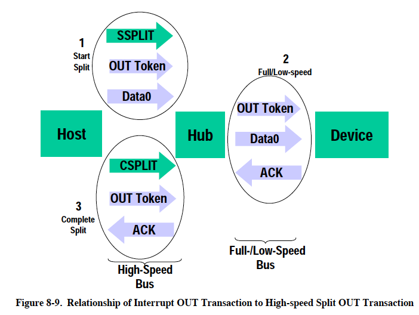
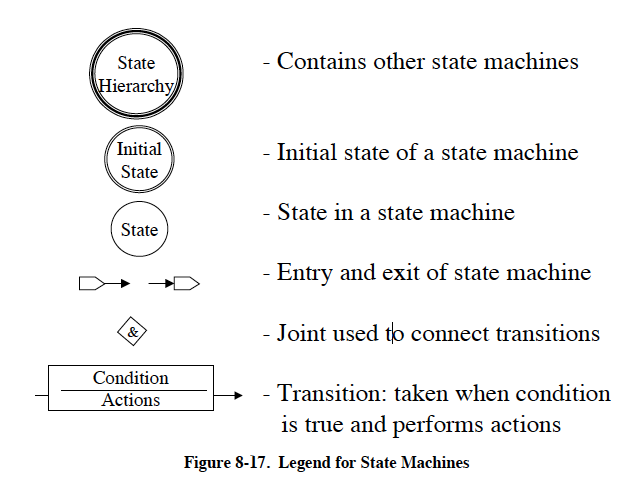

# 第8章 プロトコルレイヤ

この章では、USBプロトコルをフィールドとパケットの定義からボトムアップに
説明します。続いて、様々なトランザクションタイプのためのパケット
トランザクションフォーマットについて説明します。次いで、リンク層のフロー
制御とトランザクションレベルの障害回復について説明します。最後に、
リトライ同期、バブル、バスアクティビティ損失のリカバリ、高速PINGプロ
トコルについて説明します。

## 8.1 バイト/ビットの順序

ビットのバス上への送出はまず最下位ビット（LSb）から始まり、次のLSbが続き、
最後に最上位ビット（MSb）が送出されます。以下の図において、パケットは個々の
ビットとフィールドがバスを通って移動するように（左から右へ読む順序で）
表示されています。

標準的なディスクリプタ、リクエスト、レスポンスにおける複数バイトの
フィールドは、リトルエンディアン順、すなわちLSBからMSBの順に移動する
ものと解釈され、バス上を移動します。

## 8.2 SYNCフィールド

すべてのパケットは同期（SYNC）フィールドで始まります。これは最大エッジ
遷移密度を生成するコード化されたシーケンスです。受信データをローカル
クロックに合わせるために入力回路により使用されます。最初の送信機から
送られるSYNC はFS/LSでは8ビット、HSでは32ビットの長さと定義されています。
受信したSYNCフィールドは7章で説明するようにこれより短くなる場合があります。
SYNCは同期機構としてのみ機能し、以下のパケット図には表示されません
（7.1.10項参照）。SYNCフィールドの最後の2ビットは、SYNCフィールドの
終わりを識別するためのマーカーであり、そのために、PIDの開始を識別する
ためのカーカーでもあります。

## 8.3 パケットフィールドフォーマット

トークン、データ、ハンドシェイクパケットのフィールドフォーマットは次の
節で説明します。パケットのビット定義は符号化されていないデータ形式で
表示されます。NRZI符号化およびビットスタッフィングの効果は明確化のために
削除しました。すべてのパケットには明確なデリミタであるStart-of-Packetと
End-of-Packetがあります。Start-of-Packet（SOP）デリミタはSYNC
フィールドの一部であり、End-of-Packet（EOP）デリミタは第7章で説明されて
います。

### 8.3.1 パケット識別フィールド

すべてのUSBパケットのSYNCフィールドの直後にはパケット識別子（PID）が
あります。PIDは図8-1に示すように、4ビットのパケットタイプフィールドと
4ビットのチェックフィールドで構成されています。PIDはパケットのタイプを
示し、これによりパケットのフォーマットとパケットに適用されるエラー検出の
種類が推測されます。PIDの4ビットのチェックフィールドはパケットの残りの
部分が正しく解釈されるようにPIDの確実なデコードを保証します。PIDチェック
フィールドはパケットタイプフィールドの1の補数を取ることで生成されます。
4つのPIDチェックビットが対応するパケット識別子ビットの補数でない場合、
PIDエラーとなります。

ホストとすべてのファンクションは、受信したすべてのPIDフィールドを完全に
デコードする必要があります。間違ったチェックフィールドを持つPIDや定義
されていない値にデコードされたPIDを受信した場合は破損していると見なされ、
パケットの残りの部分と同様にパケットレシーバにより無視されます。PIDと
しては正しいが、自身がサポートしていないトランザクションタイプや方向を
受信した場合、ファンクションはそのパケットに応答してはいけません。
たとえば、INのみエンドポイントはOUTトークンを無視する必要があります。
PIDのタイプ、コーディング、その説明を表8-1に示します。

**注**: PIDビットはMSb順で表示されています。USBで送信する場合は
一番右のビット（ビット0）が最初に送信されます。

#### 8.3.2.1 アドレスフィールド

ファンクションアドレス（ADDR）フィールドはそのアドレスを通じて
ファンクションを指定します。ファンクションはトークンPIDの値によりデータ
パケットの送信元または送信先となります。図8-2に示すようにADDR<6:0>と
して合計128個のアドレスが指定されます。ADDRフィールドは、IN、SETUP、OUT
トークンとPING、SPLIT特殊トークンで指定されます。定義上、各ADDR値は
1つのファンクションを定義します。リセット時と電源投入時にファンクションの
アドレスはデフォルトのゼロ値になります。エヌメレーションプロセスの間に
ホストによりプログラムされる必要があります。ファンクションアドレス0は
デフォルトアドレスとして予約されており、他の用途に割り当てることは
できません。

#### 8.3.2.2 エンドポイントフィールド

図8-3に示す4ビットのエンドポイント（ENDP）フィールドを追加することで
複数のエンドポイントを必要とするファンクションのアドレス指定をより
柔軟にすることができます。エンドポイントアドレス0を除き、エンドポイント
番号はファンクションに固有な番号です。エンドポイントフィールドは、IN、SETUP、OUTの各トークンとPING特殊トークンで定義されています。すべての
ファンクションはエンドポイント番号ゼロのコントロールパイプ（デフォルト
コントロールパイプ）をサポートする必要があります。LSデバイスは1ファンク
ションにつき最大3つのパイプをサポートします。エンドポイント番号0の
コントロールパイプと2つの追加パイプ（2つのコントロールパイプ、コントロール
パイプとインターラプトエンドポイント、または2つのインターラプトエンド
ポイントのいずれか）です。FSとHSのファンクションは最大16のIN、OUT
エンドポイントをサポートすることができます。

### フレーム番号フィールド

フレーム番号フィールドは11ビットのフィールドで、フレーム単位でホストに
よりインクリメントされます。フレーム番号フィールドは最大値7FFHに達すると
ロールオーバされ、各（マイクロ）フレームの開始時にSOFトークンでのみ
送信されます。

### 8.3.4 データフィールド

データフィールドは0バイトから1,024バイトの範囲の整数バイトでなければ
なりません。図8-4は、複数バイトの場合のフォーマットを示しています。
各バイト内のデータビットはLSbが最初にシフトアウトされます。

データパケットサイズは第5章で説明されたように転送タイプにより異なります。

### 8.3.4 巡回冗長検査

巡回冗長検査（CRC）は、トークンパケットとデータパケットのすべての非PID
フィールドを保護するために使用されます。この文脈ではこれらのフィールドは
保護されたフィールドと考えることができます。PIDはCRCを含むパケットのCRC
チェックには含まれせん。すべてのCRCはビットスタッフィングが実行される前に、
トランスミッタにより対象フィールドから生成されます。同様に、CRCはスタッフ
ビットが取り除かれた後にレシーバーにより復号されます。トークンパケットと
データパケットのCRCは、すべてのシングルビットエラーとダブルビットエラーを
100％カバーします。失敗したCRCは、1つ以上の保護されたフィールドが破損して
いることを示すと考えられ、レシーバはそれらのフィールドを、そしてほとんどの
場合はパケット全体を無視します。

CRC生成とチェックのためにジェネレータとチェッカのシフトレジスタはオールワン
パターンをシードとします。データビットが送受信されるたびに現在の余りの
上位ビットがデータビットとXORされ、余りは1ビット左にシフトされ、低位ビット
がゼロに設定されます。XORの結果が1の場合、余りは生成多項式とXORされます。

チェックされるフィールドの最後のビットが送信されると、ジェネレータのCRCは
反転され、MSbからチェッカに送信されます。CRCの最後のビットがチェッカに
より受信され、エラーが発生していない場合、余りは多項式の残差と等しく
なります。

パケット受信の最後に計算されたチェックサムの余りが残差と一致しない場合は
CRCエラーが存在します。

ビットスタッフィング要件はCRCについても満たさる必要があり、これには
先行する6ビットがすべて1であった場合はCRCの最後に0を挿入する必要がある
ことも含まれます。

#### 8.3.5.1 トークンCRC

トークンのためには5ビットのCRCフィールドが提供され、IN、SETUP、OUT
トークンのADDRフィールドとENDPフィールド、SOFトークンのタイムスタンプ
フィールドをカバーします。PINGとSPLITの特殊トークンも5ビットのCRC
フィールドを含んでいます。生成多項式は次の式です。

> G(x) = x5 + x2 + 1

この多項式を表す2進ビットパターンは`00101B`です。すべてのトークンビットが
エラーなく受信された場合、レシーバでの5ビット残差は`01100B`になります。

#### 8.3.5.2 データCRC

データCRCはデータパケットのデータフィールドに適用される16ビットの
多項式です。生成多項式は次の式です。

> g(x) = x16 + x15 + x2 + 1

この多項式を表す2進ビットパターンは`1000000000000101B`です。すべての
データとCRCビットがエラーなく受信された場合、16ビットの残差は
`10000000001101B`になります。

## 8.4 パケットフォーマット

この節ではトークン、データ、ハンドシェイクの各パケットのパケット
フォーマットを示します。パケット内のフィールドは図中ではビットが
バス上にシフトされる順番で表示されています。

### 8.4.1 トークンパケット

図8-5にトークンパケットのフィールドフォーマットを示しました。
トークンはIN、OUT、SETUPのいずれかのパケットタイプを指定するPIDと
ADDR（アドレス）、ENDP（エンドポイント）の3つのフィールドで構成
されます。PING特殊トークンパケットもトークンパケットと同じフィールドを
持ちます。OUTトランザクションとSETUPトランザクションでは、アドレス
フィールドとエンドポイントフィールドが後続のデータパケットを受信する
エンドポイントを一意に識別します。INトランザクションではこれらの
フィールドはデータパケットを送信すべきエンドポイントを一意に識別
します。PINGトランザクションの場合、これらのフィールドはハンドシェイク
パケットで応答するべきエンドポイントをを一意に識別します。トークン
パケットを発行することができるのはホストだけです。IN PIDはファンクション
からホストへのデータトランザクションを定義します。OUT PIDとSETUP PIDは
ホストからファンクションへのデータトランザクションを定義します。
PING PIDはファンクションからホストへのハンドシェイクトランザクションを
定義します。

トークンパケットはすでに説明したようにアドレスフィールドとエンド
ポイントフィールドを対象とする5ビットのCRCを持ちます。CRCはPIDは
対象としません。PIDは自身にチェックフィールドを持つからです。
トークンパケットとSOFパケットは3バイトのパケットフィールドデータの
後にEOPによって区切られます。パケットが有効なトークンまたはSOFとして
デコードされたが3バイトの後にEOPで終了していない場合、レシーバは
それを無効とみなし、無視しなければなりません。

### 8.4.2 スプリットトランザクション特殊トークンパケット

USBはスプリットトランザクションのための特別なトークンSPLITを定義
しています。これは通常の3バイトのトークンパケッ トに対して、4バイトの
トークンパケットです。スプリットトランザクショントークンパケットは
追加のトランザクション固有の追加情報を持つ新たなトランザクション
タイプを提供します。スプリットトランザクショントークンは、ダウン
ストリーム側のポートにFS/LSデバイスが接続されたHSで動作するハブと
通信するホストコントローラの間のスプリットトランザクションをサポート
するために使用されます。SPLIT特殊トークンを使用する2つのスプリット
トランザクションが定義されています。スタートスプリットトランザクション
（SSPLIT）とコンプリートスプリットトランザクション（CSPLIT）です。
SPLIT特殊トークンのフィールドはこの後の節で説明するように特定の
スプリットトランザクションを示します。

#### 8.4.2.1 スプリットトランザクション

HSスプリットトランザクションはハブにFS/LSのデバイスが接続されている場合に
ホストコントローラとハブの間でのみ使用されます。このHSスプリットトラン
ザクションはハブとFS/LSデバイスのエンドポイントを介してFS/LSのトラン
ザクションを開始するために使用されます。また、HSスプリットトラン
ザクションにより、ハブからFS/LSトランザクションの完了ステータスを取得する
こともできます。この方法により、ホストコントローラは低速のFS/LSトラン
ザクションの処理/完了を待つことなく、他のHSトランザクションを開始することが
可能になります。スプリットトランザクションのステートマシンとトラン
ザクション定義の詳細については、11章を参照してください。

HSスプリットトランザクションはスタートスプリット(SSPLIT)とコンプリート
スプリット(CSPLIT)の2つの部分から成ります。スプリットトランザクションは
ホストコントローラとハブの間でのみ使用されるように定義されています。
その他のHSデバイスやFS/LSデバイスがスプリットトランザクションを使用する
ことはありません。

図8-6に一般的なスタートスプリットトランザクションを構成するパケットを
示します。トークンフェーズにはSPLITスペシャルトークンとFS/LSトークンの
2つのパケットが存在します。データ転送の方向とトランザクションタイプで
ハンドシェイクが定義されているか否かに応じて、トークンフェーズの後に
オプションでデータパケットとハンドシェイクパケットが続きます。スタート
スプリットトランザクションは特定の転送タイプとデータ方向により決定される
2、3、4個のパケットで構成されます。

図8-7に一般的なコンプリートスプリットトランザクションを構成するパケットを
示しました。トークンフェーズにはSPLITスペシャルトークンとFS/LSトークンの
2つのパケットが存在します。データ転送の方向と特定のトランザクション
タイプに応じて、コンプリートスプリットトークンフェーズパケットの後にデータ
パケットまたはハンドシェイクパケットが続きます。コンプリートスプリット
トランザクションは特定の転送タイプとデータ方向により決定される2、3個の
パケットで構成されます。

スプリットトランザクションの結果はコンプリートスプリットトランザクションに
より返されます。図8-8はインターラプトIN転送タイプの例についてのこの概念的
な「変換」を示しています。ホストはハブに対してスタートスプリット（1で示す）
パケットを発行し、その後、他のHSトランザクションを処理することができます。
スタートスプリットによりハブはいつかの時点でFS/LS INトークンを発行します
（2で示す）。デバイスは（この例では）INトークンにデータパケットで応答し、
ハブはデバイスにハンドシェイクで応答します。最後に、ホストはその後のいつか
の時点でデバイスから提供されたデータを取得するためにコンプリート
スプリットパケット（3で示す）を発行します。この例では、ハブはコンプリート
スプリットの前にデバイスのエンドポイントにFS/LSハンドシェイク（この例では
ACK）を提供しますが、コンプリートスプリットはハブにHSハンドシェイクを提供
しないことに注意してください。

通常のFS/LS OUTトランザクションも同様にスタートスプリットとコンプリート
スプリットに概念的に「変換」されます。図8-9はこの変換についてインターラプト
OUT転送を例に示したものです。ホストはSSPLITスペシャルトークン、OUTトークン、
DATAパケットからなるスタートスプリットトランザクショ ンを発行します。ハブは
その後のある時点でFS/LSバス上でOUTトークンとDATAパケットを発行します。
デバイスはハンドシェイクで応答します。その後のある時点で、ホストが
コンプリートスプリットトランザクションを発行し、ハブはデバイスから提供
された結果（FS/LSデータまたはハンドシェイク）で応答します。

次の2つの節では、スタートスプリットトークンパケットとコンプリート
スプリットパケットを構成するフィールドの詳細を説明します。図8-10と図8-12は
スプリットトークンパケットのフィールドを示しています。SPLIT特別トークンは
一般的なトークン形式に従い、PIDフィールド（SYNCの後）で始まり、CRC5
フィールド（とEOP）で終わります。スタートスプリットトークンパケットと
コンプリートスプリットトークンパケットはどちらも4バイト長です。SPLIT
トランザクションはホストからしか発信できません。スタートスプリット
トークンは8.4.2.2節で、コンプリートスプリットトークンは8.4.2.3節で定義
されています。

#### 8.4.2.2 スタートスプリットトランザクショントークン

Hub addrフィールドはこのFS/LSトランザクションにおいて指定されたFS/LS
デバイスをサポートしているハブのUSBデバイスアドレスを格納します。
このフィールドは8.3.2.1 節のADDRフィールドの定義と同じです。

SC (Start/Complete) フィールドが0に設定されたSPLIT特殊トークンパケ ットは
これがスタートスプリットトランザクション（SSPLIT）であることを示します。

PortフィールドはこのFS/LSトランザクションの宛先であるターゲットハブの
ポート番号を格納します。図8-11に示すようにPORT<6:0>で合計128ポートが
指定されます。ホストはシングルTTとマルチTTのハブ実装に対してPort
フィールドを正しく設定する必要があります。シングルTTのハブ実装では
Portフィールドを無視することができます。

S (Speed) フィールドは、このインターラプトトランザクションまたはコントロール
トランザクションの速度を次のように指定します。

- 0 : FS
- 1 : LS

バルクIN/OUTとアイソクロナスINのスタートスプリットではSフィールドに0を
設定する必要があります。バルク/コントロールIN/OUT、インターラプトIN/OUT、
アイソクロナスINのスタートスプリットではEフィールドを0に設定する必要が
あります。

FSアイソクロナスOUTのスタートスプリットでは、S (Start)フィールドと
E (End) フィールドを表8-2に示すようにHSデータペイロードとFSデータ
パケットのデータとの対応関係を指定します。

アイソクロナスOUTのスタートスプリットトランザクションはこれらのエン
コーディングを使用して複数のスタートスプリットを必要とするデータペイ
ロードを持つエンドポイントのスタートスプリットトランザクションの受信不足に
よる様々なエラーケースをハブが検出できるようにします。たとえば、大きな
FSデータペイロードが3つのスタートスプリットトランザクション（スタート
スプリット／開始、スタートスプリット／中間、スタートスプリット／終了）を
必要とする場合があります。これらのトランザクションのいずれかをハブが受信
できなかった場合、ハブはFSトランザクションを無視する（スタートスプリット/
開始を受信できなかった場合）か、対応するFSトランザクションに対してエラーを
強制します（他の2つのトランザクションのいずれかを受信できなかった場合）。
その他のエラー状態はマイクロフレーム中にスタートスプリットを受信できなかった
ことにより検出することができます。

ET (Endpoint Type) フィールドは表8-3に示すようにFS/LSトランザクションの
エンドポイントタイプを指定します。

このフィールドは、どのスプリットトランザクションステートマシンをこのFS/LS
トランザクションに使用するかをハブに指示します。

FS/LSデバイスアドレスとエンドポイント番号の情報はSPLIT特別トークン
パケットの後に続く通常のトークンパケッに含まれます。

#### 8.4.2.3 コンプリートスプリットトランザクショントークン

SCフィールドに1が設定されたSPLIT特殊トークンパケットはこれがコンプリート
スプリットトランザクション (CSPLIT) であることを示します。

Uビットは予約／未使用であり，ゼロ（0B）にリセットする必要があります。

コンプリートスプリットトークンパケットのその他のフィールドはスタート
スプリットトークンパケットの定義と同じです。

### 8.4.3 Start-of-Frame (SOF) パケット

SOF（Start-of-Frame）パケットはホストからFSバスでは公称1.00 ms±0.0005 ms
、HSバスでは125 μs±0.0625 μsに一度の割合で発行されます。SOFパケットは
図8-13に示すようにパケットタイプを示すPIDと11ビットのフレーム番号
フィールドで構成されます。

SOFトークンはSOFマーカーとそれに付随するフレーム番号で構成されるトークン
だけのトランザクションであり、各フレームの開始時刻に対応する正確な時間
間隔で配布されます。ハブを含むすべてのHS/FSのファンクションはSOFパケットを
受信します。SOFトークンは受信するファンクションに対してリターンパケットを
生成させないので特定のファンクションにSOFが到達したことを保証できません。

SOFパケットは2つのタイミング情報を配信します。ファンクションはSOF PIDを
検出するとSOFが発生したことを知ります。フレーム番号を追跡する必要のない
フレームタイミングに敏感な機能（FS動作のハブなど）は、SOF PIDをデコード
するだけでよく、フレーム番号とそのCRCは無視することができます。フレーム
番号を追跡する必要のあるファンクションは、PIDとタイムスタンプのいずれも
理解する必要があります。バスのタイミング情報を特に必要としないFSデバイス
はSOFパケットを無視することができます。

#### 8.4.3.1 USBフレームとマイクロフレーム

USBは、1ms間隔のSOFパケットで示されるFSの1msフレームタイムとそのジッター
許容範囲を定義してます。また、USBは125μsのフレームタイムと関連するジッター
許容値を持つHSマイクロフレームも定義しています（7章参照）。SOFパケットは
FSリンクでは（ホストコントローラまたはハブトランザクショントランスレータ）
により1msごとに生成されます。HSリンクでは続けて7つの125μs周期のSOFパケット
も生成されます。

図8-14はマイクロフレームとフレームとの関係を示しています。

HSデバイスは1msの間に8回（125μs毎）同じフレーム番号のSOFパケットを見る
ことになります。必要であれば、HSデバイスは前のSOFとは異なるフレーム番号を
持つSOFを検出し、それを0番目のマイクロフレームとして扱うことで特定の
マイクロフレーム「番号」を局所的に決定することができます。同じフレーム
番号を持つ後続の7つのSOFをマイクロフレーム1から7として扱うことができます。

### 8.4.4 データパケット

データパケットは図 8-15に示すように、PIDと0バイト以上のデータを含む
データフィールド、CRCで構成されます。データパケットには4つのタイプが
あり、DATA0、DATA1、DATA2、MDATAという異なるPIDで識別されます。2つの
データパケットPID (DATA0とDATA1) はデータトグル同期をサポートするために
定義されています (8.6節を参照)。4つのデータPIDはすべて高帯域幅のHS
アイソクロナスエンドポイントのデータPIDシーケンスに使用されます (5.9節を
参照)。3つのデータPID（MDATA、DATA0、DATA1）は、スプリットトラン
ザクションで使用されます（11.17～11.21節を参照）。

データは常に整数バイトで送信されなければなりません。データCRCはパケット
内のデータフィールドだけを対象として計算され、自身にチェックフィールドを
持つPIDは含まれません。

LSデバイスに許される最大データペイロードサイズは8バイトです。FSデバイスの
最大データペイロードサイズは1023です。HSデバイスの最大データペイロード
サイズは1024バイトです。

### 8.4.5 ハンドシェイクパケット

図8-16に示すように、ハンドシェイクパケットはPIDのみで構成されます。
ハンドシェイクパケットは、データトランザクションの状態を報告するために
使用され、データの正常な受信、コマンドの受諾または拒否、フロー制御、
停止状態を示す値を返すことができます。フロー制御をサポートするトラン
ザクションタイプだけがハンドシェイクを返すことができます。ハンドシェイクは
トランザクションのハンドシェイクフェーズでは常に返され、データフェーズでは
データの代わりに返されることもあります。ハンドシェイクパケットは1バイトの
パケットフィールドの後に続くEOPで区切られます。パケットが何らかの有効な
ハンドシェイクであるとデコードされたが1バイトに続いてEOPで終了しない場合、
レシーバはそれを無効とみなし無視する必要があります。

4種類のハンドシェイクパケットと1種類の特殊なハンドシェイクパケットがあります。

* **ACK**は、データパケットがデータフィールド上のビット詰めやCRCエラー
  なしに受信され、データPIDが正しく受信されたことを示します。ACKは
  シーケンスビットが一致し受信者がデータを受け入れることができる場合、
  またはシーケンスビットが不一致で送信社と受信者が互いに再同期する必要が
  ある場合に発行されます（詳細は8.6節を参照）。ACKハンドシェイクは
  データが送信され、ハンドシェイクが期待されるトランザクションにおいて
  のみ適用されます。ACKはINトランザクションではホストが、OUT、SETUP、
  PINGトランザクションではファンクションが返すことができます。
* **NAK**は、ファンクションがホストからのデータを受け取ることができ
  なかったこと（OUT）、またはファンクションがホストに送信するデータを
  持っていないこと（IN）を示します。NAKはINトランザクションのデータ
  フェーズ、またはOUTトランザクションとPINGトランザクションのハンド
  シェイクフェーズで、ファンクションだけが返することができます。ホストは
  決してNAKを発行することができません。NAKはファンクションが一時的に
  データを送受信できないが、いずれはホストの介入なしに送受信できるように
  なることを示すフロー制御の目的で使用されます。
* **STALL**は、INトークンまたはOUTのデータフェーズ後の応答として、または
  PINGトランザクションの応答としてファンクションにより返されます
  （図8-30と図8-38を参照）。STALLはファンクションがデータの送受信が
  できないこと、または制御パイプリクエストがサポートされていないことを
  示します。STALLを返した後のファンクションの状態は（デフォルトエンド
  ポイントを除くすべてのエンドポイントに対して）未定義です。ホストは
  いかなる条件下でもSTALLを返すことは許されていません。
  STALLハンドシェイクはデバイスにより2つの異なる状況のいずれかで使用
  されます。最初のケースは「機能的ストール」と呼ばれるものであり、
  エンドポイントに*停止*機能が設定されている場合です。機能的ストールの
  特別なケースは「コマンドによるストール」です。コマンドによるストールは
  第9章で詳述するようにホストが明示的にエンドポイントの停止機能を設定した
  場合に発生します。ファンクションのエンドポイントが停止したらファンク
  ションは停止を引き起こした条件がホストの介入によってクリアされるまで
  STALLを返し続けなければなりません。
  2番目のケースは「プロトコルストール」と呼ばるものであり8.5.3節で詳しく
  説明されます。プロトコルストールはコントロールパイプに特有のものです。
  プロトコルストールは意味と持続時間が機能的ストールとは異なります。
  プロトコルストールはコントロール転送のデータステージまたはステータス
  ステージで返され、次のコントロール転送（Setup）の開始時にストールの
  条件が終了します。本節では機能的ストールの一般的なケースについて説明
  します。
* **NYET**は、HSのみのハンドシェイクであり、2つの状況で返されます。後述
  するように、PINGプロトコルの一部としてHSエンドポイントにより返されます。
  また、FS/LSトランザクションがまだ完了していない場合やハブがスプリット
  トランザクションを処理できない場合に、ハブがスプリットトランザクションに
  応答する際にNYETが返されることもあります。詳細は11章を参照してください。
* **ERR**は、HSのみのハンドシェイクであり、HSハブがFS/LSバスのエラーを
  報告するために返されます。HSハブがスプリットトランザクションプロトコルの
  一部としてのみ返されます。詳細は11章を参照してください。

### 8.4.6 ハンドシェイク応答

送信ファンクションと受信ファンクションは表8-4から表8-6で説明されている
優先順位に基づいてハンドシェイクを返す必要があります。トランザクションの
種類や、ハンドシェイクがファンクションとホストのどちらで発行されるかに
より、すべてのハンドシェイクが許可されるわけではありません。ファンクション
へのトークン送信中にエラーが発生した場合、ファンクションは次のトークンを
受信して正常にデコードされるまでパケットに応答しないことに注意してください。

#### 8.4.6.1 INトランザクションに対するファンクションの応答

表8-4はファンクションがINトークンに対して行うことができる応答を示して
います。停止またはフロー制御の状態によりデータを送信できない場合、
ファンクションは各々STALLまたはNAKハンドシェイクを発行します。
ファンクションはデータを発行できるのであればそうします。受信したトークンが
破損していた場合、ファンクションは応答を返しません。

#### 8.4.6.1 INトランザクションに対するホストの応答

表8-5にINトランザクションに対するホストの応答を示します。ホストはただ一つの
ハンドシェイクタイプ、ACKしか返すことができません。破損したデータパケットを
受け取った場合、ホストはそのデータを破棄し、何の応答も返しません。（内部
バッファオーバーなどの問題で）ファンクションからのデータを受け取れない
場合、ホストはこの状態をエラーとみない、なんの応答も返しません。データを
受信することができ、データパケットをエラーなく受信できた場合、ホストは
データを受け入れ、ACKハンドシェイクを発行します。

#### 8.4.6.3 OUTトランザクションに対するファンクションの応答

OUTトランザクションに対するハンドシェイク応答を表8-6に示します。トークンの
デコードが成功したと仮定すると、データパケットを受信した際にファンクション
は3つのハンドシェイクタイプのいずれも返すことができます。データパケットが
破損していた場合、ファンクションはハンドシェイクを返しません。データ
パケットがエラーなしで受信されたが、ファンクションの受信側のエンド
ポイントが停止している場合、ファンクションはSTALLを返します。
トランザクションがシーケンスビット同期を維持しているときにミスマッチが
検出された場合（詳細は8.6節を参照）、ファンクションはACKを返し、データを
破棄します。データを受け入れることができ、エラーなしでデータを受信した場合、
ファンクションはACKを返します。フロー制御のためデータパケットを受信できない
場合、ファンクションはNAKを返します。

#### 8.4.6.4 SETUPトランザクションに対するファンクションの応答

SETUPはホストからファンクションへの特殊なデータトランザクションを定義して
います。これはエンドポイントの同期ビットをホストの同期ビットに初期化する
ことをホストに許可するものです。SETUPトークンを受信した際、ファンクションは
そのデータを受け入れなければなりません。ファンクションはSETUPトークンに
対してSTALLまたはNAKで応答することはできません。また、受信ファンクションは
SETUPトークンに続くデータパケットを受け入れなければなりません。
非コントロールエンドポイントがSETUPトークンを受信した場合はそのトラン
ザクションを無視し、何も応答を返してはなりません。

## 8.5 トランザクションパケットシーケンス

トランザクションを構成するパケットはエンドポイントタイプによって異なり
ます。エンドポイントのタイプには、バルク、コントロール、インターラプト、
アイソクロナスの4種類があります。

ホストコントローラとデバイスは、各タイプのトランザクションを正しく
シーケンスするためにそれぞれ異なるステートマシンを必要とします。以下の
節で示す図では、各タイプのトランザクション内でのパケットの正しいシーケンスを
定義するステートマシンを示しています。この図は必須の実装ではなく、
必須動作を指定するものであると捉えるべきです。

図8-17にステートマシン図の凡例を示しました。3線枠の円は別の（階層的な）
ステートマシンを参照していることを示します。2線枠の円は初期状態を表し
ます。1線枠の円はシンプルステートを表します。

矢印の付いた「タブ」は、ステートマシンの入口または出口（凡例の各々）です。
入り口/出口はステートマシン階層内の上位レベルにあるステートマシンの別の
状態に関連します。

菱形（ジョイント）は、複数の遷移を共通のポイントに結合するために
使用します。ジョイントは、1つの入力遷移を複数の出力遷移に、または複数の
入力遷移を1つの出力遷移に結合することが可能です。ジョイントを含むパスは
それが実行されるためには、その遷移のすべての条件が真でなければなりません。
パスは1つ以上のジョイントを含む遷移のシーケンスにすぎません。

遷移（トランジション）は、（上側の）条件と（下側の）アクションを区切る
真ん中に線があるブロックでラベル付けされています。遷移を行うには条件が
真であることが必要です。アクションと条件のシンタックスはVHDLです。
アクションは遷移が行われた場合に実行されます。円には太字の名前と
オプションでその状態に入ったときに実行される1つ以上のアクションを含みます。

図8-18 に示すように、ホストコントローラとデバイスのステートマシンは
コンテキストの中にあります。ホストコントローラはエンドポイントに対して
次に実行するトランザクションを決定し、コマンド（HC_cmd）をホスト
コントローラのステートマシンに発行します。これにより、ホストコントローラの
ステートマシンはダウンストリームバス（HSD1）上を移動する1つ以上の
パケットを発行します。

デバイスはバス（HSD2）からこれらのパケットを受信し、受信したパケットに
反応し、対応するエンドポイント（EP＿array内）の状態を介してその
ファンクション（複数可）で相互作用します。そして、デバイスはアップ
ストリームバス（HSU1）上にパケットで応答することができます。ホスト
コントローラのステートマシンはバスからパケットを受信し（HSU2）、ホスト
コントローラにトランザクションの結果を提供することができます（HC_resp）。
どのようなパケットがバスで送信されるかの詳細は、エンドポイントの転送
タイプとステートマシンが観察するバスのアクティビティにより決定されます。

ステートマシンは階層的な形式で提示されます。図8-19はホストコントローラの
トップレベルのステートマシンを示しています。非スプリットトラン
ザクションをこの章の残りの部分で説明します。スプリットトランザクションの
ステートマシン(HC_Do_startおよびHC_Do_complete)については第11章で示して
説明します

ホストコントローラのステートマシンはホストコントローラ内にあります。
ホストコントローラはダウンストリームにパケットを発行し（HSD1と表示）、
アップストリームパケットを受信します（HSU2と表示）。

デバイスのステートマシンはデバイスに配置されます。デバイスはパケットを
アップストリームに発行し（HSU1と表示）、ダウンストリームのパケットを
受信します（HSD2と表示）。

ホストコントローラはエンドポイントに対して次にどのようなトランザクションを
発行するかを指示するコマンドを持ちます。ホストコントローラは複数のエンド
ポイントのトランザクションを追跡します。ホストコントローラのステートマシンの
シーケンスは、ホストコントローラが現在のエンドポイントに対して次に何を行う
必要があるかを決定します。デバイスはそのエンドポイントごとに状態を持ちます。
デバイスのステートマシンは、トランザクションに対してデバイスがどのような
反応をするかを決定するためのシーケンスです。

付録にはステートマシンを構築する際に使用された宣言か含まれており、これは
ステートマシンの詳細をさらに理解するのに役立つと思われます。条件と
アクションのための擬似コードの手続きと関数がある。それらの簡単な説明も
付録に含まれています。

図8-20は非スプリットトランザクションタイプのためのホストコントローラの
全体的なステートマシン階層の概要を示しています。図8-21はデバイスのステート
マシンの階層を示しています。エンドポイントタイプに共通するステートマシンが
最初に示されています。最下位のエンドポイントタイプ固有のステートマシンに
ついては各エンドポイントタイプの節で示されます。

