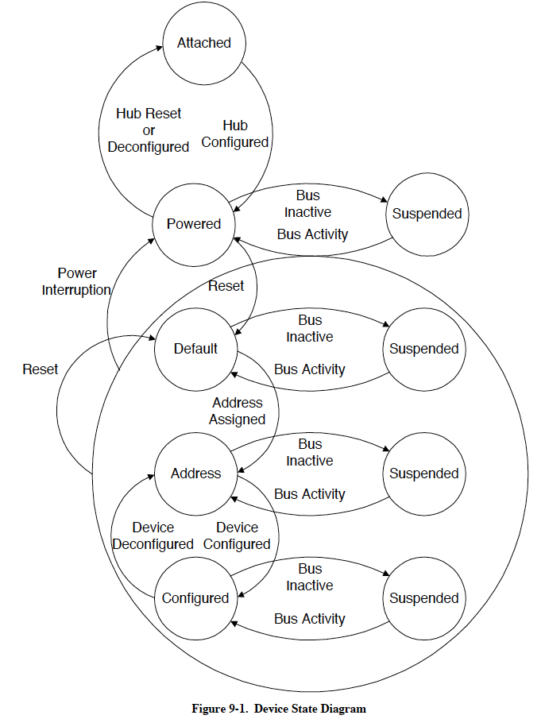
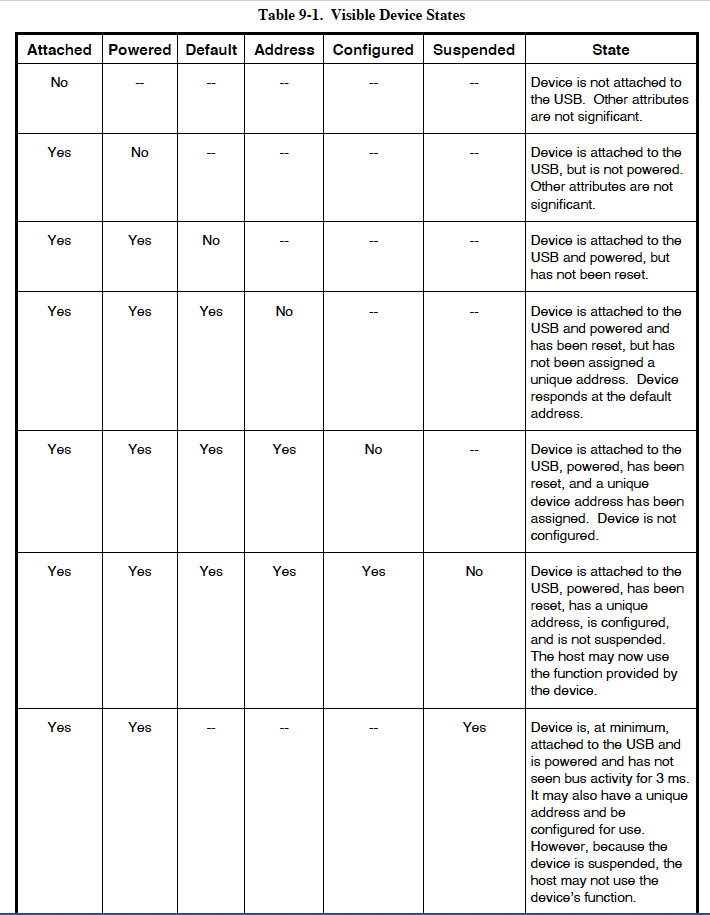
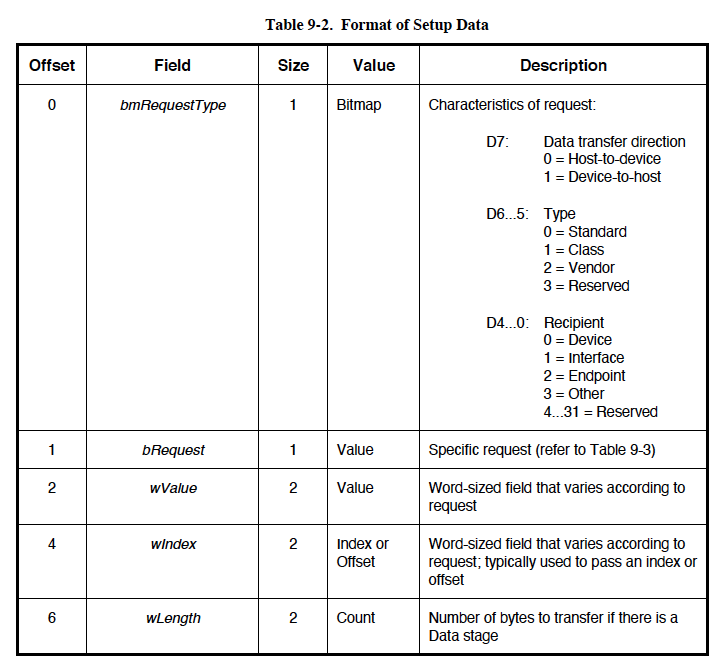
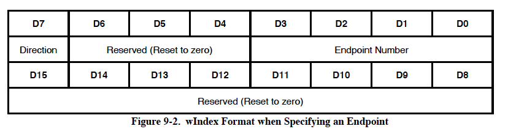
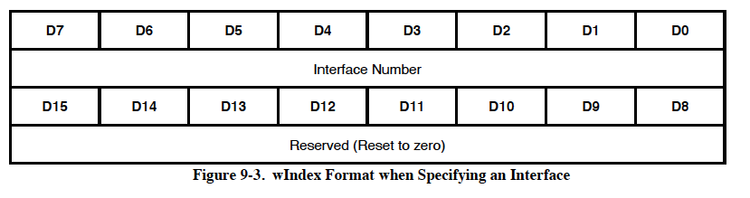
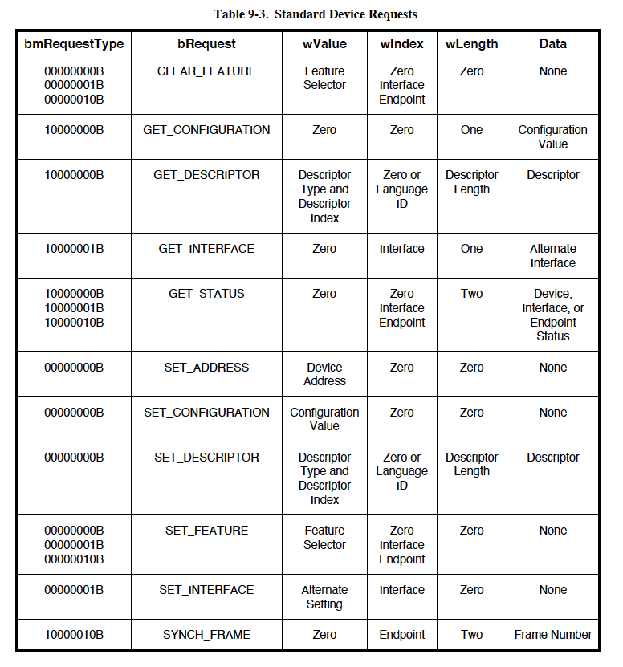
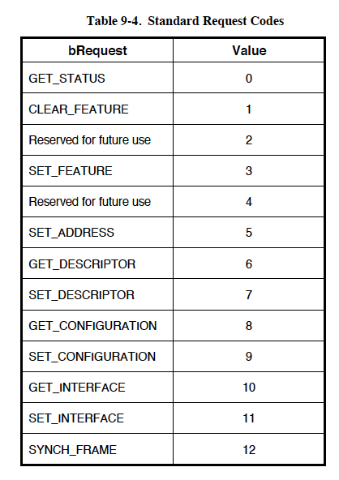
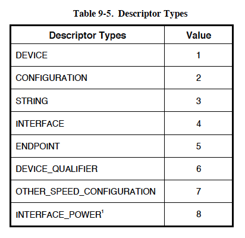
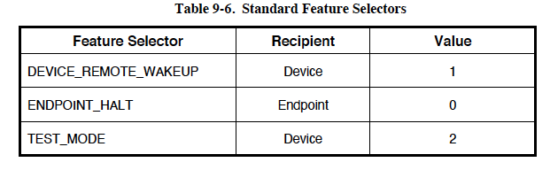
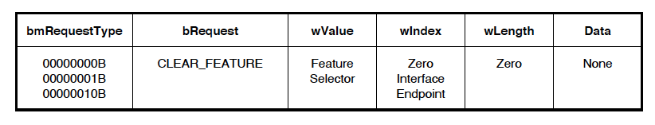

# 第9章 USBデバイスフレームワーク

USBデバイスは3層に分けることができます。

- 最下層はパケットを送受信するバスインターフェースです。
- 中間層はバスインターフェースとデバイス上の様々なエンドポイント間の
  データのルーティングを処理します。エンドポイントはデータの究極の消費者で
  あり、かつ生産者であり、データのソースまたはシンクであると考えることが
  できます。
- 最上層はマウスやISDNなどのシリアルバスデバイスにより提供される機能です。

この章ではUSBデバイスの中間層の一般的な属性と操作について説明します。
これらの属性と操作はデバイスの機能固有部分によりバスインタフェースを
介して最終的にホストと通信するために使用されます。

## 9.1 USBデバイスの状態

USBデバイスにはいくつかの状態があります。これらの状態にはUSBとホストから
見えるものもあれば、USBデバイスインターナルなものもあります。この節では
これらの状態について説明します。

### 9.1.1 外部から見えるデバイスの状態

この節では、外部から見えるUSBデバイスの状態について説明します（図9-1参照）。
表9-1に外部から見えるデバイスの状態をまとめました。

***注意***: USBデバイスは上流側のポートのリセット信号に応答してリセット
動作を行います。リセット信号が完了すると、USBデバイスはリセットされます。





#### 0.1.1.1 Attached 状態

USBデバイスはUSBにアタッチしたり、デタッチすることができます。USB
デバイスがUSBからデタッチされた場合の状態については本仕様では定義
されていません。本仕様はデバイスがアタッチされた際に必要な操作と属性
だけを扱います。

#### 9.1.1.2 Powered 状態

USBデバイスには、外部電源またはアタッチしたハブを介してUSBから電力を供給
することができます。外部から電力を供給されるUSBデバイスはセルフパワーと
呼ばれます。セルフパワーのデバイスはUSBにアタッチされる前にすでに電力が
供給されている場合がありますが、USBにアタッチされてデバイスにVBUSが供給
されるまで`Powered`状態であるとはみなされません。

セルフパワーとバスパワーの両者の構成をサポートするデバイスがあります。
デバイスを構成することによりどちらかの電源をサポートするデバイスも
あります。デバイスがセルフパワードである場合にのみデバイスの構成ができる
ものもあります。デバイスは自身の電力源をコンフィグレーション
ディスクリプタを通じて報告します。現在の電源はデバイスのステータスの
一部として報告されます。デバイスはいつでもその電源を変更することが
できます（たとえば、セルフパワーからバスパワーへと）。コンフィグレーション
で両者の電源モードに対応できる場合、報告される最大電力はどちらのモードで
あってもデバイスがVBUSから消費できる電力の最大値になります。デバイスは
モードに関係なくこの最大値を守る必要があります。コンフィギュレーションが
1つのパワーモードしかサポートしていない場合にデバイスの電源を変更した
場合は、デバイスは現在のコンフィギュレーションとアドレスを失い`Powered`
状態に戻ります。デバイスがセルフパワーで、その現在のコンフィギュレーション
で100mA以上を要求した場合、デバイスはバスパワーに切り替わりますが、
`Address`状態に戻らなければならなくなります。VBUSを使用してハブ
コントローラに電力を供給するセルフパワーハブは、ローカル電力が失われても
`Configuration`状態のままであることが許可されています。詳細は 11.13節を
参照してください。

ハブポートはアタッチとデタッチを含むポートステータスの変更を検出する
ために電源が供給されている必要があります。バスパワーハブは構成される
までは下流に電力を供給しません。構成された時点で初めて、構成と電源で
許容される範囲で電力を供給します。USBデバイスは最初に電源が投入されて
から規定の時間内にアドレス指定される必要があります（7章参照）。ポートへの
アタッチが検出されると、ホストはポートをイネーブルにすることができますが、
このとき同時にポートに接続されたデバイスをリセットします。

#### 9.1.1.3 Default 状態

デバイスに電源が供給された後、バスからリセットされるまで、いかなるバス
トランザクションにも応答してはなりません。リセットされた後、デバイスは
デフォルトアドレスでアドレス指定が可能になります。

リセット処理が完了すると、USBデバイスは正しい速度（LS/FS/HS）で動作します。
LSとFSの速度選択はデバイスの終端抵抗によって決定されます。HS動作が可能な
デバイスはリセット処理の一環としてHSで動作するかを決定します（詳細は7章を
参照）。

HS動作が可能なデバイスはFSで動作している電気的環境にある場合はFSでの
リセットに成功する必要があります。デバイスは正常にリセットされた後は
デバイスディスクリプタとコンフィギュレーションディスクリプタの要求にも
正常に応答し、適切な情報を返さなければなりません。デバイスはFSで動作
している場合、その意図する機能をサポートできる場合もあれば、できない
場合もあります。

#### 0.1.1.4 Address 状態

すべてのUSBデバイスは最初に電源を入れた時、またはデバイスがリセット
された後はデフォルトのアドレスを使用します。各USBデバイスにはアタッチ後、
またはリセット後にホストによりユニークなアドレスが割り当てられます。
USBデバイスは、スペンド中もその割り当てられたアドレスを保持します。

USBデバイスは現在ユニークなアドレスが割り当てられていても、デフォルトの
アドレスを使用していても、デフォルトパイプへのリクエストには応答します。

#### 9.1.1.5 Configured 状態

USBデバイスの機能を使用する前にデバイスをコンフィギュレーションする必要が
あります。デバイスの観点からは、コンフィギュレーションとは非ゼロの
コンフィギュレーション値を持つ`SetConfiguration()`リクエストを正しく処理
することです。デバイスを構成したり、代替設定を変更したりすると、影響を
受けるインタフェースのエンドポイントに関連するすべてのステータスと
構成値がデフォルト値に設定されます。これにはデータを使用するすべての
エンドポイントのデータトグルが値DATA0に設定されることも含まれます。

#### 9.1.1.6 Suspended 状態

電力を節約するために、USBデバイスは規定の時間バストラフィックが観測
されないと、自動的に`Suspended`状態になります（第7章参照）。`Suspended`
状態になっても、USBデバイスはアドレスやコンフィギュレーションを含む
すべての内部ステータスを保持します。

すべてのデバイスは、第7章で指定された時間の間にバスアクティビティが観測
されなかった場合サスペンドする必要があります。アタッチされたデバイスは
デフォルト以外のアドレスが割り当てられているか、構成済みであるかに関わらず、
電源が投入されている間、いつでもサスペンドする準備をしておく必要があります。
バスアクティビティはホストが自らサスペンドモードに入ることにより停止する
ことがあります。また、USBデバイスはアタッチしているハブポートが無効化
された場合にも`Suspended`状態になります。これを選択的サスペンドと呼びます。

USBデバイスはバスアクティビティがあると`Suspended`モードを終了します。
USBデバイスは、リモートウェイクアップを示す電気信号を使用して、ホストに
サスペンドモードまたは選択的サスペンドを終了するよう要求することもできます。
デバイスがリモートウェイクアップのシグナルを出せるか否かは任意です。
USBデバイスがリモートウェイクアップシグナルを出せる場合、デバイスは
ホストによるこの機能の有効化と無効化をサポートする必要があります。
デバイスがリセットされた場合、リモートウェイクアップ信号は無効化され
なければなりません。

### 9.1.2 バスエヌメレーション

USBデバイスがUSBに接続されたり取り外されたりするとき、ホストはバス
エニュメレーションと呼ばれるプロセスを用いて、必要なデバイスの状態変化を
特定し、管理します。USBデバイスが電源の入ったポートに接続されると以下の
動作が行われます。

1. USBデバイスが接続されたハブは、ステータス変更パイプの応答により
   このイベントをホストに通知します（詳細は11.12.3節を参照）。この時点では
   USBデバイスはPowered状態であり、USBデバイスが接続されているポートは
   無効化されています。
2. ホストはハブに問い合わせることで変化の正確な内容を判断します。
3. これでホストは新しいデバイスが接続されたポートがわかったので挿入処理が
   完了し、デバイスの電源が安定するまで少なくとも100ms待ちます。その後、
   ホストはポートに対してポートイネーブルコマンドとリセットコマンドを発行
   します。接続からデバイスのリセットまでのイベントのシーケンスとタイミング
   については、7.1.7.5節を参照してください。
4. ハブはそのポートに必要なリセット処理を行います（11.5.1.5節を参照）。
   リセット信号が解除されるとそのポートは有効化されたことになります。
   この時点ではUSBデバイスはDefaultの状態にあり、VBUSから100mAを超えない
   電流を引き込むことができます。すべてのレジスタと状態がリセットされ、
   デフォルトアドレスに応答します。
5. ホストはUSBデバイスに固有のアドレスを割り当て、デバイスをAddress状態に
   移行させます。
6. USBデバイスが固有のアドレスを受け取る前でも、そのデフォルトコントロール
   パイプはデフォルトアドレスでアクセス可能です。ホストはデバイス
   ディスクリプタを読み、このUSBデバイスのデフォルトパイプが使用できる
   実際の最大データペイロードサイズを決定します。
7. ホストは0からn-1（nはコンフィギュレーションの数）のコンフィギュレーション
   ディスクリプタを読み、デバイスのコンフィギュレーション情報を読み取ります。この処理は完了までに数ミリ秒かかることがあります。
8. コンフィギュレーション情報とUSBデバイスの使用方法に基づいて、ホストは
   デバイスにコンフィギュレーション値を割り当てます。これによりデバイスは
   Configured状態になり、このコンフィギュレーション内のすべてのエンド
   ポイントは記述された特性を持つようになります。USBデバイスは選択された
   コンフィギュレーションのディスクリプタに記述されている量のVBUS電力を
   引き出せるようになります。デバイスの視点から見るとこれで使用可能な
   状態になったことになります。

USBデバイスが取り外されるとハブは再びホストに通知を送ります。デバイスを
取り外すとデバイスが接続されていたポートが無効になります。デタッチ通知を
受信すると、ホストはローカルのトポロジー情報を更新します。

## 9.2 一般的なUSBデバイス操作

すべてのUSBデバイスは共通の操作をサポートします。この節ではこれらの操作に
ついて説明します。

### 9.2.1 動的な

USBデバイスはいつでも脱着できます。装着ポイント、すなわちポートを提供する
ハブはポートの状態変化をすべて報告する責任があります。

ホストは、デバイスの装着を検出すると、デバイスが装着されたハブポートを
有効にします。これはデバイスをリセットする効果も持ちます。リセットされた
USBデバイスは次のような性質を持ちます。

- デフォルトUSBアドレスに応答する
- コンフィギュレーションされていない
- 初期状態で停止していない

ハブポートからデバイスを取り外すと、ハブはデバイスが装着されていたポートを
無効にし、ホストに取り外しを通知します。

### 9.2.2 アドレスの付与

USBデバイスが装着されると、ホストはデバイスに一意のアドレスを割り当てる
責任を負います。これは、デバイスがホストによってリセットされ、デバイスが
接続されたハブポートが有効になった後に行われます。

### 9.2.3 コンフィグレーション

USBデバイスはその機能が使用できるようになる前にコンフィギュレーションを
行う必要があります。USBデバイスのコンフィギュレーションはホストが行います。
通常、ホストはUSBデバイスにコンフィギュレーション情報を要求しデバイスの
機能を決定します。

コンフィグレーションプロセスの一環として、ホストはデバイスのコンフィグ
レーションを行い、必要に応じて、適切なインタフェース代替設定を選択します。

1つのコンフィグレーションにおいてデバイスは複数のインタフェースをサポート
することができます。インターフェースはデバイスの単一の特性や機能をホストに
提示する関連するエンドポイントのセットです。この関連するエンドポイントの
セットとの通信に使用されるプロトコルとインタフェース内の各エンドポイントの
目的はデバイスクラスまたはベンダー固有定義として指定されることがあります。

さらに、コンフィグレーション内のインタフェースは、関連するエンドポイントの
数や特性を再定義する代替設定を持つことができます。この場合、デバイスは
指定されたインタフェースの現在の代替設定を報告する`GetInterface()`要求と
指定されたインタフェースの代替設定を選択する`SetInterface()`要求をサポート
しなければなりません。

コンフィグレーション内のインターフェースディスクリプタにはインターフェース
番号と代替設定を識別するフィールドが含まれています。インターフェースには0から
コンフィグレーションでサポートされている同時使用インターフェース数-1までの
番号が付けられます。代替設定は0から指定されたインタフェースの代替設定の数-1
の範囲です。デバイスが最初にこんふぃぐれーされたときのデフォルトの設定は
代替設定ゼロです。

関連するUSBデバイスのグループを管理できる適応型デバイスドライバをサポート
するためにデバイスディスクリプタとインタフェースディスクリプタには、`Class`、
`SubClass`、`Protocol`の各フィールドがあります。これらのフィールドはUSB
デバイスが提供するファンクションとデバイスのファンクションとの通信に使用
されるプロトコルを識別するために使用されます。クラスコードはUSBクラス仕様の
一部としてカテゴライズされた関連デバイスグループに割り当てられます。デバイス
クラスはさらにサブクラスに分割されることがあります。クラスまたはサブクラス
内では、ホストソフトウェアがデバイスと通信する方法をプロトコルコードで定義
することができます。

**注意**: クラス、サブクラス、プロトコルコードの割り当ては調整が必要ですが、
この仕様の範囲外です。

### 9.2.4 データ転送

データはUSBデバイスのエンドポイントとホストの間で4つの方法のいずれかで
転送されます。4種類の転送の定義については第5章を参照してください。異なる
代替設定の異なるタイプのデータ転送にエンドポイント番号を使用することが
できます。ただし、一旦代替設定が選択されたら（インターフェイスのデフォルト
設定を含む）USBデバイスエンドポイントは別の代替設定が選択されるまでただ
一つのデータ転送方法を使用します。

### 9.2.5 電力管理

USBデバイスの電力管理には以下の節で説明する問題があります。

#### 9.2.5.1 電力の割り当て

USBのバスパワーは限られたリソースです。デバイスのエヌメレーションの際、
ホストはデバイスのパワー要件を評価します。特定のコンフィギュレーションの
パワー要件がデバイスで利用できるパワーを超える場合、ホストソフトウェアは
そのコンフィギュレーションを選択してはなりません。

USBデバイスはコンフィグレーションされるまではVBUSから消費する電力を1負荷
単位以下に制限しなければなりません。停止中のデバイスはコンフィグレーションの
有無にかかわらず、第7章に定義されているようにそのバス消費電力を制限しなければ
ならなりません。デバイスが接続されるポートの電力能力により、USBデバイスは
コンフィグレーション後にVBUSから最大5負荷単位の電力を引き出すことができる
場合があります。

#### 9.2.5.2 リモートウェイクアップ

リモートウェイクアップは停止中のUSBデバイスが同じく停止中の可能性のある
ホストに信号を送ることを可能にします。これは必要に応じてホストは停止モード
から再開し、停止中のUSBデバイスがホストに信号を送るきっかけとなった外部
イベントを処理するよう通知するものです。USBデバイスはコンフィグレーション
ディスクリプタでリモートウェイクアップをサポートしているか否かを報告します。
デバイスはリモートウェイクアップをサポートしている場合、標準的なUSB
リクエストを使用してこの機能を有効または無効にする機能を持つ必要があります。

リモートウェイクアップは7.1.7.7節で説明されている電気信号を使用して実現
されます。

### 9.2.6 リクエスト処理

SetAddress()リクエスト（9.4.6節を参照）を除いて、デバイスはSetupに受けて
ACKを返すとすぐにリクエストの処理を開始することができます。デバイスは
Statusステージが正常に完了する前にリクエストの処理を「完了」することが
期待されています。リクエストの中には完了するのに何ミリ秒もかかる操作を
開始するものがあります。このようなリクエストの場合、デバイスクラスが
Statusステージの完了以外のメソッドを定義して操作が完了したことを示す必要が
あります。たとえば、ハブポートのリセットは完了までに最低10ミリ秒かかります。
`SetPortFeature(PORT_RESET)`（11章参照）リクエストはポートのリセットが
開始されると「完了」します。リセット操作の完了は、ポートのステータス変化が
そのポートが有効になったことを示すように設定されると通知されます。この技法は
リクエストが比較的長い時間を要することが分かっている場合にホストが完了を
常にポーリングする必要がないようにするものです。

#### 9.2.6.1 リクエスト処理のタイミング

すべてのデバイスはタイムリーにリクエストを処理することが期待されています。
USBではどのようなコマンドでも5秒を上限として処理するように設定しています。
この制限はすべての場合に適用されるわけではありません。制限事項については
以下の節で説明されています。以下に示す制限事項は幅広い実装を想定している
ことに留意してください。USBシステムのすべてのデバイスがリクエスト処理に
割り当てられている最大時間を使用したらユーザーエクスペリエンスが損なわれます。
このため、実装は可能な限り短い時間でリクエストを完了させるよう努力する
必要があります。

#### 9.2.6.2 リセット/リジュームのリカバリ時間

USBシステムソフトウェアは、ポートがリセットまたはリジュームされた後に
ポートに接続されたデバイスがデータ転送に応答するまで10msの「リカバリ」
間隔を与えることが期待されています。デバイスはリカバリ期間中のデータ転送を
無視することができます。

リカバリ間隔が終わったら（リセットの終了またはレジューム信号の終了時の
EOPの終了から測定）、デバイスはいつでもデータ転送を受け入れなければなりません。

#### 9.2.6.3 アドレス設定処理

リセット/リジュームのリカバリ間隔後、デバイスがSetAddress()リクエストを
受信した場合、デバイスは50ms以内リクエストの処理を完了し、リクエストの
Statusステージを成功させることができなければなりません。SetAddress()
リクエストの場合、デバイスが長さ0のStatusパケットを送信するか、Status
ステージのデータパケットに対する応答のACKを見たときに、Statusステージは
正常に完了します。

Statusステージが正常に終了した後、デバイスには2msのSetAddress()リカバリ
間隔が許可されます。この間隔が終了したらデバイスは新しいアドレスにアドレス
指定されたセットアップパケットを受け入れることができなければなりません。
また、リカバリ間隔が終了した時点で、デバイスは旧アドレスに送信された
トークンに応答してはなりません（もちろん、旧アドレスと新アドレスが同じで
ある場合を除きます）。

#### 9.2.6.4 標準的なデバイスリクエスト

Dataステージを必要としない標準的なデバイスリクエストの場合、デバイスは
リクエストを受信してから50MS以内にリクエストを完了し、リクエストの
Statusステージを正常に完了することができなければなりません。この制限は
デバイス、インターフェース、エンドポイントへのリクエストに適用されます。

ホストへのデータステージ転送を必要とする標準的なデバイスリクエストの場合、
デバイスはリクエストの受信してから500ms以内に最初のデータパケットをホストに
返すことができなければなりません。後続のデータパケットがある場合、デバイスは
前のパケットの送信が正常に完了してから500ms以内に返すことができなければ
なりません。そして、デバイスは最後のデータパケットを返した後、50ms以内に
ステータスステージを正常に完了することができなくてはなりません。

デバイスへのデータステージ転送を必要とする標準的なデバイスの要求には、
5秒制限が適用されます。これは、デバイスが受け入れることができる最大速度で
ホストがデータを提供する場合、デバイスはホストからのすべてのデータパケットを
受け入れ、ステータスステージを正常に完了することができなければならないことを
意味します。ホストに起因するパケット間の遅延はデバイスがリクエストを完了
するために許容される時間に追加されます。

#### 9.2.6.5 クラス固有のリクエスト

クラス文書で特に免除されている場合を除き、クラス固有のすべてのリクエストは
標準的なデバイスリクエストのタイミング制限を満たす必要があります。クラス
文書が免除を規定している場合も、その免除はリクエストベースに指定することが
できるだけです。

クラス文書はデバイスに対してこのセクションで指定されているよりも迅速な応答を
要求することができます。より速い応答を標準的な要求とクラス固有の要求に対して
要求することができます。

#### 9.2.6.6 速度依存のディスクリプタ

HSで動作可能なデバイスはFSまたはHSのいずれかで動作できます。デバイスは
リセット処理の中でトランシーバを正しく管理する必要があるため常に動作速度を
把握しています（リセットの詳細については第7章を参照）。また、デバイスは
リセットシーケンスを完了した後は単一の速度で動作します。特に、通常動作時の
速度切り替えはありません。しかし、HS動作可能なデバイスは速度に依存した
コンフィグレーションを持つ場合があります。すなわち、HS動作時にのみ可能な
コンフィグレーションとFS動作時にのみ可能なコンフィグレーションです。HS
動作可能なデバイスはその速度依存のコンフィグレーションの報告をサポート
しなければなりません。

HS動作可能なデバイスは現在の動作速度で有効なディスクリプタ情報で応答します。
たとえば、コンフィギュレーションディスクリプタを要求された場合、デバイスは
現在の動作速度（たとえばFS）に対するものだけを返します。ただし、HS動作と
FS動作の利用を決定するための方法が必要です。

HS動作が可能なデバイスは2つのディスクリプタを使って他方の動作速度に関する
コンフィグレーション情報を報告することができます。2つのディスクリプタとは
(other_speed) device_qualifierディスクリプタとother_speed_configuration
ディスクリプタです。これら2つのディスクリプタは対応するディスクリプタ
タイプ値を持つGetDescriptor要求によりホストにより取得されます。

**注**: これらのディスクリプタはホストが対応するGetDescriptorリクエストを
明示的に発行しない限り取得されません。この2つのリクエストが発行されない場合
デバイスは単に一つの速度しかないデバイスであるように見えます。

HSに対応するデバイスはそのディスクリプタの`bcdUSB`フィールドのバージョン
番号を0200Hに設定する必要があります。これはデバイスがUSB2.0で定義されている
other_speedリクエストに対応していることを示します。ディスクリプタのバージョン
番号が0200H未満のデバイスは、other_speedリクエストを受信した場合、リクエスト
エラー応答（次章参照）を発生させる必要があります。USB1.xデバイス（デバイス
ディスクリプタのバージョンが0200H未満のもの）はother_speedリクエストを発行
してはいけません。

### 9.2.7 リクエストエラー

受信したリクエストが、デバイスに定義されていない、デバイスの現在の設定に
不適切である、または、リクエストに適合しない値を持つ場合、Request Errorに
なります。デバイスは、次のDataステージトランザクションへの応答、または、
メッセージのStatusステージでSTALL PIDを返すことによってRequest Errorに
対処します。不要なバスアクティビティを回避するため、STALL PIDは次のData
ステージトランザクションで返す方が望ましい。

## 9.3 USBデバイスリクエスト

すべてのUSBデバイスはデバイスのデフォルトコントロールパイプでホストからの
リクエストに応答します。これらのリクエストはコントロール転送を使用して
行われます。リクエストとリクエストのパラメータはSetupパケットでデバイスに
送信されます。ホストは表9-2に示すフィールドに渡される値を確定する責任を
負います。すべてのSetupパケットは8バイトです。



### 9.3.1 bmRequestType

このビットマップフィールドは指定するリクエストの特性を識別します。中でも
このフィールドはコントロール転送の第2フェーズにおけるデータ転送の方向を
識別します。Dataステージが存在しないことを意味する`wLength`フィールドが
0の場合は、`Direction`ビットの状態は無視されます。

USB仕様書ではすべてのデバイスがサポートしなければならない一連の標準
リクエストを定義しています。これらは表9-3に列挙されています。さらに、
デバイスクラスは追加のリクエストを定義することができます。デバイスベンダも
デバイスがサポートするリクエストを定義することができます。

リクエストはデバイス、デバイスのインターフェイス、またはデバイスの特定の
エンドポイントに向けることができます。このフィールドは意図するリクエストの
受信者の指定も行います。インターフェースまたはエンドポイントが指定された
場合、`wIndex`フィールドはインターフェースまたはエンドポイントを識別します。

### 9.3.2 bRequest

このフィールドは特定のリクエストを指定します。`bmRequestType`フィールドの
`Type`ビットはこのフィールドの意味を変更します。この仕様書は、標準的な
リクエストを示している、このビットがゼロにリセットされる時の`bRequest`
フィールドの値だけを定義しています（表9-3を参照）。

### 9.3.3 wValue

このフィールドの内容はリクエストにより異なります。これはリクエストに応じた
パラメータをデバイスに渡すために使用されます。

### 9.3.4 wIndex

このフィールドの内容はリクエストにより異なります。これはリクエストに応じた
パラメータをデバイスに渡すために使用されます。

`wIndex`フィールドはエンドポイントまたはインターフェイスを指定するリクエスト
でよく使用されます。図9-2はエンドポイントを指定する際に使用される`wIndex`の
フォーマットを示しています。



`Direction`ビットは指定された*エンドポイント番号*を持つOUTエンドポイントを
示す場合は0に、INエンドポイントを示す場合は1に設定されます。コントロール
パイプの場合、リクエストの`Direction`ビットは0に設定されているはずですが
デバイスは`Direction`ビットのどちらの値も受け入れることができます。

図9-3はインタフェースを指定する際に使用される`wIndex`のフォーマットを
示しています。



### 9.3.5 wLength

このフィールドはコントロール転送の第2フェーズで転送されるデータの長さを
指定します。データ転送の方向（ホストからデバイスか、デバイスからホストか）は
`bmRequestType`フィールドの`Direction`ビットで示されます。このフィールドが
0である場合、データ転送フェーズは存在しません。

INリクエストの場合、デバイスは`wLength`値で示された以上のデータを返しては
いけませんが、より少ないデータを返すことはできます。OUTリクエストでは
`wLength`は常にホストから送信される正確なデータ量を示します。`wLength`で
指定された以上のデータをホストが送信した場合のデバイスの動作は未定義です。

## 9.4 標準デバイスリクエスト

本節ではすべてのUSBデバイスに定義されている標準デバイスリクエストに
ついて説明します。表9-3に標準デバイスリクエストの概要を、表9-4に
標準リクエストコード、表9-5にディクリプタのタイプを示します。

USBデバイスはアドレスが割り当てられていなくても、あるいはコンフィグ
レーションが行われていなくても、標準デバイスリクエストには応答する
必要があります。







機能セレクタはリモートウェイクアップなどのデバイスやインターフェース、
エンドポイントに固有の機能を有効化したり設定したりするときに使用されます。
機能セレクタの値を表9-6に示しました。



そのUSBデバイスにはサポートされていない、または無効なリクエストが行われた
場合、デバイスはリクエストのDataステージまたはStatusステージでSTALLを返す
ことで応答します。デバイスがSetupステージでエラーを検出した場合、デバイスは
DataステージまたはStatusステージの初期の段階でSTALLを返すことが望ましい。
サポートされていない、または無効なリクエストの受け入れはコントロール
パイプのオプションの`Halt`機能を設定させる要因には**なりません**。何らかの
理由でデバイスがエラー状態になりデフォルトコントロールパイプを介した通信が
できなくなった場合、デバイスをリセットしてその状態をクリアし、デフォルト
コントロールパイプを再起動させる必要があります。

### 9.4.1 Clear機能

このリクエストは特定の機能をクリアしたり、無効にしたりするのに使用されます。



`wValue`の機能セレクタ値は受信者に適したものでなければなりません。
受信者がデバイスの場合はデバイス機能セレクタ値だけが、受信者が
インタフェースの場合はインタフェース機能セレクタ値だけが、受信者がエンド
ポイントの場合はエンドポイント機能セレクタ値だけがそれぞれ使用できます。

どの受信者にどの機能セレクト値が定義されているかは表9-6を参照してください。

クリアできない機能、存在しない機能、存在しないインタフェースやエンド
ポイントを参照している`ClearFeature()`リクエストはデバイスがRequest Errorで
応答する原因となります。

`wLength`が0でない場合、デバイスの動作は指定されません。

```
Default状態     デバイスがDefault状態のときにこのリクエストを
                受信したときのデバイスの動作は指定されない。
Address状態     デバイスがAddress状態にある場合、このリクエストは
                有効です。インターフェースまたはエンドポイント0以外の
                エンドポイントの参照はデバイスがRequest Errorで応答する
                原因となります。
Configured状態  デバイスがConfiguredステートにある場合、このリクエストは
                有効です。
```

**注**: Test_Mode機能はClearFeature()リクエストではクリアできません。
