# 第9章 USBデバイスフレームワーク

USBデバイスは3層に分けることができます。

- 最下層はパケットを送受信するバスインターフェースです。
- 中間層はバスインターフェースとデバイス上の様々なエンドポイント間の
  データのルーティングを処理します。エンドポイントはデータの究極の消費者で
  あり、かつ生産者であり、データのソースまたはシンクであると考えることが
  できます。
- 最上層はマウスやISDNなどのシリアルバスデバイスにより提供される機能です。

この章ではUSBデバイスの中間層の一般的な属性と操作について説明します。
これらの属性と操作はデバイスの機能固有部分によりバスインタフェースを
介して最終的にホストと通信するために使用されます。

## 9.1 USBデバイスの状態

USBデバイスにはいくつかの状態があります。これらの状態にはUSBとホストから
見えるものもあれば、USBデバイスインターナルなものもあります。この節では
これらの状態について説明します。

### 9.1.1 外部から見えるデバイスの状態

この節では、外部から見えるUSBデバイスの状態について説明します（図9-1参照）。
表9-1に外部から見えるデバイスの状態をまとめました。

***注意***: USBデバイスは上流側のポートのリセット信号に応答してリセット
動作を行います。リセット信号が完了すると、USBデバイスはリセットされます。


#### 0.1.1.1 Attached 状態

USBデバイスはUSBにアタッチしたり、デタッチすることができます。USB
デバイスがUSBからデタッチされた場合の状態については本仕様では定義
されていません。本仕様はデバイスがアタッチされた際に必要な操作と属性
だけを扱います。

#### 9.1.1.2 Powered 状態

USBデバイスには、外部電源またはアタッチしたハブを介してUSBから電力を供給
することができます。外部から電力を供給されるUSBデバイスはセルフパワーと
呼ばれます。セルフパワーのデバイスはUSBにアタッチされる前にすでに電力が
供給されている場合がありますが、USBにアタッチされてデバイスにVBUSが供給
されるまで`Powered`状態であるとはみなされません。

セルフパワーとバスパワーの両者のコンフィグレーションをサポートするデバイスがあります。
デバイスをコンフィグレーションすることによりどちらかの電源をサポートするデバイスも
あります。デバイスがセルフパワードである場合にのみデバイスのコンフィグレーションができる
ものもあります。デバイスは自身の電力源をコンフィグレーション
ディスクリプタを通じて報告します。現在の電源はデバイスのステータスの
一部として報告されます。デバイスはいつでもその電源を変更することが
できます（たとえば、セルフパワーからバスパワーへと）。コンフィグレーション
で両者の電源モードに対応できる場合、報告される最大電力はどちらのモードで
あってもデバイスがVBUSから消費できる電力の最大値になります。デバイスは
モードに関係なくこの最大値を守る必要があります。コンフィグレーションが
1つのパワーモードしかサポートしていない場合にデバイスの電源を変更した
場合は、デバイスは現在のコンフィグレーションとアドレスを失い`Powered`
状態に戻ります。デバイスがセルフパワーで、その現在のコンフィグレーション
で100mA以上を要求した場合、デバイスはバスパワーに切り替わりますが、
`Address`状態に戻らなければならなくなります。VBUSを使用してハブ
コントローラに電力を供給するセルフパワーハブは、ローカル電力が失われても
`Configuration`状態のままであることが許可されています。詳細は 11.13節を
参照してください。

ハブポートはアタッチとデタッチを含むポートステータスの変更を検出する
ために電源が供給されている必要があります。バスパワーハブはコンフィグレーションされる
までは下流に電力を供給しません。コンフィグレーションされた時点で初めて、コンフィグレーションと電源で
許容される範囲で電力を供給します。USBデバイスは最初に電源が投入されて
から規定の時間内にアドレス指定される必要があります（7章参照）。ポートへの
アタッチが検出されると、ホストはポートをイネーブルにすることができますが、
このとき同時にポートに接続されたデバイスをリセットします。

#### 9.1.1.3 Default 状態

デバイスに電源が供給された後、バスからリセットされるまで、いかなるバス
トランザクションにも応答してはなりません。リセットされた後、デバイスは
デフォルトアドレスでアドレス指定が可能になります。

リセット処理が完了すると、USBデバイスは正しい速度（LS/FS/HS）で動作します。
LSとFSの速度選択はデバイスの終端抵抗によって決定されます。HS動作が可能な
デバイスはリセット処理の一環としてHSで動作するかを決定します（詳細は7章を
参照）。

HS動作が可能なデバイスはFSで動作している電気的環境にある場合はFSでの
リセットに成功する必要があります。デバイスは正常にリセットされた後は
デバイスディスクリプタとコンフィグレーションディスクリプタの要求にも
正常に応答し、適切な情報を返さなければなりません。デバイスはFSで動作
している場合、その意図する機能をサポートできる場合もあれば、できない
場合もあります。

#### 0.1.1.4 Address 状態

すべてのUSBデバイスは最初に電源を入れた時、またはデバイスがリセット
された後はデフォルトのアドレスを使用します。各USBデバイスにはアタッチ後、
またはリセット後にホストによりユニークなアドレスが割り当てられます。
USBデバイスは、スペンド中もその割り当てられたアドレスを保持します。

USBデバイスは現在ユニークなアドレスが割り当てられていても、デフォルトの
アドレスを使用していても、デフォルトパイプへのリクエストには応答します。

#### 9.1.1.5 Configured 状態

USBデバイスの機能を使用する前にデバイスをコンフィグレーションする必要が
あります。デバイスの観点からは、コンフィグレーションとは非ゼロの
コンフィグレーション値を持つ`SetConfiguration()`リクエストを正しく処理
することです。デバイスをコンフィグレーションしたり、代替設定を変更したりすると、影響を
受けるインタフェースのエンドポイントに関連するすべてのステータスと
コンフィグレーション値がデフォルト値に設定されます。これにはデータを使用するすべての
エンドポイントのデータトグルが値DATA0に設定されることも含まれます。

#### 9.1.1.6 Suspended 状態

電力を節約するために、USBデバイスは規定の時間バストラフィックが観測
されないと、自動的に`Suspended`状態になります（第7章参照）。`Suspended`
状態になっても、USBデバイスはアドレスやコンフィグレーションを含む
すべての内部ステータスを保持します。

すべてのデバイスは、第7章で指定された時間の間にバスアクティビティが観測
されなかった場合サスペンドする必要があります。アタッチされたデバイスは
デフォルト以外のアドレスが割り当てられているか、コンフィグレーション済みであるかに関わらず、
電源が投入されている間、いつでもサスペンドする準備をしておく必要があります。
バスアクティビティはホストが自らサスペンドモードに入ることにより停止する
ことがあります。また、USBデバイスはアタッチしているハブポートが無効化
された場合にも`Suspended`状態になります。これを選択的サスペンドと呼びます。

USBデバイスはバスアクティビティがあると`Suspended`モードを終了します。
USBデバイスは、リモートウェイクアップを示す電気信号を使用して、ホストに
サスペンドモードまたは選択的サスペンドを終了するよう要求することもできます。
デバイスがリモートウェイクアップのシグナルを出せるか否かは任意です。
USBデバイスがリモートウェイクアップシグナルを出せる場合、デバイスは
ホストによるこの機能の有効化と無効化をサポートする必要があります。
デバイスがリセットされた場合、リモートウェイクアップ信号は無効化され
なければなりません。

### 9.1.2 バスエヌメレーション

USBデバイスがUSBに接続されたり取り外されたりするとき、ホストはバス
エニュメレーションと呼ばれるプロセスを用いて、必要なデバイスの状態変化を
特定し、管理します。USBデバイスが電源の入ったポートに接続されると以下の
動作が行われます。

1. USBデバイスが接続されたハブは、ステータス変更パイプの応答により
   このイベントをホストに通知します（詳細は11.12.3節を参照）。この時点では
   USBデバイスはPowered状態であり、USBデバイスが接続されているポートは
   無効化されています。
2. ホストはハブに問い合わせることで変化の正確な内容を判断します。
3. これでホストは新しいデバイスが接続されたポートがわかったので挿入処理が
   完了し、デバイスの電源が安定するまで少なくとも100ms待ちます。その後、
   ホストはポートに対してポートイネーブルコマンドとリセットコマンドを発行
   します。接続からデバイスのリセットまでのイベントのシーケンスとタイミング
   については、7.1.7.5節を参照してください。
4. ハブはそのポートに必要なリセット処理を行います（11.5.1.5節を参照）。
   リセット信号が解除されるとそのポートは有効化されたことになります。
   この時点ではUSBデバイスはDefaultの状態にあり、VBUSから100mAを超えない
   電流を引き込むことができます。すべてのレジスタと状態がリセットされ、
   デフォルトアドレスに応答します。
5. ホストはUSBデバイスに固有のアドレスを割り当て、デバイスをAddress状態に
   移行させます。
6. USBデバイスが固有のアドレスを受け取る前でも、そのデフォルトコントロール
   パイプはデフォルトアドレスでアクセス可能です。ホストはデバイス
   ディスクリプタを読み、このUSBデバイスのデフォルトパイプが使用できる
   実際の最大データペイロードサイズを決定します。
7. ホストは0からn-1（nはコンフィグレーションの数）のコンフィグレーション
   ディスクリプタを読み、デバイスのコンフィグレーション情報を読み取ります。この処理は完了までに数ミリ秒かかることがあります。
8. コンフィグレーション情報とUSBデバイスの使用方法に基づいて、ホストは
   デバイスにコンフィグレーション値を割り当てます。これによりデバイスは
   Configured状態になり、このコンフィグレーション内のすべてのエンド
   ポイントは記述された特性を持つようになります。USBデバイスは選択された
   コンフィグレーションのディスクリプタに記述されている量のVBUS電力を
   引き出せるようになります。デバイスの視点から見るとこれで使用可能な
   状態になったことになります。

USBデバイスが取り外されるとハブは再びホストに通知を送ります。デバイスを
取り外すとデバイスが接続されていたポートが無効になります。デタッチ通知を
受信すると、ホストはローカルのトポロジー情報を更新します。

## 9.2 一般的なUSBデバイス操作

すべてのUSBデバイスは共通の操作をサポートします。この節ではこれらの操作に
ついて説明します。

### 9.2.1 動的な

USBデバイスはいつでも脱着できます。装着ポイント、すなわちポートを提供する
ハブはポートの状態変化をすべて報告する責任があります。

ホストは、デバイスの装着を検出すると、デバイスが装着されたハブポートを
有効にします。これはデバイスをリセットする効果も持ちます。リセットされた
USBデバイスは次のような性質を持ちます。

- デフォルトUSBアドレスに応答する
- コンフィグレーションされていない
- 初期状態で停止していない

ハブポートからデバイスを取り外すと、ハブはデバイスが装着されていたポートを
無効にし、ホストに取り外しを通知します。

### 9.2.2 アドレスの付与

USBデバイスが装着されると、ホストはデバイスに一意のアドレスを割り当てる
責任を負います。これは、デバイスがホストによってリセットされ、デバイスが
接続されたハブポートが有効になった後に行われます。

### 9.2.3 コンフィグレーション

USBデバイスはその機能が使用できるようになる前にコンフィグレーションを
行う必要があります。USBデバイスのコンフィグレーションはホストが行います。
通常、ホストはUSBデバイスにコンフィグレーション情報を要求しデバイスの
機能を決定します。

コンフィグレーションプロセスの一環として、ホストはデバイスのコンフィグ
レーションを行い、必要に応じて、適切なインタフェース代替設定を選択します。

1つのコンフィグレーションにおいてデバイスは複数のインタフェースをサポート
することができます。インターフェースはデバイスの単一の特性や機能をホストに
提示する関連するエンドポイントのセットです。この関連するエンドポイントの
セットとの通信に使用されるプロトコルとインタフェース内の各エンドポイントの
目的はデバイスクラスまたはベンダー固有定義として指定されることがあります。

さらに、コンフィグレーション内のインタフェースは、関連するエンドポイントの
数や特性を再定義する代替設定を持つことができます。この場合、デバイスは
指定されたインタフェースの現在の代替設定を報告する`GetInterface()`要求と
指定されたインタフェースの代替設定を選択する`SetInterface()`要求をサポート
しなければなりません。

コンフィグレーション内のインターフェースディスクリプタにはインターフェース
番号と代替設定を識別するフィールドが含まれています。インターフェースには0から
コンフィグレーションでサポートされている同時使用インターフェース数-1までの
番号が付けられます。代替設定は0から指定されたインタフェースの代替設定の数-1
の範囲です。デバイスが最初にこんふぃぐれーされたときのデフォルトの設定は
代替設定ゼロです。

関連するUSBデバイスのグループを管理できる適応型デバイスドライバをサポート
するためにデバイスディスクリプタとインタフェースディスクリプタには、`Class`、
`SubClass`、`Protocol`の各フィールドがあります。これらのフィールドはUSB
デバイスが提供するファンクションとデバイスのファンクションとの通信に使用
されるプロトコルを識別するために使用されます。クラスコードはUSBクラス仕様の
一部としてカテゴライズされた関連デバイスグループに割り当てられます。デバイス
クラスはさらにサブクラスに分割されることがあります。クラスまたはサブクラス
内では、ホストソフトウェアがデバイスと通信する方法をプロトコルコードで定義
することができます。

**注意**: クラス、サブクラス、プロトコルコードの割り当ては調整が必要ですが、
この仕様の範囲外です。

### 9.2.4 データ転送

データはUSBデバイスのエンドポイントとホストの間で4つの方法のいずれかで
転送されます。4種類の転送の定義については第5章を参照してください。異なる
代替設定の異なるタイプのデータ転送にエンドポイント番号を使用することが
できます。ただし、一旦代替設定が選択されたら（インターフェイスのデフォルト
設定を含む）USBデバイスエンドポイントは別の代替設定が選択されるまでただ
一つのデータ転送方法を使用します。

### 9.2.5 電力管理

USBデバイスの電力管理には以下の節で説明する問題があります。

#### 9.2.5.1 電力の割り当て

USBのバスパワーは限られたリソースです。デバイスのエヌメレーションの際、
ホストはデバイスのパワー要件を評価します。特定のコンフィグレーションの
パワー要件がデバイスで利用できるパワーを超える場合、ホストソフトウェアは
そのコンフィグレーションを選択してはなりません。

USBデバイスはコンフィグレーションされるまではVBUSから消費する電力を1負荷
単位以下に制限しなければなりません。停止中のデバイスはコンフィグレーションの
有無にかかわらず、第7章に定義されているようにそのバス消費電力を制限しなければ
ならなりません。デバイスが接続されるポートの電力能力により、USBデバイスは
コンフィグレーション後にVBUSから最大5負荷単位の電力を引き出すことができる
場合があります。

#### 9.2.5.2 リモートウェイクアップ

リモートウェイクアップは停止中のUSBデバイスが同じく停止中の可能性のある
ホストに信号を送ることを可能にします。これは必要に応じてホストは停止モード
から再開し、停止中のUSBデバイスがホストに信号を送るきっかけとなった外部
イベントを処理するよう通知するものです。USBデバイスはコンフィグレーション
ディスクリプタでリモートウェイクアップをサポートしているか否かを報告します。
デバイスはリモートウェイクアップをサポートしている場合、標準的なUSB
リクエストを使用してこの機能を有効または無効にする機能を持つ必要があります。

リモートウェイクアップは7.1.7.7節で説明されている電気信号を使用して実現
されます。

### 9.2.6 リクエスト処理

SetAddress()リクエスト（9.4.6節を参照）を除いて、デバイスはSetupに受けて
ACKを返すとすぐにリクエストの処理を開始することができます。デバイスは
Statusステージが正常に完了する前にリクエストの処理を「完了」することが
期待されています。リクエストの中には完了するのに何ミリ秒もかかる操作を
開始するものがあります。このようなリクエストの場合、デバイスクラスが
Statusステージの完了以外のメソッドを定義して操作が完了したことを示す必要が
あります。たとえば、ハブポートのリセットは完了までに最低10ミリ秒かかります。
`SetPortFeature(PORT_RESET)`（11章参照）リクエストはポートのリセットが
開始されると「完了」します。リセット操作の完了は、ポートのステータス変化が
そのポートが有効になったことを示すように設定されると通知されます。この技法は
リクエストが比較的長い時間を要することが分かっている場合にホストが完了を
常にポーリングする必要がないようにするものです。

#### 9.2.6.1 リクエスト処理のタイミング

すべてのデバイスはタイムリーにリクエストを処理することが期待されています。
USBではどのようなコマンドでも5秒を上限として処理するように設定しています。
この制限はすべての場合に適用されるわけではありません。制限事項については
以下の節で説明されています。以下に示す制限事項は幅広い実装を想定している
ことに留意してください。USBシステムのすべてのデバイスがリクエスト処理に
割り当てられている最大時間を使用したらユーザーエクスペリエンスが損なわれます。
このため、実装は可能な限り短い時間でリクエストを完了させるよう努力する
必要があります。

#### 9.2.6.2 リセット/リジュームのリカバリ時間

USBシステムソフトウェアは、ポートがリセットまたはリジュームされた後に
ポートに接続されたデバイスがデータ転送に応答するまで10msの「リカバリ」
間隔を与えることが期待されています。デバイスはリカバリ期間中のデータ転送を
無視することができます。

リカバリ間隔が終わったら（リセットの終了またはレジューム信号の終了時の
EOPの終了から測定）、デバイスはいつでもデータ転送を受け入れなければなりません。

#### 9.2.6.3 アドレス設定処理

リセット/リジュームのリカバリ間隔後、デバイスがSetAddress()リクエストを
受信した場合、デバイスは50ms以内リクエストの処理を完了し、リクエストの
Statusステージを成功させることができなければなりません。SetAddress()
リクエストの場合、デバイスが長さ0のStatusパケットを送信するか、Status
ステージのデータパケットに対する応答のACKを見たときに、Statusステージは
正常に完了します。

Statusステージが正常に終了した後、デバイスには2msのSetAddress()リカバリ
間隔が許可されます。この間隔が終了したらデバイスは新しいアドレスにアドレス
指定されたセットアップパケットを受け入れることができなければなりません。
また、リカバリ間隔が終了した時点で、デバイスは旧アドレスに送信された
トークンに応答してはなりません（もちろん、旧アドレスと新アドレスが同じで
ある場合を除きます）。

#### 9.2.6.4 標準的なデバイスリクエスト

Dataステージを必要としない標準的なデバイスリクエストの場合、デバイスは
リクエストを受信してから50MS以内にリクエストを完了し、リクエストの
Statusステージを正常に完了することができなければなりません。この制限は
デバイス、インターフェース、エンドポイントへのリクエストに適用されます。

ホストへのデータステージ転送を必要とする標準的なデバイスリクエストの場合、
デバイスはリクエストの受信してから500ms以内に最初のデータパケットをホストに
返すことができなければなりません。後続のデータパケットがある場合、デバイスは
前のパケットの送信が正常に完了してから500ms以内に返すことができなければ
なりません。そして、デバイスは最後のデータパケットを返した後、50ms以内に
ステータスステージを正常に完了することができなくてはなりません。

デバイスへのデータステージ転送を必要とする標準的なデバイスの要求には、
5秒制限が適用されます。これは、デバイスが受け入れることができる最大速度で
ホストがデータを提供する場合、デバイスはホストからのすべてのデータパケットを
受け入れ、ステータスステージを正常に完了することができなければならないことを
意味します。ホストに起因するパケット間の遅延はデバイスがリクエストを完了
するために許容される時間に追加されます。

#### 9.2.6.5 クラス固有のリクエスト

クラス文書で特に免除されている場合を除き、クラス固有のすべてのリクエストは
標準的なデバイスリクエストのタイミング制限を満たす必要があります。クラス
文書が免除を規定している場合も、その免除はリクエストベースに指定することが
できるだけです。

クラス文書はデバイスに対してこのセクションで指定されているよりも迅速な応答を
要求することができます。より速い応答を標準的な要求とクラス固有の要求に対して
要求することができます。

#### 9.2.6.6 速度依存のディスクリプタ

HSで動作可能なデバイスはFSまたはHSのいずれかで動作できます。デバイスは
リセット処理の中でトランシーバを正しく管理する必要があるため常に動作速度を
把握しています（リセットの詳細については第7章を参照）。また、デバイスは
リセットシーケンスを完了した後は単一の速度で動作します。特に、通常動作時の
速度切り替えはありません。しかし、HS動作可能なデバイスは速度に依存した
コンフィグレーションを持つ場合があります。すなわち、HS動作時にのみ可能な
コンフィグレーションとFS動作時にのみ可能なコンフィグレーションです。HS
動作可能なデバイスはその速度依存のコンフィグレーションの報告をサポート
しなければなりません。

HS動作可能なデバイスは現在の動作速度で有効なディスクリプタ情報で応答します。
たとえば、コンフィグレーションディスクリプタを要求された場合、デバイスは
現在の動作速度（たとえばFS）に対するものだけを返します。ただし、HS動作と
FS動作の利用を決定するための方法が必要です。

HS動作が可能なデバイスは2つのディスクリプタを使って他方の動作速度に関する
コンフィグレーション情報を報告することができます。2つのディスクリプタとは
(other_speed) device_qualifierディスクリプタとother_speed_configuration
ディスクリプタです。これら2つのディスクリプタは対応するディスクリプタ
タイプ値を持つGetDescriptor要求によりホストにより取得されます。

**注**: これらのディスクリプタはホストが対応するGetDescriptorリクエストを
明示的に発行しない限り取得されません。この2つのリクエストが発行されない場合
デバイスは単に一つの速度しかないデバイスであるように見えます。

HSに対応するデバイスはそのディスクリプタの`bcdUSB`フィールドのバージョン
番号を0200Hに設定する必要があります。これはデバイスがUSB2.0で定義されている
other_speedリクエストに対応していることを示します。ディスクリプタのバージョン
番号が0200H未満のデバイスは、other_speedリクエストを受信した場合、リクエスト
エラー応答（次章参照）を発生させる必要があります。USB1.xデバイス（デバイス
ディスクリプタのバージョンが0200H未満のもの）はother_speedリクエストを発行
してはいけません。

### 9.2.7 リクエストエラー

受信したリクエストが、デバイスに定義されていない、デバイスの現在の設定に
不適切である、または、リクエストに適合しない値を持つ場合、Request Errorに
なります。デバイスは、次のDataステージトランザクションへの応答、または、
メッセージのStatusステージでSTALL PIDを返すことによってRequest Errorに
対処します。不要なバスアクティビティを回避するため、STALL PIDは次のData
ステージトランザクションで返す方が望ましい。

## 9.3 USBデバイスリクエスト

すべてのUSBデバイスはデバイスのデフォルトコントロールパイプでホストからの
リクエストに応答します。これらのリクエストはコントロール転送を使用して
行われます。リクエストとリクエストのパラメータはSetupパケットでデバイスに
送信されます。ホストは表9-2に示すフィールドに渡される値を確定する責任を
負います。すべてのSetupパケットは8バイトです。


### 9.3.1 bmRequestType

このビットマップフィールドは指定するリクエストの特性を識別します。中でも
このフィールドはコントロール転送の第2フェーズにおけるデータ転送の方向を
識別します。Dataステージが存在しないことを意味する`wLength`フィールドが
0の場合は、`Direction`ビットの状態は無視されます。

USB仕様書ではすべてのデバイスがサポートしなければならない一連の標準
リクエストを定義しています。これらは表9-3に列挙されています。さらに、
デバイスクラスは追加のリクエストを定義することができます。デバイスベンダも
デバイスがサポートするリクエストを定義することができます。

リクエストはデバイス、デバイスのインターフェイス、またはデバイスの特定の
エンドポイントに向けることができます。このフィールドは意図するリクエストの
受信者の指定も行います。インターフェースまたはエンドポイントが指定された
場合、`wIndex`フィールドはインターフェースまたはエンドポイントを識別します。

### 9.3.2 bRequest

このフィールドは特定のリクエストを指定します。`bmRequestType`フィールドの
`Type`ビットはこのフィールドの意味を変更します。この仕様書は、標準的な
リクエストを示している、このビットがゼロにリセットされる時の`bRequest`
フィールドの値だけを定義しています（表9-3を参照）。

### 9.3.3 wValue

このフィールドの内容はリクエストにより異なります。これはリクエストに応じた
パラメータをデバイスに渡すために使用されます。

### 9.3.4 wIndex

このフィールドの内容はリクエストにより異なります。これはリクエストに応じた
パラメータをデバイスに渡すために使用されます。

`wIndex`フィールドはエンドポイントまたはインターフェイスを指定するリクエスト
でよく使用されます。図9-2はエンドポイントを指定する際に使用される`wIndex`の
フォーマットを示しています。


`Direction`ビットは指定された*エンドポイント番号*を持つOUTエンドポイントを
示す場合は0に、INエンドポイントを示す場合は1に設定されます。コントロール
パイプの場合、リクエストの`Direction`ビットは0に設定されているはずですが
デバイスは`Direction`ビットのどちらの値も受け入れることができます。

図9-3はインタフェースを指定する際に使用される`wIndex`のフォーマットを
示しています。


### 9.3.5 wLength

このフィールドはコントロール転送の第2フェーズで転送されるデータの長さを
指定します。データ転送の方向（ホストからデバイスか、デバイスからホストか）は
`bmRequestType`フィールドの`Direction`ビットで示されます。このフィールドが
0である場合、データ転送フェーズは存在しません。

INリクエストの場合、デバイスは`wLength`値で示された以上のデータを返しては
いけませんが、より少ないデータを返すことはできます。OUTリクエストでは
`wLength`は常にホストから送信される正確なデータ量を示します。`wLength`で
指定された以上のデータをホストが送信した場合のデバイスの動作は未定義です。

## 9.4 標準デバイスリクエスト

本節ではすべてのUSBデバイスに定義されている標準デバイスリクエストに
ついて説明します。表9-3に標準デバイスリクエストの概要を、表9-4に
標準リクエストコード、表9-5にディクリプタのタイプを示します。

USBデバイスはアドレスが割り当てられていなくても、あるいはコンフィグ
レーションが行われていなくても、標準デバイスリクエストには応答する
必要があります。


機能セレクタはリモートウェイクアップなどのデバイスやインターフェース、
エンドポイントに固有の機能を有効化したり設定したりするときに使用されます。
機能セレクタの値を表9-6に示しました。


そのUSBデバイスにはサポートされていない、または無効なリクエストが行われた
場合、デバイスはリクエストのDataステージまたはStatusステージでSTALLを返す
ことで応答します。デバイスがSetupステージでエラーを検出した場合、デバイスは
DataステージまたはStatusステージの初期の段階でSTALLを返すことが望ましい。
サポートされていない、または無効なリクエストの受け入れはコントロール
パイプのオプションの`Halt`機能を設定させる要因には**なりません**。何らかの
理由でデバイスがエラー状態になりデフォルトコントロールパイプを介した通信が
できなくなった場合、デバイスをリセットしてその状態をクリアし、デフォルト
コントロールパイプを再起動させる必要があります。

### 9.4.1 Clear Feature

このリクエストは特定の機能をクリアしたり、無効にしたりするのに使用されます。


`wValue`の機能セレクタ値は受信者に適したものでなければなりません。
受信者がデバイスの場合はデバイス機能セレクタ値だけが、受信者が
インタフェースの場合はインタフェース機能セレクタ値だけが、受信者がエンド
ポイントの場合はエンドポイント機能セレクタ値だけがそれぞれ使用できます。

どの受信者にどの機能セレクト値が定義されているかは表9-6を参照してください。

クリアできない機能、存在しない機能、存在しないインタフェースやエンド
ポイントを参照している`ClearFeature()`リクエストはデバイスがRequest Errorで
応答する原因となります。

`wLength`が0でない場合、デバイスの動作は指定されません。

```
Default状態     デバイスがDefault状態のときにこのリクエストを
                受信したときのデバイスの動作は指定されない。
Address状態     デバイスがAddress状態にある場合、このリクエストは
                有効です。インターフェースまたはエンドポイント0以外の
                エンドポイントの参照はデバイスがRequest Errorで応答する
                原因となります。
Configured状態  デバイスがConfiguredステートにある場合、このリクエストは
                有効です。
```

**注**: Test_Mode機能はClearFeature()リクエストではクリアできません。

### 9.4.2 Get Configure

このリクエストは現在のデバイスコンフィグレーション値を返します。

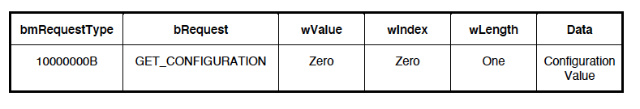

返り値が0の場合はデバイスがコンフィグレーションされていません。

`wValue`, `wIndex`, `wLength`のいずれかが表に示した値ではない場合、
デバイスの動作は規定されていません。

```
Default状態       デバイスがDefault状態の時にこのリクエストを受信した場合の
                  デバイスの動作は規定されていません。
Address状態       値0を返す必要があります。
Configurated状態  現在のコンフィグレーションの0でない`bConfigurationValue`を
                  返す必要があります。
```

### 9.4.3 Get Descriptor

このリクエストは指定されたディスクリプタが存在する場合、そのディスクリプタを
返します。

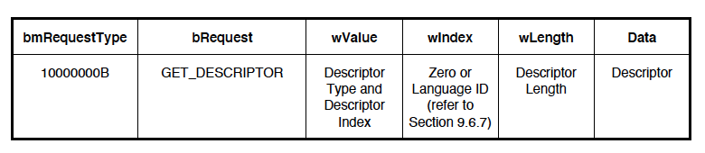

`wValue`フィールドは、上位バイトにはディスクリプタタイプ（表9-5を参照）、
下位バイトにはディクリプタインデックスを指定します。ディクリプタインデックス
はデバイスに同一タイプのディクリプタが複数実装されている場合に特定の
ディクリプタを選択するために使用します（コンフィグレーションディクリプタと
ストリングディクリプタのみ）。たとえば、デバイスは複数のコンフィギュ
レーションディスクリプタを実装することができます。GetDescriptor()リクエストで
取得可能なその他の標準的なディクリプタについてはディクリプタインデックスに
0を使用しなければなりません。ディクリプタインデックスに使用される値の範囲は
0からデバイスが実装しているそのタイプのディクリプタの数から1を引いた値まで
です。

`wIndex`フィールドはストリングディクリプタの場合は言語IDを指定し、その他の
ディクリプタの場合は0に設定します。`wLength`フィールドは返すべきバイト数を
指定します。ディスクリプタが`wLength`フィールドより長い場合はディスクリプタの
冒頭のバイトだけを返します。ディスクリプタが`wLength`フィールドより短い場合、
デバイスは、更なるデータが要求された際にショートパケットを送信することにより
コントロール転送の終了を示します。ショートパケットとは、最大ペイロードサイズ
より短いパケット、またはゼロ長のデータパケットと定義されています（5章参照）。

デバイスへの標準的なリクエストには、デバイス（device_qualifierを含む）、
コンフィグレーション（other_speed_configurationを含む）、ストリングの
3種類のディスクリプタがサポートされています。HS可能なデバイスは
device_qualifierディクリプタをサポートし、動作していない速度のデバイスに
関する情報（デフォルトエンドポイントの`wMaxPacketSize`とその他の速度の
コンフィグレーションの数を含みます）を返すことができます。
other_speed_configurationはコンフィグレーションディスクリプタと同じ形式で、
デバイスが他の速度で動作する場合のコンフィグレーションに関する情報を返し
ます。コンフィグレーションディスクリプタをリクエストすると、コンフィグ
レーションディスクリプタ、すべてのインタフェースディスクリプタ、すべての
インタフェースディスクリプタのエンドポイントディスクリプタを1回のリクエスト
で返します。最初のインタフェースディクリプタはコンフィグレーション
ディクリプタに続きます。最初のインタフェースのエンドポイントディスクリプタは
最初のインタフェースディスクリプタに続きます。追加のインタフェースがある場合、
それらのインタフェースディクリプタとそのエンドポイントディクリプタは最初の
インタフェースのエンドポイントディクリプタの後に続きます。クラス固有または
ベンダー固有のディクリプタはそれらが拡張または修正する標準的なディクリプタ
の後に続きます。

すべてのデバイスはデバイスディクリプタと少なくとも一つのコンフィグレーション
ディクリプタを提供しなければなりません。デバイスが要求されたディクリプタを
サポートしていない場合はRequest Errorで応答します。

```
Default状態       デバイスがDefault状態のとき、これは有効なリクエストです。
Address状態       デバイスがAddress状態のとき、これは有効なリクエストです。
Configurated状態  デバイスがConfigured状態のとき、これは有効なリクエストです。
```

### 0.4.4 Get Interface

このリクエストは指定されたインタフェースの選択された代替設定を返します。

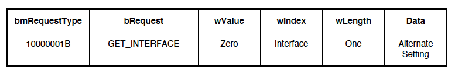

USBデバイスの中には互いに排他的な設定を持つインターフェイスでコンフィグ
レーションされるものがあります。このリクエストを使ってホストは現在選択
されている代替設定を決定することができます。

`wValue`または`wLength`が表に指定されたものでない場合、デバイスの動作は
規定されていません。

指定されたインタフェースが存在しない場合、デバイスはRequest Errorで応答します。

```
Default状態       デバイスがDefault状態の時にこのリクエストを受信した場合の
                  デバイスの動作は規定されていません。
Address状態       バイスからRequest Errorの応答がされます。
Configurated状態  デバイスがConfigured状態のとき、これは有効なリクエストです。
```

### 9.4.5 Get Status

このリクエストは指定された受信者の状態を返します。


`bmRequestType`フィールドの`Recipient`ビットは希望する受信者を指定します。
返されるデータは指定された受信者の現在の状態です。

`wValue`または`wLength`が表に示された値ではない場合、またはデバイス状態
リクエストの`wIndex`が0以外の場合、デバイスの動作は規定されていません。

存在しないインタフェースまたはエンドポイントが指定された場合、デバイスは
Request Errorで応答します。

```
Default状態       デバイスがDefault状態の時にこのリクエストを受信した場合の
                  デバイスの動作は規定されていません。
Address状態       エンドポイント0以外のインタフェースまたはエンドポイントが
                  指定された場合、デバイスはRequest Errorで応答します。
Configurated状態  存在しないインタフェースまたはエンドポイントが指定された
                  場合、デバイスはRequest Errorで応答します。
```

デバイスへの`GetStatus()`リクエストは図9-4に示す情報を返します。

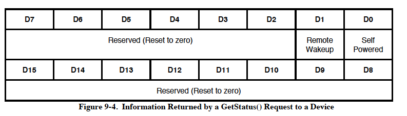

`Self Powered`フィールドは、デバイスが現在セルフパワーであるか否かを示します。
D0が0の場合デバイスはバスパワーで動作しています。D0が1に設定されている場合、
デバイスはセルフパワーです。`Self Powered`フィールドは`SetFeauture()`
リクエストや`ClearFeature()`リクエストで変更されることはありません。

`Remote Wakeup`フィールドは、デバイスが現在リモートウェイクアップをリクエスト
することが可能であるか否かを示します。リモートウェイクアップをサポートする
デバイスのデフォルトモードは無効です。D1が0の場合、デバイスのリモート
ウェイクアップ通知機能は無効です。D1を1に設定されている場合、デバイスの
リモートウェイクアップ通知機能は有効です。`Remote Wakeup`フィールドは
DEVICE_REMOTE_WAKEUP機能セレクタを使用して`SetFeature()`リクエストと
`ClearFeature()`リクエストで変更することができます。このフィールドは
デバイスがリセットされると0にリセットされます。

インタフェースへの`GetStatus()`リクエストは、図9-5に示す情報を返します。

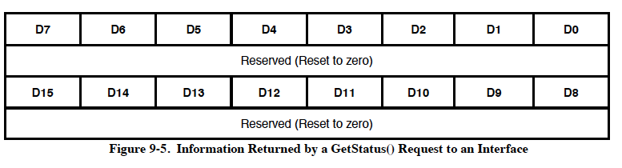

エンドポイントへの`GetStatus()`リクエストは、図9-6に示す情報を返します。

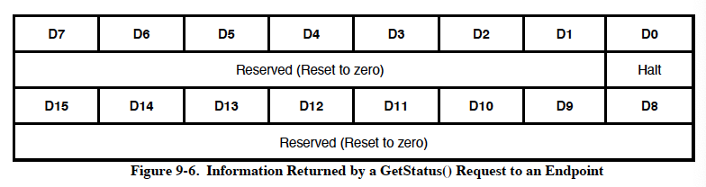

`Halt`機能機能はすべてのインタラプトエンドポイントタイプとバルクエンド
ポイントタイプに実装する必要があります。エンドポイントが現在停止している場合、
`Halt`機能は1に設定されます。そうでない場合、`Halt`機能は0にリセットされます。
`Halt`機能は`SetFeature(ENDPOINT_HALT)`リクエストで任意に設定することが
できます。SetFeature()リクエストによって設定された場合、エンドポイントは
このフィールドがハードウェア条件によって設定された場合と同じストール動作を
示します。停止を引き起こす条件が取り除かれた場合、ClearFeature(ENDPOINT_HALT)
リクエストで停止機能をクリアするとエンドポイントは`STALL`を返さなくなります。
データトグルを使用しているエンドポイントでは、エンドポイントにHalt機能が設定
されていたか否かに関係なく、clearFeature(ENDPOINT_HALT) リクエストにより
データトグルは常にDATA0に再初期化されます。リクエストされたコンフィグ
レーションまたはインターフェースが現在のコンフィグレーションまたは
インタフェースと同じであっても、SetConfiguration()リクエストとSetInterface()
リクエストの後には`Halt`機能は0にリセットされます。

デフォルトコントロールパイプに`Halt`機能を実装することは必須でも推奨でも
ありません。しかし、デバイスは機能的なエラー状態を反映させるためにデフォルト
コントロールパイプの`Halt`機能を設定することができます。この機能が1に設定
されている場合、デバイスはGetStatus()、SetFeature()、ClearFeature()の各
リクエストを除くパイプへの標準リクエストのデータステージとステータス
ステージでSTALLを返すことになります。クラス固有およびベンダー固有の
リクエスト要求に対してはデバイスはSTALLを返す必要はありません。

### 9.4.6 Set Address

このリクエストは将来のすべてのデバイスアクセスのためのアドレスをデバイスに
セットします。

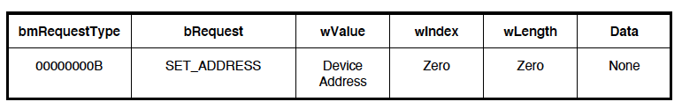

`wValue`フィールドにその後のすべてのアクセスに使用するデバイスアドレスを
指定します。

他の場所で述べたようにｍリクエストは実際には最大3つのステージからなります。
第1ステージでは、セットアップパケットがデバイスに送信されます。オプションの
第2ステージでは、ホストとデバイスの間でデータが送信されます。最終ステージ
では、ステータスがホストとデバイスの間で送信されます。データとステータスの
転送方向は、ホストがデータをデバイスに送るか、デバイスがデータをホストに
送るかによります。Statusステージの送信は常にDataステージの反対方向です。
Dataステージがない場合、Statusステージはデバイスからホストに送信されます。

最初のSetupパケット以降のステージではSetupパケットと同じデバイスアドレスを
想定します。USBデバイスは、このリクエストのStatusステージが正常に終了する
まで、デバイスアドレスを変更しません。この点が他のすべてのリクエストと
異なる点です。他のリクエストでは、Statusステージの前に指定された動作が完了
しなければなりません。

指定されたデバイスのアドレスが127より大きい場合、または、`wIndex`と`wLength`
のいずれかが0以外の場合、デバイスの動作は規定されていません。

SetAddress()に0を指定した場合のデバイスの応答は未定義です。

```
Default状態       指定されたアドレスが0でない場合、デバイスはAddress状態に
                  なります。そうでない場合、デバイスはデフォルト状態のまま
                  です（これはエラー状態ではありません）。
Address状態       指定されたアドレスが0の場合、デバイスはDefault状態に
                  なります。そうでない場合、デバイスはAddress状態にとどまり
                  ますが、新たに指定されたアドレスになります。
Configurated状態  デバイスがConfigured状態にあるときにこのリクエストを受信
                  した際のデバイスの動作は規定されていません。
```

### 9.4.7 Set Configuration

このリクエストはデバイスにコンフィグレーションをセットします。

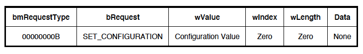

`wValue`フィールドの下位バイトには望ましいコンフィグレーションを指定
します。このコンフィグレーション値はゼロであるか、コンフィグレーション
ディスクリプタのコンフィグレーション値と一致しなければなりません。
コンフィグレーション値が0の場合、デバイスはアドレス状態になります。
`wValue`フィールドの上位バイトは予約されています。

`wIndex`, `wLength`, `wValue`の上位バイトのいずれかが0でない場合、この
リクエストの動作は規定されていません。

```
Default状態       デバイスがDefault状態にあるときにこのリクエストを受信
                  した際のデバイスの動作は規定されていません。
Address状態       指定されたコンフィグレーション値が0の場合、デバイスは
                  Address状態にとどまります。指定されたコンフィグレーション
                  値がコンフィグレーションディスクリプタのコンフィグ
                  レーション値と一致する場合、そのコンフィグレーション値が
                  選択され、デバイスはConfigurated状態になります。それ以外の
                  場合、デバイスはRequesst Errorで応答します。
Configurated状態  指定されたコンフィグレーション値が0の場合、デバイスは
                  Address状態になります。指定されたコンフィグレーション
                  値がコンフィグレーションディスクリプタのコンフィグ
                  レーション値と一致する場合、そのコンフィグレーション値が
                  選択され、デバイスはConfigurated状態にとどまります。それ
                  以外の場合、デバイスはRequesst Errorで応答します。
```

### 9.4.8 Set Descriptor

このリクエストはオプションであり、既存のディスクリプタを更新したり、新しい
ディスクリプタを追加するのに使用できます。

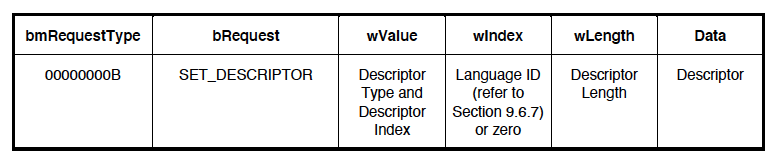

`wValue`フィールドは上位バイトにはディスクリプタタイプ（表9-5を参照）、
下位バイトにはディスクリプタインデックスを指定します。ディスクリプタ
インデックスは、デバイスに同一タイプのディスクリプタが複数実装されている
場合に、特定のディスクリプタを選択するために使用されます（コンフィグ
レーションディスクリプタとストリングディスクリプタのみ）。たとえば、
デバイスは複数のコンフィギュレーションディスクリプタを実装することができます。
その他の標準的なディスクリプタで、SetDescriptor()リクエストで設定可能な
ディスクリプタについては、ディスクリプタインデックスとして0を使用しなければ
なりません。ディスクリプタインデックスに使用される値の範囲は0からデバイスが
実装しているそのタイプのディスクリプタの数より1つ少ない値までです。

`wIndex`フィールドには、ストリングディスクリプタの場合は言語IDを、その他の
ディスクリプタの場合は0を設定します。`wLength`フィールドにはホストから
デバイスに送信するバイト数を指定します。

ディスクリプタタイプに指定できる値はデバイス、コンフィグレーション、
ストリングだけです。

このリクエストがサポートされていない場合、デバイスはRequest Errorで応答
します。

```
Default状態       デバイスがDefault状態にあるときにこのリクエストを受信
                  した際のデバイスの動作は規定されていません。
Address状態       サポートされている場合、デバイスがAddress状態にある時、
                  このリクエストは有効なリクエストです。
Configurated状態  サポートされている場合、デバイスがConfigurated状態にある時、
                  このリクエストは有効なリクエストです。
```

### 9.4.9 Set Feature

このリクエストは特定の機能をセットまたは有効にするのに使用されます。

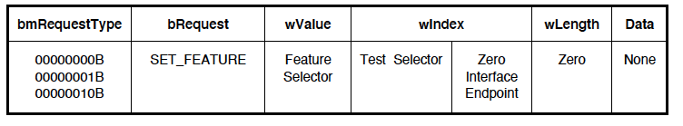

`wValue`の機能セレクタ値は受信者に適したものでなければならなりません。
受信者がデバイスの場合はデバイス機能セレクタ値だけが、受信者がインタフェース
の場合はインタフェース機能セレクタ値だけが、受信者がエンドポイントの場合は
エンドポイント機能セレクタ値だけが各々の使用可能です。

どの受信者にどの機能セレクタ値が定義されているかは表9-6を参照してください。

TEST_MODE機能は受信者がデバイス（すなわち、bmRequestType = 0）の場合にのみ
定義されており、`wIndex`の下位バイトは0でなければなりません。TEST_MODE機能を
設定すると、デバイスの上流側のポートがテストモードになります。リクエストに
無効なテストセレクタが含まれている場合、デバイスはリクエストエラーで応答
します。テストモードへの移行は、リクエストのステータスステージの終了後、
3ms以内に完了しなければなりません。上流側ポートのテストモードへの移行は
リクエストのステータスステージの後でなければなりません。デバイスの上流側
ポートのテストモードを終了するには、デバイスへの電源を再投入する必要が
あります。各テストモードの定義については7.1.20節を参照してください。
デバイスはDefault、Address、Configured HSの状態にあるときに、TEST_MODE
機能をサポートしなければなりません。

設定できない、または存在しない機能を参照しているSetFeature()リクエストには
リクエストのStatusステージでSTALLが返されます。

機能セレクタがTEST_MODEである場合、`wIndex`の最上位バイトは特定のテスト
モードを指定するために使用されます。SetFeature(TEST_MODE...)の受信者は
デバイスでなければなりません。すなわち、`wIndex`の下位バイトにはゼロが、`bmRequestType`には0が設定されていなければなりません。テストモードを終了
するにはデバイスの電源を再投入する必要があります。有効なテストモード
セレクタを表9-7に示しました。特定のテストモードの詳細については7.1.20節を
参照してください。

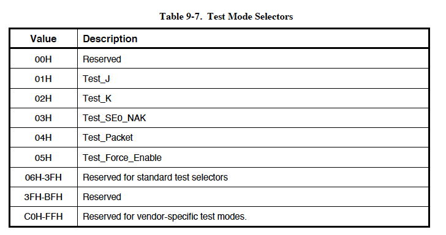

`wLength`が0でない場合、デバイスの動作は規定されていません。

存在しないエンドポイントまたはインタフェースが指定された場合、デバイスは
Request Errorで応答します。

```
Default状態       デバイスがDefault状態にある時はSetFeature(TEST_MODE,
                  TEST_SELECTOR)リクエストを受け入れることができなければ
                  なりません。Default状態にある時のその他のSetFeature
                  リクエストに対するデバイスの動作は規定されていません。
Address状態       インタフェースまたはエンドポイント0以外のエンドポイントが
                  指定された場合、デバイスはRequest Errorで応答します。
Configurated状態  デバイスがConfigurated状態にある時、このリクエストは
                  有効なリクエストです。
```

### 9.4.10 Set Interface

このリクエストはホストが指定したインタフェースの代替設定を選択することを
可能にします。

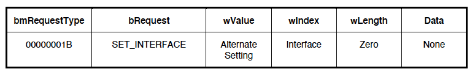

USBデバイスの中には相互に排他的な設定を持つインターフェースを持つ
コンフィグレーションを持つものがあります。このリクエストはホストが
希望する代替設定を選択することを可能にします。デバイスが指定された
インターフェイスでデフォルト設定しかサポートしない場合、リクエストの
StatusステージでSTALLが返されます。このリクエストを使ってコンフィグレーション済みのインタ
フェースのセットを変更することはできません（SetConfiguration() リクエストを
使用する必要があります）。

インタフェースまたは代替設定が存在しない場合、デバイスはRequest Errorで
応答します。`wLength`が0でない場合、デバイスの動作は規定されていません。

```
Default状態       デバイスがDefault状態にある時にこのリクエストを受信した
                  デバイスの動作は規定されていません。
Address状態       デバイスはRequest Errorで応答しなければなりません。
Configurated状態  デバイスがConfigurated状態にある時、このリクエストは
                  有効なリクエストです。
```

### 9.4.11 Synch Frame

このリクエストはエンドポイントの動機フレームをセットして報告するために
使用されます。


エンドポイントがアイソクロナス転送をサポートしている場合、エンドポイントは
特定のパターンに従ってサイズが変化するフレーム単位の転送を必要とすることも
あります。ホストとエンドポイントは繰り返しパターンがどのフレームから始まる
かについて合意しなければなりません。パターンが開始されたフレームの番号が
ホストに返されます。

HSデバイスがSynch Frameリクエストをサポートする場合、内部で0番目のマイクロ
フレームに同期させ、古典的なフレームの時間概念を持たなければなりません。
フレーム番号だけが同期に使用され、デバイスエンドポイントによって報告され
ます（マイクロフレーム番号はありません）。エンドポイントは0番目のマイクロ
フレームに同期させなければならない。

この値は暗黙のパターン同期を使用するアイソクロナスデータ転送にのみ使用
されます。`wValue`が0でない場合、または `wLength`が2でない場合、デバイスの
動作は規定されていません。

指定されたエンドポイントがこのリクエストをサポートしない場合、デバイスは
Request Errorで応答します。

```
Default状態       デバイスがDefault状態にある時にこのリクエストを受信した
                  デバイスの動作は規定されていません。
Address状態       デバイスはRequest Errorで応答しなければなりません。
Configurated状態  デバイスがConfigurated状態にある時、このリクエストは
                  有効なリクエストです。
```

## 9.5 ディスクリプタ

USBデバイスはディスクリプタを使用してその属性を報告します。
ディスクリプタとは定義された形式を持つデータ構造です。各ディスクリプタは
ディスクリプタの総バイト数を含む1バイトのフィールドで始まり、ディスクリプタの
タイプを識別する1バイトのフィールドが続きます。

ディスクリプタを使用することにより個々のコンフィグレーションの属性を簡潔に
保存することができます。なぜなら、各コンフィグレーションは同じ特性を持つ
他のコンフィグレーションのディスクリプタまたはディスクリプタの一部を再利用
することができるからです。このように、ディスクリプタはリレーショナルデータ
ベースにおける個々のデータ・レコードに似ています。

必要に応じて、ディスクリプタは人間が読める形式でディスクリプタを記述する
表示可能な情報を提供するストリングディスクリプタへの参照を含みます。
ストリングディスクリプタを含めることは任意ですが、ディスクリプタの参照
フィールドは必須です。デバイスがストリングディスクリプタをサポートしない
場合はストリング参照フィールドはセロにリセットしストリングディスクリプタが
利用できないことを示されなければならなりません。

ディスクリプタが本仕様で規定されている値より小さい値を持つlengthフィールドを
返した場合、そのディスクリプタは無効であり、ホストはこれを拒否する必要が
あります。ディスクリプタが本仕様で定義されている値より大きい値を持つlength
フィールドを返した場合、ホストは余分なバイトを無視しますが、次の
ディスクリプタの位置は期待される長さではなく返された長さを用いて特定します。

デバイスはクラス固有またはベンダ固有のディスクリプタを次の二つの方法で
返すことができます。

1. クラス固有またはベンダ固有のディスクリプタが標準ディスクリプタと同じ
   フォーマット（たとえば、長さバイトで始まり、タイプバイトが続く）を使用
   する場合、それらは GetDescriptor(Configuration) リクエストにより返される
   コンフィグレーション情報の標準ディスクリプタと対応して返されなければ
   なりません。この場合，クラス固有またはベンダ固有のディスクリプタは
   それらが変更または拡張する関連の標準ディスクリプタの後に続かなければ
   なりません。
2. クラス固有またはベンダー固有のディスクリプタがコンフィグレーション情報
   とは独立している、または非標準形式を使用している場合、クラス固有または
   ベンダ固有のディスクリプタのタイプとインデックスを指定したGetDescriptor()
   リクエストを使用してデバイスからディスクリプタを取得することができます。
   クラスまたはベンダーの仕様はこれらのディスクリプタを取得する適切な方法を
   定義します。
